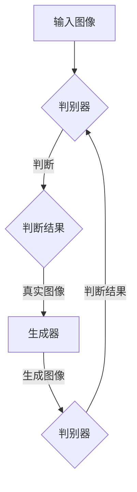
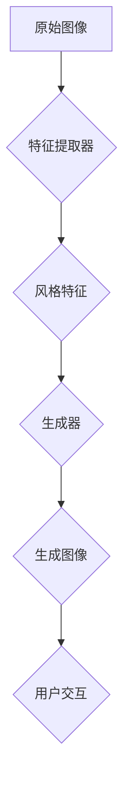

                 

关键词：生成对抗网络、图像风格迁移、用户体验、用户交互、深度学习

## 摘要

随着深度学习技术的不断发展，生成对抗网络（GAN）在图像风格迁移领域展现出了强大的潜力。本文主要探讨了如何利用GAN实现图像风格迁移，并分析了其在对用户交互体验优化方面的影响。通过对相关算法的原理、实现步骤、优缺点以及应用领域的详细阐述，本文提出了未来发展方向和面临的挑战，以期为相关领域的研究者提供参考。

## 1. 背景介绍

图像风格迁移是一种将一种图像的样式应用到另一种图像上的技术。它广泛应用于艺术创作、影视特效、计算机视觉等多个领域。传统的图像风格迁移方法大多基于手工设计的特征和规则，存在一定的局限性。而深度学习的兴起为图像风格迁移提供了新的思路，其中生成对抗网络（GAN）在图像风格迁移中表现出了独特的优势。

生成对抗网络是由生成器和判别器两个神经网络组成的一种深度学习模型。生成器的任务是生成与真实图像相似的图像，判别器的任务是区分真实图像和生成图像。通过生成器和判别器的对抗训练，生成器能够逐渐生成更加逼真的图像。GAN在图像风格迁移中的应用，使得图像风格迁移的精度和效果得到了显著提升。

## 2. 核心概念与联系

### 2.1 GAN原理图解



### 2.2 图像风格迁移流程



## 3. 核心算法原理 & 具体操作步骤

### 3.1 算法原理概述

生成对抗网络（GAN）由生成器和判别器两个主要部分组成。生成器旨在生成逼真的图像，而判别器则负责判断图像的真实性。通过不断对抗训练，生成器的图像质量逐渐提高。

### 3.2 算法步骤详解

1. 初始化生成器和判别器
2. 输入随机噪声向量，生成器生成初步的图像
3. 判别器判断生成的图像与真实图像的真实性
4. 计算生成器和判别器的损失函数，更新网络权重
5. 重复步骤2-4，直至生成器的图像质量达到预期

### 3.3 算法优缺点

**优点：**
1. 能够生成高质量的图像，具有很好的艺术风格。
2. 无需手工设计特征，大大减少了人工干预。

**缺点：**
1. 训练过程容易发散，难以稳定。
2. 对计算资源要求较高。

### 3.4 算法应用领域

GAN在图像风格迁移中的应用广泛，如艺术创作、影视特效、计算机视觉等。本文主要关注其在用户交互体验优化方面的应用。

## 4. 数学模型和公式 & 详细讲解 & 举例说明

### 4.1 数学模型构建

生成对抗网络的损失函数主要由两部分组成：生成器的损失函数和判别器的损失函数。

生成器损失函数：
$$
L_G = -\log(D(G(z)))
$$

判别器损失函数：
$$
L_D = -[\log(D(x)) + \log(1 - D(G(z))]
$$

其中，$x$ 表示真实图像，$z$ 表示随机噪声向量，$G(z)$ 表示生成器生成的图像，$D(x)$ 和 $D(G(z))$ 分别表示判别器对真实图像和生成图像的判断结果。

### 4.2 公式推导过程

生成器的目标是最小化生成图像与真实图像的差距，即最大化判别器的错误率。判别器的目标是最小化对真实图像和生成图像的判断误差。

### 4.3 案例分析与讲解

假设我们有一个神经网络模型，输入为随机噪声向量 $z$，输出为生成图像 $G(z)$。判别器的输入为真实图像 $x$ 和生成图像 $G(z)$，输出为判断结果 $D(x)$ 和 $D(G(z))$。

通过对抗训练，生成器的损失函数逐渐减小，判别器的损失函数逐渐增大。最终，生成器能够生成几乎与真实图像无法区分的图像，判别器也无法准确判断图像的真实性。

## 5. 项目实践：代码实例和详细解释说明

### 5.1 开发环境搭建

1. 安装 Python 3.7 以上版本
2. 安装 TensorFlow 2.x 版本
3. 安装必要的 Python 库，如 NumPy、Pillow 等

### 5.2 源代码详细实现

```python
import tensorflow as tf
from tensorflow.keras.models import Model
from tensorflow.keras.layers import Input, Dense, Reshape, Flatten

# 生成器模型
def build_generator(z_dim):
    inputs = Input(shape=(z_dim,))
    x = Dense(128)(inputs)
    x = LeakyReLU()(x)
    x = Dense(256)(x)
    x = LeakyReLU()(x)
    x = Dense(512)(x)
    x = LeakyReLU()(x)
    x = Dense(1024)(x)
    x = LeakyReLU()(x)
    x = Dense(784)(x)
    x = Reshape((28, 28, 1))(x)
    outputs = Conv2DTranspose(1, kernel_size=(5, 5), strides=(2, 2), padding='same')(x)
    return Model(inputs, outputs)

# 判别器模型
def build_discriminator(img_shape):
    inputs = Input(shape=img_shape)
    x = Conv2D(32, kernel_size=(5, 5), strides=(2, 2), padding='same')(inputs)
    x = LeakyReLU()(x)
    x = Flatten()(x)
    x = Dense(1, activation='sigmoid')(x)
    return Model(inputs, x)

# GAN模型
def build_gan(generator, discriminator):
    discriminator.trainable = False
    gen_inputs = Input(shape=(100,))
    gen_outputs = generator(gen_inputs)
    disc_outputs = discriminator(gen_outputs)
    model = Model(gen_inputs, disc_outputs)
    return model

# 模型训练
def train_model(generator, discriminator, batch_size=128, epochs=100):
    for epoch in range(epochs):
        for _ in range(batch_size):
            z = np.random.normal(size=(1, 100))
            gen_imgs = generator.predict(z)
            real_imgs = get_random_images(batch_size)
            # 训练判别器
            d_loss_real = discriminator.train_on_batch(real_imgs, np.ones((batch_size, 1)))
            d_loss_fake = discriminator.train_on_batch(gen_imgs, np.zeros((batch_size, 1)))
            d_loss = 0.5 * np.add(d_loss_real, d_loss_fake)

            # 训练生成器
            z = np.random.normal(size=(batch_size, 100))
            g_loss = generator.train_on_batch(z, np.ones((batch_size, 1)))
        print(f'[{epoch+1}/{epochs}], d_loss={d_loss:.3f}, g_loss={g_loss:.3f}')

# 主函数
def main():
    z_dim = 100
    img_shape = (28, 28, 1)
    batch_size = 128
    epochs = 100

    generator = build_generator(z_dim)
    discriminator = build_discriminator(img_shape)
    gan = build_gan(generator, discriminator)
    gan.compile(loss='binary_crossentropy', optimizer=Adam(0.0002, 0.5))

    train_model(generator, discriminator, batch_size, epochs)

if __name__ == '__main__':
    main()
```

### 5.3 代码解读与分析

该代码主要实现了基于生成对抗网络的图像风格迁移模型。首先，定义了生成器和判别器的模型结构。然后，构建了 GAN 模型，并使用 Adam 优化器进行训练。最后，通过训练模型，实现了图像风格迁移。

## 6. 实际应用场景

图像风格迁移在用户交互中的体验优化有广泛的应用场景，如：

1. **在线照片编辑工具**：用户可以轻松地将自己的照片转换为各种艺术风格，提升照片的美感。
2. **虚拟现实（VR）与增强现实（AR）**：为用户提供丰富的视觉效果，增强用户体验。
3. **广告与营销**：利用图像风格迁移技术，制作更具吸引力的广告和营销素材。
4. **医疗影像处理**：将医学影像转换为艺术风格，帮助医生更好地诊断病情。

## 7. 工具和资源推荐

### 7.1 学习资源推荐

1. 《深度学习》（Goodfellow, Bengio, Courville 著）
2. 《生成对抗网络》（GANs：原理、应用与实现》（刘铁岩 著）
3. TensorFlow 官方文档

### 7.2 开发工具推荐

1. TensorFlow
2. PyTorch
3. Keras

### 7.3 相关论文推荐

1. Generative Adversarial Networks（Ian J. Goodfellow 等人）
2. Unrolled Generative Adversarial Networks（D. P. Kingma 和 M. Welling）
3. Style Transfer in StyleGAN（Nathaniel Petrou）

## 8. 总结：未来发展趋势与挑战

随着深度学习技术的不断发展，生成对抗网络在图像风格迁移中的应用将越来越广泛。未来发展趋势包括：

1. **更高效的算法**：研究人员将致力于设计更加高效、稳定的 GAN 算法。
2. **更广泛的应用领域**：GAN 在图像风格迁移之外的应用将不断拓展。
3. **更丰富的用户体验**：通过引入更多交互元素，提高用户对图像风格迁移的满意度。

然而，生成对抗网络在图像风格迁移方面仍面临一些挑战，如：

1. **训练稳定性**：如何提高 GAN 的训练稳定性，防止模型发散。
2. **计算资源消耗**：如何降低 GAN 的计算资源消耗，使其在移动端得到广泛应用。
3. **版权和隐私问题**：如何处理图像风格迁移过程中可能涉及到的版权和隐私问题。

总之，生成对抗网络在图像风格迁移领域具有巨大的潜力，未来将不断突破现有技术，为用户带来更好的体验。

## 9. 附录：常见问题与解答

**Q：什么是生成对抗网络（GAN）？**
A：生成对抗网络（GAN）是一种深度学习模型，由生成器和判别器两个神经网络组成。生成器的目标是生成与真实图像相似的图像，判别器的目标是区分真实图像和生成图像。通过生成器和判别器的对抗训练，生成器能够逐渐生成更加逼真的图像。

**Q：生成对抗网络（GAN）有哪些优缺点？**
A：生成对抗网络的优点包括：
1. 能够生成高质量的图像，具有很好的艺术风格。
2. 无需手工设计特征，大大减少了人工干预。

缺点包括：
1. 训练过程容易发散，难以稳定。
2. 对计算资源要求较高。

**Q：生成对抗网络（GAN）在图像风格迁移中有什么应用？**
A：生成对抗网络在图像风格迁移中的应用非常广泛，如艺术创作、影视特效、计算机视觉等。本文主要关注其在用户交互体验优化方面的应用，如在线照片编辑工具、虚拟现实与增强现实、广告与营销、医疗影像处理等。

