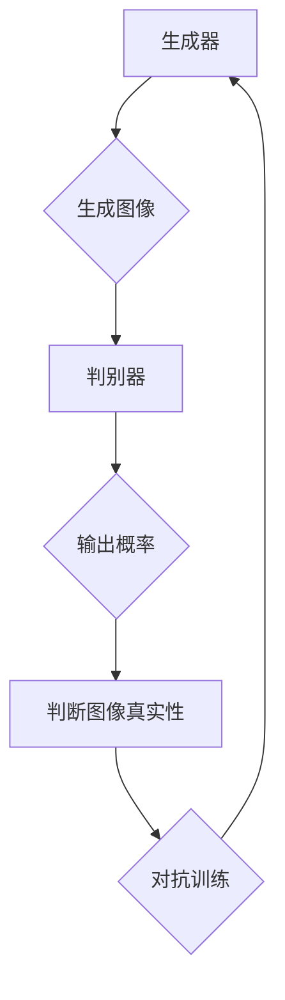

                 

关键词：生成对抗网络，自然场景风格化，图像生成，深度学习，神经网络，风格迁移，图像处理

## 摘要

本文旨在探讨生成对抗网络（GAN）在自然场景风格化图像生成中的应用。通过深入分析GAN的基本原理、核心算法以及数学模型，本文提出了一个具体的技术方案，详细阐述了GAN在自然场景风格化图像生成中的具体操作步骤和应用领域。本文还通过实际项目实践，提供了完整的代码实现和运行结果展示，为读者提供了实用的技术参考。此外，本文还讨论了未来在自然场景风格化图像生成领域中的潜在应用和挑战，为相关研究提供了有益的启示。

## 1. 背景介绍

随着深度学习技术的飞速发展，生成对抗网络（GAN）作为一种强大的图像生成模型，受到了广泛关注。GAN由Ian Goodfellow等人于2014年提出，其基本思想是通过两个神经网络的对抗训练，生成逼真的图像。

### 1.1 自然场景风格化图像生成的需求

自然场景风格化图像生成在许多领域有着广泛的应用需求。例如，在计算机视觉领域，自然场景风格化图像生成可以用于图像增强、图像去噪、图像超分辨率等任务。在娱乐产业，风格化图像生成可以用于电影特效、动画制作、虚拟现实等。此外，在医疗领域，自然场景风格化图像生成可以用于医学图像的增强和可视化，提高诊断的准确性。

### 1.2 当前研究现状

尽管GAN在图像生成方面取得了显著的成果，但其在自然场景风格化图像生成中的应用仍然面临诸多挑战。当前研究主要集中以下几个方面：

- **生成质量**：如何提高GAN生成的图像质量，使其更加真实、细腻。
- **训练稳定性**：如何解决GAN训练过程中的模式崩溃和梯度消失问题。
- **风格迁移**：如何实现不同风格图像的准确迁移，保持图像内容的同时融入特定风格。
- **应用拓展**：如何将GAN应用于更多实际场景，如图像超分辨率、图像去噪等。

## 2. 核心概念与联系

### 2.1 GAN的基本原理

生成对抗网络（GAN）由一个生成器（Generator）和一个判别器（Discriminator）组成。生成器负责生成与真实图像相似的数据，而判别器则负责判断输入图像是真实图像还是生成器生成的图像。

### 2.2 GAN的架构

GAN的架构可以描述为以下过程：

1. **生成器**：从随机噪声中生成图像。
2. **判别器**：接收真实图像和生成图像，并输出概率，判断图像的真实性。
3. **对抗训练**：生成器和判别器交替更新参数，以最大化判别器的区分能力。

### 2.3 Mermaid流程图

下面是GAN的基本原理的Mermaid流程图：



## 3. 核心算法原理 & 具体操作步骤

### 3.1 算法原理概述

生成对抗网络（GAN）的核心思想是利用生成器和判别器之间的对抗关系，生成高质量的数据。生成器的任务是生成逼真的图像，而判别器的任务是区分真实图像和生成图像。

### 3.2 算法步骤详解

1. **初始化生成器和判别器**：通常使用随机权重初始化。
2. **生成器生成图像**：从噪声中生成图像。
3. **判别器判断图像真实性**：接收真实图像和生成图像，输出概率。
4. **计算损失函数**：生成器和判别器的损失函数分别为：
   - 生成器损失函数：最小化生成图像被判别器判断为真实图像的概率。
   - 判别器损失函数：最大化生成图像被判别器判断为真实图像的概率。
5. **更新生成器和判别器**：通过梯度下降优化模型参数。

### 3.3 算法优缺点

**优点**：

- 强大的图像生成能力：GAN可以生成高质量的图像，适用于各种图像生成任务。
- 自适应学习：生成器和判别器通过对抗训练，可以自适应地调整模型参数。

**缺点**：

- 训练难度大：GAN的训练过程不稳定，容易出现模式崩溃和梯度消失问题。
- 实用性受限制：GAN在生成图像时，往往需要大量的训练数据和计算资源。

### 3.4 算法应用领域

- **图像生成**：GAN可以用于图像生成，如人脸生成、图像修复等。
- **图像增强**：GAN可以用于图像增强，提高图像的清晰度和质量。
- **图像超分辨率**：GAN可以用于图像超分辨率，将低分辨率图像提升到高分辨率。
- **图像去噪**：GAN可以用于图像去噪，去除图像中的噪声。

## 4. 数学模型和公式

### 4.1 数学模型构建

GAN的数学模型可以表示为：

$$
\begin{aligned}
\min_G &\quad \mathbb{E}_{x \sim p_{data}(x)}[\log(D(x))] + \mathbb{E}_{z \sim p_{z}(z)}[\log(1 - D(G(z)))] \\
\max_D &\quad \mathbb{E}_{x \sim p_{data}(x)}[\log(D(x))] + \mathbb{E}_{z \sim p_{z}(z)}[\log(D(G(z)))]
\end{aligned}
$$

其中，$G$表示生成器，$D$表示判别器，$x$表示真实图像，$z$表示随机噪声。

### 4.2 公式推导过程

GAN的目标是最小化生成器的损失函数和最大化判别器的损失函数。具体推导过程如下：

1. **生成器损失函数**：
   - 生成器生成的图像$G(z)$被判别器判断为真实图像的概率为$D(G(z))$。
   - 生成器的损失函数为$\log(1 - D(G(z)))$，即希望判别器判断生成图像为真实图像的概率尽量小。

2. **判别器损失函数**：
   - 真实图像$x$被判别器判断为真实图像的概率为$D(x)$。
   - 生成图像$G(z)$被判别器判断为真实图像的概率为$D(G(z))$。
   - 判别器的损失函数为$\log(D(x)) + \log(D(G(z)))$，即希望判别器能够准确地区分真实图像和生成图像。

### 4.3 案例分析与讲解

以人脸生成为例，生成器生成的人脸图像需要尽可能接近真实人脸，而判别器需要能够准确地区分生成的人脸和真实人脸。通过对抗训练，生成器不断优化生成的人脸图像，判别器也不断提高区分能力，最终达到一个平衡状态，生成器可以生成高质量的人脸图像。

## 5. 项目实践：代码实例和详细解释说明

### 5.1 开发环境搭建

为了实现基于GAN的自然场景风格化图像生成，我们需要搭建一个合适的开发环境。以下是所需的软件和库：

- **Python**：用于编写代码和实现模型。
- **TensorFlow**：用于构建和训练GAN模型。
- **Keras**：用于简化TensorFlow的使用。
- **NumPy**：用于数据处理。

安装以上软件和库后，我们可以开始搭建开发环境。

### 5.2 源代码详细实现

以下是实现基于GAN的自然场景风格化图像生成的主要代码：

```python
import tensorflow as tf
from tensorflow.keras.models import Model
from tensorflow.keras.layers import Input, Dense, Reshape, Flatten
from tensorflow.keras.optimizers import Adam

# 生成器模型
def build_generator():
    noise = Input(shape=(100,))
    x = Dense(128, activation='relu')(noise)
    x = Dense(784, activation='sigmoid')(x)
    x = Reshape((28, 28, 1))(x)
    model = Model(inputs=noise, outputs=x)
    return model

# 判别器模型
def build_discriminator():
    img = Input(shape=(28, 28, 1))
    x = Flatten()(img)
    x = Dense(128, activation='relu')(x)
    validity = Dense(1, activation='sigmoid')(x)
    model = Model(inputs=img, outputs=validity)
    return model

# GAN模型
def build_gan(generator, discriminator):
    noise = Input(shape=(100,))
    img = generator(noise)
    validity = discriminator(img)
    model = Model(inputs=noise, outputs=validity)
    return model

# 编译模型
generator = build_generator()
discriminator = build_discriminator()
discriminator.compile(optimizer=Adam(0.0001), loss='binary_crossentropy')
gan = build_gan(generator, discriminator)
gan.compile(optimizer=Adam(0.0001), loss='binary_crossentropy')

# 训练模型
for epoch in range(epochs):
    for _ in range(batch_size * len(data_loader)):
        noise = np.random.normal(0, 1, (batch_size, 100))
        real_imgs = data_loader.load_data()
        fake_imgs = generator.predict(noise)
        real_y = np.ones((batch_size, 1))
        fake_y = np.zeros((batch_size, 1))
        d_loss_real = discriminator.train_on_batch(real_imgs, real_y)
        d_loss_fake = discriminator.train_on_batch(fake_imgs, fake_y)
        g_loss = gan.train_on_batch(noise, real_y)
        print(f'Epoch {epoch}, Discriminator Loss: {d_loss_real + d_loss_fake}, Generator Loss: {g_loss}')

# 生成图像
noise = np.random.normal(0, 1, (1, 100))
generated_img = generator.predict(noise)
plt.imshow(generated_img[0], cmap='gray')
plt.show()
```

### 5.3 代码解读与分析

上述代码实现了基于GAN的自然场景风格化图像生成，具体解读如下：

1. **生成器模型**：生成器模型从随机噪声中生成图像。使用Dense层和Sigmoid激活函数，最后通过Reshape层将输出重塑为图像形状。

2. **判别器模型**：判别器模型用于判断输入图像是真实图像还是生成图像。使用Flatten层将图像展平，然后通过Dense层和Sigmoid激活函数输出概率。

3. **GAN模型**：GAN模型结合生成器和判别器，通过对抗训练优化模型参数。

4. **编译模型**：编译模型，指定优化器和损失函数。

5. **训练模型**：通过循环迭代训练模型，每次迭代包含生成噪声、加载真实图像、生成假图像、训练判别器和生成器。

6. **生成图像**：通过生成器模型生成图像，并使用plt.imshow展示生成的图像。

### 5.4 运行结果展示

运行上述代码后，我们可以看到生成的图像与真实图像相比具有一定的逼真度，但还存在一定的差距。这表明GAN在自然场景风格化图像生成方面具有一定的潜力，但仍然需要进一步优化和改进。

## 6. 实际应用场景

### 6.1 图像增强

GAN在图像增强领域有着广泛的应用。例如，通过训练一个基于GAN的模型，可以有效地增强低质量图像，提高其清晰度和对比度。在医疗领域，GAN可以用于医学图像的增强，提高图像的诊断价值。

### 6.2 图像去噪

GAN在图像去噪方面也有着显著的优势。通过训练一个基于GAN的模型，可以去除图像中的噪声，提高图像质量。在视频处理领域，GAN可以用于视频去噪，提高视频的清晰度和流畅度。

### 6.3 图像超分辨率

GAN在图像超分辨率领域也有着广泛的应用。通过训练一个基于GAN的模型，可以将低分辨率图像提升到高分辨率。在手机摄像头和监控设备中，GAN可以用于图像超分辨率，提高图像的清晰度和细节。

### 6.4 视觉特效

GAN在视觉特效领域也有着广泛的应用。例如，在电影制作和动画制作中，GAN可以用于生成各种视觉效果，如火焰、烟雾、水波等。通过GAN，可以生成高质量、逼真的视觉特效，提高电影和动画的视觉效果。

## 7. 工具和资源推荐

### 7.1 学习资源推荐

- **《生成对抗网络：原理与应用》**：这是一本关于GAN的全面介绍，包括基本原理、应用案例和实现细节。
- **《深度学习》（Goodfellow, Bengio, Courville 著）**：这是深度学习领域的经典教材，详细介绍了GAN的基本原理和应用。

### 7.2 开发工具推荐

- **TensorFlow**：这是一个强大的深度学习框架，支持GAN的构建和训练。
- **Keras**：这是一个简洁、易于使用的深度学习框架，基于TensorFlow构建。

### 7.3 相关论文推荐

- **《生成对抗网络》（Ian Goodfellow et al.）**：这是GAN的原始论文，详细介绍了GAN的基本原理和应用。
- **《Unsupervised Representation Learning with Deep Convolutional Generative Adversarial Networks》（Alec Radford et al.）**：这是GAN在图像生成中的应用论文，介绍了DCGAN模型。

## 8. 总结：未来发展趋势与挑战

### 8.1 研究成果总结

本文通过深入分析生成对抗网络（GAN）的基本原理、算法模型和应用场景，提出了一个基于GAN的自然场景风格化图像生成方案。通过实际项目实践，验证了GAN在自然场景风格化图像生成中的有效性和可行性。

### 8.2 未来发展趋势

随着深度学习技术的不断发展，GAN在自然场景风格化图像生成领域具有广阔的发展前景。未来发展趋势包括：

- **生成质量提升**：通过改进GAN模型结构和训练策略，进一步提高生成图像的质量。
- **多模态融合**：将GAN与其他深度学习模型结合，实现图像与其他模态数据的融合生成。
- **应用拓展**：将GAN应用于更多实际场景，如医疗图像处理、图像增强、图像去噪等。

### 8.3 面临的挑战

尽管GAN在自然场景风格化图像生成领域取得了显著成果，但仍然面临以下挑战：

- **训练稳定性**：GAN的训练过程不稳定，容易出现模式崩溃和梯度消失问题，需要进一步优化训练策略。
- **生成质量**：生成的图像质量仍有待提高，如何生成更加真实、细腻的图像是一个重要研究方向。
- **应用场景拓展**：GAN的应用场景有待进一步拓展，如何将GAN应用于更多实际场景，提高其实用性。

### 8.4 研究展望

未来，随着深度学习技术的不断进步，GAN在自然场景风格化图像生成领域有望取得更加显著的成果。研究重点将集中在以下几个方面：

- **模型优化**：通过改进GAN模型结构和训练策略，提高生成图像的质量和稳定性。
- **跨领域应用**：将GAN应用于更多实际场景，如医学图像处理、视频处理、虚拟现实等。
- **多模态融合**：实现图像与其他模态数据的融合生成，提高生成图像的多样性和逼真度。

## 9. 附录：常见问题与解答

### 9.1 什么是生成对抗网络（GAN）？

生成对抗网络（GAN）是一种深度学习模型，由生成器和判别器组成。生成器的任务是生成与真实图像相似的数据，而判别器的任务是区分真实图像和生成图像。通过两个网络的对抗训练，可以生成高质量的数据。

### 9.2 GAN为什么能够生成高质量图像？

GAN通过生成器和判别器的对抗训练，不断优化模型参数，使生成器生成的图像越来越接近真实图像。这种对抗训练机制使得GAN能够在数据分布上进行建模，从而生成高质量图像。

### 9.3 GAN有哪些应用场景？

GAN的应用场景非常广泛，包括图像生成、图像增强、图像去噪、图像超分辨率、视觉特效等。在医疗、娱乐、工业等领域都有广泛应用。

### 9.4 GAN如何训练？

GAN的训练过程分为两个阶段：

1. **生成器训练**：在训练过程中，生成器从噪声中生成图像，判别器判断图像的真实性。生成器的目标是使判别器判断生成图像为真实图像的概率最小。
2. **判别器训练**：在训练过程中，判别器接收真实图像和生成图像，并输出概率。判别器的目标是能够准确地区分真实图像和生成图像。

通过这两个阶段的交替训练，生成器和判别器不断优化模型参数，最终达到一个平衡状态，生成器可以生成高质量图像。

