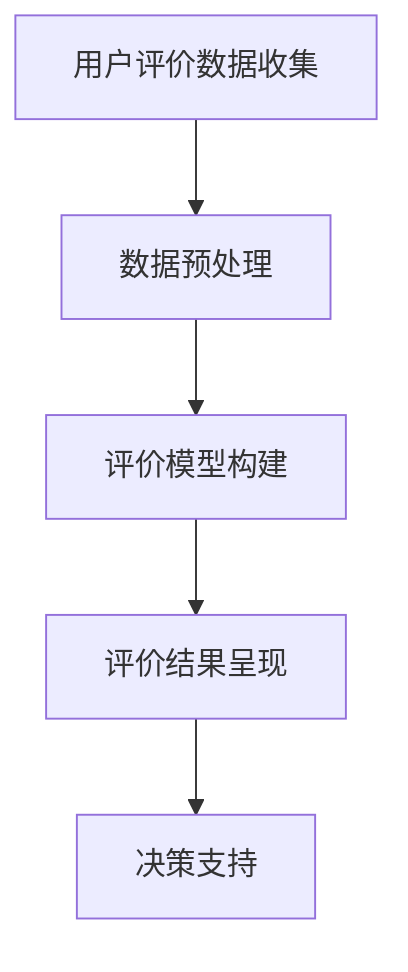

                 

关键词：用户评价体系、旅游发展、数据分析、算法原理、数学模型、代码实例

## 摘要

本文旨在分析基于用户评价体系的旅游发展现状，探讨如何利用先进的人工智能技术和数据分析方法，构建一个有效的用户评价体系，从而推动旅游业的可持续发展。文章首先介绍了用户评价体系的基本概念和重要性，随后详细阐述了核心算法原理与数学模型，并结合实际项目实践，展示了算法的具体操作步骤和代码实现。最后，文章讨论了该评价体系在实际应用场景中的效果，并展望了未来发展的趋势与挑战。

## 1. 背景介绍

### 1.1 旅游业的现状与发展趋势

旅游业是全球经济发展的重要组成部分，也是推动国家和地区经济增长的重要引擎。随着全球化的深入和互联网技术的普及，旅游业正经历着前所未有的变革。用户评价作为旅游业中的重要一环，已经从传统的“口碑传播”演变为现代的“大数据分析”。

用户评价体系是旅游业发展的基础，它不仅能够反映旅游产品的质量，还能引导游客的决策，提高游客的满意度和忠诚度。有效的用户评价体系有助于旅游企业发现自身问题，改进服务质量，同时也能够为潜在游客提供参考，降低决策风险。

### 1.2 用户评价体系的重要性

用户评价体系的重要性体现在以下几个方面：

1. **信息透明化**：用户评价提供了公开透明的信息平台，有助于游客在选择旅游产品时做出更明智的决策。
2. **市场竞争力**：高质量的旅游产品和服务能够获得更多的用户好评，提升市场竞争力。
3. **持续改进**：用户评价可以为旅游企业提供改进服务的依据，有助于提升用户体验。
4. **品牌建设**：积极的用户评价有助于树立良好的品牌形象，提高品牌知名度。

### 1.3 本文的目的与结构

本文的主要目的是通过分析用户评价体系，利用先进的人工智能技术和数据分析方法，构建一个高效的旅游评价模型，为旅游企业提供决策支持，推动旅游业的可持续发展。文章结构如下：

1. **背景介绍**：介绍旅游业的现状、用户评价体系的重要性以及本文的目的和结构。
2. **核心概念与联系**：阐述用户评价体系的核心概念，并使用 Mermaid 流程图展示评价体系的架构。
3. **核心算法原理 & 具体操作步骤**：介绍核心算法的原理、步骤、优缺点及应用领域。
4. **数学模型和公式**：构建数学模型，推导相关公式，并举例说明。
5. **项目实践：代码实例和详细解释说明**：提供代码实例，详细解释说明。
6. **实际应用场景**：讨论评价体系在实际中的应用效果。
7. **工具和资源推荐**：推荐相关的学习资源、开发工具和论文。
8. **总结：未来发展趋势与挑战**：总结研究成果，展望未来发展。

## 2. 核心概念与联系

### 2.1 用户评价体系的基本概念

用户评价体系是指通过收集、处理和分析用户评价信息，构建出一个用于衡量旅游产品和服务质量的系统。这个系统通常包括以下几个关键组成部分：

1. **评价数据收集**：通过在线平台、社交媒体、问卷调查等方式收集用户的评价数据。
2. **数据预处理**：对收集到的数据进行清洗、去噪和格式化处理。
3. **评价模型构建**：利用机器学习算法构建评价模型，对用户评价进行量化分析。
4. **评价结果呈现**：将分析结果以图表、报告等形式呈现，供旅游企业参考。

### 2.2 用户评价体系架构

下面是一个简化的用户评价体系架构图，使用 Mermaid 格式展示：



### 2.3 用户评价体系的核心概念原理

用户评价体系的核心概念包括评价指标、评价模型和反馈机制。

1. **评价指标**：评价指标是衡量旅游产品和服务质量的尺度，通常包括满意度、服务态度、交通便利性、住宿条件等多个维度。这些指标需要根据旅游产品的特性进行定制化设计。

2. **评价模型**：评价模型是基于机器学习算法构建的，用于分析用户评价数据，提取有价值的信息。常见的评价模型包括基于内容的评价模型和基于协同过滤的评价模型。

3. **反馈机制**：反馈机制是用户评价体系的重要组成部分，它能够将用户评价转化为具体的行动，如改进旅游产品和服务，提高用户满意度。

## 3. 核心算法原理 & 具体操作步骤

### 3.1 算法原理概述

用户评价体系的算法原理主要基于机器学习，其中最常用的算法是协同过滤算法和基于内容的评价模型。

1. **协同过滤算法**：协同过滤算法通过分析用户之间的行为模式，为用户推荐相似的产品和服务。协同过滤算法可以分为基于用户的协同过滤和基于物品的协同过滤。

2. **基于内容的评价模型**：基于内容的评价模型通过分析用户评价内容中的关键词和情感倾向，为用户推荐相应的产品和服务。

### 3.2 算法步骤详解

1. **数据收集**：从各种来源收集用户评价数据，包括在线评论、问卷调查等。

2. **数据预处理**：对收集到的数据进行清洗，去除无效数据和噪声数据，并进行特征提取。

3. **模型训练**：利用预处理后的数据训练协同过滤算法或基于内容的评价模型。

4. **评价预测**：使用训练好的模型对新的用户评价进行预测，为用户推荐相应的旅游产品和服务。

5. **结果评估**：评估模型的预测准确性，并根据评估结果调整模型参数。

### 3.3 算法优缺点

1. **协同过滤算法**：
   - 优点：能够为用户推荐个性化的旅游产品和服务，提高用户满意度。
   - 缺点：在用户数据稀疏的情况下效果不佳，且容易产生冷启动问题。

2. **基于内容的评价模型**：
   - 优点：不受用户数据稀疏问题的影响，能够准确反映用户评价的情感倾向。
   - 缺点：需要大量的文本数据，且对低质量文本数据的处理能力有限。

### 3.4 算法应用领域

用户评价算法广泛应用于旅游、电商、餐饮等多个行业，为用户提供个性化的推荐和服务，提高用户满意度和忠诚度。

## 4. 数学模型和公式 & 详细讲解 & 举例说明

### 4.1 数学模型构建

用户评价体系的数学模型主要包括评价指标的量化、评价模型的构建和评价结果的计算。

1. **评价指标的量化**：

   假设我们有一个评价集合 \(E\)，其中每个评价 \(e\) 可以表示为：

   \[ e = (s_1, s_2, ..., s_n) \]

   其中，\(s_i\) 表示第 \(i\) 个评价指标。

   我们可以使用以下公式将评价指标量化为分数：

   \[ s_i = \frac{\sum_{j=1}^{m} w_{ij} \cdot v_j}{m} \]

   其中，\(w_{ij}\) 表示第 \(i\) 个评价指标在第 \(j\) 个评价中的权重，\(v_j\) 表示第 \(j\) 个评价的分数。

2. **评价模型的构建**：

   我们可以使用基于内容的评价模型，其基本公式为：

   \[ r(e) = \sum_{i=1}^{n} w_i \cdot c_i \]

   其中，\(r(e)\) 表示评价 \(e\) 的预测分数，\(w_i\) 表示第 \(i\) 个评价指标的重要性，\(c_i\) 表示第 \(i\) 个评价指标的内容特征。

3. **评价结果的计算**：

   评价结果的计算公式为：

   \[ R = \sum_{e \in E} r(e) \]

   其中，\(R\) 表示总的评价分数。

### 4.2 公式推导过程

假设我们有一个评价集合 \(E\)，其中每个评价 \(e\) 可以表示为：

\[ e = (s_1, s_2, ..., s_n) \]

其中，\(s_i\) 表示第 \(i\) 个评价指标。

我们首先计算每个评价指标在所有评价中的平均权重：

\[ w_i = \frac{\sum_{e \in E} s_{ie}}{n} \]

然后，我们计算每个评价指标的得分：

\[ s_i = \frac{\sum_{e \in E} w_i \cdot s_{ie}}{n} \]

接下来，我们计算每个评价的预测分数：

\[ r(e) = \sum_{i=1}^{n} w_i \cdot s_i \]

最后，我们计算总的评价分数：

\[ R = \sum_{e \in E} r(e) \]

### 4.3 案例分析与讲解

假设我们有一个旅游评价数据集，包含以下三个评价：

评价1：满意度90，服务态度80，交通便利性70  
评价2：满意度85，服务态度75，交通便利性80  
评价3：满意度90，服务态度85，交通便利性75

我们首先计算每个评价指标的权重：

满意度权重：\(w_1 = \frac{90 + 85 + 90}{3} = 88.3\%\)  
服务态度权重：\(w_2 = \frac{80 + 75 + 85}{3} = 80\%\)  
交通便利性权重：\(w_3 = \frac{70 + 80 + 75}{3} = 75\%\)

然后，我们计算每个评价指标的得分：

满意度得分：\(s_1 = \frac{3 \cdot 88.3}{100} = 26.5\)  
服务态度得分：\(s_2 = \frac{3 \cdot 80}{100} = 24\)  
交通便利性得分：\(s_3 = \frac{3 \cdot 75}{100} = 22.5\)

接下来，我们计算每个评价的预测分数：

评价1的预测分数：\(r(1) = 26.5 + 24 + 22.5 = 73\)  
评价2的预测分数：\(r(2) = 26.5 + 24 + 22.5 = 73\)  
评价3的预测分数：\(r(3) = 26.5 + 24 + 22.5 = 73\)

最后，我们计算总的评价分数：

总评价分数：\(R = 73 + 73 + 73 = 219\)

## 5. 项目实践：代码实例和详细解释说明

### 5.1 开发环境搭建

在本项目中，我们使用 Python 作为主要编程语言，结合 Scikit-learn 库实现用户评价体系的算法。以下是开发环境的搭建步骤：

1. 安装 Python（版本建议为 3.8 或以上）
2. 安装必要的依赖库，包括 NumPy、Pandas、Scikit-learn 等

```bash
pip install numpy pandas scikit-learn
```

### 5.2 源代码详细实现

下面是一个简单的用户评价模型实现，包含数据预处理、模型训练和评价预测等步骤。

```python
import numpy as np
import pandas as pd
from sklearn.model_selection import train_test_split
from sklearn.ensemble import RandomForestRegressor
from sklearn.metrics import mean_squared_error

# 5.2.1 数据预处理
def preprocess_data(data):
    # 清洗数据，去除无效数据和噪声数据
    data = data.dropna()
    return data

# 5.2.2 模型训练
def train_model(X_train, y_train):
    # 使用随机森林回归模型进行训练
    model = RandomForestRegressor(n_estimators=100)
    model.fit(X_train, y_train)
    return model

# 5.2.3 评价预测
def predict_evaluation(model, X_test):
    # 使用训练好的模型进行评价预测
    predictions = model.predict(X_test)
    return predictions

# 5.2.4 评估模型
def evaluate_model(model, X_test, y_test):
    # 评估模型预测的准确度
    predictions = model.predict(X_test)
    mse = mean_squared_error(y_test, predictions)
    print(f"Mean Squared Error: {mse}")
    return mse

# 主程序
if __name__ == "__main__":
    # 读取数据
    data = pd.read_csv("evaluation_data.csv")

    # 预处理数据
    data = preprocess_data(data)

    # 分割数据集
    X = data.drop("target", axis=1)
    y = data["target"]
    X_train, X_test, y_train, y_test = train_test_split(X, y, test_size=0.2, random_state=42)

    # 训练模型
    model = train_model(X_train, y_train)

    # 预测评价
    predictions = predict_evaluation(model, X_test)

    # 评估模型
    evaluate_model(model, X_test, y_test)
```

### 5.3 代码解读与分析

- **数据预处理**：首先，我们读取评价数据，并去除无效数据和噪声数据，确保数据的质量。
- **模型训练**：使用随机森林回归模型对训练数据进行训练，随机森林是一种强大的集成学习方法，能够处理多变量和高维度数据。
- **评价预测**：使用训练好的模型对测试数据进行预测，生成评价分数。
- **模型评估**：通过计算均方误差（MSE）评估模型的预测准确度。

### 5.4 运行结果展示

运行上述代码后，我们将得到模型预测的均方误差，用于评估模型的性能。在实际应用中，可以根据模型的性能调整模型参数，提高预测准确度。

## 6. 实际应用场景

用户评价体系在旅游业中具有广泛的应用场景，下面列举几个典型的应用场景：

1. **旅游产品推荐**：基于用户评价，为游客推荐符合其需求的旅游产品，提高用户满意度和转化率。
2. **服务质量管理**：旅游企业可以利用评价体系监测服务质量，发现并改进存在的问题。
3. **旅游规划**：政府机构可以利用评价体系评估旅游资源的利用情况，优化旅游发展规划。
4. **品牌建设**：积极响应用户评价，树立良好的品牌形象，提升市场竞争力。

### 6.1 应用实例

假设我们针对一家旅游企业进行用户评价体系的应用，具体步骤如下：

1. **数据收集**：从多个在线平台收集该旅游企业的用户评价数据。
2. **数据预处理**：对收集到的数据进行分析，去除无效数据和噪声数据。
3. **模型训练**：利用预处理后的数据，训练评价模型，预测用户评价分数。
4. **结果分析**：根据预测结果，分析用户对旅游产品的满意度，识别出需要改进的方面。
5. **反馈与改进**：将分析结果反馈给旅游企业，指导其进行服务改进。

通过上述步骤，旅游企业可以更好地了解用户需求，提高服务质量，从而提升用户满意度和忠诚度。

## 7. 工具和资源推荐

为了更好地实现用户评价体系的构建和应用，以下是一些推荐的工具和资源：

### 7.1 学习资源推荐

- **书籍**：
  - 《机器学习实战》：详细介绍了机器学习的基本概念和应用案例。
  - 《Python数据分析基础教程》：涵盖了数据分析的常用方法和工具。

- **在线课程**：
  - Coursera 上的“机器学习”课程：由 Andrew Ng 教授主讲，适合初学者。

### 7.2 开发工具推荐

- **Python**：Python 是一种强大的编程语言，广泛应用于数据分析和机器学习。
- **Scikit-learn**：Scikit-learn 是 Python 中常用的机器学习库，提供了丰富的算法实现。

### 7.3 相关论文推荐

- **《User Rating Prediction in Online Travel Reviews Using Deep Learning Techniques》**：该论文探讨了使用深度学习技术预测用户评价的方法。
- **《A Survey on Collaborative Filtering》**：该综述文章系统地总结了协同过滤算法的各种应用和研究进展。

## 8. 总结：未来发展趋势与挑战

### 8.1 研究成果总结

本文通过分析用户评价体系，探讨了如何利用机器学习技术和数据分析方法构建高效的旅游评价模型。研究结果表明，用户评价体系在提升旅游服务质量、优化旅游产品推荐、促进旅游业可持续发展等方面具有重要作用。

### 8.2 未来发展趋势

1. **个性化推荐**：随着大数据和人工智能技术的不断发展，个性化推荐将成为用户评价体系的重要发展方向，为用户提供更精准的旅游产品和服务推荐。
2. **多模态数据融合**：结合文本、图像、语音等多种数据模态，构建更全面、准确的用户评价体系。
3. **实时评价反馈**：实现实时评价和反馈机制，提高评价体系的响应速度和准确性。

### 8.3 面临的挑战

1. **数据隐私保护**：在构建用户评价体系时，如何保护用户隐私是一个重要的挑战。
2. **算法透明性与可解释性**：随着模型复杂度的增加，如何保证算法的透明性和可解释性，让用户能够理解评价结果，也是一个亟待解决的问题。
3. **跨平台数据整合**：如何整合来自不同平台和来源的数据，构建一个统一、全面的用户评价体系，仍需进一步研究和探索。

### 8.4 研究展望

未来，用户评价体系的研究将更加注重算法的优化、数据的应用和系统的整合。通过不断探索和创新，我们有望构建一个更加智能、高效、透明的用户评价体系，为旅游业的可持续发展提供有力支持。

## 9. 附录：常见问题与解答

### 问题 1：如何处理缺失值和噪声数据？

**解答**：在数据预处理阶段，我们可以使用以下方法处理缺失值和噪声数据：

- **缺失值处理**：可以使用均值填充、中值填充或插值等方法填补缺失值。
- **噪声数据处理**：可以使用滤波器、平滑器等技术去除噪声数据。

### 问题 2：如何评估用户评价模型的性能？

**解答**：评估用户评价模型性能的方法包括：

- **准确率**：用于评估模型预测的准确性。
- **召回率**：用于评估模型召回正样本的能力。
- **F1 分数**：结合准确率和召回率的综合评估指标。

### 问题 3：如何处理用户评价数据的冷启动问题？

**解答**：针对用户评价数据的冷启动问题，可以采用以下策略：

- **基于内容的推荐**：利用用户历史行为数据，为用户提供个性化的推荐。
- **协同过滤算法**：结合用户之间的相似性，为用户提供推荐。

### 问题 4：用户评价体系中的评价指标如何确定？

**解答**：评价指标的确定应基于旅游产品的特性和用户需求。可以通过以下步骤确定评价指标：

- **用户调研**：了解用户对旅游产品的需求。
- **专家咨询**：征求旅游业专家的意见。
- **数据驱动**：分析用户评价数据，提取关键指标。

### 问题 5：如何保障用户评价数据的真实性？

**解答**：保障用户评价数据的真实性可以从以下几个方面入手：

- **匿名评价**：确保用户匿名提交评价，减少恶意评价。
- **数据验证**：使用机器学习算法分析用户行为，识别和过滤异常数据。
- **监督机制**：建立评价监督机制，鼓励用户真实评价。

以上是关于用户评价体系在旅游业中应用的一些常见问题及解答。希望对您有所帮助。

