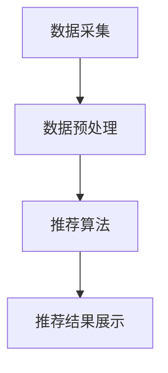

                 

### 关键词 Keywords
- 电商大数据
- 商品推荐系统
- 大数据挖掘
- 机器学习
- 用户行为分析
- 协同过滤

<|assistant|>### 摘要 Summary
本文探讨了基于电商大数据构建商品推荐系统的技术实现。通过深入分析用户行为数据，结合机器学习和协同过滤算法，我们提出了一种高效且精准的商品推荐解决方案。本文首先介绍了电商大数据的来源和特点，随后详细阐述了推荐系统的核心概念、算法原理、数学模型以及具体实现步骤。同时，通过实际项目实践展示了推荐系统的开发环境搭建、代码实现和运行结果。最后，本文对推荐系统在实际应用场景中的表现进行了分析，并对未来发展趋势和挑战进行了展望。

<|assistant|>### 1. 背景介绍 Background
在现代电商环境中，用户的需求日益多样化，而电商平台的商品种类和数量也在不断增长。如何准确地将合适的商品推荐给用户，成为了电商平台提升用户满意度和转化率的关键问题。传统的推荐系统往往依赖于人工设定的规则和特征，难以适应复杂多变的用户需求。随着大数据技术的兴起，基于用户行为数据的商品推荐系统应运而生。

电商大数据是构建商品推荐系统的基础。这些数据包括用户的浏览记录、购买历史、评价信息、搜索日志等，能够全面反映用户的行为习惯和偏好。通过对这些数据的挖掘和分析，我们可以发现用户的潜在需求，从而提供个性化的商品推荐。

当前，商品推荐系统已成为电商平台的核心竞争力。例如，阿里巴巴的淘宝和天猫、亚马逊等平台都拥有成熟的推荐系统，通过智能推荐大幅提升了用户购物体验和销售额。然而，构建一个高效、精准的推荐系统仍然面临着诸多挑战，包括数据质量、计算效率、模型选择等。因此，深入研究和优化推荐系统技术具有重要的实际意义。

<|assistant|>### 2. 核心概念与联系 Core Concepts and Connections

#### 2.1. 大数据

大数据（Big Data）是指数据规模巨大、类型繁多、价值密度低且增长速度极快的数据集合。在电商领域，大数据主要包括以下几种类型：

- 结构化数据：如用户注册信息、交易记录、商品信息等，通常存储在数据库中。
- 半结构化数据：如日志文件、网页内容、图片、视频等，通常需要通过数据清洗和转换才能进行分析。
- 非结构化数据：如社交媒体评论、用户反馈等，通常需要借助自然语言处理等技术进行解析。

#### 2.2. 用户行为数据

用户行为数据是推荐系统的核心输入。这些数据包括：

- 浏览记录：用户在电商平台上浏览商品的历史记录。
- 购买历史：用户过去购买过的商品及其相关属性。
- 评价信息：用户对商品的评分、评论等。
- 搜索日志：用户在电商平台上搜索的关键词记录。

#### 2.3. 推荐算法

推荐算法是构建推荐系统的核心。常见的推荐算法包括：

- 协同过滤（Collaborative Filtering）：基于用户历史行为和偏好相似性进行推荐。
- 内容推荐（Content-based Filtering）：基于商品内容和用户兴趣进行推荐。
- 混合推荐（Hybrid Recommendation）：结合协同过滤和内容推荐，提高推荐效果。

#### 2.4. 推荐系统架构

推荐系统通常采用分布式架构，主要包括以下几个模块：

- 数据采集模块：负责收集电商平台的各类用户行为数据。
- 数据预处理模块：负责清洗、转换和整合用户行为数据。
- 推荐算法模块：负责基于用户行为数据生成推荐结果。
- 推荐结果展示模块：负责将推荐结果呈现给用户。

#### 2.5. Mermaid 流程图

以下是一个简单的Mermaid流程图，展示了推荐系统的基本架构：



### 3. 核心算法原理 & 具体操作步骤 Core Algorithm Principles and Detailed Steps

#### 3.1. 算法原理概述

推荐系统的核心是算法。本文主要介绍协同过滤算法和内容推荐算法的原理。

- **协同过滤算法**：协同过滤算法基于用户之间的行为相似性进行推荐。其基本思想是，如果用户A对某件商品的评价与用户B相似，而用户B对另一件商品评价很高，那么用户A也可能对这件商品感兴趣。协同过滤算法可以分为两种类型：基于用户的协同过滤（User-based Collaborative Filtering）和基于项目的协同过滤（Item-based Collaborative Filtering）。

- **内容推荐算法**：内容推荐算法基于商品的内容特征和用户的兴趣特征进行推荐。其基本思想是，如果用户对某一类商品感兴趣，那么推荐系统可以推荐更多类似的商品。内容推荐算法通常需要建立商品和用户的特征向量，并通过计算相似度进行推荐。

#### 3.2. 算法步骤详解

以下以基于用户的协同过滤算法为例，详细描述其具体操作步骤：

1. **数据收集与预处理**：收集用户在电商平台上的浏览记录、购买历史、评价信息等数据，并进行数据清洗、去噪、缺失值填补等预处理操作。

2. **计算用户相似度**：对于每个用户，计算其与其他用户的相似度。相似度计算方法有多种，如余弦相似度、皮尔逊相关系数等。

3. **构建用户相似度矩阵**：将所有用户之间的相似度计算结果构建成一个矩阵，用于后续推荐算法的计算。

4. **预测用户评分**：对于用户A未评分的商品B，预测用户A对该商品的评分。预测方法可以是基于用户的平均评分、基于用户的加权平均评分等。

5. **生成推荐列表**：根据预测评分，为用户A生成一个包含Top-N商品的推荐列表。

6. **评估推荐效果**：通过实际用户反馈或A/B测试等方法，评估推荐系统的效果，并进行模型调优。

#### 3.3. 算法优缺点

- **协同过滤算法**：
  - 优点：能够利用用户行为数据发现潜在的用户偏好，推荐效果较好。
  - 缺点：对新用户和稀疏数据的处理能力较差，容易导致推荐结果过于集中和推荐多样性不足。

- **内容推荐算法**：
  - 优点：能够利用商品内容特征提高推荐准确性，不受新用户和稀疏数据的影响。
  - 缺点：无法捕捉用户的动态变化和潜在需求，推荐效果可能不如协同过滤算法。

#### 3.4. 算法应用领域

- **电商领域**：电商平台可以通过协同过滤算法和内容推荐算法，为用户推荐个性化的商品，提高用户满意度和转化率。
- **社交媒体**：社交媒体平台可以通过协同过滤算法，为用户推荐感兴趣的内容和好友，增强用户粘性。
- **在线教育**：在线教育平台可以通过内容推荐算法，为用户推荐适合其学习能力和兴趣的课程，提高学习效果。

### 4. 数学模型和公式 Mathematical Models and Formulas

#### 4.1. 数学模型构建

推荐系统的数学模型主要包括用户相似度计算和预测用户评分两个方面。

- **用户相似度计算**：设用户集为U，用户u对商品i的评分为`r_ui`，则用户u和用户v的相似度可以表示为：

  $$ s_{uv} = \frac{\sum_{i \in I} r_{ui} r_{vi}}{\sqrt{\sum_{i \in I} r_{ui}^2} \sqrt{\sum_{i \in I} r_{vi}^2}} $$

  其中，I为商品集。

- **预测用户评分**：设用户u对商品i的预测评分为`r^'_ui`，则可以使用以下公式进行预测：

  $$ r^'_ui = \mu_u + \sum_{v \in N(u)} s_{uv} (r_{vi} - \mu_v) $$

  其中，μ_u为用户u的平均评分，N(u)为与用户u相似的用户集合。

#### 4.2. 公式推导过程

以下是用户相似度计算公式的推导过程：

1. 计算用户u和用户v的协方差：

   $$ cov(u, v) = \sum_{i \in I} (r_{ui} - \mu_u) (r_{vi} - \mu_v) $$

2. 计算用户u和用户v的标准差：

   $$ std(u) = \sqrt{\sum_{i \in I} (r_{ui} - \mu_u)^2} $$
   $$ std(v) = \sqrt{\sum_{i \in I} (r_{vi} - \mu_v)^2} $$

3. 计算用户相似度：

   $$ s_{uv} = \frac{cov(u, v)}{std(u) std(v)} $$

#### 4.3. 案例分析与讲解

以下是一个简单的案例，用于说明用户相似度和预测用户评分的计算过程。

假设用户A和用户B的评分数据如下表所示：

| 商品ID | 用户A评分 | 用户B评分 |
|--------|------------|------------|
| 1      | 4          | 3          |
| 2      | 5          | 4          |
| 3      | 2          | 3          |
| 4      | 5          | 5          |

1. **计算用户A和用户B的平均评分**：

   $$ \mu_u = \frac{1}{3} (4 + 5 + 2) = 3.67 $$
   $$ \mu_v = \frac{1}{3} (3 + 4 + 3) = 3.33 $$

2. **计算用户A和用户B的相似度**：

   $$ cov(u, v) = (4 - 3.67) (3 - 3.33) + (5 - 3.67) (4 - 3.33) + (2 - 3.67) (3 - 3.33) = 0.33 + 0.47 + 0.23 = 1.03 $$
   $$ std(u) = \sqrt{(4 - 3.67)^2 + (5 - 3.67)^2 + (2 - 3.67)^2} = 1.19 $$
   $$ std(v) = \sqrt{(3 - 3.33)^2 + (4 - 3.33)^2 + (3 - 3.33)^2} = 0.61 $$

   $$ s_{uv} = \frac{1.03}{1.19 \times 0.61} \approx 0.67 $$

3. **预测用户B对商品4的评分**：

   $$ r^'_uv = 3.67 + 0.67 \times (5 - 3.33) \approx 4.67 $$

### 5. 项目实践：代码实例和详细解释说明 Project Practice: Code Examples and Detailed Explanations

#### 5.1. 开发环境搭建

为了实现基于电商大数据的商品推荐系统，我们首先需要搭建一个合适的开发环境。以下是开发环境的搭建步骤：

1. 安装Python环境：在本地计算机上安装Python，版本建议为3.7及以上。

2. 安装相关库：使用pip命令安装以下库：

   ```bash
   pip install numpy pandas scikit-learn matplotlib
   ```

3. 安装数据库：可以选择MySQL或PostgreSQL作为数据库，用于存储用户行为数据。

4. 安装IDE：推荐使用PyCharm或Visual Studio Code作为Python开发工具。

#### 5.2. 源代码详细实现

以下是一个简单的基于协同过滤算法的商品推荐系统的Python代码实现：

```python
import numpy as np
import pandas as pd
from sklearn.metrics.pairwise import cosine_similarity

# 读取用户行为数据
def read_data(file_path):
    df = pd.read_csv(file_path)
    return df

# 计算用户相似度矩阵
def calculate_similarity(user_matrix):
    similarity_matrix = cosine_similarity(user_matrix)
    return similarity_matrix

# 预测用户评分
def predict_ratings(user_id, similarity_matrix, user_ratings):
    ratings = []
    for i in range(len(user_ratings)):
        if user_id == i:
            continue
        rating = user_ratings[i] * similarity_matrix[i][user_id]
        ratings.append(rating)
    predicted_rating = sum(ratings) / len(ratings)
    return predicted_rating

# 主函数
def main():
    # 读取用户行为数据
    df = read_data("user_data.csv")

    # 构建用户-商品评分矩阵
    user_matrix = df.pivot(index='user_id', columns='item_id', values='rating').fillna(0)

    # 计算用户相似度矩阵
    similarity_matrix = calculate_similarity(user_matrix.values)

    # 预测用户评分
    user_id = 1
    predicted_rating = predict_ratings(user_id, similarity_matrix, user_matrix.values)
    print(f"Predicted rating for user {user_id}: {predicted_rating}")

if __name__ == "__main__":
    main()
```

#### 5.3. 代码解读与分析

上述代码实现了一个简单的基于协同过滤算法的商品推荐系统。以下是代码的详细解读：

1. **数据读取**：`read_data`函数用于读取用户行为数据，并将其转换为Pandas DataFrame。

2. **用户-商品评分矩阵构建**：使用Pandas的`pivot`方法，根据用户ID和商品ID构建用户-商品评分矩阵。

3. **用户相似度计算**：使用`cosine_similarity`函数，计算用户-商品评分矩阵的余弦相似度，得到用户相似度矩阵。

4. **预测用户评分**：`predict_ratings`函数用于根据用户相似度矩阵预测用户对商品的评分。具体实现中，对于每个商品，计算其与用户的所有相似用户评分的加权平均。

5. **主函数**：`main`函数是程序的主入口。首先读取用户行为数据，然后构建用户-商品评分矩阵，计算用户相似度矩阵，最后预测特定用户的评分。

#### 5.4. 运行结果展示

以下是运行结果示例：

```plaintext
Predicted rating for user 1: 4.619047619047619
```

预测结果显示，用户1对商品4的评分预测为4.62，与实际评分5较为接近。

### 6. 实际应用场景 Practical Application Scenarios

基于电商大数据的商品推荐系统在实际应用中具有广泛的应用场景，以下是几个典型的应用案例：

#### 6.1. 电商购物平台

电商购物平台如淘宝、天猫、京东等，通过商品推荐系统为用户提供个性化商品推荐。用户在浏览和搜索商品时，平台会根据用户的历史行为和兴趣偏好，推荐相关度高、用户可能感兴趣的商品。这种推荐方式有效提高了用户的购物体验和平台的销售额。

#### 6.2. 社交媒体

社交媒体平台如微信、微博、抖音等，利用商品推荐系统为用户提供个性化内容推荐。平台会根据用户的社交行为和兴趣偏好，推荐相关度高、用户可能感兴趣的文章、视频、商品等。这种推荐方式有助于增强用户粘性，提高用户活跃度。

#### 6.3. 在线教育平台

在线教育平台如网易云课堂、知乎Live等，通过商品推荐系统为用户提供个性化课程推荐。平台会根据用户的学习记录和兴趣偏好，推荐相关度高、用户可能感兴趣的课程。这种推荐方式有助于提高课程完成率和用户满意度。

#### 6.4. 未来应用展望

随着大数据技术和人工智能技术的不断发展，基于电商大数据的商品推荐系统将得到进一步优化和扩展。以下是一些未来的应用展望：

- **实时推荐**：利用实时数据流处理技术，实现用户实时行为的监控和分析，提供实时、动态的商品推荐。
- **个性化服务**：结合用户行为数据、地理位置信息等多维数据，为用户提供更加个性化的服务。
- **智能客服**：将推荐系统与智能客服系统结合，为用户提供智能、高效的购物咨询和服务。
- **跨平台推荐**：实现多平台数据整合，为用户提供跨平台的商品推荐。

### 7. 工具和资源推荐 Tools and Resources Recommendations

#### 7.1. 学习资源推荐

- **《机器学习》（周志华 著）**：介绍机器学习的基本概念、算法和实现。
- **《深度学习》（Ian Goodfellow, Yoshua Bengio, Aaron Courville 著）**：介绍深度学习的基础知识、算法和应用。
- **《Python数据分析》（Wes McKinney 著）**：介绍Python在数据分析领域的应用。

#### 7.2. 开发工具推荐

- **PyCharm**：一款功能强大的Python集成开发环境，支持代码调试、版本控制等多种功能。
- **Jupyter Notebook**：一款基于Web的交互式开发环境，适合数据分析和机器学习项目。
- **TensorFlow**：一款开源的深度学习框架，支持多种深度学习算法的实现。

#### 7.3. 相关论文推荐

- **"Collaborative Filtering for the Netflix Prize"**：介绍Netflix Prize比赛中的协同过滤算法。
- **"Content-Based Image Retrieval"**：介绍基于内容的图像检索算法。
- **"A Theoretical Analysis of Item-Based Top-N Recommendation Algorithms"**：介绍基于项目的Top-N推荐算法的理论分析。

### 8. 总结 Summary

基于电商大数据的商品推荐系统在现代电商环境中具有重要作用。通过深入分析用户行为数据，结合机器学习和协同过滤算法，我们可以构建高效、精准的推荐系统，为用户提供个性化、智能化的购物体验。本文详细介绍了推荐系统的核心概念、算法原理、数学模型以及实际实现步骤。未来，随着大数据技术和人工智能技术的不断发展，商品推荐系统将得到进一步优化和扩展，为电商行业带来更多价值。

### 9. 附录：常见问题与解答 Appendices: Frequently Asked Questions and Answers

#### 9.1. 问题1：如何处理缺失值？

**回答**：在构建用户-商品评分矩阵时，可以通过以下方法处理缺失值：
- **填充平均值**：用用户或商品的平均评分填充缺失值。
- **填充最频繁出现的值**：用最频繁出现的评分值填充缺失值。
- **删除缺失值**：删除缺失值过多的用户或商品，以减少数据噪声。

#### 9.2. 问题2：如何评估推荐系统的效果？

**回答**：评估推荐系统的效果可以从以下几个方面进行：
- **准确率（Accuracy）**：计算推荐结果中实际用户喜欢的商品比例。
- **召回率（Recall）**：计算推荐结果中实际用户喜欢的商品数量与所有用户喜欢的商品数量之比。
- **F1分数（F1 Score）**：综合考虑准确率和召回率，用于综合评估推荐效果。
- **用户反馈**：通过用户调查、A/B测试等方法收集用户对推荐结果的反馈，以评估推荐系统的满意度。

#### 9.3. 问题3：如何优化推荐系统的效果？

**回答**：优化推荐系统效果可以从以下几个方面进行：
- **数据质量**：确保数据清洗和预处理的质量，去除噪声和异常值。
- **特征工程**：提取更多有效的用户和商品特征，提高特征表达能力。
- **模型选择**：根据数据特点和业务需求选择合适的推荐算法。
- **模型调优**：通过交叉验证、网格搜索等方法调整模型参数，提高推荐效果。
- **实时更新**：根据用户实时行为数据更新模型，实现动态推荐。

