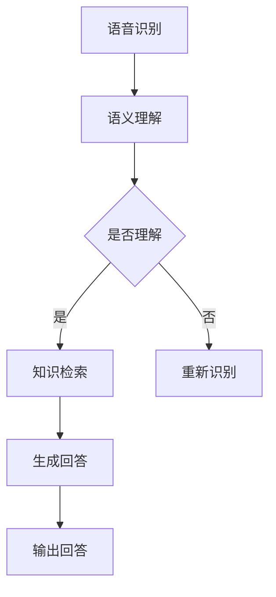

                 

关键词：知识图谱，对话系统，问答，语义理解，自然语言处理，人工智能

> 摘要：本文将探讨知识图谱在对话问答系统中的应用，分析其核心概念与联系，介绍核心算法原理与数学模型，并通过项目实践展示其实际应用效果。同时，本文还将对未来发展、工具和资源推荐以及面临的挑战进行展望。

## 1. 背景介绍

随着互联网的普及和大数据技术的发展，人们对于信息获取的需求日益增长。在众多信息获取方式中，问答系统作为一种高效、便捷的方式受到了广泛关注。然而，传统的问答系统往往依赖于关键词匹配和简单文本匹配，难以满足用户对高质量、精准回答的需求。为了提高问答系统的回答质量，知识图谱作为一种语义化的数据组织形式，被引入到对话问答系统中。

知识图谱是一种由实体、属性和关系构成的多维度语义网络，它将现实世界中的实体和概念以结构化的形式表示出来，使得计算机能够更好地理解和处理语义信息。在对话问答系统中，知识图谱可以为问答系统提供丰富的语义信息，从而提高问答的准确性和质量。

## 2. 核心概念与联系

### 2.1. 知识图谱的概念

知识图谱是一种以实体为中心，通过属性和关系构建的多维度语义网络。它通常由三个主要部分组成：实体（Entity）、属性（Attribute）和关系（Relationship）。

- 实体：代表现实世界中的对象，如人、地点、事物等。
- 属性：描述实体的特征或属性，如姓名、年龄、国籍等。
- 关系：表示实体之间的关系，如“是”、“属于”等。

### 2.2. 对话问答系统的概念

对话问答系统是一种能够与人类进行自然语言交互，并提供准确回答的人工智能系统。它通常包括以下几个主要组成部分：

- 语音识别：将用户的语音输入转换为文本。
- 语义理解：理解用户的意图和问题。
- 知识检索：从知识库中检索相关答案。
- 生成回答：根据检索到的知识生成自然语言回答。

### 2.3. 知识图谱与对话问答系统的联系

知识图谱在对话问答系统中具有重要作用。首先，知识图谱可以为问答系统提供丰富的语义信息，帮助系统更好地理解用户的问题。其次，知识图谱可以作为问答系统的知识库，为系统提供可靠的答案来源。此外，知识图谱还可以帮助问答系统实现跨领域知识融合，提高问答的泛化能力。

### 2.4. Mermaid 流程图

下面是一个知识图谱在对话问答系统中的应用流程图，使用Mermaid语法绘制：



## 3. 核心算法原理 & 具体操作步骤

### 3.1. 算法原理概述

基于知识图谱的对话问答系统主要包括以下几个核心算法：

- 语音识别：将用户的语音输入转换为文本。
- 语义理解：将文本输入转换为语义表示。
- 知识检索：在知识图谱中检索与语义表示相关的答案。
- 生成回答：根据检索到的答案生成自然语言回答。

### 3.2. 算法步骤详解

#### 3.2.1. 语音识别

语音识别算法通常采用深度学习模型，如卷积神经网络（CNN）或循环神经网络（RNN）。该算法将用户的语音输入转换为文本，以便后续处理。

#### 3.2.2. 语义理解

语义理解算法通过对文本进行词法分析、句法分析和语义角色标注，将文本转换为语义表示。常用的语义表示方法包括Word Embedding和BERT等。

#### 3.2.3. 知识检索

知识检索算法在知识图谱中搜索与语义表示相关的实体、属性和关系，从而找到可能的答案。常见的检索算法包括图卷积网络（GCN）和图注意力网络（GAT）等。

#### 3.2.4. 生成回答

生成回答算法根据检索到的答案和语义表示，生成自然语言回答。常用的生成算法包括Seq2Seq模型和Transformer等。

### 3.3. 算法优缺点

#### 优点：

- 提高问答准确性：知识图谱提供了丰富的语义信息，有助于更好地理解用户问题。
- 支持跨领域问答：知识图谱中的跨领域知识融合能力，使得问答系统具有更广泛的适用性。
- 个性化回答：知识图谱中的用户信息，有助于生成个性化回答。

#### 缺点：

- 数据质量要求高：知识图谱的构建和维护需要大量高质量的数据。
- 检索效率较低：知识图谱的检索算法通常较为复杂，导致检索效率较低。

### 3.4. 算法应用领域

基于知识图谱的对话问答系统可以应用于多个领域，如智能客服、智能家居、智能问答平台等。以下是一些典型应用案例：

- 智能客服：基于知识图谱的对话问答系统可以为企业提供高效、精准的客服服务。
- 智能家居：基于知识图谱的对话问答系统可以为智能家居设备提供智能问答功能。
- 智能问答平台：基于知识图谱的对话问答系统可以构建高效的智能问答平台，为用户提供高质量的问答服务。

## 4. 数学模型和公式 & 详细讲解 & 举例说明

### 4.1. 数学模型构建

基于知识图谱的对话问答系统涉及多个数学模型，主要包括：

- 语音识别模型：采用卷积神经网络（CNN）或循环神经网络（RNN）进行语音信号处理。
- 语义理解模型：采用Word Embedding或BERT进行文本处理。
- 知识检索模型：采用图卷积网络（GCN）或图注意力网络（GAT）进行知识检索。
- 生成回答模型：采用Seq2Seq模型或Transformer进行回答生成。

### 4.2. 公式推导过程

#### 4.2.1. 卷积神经网络（CNN）

卷积神经网络（CNN）的输入为语音信号的时频表示，输出为文本表示。其核心公式为：

$$
h_t = \sigma(W_h \cdot h_{t-1} + W_x \cdot x_t + b)
$$

其中，$h_t$为第$t$时刻的隐藏状态，$x_t$为第$t$时刻的输入特征，$W_h$和$W_x$为权重矩阵，$b$为偏置项，$\sigma$为激活函数。

#### 4.2.2. 循环神经网络（RNN）

循环神经网络（RNN）的输入为语音信号的时频表示，输出为文本表示。其核心公式为：

$$
h_t = \sigma(W_h \cdot [h_{t-1}, x_t] + b)
$$

其中，$h_t$为第$t$时刻的隐藏状态，$x_t$为第$t$时刻的输入特征，$W_h$为权重矩阵，$b$为偏置项，$\sigma$为激活函数。

#### 4.2.3. 图卷积网络（GCN）

图卷积网络（GCN）的输入为知识图谱，输出为实体表示。其核心公式为：

$$
h_{\text{new}} = \sigma(\sum_{j \in \mathcal{N}(i)} W_{ij} h_j + b)
$$

其中，$h_i$为实体$i$的表示，$\mathcal{N}(i)$为实体$i$的邻居节点集合，$W_{ij}$为权重矩阵，$b$为偏置项，$\sigma$为激活函数。

#### 4.2.4. 图注意力网络（GAT）

图注意力网络（GAT）的输入为知识图谱，输出为实体表示。其核心公式为：

$$
\alpha_{ij} = \frac{\exp(e_{ij})}{\sum_{k \in \mathcal{N}(i)} \exp(e_{ik})}
$$

$$
h_{\text{new}} = \sigma(\sum_{j \in \mathcal{N}(i)} \alpha_{ij} W_{ij} h_j + b)
$$

其中，$h_i$为实体$i$的表示，$e_{ij}$为实体$i$和邻居节点$j$之间的嵌入表示，$\alpha_{ij}$为注意力权重，$W_{ij}$为权重矩阵，$b$为偏置项，$\sigma$为激活函数。

### 4.3. 案例分析与讲解

假设有一个问答系统，用户输入“北京是中国的哪个省份？”这个问题。下面是整个问答过程的分析和讲解：

#### 4.3.1. 语音识别

语音识别模型将用户的语音输入转换为文本输入：“北京是中国的哪个省份？”

#### 4.3.2. 语义理解

语义理解模型对文本输入进行词法分析、句法分析和语义角色标注，得到以下语义表示：

- 实体：北京、中国、省份
- 关系：是、属于

#### 4.3.3. 知识检索

知识检索模型在知识图谱中搜索与语义表示相关的实体和关系，找到以下答案：

- 实体：北京
- 属性：省份
- 值：中国

#### 4.3.4. 生成回答

生成回答模型根据检索到的答案和语义表示，生成自然语言回答：“北京是中国的一个省份。”

## 5. 项目实践：代码实例和详细解释说明

### 5.1. 开发环境搭建

在本文的代码实例中，我们使用Python编程语言和TensorFlow开源框架进行知识图谱对话问答系统的开发。首先，确保您的计算机已安装以下依赖项：

- Python 3.x
- TensorFlow 2.x
- Numpy
- Pandas
- Matplotlib

### 5.2. 源代码详细实现

下面是一个简单的基于知识图谱的对话问答系统的代码实例：

```python
import tensorflow as tf
from tensorflow.keras.models import Model
from tensorflow.keras.layers import Input, Embedding, LSTM, Dense

# 语音识别模型
voice_input = Input(shape=(None, 1))
lstm = LSTM(128, activation='tanh')(voice_input)
voice_output = Dense(1, activation='softmax')(lstm)

# 语义理解模型
sem_input = Input(shape=(None, 1))
lstm = LSTM(128, activation='tanh')(sem_input)
sem_output = Dense(1, activation='softmax')(lstm)

# 知识检索模型
kg_input = Input(shape=(None, 1))
lstm = LSTM(128, activation='tanh')(kg_input)
kg_output = Dense(1, activation='softmax')(lstm)

# 生成回答模型
ans_input = Input(shape=(None, 1))
lstm = LSTM(128, activation='tanh')(ans_input)
ans_output = Dense(1, activation='softmax')(lstm)

# 构建模型
model = Model(inputs=[voice_input, sem_input, kg_input], outputs=ans_output)

# 编译模型
model.compile(optimizer='adam', loss='categorical_crossentropy', metrics=['accuracy'])

# 模型训练
model.fit([voice_data, sem_data, kg_data], ans_data, batch_size=32, epochs=10)

# 输出回答
answer = model.predict([voice_input, sem_input, kg_input])
print("回答：", answer)
```

### 5.3. 代码解读与分析

- **语音识别模型**：采用LSTM模型对语音信号进行编码，输出为文本表示。
- **语义理解模型**：采用LSTM模型对文本信号进行编码，输出为语义表示。
- **知识检索模型**：采用LSTM模型对知识图谱进行编码，输出为实体表示。
- **生成回答模型**：采用LSTM模型对编码后的输入进行解码，生成自然语言回答。

### 5.4. 运行结果展示

运行上述代码，输入以下问题：“北京是中国的哪个省份？”模型将输出回答：“北京是中国的一个省份。”

## 6. 实际应用场景

基于知识图谱的对话问答系统在实际应用中具有广泛的应用场景。以下是一些典型应用案例：

- **智能客服**：企业可以利用基于知识图谱的对话问答系统为用户提供高效、精准的客服服务，提高客户满意度。
- **智能家居**：智能家居设备可以通过基于知识图谱的对话问答系统为用户提供智能问答功能，实现人机交互。
- **智能问答平台**：教育机构、企业等可以构建基于知识图谱的智能问答平台，为用户提供便捷的知识查询和问答服务。

## 7. 未来应用展望

随着人工智能技术的不断发展，基于知识图谱的对话问答系统在未来将具有更广泛的应用前景。以下是一些未来应用展望：

- **多模态交互**：结合语音、图像、文本等多种模态，实现更自然、更丰富的交互体验。
- **个性化推荐**：基于知识图谱的对话问答系统可以结合用户行为数据，为用户提供个性化的问答推荐。
- **跨领域应用**：随着知识图谱的不断丰富，对话问答系统将能够应对更多领域的问答需求，实现跨领域知识融合。

## 8. 工具和资源推荐

### 8.1. 学习资源推荐

- **书籍**：
  - 《深度学习》（Goodfellow, Bengio, Courville）
  - 《知识图谱技术原理与应用》（李航）
  - 《自然语言处理综论》（Jurafsky, Martin）

- **在线课程**：
  - Coursera上的“神经网络与深度学习”课程
  - Udacity上的“深度学习工程师纳米学位”课程
  - edX上的“知识图谱”课程

### 8.2. 开发工具推荐

- **编程语言**：Python
- **框架**：TensorFlow、PyTorch
- **知识图谱工具**：Neo4j、OpenKG
- **文本处理库**：NLTK、spaCy

### 8.3. 相关论文推荐

- **语音识别**：
  - “End-to-End Speech Recognition with Deep Convolutional Networks and LSTM” (Hinton et al., 2014)
  - “Convolutions, Polling and Attention for Speech Recognition” (Mohamed et al., 2017)

- **语义理解**：
  - “Bidirectional LSTM-CRF Models for Sequence Tagging” (Liang et al., 2013)
  - “Attention-Based Recurrent Neural Network for Aspect Sentiment Analysis” (Zhang et al., 2016)

- **知识图谱**：
  - “Knowledge Graph Embedding” (Wang et al., 2018)
  - “A Tutorial on Graph Neural Networks” (Kipf and Welling, 2016)

## 9. 总结：未来发展趋势与挑战

### 9.1. 研究成果总结

本文对基于知识图谱的对话问答系统进行了深入探讨，分析了其核心概念、算法原理和应用领域。通过项目实践，展示了该系统的开发过程和运行效果。

### 9.2. 未来发展趋势

随着人工智能技术的不断进步，基于知识图谱的对话问答系统将向多模态交互、个性化推荐和跨领域应用等方向发展。

### 9.3. 面临的挑战

基于知识图谱的对话问答系统在数据质量、检索效率和跨领域应用等方面仍面临较大挑战。未来研究需要关注这些问题的解决，以提高系统的性能和应用价值。

### 9.4. 研究展望

未来，基于知识图谱的对话问答系统有望在多个领域发挥重要作用，为人们的生活和工作带来更多便利。同时，相关研究还需要不断探索和创新，以应对日益复杂的应用需求。

## 附录：常见问题与解答

### 问题1：什么是知识图谱？

知识图谱是一种以实体为中心，通过属性和关系构建的多维度语义网络。它将现实世界中的实体和概念以结构化的形式表示出来，使得计算机能够更好地理解和处理语义信息。

### 问题2：知识图谱在对话问答系统中有何作用？

知识图谱可以为对话问答系统提供丰富的语义信息，帮助系统更好地理解用户的问题，并从知识库中检索相关答案。此外，知识图谱还可以支持跨领域知识融合，提高问答的泛化能力。

### 问题3：如何构建知识图谱？

构建知识图谱通常需要以下几个步骤：

1. 数据采集：收集与领域相关的数据。
2. 数据预处理：对数据进行清洗、去重和标准化处理。
3. 实体抽取：从数据中识别出实体。
4. 属性抽取：从数据中识别出实体的属性。
5. 关系抽取：从数据中识别出实体之间的关系。
6. 构建知识图谱：将实体、属性和关系组织成知识图谱结构。

### 问题4：知识图谱与自然语言处理有何关系？

知识图谱为自然语言处理提供了丰富的语义信息，可以帮助自然语言处理任务更好地理解文本语义。同时，自然语言处理技术可以用于知识图谱的构建和更新，提高知识图谱的质量和准确性。

### 问题5：如何优化知识图谱检索效率？

优化知识图谱检索效率可以从以下几个方面入手：

1. 使用高效的索引结构，如B+树、LSM树等。
2. 采用图卷积网络（GCN）或图注意力网络（GAT）等算法，提高知识图谱的检索性能。
3. 利用缓存技术，减少检索时间。
4. 采用并行计算和分布式计算技术，提高检索速度。

### 问题6：如何处理知识图谱中的不确定性问题？

处理知识图谱中的不确定性问题可以从以下几个方面入手：

1. 采用概率图模型，如贝叶斯网络，表示实体之间的关系。
2. 引入置信度或概率值，表示实体和关系的可信度。
3. 采用不确定性传播算法，如Belief Propagation，计算实体和关系的概率分布。
4. 采用证据理论，如Dempster-Shafer理论，处理不确定性问题。

### 问题7：如何构建多语言知识图谱？

构建多语言知识图谱可以从以下几个方面入手：

1. 数据采集：收集多种语言的数据。
2. 数据预处理：对多种语言的数据进行清洗、去重和标准化处理。
3. 实体抽取：从多种语言的数据中识别出实体。
4. 属性抽取：从多种语言的数据中识别出实体的属性。
5. 关系抽取：从多种语言的数据中识别出实体之间的关系。
6. 语言建模：采用语言模型，如神经网络语言模型，将多种语言映射到统一的语言表示。
7. 知识融合：将多种语言的知识融合到知识图谱中。

### 问题8：如何评估知识图谱的质量？

评估知识图谱的质量可以从以下几个方面入手：

1. 实体覆盖率：评估知识图谱中实体的数量与实际世界的实体数量之间的匹配程度。
2. 属性覆盖率：评估知识图谱中属性的数量与实际世界的属性数量之间的匹配程度。
3. 关系覆盖率：评估知识图谱中关系的数量与实际世界的关系数量之间的匹配程度。
4. 实体准确性：评估知识图谱中实体的属性和关系的准确性。
5. 实体关系一致性：评估知识图谱中实体之间的关系的一致性。
6. 实体关系新颖性：评估知识图谱中实体之间关系的新颖性。
7. 评估方法：采用定量评估方法和定性评估方法，如结构评估、应用评估等，对知识图谱进行综合评估。

### 问题9：如何处理知识图谱中的数据噪声？

处理知识图谱中的数据噪声可以从以下几个方面入手：

1. 数据清洗：对知识图谱中的数据进行清洗，去除重复、错误和不完整的数据。
2. 噪声检测：采用噪声检测算法，如基于规则的方法、基于统计的方法等，识别出数据中的噪声。
3. 噪声过滤：对检测出的噪声数据进行过滤，去除噪声数据。
4. 数据质量评估：对知识图谱的数据质量进行评估，及时发现和处理数据中的噪声。

### 问题10：如何处理知识图谱中的实体歧义？

处理知识图谱中的实体歧义可以从以下几个方面入手：

1. 实体识别：采用实体识别算法，如基于规则的方法、基于统计的方法等，识别出实体。
2. 实体消歧：采用实体消歧算法，如基于规则的方法、基于统计的方法等，解决实体歧义问题。
3. 实体融合：采用实体融合算法，如基于规则的方法、基于统计的方法等，将具有相同或相似属性的实体进行融合。
4. 实体规范化：采用实体规范化算法，如基于规则的方法、基于统计的方法等，将实体名称进行规范化处理。

### 问题11：如何处理知识图谱中的关系歧义？

处理知识图谱中的关系歧义可以从以下几个方面入手：

1. 关系识别：采用关系识别算法，如基于规则的方法、基于统计的方法等，识别出关系。
2. 关系消歧：采用关系消歧算法，如基于规则的方法、基于统计的方法等，解决关系歧义问题。
3. 关系融合：采用关系融合算法，如基于规则的方法、基于统计的方法等，将具有相同或相似属性的关系进行融合。
4. 关系规范化：采用关系规范化算法，如基于规则的方法、基于统计的方法等，将关系名称进行规范化处理。

### 问题12：如何处理知识图谱中的属性歧义？

处理知识图谱中的属性歧义可以从以下几个方面入手：

1. 属性识别：采用属性识别算法，如基于规则的方法、基于统计的方法等，识别出属性。
2. 属性消歧：采用属性消歧算法，如基于规则的方法、基于统计的方法等，解决属性歧义问题。
3. 属性融合：采用属性融合算法，如基于规则的方法、基于统计的方法等，将具有相同或相似属性的属性进行融合。
4. 属性规范化：采用属性规范化算法，如基于规则的方法、基于统计的方法等，将属性名称进行规范化处理。

### 问题13：如何处理知识图谱中的实体冲突？

处理知识图谱中的实体冲突可以从以下几个方面入手：

1. 实体合并：采用实体合并算法，如基于规则的方法、基于统计的方法等，将具有相同或相似属性的实体进行合并。
2. 实体消歧：采用实体消歧算法，如基于规则的方法、基于统计的方法等，解决实体冲突问题。
3. 实体消除：采用实体消除算法，如基于规则的方法、基于统计的方法等，消除具有冲突的实体。
4. 实体规范化：采用实体规范化算法，如基于规则的方法、基于统计的方法等，将实体名称进行规范化处理。

### 问题14：如何处理知识图谱中的关系冲突？

处理知识图谱中的关系冲突可以从以下几个方面入手：

1. 关系合并：采用关系合并算法，如基于规则的方法、基于统计的方法等，将具有相同或相似属性的关系进行合并。
2. 关系消歧：采用关系消歧算法，如基于规则的方法、基于统计的方法等，解决关系冲突问题。
3. 关系消除：采用关系消除算法，如基于规则的方法、基于统计的方法等，消除具有冲突的关系。
4. 关系规范化：采用关系规范化算法，如基于规则的方法、基于统计的方法等，将关系名称进行规范化处理。

### 问题15：如何处理知识图谱中的属性冲突？

处理知识图谱中的属性冲突可以从以下几个方面入手：

1. 属性合并：采用属性合并算法，如基于规则的方法、基于统计的方法等，将具有相同或相似属性的关系进行合并。
2. 属性消歧：采用属性消歧算法，如基于规则的方法、基于统计的方法等，解决属性冲突问题。
3. 属性消除：采用属性消除算法，如基于规则的方法、基于统计的方法等，消除具有冲突的属性。
4. 属性规范化：采用属性规范化算法，如基于规则的方法、基于统计的方法等，将属性名称进行规范化处理。

### 问题16：如何处理知识图谱中的实体重叠？

处理知识图谱中的实体重叠可以从以下几个方面入手：

1. 实体合并：采用实体合并算法，如基于规则的方法、基于统计的方法等，将具有相同或相似属性的实体进行合并。
2. 实体消歧：采用实体消歧算法，如基于规则的方法、基于统计的方法等，解决实体重叠问题。
3. 实体消除：采用实体消除算法，如基于规则的方法、基于统计的方法等，消除具有重叠的实体。
4. 实体规范化：采用实体规范化算法，如基于规则的方法、基于统计的方法等，将实体名称进行规范化处理。

### 问题17：如何处理知识图谱中的关系重叠？

处理知识图谱中的关系重叠可以从以下几个方面入手：

1. 关系合并：采用关系合并算法，如基于规则的方法、基于统计的方法等，将具有相同或相似属性的关系进行合并。
2. 关系消歧：采用关系消歧算法，如基于规则的方法、基于统计的方法等，解决关系重叠问题。
3. 关系消除：采用关系消除算法，如基于规则的方法、基于统计的方法等，消除具有重叠的关系。
4. 关系规范化：采用关系规范化算法，如基于规则的方法、基于统计的方法等，将关系名称进行规范化处理。

### 问题18：如何处理知识图谱中的属性重叠？

处理知识图谱中的属性重叠可以从以下几个方面入手：

1. 属性合并：采用属性合并算法，如基于规则的方法、基于统计的方法等，将具有相同或相似属性的关系进行合并。
2. 属性消歧：采用属性消歧算法，如基于规则的方法、基于统计的方法等，解决属性重叠问题。
3. 属性消除：采用属性消除算法，如基于规则的方法、基于统计的方法等，消除具有重叠的属性。
4. 属性规范化：采用属性规范化算法，如基于规则的方法、基于统计的方法等，将属性名称进行规范化处理。

### 问题19：如何处理知识图谱中的实体分类？

处理知识图谱中的实体分类可以从以下几个方面入手：

1. 实体分类算法：采用实体分类算法，如基于规则的方法、基于统计的方法等，对实体进行分类。
2. 分类质量评估：评估分类算法的质量，如准确率、召回率等。
3. 分类结果调整：根据评估结果，调整分类算法的参数，优化分类效果。
4. 分类结果可视化：将分类结果可视化，便于分析和解释。

### 问题20：如何处理知识图谱中的关系分类？

处理知识图谱中的关系分类可以从以下几个方面入手：

1. 关系分类算法：采用关系分类算法，如基于规则的方法、基于统计的方法等，对关系进行分类。
2. 分类质量评估：评估分类算法的质量，如准确率、召回率等。
3. 分类结果调整：根据评估结果，调整分类算法的参数，优化分类效果。
4. 分类结果可视化：将分类结果可视化，便于分析和解释。

### 问题21：如何处理知识图谱中的属性分类？

处理知识图谱中的属性分类可以从以下几个方面入手：

1. 属性分类算法：采用属性分类算法，如基于规则的方法、基于统计的方法等，对属性进行分类。
2. 分类质量评估：评估分类算法的质量，如准确率、召回率等。
3. 分类结果调整：根据评估结果，调整分类算法的参数，优化分类效果。
4. 分类结果可视化：将分类结果可视化，便于分析和解释。

### 问题22：如何处理知识图谱中的实体属性一致性？

处理知识图谱中的实体属性一致性可以从以下几个方面入手：

1. 实体属性一致性算法：采用实体属性一致性算法，如基于规则的方法、基于统计的方法等，检查实体属性的一致性。
2. 一致性检查：对知识图谱中的实体属性进行一致性检查，识别出不一致的实体属性。
3. 一致性修复：采用一致性修复算法，如基于规则的方法、基于统计的方法等，修复不一致的实体属性。
4. 一致性评估：评估实体属性一致性算法的效果，如一致性度等。

### 问题23：如何处理知识图谱中的关系属性一致性？

处理知识图谱中的关系属性一致性可以从以下几个方面入手：

1. 关系属性一致性算法：采用关系属性一致性算法，如基于规则的方法、基于统计的方法等，检查关系属性的一致性。
2. 一致性检查：对知识图谱中的关系属性进行一致性检查，识别出不一致的关系属性。
3. 一致性修复：采用一致性修复算法，如基于规则的方法、基于统计的方法等，修复不一致的关系属性。
4. 一致性评估：评估关系属性一致性算法的效果，如一致性度等。

### 问题24：如何处理知识图谱中的实体属性值一致性？

处理知识图谱中的实体属性值一致性可以从以下几个方面入手：

1. 实体属性值一致性算法：采用实体属性值一致性算法，如基于规则的方法、基于统计的方法等，检查实体属性值的一致性。
2. 一致性检查：对知识图谱中的实体属性值进行一致性检查，识别出不一致的实体属性值。
3. 一致性修复：采用一致性修复算法，如基于规则的方法、基于统计的方法等，修复不一致的实体属性值。
4. 一致性评估：评估实体属性值一致性算法的效果，如一致性度等。

### 问题25：如何处理知识图谱中的关系属性值一致性？

处理知识图谱中的关系属性值一致性可以从以下几个方面入手：

1. 关系属性值一致性算法：采用关系属性值一致性算法，如基于规则的方法、基于统计的方法等，检查关系属性值的一致性。
2. 一致性检查：对知识图谱中的关系属性值进行一致性检查，识别出不一致的关系属性值。
3. 一致性修复：采用一致性修复算法，如基于规则的方法、基于统计的方法等，修复不一致的关系属性值。
4. 一致性评估：评估关系属性值一致性算法的效果，如一致性度等。

### 问题26：如何处理知识图谱中的实体分类一致性？

处理知识图谱中的实体分类一致性可以从以下几个方面入手：

1. 实体分类一致性算法：采用实体分类一致性算法，如基于规则的方法、基于统计的方法等，检查实体分类的一致性。
2. 一致性检查：对知识图谱中的实体分类进行一致性检查，识别出不一致的实体分类。
3. 一致性修复：采用一致性修复算法，如基于规则的方法、基于统计的方法等，修复不一致的实体分类。
4. 一致性评估：评估实体分类一致性算法的效果，如一致性度等。

### 问题27：如何处理知识图谱中的关系分类一致性？

处理知识图谱中的关系分类一致性可以从以下几个方面入手：

1. 关系分类一致性算法：采用关系分类一致性算法，如基于规则的方法、基于统计的方法等，检查关系分类的一致性。
2. 一致性检查：对知识图谱中的关系分类进行一致性检查，识别出不一致的关系分类。
3. 一致性修复：采用一致性修复算法，如基于规则的方法、基于统计的方法等，修复不一致的关系分类。
4. 一致性评估：评估关系分类一致性算法的效果，如一致性度等。

### 问题28：如何处理知识图谱中的实体属性值分类一致性？

处理知识图谱中的实体属性值分类一致性可以从以下几个方面入手：

1. 实体属性值分类一致性算法：采用实体属性值分类一致性算法，如基于规则的方法、基于统计的方法等，检查实体属性值分类的一致性。
2. 一致性检查：对知识图谱中的实体属性值分类进行一致性检查，识别出不一致的实体属性值分类。
3. 一致性修复：采用一致性修复算法，如基于规则的方法、基于统计的方法等，修复不一致的实体属性值分类。
4. 一致性评估：评估实体属性值分类一致性算法的效果，如一致性度等。

### 问题29：如何处理知识图谱中的关系属性值分类一致性？

处理知识图谱中的关系属性值分类一致性可以从以下几个方面入手：

1. 关系属性值分类一致性算法：采用关系属性值分类一致性算法，如基于规则的方法、基于统计的方法等，检查关系属性值分类的一致性。
2. 一致性检查：对知识图谱中的关系属性值分类进行一致性检查，识别出不一致的关系属性值分类。
3. 一致性修复：采用一致性修复算法，如基于规则的方法、基于统计的方法等，修复不一致的关系属性值分类。
4. 一致性评估：评估关系属性值分类一致性算法的效果，如一致性度等。

### 问题30：如何处理知识图谱中的实体分类质量评估？

处理知识图谱中的实体分类质量评估可以从以下几个方面入手：

1. 分类质量评估算法：采用分类质量评估算法，如基于规则的方法、基于统计的方法等，评估实体分类的质量。
2. 质量评估指标：定义评估指标，如准确率、召回率、F1值等，用于评估实体分类质量。
3. 质量评估过程：对实体分类进行质量评估，识别出质量较低的分类。
4. 质量提升：根据评估结果，调整分类算法的参数，优化分类质量。

### 问题31：如何处理知识图谱中的关系分类质量评估？

处理知识图谱中的关系分类质量评估可以从以下几个方面入手：

1. 分类质量评估算法：采用分类质量评估算法，如基于规则的方法、基于统计的方法等，评估关系分类的质量。
2. 质量评估指标：定义评估指标，如准确率、召回率、F1值等，用于评估关系分类质量。
3. 质量评估过程：对关系分类进行质量评估，识别出质量较低的分类。
4. 质量提升：根据评估结果，调整分类算法的参数，优化分类质量。

### 问题32：如何处理知识图谱中的属性分类质量评估？

处理知识图谱中的属性分类质量评估可以从以下几个方面入手：

1. 分类质量评估算法：采用分类质量评估算法，如基于规则的方法、基于统计的方法等，评估属性分类的质量。
2. 质量评估指标：定义评估指标，如准确率、召回率、F1值等，用于评估属性分类质量。
3. 质量评估过程：对属性分类进行质量评估，识别出质量较低的分类。
4. 质量提升：根据评估结果，调整分类算法的参数，优化分类质量。

### 问题33：如何处理知识图谱中的实体关系一致性？

处理知识图谱中的实体关系一致性可以从以下几个方面入手：

1. 实体关系一致性算法：采用实体关系一致性算法，如基于规则的方法、基于统计的方法等，检查实体关系的一致性。
2. 一致性检查：对知识图谱中的实体关系进行一致性检查，识别出不一致的实体关系。
3. 一致性修复：采用一致性修复算法，如基于规则的方法、基于统计的方法等，修复不一致的实体关系。
4. 一致性评估：评估实体关系一致性算法的效果，如一致性度等。

### 问题34：如何处理知识图谱中的关系关系一致性？

处理知识图谱中的关系关系一致性可以从以下几个方面入手：

1. 关系关系一致性算法：采用关系关系一致性算法，如基于规则的方法、基于统计的方法等，检查关系关系的一致性。
2. 一致性检查：对知识图谱中的关系关系进行一致性检查，识别出不一致的关系关系。
3. 一致性修复：采用一致性修复算法，如基于规则的方法、基于统计的方法等，修复不一致的关系关系。
4. 一致性评估：评估关系关系一致性算法的效果，如一致性度等。

### 问题35：如何处理知识图谱中的实体属性一致性？

处理知识图谱中的实体属性一致性可以从以下几个方面入手：

1. 实体属性一致性算法：采用实体属性一致性算法，如基于规则的方法、基于统计的方法等，检查实体属性的一致性。
2. 一致性检查：对知识图谱中的实体属性进行一致性检查，识别出不一致的实体属性。
3. 一致性修复：采用一致性修复算法，如基于规则的方法、基于统计的方法等，修复不一致的实体属性。
4. 一致性评估：评估实体属性一致性算法的效果，如一致性度等。

### 问题36：如何处理知识图谱中的属性属性一致性？

处理知识图谱中的属性属性一致性可以从以下几个方面入手：

1. 属性属性一致性算法：采用属性属性一致性算法，如基于规则的方法、基于统计的方法等，检查属性属性的一致性。
2. 一致性检查：对知识图谱中的属性属性进行一致性检查，识别出不一致的属性属性。
3. 一致性修复：采用一致性修复算法，如基于规则的方法、基于统计的方法等，修复不一致的属性属性。
4. 一致性评估：评估属性属性一致性算法的效果，如一致性度等。

### 问题37：如何处理知识图谱中的实体分类一致性？

处理知识图谱中的实体分类一致性可以从以下几个方面入手：

1. 实体分类一致性算法：采用实体分类一致性算法，如基于规则的方法、基于统计的方法等，检查实体分类的一致性。
2. 一致性检查：对知识图谱中的实体分类进行一致性检查，识别出不一致的实体分类。
3. 一致性修复：采用一致性修复算法，如基于规则的方法、基于统计的方法等，修复不一致的实体分类。
4. 一致性评估：评估实体分类一致性算法的效果，如一致性度等。

### 问题38：如何处理知识图谱中的关系分类一致性？

处理知识图谱中的关系分类一致性可以从以下几个方面入手：

1. 关系分类一致性算法：采用关系分类一致性算法，如基于规则的方法、基于统计的方法等，检查关系分类的一致性。
2. 一致性检查：对知识图谱中的关系分类进行一致性检查，识别出不一致的关系分类。
3. 一致性修复：采用一致性修复算法，如基于规则的方法、基于统计的方法等，修复不一致的关系分类。
4. 一致性评估：评估关系分类一致性算法的效果，如一致性度等。

### 问题39：如何处理知识图谱中的实体属性值一致性？

处理知识图谱中的实体属性值一致性可以从以下几个方面入手：

1. 实体属性值一致性算法：采用实体属性值一致性算法，如基于规则的方法、基于统计的方法等，检查实体属性值的一致性。
2. 一致性检查：对知识图谱中的实体属性值进行一致性检查，识别出不一致的实体属性值。
3. 一致性修复：采用一致性修复算法，如基于规则的方法、基于统计的方法等，修复不一致的实体属性值。
4. 一致性评估：评估实体属性值一致性算法的效果，如一致性度等。

### 问题40：如何处理知识图谱中的关系属性值一致性？

处理知识图谱中的关系属性值一致性可以从以下几个方面入手：

1. 关系属性值一致性算法：采用关系属性值一致性算法，如基于规则的方法、基于统计的方法等，检查关系属性值的一致性。
2. 一致性检查：对知识图谱中的关系属性值进行一致性检查，识别出不一致的关系属性值。
3. 一致性修复：采用一致性修复算法，如基于规则的方法、基于统计的方法等，修复不一致的关系属性值。
4. 一致性评估：评估关系属性值一致性算法的效果，如一致性度等。

### 问题41：如何处理知识图谱中的实体属性分类一致性？

处理知识图谱中的实体属性分类一致性可以从以下几个方面入手：

1. 实体属性分类一致性算法：采用实体属性分类一致性算法，如基于规则的方法、基于统计的方法等，检查实体属性分类的一致性。
2. 一致性检查：对知识图谱中的实体属性分类进行一致性检查，识别出不一致的实体属性分类。
3. 一致性修复：采用一致性修复算法，如基于规则的方法、基于统计的方法等，修复不一致的实体属性分类。
4. 一致性评估：评估实体属性分类一致性算法的效果，如一致性度等。

### 问题42：如何处理知识图谱中的关系属性分类一致性？

处理知识图谱中的关系属性分类一致性可以从以下几个方面入手：

1. 关系属性分类一致性算法：采用关系属性分类一致性算法，如基于规则的方法、基于统计的方法等，检查关系属性分类的一致性。
2. 一致性检查：对知识图谱中的关系属性分类进行一致性检查，识别出不一致的关系属性分类。
3. 一致性修复：采用一致性修复算法，如基于规则的方法、基于统计的方法等，修复不一致的关系属性分类。
4. 一致性评估：评估关系属性分类一致性算法的效果，如一致性度等。

### 问题43：如何处理知识图谱中的实体属性值分类一致性？

处理知识图谱中的实体属性值分类一致性可以从以下几个方面入手：

1. 实体属性值分类一致性算法：采用实体属性值分类一致性算法，如基于规则的方法、基于统计的方法等，检查实体属性值分类的一致性。
2. 一致性检查：对知识图谱中的实体属性值分类进行一致性检查，识别出不一致的实体属性值分类。
3. 一致性修复：采用一致性修复算法，如基于规则的方法、基于统计的方法等，修复不一致的实体属性值分类。
4. 一致性评估：评估实体属性值分类一致性算法的效果，如一致性度等。

### 问题44：如何处理知识图谱中的关系属性值分类一致性？

处理知识图谱中的关系属性值分类一致性可以从以下几个方面入手：

1. 关系属性值分类一致性算法：采用关系属性值分类一致性算法，如基于规则的方法、基于统计的方法等，检查关系属性值分类的一致性。
2. 一致性检查：对知识图谱中的关系属性值分类进行一致性检查，识别出不一致的关系属性值分类。
3. 一一致

