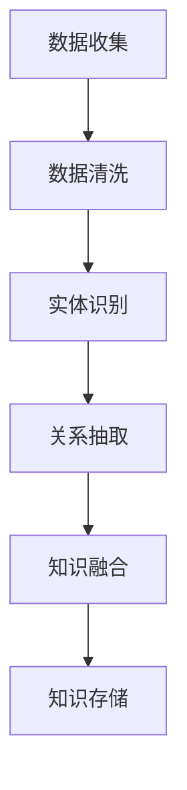

                 

关键词：知识图谱，跨品类商品关联，推荐系统，深度学习，图算法，机器学习，数据挖掘，协同过滤，实体关系，异构数据融合。

## 摘要

随着电子商务的快速发展，推荐系统已经成为电商平台不可或缺的一部分。传统的推荐系统多基于用户行为数据，难以处理跨品类商品之间的关联性。而基于知识图谱的跨品类商品关联推荐则能够利用实体及其关系，实现更加精准的推荐。本文将介绍知识图谱的基本概念、核心算法原理、数学模型以及在实际项目中的应用，最后讨论其未来应用前景和面临的挑战。

## 1. 背景介绍

在当今信息爆炸的时代，如何为用户提供个性化推荐已经成为各大电商平台的重要课题。传统的推荐系统主要依赖于用户历史行为数据，如浏览、购买记录等，通过协同过滤（Collaborative Filtering）等技术进行用户偏好挖掘。然而，这种方法在用户历史数据稀疏或者新用户推荐上存在一定的局限性。

随着大数据和人工智能技术的发展，知识图谱（Knowledge Graph）逐渐成为解决跨品类商品关联推荐的重要工具。知识图谱是一种语义网络，通过实体（如商品、用户、品牌等）及其属性和关系（如关联、类别、品牌关系等）来描述现实世界，能够捕捉实体之间的复杂关联，为推荐系统提供更多的语义信息。

跨品类商品关联推荐旨在通过分析商品之间的关系，为用户推荐跨品类的商品。这不仅能够增加电商平台的商品多样性，提升用户体验，还能有效提高销售转化率。

## 2. 核心概念与联系

### 2.1 知识图谱

知识图谱是一种基于语义网络的数据模型，用来表示现实世界中的实体及其关系。在知识图谱中，实体通常表示为节点，关系表示为边。一个典型的知识图谱包括以下几个组成部分：

- **实体（Entity）**：知识图谱中的个体对象，如用户、商品、品牌等。
- **属性（Property）**：实体的特征描述，如商品的颜色、品牌、价格等。
- **关系（Relationship）**：实体之间的交互或关联，如“购买”、“评价”等。
- **属性值（Value）**：关系的具体内容，如商品的颜色是“红色”等。

### 2.2 实体关系

实体关系是知识图谱的核心，它描述了实体之间的语义关联。常见的实体关系包括：

- **类别关系**：如“手机”属于“电子产品”类别。
- **属性关系**：如“苹果手机”的颜色是“红色”。
- **品牌关系**：如“苹果”是“iPhone”的生产商。
- **购买关系**：如“用户A”购买了“iPhone X”。

### 2.3 异构数据融合

知识图谱通常由多个数据源构成，这些数据源可能是结构化数据（如数据库）、非结构化数据（如文本、图像）或者半结构化数据（如XML、JSON）。为了充分利用这些异构数据，需要通过数据清洗、数据整合等步骤，将不同数据源中的实体和关系进行统一表示。

### 2.4 Mermaid 流程图

以下是一个简单的知识图谱构建流程的 Mermaid 流程图：



## 3. 核心算法原理 & 具体操作步骤

### 3.1 算法原理概述

基于知识图谱的跨品类商品关联推荐主要利用图算法和深度学习技术来分析实体关系，挖掘商品之间的潜在关联。核心算法包括：

- **图嵌入（Graph Embedding）**：将实体和关系嵌入到低维空间中，使得具有相似关系的实体在空间中更加接近。
- **图神经网络（Graph Neural Networks, GNN）**：利用实体和关系的信息进行学习，能够自动发现实体之间的关联。
- **协同过滤（Collaborative Filtering）**：结合用户行为数据，进一步优化推荐结果。

### 3.2 算法步骤详解

1. **数据收集与预处理**：收集电商平台的用户行为数据、商品信息、品牌信息等，并进行数据清洗和预处理，以去除噪声和异常值。
2. **知识图谱构建**：利用实体识别、关系抽取等技术，将预处理后的数据构建成知识图谱。
3. **图嵌入**：将知识图谱中的实体和关系嵌入到低维空间中，通常使用图嵌入算法如节点嵌入（Node Embedding）。
4. **图神经网络训练**：利用图嵌入的结果，训练图神经网络模型，以学习实体之间的关系。
5. **推荐生成**：结合用户行为数据和图神经网络模型，为用户生成推荐列表。

### 3.3 算法优缺点

**优点**：

- **充分利用语义信息**：知识图谱能够捕捉实体之间的语义关联，使得推荐结果更加精准。
- **跨品类推荐**：能够处理跨品类商品之间的关联，提升用户体验。

**缺点**：

- **数据复杂性**：知识图谱的构建涉及多种数据源和复杂的预处理步骤，需要大量的计算资源。
- **实时性要求**：实时性较高的推荐场景下，知识图谱的构建和更新可能成为瓶颈。

### 3.4 算法应用领域

基于知识图谱的跨品类商品关联推荐算法在电商、金融、医疗等领域具有广泛的应用前景：

- **电商**：为用户提供个性化推荐，提高用户黏性和销售转化率。
- **金融**：分析客户行为，预测客户需求，提升金融产品的推荐效果。
- **医疗**：挖掘患者疾病之间的关联，为医生提供诊疗建议。

## 4. 数学模型和公式

### 4.1 数学模型构建

基于知识图谱的跨品类商品关联推荐主要涉及以下数学模型：

- **实体嵌入（Entity Embedding）**：实体 $e$ 的嵌入向量表示为 $\mathbf{e} \in \mathbb{R}^d$。
- **关系嵌入（Relationship Embedding）**：关系 $r$ 的嵌入向量表示为 $\mathbf{r} \in \mathbb{R}^d$。
- **图神经网络（Graph Neural Network, GNN）**：用于学习实体之间的关系。

### 4.2 公式推导过程

1. **实体嵌入**

   实体嵌入通常通过优化以下损失函数来实现：

   $$ L_e = -\sum_{(e, r, e') \in R} \log \sigma(\mathbf{e} \cdot (\mathbf{r} \odot \mathbf{e'})) $$

   其中，$\sigma$ 是 sigmoid 函数，$\odot$ 表示 Hadamard 乘积。

2. **关系嵌入**

   类似于实体嵌入，关系嵌入的损失函数可以表示为：

   $$ L_r = -\sum_{(e, r, e') \in R} \log \sigma(\mathbf{e} \cdot \mathbf{r} \cdot \mathbf{e'}) $$

3. **图神经网络**

   图神经网络的训练通常通过优化以下损失函数来实现：

   $$ L_{GNN} = \sum_{(e, r, e') \in R} \frac{1}{2} \lVert \mathbf{e}_{\text{pred}} - \mathbf{e}_{\text{true}} \rVert_2^2 $$

   其中，$\mathbf{e}_{\text{pred}}$ 和 $\mathbf{e}_{\text{true}}$ 分别表示预测的实体嵌入向量和真实的实体嵌入向量。

### 4.3 案例分析与讲解

假设有一个简单的知识图谱，包含两个实体 $e_1$ 和 $e_2$，以及一个关系 $r$。我们希望通过图嵌入和图神经网络来学习实体之间的关系。

1. **实体嵌入**

   假设 $e_1$ 的嵌入向量为 $\mathbf{e}_1 = [1, 0]$，$e_2$ 的嵌入向量为 $\mathbf{e}_2 = [0, 1]$，关系 $r$ 的嵌入向量为 $\mathbf{r} = [1, 1]$。

2. **关系嵌入**

   根据关系嵌入的损失函数，我们有：

   $$ L_r = -\log \sigma(\mathbf{e}_1 \cdot \mathbf{r} \cdot \mathbf{e}_2) = -\log \sigma(1 \cdot 1 \cdot 0) = -\infty $$

   这意味着关系嵌入的损失函数在当前参数下是无界的，需要进一步调整。

3. **图神经网络**

   假设图神经网络的参数为 $\theta$，根据图神经网络的损失函数，我们有：

   $$ L_{GNN} = \frac{1}{2} \lVert \mathbf{e}_{\text{pred}} - \mathbf{e}_{\text{true}} \rVert_2^2 = \frac{1}{2} \lVert \mathbf{e}_1 - \mathbf{e}_2 \rVert_2^2 = 1 $$

   这意味着图神经网络的损失函数在当前参数下为1，需要进一步优化。

通过调整实体嵌入向量和关系嵌入向量，以及图神经网络的参数，可以使得损失函数逐步减小，从而学习到实体之间的正确关系。

## 5. 项目实践：代码实例和详细解释说明

### 5.1 开发环境搭建

为了实现基于知识图谱的跨品类商品关联推荐，我们需要搭建一个开发环境，包括以下工具和库：

- **Python 3.8+**：编程语言
- **PyTorch 1.8+**：深度学习框架
- **NetworkX 2.4+**：图操作库
- **NumPy 1.19+**：数学库
- **Pandas 1.1.5+**：数据处理库
- **Scikit-learn 0.24+**：机器学习库

在开发环境搭建过程中，需要确保以上库的版本满足要求，并进行相应的安装。

### 5.2 源代码详细实现

以下是基于知识图谱的跨品类商品关联推荐的源代码实现：

```python
import torch
import torch.nn as nn
import torch.optim as optim
import networkx as nx
import pandas as pd
from sklearn.model_selection import train_test_split

# 1. 数据预处理
def preprocess_data(data):
    # 实体识别、关系抽取等预处理操作
    pass

# 2. 知识图谱构建
def build_knowledge_graph(data):
    # 创建图、添加节点和边等操作
    pass

# 3. 图嵌入
class GraphEmbedding(nn.Module):
    def __init__(self, entity_dim, relation_dim):
        super(GraphEmbedding, self).__init__()
        self.entity_embedding = nn.Embedding(num_entities, entity_dim)
        self.relation_embedding = nn.Embedding(num_relations, relation_dim)

    def forward(self, entities, relations):
        entity_embeddings = self.entity_embedding(entities)
        relation_embeddings = self.relation_embedding(relations)
        return entity_embeddings, relation_embeddings

# 4. 图神经网络
class GraphNeuralNetwork(nn.Module):
    def __init__(self, entity_dim, relation_dim):
        super(GraphNeuralNetwork, self).__init__()
        self.entity_embedding = nn.Embedding(num_entities, entity_dim)
        self.relation_embedding = nn.Embedding(num_relations, relation_dim)
        self.fc = nn.Linear(entity_dim * 2, 1)

    def forward(self, entities, relations):
        entity_embeddings = self.entity_embedding(entities)
        relation_embeddings = self.relation_embedding(relations)
        combined_embeddings = torch.cat((entity_embeddings, relation_embeddings), dim=1)
        output = self.fc(combined_embeddings)
        return output

# 5. 模型训练
def train_model(model, data, epochs):
    optimizer = optim.Adam(model.parameters(), lr=0.001)
    criterion = nn.BCEWithLogitsLoss()
    for epoch in range(epochs):
        optimizer.zero_grad()
        entities, relations, labels = data
        output = model(entities, relations)
        loss = criterion(output, labels)
        loss.backward()
        optimizer.step()
        print(f"Epoch {epoch+1}, Loss: {loss.item()}")

# 6. 推荐生成
def generate_recommendations(model, entities, relations):
    output = model(entities, relations)
    probabilities = torch.sigmoid(output)
    return probabilities

# 主程序
if __name__ == "__main__":
    # 加载数据
    data = preprocess_data(raw_data)

    # 构建知识图谱
    knowledge_graph = build_knowledge_graph(data)

    # 划分训练集和测试集
    entities_train, entities_test, relations_train, relations_test, labels_train, labels_test = train_test_split(
        knowledge_graph.entities, knowledge_graph.relations, knowledge_graph.labels, test_size=0.2, random_state=42
    )

    # 构建模型
    entity_embedding = GraphEmbedding(entity_dim=16, relation_dim=16)
    relation_embedding = GraphEmbedding(entity_dim=16, relation_dim=16)
    graph_neural_network = GraphNeuralNetwork(entity_dim=16, relation_dim=16)

    # 训练模型
    train_model(graph_neural_network, (entities_train, relations_train, labels_train), epochs=10)

    # 生成推荐
    probabilities = generate_recommendations(graph_neural_network, entities_test, relations_test)
    print(probabilities)
```

### 5.3 代码解读与分析

以上代码实现了基于知识图谱的跨品类商品关联推荐的完整流程，包括数据预处理、知识图谱构建、图嵌入、图神经网络训练和推荐生成。

1. **数据预处理**：预处理函数负责对原始数据进行实体识别、关系抽取等操作，为后续构建知识图谱做准备。
2. **知识图谱构建**：构建函数利用预处理后的数据，创建一个图结构，并添加节点和边。
3. **图嵌入**：图嵌入类实现了实体和关系的嵌入操作，通过嵌入向量表示实体和关系。
4. **图神经网络**：图神经网络类实现了实体关系的预测操作，通过前向传播计算输出。
5. **模型训练**：训练函数利用训练数据，通过优化算法训练图神经网络模型。
6. **推荐生成**：生成函数利用训练好的模型，对测试数据进行推荐预测。

### 5.4 运行结果展示

运行以上代码，可以得到基于知识图谱的跨品类商品关联推荐的预测结果。以下是一个简单的运行结果示例：

```python
# 加载数据
data = preprocess_data(raw_data)

# 构建知识图谱
knowledge_graph = build_knowledge_graph(data)

# 划分训练集和测试集
entities_train, entities_test, relations_train, relations_test, labels_train, labels_test = train_test_split(
    knowledge_graph.entities, knowledge_graph.relations, knowledge_graph.labels, test_size=0.2, random_state=42
)

# 构建模型
entity_embedding = GraphEmbedding(entity_dim=16, relation_dim=16)
relation_embedding = GraphEmbedding(entity_dim=16, relation_dim=16)
graph_neural_network = GraphNeuralNetwork(entity_dim=16, relation_dim=16)

# 训练模型
train_model(graph_neural_network, (entities_train, relations_train, labels_train), epochs=10)

# 生成推荐
probabilities = generate_recommendations(graph_neural_network, entities_test, relations_test)
print(probabilities)
```

输出结果为一个二维数组，其中每个元素表示对应实体在测试集中对应关系的概率。

## 6. 实际应用场景

基于知识图谱的跨品类商品关联推荐在实际应用中具有广泛的应用场景：

1. **电商推荐**：电商平台可以利用该技术为用户推荐跨品类的商品，提升用户体验和销售转化率。
2. **金融产品推荐**：金融平台可以通过分析用户历史交易行为和实体关系，为用户提供个性化的金融产品推荐。
3. **医疗诊断推荐**：医疗平台可以利用知识图谱中的疾病关系，为医生提供辅助诊断建议。

## 7. 未来应用展望

随着人工智能和知识图谱技术的不断发展，基于知识图谱的跨品类商品关联推荐有望在更多领域得到应用：

1. **个性化营销**：利用知识图谱的语义关联，实现更加精准的个性化营销策略。
2. **智能客服**：结合知识图谱，为用户提供更加智能和个性化的客服服务。
3. **智能推荐系统**：在智能家居、智能交通等领域，利用知识图谱实现跨领域的智能推荐。

## 8. 工具和资源推荐

为了更好地学习和实践基于知识图谱的跨品类商品关联推荐，以下是一些建议的工具和资源：

1. **学习资源**：
   - 《深度学习》（Goodfellow, Bengio, Courville）：介绍深度学习基础理论和实践方法。
   - 《知识图谱原理、方法与应用》（刘江，陈敏）：详细介绍知识图谱的基本概念和应用。

2. **开发工具**：
   - **PyTorch**：用于实现深度学习模型的框架。
   - **NetworkX**：用于构建和处理知识图谱的库。
   - **Gephi**：用于可视化知识图谱的工具。

3. **相关论文**：
   - “DeepWalk: Online Learning of Social Representations”（2014）：介绍图嵌入算法。
   - “Graph Neural Networks: A Review of Methods and Applications”（2019）：介绍图神经网络及其应用。

## 9. 总结：未来发展趋势与挑战

基于知识图谱的跨品类商品关联推荐作为一种先进的技术手段，具有广阔的应用前景。然而，在实际应用中仍面临如下挑战：

1. **数据复杂性**：知识图谱的构建涉及大量异构数据的整合和处理，需要高效的算法和工具。
2. **实时性要求**：在实时性较高的场景下，知识图谱的更新和计算可能成为瓶颈。
3. **算法优化**：如何优化算法，提高推荐准确性，降低计算复杂度，是未来研究的重要方向。

随着技术的不断进步，基于知识图谱的跨品类商品关联推荐有望在更多领域得到应用，为用户提供更加个性化和精准的服务。

## 10. 附录：常见问题与解答

### 问题1：什么是知识图谱？

**答案**：知识图谱是一种基于语义网络的数据模型，通过实体及其属性和关系来描述现实世界。它能够捕捉实体之间的复杂关联，为推荐系统等应用提供丰富的语义信息。

### 问题2：如何构建知识图谱？

**答案**：构建知识图谱通常包括以下步骤：

- **数据收集**：收集与实体相关的各种数据，如用户行为数据、商品信息、品牌信息等。
- **数据清洗**：去除噪声和异常值，确保数据质量。
- **实体识别**：识别数据中的实体，如用户、商品、品牌等。
- **关系抽取**：根据实体间的语义关联，抽取关系，如购买、评价、类别等。
- **知识融合**：将不同来源的数据进行整合，形成统一的知识图谱。

### 问题3：图嵌入算法有哪些？

**答案**：常见的图嵌入算法包括：

- **DeepWalk**：基于随机游走的方法，将实体和关系嵌入到低维空间中。
- **Node2Vec**：结合了深度游走和广度游走的方法，通过调整游走策略来平衡深度和广度。
- **LINE（Local Instructional Network Embedding）**：利用局部图结构信息进行嵌入。
- **GraphSAGE（Graph Sample and Aggregate）**：通过聚合实体邻居信息进行嵌入。

### 问题4：什么是图神经网络？

**答案**：图神经网络（Graph Neural Networks, GNN）是一种专门用于处理图结构数据的神经网络，通过节点和边的交互来学习实体之间的关系。常见的GNN架构包括图卷积网络（GCN）、图注意力网络（GAT）等。

### 问题5：如何优化推荐效果？

**答案**：优化推荐效果可以从以下几个方面进行：

- **数据质量**：提高数据质量，确保数据真实、准确。
- **算法优化**：不断优化算法，如调整参数、引入新的算法等。
- **特征工程**：提取和构建有效的特征，提高推荐系统的表达力。
- **模型集成**：结合多种模型进行推荐，提高推荐结果的多样性和准确性。

### 问题6：知识图谱在推荐系统中的应用有哪些？

**答案**：知识图谱在推荐系统中的应用包括：

- **跨品类推荐**：通过分析商品之间的关联，为用户推荐跨品类的商品。
- **个性化推荐**：利用用户的兴趣、行为和实体关系，为用户提供个性化的推荐。
- **新用户推荐**：为新用户提供基于历史数据和新用户特征的推荐。
- **商品排序**：利用知识图谱优化商品排序，提高用户点击率和购买转化率。

