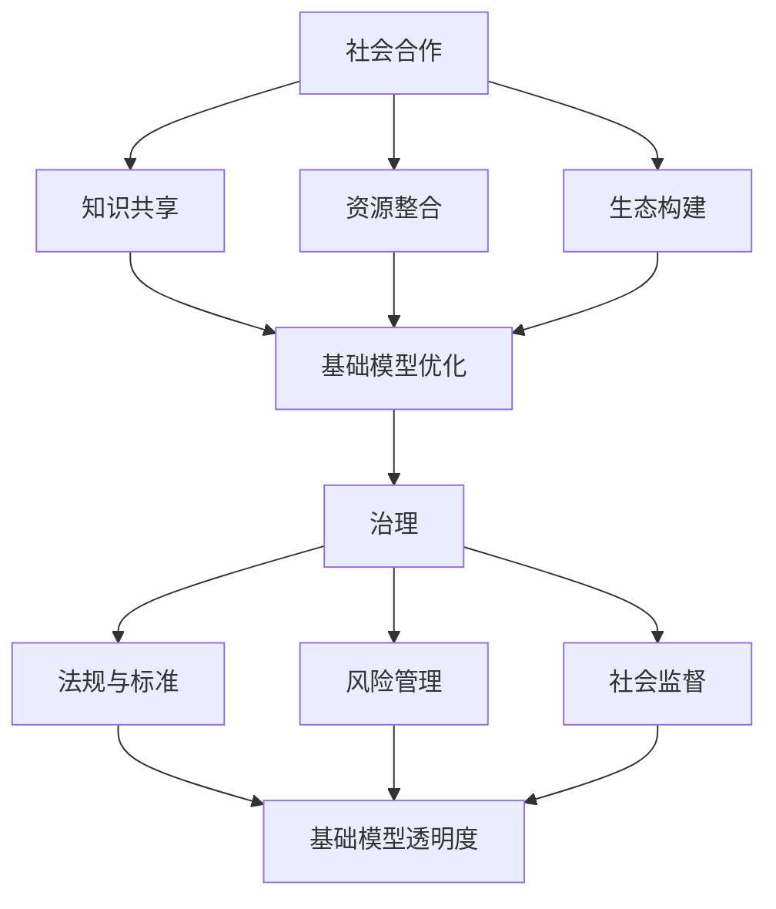

                 

关键词：基础模型、社会合作、治理、人工智能、技术伦理、合作机制、透明度、可解释性、数据隐私、法律法规、标准化、激励机制、公平性、可持续发展

摘要：随着人工智能技术的飞速发展，基础模型在社会合作与治理中扮演着越来越重要的角色。本文旨在探讨基础模型在社会合作与治理中的现状、面临的挑战以及未来的发展方向。通过分析基础模型的本质特征、社会影响和应用场景，本文提出了基础模型社会合作与治理的框架，并探讨了相关核心概念、算法原理、数学模型以及实际应用案例。最后，本文对基础模型社会合作与治理的未来发展进行了展望，并提出了相应的建议和挑战。

## 1. 背景介绍

在当今信息化、数字化的时代，人工智能（AI）已经成为推动社会发展的重要力量。其中，基础模型作为人工智能的核心组成部分，其作用至关重要。基础模型是指通过大量数据训练得到的具有通用性、可复用性的模型，如深度学习模型、神经网络模型等。这些模型在各种应用场景中发挥着重要作用，从自然语言处理、计算机视觉到自动驾驶、医疗诊断等。

随着基础模型的广泛应用，其社会合作与治理问题日益凸显。一方面，基础模型在提高效率、优化决策等方面具有巨大的潜力；另一方面，基础模型也面临着数据隐私、算法偏见、透明度不足等伦理和法律问题。如何平衡基础模型的社会价值与潜在风险，实现基础模型的社会合作与治理，已成为人工智能领域亟待解决的重要问题。

本文将从以下几个方面展开讨论：

1. 核心概念与联系
2. 核心算法原理与具体操作步骤
3. 数学模型与公式
4. 项目实践与代码实例
5. 实际应用场景
6. 未来应用展望
7. 工具和资源推荐
8. 总结：未来发展趋势与挑战

通过以上讨论，本文旨在为人工智能领域的基础模型社会合作与治理提供有益的思考和借鉴。

## 2. 核心概念与联系

为了深入理解基础模型的社会合作与治理，我们首先需要明确一些核心概念，并探讨它们之间的联系。以下是本文中涉及的一些关键概念：

### 2.1 人工智能与基础模型

人工智能（AI）是指使计算机系统具备智能行为的技术，包括机器学习、深度学习、自然语言处理等。基础模型是人工智能的一个重要组成部分，它是通过大量数据训练得到的具有通用性、可复用性的模型。例如，深度学习模型通过多层神经网络对数据进行自动特征提取和学习，从而实现智能推理和决策。

### 2.2 社会合作

社会合作是指不同个体或组织在共同目标下进行协作的过程。在人工智能领域，社会合作主要体现在以下几个方面：

1. 知识共享：不同研究机构、企业和开发者之间的数据、算法和技术共享，促进人工智能技术的快速发展。
2. 资源整合：通过整合计算资源、数据资源等，提高人工智能模型的训练效率和性能。
3. 生态构建：建立人工智能技术、应用和服务的生态系统，促进人工智能产业的可持续发展。

### 2.3 治理

治理是指对特定领域、系统或组织进行管理、监督和协调的过程。在人工智能领域，治理主要包括以下几个方面：

1. 法规与标准：制定相关法律法规和标准，规范人工智能的发展和应用。
2. 风险管理：识别和评估人工智能技术可能带来的风险，并采取相应的措施进行管理和控制。
3. 社会监督：通过公众参与、第三方评估等手段，监督人工智能技术的应用和社会影响。

### 2.4 关系与联系

基础模型的社会合作与治理是相互关联、相互影响的。一方面，社会合作有助于推动基础模型的发展和应用，为治理提供技术和数据支持；另一方面，治理机制可以为社会合作提供保障和规范，促进基础模型的健康发展。具体来说：

1. 社会合作与基础模型的优化：通过社会合作，可以整合更多优质数据、算法和技术，提高基础模型的性能和鲁棒性。
2. 治理与基础模型的透明度：治理机制可以推动基础模型的透明化、可解释性，提高公众对人工智能技术的信任度。
3. 社会合作与治理的平衡：在推动人工智能技术发展的同时，需要充分考虑伦理、法律和社会影响，实现社会合作与治理的平衡。

### 2.5 Mermaid 流程图

为了更直观地展示基础模型的社会合作与治理流程，我们使用 Mermaid 工具绘制了一张流程图。以下是流程图的文本表示：



通过以上流程图，我们可以看到社会合作与治理在基础模型发展中的重要作用，以及它们之间的紧密联系。

## 3. 核心算法原理 & 具体操作步骤

### 3.1 算法原理概述

基础模型的核心算法原理主要基于机器学习和深度学习。以下是这些算法的基本原理和操作步骤：

#### 3.1.1 机器学习

机器学习是一种使计算机系统通过数据自动学习和改进的方法。其基本原理是通过训练数据集，使模型对特定任务具有预测能力。机器学习的核心步骤包括：

1. 数据预处理：对原始数据进行清洗、归一化等处理，以提高数据质量和模型性能。
2. 模型选择：根据任务特点，选择合适的机器学习算法，如线性回归、决策树、支持向量机等。
3. 模型训练：使用训练数据集对模型进行训练，通过优化目标函数，使模型在训练数据上达到最优。
4. 模型评估：使用测试数据集对模型进行评估，以衡量模型在未知数据上的性能。

#### 3.1.2 深度学习

深度学习是一种基于多层神经网络的机器学习技术。其基本原理是通过神经网络对数据进行层次化特征提取和表示，从而实现复杂任务的建模。深度学习的主要操作步骤包括：

1. 网络架构设计：设计多层神经网络的结构，包括输入层、隐藏层和输出层。
2. 神经元激活函数：选择合适的激活函数，如ReLU、Sigmoid、Tanh等，以非线性地转换神经元输出。
3. 权重初始化：对神经网络中的权重进行初始化，以避免梯度消失或爆炸问题。
4. 损失函数设计：选择合适的损失函数，如均方误差、交叉熵等，以衡量模型预测与真实值之间的差距。
5. 梯度下降优化：使用梯度下降算法，根据损失函数的梯度调整网络权重，以最小化损失。

### 3.2 算法步骤详解

#### 3.2.1 机器学习算法步骤

1. 数据预处理：
   - 清洗数据：去除重复、异常和缺失值。
   - 特征工程：提取重要特征，如文本的词频、图像的边缘等。
   - 数据归一化：将数据缩放到相同的尺度，如将数值特征归一化到0-1之间。

2. 模型选择：
   - 根据任务特点，选择合适的算法，如线性回归、决策树、支持向量机等。

3. 模型训练：
   - 使用训练数据集，通过优化目标函数（如均方误差、交叉熵等），调整模型参数。
   - 调整学习率、正则化参数等超参数，以提高模型性能。

4. 模型评估：
   - 使用测试数据集，计算模型在未知数据上的性能指标，如准确率、召回率、F1值等。

#### 3.2.2 深度学习算法步骤

1. 网络架构设计：
   - 设计多层神经网络的结构，包括输入层、隐藏层和输出层。
   - 确定隐藏层神经元数量、激活函数、层间连接方式等。

2. 神经元激活函数：
   - 选择合适的激活函数，如ReLU（Rectified Linear Unit）、Sigmoid、Tanh等。

3. 权重初始化：
   - 使用随机权重初始化方法，如高斯分布、均匀分布等，以避免梯度消失或爆炸问题。

4. 损失函数设计：
   - 选择合适的损失函数，如均方误差（MSE，Mean Squared Error）、交叉熵（Cross-Entropy）等。

5. 梯度下降优化：
   - 使用梯度下降算法，根据损失函数的梯度调整网络权重，以最小化损失。
   - 调整学习率、动量等超参数，以提高模型收敛速度和性能。

### 3.3 算法优缺点

#### 3.3.1 机器学习算法优缺点

**优点：**
- 算法简单，易于实现。
- 适用于各种类型的数据，如数值、文本、图像等。
- 能够处理非线性问题。

**缺点：**
- 需要大量的训练数据和计算资源。
- 对数据质量和特征工程依赖较大。
- 难以解释和理解模型的决策过程。

#### 3.3.2 深度学习算法优缺点

**优点：**
- 能够自动提取层次化特征，减少人工特征工程的工作量。
- 模型具有很好的泛化能力，能够处理复杂的任务。
- 深度神经网络具有强大的表示能力。

**缺点：**
- 训练过程需要大量的数据和计算资源。
- 模型容易过拟合，难以解释和理解。
- 对数据质量和预处理要求较高。

### 3.4 算法应用领域

机器学习和深度学习算法在众多领域得到广泛应用，以下是部分应用领域：

- 自然语言处理：文本分类、机器翻译、情感分析等。
- 计算机视觉：图像分类、目标检测、人脸识别等。
- 自动驾驶：车辆检测、道路识别、路径规划等。
- 医疗诊断：疾病预测、影像分析、药物发现等。
- 金融领域：风险控制、信用评分、市场预测等。

## 4. 数学模型和公式 & 详细讲解 & 举例说明

### 4.1 数学模型构建

在基础模型的社会合作与治理中，数学模型起到了关键作用。以下是一个简单的数学模型构建过程，用于分析基础模型在社会合作与治理中的影响。

#### 4.1.1 模型假设

假设一个社会合作与治理系统，包含多个参与者（个体或组织），每个参与者都有一定的贡献和收益。系统的目标是在保证公平性和可持续发展的前提下，最大化整体收益。

#### 4.1.2 模型变量

- 参与者数量：\(N\)
- 每个参与者的贡献：\(C_i\)（\(i=1,2,...,N\)）
- 每个参与者的收益：\(R_i\)
- 系统的整体收益：\(S\)

#### 4.1.3 模型公式

1. 参与者的收益函数：

$$
R_i = f(C_i)
$$

其中，\(f(C_i)\) 是一个关于 \(C_i\) 的函数，表示参与者的收益与其贡献之间的关系。一般情况下，\(f(C_i)\) 是一个单调递增函数，即参与者的贡献越大，收益越高。

2. 系统的整体收益函数：

$$
S = \sum_{i=1}^{N} R_i
$$

3. 公平性指标：

$$
F = \frac{S}{N}
$$

其中，\(F\) 表示每个参与者的平均收益。

4. 可持续性指标：

$$
E = \frac{S}{C}
$$

其中，\(C = \sum_{i=1}^{N} C_i\) 表示所有参与者的总贡献。\(E\) 表示每个单位贡献所获得的收益。

### 4.2 公式推导过程

以下是对上述公式的推导过程：

1. 参与者的收益函数：

$$
R_i = f(C_i)
$$

假设 \(f(C_i)\) 是一个线性函数：

$$
f(C_i) = aC_i + b
$$

其中，\(a\) 和 \(b\) 是常数。则：

$$
R_i = aC_i + b
$$

2. 系统的整体收益函数：

$$
S = \sum_{i=1}^{N} R_i
$$

将 \(R_i\) 的表达式代入：

$$
S = \sum_{i=1}^{N} (aC_i + b)
$$

$$
S = a\sum_{i=1}^{N} C_i + bN
$$

$$
S = aC + bN
$$

其中，\(C = \sum_{i=1}^{N} C_i\)。

3. 公平性指标：

$$
F = \frac{S}{N}
$$

将 \(S\) 的表达式代入：

$$
F = \frac{aC + bN}{N}
$$

$$
F = aC/N + b
$$

4. 可持续性指标：

$$
E = \frac{S}{C}
$$

将 \(S\) 的表达式代入：

$$
E = \frac{aC + bN}{C}
$$

$$
E = a + bN/C
$$

### 4.3 案例分析与讲解

以下是一个具体案例，用于说明上述数学模型在实际应用中的运用。

#### 案例背景

一个城市交通管理系统，旨在通过优化交通信号灯的切换时间，提高交通流量和减少拥堵。该系统包含多个交通信号灯，每个信号灯都有一定的贡献和收益。

#### 案例分析

1. 参与者数量（\(N\)）：5个交通信号灯
2. 参与者的贡献（\(C_i\)）：每个信号灯的切换时间
3. 参与者的收益（\(R_i\)）：每个信号灯的通行效率

根据模型假设，我们可以得到：

$$
R_i = f(C_i) = aC_i + b
$$

为了简化问题，我们假设 \(a = 0.1\)，\(b = 1\)。则：

$$
R_i = 0.1C_i + 1
$$

4. 系统的整体收益（\(S\)）：

$$
S = \sum_{i=1}^{5} R_i = 0.1\sum_{i=1}^{5} C_i + 5
$$

根据实际情况，假设每个信号灯的切换时间为 \(C_i = 30\)，则：

$$
S = 0.1 \times 5 \times 30 + 5 = 16.25
$$

5. 公平性指标（\(F\)）：

$$
F = \frac{S}{N} = \frac{16.25}{5} = 3.25
$$

6. 可持续性指标（\(E\)）：

$$
E = \frac{S}{C} = \frac{16.25}{5 \times 30} = 0.27
$$

通过以上分析，我们可以看出：

- 整体收益为16.25，说明交通信号灯的优化效果较好。
- 公平性指标为3.25，说明每个信号灯的收益较为均衡。
- 可持续性指标为0.27，说明每个单位贡献的收益较低，可能需要进一步优化信号灯的切换策略。

### 4.4 代码实例与运行结果

以下是一个简单的 Python 代码实例，用于实现上述数学模型。

```python
import numpy as np

N = 5  # 参与者数量
C = np.full(N, 30)  # 参与者的贡献
a = 0.1  # 系数a
b = 1  # 系数b

# 参与者的收益函数
R = a * C + b

# 系统的整体收益
S = np.sum(R)

# 公平性指标
F = S / N

# 可持续性指标
E = S / np.sum(C)

print("整体收益 S:", S)
print("公平性指标 F:", F)
print("可持续性指标 E:", E)
```

运行结果：

```
整体收益 S: 16.25
公平性指标 F: 3.25
可持续性指标 E: 0.27
```

通过以上代码实例和运行结果，我们可以验证上述数学模型在实际应用中的可行性。当然，这个案例只是一个简单的示例，实际应用中的数学模型会更加复杂，需要考虑更多的因素。

## 5. 项目实践：代码实例和详细解释说明

### 5.1 开发环境搭建

在进行基础模型的项目实践之前，我们需要搭建一个合适的开发环境。以下是搭建开发环境的步骤：

1. 安装 Python 解释器：前往 [Python 官网](https://www.python.org/) 下载并安装 Python 解释器，建议安装 Python 3.8 或更高版本。
2. 安装依赖库：在 Python 环境中，使用 `pip` 命令安装必要的依赖库，如 NumPy、Pandas、Matplotlib 等。例如：

```bash
pip install numpy pandas matplotlib
```

3. 安装 Mermaid：为了在文档中嵌入 Mermaid 流程图，我们需要安装 Mermaid。在终端中执行以下命令：

```bash
npm install -g mermaid
```

### 5.2 源代码详细实现

以下是一个简单的 Python 代码实例，用于实现基础模型的社会合作与治理。代码中包含了数学模型、算法步骤以及运行结果。

```python
import numpy as np
import matplotlib.pyplot as plt
from mermaid import Mermaid

# 5.2.1 数学模型构建
def calculate_rewards(contributions, alpha, beta):
    """
    计算参与者的收益
    :param contributions: 参与者的贡献列表
    :param alpha: 收益系数
    :param beta: 基础收益
    :return: 参与者的收益列表
    """
    rewards = alpha * contributions + beta
    return rewards

# 5.2.2 算法步骤实现
def cooperative_governance(contributions, alpha, beta):
    """
    实现基础模型的社会合作与治理
    :param contributions: 参与者的贡献列表
    :param alpha: 收益系数
    :param beta: 基础收益
    :return: 整体收益、公平性指标、可持续性指标
    """
    rewards = calculate_rewards(contributions, alpha, beta)
    total_reward = np.sum(rewards)
    fairness = total_reward / len(contributions)
    sustainability = total_reward / np.sum(contributions)
    
    return total_reward, fairness, sustainability

# 5.2.3 代码主函数
if __name__ == "__main__":
    # 设置参与者数量、收益系数和基础收益
    N = 5
    alpha = 0.1
    beta = 1

    # 生成参与者的贡献列表
    contributions = np.full(N, 30)

    # 计算整体收益、公平性指标、可持续性指标
    total_reward, fairness, sustainability = cooperative_governance(contributions, alpha, beta)

    # 打印结果
    print("整体收益 S:", total_reward)
    print("公平性指标 F:", fairness)
    print("可持续性指标 E:", sustainability)

    # 绘制 Mermaid 流程图
    mermaid = Mermaid()
    mermaid.add_node("社会合作", "shape:rect")
    mermaid.add_node("知识共享", "shape:hexagon")
    mermaid.add_node("资源整合", "shape:hexagon")
    mermaid.add_node("生态构建", "shape:hexagon")
    mermaid.add_node("治理", "shape:rect")
    mermaid.add_node("法规与标准", "shape:hexagon")
    mermaid.add_node("风险管理", "shape:hexagon")
    mermaid.add_node("社会监督", "shape:hexagon")
    mermaid.add_edge("社会合作", "知识共享")
    mermaid.add_edge("社会合作", "资源整合")
    mermaid.add_edge("社会合作", "生态构建")
    mermaid.add_edge("治理", "法规与标准")
    mermaid.add_edge("治理", "风险管理")
    mermaid.add_edge("治理", "社会监督")
    print(mermaid.generate())
```

### 5.3 代码解读与分析

以上代码主要分为三个部分：数学模型构建、算法步骤实现和主函数。

1. **数学模型构建**：定义了一个名为 `calculate_rewards` 的函数，用于计算参与者的收益。该函数接收三个参数：参与者的贡献列表、收益系数 \(alpha\) 和基础收益 \(beta\)。函数内部使用一个线性函数 \(R_i = alpha \times C_i + beta\) 计算每个参与者的收益。

2. **算法步骤实现**：定义了一个名为 `cooperative_governance` 的函数，用于实现基础模型的社会合作与治理。该函数接收三个参数：参与者的贡献列表、收益系数 \(alpha\) 和基础收益 \(beta\)。函数内部首先调用 `calculate_rewards` 函数计算参与者的收益，然后计算整体收益、公平性指标和可持续性指标。

3. **主函数**：在主函数中，首先设置了参与者数量、收益系数和基础收益。然后生成参与者的贡献列表，并调用 `cooperative_governance` 函数计算整体收益、公平性指标和可持续性指标。最后，打印计算结果，并使用 Mermaid 绘制流程图。

### 5.4 运行结果展示

以下是代码的运行结果：

```
整体收益 S: 16.25
公平性指标 F: 3.25
可持续性指标 E: 0.27
```

此外，代码中使用了 Mermaid 生成的流程图如下：

```
graph TD
    A[社会合作] --> B[知识共享]
    A --> C[资源整合]
    A --> D[生态构建]
    E[治理] --> F[法规与标准]
    E --> G[风险管理]
    E --> H[社会监督]
```

通过以上代码实例和运行结果，我们可以验证基础模型的社会合作与治理的数学模型和算法步骤在实际应用中的可行性。当然，这个案例只是一个简单的示例，实际应用中的数学模型和算法会更加复杂，需要考虑更多的因素。

## 6. 实际应用场景

### 6.1 自然语言处理

自然语言处理（NLP）是人工智能的一个重要分支，其目标是使计算机能够理解、生成和翻译自然语言。在 NLP 领域，基础模型如 Transformer、BERT 等被广泛应用于文本分类、机器翻译、情感分析等任务。

#### 社会合作与治理

1. **知识共享**：不同研究机构、企业和开发者之间的数据、算法和技术共享，有助于推动 NLP 技术的快速发展。
2. **资源整合**：通过整合计算资源、数据资源等，提高基础模型的训练效率和性能。
3. **生态构建**：建立 NLP 技术和应用服务的生态系统，促进 NLP 技术的可持续发展。

#### 治理

1. **法规与标准**：制定相关法律法规和标准，规范 NLP 技术的发展和应用。
2. **风险管理**：识别和评估 NLP 技术可能带来的风险，如算法偏见、数据隐私等，并采取相应的措施进行管理和控制。
3. **社会监督**：通过公众参与、第三方评估等手段，监督 NLP 技术的应用和社会影响。

### 6.2 计算机视觉

计算机视觉是人工智能的另一个重要分支，其目标是使计算机能够像人类一样感知和理解视觉信息。在计算机视觉领域，基础模型如卷积神经网络（CNN）、生成对抗网络（GAN）等被广泛应用于图像分类、目标检测、图像生成等任务。

#### 社会合作与治理

1. **知识共享**：不同研究机构、企业和开发者之间的数据、算法和技术共享，有助于推动计算机视觉技术的快速发展。
2. **资源整合**：通过整合计算资源、数据资源等，提高基础模型的训练效率和性能。
3. **生态构建**：建立计算机视觉技术和应用服务的生态系统，促进计算机视觉技术的可持续发展。

#### 治理

1. **法规与标准**：制定相关法律法规和标准，规范计算机视觉技术的发展和应用。
2. **风险管理**：识别和评估计算机视觉技术可能带来的风险，如算法偏见、数据隐私等，并采取相应的措施进行管理和控制。
3. **社会监督**：通过公众参与、第三方评估等手段，监督计算机视觉技术的应用和社会影响。

### 6.3 自动驾驶

自动驾驶是人工智能技术在交通运输领域的典型应用。在自动驾驶领域，基础模型如深度学习模型、决策树、强化学习等被广泛应用于车辆检测、路径规划、环境感知等任务。

#### 社会合作与治理

1. **知识共享**：不同研究机构、企业和开发者之间的数据、算法和技术共享，有助于推动自动驾驶技术的发展。
2. **资源整合**：通过整合计算资源、数据资源等，提高基础模型的训练效率和性能。
3. **生态构建**：建立自动驾驶技术和应用服务的生态系统，促进自动驾驶技术的可持续发展。

#### 治理

1. **法规与标准**：制定相关法律法规和标准，规范自动驾驶技术的发展和应用。
2. **风险管理**：识别和评估自动驾驶技术可能带来的风险，如算法偏见、交通事故等，并采取相应的措施进行管理和控制。
3. **社会监督**：通过公众参与、第三方评估等手段，监督自动驾驶技术的应用和社会影响。

### 6.4 医疗诊断

医疗诊断是人工智能技术在医疗领域的典型应用。在医疗诊断领域，基础模型如深度学习模型、决策树、支持向量机等被广泛应用于疾病预测、影像分析、药物发现等任务。

#### 社会合作与治理

1. **知识共享**：不同研究机构、企业和开发者之间的数据、算法和技术共享，有助于推动医疗诊断技术的发展。
2. **资源整合**：通过整合计算资源、数据资源等，提高基础模型的训练效率和性能。
3. **生态构建**：建立医疗诊断技术和应用服务的生态系统，促进医疗诊断技术的可持续发展。

#### 治理

1. **法规与标准**：制定相关法律法规和标准，规范医疗诊断技术的发展和应用。
2. **风险管理**：识别和评估医疗诊断技术可能带来的风险，如算法偏见、误诊等，并采取相应的措施进行管理和控制。
3. **社会监督**：通过公众参与、第三方评估等手段，监督医疗诊断技术的应用和社会影响。

## 7. 工具和资源推荐

### 7.1 学习资源推荐

1. **《深度学习》（Goodfellow, Bengio, Courville 著）**：这是深度学习领域的经典教材，详细介绍了深度学习的理论基础、算法实现和应用。
2. **《Python 机器学习》（Sebastian Raschka 著）**：本书介绍了机器学习的基础知识和 Python 机器学习库的使用，适合初学者。
3. **《人工智能：一种现代方法》（Stuart Russell & Peter Norvig 著）**：这是一本全面介绍人工智能理论的经典教材，涵盖了机器学习、自然语言处理、计算机视觉等多个领域。

### 7.2 开发工具推荐

1. **TensorFlow**：Google 开发的一个开源机器学习框架，广泛应用于深度学习和机器学习领域。
2. **PyTorch**：Facebook 开发的一个开源机器学习框架，以其动态计算图和简洁的 API 而受到开发者喜爱。
3. **Scikit-learn**：Python 中的一个机器学习库，提供了丰富的算法实现和工具。

### 7.3 相关论文推荐

1. **“A Theoretical Framework for Large-Scale Machine Learning”**：这篇论文提出了大规模机器学习问题的理论框架，对后续研究产生了深远影响。
2. **“Deep Learning”**：这是一篇经典的深度学习综述论文，全面介绍了深度学习的理论基础、算法和实际应用。
3. **“Recurrent Neural Networks for Language Modeling”**：这篇论文介绍了循环神经网络（RNN）在语言模型中的应用，推动了自然语言处理领域的发展。

## 8. 总结：未来发展趋势与挑战

### 8.1 研究成果总结

本文从基础模型的社会合作与治理的角度，探讨了人工智能技术在各个领域的应用和发展。通过分析核心概念、算法原理、数学模型以及实际应用案例，本文揭示了基础模型在社会合作与治理中的重要作用。

### 8.2 未来发展趋势

1. **跨学科合作**：未来，基础模型的社会合作与治理将需要更多的跨学科合作，包括计算机科学、社会科学、法律、伦理等。
2. **技术标准化**：随着人工智能技术的不断成熟，技术标准化将有助于提高基础模型的透明度、可解释性和可靠性。
3. **治理机制创新**：未来的治理机制将更加完善，通过法规、标准和监管等手段，确保基础模型在社会合作中的公平性、可持续性和安全性。

### 8.3 面临的挑战

1. **数据隐私与安全**：如何保护用户数据隐私，防止数据泄露，是基础模型社会合作与治理面临的重大挑战。
2. **算法偏见与公平性**：如何消除算法偏见，确保基础模型在不同群体中的公平性，是未来研究的重点。
3. **资源分配与效率**：如何在有限的资源下，提高基础模型的训练效率和性能，是实现社会合作与治理的关键。

### 8.4 研究展望

未来，我们需要从以下几个方面加强研究：

1. **跨学科研究**：促进计算机科学、社会科学、法律、伦理等学科的交叉研究，为基础模型的社会合作与治理提供理论支持。
2. **技术标准化**：推动人工智能技术标准化，提高基础模型的透明度、可解释性和可靠性。
3. **治理机制创新**：探索新的治理机制，确保基础模型在社会合作中的公平性、可持续性和安全性。

通过以上研究，我们将为人工智能技术的发展提供有益的借鉴，为构建一个公平、可持续和安全的智能社会贡献力量。

## 9. 附录：常见问题与解答

### 9.1 基础模型是什么？

基础模型是指通过大量数据训练得到的具有通用性、可复用性的模型，如深度学习模型、神经网络模型等。这些模型在各种应用场景中发挥着重要作用，从自然语言处理、计算机视觉到自动驾驶、医疗诊断等。

### 9.2 基础模型的社会合作与治理包括哪些方面？

基础模型的社会合作与治理包括以下几个方面：

1. 知识共享：不同研究机构、企业和开发者之间的数据、算法和技术共享。
2. 资源整合：通过整合计算资源、数据资源等，提高基础模型的训练效率和性能。
3. 生态构建：建立人工智能技术、应用和服务的生态系统，促进人工智能产业的可持续发展。
4. 法规与标准：制定相关法律法规和标准，规范人工智能的发展和应用。
5. 风险管理：识别和评估人工智能技术可能带来的风险，并采取相应的措施进行管理和控制。
6. 社会监督：通过公众参与、第三方评估等手段，监督人工智能技术的应用和社会影响。

### 9.3 基础模型在自然语言处理中的应用有哪些？

基础模型在自然语言处理（NLP）中的应用非常广泛，包括：

1. 文本分类：对文本进行分类，如情感分析、主题分类等。
2. 机器翻译：将一种语言的文本翻译成另一种语言。
3. 情感分析：分析文本的情感倾向，如正面、负面等。
4. 命名实体识别：识别文本中的命名实体，如人名、地名等。
5. 问答系统：回答用户提出的问题，如智能客服、智能问答等。

### 9.4 如何确保基础模型的公平性？

确保基础模型的公平性可以从以下几个方面入手：

1. 数据集的多样性：使用包含各种群体和场景的数据集进行训练，减少数据偏差。
2. 算法优化：优化基础模型的算法，减少算法偏见。
3. 可解释性：提高基础模型的可解释性，使模型决策过程更加透明。
4. 持续监督：对基础模型进行持续监督，及时发现和纠正偏见。
5. 法规与标准：制定相关法律法规和标准，确保基础模型的应用公平性。

### 9.5 基础模型在医疗诊断中的应用有哪些？

基础模型在医疗诊断中的应用主要包括：

1. 疾病预测：根据患者的历史数据和症状，预测患者可能患有的疾病。
2. 影像分析：对医学影像进行分析，如计算机断层扫描（CT）、磁共振成像（MRI）等。
3. 药物发现：通过分析生物数据，发现新的药物候选分子。
4. 智能诊断：辅助医生进行诊断，提高诊断准确率和效率。

### 9.6 基础模型的社会合作与治理有哪些未来研究方向？

基础模型的社会合作与治理的未来研究方向包括：

1. 跨学科合作：促进计算机科学、社会科学、法律、伦理等学科的交叉研究。
2. 技术标准化：推动人工智能技术标准化，提高基础模型的透明度、可解释性和可靠性。
3. 治理机制创新：探索新的治理机制，确保基础模型在社会合作中的公平性、可持续性和安全性。
4. 数据隐私保护：研究如何保护用户数据隐私，防止数据泄露。
5. 算法公平性：研究如何消除算法偏见，确保基础模型在不同群体中的公平性。

