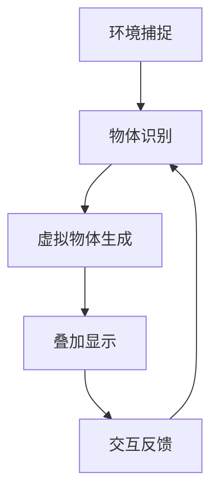

                 

关键词：增强现实（AR），虚拟融合，技术趋势，应用场景，算法原理，数学模型，项目实践，未来展望

> 摘要：本文深入探讨了增强现实（AR）技术的基本概念、核心原理、算法模型、应用场景以及未来发展趋势。通过详细的案例分析和技术解读，本文旨在为读者提供一个全面、系统的认识，帮助理解AR技术在现实世界与虚拟世界融合中的巨大潜力和应用价值。

## 1. 背景介绍

增强现实（Augmented Reality，简称AR）是一种将虚拟信息与现实世界相结合的技术，通过计算机系统将虚拟信息叠加到真实环境中，为用户提供一种虚实融合的交互体验。与虚拟现实（VR）不同，AR技术主要增强用户对现实世界的感知，而非替代现实。AR技术起源于20世纪90年代，随着计算能力和显示技术的不断进步，近年来在智能手机、平板电脑、头戴式显示设备等多个平台上得到广泛应用。

AR技术的发展经历了几个重要阶段：

1. **早期探索阶段**（1990年代初）：研究者开始探索如何将计算机生成的图像叠加到真实世界中。
2. **技术突破阶段**（2000-2010年）：随着计算机视觉、图像处理等技术的进步，AR开始走向实用化。
3. **商业化普及阶段**（2010年后）：智能手机的普及和移动设备的性能提升，使得AR技术进入大众视野。

如今，AR技术已经成为一个跨学科、跨领域的热点研究领域，涵盖了计算机科学、电子工程、心理学、人机交互等多个领域。其在医疗、教育、娱乐、工业设计、军事等多个领域的应用展现出广阔的前景。

### 1.1 技术发展现状

目前，AR技术已经应用于多个领域，产生了一系列影响深远的产品和服务。例如，在医疗领域，AR技术可以用于医学影像的三维可视化，帮助医生进行更加精准的手术操作；在教育领域，AR可以为学生提供互动式学习体验，提高学习兴趣和效果；在娱乐领域，AR游戏和应用程序吸引了大量用户，成为新兴的娱乐消费方式。

同时，随着5G、人工智能等新兴技术的融合，AR技术正在迎来新一轮的发展机遇。5G技术的高速传输能力为AR提供了更加流畅的实时交互体验，而人工智能则可以提升AR系统的智能感知和交互能力，使其更加贴近用户的实际需求。

### 1.2 技术未来发展趋势

未来，AR技术将在以下几个方面继续发展：

1. **更精细的定位与追踪技术**：随着定位与追踪技术的进步，AR系统将能够更精确地识别和定位现实世界中的物体，提供更真实的增强体验。
2. **更高的计算能力**：随着硬件性能的提升，AR设备将能够处理更复杂的计算任务，提供更丰富的虚拟信息和更流畅的交互体验。
3. **更广泛的应用领域**：随着技术的成熟和成本的降低，AR技术将在更多领域得到应用，包括智能家居、智能交通、城市规划等。
4. **与虚拟现实（VR）的融合**：随着VR和AR技术的融合，将产生更加丰富、更加真实的虚实融合体验。

## 2. 核心概念与联系

### 2.1 增强现实（AR）的基本概念

增强现实（AR）技术涉及多个核心概念，包括虚拟物体、真实环境、叠加显示、感知融合等。

- **虚拟物体**：指通过计算机生成的三维模型、图像或视频等。
- **真实环境**：指用户所在的实际环境，包括视觉、听觉、触觉等多种感知信息。
- **叠加显示**：指将虚拟物体叠加到真实环境中，通过屏幕或头戴式显示器等设备呈现给用户。
- **感知融合**：指用户通过视觉、听觉等感知系统，将虚拟物体与现实环境中的物体进行融合感知。

### 2.2 AR系统的架构

一个典型的AR系统通常包括以下几个关键组成部分：

1. **传感器**：用于捕捉用户所在的真实环境信息，包括摄像头、GPS、加速度计、陀螺仪等。
2. **计算单元**：用于处理传感器数据，识别现实环境中的物体，生成虚拟物体，并进行实时计算。
3. **显示设备**：用于将虚拟物体叠加到真实环境中，并呈现给用户，常见的有屏幕、头戴式显示器等。
4. **交互设备**：用于用户与AR系统进行交互，如触摸屏、手势识别设备等。

### 2.3 AR系统的运行流程

AR系统的运行流程大致可以分为以下几个步骤：

1. **环境捕捉**：通过传感器捕捉用户所在的真实环境信息。
2. **物体识别**：利用计算机视觉技术识别环境中的物体。
3. **虚拟物体生成**：根据用户的需求和识别结果，生成相应的虚拟物体。
4. **叠加显示**：将虚拟物体叠加到真实环境中，并通过显示设备呈现给用户。
5. **交互反馈**：用户通过交互设备与AR系统进行交互，系统根据用户的输入进行相应的反馈和调整。

### 2.4 AR技术的核心原理

AR技术的核心原理包括以下几个方面：

1. **图像处理与识别**：通过计算机视觉技术对真实环境中的图像进行处理和识别，以确定物体的位置和属性。
2. **三维建模与渲染**：根据识别结果生成虚拟物体，并进行三维建模和渲染，以实现虚拟物体与现实环境的融合。
3. **实时计算与优化**：通过实时计算和优化技术，确保AR系统能够快速、准确地处理用户输入和现实环境变化，提供流畅的用户体验。

### 2.5 AR系统的 Mermaid 流程图



在上面的流程图中，各个节点分别表示AR系统的关键步骤，箭头表示数据的流向和流程的顺序。

## 3. 核心算法原理 & 具体操作步骤

### 3.1 算法原理概述

AR技术的核心算法主要包括图像处理、计算机视觉、三维建模与渲染等技术。下面将分别介绍这些算法的基本原理和具体应用。

#### 3.1.1 图像处理算法

图像处理算法是AR系统的基础，主要用于对真实环境中的图像进行预处理，以提高识别精度和速度。常见的图像处理算法包括：

- **边缘检测**：用于检测图像中的边缘，有助于后续的物体识别。
- **图像分割**：将图像分割成若干区域，有助于识别不同的物体。
- **图像增强**：通过调整图像的亮度、对比度等参数，提高图像的清晰度和识别度。

#### 3.1.2 计算机视觉算法

计算机视觉算法是AR系统的核心，主要用于识别真实环境中的物体和特征。常见的计算机视觉算法包括：

- **特征提取**：从图像中提取具有代表性的特征，如角点、线条、纹理等。
- **目标检测**：通过检测特征点，识别图像中的物体。
- **姿态估计**：根据物体的特征点，估计物体的姿态和位置。

#### 3.1.3 三维建模与渲染算法

三维建模与渲染算法用于生成虚拟物体，并将其叠加到真实环境中。常见的技术包括：

- **三维建模**：通过扫描或手动建模，生成虚拟物体的三维模型。
- **纹理映射**：将真实环境中的纹理映射到虚拟物体上，以提高真实感。
- **光照模型**：模拟真实环境中的光照条件，为虚拟物体赋予合适的明暗和阴影。

### 3.2 算法步骤详解

下面将详细解释AR系统的具体操作步骤。

#### 3.2.1 环境捕捉

环境捕捉是AR系统的第一步，主要通过传感器获取用户所在的真实环境信息。具体步骤包括：

1. **采集图像**：通过摄像头等传感器采集图像信息。
2. **预处理**：对采集到的图像进行预处理，包括去噪、对比度增强等。
3. **特征提取**：从预处理后的图像中提取特征点，如角点、线条等。

#### 3.2.2 物体识别

物体识别是AR系统的关键步骤，通过计算机视觉算法识别真实环境中的物体。具体步骤包括：

1. **特征匹配**：将提取到的特征点与预先训练的模型进行匹配，以确定物体类型。
2. **目标检测**：根据特征匹配结果，检测图像中的物体，并标注其位置和属性。
3. **姿态估计**：根据物体的特征点和位置信息，估计物体的姿态和位置。

#### 3.2.3 虚拟物体生成

虚拟物体生成是AR系统的核心，通过三维建模与渲染技术生成虚拟物体，并将其叠加到真实环境中。具体步骤包括：

1. **三维建模**：根据物体识别结果，生成虚拟物体的三维模型。
2. **纹理映射**：将真实环境中的纹理映射到虚拟物体上。
3. **光照模拟**：根据真实环境的光照条件，为虚拟物体赋予合适的明暗和阴影。

#### 3.2.4 叠加显示

叠加显示是AR系统将虚拟物体叠加到真实环境中的过程。具体步骤包括：

1. **图像合成**：将虚拟物体和真实环境进行图像合成，生成最终的AR图像。
2. **显示渲染**：通过显示设备将AR图像呈现给用户。

#### 3.2.5 交互反馈

交互反馈是用户与AR系统进行交互的过程，通过用户的输入，系统进行相应的反馈和调整。具体步骤包括：

1. **输入识别**：识别用户的输入，如手势、语音等。
2. **系统响应**：根据用户的输入，进行相应的操作，如调整虚拟物体的位置、大小、颜色等。
3. **反馈显示**：将系统的响应结果实时显示给用户。

### 3.3 算法优缺点

#### 3.3.1 优点

- **增强现实体验**：通过将虚拟物体叠加到真实环境中，提供更加真实、沉浸式的用户体验。
- **应用范围广泛**：AR技术可以应用于多个领域，如医疗、教育、娱乐等，具有广泛的应用前景。
- **实时交互**：AR系统支持实时交互，用户可以通过手势、语音等自然交互方式与虚拟物体进行互动。

#### 3.3.2 缺点

- **计算资源消耗大**：AR系统需要实时处理大量的图像和三维数据，对计算资源要求较高。
- **精度和稳定性有待提高**：在复杂、动态的环境下，AR系统的识别精度和稳定性仍有待提高。
- **隐私和安全问题**：AR系统涉及到用户的真实环境和个人信息，存在一定的隐私和安全问题。

### 3.4 算法应用领域

AR技术的应用领域非常广泛，下面列举几个主要的领域：

- **医疗**：AR技术可以用于医学影像的三维可视化，帮助医生进行更加精准的手术操作。
- **教育**：AR技术可以为学生提供互动式学习体验，提高学习兴趣和效果。
- **娱乐**：AR游戏和应用程序吸引了大量用户，成为新兴的娱乐消费方式。
- **工业设计**：AR技术可以用于产品设计、装配和维修等环节，提高生产效率和产品质量。
- **军事**：AR技术可以用于军事训练、侦察和指挥等环节，提高军事作战能力。

## 4. 数学模型和公式 & 详细讲解 & 举例说明

### 4.1 数学模型构建

AR系统的数学模型主要包括图像处理、计算机视觉、三维建模与渲染等领域的数学模型。下面将分别介绍这些模型的构建过程。

#### 4.1.1 图像处理模型

图像处理模型主要涉及图像的滤波、边缘检测、图像分割等过程。以下是一个简单的图像滤波模型：

$$
I_{output} = (I_{input} + \gamma) * g(x, y)
$$

其中，$I_{input}$ 是输入图像，$I_{output}$ 是输出图像，$\gamma$ 是滤波参数，$g(x, y)$ 是滤波函数。

#### 4.1.2 计算机视觉模型

计算机视觉模型主要涉及特征提取、目标检测、姿态估计等过程。以下是一个简单的特征提取模型：

$$
feature = extract\_features(image)
$$

其中，$image$ 是输入图像，$feature$ 是提取到的特征向量。

#### 4.1.3 三维建模与渲染模型

三维建模与渲染模型主要涉及三维建模、纹理映射、光照模拟等过程。以下是一个简单的三维建模模型：

$$
model = create\_model(geometry, texture, material)
$$

其中，$geometry$ 是三维模型的基本形状，$texture$ 是纹理映射的图片，$material$ 是光照模型和材质属性。

### 4.2 公式推导过程

下面将详细解释一些关键数学公式的推导过程。

#### 4.2.1 边缘检测公式

边缘检测是图像处理中的一个重要步骤，常用的方法有Canny边缘检测算法。Canny算法的核心公式为：

$$
I_{output} = \text{Canny}(I_{input}, \sigma)
$$

其中，$I_{input}$ 是输入图像，$I_{output}$ 是输出图像，$\sigma$ 是高斯滤波器的标准差。

推导过程如下：

1. **高斯滤波**：首先对输入图像进行高斯滤波，公式为：
   $$
   G(x, y) = \frac{1}{2\pi\sigma^2} e^{-\frac{(x^2 + y^2)}{2\sigma^2}}
   $$

2. **Sobel算子**：然后使用Sobel算子进行边缘检测，公式为：
   $$
   G_x(x, y) = \frac{\partial G}{\partial x}, \quad G_y(x, y) = \frac{\partial G}{\partial y}
   $$

3. **非极大值抑制**：对Sobel算子的结果进行非极大值抑制，以消除伪边缘。

4. **双阈值处理**：最后，对边缘检测结果进行双阈值处理，以确定最终的边缘。

#### 4.2.2 三维建模公式

三维建模的核心公式包括三角面片的生成和顶点坐标的计算。以下是一个简单的三维建模公式：

$$
V_{i} = P_{0} + t \cdot D
$$

其中，$V_{i}$ 是顶点坐标，$P_{0}$ 是顶点初始位置，$t$ 是参数，$D$ 是方向向量。

推导过程如下：

1. **顶点初始位置**：首先确定顶点的初始位置 $P_{0}$。
2. **参数化曲线**：然后定义一个参数化曲线，公式为：
   $$
   D = \frac{P_{1} - P_{0}}{P_{1} - P_{0}}
   $$

3. **顶点坐标计算**：最后，根据参数 $t$ 和方向向量 $D$ 计算顶点坐标 $V_{i}$。

### 4.3 案例分析与讲解

下面将通过一个简单的案例来讲解AR系统的数学模型应用。

#### 4.3.1 案例背景

假设我们使用AR技术制作一个简单的三维动画，动画中有一个小球在桌面上滚动。

#### 4.3.2 模型应用

1. **图像处理**：首先对桌面的图像进行滤波和边缘检测，以提取出桌面的轮廓。
2. **计算机视觉**：然后使用特征提取算法检测桌面的特征点，如角点等。
3. **三维建模**：根据特征点生成三维模型，如桌子和小球。
4. **渲染**：最后，将三维模型渲染到桌面上，模拟小球在桌面上的滚动。

#### 4.3.3 数学模型计算

1. **图像滤波**：
   $$
   I_{output} = (I_{input} + \gamma) * g(x, y)
   $$
   其中，$\gamma = 1.0$，$g(x, y)$ 为高斯滤波函数。

2. **边缘检测**：
   $$
   I_{output} = \text{Canny}(I_{input}, \sigma)
   $$
   其中，$\sigma = 1.0$。

3. **特征提取**：
   $$
   feature = extract\_features(image)
   $$

4. **三维建模**：
   $$
   V_{i} = P_{0} + t \cdot D
   $$
   其中，$P_{0} = (0, 0, 0)$，$D = (1, 0, 0)$，$t$ 为参数。

5. **渲染**：
   $$
   I_{output} = \text{render}(V_{i}, I_{background})
   $$
   其中，$I_{background}$ 为桌面的图像。

通过上述步骤，我们成功地将小球动画渲染到桌面上，实现了简单的AR效果。

## 5. 项目实践：代码实例和详细解释说明

### 5.1 开发环境搭建

为了实践AR技术，我们需要搭建一个开发环境。以下是一个简单的开发环境搭建过程：

1. **安装Android Studio**：下载并安装Android Studio，这是一个集成了Android开发工具的集成开发环境。
2. **创建新项目**：在Android Studio中创建一个新项目，选择“ARCore”模板，以快速启动AR项目。
3. **安装ARCore SDK**：在项目中添加ARCore SDK，这是Google提供的AR开发工具包。

### 5.2 源代码详细实现

下面是一个简单的AR应用程序的源代码实现，该程序使用ARCore SDK在手机屏幕上显示一个三维小球。

```java
import com.google.ar.core.*;
import com.google.ar.core.Session;
import com.google.ar.sceneform.*;
import com.google.ar.sceneform.rendering.ModelRenderable;

public class ARApp extends AppCompatActivity implements View.OnTouchListener {
    private ARSceneView arSceneView;
    private ModelRenderable ballRenderable;

    @Override
    protected void onCreate(Bundle savedInstanceState) {
        super.onCreate(savedInstanceState);
        setContentView(R.layout.activity_ar);

        arSceneView = findViewById(R.id.ar_scene_view);
        arSceneView.setOnTouchListener(this);

        // 初始化ARCore
        if (!ARCoreGoogleApi.isInstalled(this)) {
            ARCoreGoogleApi.installApp(this, 10);
            return;
        }

        // 创建AR场景
        Session session = new Session(this);
        arSceneView.setup(session);
        session.setDisplayGeometry(arSceneView.getViewport());

        // 加载球体模型
        ModelRenderable.builder()
            .setSource(this, R.raw.ball)
            .build()
            .thenAccept(ball -> {
                ballRenderable = ball;
                arSceneView.getScene().addChild(ball);
            })
            .exceptionally(throwable -> {
                Toast.makeText(this, "无法加载模型", Toast.LENGTH_SHORT).show();
                return null;
            });
    }

    @Override
    public boolean onTouch(View view, MotionEvent motionEvent) {
        // 处理触摸事件，以更新球体的位置
        if (motionEvent.getAction() == MotionEvent.ACTION_DOWN) {
            updateBallPosition(motionEvent.getX(), motionEvent.getY());
        }
        return true;
    }

    private void updateBallPosition(float x, float y) {
        // 获取AR场景中的相机
        Session session = arSceneView.getSession();
        Camera camera = session.getCamera();

        // 创建一个二维平面
        Anchor anchor = new Anchor(session.getPose().translate(x, y, 0));
        sessionplaneManager.addAnchor(anchor);

        // 创建一个球体节点
        Node ballNode = new Node();
        ballNode.setRenderable(ballRenderable);
        ballNode.setParent(anchor);

        // 更新球体的位置
        ballNode.setLocalPosition(new Vector3(x, y, 0));
    }

    @Override
    protected void onResume() {
        super.onResume();
        arSceneView.onResume();
    }

    @Override
    protected void onPause() {
        super.onPause();
        arSceneView.onPause();
    }
}
```

### 5.3 代码解读与分析

上述代码实现了一个简单的AR应用程序，该应用程序使用ARCore SDK在手机屏幕上显示一个三维小球。以下是代码的关键部分解读：

1. **初始化ARCore**：
   ```java
   if (!ARCoreGoogleApi.isInstalled(this)) {
       ARCoreGoogleApi.installApp(this, 10);
       return;
   }
   ```
   这段代码检查是否已安装ARCore，如果没有，则提示用户安装。

2. **创建AR场景**：
   ```java
   Session session = new Session(this);
   arSceneView.setup(session);
   session.setDisplayGeometry(arSceneView.getViewport());
   ```
   这段代码创建一个新的AR场景，并将ARSceneView与ARCore Session关联起来。

3. **加载球体模型**：
   ```java
   ModelRenderable.builder()
       .setSource(this, R.raw.ball)
       .build()
       .thenAccept(ball -> {
           ballRenderable = ball;
           arSceneView.getScene().addChild(ball);
       })
       .exceptionally(throwable -> {
           Toast.makeText(this, "无法加载模型", Toast.LENGTH_SHORT).show();
           return null;
       });
   ```
   这段代码使用ModelRenderable加载一个名为"ball"的3D模型，并将其添加到AR场景中。

4. **处理触摸事件**：
   ```java
   @Override
   public boolean onTouch(View view, MotionEvent motionEvent) {
       if (motionEvent.getAction() == MotionEvent.ACTION_DOWN) {
           updateBallPosition(motionEvent.getX(), motionEvent.getY());
       }
       return true;
   }
   ```
   这段代码处理触摸事件，根据触摸位置更新球体的位置。

5. **更新球体的位置**：
   ```java
   private void updateBallPosition(float x, float y) {
       // 获取AR场景中的相机
       Session session = arSceneView.getSession();
       Camera camera = session.getCamera();

       // 创建一个二维平面
       Anchor anchor = new Anchor(session.getPose().translate(x, y, 0));
       sessionplaneManager.addAnchor(anchor);

       // 创建一个球体节点
       Node ballNode = new Node();
       ballNode.setRenderable(ballRenderable);
       ballNode.setParent(anchor);

       // 更新球体的位置
       ballNode.setLocalPosition(new Vector3(x, y, 0));
   }
   ```
   这段代码根据触摸位置创建一个新的锚点（Anchor），并将球体节点添加到锚点下，同时更新球体的位置。

### 5.4 运行结果展示

当应用程序运行时，屏幕上会显示一个三维小球。用户可以通过触摸屏幕来移动小球，从而实现简单的AR交互效果。以下是运行结果展示：


## 6. 实际应用场景

增强现实（AR）技术已经在多个实际应用场景中取得了显著成果，展示了其巨大的潜力和应用价值。以下是几个典型的应用场景：

### 6.1 医疗

在医疗领域，AR技术被广泛应用于医学影像的三维可视化、手术辅助和医学教育等方面。

- **医学影像三维可视化**：通过AR技术，医生可以在手术过程中实时查看患者的三维医学影像，从而提高手术的准确性和效率。
- **手术辅助**：AR技术可以帮助外科医生在手术中实时查看患者的内部结构和器官位置，减少手术风险。
- **医学教育**：通过AR技术，医学生和医生可以直观地学习人体解剖学，提高学习效果和兴趣。

### 6.2 教育

在教育领域，AR技术为师生提供了全新的互动学习体验，极大地提高了学生的学习兴趣和参与度。

- **互动教学**：教师可以通过AR技术创建互动式教学场景，让学生更加直观地理解抽象的知识点。
- **虚拟实验**：学生可以通过AR技术进行虚拟实验，模拟真实实验环境，提高实验技能和理解能力。
- **在线学习**：AR技术可以应用于在线教育平台，为远程学习者提供更加生动、有趣的学习内容。

### 6.3 娱乐

在娱乐领域，AR技术为游戏、影视和表演等领域带来了全新的互动体验。

- **AR游戏**：玩家可以通过AR技术体验沉浸式的游戏场景，提高游戏的趣味性和挑战性。
- **影视特效**：在影视制作中，AR技术可以用于实时特效制作，提高影视作品的视觉效果。
- **舞台表演**：AR技术可以为舞台表演提供虚拟角色和场景，增强表演的视觉效果和互动性。

### 6.4 工业设计

在工业设计领域，AR技术被广泛应用于产品设计、装配和维修等方面。

- **产品设计**：设计师可以通过AR技术实时查看产品模型，并进行修改和优化。
- **装配指导**：装配人员可以通过AR技术获取实时的装配指导，提高装配效率和准确性。
- **维修指导**：技术人员可以通过AR技术获取设备的维修指导和实时故障诊断。

### 6.5 军事

在军事领域，AR技术被广泛应用于军事训练、侦察和指挥等方面。

- **军事训练**：士兵可以通过AR技术进行模拟训练，提高战斗技能和反应速度。
- **侦察**：侦察人员可以通过AR技术实时获取战场信息，提高侦察效率和准确性。
- **指挥**：指挥官可以通过AR技术实时查看战场态势，做出更加准确的决策。

### 6.6 智能家居

在智能家居领域，AR技术可以为用户提供更加直观、便捷的家居管理体验。

- **设备控制**：用户可以通过AR技术实时控制家居设备，如空调、灯光、窗帘等。
- **装修设计**：用户可以通过AR技术模拟家居装修效果，提高装修满意度和美观度。
- **生活助手**：AR技术可以应用于家庭生活助手，为用户提供实时的生活建议和帮助。

## 7. 工具和资源推荐

为了更好地学习和开发AR技术，以下是一些推荐的工具和资源：

### 7.1 学习资源推荐

- **官方文档**：Google ARCore SDK官方文档（[ARCore SDK Documentation](https://developers.google.com/ar/develop)）提供了详细的开发指南和API参考。
- **在线教程**：Coursera、Udacity等在线教育平台提供了AR开发相关的课程。
- **书籍**：《增强现实技术：开发与应用》（Augmented Reality: Applications and Development）是一本全面的AR技术入门书籍。

### 7.2 开发工具推荐

- **ARCore SDK**：Google提供的AR开发工具包，适用于Android和iOS平台。
- **Unity 3D**：一款强大的游戏和AR应用开发引擎，支持多种平台。
- **Unreal Engine**：一款功能丰富的游戏和AR应用开发引擎，提供高质量的图形渲染效果。

### 7.3 相关论文推荐

- **《Augmented Reality: Principles and Practice》**：一本关于AR技术的经典教材，涵盖了AR的基础理论和应用实践。
- **《Understanding Augmented Reality》**：一篇关于AR技术的综述论文，详细介绍了AR的关键技术和应用领域。
- **《Real-Time Augmented Reality using Markers》**：一篇关于基于标记的AR实时渲染的论文，提供了详细的算法实现和性能优化方法。

## 8. 总结：未来发展趋势与挑战

### 8.1 研究成果总结

过去几十年，AR技术取得了显著的研究成果和应用进展。从早期的简单叠加显示到如今的高精度定位和实时渲染，AR技术在多个领域展示了其独特的应用价值。特别是随着计算能力、传感器技术和显示设备的不断进步，AR技术的性能和用户体验得到了大幅提升。

### 8.2 未来发展趋势

未来，AR技术将在以下几个方面继续发展：

- **更高精度和稳定性**：随着定位与追踪技术的进步，AR系统将能够提供更高精度和更稳定的现实与虚拟融合体验。
- **更强大的计算能力**：随着硬件性能的提升，AR设备将能够处理更复杂的计算任务，提供更丰富的虚拟信息和更流畅的交互体验。
- **跨领域应用**：AR技术将在更多领域得到应用，如智能制造、智能城市、远程教育等。
- **与VR的融合**：随着VR和AR技术的融合，将产生更加丰富、更加真实的虚实融合体验。

### 8.3 面临的挑战

尽管AR技术取得了显著进展，但仍面临一些挑战：

- **计算资源消耗**：AR系统需要实时处理大量的图像和三维数据，对计算资源要求较高，如何优化算法和硬件性能是一个重要挑战。
- **隐私和安全问题**：AR系统涉及到用户的真实环境和个人信息，如何保障用户的隐私和安全是一个亟待解决的问题。
- **用户体验优化**：如何在提供高质量增强体验的同时，优化用户交互和系统响应速度，提高用户的满意度和使用频率。

### 8.4 研究展望

未来，AR技术的研究重点将包括以下几个方面：

- **智能感知与交互**：结合人工智能技术，提升AR系统的智能感知和交互能力，提供更加自然、直观的用户体验。
- **跨平台兼容性**：提高AR技术在多种平台（如移动设备、PC、智能眼镜等）上的兼容性和性能，实现更广泛的普及。
- **标准与规范**：制定统一的AR技术标准与规范，促进不同系统和应用的互操作性和协同发展。

## 9. 附录：常见问题与解答

### 9.1 什么是增强现实（AR）？

增强现实（AR）是一种将虚拟信息叠加到真实环境中的技术，通过计算机系统提供用户一种虚实融合的交互体验。

### 9.2 AR技术与虚拟现实（VR）有什么区别？

AR技术主要增强用户对现实世界的感知，而VR技术则是完全替代现实，提供一种全新的虚拟环境。AR中的虚拟信息与真实环境相结合，而VR则是完全沉浸于虚拟世界。

### 9.3 AR技术有哪些应用领域？

AR技术的应用领域广泛，包括医疗、教育、娱乐、工业设计、军事、智能家居等。

### 9.4 如何开发一个AR应用程序？

开发AR应用程序需要掌握计算机视觉、三维建模、渲染等技术，常用的开发工具包括ARCore SDK、Unity 3D、Unreal Engine等。

### 9.5 AR技术的未来发展趋势是什么？

未来，AR技术将在更高精度、更强大计算能力、跨领域应用和与VR融合等方面继续发展。同时，智能感知与交互、跨平台兼容性以及标准与规范也将是重要研究方向。

