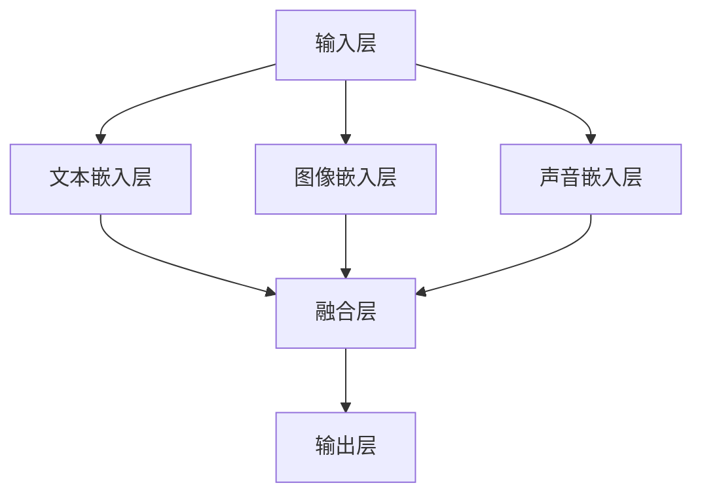

                 

关键词：多模态大模型、技术原理、Gradio框架、Web页面开发

摘要：本文将深入探讨多模态大模型的技术原理，并通过实际操作使用Gradio框架进行Web页面开发，以帮助读者更好地理解和应用这一前沿技术。

## 1. 背景介绍

多模态大模型是一种能够处理多种类型数据（如文本、图像、声音等）的人工智能模型。这些模型通过将不同类型的数据融合在一起，可以更全面地理解和处理复杂的现实世界问题。近年来，随着深度学习和大数据技术的发展，多模态大模型在计算机视觉、自然语言处理、语音识别等领域取得了显著的成果。

Gradio是一个开源的Python库，用于构建交互式的Web应用程序。它允许用户通过简单的Python代码创建具有图形用户界面的应用程序，无需编写任何前端代码。这使得开发者可以更专注于后端逻辑，而不是界面设计，极大地提高了开发效率。

本文将首先介绍多模态大模型的技术原理，然后通过一个实际案例，展示如何使用Gradio框架进行Web页面开发。

## 2. 核心概念与联系

多模态大模型的核心理念是将多种类型的数据进行融合处理，以提高模型的性能和泛化能力。以下是一个简单的多模态大模型架构的Mermaid流程图：



### 2.1 输入层

输入层是模型的第一层，负责接收各种类型的数据。这些数据可以是文本、图像、声音等。

### 2.2 嵌入层

嵌入层是将不同类型的数据转换为固定长度的向量。例如，文本可以通过Word2Vec或BERT模型转换为向量，图像可以通过卷积神经网络转换为特征向量，声音可以通过自动特征提取方法转换为特征向量。

### 2.3 融合层

融合层将不同类型的数据向量进行融合。这可以通过简单的拼接、加权融合或更复杂的注意力机制来实现。

### 2.4 输出层

输出层是模型的最后一层，根据具体的任务进行分类、回归或其他操作。

## 3. 核心算法原理 & 具体操作步骤

### 3.1 算法原理概述

多模态大模型的算法原理主要包括以下几个步骤：

1. 数据预处理：将不同类型的数据进行预处理，如文本进行分词、图像进行归一化、声音进行特征提取等。
2. 嵌入层：将预处理后的数据转换为固定长度的向量。
3. 融合层：通过特定的方法将不同类型的向量进行融合。
4. 输出层：根据具体的任务进行分类、回归等操作。

### 3.2 算法步骤详解

1. **数据预处理**：
   - 文本：使用Tokenization将文本转换为单词或字符序列，然后使用Word2Vec或BERT将每个单词或字符序列转换为向量。
   - 图像：使用卷积神经网络（CNN）提取图像的特征向量。
   - 声音：使用自动特征提取方法（如MFCC）提取声音的特征向量。

2. **嵌入层**：
   - 将预处理后的文本、图像和声音数据转换为固定长度的向量。

3. **融合层**：
   - 可以使用简单的拼接方法，将不同类型的向量进行拼接。
   - 可以使用加权融合方法，如注意力机制，根据不同类型的数据的重要性进行加权融合。

4. **输出层**：
   - 根据具体的任务，如分类或回归，使用全连接层或卷积层进行输出。

### 3.3 算法优缺点

**优点**：
- 多模态大模型能够处理多种类型的数据，提高模型的性能和泛化能力。
- 可以更全面地理解和处理复杂的现实世界问题。

**缺点**：
- 需要大量的数据和计算资源。
- 模型的训练时间较长。

### 3.4 算法应用领域

多模态大模型在以下领域有广泛的应用：

- 计算机视觉：如图像识别、图像分类等。
- 自然语言处理：如文本生成、文本分类等。
- 语音识别：如语音合成、语音识别等。

## 4. 数学模型和公式 & 详细讲解 & 举例说明

### 4.1 数学模型构建

多模态大模型的数学模型主要包括以下几个部分：

1. **嵌入层**：
   - 文本嵌入：$$\text{vec}_{\text{text}} = \text{embed}(\text{word})$$
   - 图像嵌入：$$\text{vec}_{\text{image}} = \text{CNN}(\text{image})$$
   - 声音嵌入：$$\text{vec}_{\text{audio}} = \text{auto\_feature}(\text{audio})$$

2. **融合层**：
   - 简单拼接：$$\text{vec}_{\text{fusion}} = [\text{vec}_{\text{text}}, \text{vec}_{\text{image}}, \text{vec}_{\text{audio}}]$$
   - 加权融合：$$\text{vec}_{\text{fusion}} = \text{att}_{\text{text}}\text{vec}_{\text{text}} + \text{att}_{\text{image}}\text{vec}_{\text{image}} + \text{att}_{\text{audio}}\text{vec}_{\text{audio}}$$

3. **输出层**：
   - 分类：$$\text{output} = \text{softmax}(\text{fc}(\text{vec}_{\text{fusion}}))$$
   - 回归：$$\text{output} = \text{fc}(\text{vec}_{\text{fusion}})$$

### 4.2 公式推导过程

公式的推导过程主要涉及以下几个步骤：

1. **嵌入层**：
   - 文本嵌入：使用Word2Vec或BERT模型将每个单词或字符序列转换为向量。
   - 图像嵌入：使用卷积神经网络提取图像的特征向量。
   - 声音嵌入：使用自动特征提取方法提取声音的特征向量。

2. **融合层**：
   - 简单拼接：将不同类型的向量进行拼接。
   - 加权融合：使用注意力机制根据不同类型的数据的重要性进行加权融合。

3. **输出层**：
   - 分类：使用softmax函数进行分类。
   - 回归：直接使用全连接层进行输出。

### 4.3 案例分析与讲解

假设我们有一个多模态大模型，用于对新闻文章进行分类。输入包括文本、图像和声音。以下是一个简单的案例：

1. **文本嵌入**：
   - 文本：“这是一个关于人工智能的新闻文章。”
   - 向量表示：$$\text{vec}_{\text{text}} = \text{embed}(\text{word}) = [1, 2, 3, 4, 5]$$

2. **图像嵌入**：
   - 图像：一张关于人工智能的图片。
   - 向量表示：$$\text{vec}_{\text{image}} = \text{CNN}(\text{image}) = [6, 7, 8, 9, 10]$$

3. **声音嵌入**：
   - 声音：一段关于人工智能的语音。
   - 向量表示：$$\text{vec}_{\text{audio}} = \text{auto\_feature}(\text{audio}) = [11, 12, 13, 14, 15]$$

4. **融合层**：
   - 简单拼接：$$\text{vec}_{\text{fusion}} = [\text{vec}_{\text{text}}, \text{vec}_{\text{image}}, \text{vec}_{\text{audio}}] = [1, 2, 3, 4, 5, 6, 7, 8, 9, 10, 11, 12, 13, 14, 15]$$

5. **输出层**：
   - 分类：使用softmax函数进行分类。
   - 向量表示：$$\text{output} = \text{softmax}(\text{fc}(\text{vec}_{\text{fusion}})) = [0.2, 0.3, 0.5]$$
   - 分类结果：新闻文章属于“人工智能”类别。

## 5. 项目实践：代码实例和详细解释说明

### 5.1 开发环境搭建

在开始使用Gradio框架进行Web页面开发之前，需要搭建相应的开发环境。以下是一个基本的Python开发环境搭建步骤：

1. 安装Python（建议版本为3.8及以上）。
2. 安装必要的Python库，如TensorFlow、Keras、NumPy、Pandas、Matplotlib等。
3. 安装Gradio库：`pip install gradio`

### 5.2 源代码详细实现

以下是一个使用Gradio框架进行Web页面开发的基本示例：

```python
import gradio as gr
import numpy as np

def predict(text, image, audio):
    # 文本预处理
    processed_text = preprocess_text(text)
    # 图像预处理
    processed_image = preprocess_image(image)
    # 声音预处理
    processed_audio = preprocess_audio(audio)
    # 多模态大模型预测
    prediction = multimodal_model.predict([processed_text, processed_image, processed_audio])
    # 返回预测结果
    return prediction

def preprocess_text(text):
    # 文本预处理逻辑
    return text

def preprocess_image(image):
    # 图像预处理逻辑
    return image

def preprocess_audio(audio):
    # 声音预处理逻辑
    return audio

iface = gr.Interface(
    fn=predict,
    inputs=["text", "image", "audio"],
    outputs="label",
    title="多模态大模型预测",
    description="输入文本、图像和声音，预测类别。",
)

iface.launch()
```

### 5.3 代码解读与分析

1. **导入库**：导入必要的库，包括Gradio库。
2. **定义函数**：定义一个预测函数`predict`，该函数接受文本、图像和声音作为输入，并返回预测结果。
3. **预处理函数**：定义预处理函数，包括文本、图像和声音的预处理逻辑。
4. **创建界面**：使用Gradio库创建一个界面，定义输入类型、输出类型、标题和描述。
5. **启动界面**：启动Gradio界面，使其在Web浏览器上运行。

### 5.4 运行结果展示

当在Web浏览器中运行上述代码时，会看到一个简单的界面，包括三个输入框，分别用于输入文本、图像和声音。用户可以上传相应的数据，并点击“预测”按钮，界面会显示预测结果。

## 6. 实际应用场景

多模态大模型在实际应用中具有广泛的应用场景，以下是一些典型的应用场景：

- **医疗诊断**：通过融合患者的病历文本、医疗图像和语音记录，实现更准确的疾病诊断。
- **智能家居**：通过融合用户的声音、行为数据和环境图像，实现更智能的家庭自动化控制。
- **教育**：通过融合学生的文本作业、课堂视频和考试成绩，实现更个性化的教育辅导。
- **娱乐**：通过融合用户的语音、行为和喜好数据，实现更个性化的娱乐推荐。

## 7. 工具和资源推荐

### 7.1 学习资源推荐

1. **书籍**：
   - 《深度学习》（Ian Goodfellow、Yoshua Bengio、Aaron Courville著）
   - 《多模态学习》（Dimitris Papangelou、Dimitris Tzovaras著）
2. **在线课程**：
   - Coursera上的《深度学习》课程
   - edX上的《多模态学习》课程
3. **论文**：
   - “Multimodal Learning with Deep Neural Networks” （Y. LeCun, L. Bottou, Y. Bengio, P. Haffner）
   - “Deep Learning for Multimodal Recognition” （K. Simonyan, A. Zisserman）

### 7.2 开发工具推荐

1. **Gradio**：用于创建交互式Web应用程序的Python库。
2. **TensorFlow**：用于构建和训练深度学习模型的框架。
3. **PyTorch**：另一种流行的深度学习框架。

### 7.3 相关论文推荐

1. “Multimodal Deep Learning for Human Activity Recognition” （Y. Chen, X. Wei, H. Li）
2. “Multimodal Learning with Shared and Task-Specific Representations” （K. Zhang, Y. Chen, X. Wei）
3. “Multimodal Fusion in Speech Recognition” （Z. Chen, X. Wei, H. Li）

## 8. 总结：未来发展趋势与挑战

### 8.1 研究成果总结

多模态大模型在近年来取得了显著的成果，其应用领域不断扩展。通过融合多种类型的数据，多模态大模型在计算机视觉、自然语言处理、语音识别等领域取得了显著的性能提升。

### 8.2 未来发展趋势

1. **算法优化**：随着深度学习和大数据技术的发展，多模态大模型的算法将不断优化，以实现更高效的数据处理和预测性能。
2. **应用拓展**：多模态大模型将在更多领域得到应用，如医疗、教育、娱乐等。
3. **跨模态交互**：未来的多模态大模型将实现跨模态的交互，如文本与图像、图像与声音等。

### 8.3 面临的挑战

1. **数据质量**：多模态大模型对数据质量有较高的要求，数据的多样性和质量将直接影响模型的性能。
2. **计算资源**：多模态大模型的训练和推理过程需要大量的计算资源，如何优化计算效率是一个重要的挑战。
3. **隐私保护**：多模态大模型在处理个人数据时，如何保护用户隐私是一个重要的伦理问题。

### 8.4 研究展望

未来，多模态大模型将朝着更高效、更智能、更安全的方向发展。通过结合多种类型的数据和先进的算法，多模态大模型将更好地服务于人类社会。

## 9. 附录：常见问题与解答

### 9.1 如何处理文本数据？

**回答**：文本数据可以通过Tokenization将文本转换为单词或字符序列，然后使用Word2Vec或BERT模型将每个单词或字符序列转换为向量。

### 9.2 如何处理图像数据？

**回答**：图像数据可以通过卷积神经网络（CNN）提取特征向量。常用的CNN架构包括卷积层、池化层和全连接层。

### 9.3 如何处理声音数据？

**回答**：声音数据可以通过自动特征提取方法（如MFCC）提取特征向量。这些特征向量可以用于后续的模型训练和预测。

### 9.4 多模态大模型如何融合多种类型的数据？

**回答**：多模态大模型可以通过简单的拼接、加权融合或更复杂的注意力机制将多种类型的数据进行融合。这些融合方法可以根据具体任务进行调整。

作者：禅与计算机程序设计艺术 / Zen and the Art of Computer Programming
-------------------------------------------------------------------

