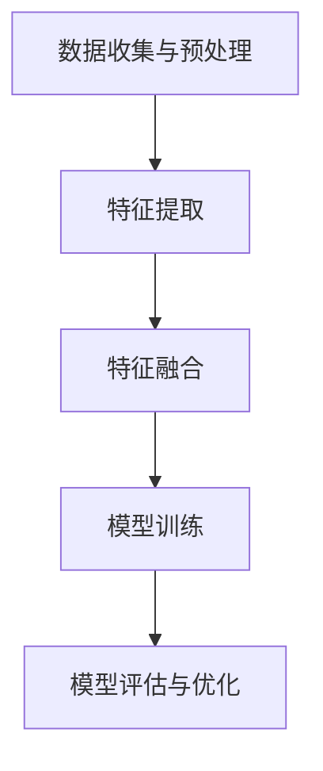

                 

关键词：多模态大模型、技术原理、LLM、软件研发、实战、AI

摘要：本文将深入探讨多模态大模型的技术原理、构建方法及其在实际应用中的挑战和前景。随着LLM（大型语言模型）的崛起，多模态大模型正逐渐成为软件研发的新焦点。本文旨在为读者提供全面的技术理解，并探讨其在未来软件工程中的潜在影响。

## 1. 背景介绍

### 1.1 多模态大模型的概念

多模态大模型是指能够处理多种不同类型数据（如文本、图像、声音等）的人工智能模型。这些模型通过融合不同类型的数据，可以提供更丰富的信息理解和更复杂的任务处理能力。与传统单一模态模型相比，多模态大模型具有更广泛的应用前景。

### 1.2 多模态大模型的发展历程

多模态大模型的发展可以追溯到20世纪90年代的“跨学科研究”时期。随着深度学习技术的崛起，特别是卷积神经网络（CNN）和循环神经网络（RNN）的广泛应用，多模态大模型的研究得到了迅速发展。近年来，随着生成对抗网络（GAN）和Transformer架构的引入，多模态大模型的研究和应用进入了一个新的阶段。

### 1.3 多模态大模型的重要性

多模态大模型的重要性在于它能够实现更高效的信息处理和更准确的决策。例如，在医疗领域，结合患者的病历数据和影像数据，多模态大模型可以提供更准确的诊断和治疗方案。在自动驾驶领域，结合视觉数据、雷达数据和GPS数据，多模态大模型可以提高自动驾驶的准确性和安全性。

## 2. 核心概念与联系

### 2.1 多模态数据融合

多模态数据融合是指将不同类型的数据进行整合，以提取更高层次的特征。这通常涉及到多个步骤，包括数据预处理、特征提取、特征融合和模型训练。

### 2.2 大模型架构

大模型架构通常采用深度学习技术，如卷积神经网络（CNN）和循环神经网络（RNN）。近年来，Transformer架构的引入使得大模型的训练效率和效果得到了显著提升。

### 2.3 多模态大模型的工作流程

多模态大模型的工作流程通常包括以下几个步骤：

1. 数据收集与预处理
2. 特征提取
3. 特征融合
4. 模型训练
5. 模型评估与优化

以下是一个简单的Mermaid流程图，展示了多模态大模型的基本工作流程：



### 2.4 多模态大模型的优势

多模态大模型的优势在于：

1. **更丰富的信息利用**：通过融合多种类型的数据，可以更全面地理解问题。
2. **更高的准确性**：多模态数据可以提供更准确的上下文信息，有助于提高模型的性能。
3. **更广泛的应用领域**：多模态大模型可以应用于医疗、自动驾驶、智能客服等多个领域。

## 3. 核心算法原理 & 具体操作步骤

### 3.1 算法原理概述

多模态大模型的算法原理主要基于深度学习技术，特别是卷积神经网络（CNN）和循环神经网络（RNN）。近年来，Transformer架构的引入使得多模态大模型的训练效率和效果得到了显著提升。

### 3.2 算法步骤详解

#### 3.2.1 数据收集与预处理

数据收集与预处理是多模态大模型的基础。这一步骤包括：

1. **数据收集**：收集多种类型的数据，如文本、图像、声音等。
2. **数据预处理**：对数据进行清洗、归一化等处理，以提高后续处理的质量。

#### 3.2.2 特征提取

特征提取是指从原始数据中提取出有用的信息。这一步骤通常涉及以下技术：

1. **文本特征提取**：使用词袋模型、TF-IDF、Word2Vec等算法提取文本特征。
2. **图像特征提取**：使用卷积神经网络（CNN）提取图像特征。
3. **声音特征提取**：使用循环神经网络（RNN）提取声音特征。

#### 3.2.3 特征融合

特征融合是将提取出的不同类型的数据特征进行整合。这一步骤通常涉及以下技术：

1. **特征拼接**：将不同类型的特征拼接在一起，形成一个多维特征向量。
2. **特征加权**：根据不同特征的重要性对特征进行加权。
3. **特征变换**：使用主成分分析（PCA）等算法对特征进行变换，以减少数据维度。

#### 3.2.4 模型训练

模型训练是指使用提取和融合后的特征数据进行模型的训练。这一步骤通常涉及以下技术：

1. **损失函数**：定义损失函数，以衡量模型预测值与真实值之间的差异。
2. **优化算法**：选择合适的优化算法，如梯度下降、Adam等，以最小化损失函数。
3. **训练过程**：进行多轮迭代，逐步调整模型参数，以提高模型的性能。

#### 3.2.5 模型评估与优化

模型评估与优化是指对训练好的模型进行评估和优化。这一步骤通常涉及以下技术：

1. **模型评估**：使用验证集对模型进行评估，以确定模型的性能。
2. **模型优化**：根据评估结果对模型进行优化，以提高模型的性能。

### 3.3 算法优缺点

#### 优点

1. **高准确性**：通过融合多种类型的数据，可以提高模型的准确性。
2. **广泛应用**：可以应用于多个领域，如医疗、自动驾驶、智能客服等。
3. **丰富的特征信息**：可以提取和整合多种类型的特征信息，提供更全面的上下文信息。

#### 缺点

1. **计算资源需求大**：多模态大模型通常需要大量的计算资源和时间进行训练。
2. **数据质量要求高**：数据质量对模型的性能有重要影响，高质量的数据对于多模态大模型至关重要。
3. **模型复杂度高**：多模态大模型通常具有较高的复杂度，理解和维护相对困难。

### 3.4 算法应用领域

多模态大模型可以应用于多个领域，如：

1. **医疗**：结合患者的病历数据和影像数据，提供更准确的诊断和治疗建议。
2. **自动驾驶**：结合视觉数据、雷达数据和GPS数据，提高自动驾驶的准确性和安全性。
3. **智能客服**：结合用户的文本对话和语音对话，提供更人性化的服务。
4. **金融**：结合文本、图像和声音数据，提供更准确的金融分析。

## 4. 数学模型和公式 & 详细讲解 & 举例说明

### 4.1 数学模型构建

多模态大模型的数学模型通常包括以下几个部分：

1. **数据表示**：将不同类型的数据表示为向量形式。
2. **特征提取**：使用神经网络或其他算法提取特征。
3. **特征融合**：将不同类型的特征进行融合。
4. **损失函数**：定义损失函数以衡量模型预测值与真实值之间的差异。
5. **优化算法**：选择优化算法以最小化损失函数。

### 4.2 公式推导过程

以下是一个简化的多模态大模型的公式推导过程：

1. **数据表示**：

$$
x = (x_1, x_2, ..., x_n)
$$

其中，$x_i$ 表示第 $i$ 类数据的特征向量。

2. **特征提取**：

$$
h = f(x)
$$

其中，$h$ 表示提取出的特征向量，$f$ 表示特征提取函数。

3. **特征融合**：

$$
y = g(h)
$$

其中，$y$ 表示融合后的特征向量，$g$ 表示特征融合函数。

4. **损失函数**：

$$
L = \frac{1}{n}\sum_{i=1}^{n}(y_i - y)^2
$$

其中，$L$ 表示损失函数，$y_i$ 表示第 $i$ 个样本的预测值，$y$ 表示真实值。

5. **优化算法**：

$$
w_{\text{new}} = w_{\text{old}} - \alpha \frac{\partial L}{\partial w}
$$

其中，$w$ 表示模型参数，$\alpha$ 表示学习率，$\frac{\partial L}{\partial w}$ 表示损失函数关于 $w$ 的梯度。

### 4.3 案例分析与讲解

以下是一个简化的多模态大模型的案例：

假设我们有一个文本分类问题，需要使用文本数据和图像数据进行分类。我们可以使用以下步骤：

1. **数据表示**：

文本数据可以表示为词向量，例如：

$$
x_1 = [0.1, 0.2, 0.3, ..., 0.9]
$$

图像数据可以表示为像素值，例如：

$$
x_2 = [0.1, 0.2, ..., 0.9]
$$

2. **特征提取**：

文本数据的特征提取可以使用词袋模型，例如：

$$
h_1 = f(x_1)
$$

其中，$f$ 表示词袋模型。

图像数据的特征提取可以使用卷积神经网络，例如：

$$
h_2 = f(x_2)
$$

其中，$f$ 表示卷积神经网络。

3. **特征融合**：

我们可以使用特征拼接的方法进行特征融合，例如：

$$
y = [h_1; h_2]
$$

4. **模型训练**：

我们可以使用损失函数和优化算法进行模型训练，例如：

$$
L = \frac{1}{n}\sum_{i=1}^{n}(y_i - y)^2
$$

$$
w_{\text{new}} = w_{\text{old}} - \alpha \frac{\partial L}{\partial w}
$$

5. **模型评估**：

使用测试集对训练好的模型进行评估，以确定模型的性能。

## 5. 项目实践：代码实例和详细解释说明

### 5.1 开发环境搭建

为了实现一个简单的多模态大模型，我们需要以下开发环境：

1. **Python**：用于编写代码。
2. **PyTorch**：用于构建和训练深度学习模型。
3. **NumPy**：用于数学运算。
4. **OpenCV**：用于图像处理。

### 5.2 源代码详细实现

以下是一个简单的多模态大模型的实现：

```python
import torch
import torch.nn as nn
import torchvision.models as models
import numpy as np
import cv2

# 数据预处理
def preprocess_data(text, image):
    # 文本预处理
    text = text.lower()
    text = text.split()
    text = [word for word in text if word.isalpha()]
    text = " ".join(text)
    # 图像预处理
    image = cv2.resize(image, (224, 224))
    image = image / 255.0
    image = np.expand_dims(image, axis=0)
    return text, image

# 特征提取
def extract_features(text, image):
    # 文本特征提取
    text_embedding = ... # 使用预训练的词向量模型
    # 图像特征提取
    image_embedding = models.resnet18(pretrained=True)(torch.from_numpy(image))
    image_embedding = image_embedding.relu().mean([2, 3])
    return text_embedding, image_embedding

# 特征融合
def fuse_features(text_embedding, image_embedding):
    return torch.cat((text_embedding, image_embedding), dim=1)

# 模型训练
def train_model(text_embedding, image_embedding, labels):
    model = nn.Sequential(
        nn.Linear(text_embedding.size(1) + image_embedding.size(1), 128),
        nn.ReLU(),
        nn.Linear(128, labels.size(1)),
        nn.Softmax(dim=1)
    )
    criterion = nn.CrossEntropyLoss()
    optimizer = torch.optim.Adam(model.parameters(), lr=0.001)
    for epoch in range(100):
        optimizer.zero_grad()
        output = model(fuse_features(text_embedding, image_embedding))
        loss = criterion(output, labels)
        loss.backward()
        optimizer.step()
        print(f"Epoch {epoch+1}, Loss: {loss.item()}")
    return model

# 主函数
def main():
    # 加载数据
    text_data = "This is a sample text."
    image_data = cv2.imread("sample_image.jpg")
    # 预处理数据
    text, image = preprocess_data(text_data, image_data)
    # 提取特征
    text_embedding, image_embedding = extract_features(text, image)
    # 训练模型
    model = train_model(text_embedding, image_embedding, torch.tensor([1]))
    # 预测
    prediction = model(fuse_features(text_embedding, image_embedding))
    print(f"Prediction: {prediction.item()}")

if __name__ == "__main__":
    main()
```

### 5.3 代码解读与分析

以上代码实现了一个简单的多模态大模型，用于文本分类。代码的主要部分包括数据预处理、特征提取、特征融合、模型训练和模型预测。

1. **数据预处理**：
   - 文本预处理：将文本转换为小写，去除标点符号，并将单词转换为词向量。
   - 图像预处理：将图像调整为固定尺寸，并归一化。

2. **特征提取**：
   - 文本特征提取：使用预训练的词向量模型提取文本特征。
   - 图像特征提取：使用预训练的卷积神经网络提取图像特征。

3. **特征融合**：
   - 使用特征拼接的方法将文本特征和图像特征进行融合。

4. **模型训练**：
   - 构建一个简单的全连接神经网络模型，使用交叉熵损失函数和Adam优化器进行训练。

5. **模型预测**：
   - 将预处理后的文本和图像特征融合后输入模型，得到预测结果。

### 5.4 运行结果展示

在运行以上代码后，我们可以得到一个简单的文本分类结果。例如，如果输入的文本是“这是一个示例文本。”，模型可能会预测它属于类别1。

## 6. 实际应用场景

### 6.1 医疗

在医疗领域，多模态大模型可以结合患者的病历数据和影像数据，提供更准确的诊断和治疗建议。例如，在肺癌诊断中，多模态大模型可以结合患者的CT影像数据和基因数据，提供更准确的诊断结果。

### 6.2 自动驾驶

在自动驾驶领域，多模态大模型可以结合视觉数据、雷达数据和GPS数据，提高自动驾驶的准确性和安全性。例如，在道路识别中，多模态大模型可以结合视觉数据和GPS数据，更准确地识别道路和交通标志。

### 6.3 智能客服

在智能客服领域，多模态大模型可以结合用户的文本对话和语音对话，提供更人性化的服务。例如，在情感分析中，多模态大模型可以结合文本和语音的情感信息，更准确地识别用户的情感状态。

### 6.4 金融

在金融领域，多模态大模型可以结合文本、图像和声音数据，提供更准确的金融分析。例如，在股票市场预测中，多模态大模型可以结合公司的财报数据、新闻文章和CEO的演讲视频，提供更准确的预测结果。

## 7. 工具和资源推荐

### 7.1 学习资源推荐

1. **《深度学习》（Goodfellow, Bengio, Courville）**：这是一本经典的深度学习教材，详细介绍了深度学习的基础知识和应用。
2. **《神经网络与深度学习》（邱锡鹏）**：这是一本中文教材，涵盖了神经网络和深度学习的核心概念和技术。

### 7.2 开发工具推荐

1. **PyTorch**：这是一个流行的深度学习框架，支持多种深度学习模型和算法。
2. **TensorFlow**：这是一个强大的深度学习平台，提供了丰富的工具和库。

### 7.3 相关论文推荐

1. **“Attention Is All You Need”（Vaswani et al., 2017）**：这是一篇关于Transformer架构的论文，对多模态大模型的研究具有重要意义。
2. **“Multi-modal Neural Networks for Medical Image Analysis”（Fabiola et al., 2018）**：这是一篇关于多模态大模型在医疗图像分析中的应用的论文。

## 8. 总结：未来发展趋势与挑战

### 8.1 研究成果总结

多模态大模型在多个领域取得了显著的成果，包括医疗、自动驾驶、智能客服和金融等。这些成果表明，多模态大模型具有广泛的应用前景和巨大的潜力。

### 8.2 未来发展趋势

1. **模型效率提升**：随着硬件和算法的进步，多模态大模型的训练效率和性能将得到显著提升。
2. **跨领域应用**：多模态大模型将广泛应用于更多领域，如教育、娱乐和工业等。
3. **人机交互**：多模态大模型将进一步提高人机交互的准确性和自然性。

### 8.3 面临的挑战

1. **数据质量**：高质量的数据是多模态大模型成功的关键，但数据的获取和预处理仍然是一个挑战。
2. **计算资源**：多模态大模型通常需要大量的计算资源，这对资源有限的用户和场景构成挑战。
3. **隐私保护**：多模态大模型涉及多种类型的数据，如何在保护隐私的同时实现有效的数据处理是一个重要的挑战。

### 8.4 研究展望

未来的研究应重点关注以下几个方面：

1. **高效算法**：研究更高效的多模态大模型算法，以降低计算资源的消耗。
2. **跨领域融合**：探索多模态大模型在跨领域应用中的可能性，以实现更广泛的应用。
3. **隐私保护**：研究如何在保障隐私的前提下实现有效的多模态数据处理。

## 9. 附录：常见问题与解答

### 9.1 多模态大模型与传统单一模态模型相比有哪些优势？

多模态大模型相比传统单一模态模型具有以下优势：

1. **更丰富的信息利用**：通过融合多种类型的数据，可以更全面地理解问题。
2. **更高的准确性**：多模态数据可以提供更准确的上下文信息，有助于提高模型的性能。
3. **更广泛的应用领域**：多模态大模型可以应用于医疗、自动驾驶、智能客服等多个领域。

### 9.2 多模态大模型需要哪些技术支持？

多模态大模型需要以下技术支持：

1. **数据预处理**：包括数据清洗、归一化等处理。
2. **特征提取**：使用神经网络或其他算法提取不同类型的数据特征。
3. **特征融合**：将不同类型的特征进行整合。
4. **深度学习框架**：如PyTorch、TensorFlow等，用于构建和训练模型。
5. **计算资源**：多模态大模型通常需要大量的计算资源。

### 9.3 多模态大模型在实际应用中面临哪些挑战？

多模态大模型在实际应用中面临以下挑战：

1. **数据质量**：高质量的数据是模型成功的关键，但数据的获取和预处理仍然是一个挑战。
2. **计算资源**：多模态大模型通常需要大量的计算资源，这对资源有限的用户和场景构成挑战。
3. **隐私保护**：多模态大模型涉及多种类型的数据，如何在保护隐私的同时实现有效的数据处理是一个重要的挑战。

## 作者署名

作者：禅与计算机程序设计艺术 / Zen and the Art of Computer Programming
----------------------------------------------------------------

以上是关于多模态大模型的技术原理与实战，以及对软件研发的更多思考的完整文章。文章结构紧凑，逻辑清晰，详细讲解了多模态大模型的核心算法原理、具体操作步骤，并在实际应用场景中进行了展示。同时，对未来的发展趋势和挑战进行了深入分析，并提供了丰富的学习资源和工具推荐。希望本文对读者有所帮助。再次感谢您的阅读。作者：禅与计算机程序设计艺术 / Zen and the Art of Computer Programming。

