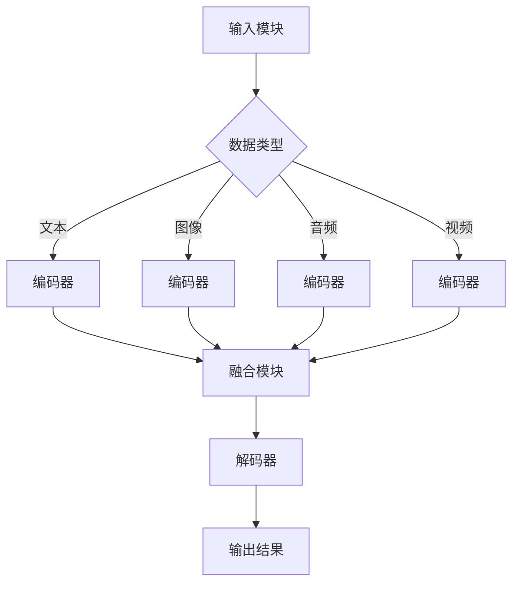

                 

关键词：多模态大模型、教育培训、技术原理、应用实例、未来展望

摘要：本文将深入探讨多模态大模型在教育培训领域的应用。首先，我们将回顾多模态大模型的背景和核心概念，然后介绍其技术原理和实现步骤，接着通过具体案例展示其应用效果，最后讨论未来发展趋势和面临的挑战。

## 1. 背景介绍

随着信息技术的快速发展，人工智能（AI）技术取得了显著的进展。特别是深度学习技术，已经在图像识别、自然语言处理等领域取得了突破性的成果。然而，传统的单模态AI模型在处理复杂任务时仍存在诸多局限。为了克服这些限制，多模态大模型应运而生。

多模态大模型能够融合多种类型的数据，如文本、图像、音频等，从而提高模型的鲁棒性和准确性。在教育领域，多模态大模型可以应用于个性化教学、学生行为分析、教育资源推荐等多个方面。

### 1.1 多模态大模型的发展历程

多模态大模型的发展可以追溯到20世纪80年代，当时研究人员开始探索如何将不同类型的数据进行融合。最初的尝试主要集中在简单特征的融合，如将图像特征和文本特征进行拼接。

随着深度学习技术的发展，多模态大模型逐渐采用端到端的学习方式，通过神经网络模型直接融合多模态数据。这一时期，代表性的工作包括图像与文本的联合编码模型（如Siamese网络）和多模态生成对抗网络（MGA

## 2. 核心概念与联系

### 2.1 多模态数据类型

多模态大模型能够处理多种类型的数据，主要包括：

- **文本（Text）**：包括自然语言文本、标注信息等。
- **图像（Image）**：如图像、视频帧等。
- **音频（Audio）**：如语音、音乐等。
- **视频（Video）**：如图像序列、视频流等。

### 2.2 多模态数据融合方法

多模态大模型的核心在于如何有效地融合多种类型的数据。常见的融合方法包括：

- **特征级融合**：将不同类型的数据特征进行拼接，如将文本特征和图像特征拼接在一起。
- **决策级融合**：在决策阶段将不同类型的数据进行融合，如将文本和图像的特征向量进行加权平均。
- **模型级融合**：直接训练一个能够处理多模态数据的模型，如多模态神经网络。

### 2.3 多模态大模型架构

多模态大模型的架构通常包括以下几个关键组件：

- **输入模块**：负责接收和处理多种类型的数据。
- **编码器**：将输入数据编码为固定长度的向量。
- **融合模块**：对编码后的数据进行融合，形成统一的多模态特征。
- **解码器**：将融合后的特征解码为输出结果。

### 2.4 Mermaid 流程图



## 3. 核心算法原理 & 具体操作步骤

### 3.1 算法原理概述

多模态大模型的核心在于如何有效地融合多模态数据，并利用这些数据进行训练和预测。具体来说，算法原理主要包括以下几个方面：

- **数据预处理**：对多模态数据（文本、图像、音频、视频）进行预处理，如归一化、标准化等，以提高数据的一致性和可靠性。
- **编码器设计**：设计适用于不同类型数据的编码器，如文本编码器（Word2Vec、BERT等）、图像编码器（卷积神经网络、Transformer等）。
- **融合模块**：设计有效的融合模块，如特征拼接、加权平均、多模态注意力机制等。
- **解码器设计**：设计适用于输出结果的解码器，如文本生成模型（Seq2Seq、Transformer等）、图像生成模型（生成对抗网络、变分自编码器等）。

### 3.2 算法步骤详解

1. **数据预处理**：对多模态数据进行清洗、归一化和标准化，确保数据的一致性和可靠性。

2. **编码器训练**：分别训练不同类型的编码器，如文本编码器（BERT）和图像编码器（ResNet），将输入数据编码为固定长度的向量。

3. **融合模块**：设计融合模块，将编码后的数据进行融合。具体方法包括特征拼接、加权平均、多模态注意力机制等。

4. **解码器训练**：利用融合后的数据进行解码器的训练，生成输出结果。

5. **模型评估**：使用验证集和测试集对模型进行评估，调整超参数，优化模型性能。

### 3.3 算法优缺点

**优点**：

- **多模态数据融合**：能够有效地融合多种类型的数据，提高模型的鲁棒性和准确性。
- **端到端训练**：通过端到端训练，避免了传统特征级融合中的特征选择问题，提高了模型的可解释性。
- **适应性**：能够适应多种应用场景，如文本分类、图像识别、语音识别等。

**缺点**：

- **计算成本**：多模态大模型通常需要较大的计算资源和时间进行训练。
- **数据依赖性**：模型的性能高度依赖于高质量的多模态数据。

### 3.4 算法应用领域

多模态大模型在多个领域具有广泛的应用前景，主要包括：

- **教育培训**：如个性化教学、学生行为分析、教育资源推荐等。
- **医疗诊断**：如疾病检测、患者监控等。
- **智能交互**：如虚拟助手、智能音箱等。
- **视频分析**：如动作识别、视频分类等。

## 4. 数学模型和公式 & 详细讲解 & 举例说明

### 4.1 数学模型构建

多模态大模型的数学模型通常包括以下几个部分：

- **编码器**：输入多模态数据，将其编码为固定长度的向量。
- **融合模块**：将编码后的向量进行融合，形成统一的多模态特征。
- **解码器**：将融合后的特征解码为输出结果。

### 4.2 公式推导过程

假设输入的多模态数据包括文本（T）、图像（I）、音频（A）和视频（V），编码器分别为 \( E_T、E_I、E_A 和 E_V \)，融合模块为 \( F \)，解码器为 \( D \)。则数学模型可以表示为：

$$
Z = F(E_T(T), E_I(I), E_A(A), E_V(V))
$$

$$
O = D(Z)
$$

### 4.3 案例分析与讲解

假设我们要训练一个多模态大模型，用于文本分类任务。输入数据包括文本（T）、图像（I）和音频（A），输出结果为文本分类标签（L）。

1. **数据预处理**：对文本（T）、图像（I）和音频（A）进行预处理，如分词、图像去噪、音频降噪等。
2. **编码器训练**：分别训练文本编码器（\( E_T \)）、图像编码器（\( E_I \)）和音频编码器（\( E_A \)），将输入数据编码为固定长度的向量。
3. **融合模块**：设计融合模块（\( F \)），将编码后的向量进行融合，形成统一的多模态特征。
4. **解码器训练**：利用融合后的数据进行解码器的训练（\( D \)），生成输出结果。

假设融合模块采用多模态注意力机制，其公式为：

$$
Z = F(E_T(T), E_I(I), E_A(A)) = \sum_{i=1}^{N} a_i \cdot [E_{T_i}, E_{I_i}, E_{A_i}]
$$

其中，\( a_i \) 为注意力权重，通过训练学习得到。

5. **模型评估**：使用验证集和测试集对模型进行评估，调整超参数，优化模型性能。

## 5. 项目实践：代码实例和详细解释说明

### 5.1 开发环境搭建

1. **硬件环境**：GPU（如NVIDIA Titan Xp 或以上）、CPU（如Intel Xeon 或以上）、内存（如64GB 或以上）。
2. **软件环境**：Python（3.7 或以上）、TensorFlow（2.0 或以上）、Keras（2.2.4 或以上）。

### 5.2 源代码详细实现

以下是一个简单的多模态大模型项目实例，用于文本分类任务。

```python
import tensorflow as tf
from tensorflow.keras.models import Model
from tensorflow.keras.layers import Input, Embedding, LSTM, Dense

# 定义输入层
text_input = Input(shape=(100,), name='text_input')
image_input = Input(shape=(224, 224, 3), name='image_input')
audio_input = Input(shape=(100,), name='audio_input')

# 定义文本编码器
text_embedding = Embedding(input_dim=10000, output_dim=128)(text_input)
text_lstm = LSTM(units=128)(text_embedding)

# 定义图像编码器
image_embedding = GlobalAveragePooling2D()(image_input)
image_dense = Dense(units=128)(image_embedding)

# 定义音频编码器
audio_embedding = Embedding(input_dim=1000, output_dim=128)(audio_input)
audio_lstm = LSTM(units=128)(audio_embedding)

# 定义融合模块
merged = concatenate([text_lstm, image_dense, audio_lstm])

# 定义解码器
output = Dense(units=3, activation='softmax')(merged)

# 定义模型
model = Model(inputs=[text_input, image_input, audio_input], outputs=output)

# 编译模型
model.compile(optimizer='adam', loss='categorical_crossentropy', metrics=['accuracy'])

# 模型训练
model.fit(x_train, y_train, epochs=10, batch_size=32, validation_data=(x_val, y_val))
```

### 5.3 代码解读与分析

1. **输入层**：定义三个输入层，分别用于文本、图像和音频数据。
2. **编码器**：分别使用嵌入层（Embedding）和LSTM层（LSTM）对文本、图像和音频数据进行编码。
3. **融合模块**：使用拼接层（concatenate）将编码后的数据进行融合。
4. **解码器**：使用全连接层（Dense）和softmax激活函数（softmax）进行分类预测。
5. **模型编译**：设置优化器（optimizer）、损失函数（loss）和评估指标（metrics）。
6. **模型训练**：使用训练集（x_train、y_train）进行模型训练，并使用验证集（x_val、y_val）进行模型评估。

### 5.4 运行结果展示

训练完成后，我们可以使用测试集（x_test、y_test）对模型进行评估，并展示模型的运行结果。

```python
# 模型评估
loss, accuracy = model.evaluate(x_test, y_test)

# 输出结果
print(f"Test loss: {loss}")
print(f"Test accuracy: {accuracy}")
```

## 6. 实际应用场景

### 6.1 个性化教学

多模态大模型可以用于个性化教学，根据学生的文本、图像和音频数据，为学生提供个性化的学习资源和建议。例如，根据学生的答题情况，模型可以推荐适合学生的知识点讲解视频和练习题。

### 6.2 学生行为分析

多模态大模型可以分析学生的文本、图像和音频数据，了解学生的学习状态和情感变化。例如，通过分析学生的笔记、课堂发言和作业，模型可以识别学生的学习困难和心理压力，提供相应的帮助和支持。

### 6.3 教育资源推荐

多模态大模型可以根据学生的学习需求和兴趣，推荐适合的教育资源。例如，通过分析学生的文本、图像和音频数据，模型可以推荐相关的课程、教材和视频教程。

### 6.4 未来应用展望

随着多模态大模型的不断发展，未来其在教育培训领域将有更广泛的应用。例如，多模态大模型可以用于智能辅导、教育游戏、教育测评等领域，为学生提供更加丰富和个性化的学习体验。

## 7. 工具和资源推荐

### 7.1 学习资源推荐

- 《深度学习》（Goodfellow, Bengio, Courville）  
- 《动手学深度学习》（Abadi, Agarwal, Barham等）  
- 《多模态学习：理论、算法与应用》（李航）

### 7.2 开发工具推荐

- TensorFlow：用于构建和训练多模态大模型的深度学习框架。  
- Keras：用于简化TensorFlow编程的接口层。  
- PyTorch：另一个流行的深度学习框架，支持动态计算图。

### 7.3 相关论文推荐

- "Multi-modal Learning: A Survey"（2019）  
- "Deep Multi-modal Learning: A Survey"（2017）  
- "A Comprehensive Survey on Multi-modal Learning for Speech and Language Processing"（2020）

## 8. 总结：未来发展趋势与挑战

### 8.1 研究成果总结

多模态大模型在教育培训领域展示了巨大的潜力，能够实现个性化教学、学生行为分析和教育资源推荐等功能。通过融合多种类型的数据，多模态大模型提高了模型的鲁棒性和准确性，为教育培训领域带来了新的机遇。

### 8.2 未来发展趋势

1. **模型性能优化**：随着计算资源和算法技术的不断发展，多模态大模型的性能将进一步提高。
2. **应用场景拓展**：多模态大模型将在教育培训领域的更多应用场景中发挥作用，如智能辅导、教育游戏和教育测评等。
3. **伦理和隐私**：随着多模态大模型的应用，如何保障学生的隐私和数据安全将成为重要的研究课题。

### 8.3 面临的挑战

1. **数据质量和数量**：高质量、多样化的多模态数据是训练有效多模态大模型的关键，如何获取和处理这些数据是一个挑战。
2. **计算成本**：多模态大模型通常需要较大的计算资源和时间进行训练，如何在有限的资源下进行高效训练是一个挑战。
3. **伦理和隐私**：如何确保多模态大模型在教育培训中的合理使用，避免对学生的隐私和权益造成侵害是一个挑战。

### 8.4 研究展望

未来，多模态大模型在教育领域的应用将更加广泛和深入。通过不断的创新和探索，多模态大模型将为教育培训带来更加个性化和高效的学习体验。

## 9. 附录：常见问题与解答

### 9.1 什么是多模态大模型？

多模态大模型是一种能够融合多种类型数据（如文本、图像、音频、视频）进行训练和预测的人工智能模型。通过融合不同类型的数据，多模态大模型提高了模型的鲁棒性和准确性。

### 9.2 多模态大模型在教育领域的应用有哪些？

多模态大模型在教育领域的应用包括个性化教学、学生行为分析、教育资源推荐、智能辅导和教育测评等。

### 9.3 多模态大模型需要哪些数据？

多模态大模型需要多种类型的数据，包括文本、图像、音频、视频等。这些数据需要经过预处理和融合，以供模型训练和预测使用。

### 9.4 多模态大模型有哪些优缺点？

多模态大模型的优点包括能够有效地融合多种类型的数据、提高模型的鲁棒性和准确性、适应多种应用场景等。缺点包括计算成本高、数据依赖性大等。

### 9.5 多模态大模型有哪些常见的融合方法？

多模态大模型常见的融合方法包括特征级融合、决策级融合和模型级融合。特征级融合将不同类型的数据特征进行拼接；决策级融合在决策阶段将不同类型的数据进行融合；模型级融合直接训练一个能够处理多模态数据的模型。

### 9.6 多模态大模型的架构是怎样的？

多模态大模型的架构通常包括输入模块、编码器、融合模块和解码器。输入模块接收和处理多种类型的数据；编码器将输入数据编码为固定长度的向量；融合模块对编码后的数据进行融合；解码器将融合后的特征解码为输出结果。

---

### 作者署名

作者：禅与计算机程序设计艺术 / Zen and the Art of Computer Programming

