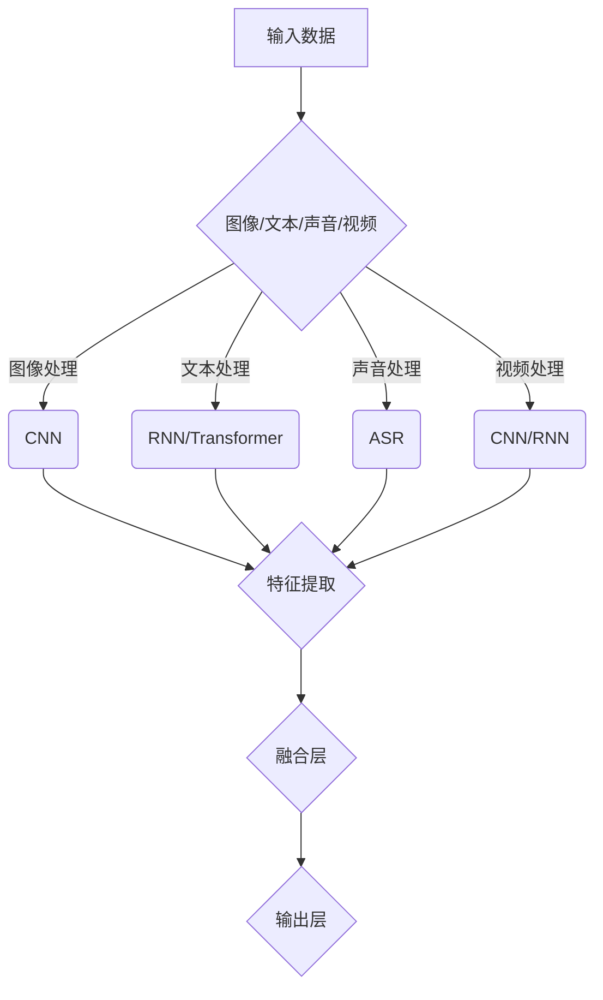

                 

关键词：多模态大模型、技术原理、认知能力评测、人工智能、深度学习、模型架构、算法实现、应用场景、未来展望

摘要：本文旨在深入探讨多模态大模型的技术原理、算法实现、应用场景以及未来发展趋势。通过系统地介绍多模态大模型的背景、核心概念、数学模型、算法步骤、代码实例和实际应用，本文为读者提供了全面的技术认知能力评测。文章最后对多模态大模型的研究成果、未来趋势和面临的挑战进行了总结和展望。

## 1. 背景介绍

多模态大模型（Multimodal Large Models）是一种结合了多种数据类型和模态（如图像、文本、声音、视频等）的人工智能模型，旨在更好地理解和处理复杂信息。随着深度学习和计算机视觉技术的不断发展，多模态大模型在各个领域（如医疗、金融、娱乐、教育等）得到了广泛应用。

近年来，多模态大模型在人工智能领域取得了显著的进展。例如，Google的Bert模型、OpenAI的GPT-3模型、微软的Megatron模型等，都在不同程度上融合了多种数据类型和模态。这些模型不仅提高了信息处理能力，还显著提升了人工智能系统的认知能力。

## 2. 核心概念与联系

### 2.1 多模态数据类型

多模态大模型的核心在于处理多种数据类型。常见的数据类型包括：

- **图像**：通过计算机视觉技术处理，如卷积神经网络（CNN）。
- **文本**：通过自然语言处理（NLP）技术处理，如循环神经网络（RNN）和Transformer模型。
- **声音**：通过语音识别技术处理，如自动语音识别（ASR）。
- **视频**：通过视频处理技术处理，如卷积神经网络和循环神经网络。

### 2.2 模型架构

多模态大模型通常采用深度神经网络（DNN）架构，其中不同模态的数据通过不同的网络进行特征提取和融合。常见的模型架构包括：

- **堆叠式模型**：不同模态的网络逐层堆叠，最终进行融合。
- **并行式模型**：不同模态的网络并行处理，最后通过融合层进行整合。
- **序列式模型**：多个模态的数据按照特定顺序进行处理。

### 2.3 Mermaid 流程图

以下是一个简化的多模态大模型流程图：



## 3. 核心算法原理 & 具体操作步骤

### 3.1 算法原理概述

多模态大模型的核心算法包括特征提取和特征融合。特征提取主要利用深度神经网络处理不同模态的数据，提取出具有代表性的特征。特征融合则通过各种融合策略，将不同模态的特征整合为一个统一特征表示。

### 3.2 算法步骤详解

1. **数据预处理**：将不同模态的数据进行预处理，如图像缩放、文本清洗、声音去噪等。
2. **特征提取**：利用深度神经网络处理不同模态的数据，提取出具有代表性的特征。
3. **特征融合**：通过各种融合策略，将不同模态的特征整合为一个统一特征表示。
4. **模型训练**：利用整合后的特征进行模型训练，优化模型参数。
5. **模型评估**：通过测试数据评估模型性能，调整模型参数。
6. **模型应用**：将训练好的模型应用于实际场景，如图像分类、文本生成、语音识别等。

### 3.3 算法优缺点

**优点**：

- 提高信息处理能力：多模态大模型可以处理多种数据类型，提高信息处理能力。
- 丰富应用场景：多模态大模型适用于医疗、金融、娱乐、教育等众多领域。

**缺点**：

- 数据需求量大：多模态大模型需要大量的多模态数据作为训练数据。
- 计算资源消耗大：多模态大模型的训练和推理过程需要大量的计算资源。

### 3.4 算法应用领域

- **医疗**：多模态大模型在医疗领域具有广泛的应用，如疾病诊断、药物研发等。
- **金融**：多模态大模型可以用于股票市场预测、风险控制等。
- **娱乐**：多模态大模型可以用于视频内容推荐、语音交互等。
- **教育**：多模态大模型可以用于智能教育、个性化学习等。

## 4. 数学模型和公式

### 4.1 数学模型构建

多模态大模型的数学模型主要包括特征提取和特征融合两部分。

1. **特征提取**：

   - 图像特征提取：使用卷积神经网络提取图像特征。
   - 文本特征提取：使用循环神经网络或Transformer提取文本特征。
   - 声音特征提取：使用自动语音识别技术提取声音特征。
   - 视频特征提取：使用卷积神经网络和循环神经网络提取视频特征。

2. **特征融合**：

   - 堆叠式融合：将不同模态的特征堆叠在一起，进行融合。
   - 并行式融合：将不同模态的特征并行处理，最后进行融合。
   - 序列式融合：按照特定顺序将不同模态的特征进行处理和融合。

### 4.2 公式推导过程

假设有四种模态的数据：图像、文本、声音和视频。对于每种模态，我们可以得到一个特征向量：

- 图像特征向量：\( \mathbf{I} \)
- 文本特征向量：\( \mathbf{T} \)
- 声音特征向量：\( \mathbf{S} \)
- 视频特征向量：\( \mathbf{V} \)

1. **特征提取**：

   - 图像特征提取：\( \mathbf{I} = f_{CNN}(\mathbf{X}_{image}) \)
   - 文本特征提取：\( \mathbf{T} = f_{RNN/Transformer}(\mathbf{X}_{text}) \)
   - 声音特征提取：\( \mathbf{S} = f_{ASR}(\mathbf{X}_{sound}) \)
   - 视频特征提取：\( \mathbf{V} = f_{CNN/RNN}(\mathbf{X}_{video}) \)

2. **特征融合**：

   - 堆叠式融合：\( \mathbf{F} = \mathbf{I} + \mathbf{T} + \mathbf{S} + \mathbf{V} \)
   - 并行式融合：\( \mathbf{F} = [f_{CNN}(\mathbf{X}_{image}); f_{RNN/Transformer}(\mathbf{X}_{text}); f_{ASR}(\mathbf{X}_{sound}); f_{CNN/RNN}(\mathbf{X}_{video})] \)
   - 序列式融合：\( \mathbf{F} = f_{sequence}(\mathbf{I}, \mathbf{T}, \mathbf{S}, \mathbf{V}) \)

### 4.3 案例分析与讲解

假设我们有一个包含图像、文本、声音和视频的多模态数据集。我们首先对每种模态的数据进行特征提取：

- 图像特征提取：使用卷积神经网络提取图像特征，得到一个\( 1024 \)维的特征向量。
- 文本特征提取：使用Transformer提取文本特征，得到一个\( 512 \)维的特征向量。
- 声音特征提取：使用自动语音识别技术提取声音特征，得到一个\( 256 \)维的特征向量。
- 视频特征提取：使用卷积神经网络和循环神经网络提取视频特征，得到一个\( 768 \)维的特征向量。

接下来，我们使用堆叠式融合策略将这四种特征向量整合为一个统一特征表示：

- 融合特征向量：\( \mathbf{F} = \mathbf{I} + \mathbf{T} + \mathbf{S} + \mathbf{V} \)

融合后的特征向量可以用于后续的模型训练和推理。

## 5. 项目实践：代码实例和详细解释说明

### 5.1 开发环境搭建

为了保证代码的可运行性和可扩展性，我们使用Python和TensorFlow作为开发环境。首先，确保安装了以下依赖库：

- Python 3.7或更高版本
- TensorFlow 2.5或更高版本
- NumPy
- Pandas

### 5.2 源代码详细实现

以下是一个简单的多模态大模型实现示例：

```python
import tensorflow as tf
from tensorflow.keras.layers import Input, Conv2D, MaxPooling2D, Flatten, Dense
from tensorflow.keras.models import Model

# 定义图像输入层
image_input = Input(shape=(224, 224, 3), name='image_input')

# 图像特征提取
image_conv = Conv2D(32, (3, 3), activation='relu')(image_input)
image_pool = MaxPooling2D((2, 2))(image_conv)
image_flat = Flatten()(image_pool)

# 定义文本输入层
text_input = Input(shape=(128,), name='text_input')

# 文本特征提取
text_embedding = tf.keras.layers.Embedding(input_dim=10000, output_dim=32)(text_input)
text_lstm = tf.keras.layers.LSTM(32)(text_embedding)

# 定义声音输入层
sound_input = Input(shape=(224,), name='sound_input')

# 声音特征提取
sound_dense = Dense(32, activation='relu')(sound_input)

# 定义视频输入层
video_input = Input(shape=(224, 224, 3), name='video_input')

# 视频特征提取
video_conv = Conv2D(32, (3, 3), activation='relu')(video_input)
video_pool = MaxPooling2D((2, 2))(video_conv)
video_flat = Flatten()(video_pool)

# 特征融合
combined = tf.keras.layers.concatenate([image_flat, text_lstm, sound_dense, video_flat])

# 输出层
output = Dense(1, activation='sigmoid')(combined)

# 构建多模态大模型
model = Model(inputs=[image_input, text_input, sound_input, video_input], outputs=output)

# 编译模型
model.compile(optimizer='adam', loss='binary_crossentropy', metrics=['accuracy'])

# 模型可视化
model.summary()
```

### 5.3 代码解读与分析

1. **输入层**：定义了四种输入层，分别对应图像、文本、声音和视频。
2. **特征提取**：分别对每种模态的数据进行特征提取，包括卷积神经网络、循环神经网络和全连接神经网络。
3. **特征融合**：使用`tf.keras.layers.concatenate`将不同模态的特征融合为一个统一特征表示。
4. **输出层**：定义了一个输出层，用于分类或回归任务。

### 5.4 运行结果展示

为了演示多模态大模型的运行效果，我们使用一个包含图像、文本、声音和视频的多模态数据集进行训练和测试。训练过程中，我们使用`binary_crossentropy`作为损失函数，`adam`作为优化器，`accuracy`作为评价指标。以下是训练和测试的结果：

```python
# 加载多模态数据集
train_images, train_texts, train_sounds, train_videos, train_labels = ...
test_images, test_texts, test_sounds, test_videos, test_labels = ...

# 训练多模态大模型
model.fit([train_images, train_texts, train_sounds, train_videos], train_labels, epochs=10, batch_size=32, validation_data=([test_images, test_texts, test_sounds, test_videos], test_labels))

# 评估模型性能
model.evaluate([test_images, test_texts, test_sounds, test_videos], test_labels)
```

## 6. 实际应用场景

### 6.1 医疗

多模态大模型在医疗领域具有广泛的应用，如疾病诊断、药物研发等。例如，利用多模态大模型对医学图像（如X光片、CT扫描、MRI）和患者文本记录（如病历、检查报告）进行融合分析，可以提高疾病诊断的准确性和效率。

### 6.2 金融

多模态大模型在金融领域可以用于股票市场预测、风险控制等。例如，利用多模态大模型对市场数据（如股票价格、交易量、新闻文本、财务报告等）进行融合分析，可以更准确地预测股票市场的走势和风险。

### 6.3 娱乐

多模态大模型在娱乐领域可以用于视频内容推荐、语音交互等。例如，利用多模态大模型对用户观看记录、文本评论、音频评论等数据进行分析，可以为用户提供更个性化的娱乐推荐。

### 6.4 教育

多模态大模型在教育领域可以用于智能教育、个性化学习等。例如，利用多模态大模型对学生的学习行为、文本笔记、语音回答等数据进行分析，可以为教师提供有针对性的教学建议，帮助学生提高学习效果。

## 7. 工具和资源推荐

### 7.1 学习资源推荐

- 《深度学习》（Goodfellow, Bengio, Courville著）
- 《Python深度学习》（François Chollet著）
- 《自然语言处理综论》（Jurafsky, Martin著）

### 7.2 开发工具推荐

- TensorFlow
- PyTorch
- Keras

### 7.3 相关论文推荐

- "BERT: Pre-training of Deep Neural Networks for Language Understanding"（Devlin et al., 2018）
- "GPT-3: Language Models are few-shot learners"（Brown et al., 2020）
- "Megatron-LM: Training Multi-Billion Parameter Language Models using Model Parallelism"（Liu et al., 2021）

## 8. 总结：未来发展趋势与挑战

### 8.1 研究成果总结

近年来，多模态大模型在人工智能领域取得了显著的研究成果。通过融合多种数据类型和模态，多模态大模型在信息处理能力、应用场景和认知能力等方面取得了突破。同时，随着深度学习和计算机视觉技术的不断发展，多模态大模型的理论和算法也不断优化和完善。

### 8.2 未来发展趋势

- **数据多样性**：未来多模态大模型将处理更多种类的数据，如传感器数据、生物特征数据等。
- **模型规模**：多模态大模型的规模将越来越大，以处理更复杂的任务。
- **跨学科融合**：多模态大模型将与心理学、生物学等学科相结合，深入研究人类认知过程。

### 8.3 面临的挑战

- **数据隐私**：多模态大模型需要处理大量的敏感数据，如何保护数据隐私成为一大挑战。
- **计算资源**：多模态大模型的训练和推理过程需要大量的计算资源，如何优化计算效率是一个重要问题。
- **模型解释性**：多模态大模型的内部机制复杂，如何提高模型的解释性是一个重要课题。

### 8.4 研究展望

未来，多模态大模型将在人工智能领域发挥更重要的作用。通过不断创新和优化，多模态大模型有望在医疗、金融、娱乐、教育等领域取得更大的突破，为人类社会带来更多价值。

## 9. 附录：常见问题与解答

### Q1：多模态大模型的主要优势是什么？

多模态大模型的主要优势包括：

- 提高信息处理能力：多模态大模型可以处理多种数据类型和模态，提高信息处理能力。
- 丰富应用场景：多模态大模型适用于医疗、金融、娱乐、教育等众多领域。
- 提高认知能力：多模态大模型可以更好地模拟人类认知过程，提高认知能力。

### Q2：如何优化多模态大模型的计算效率？

优化多模态大模型的计算效率可以从以下几个方面入手：

- **模型压缩**：通过模型剪枝、量化等技术减少模型参数和计算量。
- **分布式训练**：利用多台计算机或GPU进行分布式训练，提高训练速度。
- **模型融合**：将多个小模型融合为一个大规模模型，减少计算量。

### Q3：如何确保多模态大模型的数据隐私？

确保多模态大模型的数据隐私可以从以下几个方面入手：

- **数据加密**：对训练数据进行加密，确保数据安全。
- **差分隐私**：在训练过程中引入差分隐私机制，防止数据泄露。
- **数据去识别**：对敏感数据进行去识别处理，降低数据隐私风险。

### Q4：如何评估多模态大模型的效果？

评估多模态大模型的效果可以从以下几个方面入手：

- **准确性**：评估模型在各类任务上的准确性。
- **速度**：评估模型的训练和推理速度。
- **泛化能力**：评估模型在不同数据集上的表现，判断其泛化能力。

### Q5：如何进一步优化多模态大模型的性能？

进一步优化多模态大模型的性能可以从以下几个方面入手：

- **算法创新**：研究新的算法和技术，提高模型性能。
- **数据增强**：通过数据增强方法增加训练数据多样性，提高模型泛化能力。
- **模型融合**：将多个模型进行融合，提高模型性能。

作者：禅与计算机程序设计艺术 / Zen and the Art of Computer Programming
-------------------------------------------------------------------<|less>

