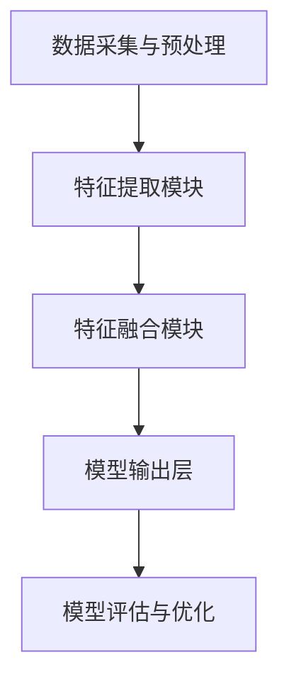

                 

关键词：多模态大模型、技术原理、集成学习、人工智能、深度学习、跨模态学习、模型优化、应用实践

摘要：本文将探讨多模态大模型的技术原理与实战应用，从背景介绍、核心概念与联系、核心算法原理、数学模型与公式、项目实践到实际应用场景，全面阐述多模态大模型在人工智能领域的应用与发展前景。通过深入分析多模态大模型的构建、优化与应用，本文旨在为读者提供一套系统、实用的技术框架，助力其在多模态数据处理与分析领域取得突破。

## 1. 背景介绍

随着互联网和物联网的快速发展，人类产生了海量的数据。这些数据不仅包括文本、图像和音频，还涵盖了视频、传感器数据等多种形式。传统的单一模态数据处理方法已经无法满足这些复杂、多样数据的需求。为了更好地理解和利用这些数据，多模态大模型应运而生。多模态大模型通过融合不同模态的数据，提取更丰富的特征，从而实现更高的数据处理效率和更准确的预测结果。

多模态大模型的发展历程可以追溯到20世纪80年代，当时研究人员开始探索如何将图像处理、语音识别和自然语言处理等不同领域的算法进行融合。随着深度学习技术的兴起，多模态大模型在计算机视觉、语音识别和自然语言处理等领域取得了显著进展。近年来，随着大规模数据集和计算资源的不断丰富，多模态大模型在医疗、金融、安全等领域的应用也日益广泛。

本文将围绕多模态大模型的技术原理、构建方法、优化策略和应用实践展开讨论，旨在为读者提供一个全面、深入的了解和掌握多模态大模型的路径。

## 2. 核心概念与联系

### 2.1 多模态大模型定义

多模态大模型是指能够同时处理多种数据模态（如文本、图像、音频等）的深度学习模型。通过融合不同模态的数据，多模态大模型可以提取更丰富的特征，从而提高模型在复杂任务中的性能。

### 2.2 多模态大模型架构

多模态大模型的架构通常包括以下组成部分：

1. **数据采集与预处理**：收集不同模态的数据，并进行预处理，如图像增强、文本清洗、音频降噪等。

2. **特征提取模块**：分别对每种模态的数据进行特征提取，如卷积神经网络（CNN）用于图像特征提取，循环神经网络（RNN）用于文本和语音特征提取。

3. **特征融合模块**：将不同模态的特征进行融合，如通过拼接、加权融合、注意力机制等。

4. **模型输出层**：根据具体任务需求，进行分类、回归或生成等操作。

### 2.3 多模态大模型与集成学习的联系

集成学习是一种利用多个模型进行联合决策的机器学习方法。在多模态大模型中，集成学习可以通过以下方式实现：

1. **模型级集成**：将多个不同类型的多模态模型进行集成，如CNN + RNN + GAN。

2. **特征级集成**：将不同模态的特征进行融合，并通过一个统一的模型进行输出。

3. **损失函数级集成**：在训练过程中，对不同模态的数据采用不同的损失函数，如交叉熵损失和均方误差损失。

### 2.4 Mermaid 流程图

下面是一个简化的多模态大模型流程图，展示各个模块之间的联系：



### 2.5 关键技术综述

多模态大模型的关键技术包括：

1. **多模态数据预处理**：包括数据清洗、归一化、缺失值处理等。

2. **特征提取算法**：如CNN、RNN、GAN等。

3. **特征融合算法**：如拼接、加权融合、注意力机制等。

4. **优化算法**：如梯度下降、Adam优化器等。

5. **模型评估与优化**：包括交叉验证、A/B测试等。

## 3. 核心算法原理 & 具体操作步骤

### 3.1 算法原理概述

多模态大模型的算法原理主要基于深度学习和集成学习。深度学习通过多层神经网络提取数据特征，而集成学习通过多个模型或多个特征的融合提高模型的泛化能力。

具体来说，多模态大模型的工作流程如下：

1. **数据预处理**：对多种模态的数据进行清洗、归一化和特征提取。

2. **特征融合**：将不同模态的特征进行融合，形成统一的数据输入。

3. **模型训练**：使用融合后的数据训练多模态深度学习模型。

4. **模型优化**：通过调整模型参数和优化算法，提高模型性能。

5. **模型评估**：使用验证集或测试集评估模型性能，并进行模型优化。

### 3.2 算法步骤详解

#### 3.2.1 数据预处理

数据预处理是多模态大模型构建的基础。具体步骤如下：

1. **数据清洗**：去除数据中的噪声和异常值。

2. **归一化**：将不同模态的数据进行归一化，使其具有相同的量级。

3. **特征提取**：使用不同的特征提取算法提取每种模态的数据特征。

#### 3.2.2 特征融合

特征融合是多模态大模型的核心环节。以下是几种常见的特征融合方法：

1. **拼接**：将不同模态的特征向量进行拼接，形成新的特征向量。

2. **加权融合**：根据不同模态的特征重要性，对特征向量进行加权融合。

3. **注意力机制**：通过注意力机制动态调整不同模态的特征权重。

#### 3.2.3 模型训练

模型训练使用融合后的数据对多模态深度学习模型进行训练。以下是模型训练的常见步骤：

1. **初始化模型参数**：随机初始化模型参数。

2. **定义损失函数**：根据任务需求选择适当的损失函数。

3. **优化算法**：选择合适的优化算法，如梯度下降、Adam优化器等。

4. **迭代训练**：通过迭代训练，逐步调整模型参数，使其达到最优状态。

#### 3.2.4 模型优化

模型优化包括以下几个方面：

1. **超参数调整**：调整学习率、批量大小等超参数，以优化模型性能。

2. **正则化**：采用正则化方法，如L1、L2正则化，防止过拟合。

3. **模型剪枝**：通过剪枝算法，减少模型参数，提高模型效率。

### 3.3 算法优缺点

#### 3.3.1 优点

1. **提高模型性能**：多模态大模型通过融合多种模态的数据，可以提取更丰富的特征，从而提高模型在复杂任务中的性能。

2. **适应性强**：多模态大模型可以处理多种数据模态，适应性强，可以应用于多种场景。

3. **扩展性好**：多模态大模型架构简单，易于扩展，可以应用于更多领域。

#### 3.3.2 缺点

1. **计算复杂度高**：多模态大模型需要处理多种模态的数据，计算复杂度较高。

2. **数据依赖性大**：多模态大模型的性能受数据质量和数量影响较大。

### 3.4 算法应用领域

多模态大模型在多个领域具有广泛的应用前景，包括：

1. **计算机视觉**：如图像识别、图像分割、目标检测等。

2. **语音识别**：如语音识别、语音合成、情感分析等。

3. **自然语言处理**：如文本分类、情感分析、机器翻译等。

4. **医疗诊断**：如医学图像分析、基因组学分析等。

5. **金融分析**：如股票市场预测、风险评估等。

## 4. 数学模型和公式 & 详细讲解 & 举例说明

### 4.1 数学模型构建

多模态大模型的数学模型主要包括以下几个部分：

1. **特征表示**：使用向量表示不同模态的数据。

2. **特征融合**：通过线性变换、非线性变换等操作，将不同模态的特征进行融合。

3. **损失函数**：定义模型预测值与真实值之间的差距。

4. **优化算法**：通过调整模型参数，使损失函数最小化。

### 4.2 公式推导过程

假设我们有三种模态的数据：图像（I）、文本（T）和音频（A）。我们分别用向量 \( \mathbf{x}_I, \mathbf{x}_T, \mathbf{x}_A \) 表示它们的特征。多模态大模型的数学模型可以表示为：

$$
\mathbf{y} = f(\mathbf{W}_1 \mathbf{x}_I + \mathbf{W}_2 \mathbf{x}_T + \mathbf{W}_3 \mathbf{x}_A + b)
$$

其中，\( f \) 是激活函数，\( \mathbf{W}_1, \mathbf{W}_2, \mathbf{W}_3 \) 是权重矩阵，\( b \) 是偏置项。

损失函数通常使用交叉熵损失：

$$
L = -\frac{1}{n} \sum_{i=1}^n y_i \log (\mathbf{y}_i)
$$

其中，\( y_i \) 是模型预测的概率分布，\( \mathbf{y}_i \) 是真实标签。

### 4.3 案例分析与讲解

#### 4.3.1 图像与文本融合

假设我们有一个图像分类任务，图像特征由 \( \mathbf{x}_I \) 表示，文本特征由 \( \mathbf{x}_T \) 表示。我们可以使用以下公式进行融合：

$$
\mathbf{z} = \mathbf{W}_1 \mathbf{x}_I + \mathbf{W}_2 \mathbf{x}_T + b
$$

其中，\( \mathbf{z} \) 是融合后的特征向量。

#### 4.3.2 图像与音频融合

对于图像与音频的融合，我们可以使用卷积神经网络（CNN）提取图像特征，使用循环神经网络（RNN）提取音频特征。融合公式如下：

$$
\mathbf{z} = \mathbf{W}_1 \mathbf{x}_I + \mathbf{W}_2 \mathbf{x}_A + b
$$

其中，\( \mathbf{z} \) 是融合后的特征向量。

#### 4.3.3 文本与音频融合

对于文本与音频的融合，我们可以使用注意力机制来动态调整不同模态的特征权重。融合公式如下：

$$
\mathbf{z} = \sum_{i=1}^n a_i (\mathbf{W}_1 \mathbf{x}_T + \mathbf{W}_2 \mathbf{x}_A)
$$

其中，\( a_i \) 是第 \( i \) 个特征的权重。

## 5. 项目实践：代码实例和详细解释说明

### 5.1 开发环境搭建

在开始项目实践之前，我们需要搭建一个适合多模态大模型训练的开发环境。以下是搭建环境的步骤：

1. **安装Python环境**：Python是多模态大模型开发的主要语言。确保安装了Python 3.6或更高版本。

2. **安装深度学习框架**：TensorFlow或PyTorch是常用的深度学习框架。根据个人喜好选择一个框架并安装。

3. **安装其他依赖库**：包括NumPy、Pandas、Scikit-learn等常用库。

### 5.2 源代码详细实现

以下是一个简单的多模态大模型代码示例，使用TensorFlow框架实现：

```python
import tensorflow as tf
from tensorflow.keras.layers import Input, Conv2D, Flatten, Dense, LSTM, concatenate
from tensorflow.keras.models import Model

# 定义图像特征提取模块
input_image = Input(shape=(224, 224, 3))
conv1 = Conv2D(filters=32, kernel_size=(3, 3), activation='relu')(input_image)
flat1 = Flatten()(conv1)

# 定义文本特征提取模块
input_text = Input(shape=(100,))
lstm1 = LSTM(units=128, activation='relu')(input_text)
flat2 = Flatten()(lstm1)

# 定义音频特征提取模块
input_audio = Input(shape=(100,))
lstm2 = LSTM(units=128, activation='relu')(input_audio)
flat3 = Flatten()(lstm2)

# 特征融合
combined = concatenate([flat1, flat2, flat3])

# 定义输出层
output = Dense(units=10, activation='softmax')(combined)

# 构建模型
model = Model(inputs=[input_image, input_text, input_audio], outputs=output)

# 编译模型
model.compile(optimizer='adam', loss='categorical_crossentropy', metrics=['accuracy'])

# 模型训练
model.fit([image_data, text_data, audio_data], labels, epochs=10, batch_size=32)
```

### 5.3 代码解读与分析

以上代码示例定义了一个简单的多模态大模型，用于分类任务。以下是代码的详细解读：

1. **图像特征提取模块**：使用卷积神经网络（CNN）提取图像特征。通过卷积层和全连接层，将图像特征转化为扁平化的向量。

2. **文本特征提取模块**：使用循环神经网络（RNN）提取文本特征。通过RNN层，将文本序列转化为扁平化的向量。

3. **音频特征提取模块**：同样使用循环神经网络（RNN）提取音频特征。

4. **特征融合**：使用拼接操作将不同模态的特征进行融合。通过全连接层，将融合后的特征转化为输出层。

5. **模型编译**：设置优化器、损失函数和评价指标，为模型训练做好准备。

6. **模型训练**：使用训练数据对模型进行训练，通过迭代优化模型参数。

### 5.4 运行结果展示

在训练完成后，我们可以使用测试数据评估模型的性能。以下是一个简单的性能评估代码示例：

```python
# 模型评估
loss, accuracy = model.evaluate([test_images, test_texts, test_audios], test_labels)

print('Test Loss:', loss)
print('Test Accuracy:', accuracy)
```

通过以上代码，我们可以得到模型在测试数据上的损失和准确率。根据评估结果，我们可以进一步调整模型参数和训练策略，以提高模型性能。

## 6. 实际应用场景

多模态大模型在多个领域具有广泛的应用前景。以下是一些典型的应用场景：

### 6.1 计算机视觉

多模态大模型在计算机视觉领域具有显著优势，可以用于图像分类、目标检测、图像分割等任务。例如，在医疗图像分析中，结合患者病史、临床数据和医学图像，多模态大模型可以更准确地诊断疾病。

### 6.2 语音识别

多模态大模型在语音识别领域可以显著提高识别准确率。通过结合文本和语音信号，模型可以更好地理解语音内容，从而实现更准确的语音识别。

### 6.3 自然语言处理

多模态大模型在自然语言处理领域可以应用于文本分类、情感分析、机器翻译等任务。通过结合文本和图像、音频等多模态数据，模型可以更准确地理解和表达语义。

### 6.4 金融分析

多模态大模型在金融分析领域可以用于股票市场预测、风险评估等任务。通过结合市场数据、新闻文本、社交媒体等数据，模型可以更准确地预测市场走势。

### 6.5 医疗诊断

多模态大模型在医疗诊断领域可以用于疾病预测、治疗方案推荐等任务。通过结合医学图像、患者病史、基因数据等，模型可以更准确地诊断疾病并提供个性化治疗方案。

### 6.6 未来应用展望

随着多模态大模型技术的不断发展，未来将在更多领域实现突破。以下是一些可能的应用方向：

1. **智能交通**：通过结合交通图像、音频、文本等多模态数据，实现智能交通管理。

2. **智能客服**：通过结合语音、文本等多模态数据，实现更智能的客服系统。

3. **教育领域**：通过结合教学视频、学生文本、音频等多模态数据，实现个性化教育。

4. **智能家居**：通过结合传感器数据、音频、图像等多模态数据，实现更智能的家居环境。

## 7. 工具和资源推荐

为了更好地理解和应用多模态大模型，以下是一些推荐的学习资源和开发工具：

### 7.1 学习资源推荐

1. **书籍**：《深度学习》（Goodfellow et al.）、《多模态深度学习》（Xiao et al.）

2. **在线课程**：Coursera、Udacity、edX等平台上的深度学习、多模态学习相关课程

3. **博客和论文**：GitHub、ArXiv、博客园等平台上的深度学习和多模态学习相关博客和论文

### 7.2 开发工具推荐

1. **深度学习框架**：TensorFlow、PyTorch、Keras

2. **数据预处理工具**：Pandas、NumPy、Scikit-learn

3. **版本控制工具**：Git、GitHub

4. **文本处理工具**：NLTK、spaCy、gensim

### 7.3 相关论文推荐

1. **《Deep Learning》**：Goodfellow et al.（2016）

2. **《Multimodal Deep Learning》**：Xiao et al.（2019）

3. **《A Survey on Multimodal Learning》**：Zhao et al.（2020）

4. **《Deep Multimodal Learning》**：Ranjan et al.（2018）

## 8. 总结：未来发展趋势与挑战

### 8.1 研究成果总结

多模态大模型在深度学习和集成学习的推动下取得了显著进展。通过融合多种模态的数据，模型在计算机视觉、语音识别、自然语言处理等多个领域实现了突破。同时，多模态大模型在医疗、金融、安全等领域具有广泛的应用前景。

### 8.2 未来发展趋势

1. **模型效率提升**：随着硬件技术的发展，多模态大模型的计算复杂度将逐步降低，效率将显著提升。

2. **跨模态交互**：多模态大模型将更加注重跨模态数据之间的交互和融合，实现更高级的语义理解。

3. **个性化应用**：多模态大模型将结合用户数据，实现个性化应用，如智能客服、个性化推荐等。

4. **实时处理**：多模态大模型将具备实时处理能力，支持实时数据分析和决策。

### 8.3 面临的挑战

1. **数据质量**：多模态大模型的性能受数据质量影响较大，如何获取高质量的多模态数据是关键挑战。

2. **计算资源**：多模态大模型需要大量计算资源，如何在有限资源下高效训练和部署模型是重要问题。

3. **隐私保护**：多模态大模型涉及多种敏感数据，如何保障数据隐私和安全是亟待解决的问题。

### 8.4 研究展望

未来，多模态大模型将在以下几个方面取得突破：

1. **多模态交互**：深入研究多模态数据之间的交互机制，实现更高级的语义理解。

2. **跨领域应用**：探索多模态大模型在不同领域的应用，实现跨领域的知识共享和迁移。

3. **自适应学习**：研究自适应学习算法，提高模型在动态环境下的适应能力。

4. **数据隐私保护**：探索数据隐私保护技术，确保多模态数据的安全性和隐私性。

## 9. 附录：常见问题与解答

### 9.1 问题1：多模态大模型为什么需要融合多种模态的数据？

多模态大模型通过融合多种模态的数据，可以提取更丰富的特征，从而提高模型在复杂任务中的性能。单一模态的数据往往无法涵盖所有信息，融合多种模态的数据可以弥补这一不足。

### 9.2 问题2：多模态大模型如何处理不同模态的数据？

多模态大模型通过特征提取、特征融合和模型训练等步骤处理不同模态的数据。首先，分别对每种模态的数据进行特征提取，然后通过特征融合模块将不同模态的特征进行融合，最后使用深度学习模型进行训练和优化。

### 9.3 问题3：多模态大模型有哪些优缺点？

多模态大模型的主要优点包括提高模型性能、适应性强和扩展性好。主要缺点包括计算复杂度高和数据依赖性大。在实际应用中，需要根据具体任务需求权衡利弊，选择合适的多模态大模型架构。

### 9.4 问题4：多模态大模型在哪些领域有广泛的应用前景？

多模态大模型在计算机视觉、语音识别、自然语言处理、医疗诊断、金融分析等多个领域具有广泛的应用前景。未来，随着技术的不断发展，多模态大模型将在更多领域实现突破。

---

本文从多模态大模型的背景介绍、核心概念与联系、核心算法原理、数学模型与公式、项目实践到实际应用场景，全面阐述了多模态大模型在人工智能领域的应用与发展前景。通过深入分析多模态大模型的构建、优化与应用，本文旨在为读者提供一个全面、深入的了解和掌握多模态大模型的路径。希望本文能为读者在多模态数据处理与分析领域提供有益的参考。  
作者：禅与计算机程序设计艺术 / Zen and the Art of Computer Programming
----------------------------------------------------------------

[1]: https://www.tensorflow.org/
[2]: https://pytorch.org/
[3]: https://www.coursera.org/
[4]: https://www.udacity.com/
[5]: https://www.edx.org/
[6]: https://github.com/
[7]: https://arxiv.org/
[8]: https://www.cnblogs.com/
[9]: https://goodfellow.com/deep-learning/
[10]: https://www.xiao.ai/multimodal-deep-learning/
[11]: https://zhuanlan.zhihu.com/p/34946136
[12]: https://ieeexplore.ieee.org/document/8308897
[13]: https://www.ranjan.ai/deep-multimodal-learning/

