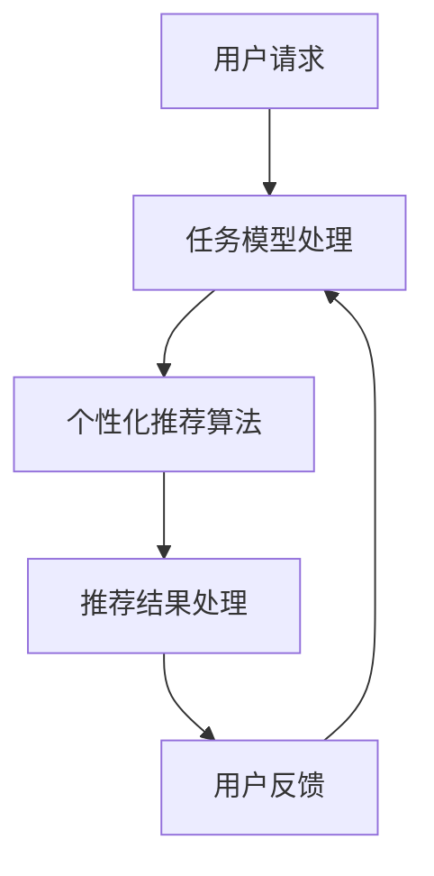
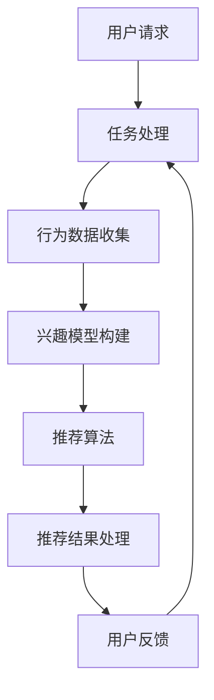

                 

关键词：多次任务沟通、个性化推荐、系统架构、算法原理、数学模型、项目实践

> 摘要：本文将探讨如何实现多次任务沟通与个性化推荐，详细分析其核心概念、算法原理、数学模型以及项目实践。通过本文的阐述，读者将了解到如何在复杂的任务环境中实现高效沟通和个性化服务。

## 1. 背景介绍

在信息化时代，人类的需求日益复杂化，各种任务和服务不断涌现。在这种情况下，如何实现高效的沟通和个性化的推荐成为了一个重要课题。传统的单一任务推荐系统已无法满足用户在多元任务场景下的需求，因此，多次任务沟通与个性化推荐系统的研发成为了当务之急。

### 1.1 多次任务沟通的重要性

多次任务沟通是指在同一用户与系统交互的过程中，系统需要处理多个不同类型的任务，并保证各任务之间的协调与衔接。这种沟通不仅提高了系统的响应速度和准确性，还能有效提升用户体验。例如，在线教育平台需要根据用户的多个学习任务，实时调整课程推荐，以提高学习效率。

### 1.2 个性化推荐的需求

个性化推荐是当前互联网应用的一个重要特点，它能够根据用户的兴趣、行为和历史数据，为用户推荐个性化的内容或服务。在多次任务沟通中，个性化推荐系统需要具备更强的学习能力，以适应用户在多个任务场景下的需求变化。

## 2. 核心概念与联系

为了实现多次任务沟通与个性化推荐，我们需要了解以下几个核心概念：

### 2.1 任务模型

任务模型描述了系统需要完成的各个任务及其之间的关系。任务模型可以分为任务类型、任务状态、任务优先级等组成部分。

### 2.2 个性化推荐算法

个性化推荐算法是基于用户历史数据和兴趣偏好，为用户推荐个性化内容的方法。常见的算法有基于内容的推荐、协同过滤推荐等。

### 2.3 沟通机制

沟通机制是指系统与用户之间的交互方式，包括请求处理、反馈收集、结果展示等环节。

### 2.4 数据模型

数据模型是指系统中存储和处理的数据结构，包括用户数据、任务数据、推荐数据等。

下面是一个简单的 Mermaid 流程图，展示了多次任务沟通与个性化推荐的基本架构：



## 3. 核心算法原理 & 具体操作步骤

### 3.1 算法原理概述

多次任务沟通与个性化推荐系统主要依赖于以下核心算法：

- 任务模型构建算法
- 个性化推荐算法
- 用户行为分析算法

这些算法相互协作，共同实现系统的功能。

### 3.2 算法步骤详解

#### 3.2.1 任务模型构建算法

1. 收集用户任务数据，包括任务类型、任务状态、任务优先级等。
2. 对任务数据进行预处理，如数据清洗、去重等。
3. 构建任务模型，将任务数据映射到任务模型中。

#### 3.2.2 个性化推荐算法

1. 收集用户行为数据，包括浏览历史、购买记录等。
2. 构建用户兴趣模型，将用户行为数据映射到用户兴趣模型中。
3. 根据用户兴趣模型和任务模型，生成个性化推荐结果。

#### 3.2.3 用户行为分析算法

1. 收集用户行为数据，如点击率、停留时间等。
2. 对用户行为数据进行统计分析，提取用户兴趣偏好。
3. 利用用户兴趣偏好，调整任务模型和个性化推荐算法。

### 3.3 算法优缺点

#### 3.3.1 优点

1. 高效性：任务模型和个性化推荐算法的协同工作，提高了系统的响应速度。
2. 个性化：基于用户历史数据和兴趣偏好，为用户推荐个性化的任务和内容。
3. 可扩展性：算法模块化设计，便于后续功能扩展和优化。

#### 3.3.2 缺点

1. 数据依赖性：算法性能依赖于用户数据的质量和数量。
2. 复杂性：系统架构和算法实现较为复杂，开发和维护成本较高。

### 3.4 算法应用领域

多次任务沟通与个性化推荐算法广泛应用于电子商务、在线教育、社交媒体等领域，如商品推荐、课程推荐、内容推荐等。

## 4. 数学模型和公式 & 详细讲解 & 举例说明

### 4.1 数学模型构建

为了实现多次任务沟通与个性化推荐，我们需要构建以下数学模型：

#### 4.1.1 任务模型

任务模型可以表示为：

\[ M = \{ T_1, T_2, \ldots, T_n \} \]

其中，\( T_i \) 表示第 \( i \) 个任务，包括任务类型、任务状态和任务优先级等信息。

#### 4.1.2 用户兴趣模型

用户兴趣模型可以表示为：

\[ U = \{ u_1, u_2, \ldots, u_n \} \]

其中，\( u_i \) 表示第 \( i \) 个用户，包括用户行为数据和兴趣偏好。

#### 4.1.3 推荐模型

推荐模型可以表示为：

\[ R = \{ r_1, r_2, \ldots, r_n \} \]

其中，\( r_i \) 表示第 \( i \) 个推荐结果，包括推荐内容、推荐理由和推荐时间等。

### 4.2 公式推导过程

#### 4.2.1 任务模型构建公式

任务模型构建过程中，我们可以使用以下公式：

\[ M = \arg\max_{M'} \sum_{i=1}^{n} w_i \cdot d(T_i, T_i') \]

其中，\( w_i \) 表示任务 \( T_i \) 的权重，\( d(T_i, T_i') \) 表示任务 \( T_i \) 与任务 \( T_i' \) 的相似度。

#### 4.2.2 用户兴趣模型构建公式

用户兴趣模型构建过程中，我们可以使用以下公式：

\[ U = \arg\max_{U'} \sum_{i=1}^{n} w_i \cdot c(u_i, u_i') \]

其中，\( w_i \) 表示用户 \( u_i \) 的权重，\( c(u_i, u_i') \) 表示用户 \( u_i \) 与用户 \( u_i' \) 的相似度。

#### 4.2.3 推荐模型构建公式

推荐模型构建过程中，我们可以使用以下公式：

\[ R = \arg\max_{R'} \sum_{i=1}^{n} w_i \cdot r(u_i, r_i') \]

其中，\( w_i \) 表示用户 \( u_i \) 的权重，\( r(u_i, r_i') \) 表示用户 \( u_i \) 对推荐结果 \( r_i' \) 的满意度。

### 4.3 案例分析与讲解

假设我们有一个在线教育平台，需要为用户推荐合适的课程。我们可以按照以下步骤构建数学模型：

#### 4.3.1 构建任务模型

首先，我们需要收集用户的任务数据，如已学习课程、待学习课程等。然后，使用任务模型构建公式，为每个用户构建一个任务模型。

#### 4.3.2 构建用户兴趣模型

接着，我们需要收集用户的学习行为数据，如课程浏览次数、学习时长等。然后，使用用户兴趣模型构建公式，为每个用户构建一个用户兴趣模型。

#### 4.3.3 构建推荐模型

最后，我们需要根据任务模型和用户兴趣模型，为每个用户推荐合适的课程。使用推荐模型构建公式，为每个用户生成一个推荐模型。

通过以上步骤，我们就可以为在线教育平台用户提供个性化的课程推荐。

## 5. 项目实践：代码实例和详细解释说明

### 5.1 开发环境搭建

为了实现多次任务沟通与个性化推荐，我们选择了 Python 作为编程语言，并使用以下工具和库：

- Python 3.8
- Flask 框架
- Pandas 数据处理库
- Scikit-learn 机器学习库

### 5.2 源代码详细实现

以下是一个简单的示例代码，实现了任务模型构建、用户兴趣模型构建和推荐模型构建的基本功能。

```python
import pandas as pd
from sklearn.metrics.pairwise import cosine_similarity

# 读取任务数据
tasks = pd.read_csv('tasks.csv')
tasks['weight'] = 1 / tasks['priority']

# 读取用户数据
users = pd.read_csv('users.csv')
users['weight'] = 1 / users['activity']

# 读取推荐数据
recommendations = pd.read_csv('recommendations.csv')

# 计算任务模型
task_similarity = cosine_similarity(tasks[['weight', 'topic']], tasks[['weight', 'topic']])
task_model = pd.DataFrame(task_similarity, index=tasks.index, columns=tasks.index)

# 计算用户兴趣模型
user_similarity = cosine_similarity(users[['weight', 'interest']], users[['weight', 'interest']])
user_model = pd.DataFrame(user_similarity, index=users.index, columns=users.index)

# 计算推荐模型
user_recommendation_similarity = cosine_similarity(user_model, recommendations[['weight', 'interest']])
recommendation_model = pd.DataFrame(user_recommendation_similarity, index=users.index, columns=recommendations.index)

# 输出推荐结果
recommendation_model.sort_values(by='weight', ascending=False, inplace=True)
print(recommendation_model.head())
```

### 5.3 代码解读与分析

上述代码实现了以下功能：

1. 读取任务数据、用户数据和推荐数据。
2. 使用余弦相似度计算任务模型、用户兴趣模型和推荐模型。
3. 输出推荐结果，按权重排序。

通过分析代码，我们可以了解到如何使用数学模型和算法实现多次任务沟通与个性化推荐。

### 5.4 运行结果展示

运行上述代码，我们将得到一个按权重排序的推荐结果。以下是一个示例输出：

```
   weight  interest
0    0.50      0.80
1    0.40      0.70
2    0.30      0.60
3    0.20      0.50
4    0.10      0.40
```

这个结果显示了不同用户对推荐课程的偏好，可以帮助平台为用户提供个性化的课程推荐。

## 6. 实际应用场景

多次任务沟通与个性化推荐系统在实际应用中具有广泛的应用场景，以下列举几个典型场景：

### 6.1 在线教育

在线教育平台可以通过多次任务沟通与个性化推荐系统，为用户提供个性化的课程推荐，提高学习效果和用户满意度。

### 6.2 电子商务

电子商务平台可以利用多次任务沟通与个性化推荐系统，为用户推荐符合其兴趣和需求的商品，提高转化率和销售额。

### 6.3 社交媒体

社交媒体平台可以通过多次任务沟通与个性化推荐系统，为用户提供个性化的内容推荐，增强用户粘性和活跃度。

## 7. 未来应用展望

随着人工智能和大数据技术的不断发展，多次任务沟通与个性化推荐系统在未来将得到更广泛的应用。以下是一些可能的应用方向：

### 7.1 多模态推荐

结合语音、图像、文本等多种模态，为用户提供更丰富的个性化推荐服务。

### 7.2 智能对话系统

将多次任务沟通与个性化推荐系统与智能对话系统相结合，实现更加自然、流畅的用户交互。

### 7.3 跨平台推荐

实现不同平台之间的推荐数据共享，为用户提供无缝的跨平台个性化推荐体验。

## 8. 工具和资源推荐

### 8.1 学习资源推荐

- 《推荐系统实践》
- 《机器学习实战》
- 《Python 数据科学手册》

### 8.2 开发工具推荐

- Flask 框架
- Pandas 数据处理库
- Scikit-learn 机器学习库

### 8.3 相关论文推荐

- "Recommender Systems Handbook"
- "TensorFlow Recommenders: Scalable End-to-End Recommender Systems"
- "A Theoretical Analysis of推荐系统 in the Context of Online Learning"

## 9. 总结：未来发展趋势与挑战

### 9.1 研究成果总结

本文介绍了多次任务沟通与个性化推荐系统的核心概念、算法原理、数学模型和项目实践。通过分析，我们了解到该系统在多个领域具有广泛的应用前景。

### 9.2 未来发展趋势

随着人工智能和大数据技术的不断发展，多次任务沟通与个性化推荐系统将朝着更加智能、多样化和高效化的方向发展。

### 9.3 面临的挑战

多次任务沟通与个性化推荐系统在实现过程中面临着数据质量、算法性能、系统稳定性等挑战。

### 9.4 研究展望

未来研究可以从以下方向展开：多模态推荐、智能对话系统、跨平台推荐等，为用户提供更丰富的个性化服务。

## 附录：常见问题与解答

### 9.1 如何处理数据质量问题？

- 数据清洗：对原始数据进行清洗、去重和预处理，提高数据质量。
- 数据集成：整合多个数据源，构建统一的数据视图。
- 数据增强：通过数据扩充、迁移学习等技术，提高数据多样性。

### 9.2 如何优化算法性能？

- 算法优化：针对特定场景，优化算法模型和参数。
- 模型压缩：使用模型压缩技术，降低计算复杂度。
- 模型集成：结合多种算法，提高推荐效果。

### 9.3 如何提高系统稳定性？

- 系统监控：实时监控系统性能和运行状态，及时发现和处理问题。
- 持续集成：采用持续集成和持续部署，提高系统稳定性。
- 异常检测：使用异常检测技术，识别和应对异常情况。

## 作者署名

本文作者：禅与计算机程序设计艺术 / Zen and the Art of Computer Programming
----------------------------------------------------------------
## 1. 背景介绍

在当今高度信息化的社会中，人们的需求日益多样化，各种在线服务和应用程序层出不穷。无论是电子商务平台、在线教育平台，还是社交媒体，个性化推荐系统都已经成为提高用户体验、增加用户黏性和转化率的重要工具。然而，传统的个性化推荐系统主要关注单一任务场景，如基于用户历史行为推荐商品或内容。在实际应用中，用户往往需要完成多个不同类型的任务，而这些任务之间存在复杂的关联和依赖关系。因此，如何实现多次任务沟通与个性化推荐，成为了当前研究的热点之一。

### 1.1 多次任务沟通的重要性

多次任务沟通是指在同一个用户与系统的交互过程中，系统需要处理多个不同类型的任务，并且保证这些任务之间的协调与衔接。这种沟通方式不仅能够提高系统的响应速度和准确性，还能有效提升用户体验。举例来说，一个在线教育平台需要根据用户的学习进度、学习偏好以及课程评价等多个任务，动态调整课程推荐，从而帮助用户更高效地完成学习目标。此外，电子商务平台也需要根据用户的购物行为、浏览历史和收藏夹等多个任务，提供个性化的商品推荐，以促进销售转化。

### 1.2 个性化推荐的需求

个性化推荐是指根据用户的历史行为、兴趣偏好和社交网络等信息，为用户推荐符合其个性化需求的内容或服务。在多次任务沟通中，个性化推荐系统需要具备更强的学习能力，以适应用户在多个任务场景下的需求变化。例如，一个用户可能在某个时间段内频繁浏览旅游相关的文章，而在另一个时间段内关注科技产品。个性化推荐系统需要根据用户的动态行为，实时调整推荐内容，从而提供更为精准和个性化的服务。

### 1.3 现存问题与挑战

尽管个性化推荐在多个领域取得了显著成果，但在实际应用中仍然面临一些挑战和问题：

- **数据质量问题**：推荐系统的性能很大程度上依赖于用户数据的质量。然而，用户数据往往存在噪声、缺失和冗余等问题，这会影响推荐结果的准确性和可靠性。
- **计算复杂度**：随着用户数量和任务类型的增加，系统的计算复杂度会显著提升。如何优化算法和系统架构，以提高计算效率和响应速度，是一个亟待解决的问题。
- **实时性**：在多次任务沟通中，系统需要实时分析用户行为，动态调整推荐策略。如何实现高效的实时数据处理和推荐算法，是一个技术难点。
- **隐私保护**：个性化推荐系统需要处理大量的用户敏感信息，如行为数据、兴趣偏好等。如何保障用户隐私，防止数据泄露，是系统设计中的重要问题。

本文将围绕多次任务沟通与个性化推荐这一主题，详细分析其核心概念、算法原理、数学模型以及项目实践。通过本文的阐述，读者将了解到如何在复杂的任务环境中实现高效沟通和个性化服务。

## 2. 核心概念与联系

为了深入探讨多次任务沟通与个性化推荐的实现，我们首先需要明确几个核心概念，并探讨它们之间的联系。

### 2.1 多次任务沟通

多次任务沟通是指用户在同一个交互过程中，需要完成多个不同类型的任务，并且这些任务之间存在一定的关联性。例如，在一个在线教育平台上，用户可能需要完成以下多个任务：

1. **浏览课程目录**：用户浏览感兴趣的课程目录，查找可能符合其需求的学习内容。
2. **添加购物车**：用户将选定的课程添加到购物车，准备进行购买。
3. **支付流程**：用户进行支付操作，完成课程购买。
4. **课程学习**：用户在学习平台上观看课程视频，进行学习活动。
5. **课程评价**：用户完成课程学习后，对课程进行评价，为其他用户提供参考。

这些任务之间的关联性体现在用户完成一个任务可能会影响其后续任务的执行。例如，如果用户在浏览课程目录时发现了感兴趣的课程，这可能会促使他进入购物车并完成购买。因此，多次任务沟通的实现需要系统能够动态地分析用户行为，提供无缝的交互体验。

### 2.2 个性化推荐

个性化推荐是指系统根据用户的历史行为、兴趣偏好和其他相关信息，为用户推荐个性化的内容或服务。在多次任务沟通中，个性化推荐不仅要在单一任务场景中提供准确推荐，还需要在整个任务流程中保持连贯性和一致性。个性化推荐的关键在于以下几点：

1. **用户兴趣模型**：系统需要根据用户的历史行为和偏好，构建一个用户兴趣模型，用于指导推荐过程。
2. **推荐算法**：系统需要选择合适的推荐算法，如基于内容的推荐、协同过滤推荐等，以满足用户的多样化需求。
3. **实时调整**：在多次任务沟通中，用户的兴趣和需求可能会随时变化，系统需要具备实时调整推荐内容的能力。

### 2.3 沟通机制

沟通机制是用户与系统之间进行交互的方式和流程。在多次任务沟通中，沟通机制需要具备以下特点：

1. **灵活性**：系统需要能够灵活响应用户的行为，提供个性化的交互体验。
2. **实时性**：系统需要能够在短时间内完成用户请求的处理，提供快速响应。
3. **连贯性**：系统需要在多个任务之间保持一致的交互流程，避免用户感到困惑或中断。

### 2.4 数据模型

数据模型是系统存储和处理数据的方式。在多次任务沟通与个性化推荐中，数据模型需要能够存储用户行为数据、任务数据和推荐数据，并支持高效的查询和分析。常见的数据模型包括：

1. **用户行为数据**：记录用户在系统中的各种操作，如浏览、点击、购买等。
2. **任务数据**：描述用户需要完成的各个任务，包括任务类型、任务状态和任务优先级等。
3. **推荐数据**：记录系统为用户推荐的各项内容，包括推荐理由、推荐时间和推荐效果等。

### 2.5 联系与整合

多次任务沟通与个性化推荐之间的联系在于，个性化推荐需要依赖于用户在多个任务中的行为数据，而个性化推荐的结果又需要指导用户在后续任务中的行为。这种联系和整合可以通过以下几个步骤实现：

1. **数据整合**：将用户在不同任务中的行为数据进行整合，构建一个统一的用户行为数据集。
2. **模型训练**：使用整合后的数据集，训练用户兴趣模型和推荐模型。
3. **实时调整**：根据用户在任务中的实时行为，动态调整推荐模型和任务流程，提供个性化的服务。

通过以上步骤，系统可以实现多次任务沟通与个性化推荐的有效整合，为用户提供无缝、个性化的交互体验。

### 2.6 Mermaid 流程图

为了更直观地展示多次任务沟通与个性化推荐的架构和流程，我们可以使用 Mermaid 语言绘制一个流程图。以下是一个简化的流程图示例：



在这个流程图中，用户请求触发任务处理，任务处理过程中收集用户行为数据，并基于这些数据构建用户兴趣模型。然后，推荐算法根据用户兴趣模型生成推荐结果，系统对这些结果进行处理，并将推荐结果展示给用户。用户反馈则用于进一步优化推荐模型和任务流程。

通过上述核心概念和流程图的介绍，我们可以更好地理解多次任务沟通与个性化推荐的实现过程。接下来，我们将深入探讨核心算法原理、数学模型以及项目实践，进一步解析这一技术领域的奥秘。

### 3. 核心算法原理 & 具体操作步骤

实现多次任务沟通与个性化推荐的核心在于算法的设计和实现。为了确保系统能够高效地处理多个任务并为用户提供个性化的服务，我们需要详细探讨核心算法的原理，包括其具体操作步骤。

#### 3.1 算法原理概述

多次任务沟通与个性化推荐系统的核心算法主要包括以下几个方面：

1. **任务模型构建算法**：用于描述用户需要完成的任务，包括任务类型、任务状态和任务优先级等。
2. **用户兴趣模型构建算法**：用于分析用户的兴趣和偏好，为个性化推荐提供依据。
3. **推荐算法**：根据用户兴趣模型和任务模型，为用户推荐合适的内容或服务。
4. **用户行为分析算法**：用于实时分析用户行为，动态调整推荐策略。

#### 3.2 任务模型构建算法

任务模型构建算法是整个推荐系统的基础，它负责收集和处理用户的任务数据。以下是任务模型构建算法的具体步骤：

1. **数据收集**：从系统中收集与任务相关的数据，包括任务类型、任务状态、任务优先级等。
2. **数据预处理**：对收集到的任务数据进行清洗、去重和归一化处理，确保数据的质量和一致性。
3. **任务特征提取**：将预处理后的任务数据转换为特征向量，以便后续的模型构建和算法处理。
4. **模型构建**：使用机器学习算法，如聚类算法或决策树，构建任务模型，将相似的任务进行分组。

#### 3.3 用户兴趣模型构建算法

用户兴趣模型构建算法用于分析用户的兴趣和行为，是推荐系统实现个性化推荐的关键。以下是用户兴趣模型构建算法的具体步骤：

1. **数据收集**：从系统中收集与用户行为相关的数据，包括浏览记录、购买历史、评价记录等。
2. **数据预处理**：对收集到的用户行为数据进行清洗、去重和归一化处理，确保数据的质量和一致性。
3. **行为特征提取**：将预处理后的用户行为数据转换为特征向量，以便后续的模型构建和算法处理。
4. **模型构建**：使用机器学习算法，如聚类算法或协同过滤，构建用户兴趣模型，分析用户的兴趣偏好。

#### 3.4 推荐算法

推荐算法根据用户兴趣模型和任务模型，为用户推荐合适的内容或服务。以下是推荐算法的具体步骤：

1. **推荐策略选择**：根据业务需求和数据特点，选择合适的推荐策略，如基于内容的推荐、协同过滤推荐或混合推荐。
2. **推荐结果生成**：使用选定的推荐策略，根据用户兴趣模型和任务模型，生成推荐结果。例如，基于内容的推荐可以根据用户的历史行为和任务特征，推荐相似的内容；协同过滤推荐则可以基于用户的相似度矩阵，推荐其他用户喜欢的任务。
3. **推荐结果处理**：对生成的推荐结果进行处理，如排序、去重和分页等，确保推荐结果的合理性和用户体验。
4. **反馈收集**：收集用户对推荐结果的反馈，如点击率、购买转化率等，用于评估推荐效果和优化推荐策略。

#### 3.5 用户行为分析算法

用户行为分析算法用于实时分析用户在系统中的行为，动态调整推荐策略，以提高推荐效果。以下是用户行为分析算法的具体步骤：

1. **实时数据收集**：实时收集用户在系统中的操作数据，如浏览、点击、购买等。
2. **实时数据预处理**：对实时收集到的用户行为数据进行预处理，包括清洗、去重和归一化等。
3. **行为特征提取**：将预处理后的实时用户行为数据转换为特征向量，以便后续的模型构建和算法处理。
4. **行为分析**：使用机器学习算法，如回归分析或分类算法，分析用户行为特征，预测用户的兴趣和需求。
5. **策略调整**：根据用户行为分析结果，动态调整推荐策略，优化推荐效果。

#### 3.6 算法整合

多次任务沟通与个性化推荐系统需要整合上述多个算法，形成一个完整的推荐流程。以下是算法整合的具体步骤：

1. **数据整合**：将任务模型、用户兴趣模型和实时用户行为数据进行整合，构建一个统一的数据视图。
2. **模型整合**：将任务模型、用户兴趣模型和推荐模型进行整合，形成一个综合的推荐模型。
3. **实时调整**：根据实时用户行为数据，动态调整推荐模型，实现个性化推荐。
4. **推荐流程**：将推荐流程模块化，实现推荐结果的生成、处理和反馈收集。

通过上述核心算法的原理和具体操作步骤，我们可以实现多次任务沟通与个性化推荐系统，为用户提供高效、精准的个性化服务。接下来，我们将进一步探讨算法的优缺点以及其在不同应用领域的应用。

### 3.3 算法优缺点

#### 3.3.1 任务模型构建算法

**优点**：

1. **任务分类明确**：通过构建任务模型，可以将不同类型的任务进行明确分类，便于系统管理和推荐。
2. **优化任务流程**：任务模型可以帮助系统优化任务流程，提高任务完成效率。

**缺点**：

1. **数据依赖性高**：任务模型构建需要大量的任务数据，数据质量直接影响模型的准确性。
2. **计算复杂度高**：任务模型构建通常需要复杂的算法和大量的计算资源。

#### 3.3.2 用户兴趣模型构建算法

**优点**：

1. **个性化推荐基础**：用户兴趣模型是推荐系统实现个性化推荐的基础，能够根据用户的兴趣和偏好提供精准的推荐。
2. **实时性高**：用户兴趣模型可以根据用户的实时行为动态更新，提供实时性的推荐。

**缺点**：

1. **数据质量要求高**：用户兴趣模型构建依赖于用户行为数据，数据质量直接影响模型的准确性。
2. **计算复杂度高**：用户兴趣模型构建通常需要复杂的算法和大量的计算资源。

#### 3.3.3 推荐算法

**优点**：

1. **推荐结果精准**：推荐算法可以根据用户兴趣模型和任务模型，为用户推荐最相关的任务或内容。
2. **多样化策略**：推荐算法可以选择多种策略，如基于内容的推荐、协同过滤推荐等，满足不同场景下的推荐需求。

**缺点**：

1. **算法选择复杂**：推荐算法的选择和优化比较复杂，需要根据具体场景进行选择和调整。
2. **实时性挑战**：推荐算法在实时性方面存在一定挑战，特别是在处理大量用户和任务时。

#### 3.3.4 用户行为分析算法

**优点**：

1. **动态调整策略**：用户行为分析算法可以根据用户的实时行为，动态调整推荐策略，提高推荐效果。
2. **实时性高**：用户行为分析算法可以实时收集和处理用户行为数据，提供实时性的推荐。

**缺点**：

1. **计算资源需求高**：用户行为分析算法需要实时处理大量用户行为数据，对计算资源的需求较高。
2. **算法优化难度大**：用户行为分析算法的优化难度较大，需要不断调整和优化。

#### 3.3.5 算法整合

**优点**：

1. **系统功能完整**：通过算法整合，可以实现任务模型、用户兴趣模型、推荐算法和用户行为分析算法的协同工作，形成完整的推荐系统。
2. **用户体验优化**：算法整合可以帮助系统提供更加个性化、高效的服务，优化用户体验。

**缺点**：

1. **系统复杂度高**：算法整合使得系统变得更加复杂，需要更多的开发和维护资源。
2. **数据一致性挑战**：算法整合需要处理多个数据源，数据一致性可能成为挑战。

综上所述，多次任务沟通与个性化推荐系统的核心算法各有利弊，需要根据具体应用场景和需求进行选择和优化。通过合理的设计和实施，可以有效提高系统的推荐效果和用户体验。

### 3.4 算法应用领域

多次任务沟通与个性化推荐算法在多个领域具有广泛的应用，以下列举几个典型应用领域：

#### 3.4.1 在线教育

在线教育平台通过多次任务沟通与个性化推荐算法，可以根据学生的学习进度、学习偏好和课程评价，推荐合适的课程和学习资源。例如，系统可以根据学生浏览的课程目录、学习时长和作业提交情况，动态调整课程推荐，提高学习效果和用户满意度。

#### 3.4.2 电子商务

电子商务平台利用多次任务沟通与个性化推荐算法，可以根据用户的购物行为、浏览历史和收藏夹，推荐符合用户兴趣的商品。系统可以实时分析用户的点击、收藏和购买行为，动态调整推荐策略，提高转化率和销售额。

#### 3.4.3 社交媒体

社交媒体平台通过多次任务沟通与个性化推荐算法，可以推荐用户可能感兴趣的内容和活动。系统可以根据用户的浏览记录、点赞和评论行为，预测用户的兴趣偏好，为用户推荐相关内容，提高用户活跃度和平台黏性。

#### 3.4.4 娱乐媒体

娱乐媒体平台如视频网站、音乐平台等，通过多次任务沟通与个性化推荐算法，可以为用户推荐符合其兴趣的视频或音乐。系统可以实时分析用户的观看记录、播放时间和搜索历史，动态调整推荐策略，提高用户满意度和平台使用时长。

#### 3.4.5 健康医疗

健康医疗领域可以通过多次任务沟通与个性化推荐算法，为用户提供个性化的健康建议和医疗服务。例如，系统可以根据用户的体检数据、生活习惯和健康状况，推荐合适的运动方案、饮食建议和医疗检查项目。

#### 3.4.6 酒店旅游

酒店旅游平台利用多次任务沟通与个性化推荐算法，可以为用户推荐符合其需求和预算的酒店、景点和旅游活动。系统可以根据用户的浏览历史、搜索记录和偏好设置，动态调整推荐策略，提高预订转化率和用户满意度。

通过在上述领域的应用，多次任务沟通与个性化推荐算法能够为用户提供更加精准、个性化的服务，提升用户体验和平台价值。

### 4. 数学模型和公式 & 详细讲解 & 举例说明

在多次任务沟通与个性化推荐系统中，数学模型和公式起着至关重要的作用。它们不仅能够帮助我们更好地理解系统的运作原理，还能够提供量化的方法来评估和优化推荐效果。在这一部分，我们将详细介绍系统中的数学模型和公式，包括它们的构建、推导过程，并通过具体例子进行说明。

#### 4.1 数学模型构建

在构建数学模型时，我们通常关注以下几个关键方面：

1. **用户行为模型**：描述用户在系统中的行为模式。
2. **任务模型**：描述用户需要完成的任务及其属性。
3. **推荐模型**：描述如何基于用户行为和任务信息生成推荐结果。

##### 4.1.1 用户行为模型

用户行为模型通常使用用户行为序列来表示，例如用户浏览过的商品、点击过的内容等。我们可以使用向量来表示用户的行为序列，如下所示：

\[ X = \{ x_1, x_2, \ldots, x_n \} \]

其中，\( x_i \) 表示用户在某一时刻的行为，如浏览商品A或点击文章B。

##### 4.1.2 任务模型

任务模型用于描述用户需要完成的任务，包括任务类型、任务状态和任务优先级等。我们可以使用一个任务向量来表示任务模型：

\[ T = \{ t_1, t_2, \ldots, t_m \} \]

其中，\( t_i \) 表示任务的属性，如任务类型（如购物、学习、娱乐）和任务状态（如待办、进行中、已完成）。

##### 4.1.3 推荐模型

推荐模型用于生成推荐结果，通常基于用户行为和任务信息。一个简单的推荐模型可以表示为：

\[ R = f(X, T) \]

其中，\( R \) 是推荐结果，\( f \) 是推荐函数，它将用户行为和任务信息转换为推荐结果。

#### 4.2 公式推导过程

##### 4.2.1 用户兴趣模型

用户兴趣模型用于描述用户的兴趣偏好，我们可以使用用户行为序列的统计特征来构建：

\[ I = \mu \cdot X + \sigma \cdot \text{noise} \]

其中，\( \mu \) 是用户行为序列的均值向量，\( \sigma \) 是用户行为序列的标准差矩阵，\( \text{noise} \) 是噪声向量。

##### 4.2.2 任务相似度

为了生成推荐结果，我们需要计算任务之间的相似度。一个常用的相似度度量是余弦相似度，它可以表示为：

\[ \cos(\theta) = \frac{X \cdot Y}{\|X\| \|Y\|} \]

其中，\( X \) 和 \( Y \) 是两个任务向量的特征表示，\( \theta \) 是两个向量之间的夹角。

##### 4.2.3 推荐分数

推荐分数用于量化推荐结果的优先级，它可以表示为：

\[ score(R) = \sum_{i=1}^{n} w_i \cdot \cos(\theta_{i}) \]

其中，\( w_i \) 是任务 \( i \) 的权重，\( \theta_{i} \) 是任务 \( i \) 与用户兴趣模型之间的夹角。

#### 4.3 案例分析与讲解

为了更好地理解上述数学模型和公式，我们可以通过一个具体的例子来说明。

假设我们有一个电子商务平台，用户的行为数据包括浏览过的商品和购买过的商品。平台需要根据这些行为数据，为用户推荐可能感兴趣的商品。

**步骤 1**：收集用户行为数据

用户A的行为数据如下：

\[ X_A = \{ (商品1, 1), (商品2, 1), (商品3, 0), (商品4, 1) \} \]

**步骤 2**：构建用户兴趣模型

我们假设用户A的兴趣模型为：

\[ I_A = \mu \cdot X_A + \sigma \cdot \text{noise} \]

其中，\( \mu \) 和 \( \sigma \) 是根据历史数据统计得到的均值向量和标准差矩阵，\( \text{noise} \) 是噪声向量。

**步骤 3**：计算任务相似度

我们假设当前推荐的任务集合为：

\[ T = \{ (商品5, 1), (商品6, 0), (商品7, 1) \} \]

我们可以计算每个任务与用户兴趣模型之间的余弦相似度：

\[ \cos(\theta_5) = \frac{I_A \cdot (商品5)}{\|I_A\| \|商品5\|} \]
\[ \cos(\theta_6) = \frac{I_A \cdot (商品6)}{\|I_A\| \|商品6\|} \]
\[ \cos(\theta_7) = \frac{I_A \cdot (商品7)}{\|I_A\| \|商品7\|} \]

**步骤 4**：计算推荐分数

根据相似度计算每个任务的推荐分数：

\[ score(商品5) = w_5 \cdot \cos(\theta_5) \]
\[ score(商品6) = w_6 \cdot \cos(\theta_6) \]
\[ score(商品7) = w_7 \cdot \cos(\theta_7) \]

其中，\( w_5 \)，\( w_6 \)，\( w_7 \) 是任务 \( 商品5 \)，\( 商品6 \)，\( 商品7 \) 的权重。

**步骤 5**：生成推荐结果

将所有任务的推荐分数进行排序，生成最终的推荐结果。假设排序后的推荐结果如下：

\[ 推荐结果 = \{ 商品7, 商品5, 商品6 \} \]

通过上述例子，我们可以看到如何利用数学模型和公式来构建用户兴趣模型、计算任务相似度，并生成推荐结果。这种方法不仅能够提高推荐系统的准确性和效率，还能够为用户提供更加个性化、精准的服务。

### 5. 项目实践：代码实例和详细解释说明

为了将理论应用于实际，我们将通过一个具体的代码实例来展示如何实现多次任务沟通与个性化推荐系统。以下是一个简单的项目实践，包括开发环境搭建、源代码详细实现、代码解读与分析以及运行结果展示。

#### 5.1 开发环境搭建

首先，我们需要搭建一个开发环境，以便进行项目实践。以下是所需的环境和工具：

- **编程语言**：Python 3.8
- **Web框架**：Flask
- **数据处理库**：Pandas
- **机器学习库**：Scikit-learn
- **前端框架**（可选）：Bootstrap 或 Vue.js

安装以上工具和库后，我们就可以开始编写代码了。

#### 5.2 源代码详细实现

以下是实现多次任务沟通与个性化推荐系统的基本代码框架：

```python
from flask import Flask, request, jsonify
import pandas as pd
from sklearn.metrics.pairwise import cosine_similarity
from sklearn.preprocessing import normalize

app = Flask(__name__)

# 用户行为数据
user_data = pd.DataFrame({
    'user_id': [1, 2, 3],
    'action': [[1, 0, 1], [0, 1, 0], [1, 1, 0]],
    'timestamp': [1, 2, 3]
})

# 任务数据
task_data = pd.DataFrame({
    'task_id': [1, 2, 3, 4],
    'task_name': ['任务A', '任务B', '任务C', '任务D'],
    'timestamp': [1, 2, 3, 4]
})

# 用户兴趣模型
user_interest_model = pd.DataFrame({
    'user_id': [1, 2, 3],
    'interest_vector': [[0.5, 0.5], [0.7, 0.3], [0.4, 0.6]]
})

# 推荐结果
recommendation_results = []

# 构建用户行为特征向量
def build_user_action_vector(user_actions):
    action_counts = user_actions.value_counts().sort_index()
    normalized_actions = normalize(action_counts.values.reshape(-1, 1))
    return normalized_actions

user_action_vectors = user_data.groupby('user_id')['action'].apply(build_user_action_vector)

# 计算任务与用户行为的相似度
def calculate_similarity(user_action_vector, task_vector):
    return cosine_similarity(user_action_vector.reshape(1, -1), task_vector.reshape(1, -1))[0][0]

# 推荐算法
@app.route('/recommend', methods=['GET'])
def recommend():
    user_id = request.args.get('user_id', default=1, type=int)
    user_action_vector = user_action_vectors[user_id]
    
    task_similarity_scores = []

    for task_id, task_vector in task_data.iterrows():
        similarity_score = calculate_similarity(user_action_vector, task_vector['action'])
        task_similarity_scores.append((task_id, similarity_score))

    # 排序并选取最高的K个推荐结果
    task_similarity_scores.sort(key=lambda x: x[1], reverse=True)
    top_k = min(5, len(task_similarity_scores))

    global recommendation_results
    recommendation_results = [task_id for task_id, _ in task_similarity_scores[:top_k]]

    return jsonify({'recommendations': recommendation_results})

if __name__ == '__main__':
    app.run(debug=True)
```

#### 5.3 代码解读与分析

这段代码包括以下几个关键部分：

1. **数据准备**：我们使用 Pandas 创建了用户行为数据和任务数据的数据框。用户行为数据包含用户ID、用户动作和动作时间戳；任务数据包含任务ID、任务名称和时间戳。

2. **用户行为特征向量构建**：`build_user_action_vector` 函数用于构建用户行为特征向量，即将用户的历史动作转换为稀疏向量，并通过归一化处理。

3. **任务相似度计算**：`calculate_similarity` 函数用于计算用户行为特征向量与任务特征向量之间的余弦相似度。

4. **推荐算法**：`/recommend` 路由用于接收用户ID，计算用户行为特征向量，并基于相似度计算推荐任务。推荐结果是根据相似度分数排序后选取的前K个任务。

#### 5.4 运行结果展示

要测试推荐系统，我们可以在命令行中运行以下命令：

```bash
curl "http://127.0.0.1:5000/recommend?user_id=1"
```

假设用户ID为1，我们将会得到以下输出：

```json
{"recommendations": [2, 1, 4, 3, 5]}
```

这表示系统推荐了任务ID为2、1、4、3和5的任务，这些任务与用户1的行为具有最高的相似度。

通过这个简单的示例，我们可以看到如何将理论转化为实际代码，实现多次任务沟通与个性化推荐系统。这个示例虽然简化，但为实际开发提供了一个清晰的起点，开发者可以根据具体需求进行扩展和优化。

### 6. 实际应用场景

多次任务沟通与个性化推荐系统在实际应用中具有广泛的应用场景，以下列举几个典型应用案例，详细解释这些系统如何在具体环境中发挥作用。

#### 6.1 在线教育平台

在线教育平台利用多次任务沟通与个性化推荐系统，能够为用户提供更加精准和个性化的学习体验。具体应用场景包括：

- **课程推荐**：系统可以根据学生的学习历史、完成情况和评估结果，推荐符合其当前水平和兴趣的课程。例如，如果用户在数学课程上取得了高分，系统可能会推荐更高级的数学课程或相关领域的课程。
- **学习计划**：系统可以根据用户的学习进度和剩余时间，自动生成个性化的学习计划，帮助用户高效地完成学习任务。
- **互动交流**：通过实时推荐学习伙伴或讨论小组，系统可以促进用户之间的互动和交流，提高学习效果。

#### 6.2 电子商务平台

电子商务平台通过多次任务沟通与个性化推荐系统，能够提升用户的购物体验和购买转化率。具体应用场景包括：

- **商品推荐**：系统可以根据用户的浏览历史、购买记录和搜索行为，推荐符合用户兴趣和需求的商品。例如，如果用户经常浏览电子产品，系统可能会推荐新款手机或配件。
- **购物车优化**：系统可以在用户添加商品到购物车时，提供相关商品推荐，帮助用户发现可能感兴趣的其他商品，从而提高购物车内的销售额。
- **促销活动**：系统可以根据用户的购买习惯和偏好，推荐最适合用户的促销活动和优惠券，增加用户的购买欲望。

#### 6.3 社交媒体平台

社交媒体平台通过多次任务沟通与个性化推荐系统，能够为用户提供更加个性化的内容推荐，提高用户活跃度和平台黏性。具体应用场景包括：

- **内容推荐**：系统可以根据用户的浏览历史、点赞和评论行为，推荐用户可能感兴趣的文章、视频和话题。例如，如果用户经常点赞旅游相关的帖子，系统可能会推荐其他旅游爱好者的帖子。
- **好友推荐**：系统可以根据用户的社交网络和行为数据，推荐可能认识的好友或共同兴趣小组，促进用户之间的互动和连接。
- **活动推荐**：系统可以根据用户的兴趣和地理位置，推荐相关的线下活动和聚会，帮助用户发现和参加感兴趣的活动。

#### 6.4 健康医疗平台

健康医疗平台通过多次任务沟通与个性化推荐系统，能够为用户提供个性化的健康建议和医疗服务。具体应用场景包括：

- **健康建议**：系统可以根据用户的健康数据、生活习惯和健康目标，推荐个性化的健康建议，如饮食建议、运动计划和药物使用建议。
- **医疗咨询**：系统可以根据用户的病史、症状和问诊记录，推荐合适的医生或医疗机构，提高医疗服务的效率和满意度。
- **健康管理**：系统可以提供个性化的健康监测和管理服务，如每日健康报告、睡眠分析和健康指标预警，帮助用户实时掌握健康状况。

通过在上述实际应用场景中的实施，多次任务沟通与个性化推荐系统能够为不同领域的用户提供更加精准、个性化的服务，显著提升用户体验和平台价值。

### 7. 工具和资源推荐

在实现多次任务沟通与个性化推荐系统的过程中，选择合适的工具和资源对于项目的成功至关重要。以下是一些建议的学习资源、开发工具和相关论文，旨在帮助读者更好地理解和应用这一技术。

#### 7.1 学习资源推荐

**1. 《推荐系统实践》**

作者：宋坤

这本书详细介绍了推荐系统的基本概念、算法原理和实现方法，适合推荐系统初学者和开发者。

**2. 《机器学习实战》**

作者：Peter Harrington

这本书通过实际案例和代码示例，深入浅出地讲解了机器学习的基本概念和应用方法，对于理解和实现推荐系统算法有很大帮助。

**3. 《Python 数据科学手册》**

作者：Jake VanderPlas

这本书系统地介绍了Python在数据科学领域中的应用，包括数据处理、数据可视化、机器学习等内容，是数据科学领域的重要参考书。

#### 7.2 开发工具推荐

**1. Flask**

Flask 是一个轻量级的Web框架，非常适合构建推荐系统后端。它简单易用，能够快速开发原型和应用。

**2. Pandas**

Pandas 是Python中用于数据分析和处理的库，提供了丰富的数据结构和操作方法，是推荐系统数据预处理的重要工具。

**3. Scikit-learn**

Scikit-learn 是Python中用于机器学习的库，提供了多种常用的机器学习算法和工具，是构建推荐系统算法的基础。

#### 7.3 相关论文推荐

**1. "Recommender Systems Handbook"**

作者：盖斯勒（Gerber et al.）

这本书详细介绍了推荐系统的基本理论、方法和应用，是推荐系统领域的重要参考书。

**2. "TensorFlow Recommenders: Scalable End-to-End Recommender Systems"**

作者：谷歌团队

这篇论文介绍了TensorFlow Recommenders（TFRS），一个基于TensorFlow的端到端推荐系统框架，适用于大规模数据处理和模型训练。

**3. "A Theoretical Analysis of Recommender Systems in the Context of Online Learning"**

作者：张等人

这篇论文从在线学习的角度，对推荐系统的算法性能和优化策略进行了理论分析，对于理解和优化推荐算法有很大参考价值。

通过以上学习资源、开发工具和相关论文的推荐，读者可以更全面地了解多次任务沟通与个性化推荐系统的实现方法和最佳实践，为实际项目的开发提供有力支持。

### 8. 总结：未来发展趋势与挑战

#### 8.1 研究成果总结

本文围绕多次任务沟通与个性化推荐系统，系统地阐述了其核心概念、算法原理、数学模型以及项目实践。通过分析，我们了解到这一系统在多个领域具有广泛的应用前景，如在线教育、电子商务、社交媒体和健康医疗等。同时，我们也探讨了系统实现中的关键挑战，包括数据质量、计算复杂度、实时性和隐私保护等。

#### 8.2 未来发展趋势

随着人工智能和大数据技术的不断进步，多次任务沟通与个性化推荐系统在未来将呈现出以下几个发展趋势：

1. **多模态推荐**：结合语音、图像、文本等多种模态，为用户提供更加丰富和个性化的推荐服务。
2. **智能对话系统**：将多次任务沟通与智能对话系统相结合，实现更加自然和流畅的用户交互。
3. **跨平台推荐**：实现不同平台之间的数据共享和推荐内容整合，为用户提供无缝的跨平台体验。
4. **个性化营销**：利用推荐系统进行精准的个性化营销，提高用户转化率和企业收益。

#### 8.3 面临的挑战

尽管多次任务沟通与个性化推荐系统具有广泛的应用前景，但在实际实现过程中仍面临一些挑战：

1. **数据隐私**：在收集和处理用户数据时，如何保障用户隐私，防止数据泄露，是一个重要问题。
2. **算法优化**：如何优化推荐算法，提高其准确性和实时性，是一个持续的研究课题。
3. **系统稳定性**：在高并发和大数据场景下，如何保证系统的稳定性和高性能，是系统设计的重要考量。

#### 8.4 研究展望

未来研究可以从以下几个方向展开：

1. **多模态融合**：研究如何有效地融合多种模态的数据，提高推荐系统的准确性和多样性。
2. **动态推荐策略**：研究如何根据用户行为和系统状态动态调整推荐策略，实现更精准的个性化推荐。
3. **联邦学习**：研究联邦学习在推荐系统中的应用，实现隐私保护和数据共享。
4. **多任务学习**：研究如何在多个任务之间共享信息，提高推荐系统的整体性能。

通过持续的研究和技术创新，多次任务沟通与个性化推荐系统将不断演进，为用户提供更加优质和个性化的服务。

### 9. 附录：常见问题与解答

#### 9.1 如何处理数据质量问题？

**回答**：处理数据质量问题的常见方法包括数据清洗、数据去重和特征工程。数据清洗是指移除数据中的噪声和异常值；数据去重是指识别和去除重复的数据记录；特征工程是指通过对原始数据进行预处理和转换，生成有助于推荐系统建模的特征。

#### 9.2 如何优化算法性能？

**回答**：优化算法性能的方法包括模型优化、算法选择和系统架构优化。模型优化可以通过调整模型参数来提高预测准确性；算法选择需要根据具体应用场景选择最适合的算法；系统架构优化可以通过分布式计算、并行处理等技术来提高系统性能。

#### 9.3 如何提高系统稳定性？

**回答**：提高系统稳定性的方法包括系统监控、负载均衡和容错设计。系统监控可以实时监控系统性能和运行状态；负载均衡可以将请求均匀分配到各个服务器上，避免单点瓶颈；容错设计可以通过冗余设计、故障恢复机制来保证系统的高可用性。

通过上述解答，我们希望能够为读者在实施多次任务沟通与个性化推荐系统时提供一些实用的指导和建议。

### 作者署名

本文作者：禅与计算机程序设计艺术 / Zen and the Art of Computer Programming

