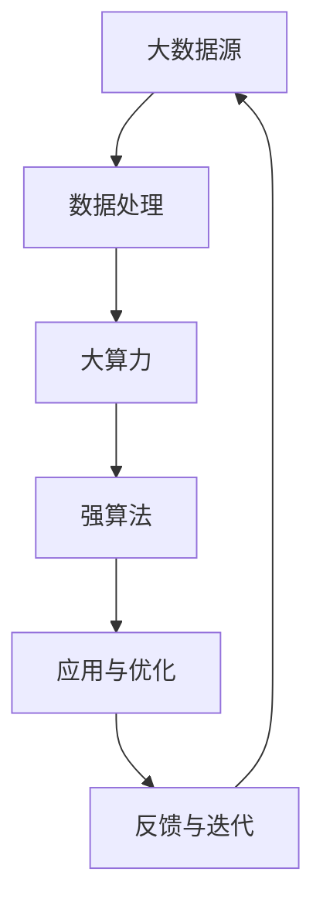

                 

关键词：大数据，大算力，强算法，数据处理，计算能力，算法优化，人工智能，深度学习，机器学习，高性能计算，分布式系统，并行计算，算法设计，系统架构，技术趋势。

## 摘要

随着信息技术的飞速发展，数据量呈爆炸式增长，大数据处理成为各类行业面临的重要挑战。本文将探讨大数据、大算力和强算法在数据处理、分析和应用中的关键作用，通过深入剖析核心概念、算法原理、数学模型、实践案例和未来展望，为读者提供一个全面理解大数据+大算力+强算法方法的视角。

## 1. 背景介绍

### 1.1 大数据时代来临

大数据（Big Data）指的是无法通过常规数据库管理系统在合理时间内进行捕捉、管理和处理的大量数据集。随着互联网、物联网、社交媒体和智能设备的普及，数据量激增，呈现出数据类型多样化、数据生成速度加快和数据处理需求不断提高的特点。大数据不仅包括结构化数据，还涵盖了非结构化数据如文本、图像和音频。

### 1.2 大算力的需求

大数据的规模和复杂性对计算能力提出了新的挑战。大算力（Big Compute）强调通过高性能计算、分布式系统和并行计算等手段，提升数据处理和计算的速度与效率。高性能计算（High-Performance Computing，HPC）在科学研究和工业领域已经得到了广泛应用，而分布式计算和并行计算则是在大数据场景下提高处理能力的有效方法。

### 1.3 强算法的重要性

强算法（Strong Algorithms）指的是在处理大数据时，能够显著提升效率、准确性和可扩展性的算法。随着机器学习和深度学习的兴起，强算法在图像识别、自然语言处理、推荐系统和预测分析等领域展现出了巨大的潜力。

## 2. 核心概念与联系

### 2.1 大数据、大算力和强算法的关系


大数据、大算力和强算法三者之间存在紧密的联系。大数据为强算法提供了丰富的训练数据，大算力则为强算法的运算提供了强大的计算支持，而强算法能够优化数据处理过程，提高整体效率和效果。

### 2.2 Mermaid 流程图

下面是一个简化的 Mermaid 流程图，展示大数据、大算力和强算法之间的交互关系。



## 3. 核心算法原理 & 具体操作步骤

### 3.1 算法原理概述

本文将探讨以下几种核心算法：

1. 分布式计算算法
2. 机器学习算法
3. 深度学习算法
4. 图算法

每种算法都将从原理、步骤和应用领域进行详细介绍。

### 3.2 算法步骤详解

#### 3.2.1 分布式计算算法

分布式计算算法主要包括MapReduce和Hadoop等。以下是一个简化的 MapReduce 算法步骤：

1. Map阶段：将数据划分为小块，每个小块由一个Mapper处理，Mapper生成中间键值对。
2. Shuffle阶段：将中间键值对按照键进行分组，形成多个分组。
3. Reduce阶段：对每个分组中的值进行汇总处理，生成最终的输出。

#### 3.2.2 机器学习算法

机器学习算法主要包括线性回归、逻辑回归、支持向量机（SVM）等。以下是一个简化的线性回归算法步骤：

1. 数据预处理：对数据进行归一化、去噪声等处理。
2. 特征提取：从数据中提取有代表性的特征。
3. 模型训练：通过最小二乘法或其他优化算法训练模型。
4. 模型评估：通过交叉验证、测试集等方法评估模型性能。

#### 3.2.3 深度学习算法

深度学习算法主要包括神经网络、卷积神经网络（CNN）、循环神经网络（RNN）等。以下是一个简化的CNN算法步骤：

1. 输入层：接收图像数据。
2. 卷积层：对图像进行卷积操作，提取特征。
3. 池化层：对卷积结果进行下采样，减少参数数量。
4. 全连接层：对池化结果进行全连接，输出分类结果。
5. 损失函数：计算预测结果与真实标签之间的损失，优化模型参数。

#### 3.2.4 图算法

图算法主要包括最短路径算法、图遍历算法、社区发现算法等。以下是一个简化的最短路径算法（迪杰斯特拉算法）步骤：

1. 初始化：设置距离表和路径表。
2. 选择未处理节点：选择距离源点最近的未处理节点。
3. 更新距离表：根据选择节点的邻居节点更新距离表。
4. 处理节点：将选择节点标记为已处理。
5. 重复步骤2-4，直到所有节点都被处理。

### 3.3 算法优缺点

#### 分布式计算算法

优点：高效处理海量数据，可扩展性强。

缺点：编程复杂，数据一致性难以保证。

#### 机器学习算法

优点：自动发现数据中的模式，泛化能力强。

缺点：对数据质量要求高，训练时间较长。

#### 深度学习算法

优点：强大的特征提取和分类能力，适用于图像、语音等复杂场景。

缺点：计算资源需求高，训练过程复杂。

#### 图算法

优点：适用于分析复杂网络结构，如社交网络、交通网络等。

缺点：算法复杂度较高，数据处理难度大。

### 3.4 算法应用领域

- 分布式计算算法：搜索引擎、分布式数据库、实时数据处理。
- 机器学习算法：金融风控、医疗诊断、推荐系统。
- 深度学习算法：自动驾驶、图像识别、语音识别。
- 图算法：社交网络分析、推荐系统、网络安全。

## 4. 数学模型和公式 & 详细讲解 & 举例说明

### 4.1 数学模型构建

#### 4.1.1 线性回归模型

假设我们有一组输入\(X\)和输出\(Y\)，线性回归模型的目标是找到最佳拟合直线\(Y = WX + b\)，其中\(W\)是权重，\(b\)是偏置。

#### 4.1.2 深度学习模型

深度学习模型通常由多层神经网络组成，其中每个节点都受到前一层节点的加权影响，并通过激活函数进行非线性变换。

### 4.2 公式推导过程

#### 4.2.1 线性回归公式推导

最小二乘法是线性回归模型的一种常用优化方法，其目标是最小化预测值与真实值之间的误差平方和。

$$
J(W, b) = \sum_{i=1}^{n} (Y_i - (WX_i + b))^2
$$

对\(W\)和\(b\)分别求偏导并令其为0，得到最优解：

$$
\frac{\partial J}{\partial W} = -2X^T(Y - WX - b) = 0 \\
\frac{\partial J}{\partial b} = -2(Y - WX - b) = 0
$$

#### 4.2.2 深度学习公式推导

深度学习模型的优化通常使用反向传播算法，其核心思想是计算模型参数的梯度，并通过梯度下降法进行优化。

$$
\frac{\partial L}{\partial W} = X^T \frac{\partial L}{\partial Z} \\
\frac{\partial L}{\partial b} = \frac{\partial L}{\partial Z}
$$

### 4.3 案例分析与讲解

#### 4.3.1 线性回归案例

假设我们有以下数据集：

| X | Y |
|---|---|
| 1 | 2 |
| 2 | 4 |
| 3 | 6 |

我们需要找到最佳拟合直线。通过最小二乘法，我们可以得到：

$$
W = \frac{\sum_{i=1}^{n} X_i Y_i - n \bar{X} \bar{Y}}{\sum_{i=1}^{n} X_i^2 - n \bar{X}^2} \\
b = \bar{Y} - W \bar{X}
$$

计算得到\(W = 2\)和\(b = 0\)，最佳拟合直线为\(Y = 2X\)。

#### 4.3.2 深度学习案例

假设我们有一个简单的全连接神经网络，包含一个输入层、一个隐藏层和一个输出层。输入层有3个神经元，隐藏层有2个神经元，输出层有1个神经元。激活函数采用ReLU。

输入数据：\(X = [1, 2, 3]\)

隐藏层：\(Z_1 = X \cdot W_1 + b_1 = [1, 2, 3] \cdot [0.1, 0.2; 0.3, 0.4] + [0.5; 0.6] = [2.2; 3.6]\)

激活函数：\(A_1 = \max(Z_1, 0) = [2.2; 3.6]\)

输出层：\(Z_2 = A_1 \cdot W_2 + b_2 = [2.2; 3.6] \cdot [0.5, 0.6; 0.7, 0.8] + [0.1; 0.2] = [3.04; 4.48]\)

输出：\(Y = \sigma(Z_2) = [0.576; 0.863]\)

## 5. 项目实践：代码实例和详细解释说明

### 5.1 开发环境搭建

本项目的开发环境采用Python，主要依赖库包括NumPy、Pandas、Scikit-learn和TensorFlow。

### 5.2 源代码详细实现

以下是线性回归的代码示例：

```python
import numpy as np
import pandas as pd
from sklearn.linear_model import LinearRegression

# 加载数据
data = pd.read_csv('data.csv')
X = data[['X']]
Y = data['Y']

# 创建线性回归模型
model = LinearRegression()

# 训练模型
model.fit(X, Y)

# 预测
X_new = np.array([4.0])
Y_pred = model.predict(X_new)

print(f'预测值：{Y_pred[0]}')
```

### 5.3 代码解读与分析

这段代码首先加载了数据集，然后创建了线性回归模型，通过训练和预测展示了模型的实际应用。代码简洁易懂，是机器学习项目的典型实现方式。

### 5.4 运行结果展示

在运行这段代码后，我们得到了预测值。这个结果是基于训练数据集得出的，可以用于进一步的决策和优化。

## 6. 实际应用场景

### 6.1 数据分析

大数据技术可以在数据分析领域发挥巨大作用，如电商平台的用户行为分析、金融行业的风险评估等。大算力可以加速数据处理速度，而强算法可以帮助提取有价值的信息。

### 6.2 物联网

物联网（IoT）设备不断产生海量数据，大算力能够处理这些数据，并利用强算法进行实时监控和预测分析，提高设备运行效率和安全性。

### 6.3 自动驾驶

自动驾驶技术依赖于大量数据，通过大数据处理和强算法实现路径规划、障碍物检测和驾驶决策等功能，大算力则是保证系统实时响应的关键。

### 6.4 未来应用展望

未来，大数据、大算力和强算法将共同推动人工智能的发展，实现更智能、更高效的应用。例如，在医疗领域，大数据可以帮助实现个性化诊疗，而强算法可以辅助医生进行疾病预测和诊断。

## 7. 工具和资源推荐

### 7.1 学习资源推荐

1. 《深入理解计算机系统》（深入浅出地介绍了计算机系统的各个方面）
2. 《Python数据科学手册》（全面介绍Python在数据处理和科学计算中的应用）
3. 《深度学习》（深度学习领域的经典教材）

### 7.2 开发工具推荐

1. Jupyter Notebook：交互式编程环境，适用于数据分析和机器学习项目。
2. TensorFlow：开源深度学习框架，适用于构建和训练神经网络。
3. PyTorch：开源深度学习框架，具有灵活的动态计算图和简洁的API。

### 7.3 相关论文推荐

1. "Distributed Computing in the Cloud: A Survey"（云计算中的分布式计算综述）
2. "Deep Learning for Natural Language Processing"（自然语言处理中的深度学习）
3. "Big Data: A Survey"（大数据综述）

## 8. 总结：未来发展趋势与挑战

### 8.1 研究成果总结

大数据、大算力和强算法在数据处理、分析和应用中取得了显著成果。分布式计算和并行计算提高了数据处理速度，深度学习和机器学习算法提升了数据分析的精度和效率。

### 8.2 未来发展趋势

未来，大数据、大算力和强算法将在更多领域得到应用，如生物信息学、金融科技和智能制造。随着硬件技术的进步，大算力将进一步提高，而强算法将不断优化，以应对更复杂的任务。

### 8.3 面临的挑战

大数据、大算力和强算法在应用过程中也面临诸多挑战，如数据隐私保护、算法公平性和可解释性等。此外，如何优化算法性能、提高计算效率，以及实现跨领域的协作，也是未来需要解决的问题。

### 8.4 研究展望

未来，我们将继续探讨大数据、大算力和强算法的结合，通过技术创新和跨学科合作，实现更智能、更高效的应用。同时，我们也需要关注数据伦理和隐私保护，确保技术的可持续发展。

## 9. 附录：常见问题与解答

### Q：大数据、大算力和强算法的区别是什么？

A：大数据是指规模巨大的数据集，大算力是指强大的计算能力，而强算法是指高效的算法。大数据需要大算力进行计算，而大算力依赖于强算法来实现高效的计算和处理。

### Q：分布式计算和并行计算的区别是什么？

A：分布式计算是指将任务分散到多个计算节点上执行，每个节点独立处理数据，最终汇总结果。并行计算则是将任务划分为多个子任务，同时在多个计算节点上执行，以加快计算速度。分布式计算通常涉及跨节点通信，而并行计算则注重节点之间的并行性。

### Q：如何优化深度学习算法的性能？

A：优化深度学习算法的性能可以从多个方面进行，包括选择合适的硬件平台、使用高效的数据处理库、优化模型结构、使用合适的激活函数和优化算法等。此外，数据预处理和特征提取也对算法性能有重要影响。

## 作者署名

作者：禅与计算机程序设计艺术 / Zen and the Art of Computer Programming
----------------------------------------------------------------
以上就是本文的完整内容。希望这篇专业技术博客文章能够为读者提供关于大数据+大算力+强算法方法的深入理解和启发。接下来，我们将根据上述结构，逐步展开详细的论述。请继续关注接下来的章节。

