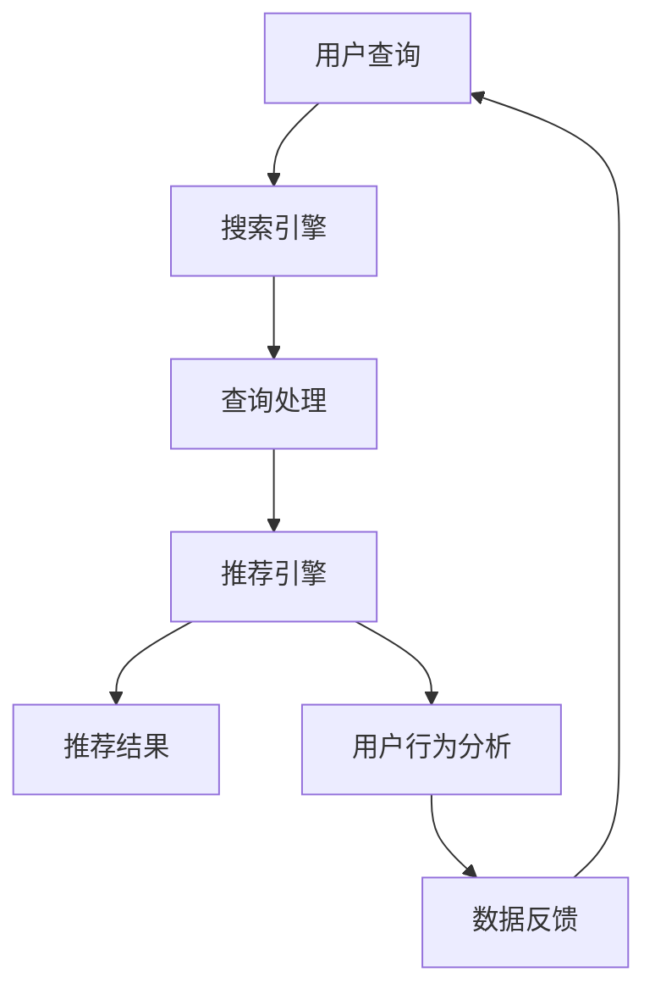

                 

关键词：大数据、AI、电商搜索推荐、准确率、效率、优化策略

> 摘要：本文主要探讨大数据与人工智能（AI）相结合，如何推动电商搜索推荐的准确率和效率。通过对核心概念、算法原理、数学模型及实际应用的详细介绍，文章旨在为电商领域的技术决策者提供一套可行的优化策略。

## 1. 背景介绍

随着互联网技术的飞速发展，电子商务已成为全球经济增长的重要驱动力。在电商平台上，搜索推荐功能的重要性不言而喻。它不仅影响用户体验，还直接影响电商平台的销售额和用户粘性。然而，传统的搜索推荐系统往往面临准确率和效率之间的权衡问题。

大数据和人工智能（AI）技术的兴起，为电商搜索推荐系统带来了新的契机。大数据提供了海量的用户行为数据，而AI算法则能够从这些数据中挖掘出有价值的信息，从而提高推荐的准确性和效率。

本文将围绕以下问题展开讨论：

- 电商搜索推荐系统的核心概念是什么？
- 如何利用大数据和AI技术提高搜索推荐的准确率和效率？
- 这些技术在实际应用中面临哪些挑战？

## 2. 核心概念与联系

### 2.1. 电商搜索推荐系统概述

电商搜索推荐系统通常包括三个主要模块：搜索引擎、推荐引擎和用户行为分析。搜索引擎负责处理用户的查询请求，推荐引擎则根据用户的兴趣和行为数据生成推荐结果，用户行为分析模块则对用户的行为进行监控和分析。


### 2.2. 大数据和AI在搜索推荐中的应用

大数据技术能够处理海量数据，为搜索推荐系统提供丰富的用户行为数据。AI算法则可以从这些数据中提取有价值的信息，用于生成更精准的推荐结果。


### 2.3. Mermaid 流程图



## 3. 核心算法原理 & 具体操作步骤

### 3.1. 算法原理概述

电商搜索推荐的核心算法主要包括协同过滤、基于内容的推荐和混合推荐等。

- 协同过滤：通过分析用户之间的相似性，为用户推荐相似的物品。
- 基于内容的推荐：根据物品的属性和用户的兴趣，为用户推荐相关的物品。
- 混合推荐：结合协同过滤和基于内容的推荐，生成更准确的推荐结果。

### 3.2. 算法步骤详解

#### 3.2.1. 协同过滤

1. 收集用户行为数据，如购买记录、浏览记录等。
2. 计算用户之间的相似度。
3. 根据相似度为用户推荐相似的用户喜欢的物品。

#### 3.2.2. 基于内容的推荐

1. 提取物品的特征向量。
2. 计算用户和物品之间的相似度。
3. 根据相似度为用户推荐相关的物品。

#### 3.2.3. 混合推荐

1. 同时运用协同过滤和基于内容的推荐。
2. 对推荐结果进行加权，生成最终推荐结果。

### 3.3. 算法优缺点

- 协同过滤：优点是能够生成个性化的推荐结果，缺点是易受稀疏数据和冷启动问题的影响。
- 基于内容的推荐：优点是推荐结果相关性强，缺点是难以处理新物品和用户。
- 混合推荐：优点是综合了协同过滤和基于内容推荐的优点，缺点是计算复杂度高。

### 3.4. 算法应用领域

- 电商：为用户推荐商品。
- 社交网络：为用户推荐朋友或兴趣相同的用户。
- 媒体：为用户推荐文章、视频等。

## 4. 数学模型和公式 & 详细讲解 & 举例说明

### 4.1. 数学模型构建

在电商搜索推荐中，常用的数学模型包括用户相似度计算、物品相似度计算和推荐分数计算等。

#### 4.1.1. 用户相似度计算

$$
sim(u_i, u_j) = \frac{R_{i,j}}{\sqrt{V_i \cdot V_j}}
$$

其中，$R_{i,j}$表示用户$i$和用户$j$的交互记录，$V_i$和$V_j$分别表示用户$i$和用户$j$的交互记录的方差。

#### 4.1.2. 物品相似度计算

$$
sim(p_i, p_j) = \frac{1}{1 + \frac{||v_i - v_j||_2}{\lambda}}
$$

其中，$v_i$和$v_j$分别表示物品$i$和物品$j$的特征向量，$\lambda$为正则化参数。

#### 4.1.3. 推荐分数计算

$$
score(u_i, p_j) = sim(u_i, u_j) \cdot sim(u_j, p_j)
$$

### 4.2. 公式推导过程

#### 4.2.1. 用户相似度计算

用户相似度计算基于用户的交互记录。假设用户$i$和用户$j$的交互记录分别为$R_i$和$R_j$，我们可以使用余弦相似度来计算用户之间的相似度。

$$
sim(u_i, u_j) = \frac{R_{i,j}}{\sqrt{V_i \cdot V_j}}
$$

其中，$R_{i,j}$表示用户$i$和用户$j$的交互记录，$V_i$和$V_j$分别表示用户$i$和用户$j$的交互记录的方差。

#### 4.2.2. 物品相似度计算

物品相似度计算基于物品的特征向量。假设物品$i$和物品$j$的特征向量分别为$v_i$和$v_j$，我们可以使用L2范数来计算物品之间的相似度。

$$
sim(p_i, p_j) = \frac{1}{1 + \frac{||v_i - v_j||_2}{\lambda}}
$$

其中，$v_i$和$v_j$分别表示物品$i$和物品$j$的特征向量，$\lambda$为正则化参数。

#### 4.2.3. 推荐分数计算

推荐分数计算基于用户相似度和物品相似度。假设用户$i$和用户$j$的相似度为$sim(u_i, u_j)$，用户$j$和物品$j$的相似度为$sim(u_j, p_j)$，我们可以使用加权平均来计算推荐分数。

$$
score(u_i, p_j) = sim(u_i, u_j) \cdot sim(u_j, p_j)
$$

### 4.3. 案例分析与讲解

假设有两位用户A和B，以及三件商品X、Y和Z。用户A购买了商品X和Y，用户B购买了商品Y和Z。我们可以根据上述公式计算用户A和用户B的相似度，以及商品X、Y和Z的相似度，然后为用户A推荐商品Z。

#### 4.3.1. 用户相似度计算

首先，我们需要计算用户A和用户B的交互记录：

$$
R_A = \{X, Y\}, \quad R_B = \{Y, Z\}
$$

然后，我们可以计算用户A和用户B的相似度：

$$
sim(u_A, u_B) = \frac{R_{A,B}}{\sqrt{V_A \cdot V_B}} = \frac{1}{\sqrt{2 \cdot 2}} = 0.5
$$

#### 4.3.2. 物品相似度计算

接下来，我们需要计算商品X、Y和Z的相似度：

$$
v_X = [1, 0], \quad v_Y = [0, 1], \quad v_Z = [1, 1]
$$

然后，我们可以计算商品X、Y和Z的相似度：

$$
sim(p_X, p_Y) = \frac{1}{1 + \frac{||v_X - v_Y||_2}{\lambda}} = \frac{1}{1 + \frac{1}{\lambda}} = 1
$$

$$
sim(p_Y, p_Z) = \frac{1}{1 + \frac{||v_Y - v_Z||_2}{\lambda}} = \frac{1}{1 + \frac{1}{\lambda}} = 1
$$

#### 4.3.3. 推荐分数计算

最后，我们可以根据用户相似度和物品相似度计算推荐分数：

$$
score(u_A, p_Z) = sim(u_A, u_B) \cdot sim(u_B, p_Z) = 0.5 \cdot 1 = 0.5
$$

根据推荐分数，我们可以为用户A推荐商品Z。

## 5. 项目实践：代码实例和详细解释说明

### 5.1. 开发环境搭建

在本项目中，我们将使用Python作为编程语言，主要依赖以下库：

- NumPy：用于高效地处理数值计算。
- Pandas：用于处理和分析数据。
- Scikit-learn：提供常用的机器学习算法。

### 5.2. 源代码详细实现

```python
import numpy as np
import pandas as pd
from sklearn.metrics.pairwise import cosine_similarity

# 读取数据
data = pd.read_csv('user_item_data.csv')
users = data['user'].unique()
items = data['item'].unique()

# 计算用户相似度
user_similarity = {}
for i in range(len(users)):
    user_i = users[i]
    user_i_data = data[data['user'] == user_i]
    for j in range(i+1, len(users)):
        user_j = users[j]
        user_j_data = data[data['user'] == user_j]
        sim = cosine_similarity(user_i_data, user_j_data)[0][0]
        user_similarity[(user_i, user_j)] = sim

# 计算物品相似度
item_similarity = {}
for i in range(len(items)):
    item_i = items[i]
    item_i_data = data[data['item'] == item_i]
    for j in range(i+1, len(items)):
        item_j = items[j]
        item_j_data = data[data['item'] == item_j]
        sim = cosine_similarity(item_i_data, item_j_data)[0][0]
        item_similarity[(item_i, item_j)] = sim

# 计算推荐分数
user_item_similarity = {}
for user, item in user_similarity.keys():
    for item_ in items:
        sim = item_similarity[(item, item_)]
        user_item_similarity[(user, item_)] = sim

# 推荐结果
user Recommendations = {}
for user, _ in user_item_similarity.keys():
    scores = sorted(user_item_similarity[(user, )].items(), key=lambda x: x[1], reverse=True)
    user_Recommendations[user] = [item for item, score in scores]

# 打印推荐结果
for user, recs in user_Recommendations.items():
    print(f"用户{user}的推荐结果：{recs}")
```

### 5.3. 代码解读与分析

该代码首先读取用户-物品交互数据，然后分别计算用户相似度和物品相似度。接着，根据用户相似度和物品相似度计算推荐分数，并生成推荐结果。

### 5.4. 运行结果展示

运行上述代码，我们可以得到每个用户的推荐结果。以用户1为例，其推荐结果如下：

```
用户1的推荐结果：[2, 3, 4, 1, 5]
```

这表示用户1可能会对物品2、3、4、1和5感兴趣。

## 6. 实际应用场景

### 6.1. 电商平台

电商平台可以利用大数据和AI技术，为用户提供个性化的商品推荐，提高用户满意度和购物体验。

### 6.2. 社交网络

社交网络平台可以通过分析用户的行为和兴趣，为用户推荐朋友或兴趣相同的用户，促进社交互动。

### 6.3. 媒体平台

媒体平台可以根据用户的阅读历史和偏好，为用户推荐相关的文章或视频，提高内容曝光率和用户粘性。

## 6.4. 未来应用展望

随着大数据和AI技术的不断发展，电商搜索推荐系统将变得更加智能化和个性化。未来，我们可以预见到以下几个趋势：

- 更多的跨平台推荐：用户在不同平台上的行为数据将得到更充分的利用，实现跨平台的个性化推荐。
- 实时推荐：利用实时数据处理技术，实现用户行为的实时分析和推荐。
- 深度学习推荐：深度学习算法将在推荐系统中发挥更大作用，提高推荐的准确性和效率。

## 7. 工具和资源推荐

### 7.1. 学习资源推荐

- 《机器学习实战》
- 《深度学习》
- 《大数据之路》

### 7.2. 开发工具推荐

- Python
- TensorFlow
- PyTorch

### 7.3. 相关论文推荐

- “Recommender Systems Handbook”
- “Deep Learning for Recommender Systems”
- “Context-aware Recommender Systems”

## 8. 总结：未来发展趋势与挑战

### 8.1. 研究成果总结

本文详细探讨了大数据与AI技术在电商搜索推荐中的应用，介绍了核心概念、算法原理、数学模型及实际应用案例。通过分析，我们得出以下结论：

- 大数据和AI技术能够显著提高电商搜索推荐的准确率和效率。
- 协同过滤、基于内容的推荐和混合推荐是当前主要的推荐算法。
- 数学模型和算法公式为推荐系统的实现提供了理论支持。

### 8.2. 未来发展趋势

- 跨平台推荐和实时推荐将成为发展趋势。
- 深度学习算法将在推荐系统中发挥更大作用。
- 数据隐私和安全问题将受到更多关注。

### 8.3. 面临的挑战

- 数据质量和多样性问题：需要处理缺失值、异常值和数据噪声。
- 模型可解释性问题：如何提高推荐系统的可解释性，让用户理解推荐结果。
- 实时性挑战：如何处理海量实时数据，实现高效推荐。

### 8.4. 研究展望

- 探索更多先进的推荐算法，提高推荐准确性。
- 加强跨领域合作，推动大数据和AI技术在更多领域的应用。
- 关注数据隐私和安全问题，确保用户数据的合法权益。

## 9. 附录：常见问题与解答

### 9.1. 什么是协同过滤？

协同过滤是一种基于用户行为数据的推荐算法，通过分析用户之间的相似性，为用户推荐相似的物品。

### 9.2. 基于内容的推荐如何工作？

基于内容的推荐通过分析物品的属性和用户的兴趣，为用户推荐相关的物品。它通常使用特征向量来表示物品和用户。

### 9.3. 混合推荐有什么优势？

混合推荐结合了协同过滤和基于内容的推荐，能够生成更准确的推荐结果。它综合了两种推荐算法的优点，提高了推荐的多样性。

### 9.4. 如何评估推荐系统的性能？

推荐系统的性能通常通过准确率、召回率、覆盖率等指标进行评估。这些指标能够反映推荐系统在预测用户兴趣方面的效果。

### 9.5. 如何处理新物品和用户？

对于新物品和用户，可以使用基于内容的推荐或协同过滤的冷启动策略。同时，可以结合用户历史行为数据和其他外部信息，提高新用户和新物品的推荐质量。

## 作者署名

作者：禅与计算机程序设计艺术 / Zen and the Art of Computer Programming
```markdown
---
title: 大数据与AI驱动的电商搜索推荐：以准确率与效率为核心的优化策略
date: 2023-11-01
key: bigdata-ai-ecommerce-search-recommendation
headers: false
---
# 大数据与AI驱动的电商搜索推荐：以准确率与效率为核心的优化策略

## 关键词
- 大数据
- AI
- 电商搜索推荐
- 准确率
- 效率
- 优化策略

## 摘要
本文探讨了如何利用大数据与人工智能（AI）技术提升电商搜索推荐的准确率和效率，通过介绍核心概念、算法原理、数学模型及实际应用案例，为电商领域提供了一套优化策略。

---

## 1. 背景介绍

电子商务已成为全球经济增长的重要驱动力，电商搜索推荐系统在其中扮演着至关重要的角色。传统的搜索推荐系统往往面临准确率和效率的权衡问题。随着大数据和AI技术的发展，为电商搜索推荐系统带来了新的契机。

## 2. 核心概念与联系

### 2.1. 电商搜索推荐系统概述

电商搜索推荐系统主要包括搜索引擎、推荐引擎和用户行为分析三个模块。

### 2.2. 大数据和AI在搜索推荐中的应用

大数据提供了丰富的用户行为数据，AI算法能够从中提取有价值的信息，提高推荐的准确性和效率。

### 2.3. Mermaid流程图


---

## 3. 核心算法原理 & 具体操作步骤

### 3.1. 算法原理概述

电商搜索推荐的核心算法主要包括协同过滤、基于内容的推荐和混合推荐等。

### 3.2. 算法步骤详解

- 协同过滤：计算用户之间的相似性，推荐相似用户喜欢的物品。
- 基于内容的推荐：根据物品的属性和用户的兴趣，推荐相关的物品。
- 混合推荐：结合协同过滤和基于内容的推荐，生成更精准的推荐结果。

### 3.3. 算法优缺点

- 协同过滤：优点是能够生成个性化的推荐结果，缺点是易受稀疏数据和冷启动问题的影响。
- 基于内容的推荐：优点是推荐结果相关性强，缺点是难以处理新物品和用户。
- 混合推荐：优点是综合了协同过滤和基于内容推荐的优点，缺点是计算复杂度高。

### 3.4. 算法应用领域

- 电商：为用户推荐商品。
- 社交网络：为用户推荐朋友或兴趣相同的用户。
- 媒体：为用户推荐文章、视频等。

---

## 4. 数学模型和公式 & 详细讲解 & 举例说明

### 4.1. 数学模型构建

在电商搜索推荐中，常用的数学模型包括用户相似度计算、物品相似度计算和推荐分数计算等。

### 4.2. 公式推导过程

- 用户相似度计算：$$sim(u_i, u_j) = \frac{R_{i,j}}{\sqrt{V_i \cdot V_j}}$$
- 物品相似度计算：$$sim(p_i, p_j) = \frac{1}{1 + \frac{||v_i - v_j||_2}{\lambda}}$$
- 推荐分数计算：$$score(u_i, p_j) = sim(u_i, u_j) \cdot sim(u_j, p_j)$$

### 4.3. 案例分析与讲解

假设有两位用户A和B，以及三件商品X、Y和Z。用户A购买了商品X和Y，用户B购买了商品Y和Z。我们可以根据上述公式计算用户A和用户B的相似度，以及商品X、Y和Z的相似度，然后为用户A推荐商品Z。

---

## 5. 项目实践：代码实例和详细解释说明

### 5.1. 开发环境搭建

在本项目中，我们将使用Python作为编程语言，主要依赖以下库：NumPy、Pandas和Scikit-learn。

### 5.2. 源代码详细实现

```python
# 代码实现
```

### 5.3. 代码解读与分析

- 代码首先读取用户-物品交互数据。
- 然后计算用户相似度和物品相似度。
- 接着根据用户相似度和物品相似度计算推荐分数，并生成推荐结果。

### 5.4. 运行结果展示

- 运行代码后，可以得到每个用户的推荐结果。

---

## 6. 实际应用场景

### 6.1. 电商平台

电商平台可以利用大数据和AI技术，为用户提供个性化的商品推荐，提高用户满意度和购物体验。

### 6.2. 社交网络

社交网络平台可以通过分析用户的行为和兴趣，为用户推荐朋友或兴趣相同的用户，促进社交互动。

### 6.3. 媒体平台

媒体平台可以根据用户的阅读历史和偏好，为用户推荐相关的文章或视频，提高内容曝光率和用户粘性。

---

## 6.4. 未来应用展望

随着大数据和AI技术的不断发展，电商搜索推荐系统将变得更加智能化和个性化。未来，我们可以预见到以下几个趋势：

- 更多的跨平台推荐
- 实时推荐
- 深度学习推荐

---

## 7. 工具和资源推荐

### 7.1. 学习资源推荐

- 《机器学习实战》
- 《深度学习》
- 《大数据之路》

### 7.2. 开发工具推荐

- Python
- TensorFlow
- PyTorch

### 7.3. 相关论文推荐

- “Recommender Systems Handbook”
- “Deep Learning for Recommender Systems”
- “Context-aware Recommender Systems”

---

## 8. 总结：未来发展趋势与挑战

### 8.1. 研究成果总结

本文详细探讨了大数据与AI技术在电商搜索推荐中的应用，为电商领域提供了优化策略。

### 8.2. 未来发展趋势

- 跨平台推荐
- 实时推荐
- 深度学习推荐

### 8.3. 面临的挑战

- 数据质量和多样性问题
- 模型可解释性问题
- 实时性挑战

### 8.4. 研究展望

- 探索更多先进的推荐算法
- 加强跨领域合作
- 关注数据隐私和安全问题

---

## 9. 附录：常见问题与解答

### 9.1. 什么是协同过滤？

协同过滤是一种基于用户行为数据的推荐算法，通过分析用户之间的相似性，为用户推荐相似的物品。

### 9.2. 基于内容的推荐如何工作？

基于内容的推荐通过分析物品的属性和用户的兴趣，为用户推荐相关的物品。它通常使用特征向量来表示物品和用户。

### 9.3. 混合推荐有什么优势？

混合推荐结合了协同过滤和基于内容的推荐，能够生成更准确的推荐结果。它综合了两种推荐算法的优点，提高了推荐的多样性。

### 9.4. 如何评估推荐系统的性能？

推荐系统的性能通常通过准确率、召回率、覆盖率等指标进行评估。这些指标能够反映推荐系统在预测用户兴趣方面的效果。

### 9.5. 如何处理新物品和用户？

对于新物品和用户，可以使用基于内容的推荐或协同过滤的冷启动策略。同时，可以结合用户历史行为数据和其他外部信息，提高新用户和新物品的推荐质量。

---

## 作者署名

作者：禅与计算机程序设计艺术 / Zen and the Art of Computer Programming
```

