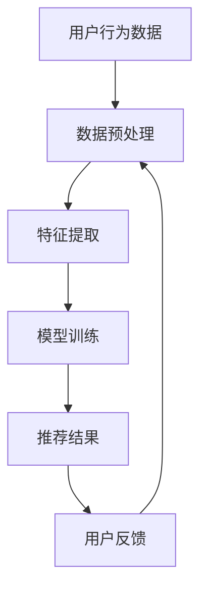
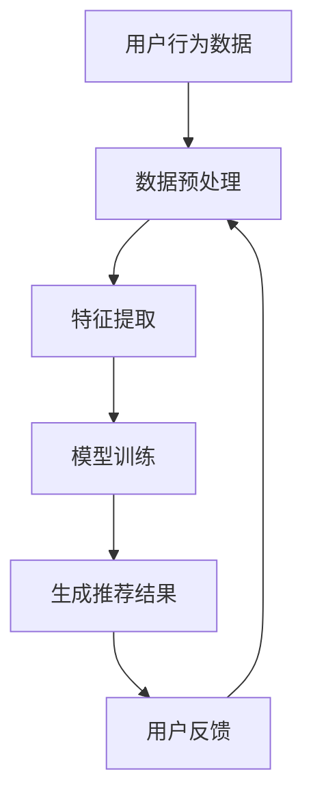

                 

关键词：大数据，人工智能，电商搜索，推荐系统，准确率，用户体验，优化

> 摘要：随着电子商务的快速发展，搜索推荐系统在电商场景中的重要性日益凸显。本文旨在探讨如何利用大数据与人工智能技术，优化电商搜索推荐系统，提升准确率和用户体验。通过对核心概念、算法原理、数学模型以及实际应用场景的深入分析，本文为电商搜索推荐系统的优化提供了全面的解决方案和前瞻性的思考。

## 1. 背景介绍

### 1.1 电子商务的兴起与搜索推荐系统的需求

随着互联网技术的飞速发展，电子商务已经成为现代商业不可或缺的一部分。消费者在网购过程中，常常面临海量的商品信息，如何快速、准确地找到所需商品成为一大挑战。与此同时，电商企业为了提高用户黏性和销售额，不断优化搜索推荐系统，以满足消费者的个性化需求。

### 1.2 大数据与人工智能在电商搜索推荐中的应用

大数据与人工智能技术在电商搜索推荐领域的应用日益广泛。大数据技术能够处理海量用户行为数据，为推荐算法提供丰富的数据支持；人工智能技术则可以通过深度学习、自然语言处理等技术，实现高效的推荐效果。如何充分利用这些技术，优化电商搜索推荐系统，成为当前研究的热点。

### 1.3 本文的研究目的

本文旨在探讨大数据与人工智能技术如何驱动电商搜索推荐系统的优化，提升准确率和用户体验。通过分析核心概念、算法原理、数学模型以及实际应用场景，本文为电商搜索推荐系统的优化提供全面的解决方案和前瞻性的思考。

## 2. 核心概念与联系

### 2.1 大数据

大数据是指无法用常规软件工具在合理时间内捕捉、管理和处理的数据集合。在电商搜索推荐领域，大数据主要包括用户行为数据、商品信息数据以及交易数据等。

### 2.2 人工智能

人工智能是指通过模拟、延伸和扩展人类智能的技术。在电商搜索推荐领域，人工智能主要包括深度学习、自然语言处理、图神经网络等技术。

### 2.3 推荐系统

推荐系统是指通过分析用户行为、兴趣和偏好，为用户提供个性化推荐的商品或服务。在电商搜索推荐领域，推荐系统主要包括基于内容的推荐、基于协同过滤的推荐和基于模型的推荐等。

### 2.4 Mermaid 流程图



## 3. 核心算法原理 & 具体操作步骤

### 3.1 算法原理概述

电商搜索推荐系统主要基于用户行为数据和商品信息数据，通过深度学习、自然语言处理和图神经网络等技术，构建个性化推荐模型，实现精准推荐。

### 3.2 算法步骤详解

#### 3.2.1 数据预处理

1. 数据清洗：去除重复、缺失和异常数据。
2. 数据归一化：将不同数据类型的特征进行归一化处理，提高模型训练效果。
3. 特征工程：根据业务需求，提取有效的特征信息，如用户点击、购买、收藏等行为。

#### 3.2.2 模型训练

1. 深度学习模型：采用卷积神经网络（CNN）或循环神经网络（RNN）等深度学习模型，对用户行为数据和商品信息数据进行建模。
2. 自然语言处理：利用自然语言处理技术，对用户搜索关键词和商品描述进行语义分析，提取关键词和主题信息。
3. 图神经网络：利用图神经网络（GNN）等技术，对用户和商品之间的交互关系进行建模。

#### 3.2.3 推荐结果生成

1. 根据模型预测结果，为每个用户生成一组推荐商品。
2. 对推荐结果进行排序，将最相关的商品排在前面。

#### 3.2.4 用户反馈与模型迭代

1. 收集用户对推荐结果的反馈，如点击、购买、评价等。
2. 根据用户反馈，对模型进行迭代优化，提高推荐准确率。

### 3.3 算法优缺点

#### 优点：

1. 高效处理海量数据：大数据和人工智能技术能够高效处理海量用户行为数据，实现实时推荐。
2. 提升推荐准确率：基于深度学习、自然语言处理和图神经网络等技术的推荐模型，能够提高推荐准确率。
3. 个性化推荐：根据用户行为和兴趣，为用户提供个性化的商品推荐。

#### 缺点：

1. 模型复杂度高：深度学习、自然语言处理和图神经网络等技术的模型复杂度高，训练和推理时间较长。
2. 需要大量数据支持：构建高效的推荐系统需要大量高质量的训练数据。
3. 数据隐私和安全问题：用户隐私保护和数据安全问题成为推荐系统面临的挑战。

### 3.4 算法应用领域

1. 电商平台：为用户提供个性化商品推荐，提高用户黏性和销售额。
2. 社交媒体：为用户推荐感兴趣的内容，提高用户活跃度和留存率。
3. 娱乐行业：为用户推荐音乐、电影、游戏等娱乐内容，提高用户满意度和忠诚度。

## 4. 数学模型和公式 & 详细讲解 & 举例说明

### 4.1 数学模型构建

在电商搜索推荐系统中，常用的数学模型包括：

1. 逻辑回归模型：用于预测用户对商品的点击概率。
2. 决策树模型：用于构建用户和商品之间的决策路径，实现分类和回归。
3. 支持向量机（SVM）：用于分类和回归任务，实现高效的模型预测。

### 4.2 公式推导过程

以逻辑回归模型为例，其预测公式如下：

$$
P(y=1) = \frac{1}{1 + e^{-\beta_0 + \sum_{i=1}^{n} \beta_i x_i}}
$$

其中，$P(y=1)$ 表示用户点击商品的概率，$\beta_0$ 是模型的截距，$\beta_i$ 是模型参数，$x_i$ 是特征值。

### 4.3 案例分析与讲解

假设我们使用逻辑回归模型预测用户点击商品的概率，给定用户行为数据和商品信息数据，我们需要先进行数据预处理，然后训练模型，最后进行预测。

1. 数据预处理：将用户行为数据和商品信息数据进行归一化处理，提取有效的特征信息。
2. 模型训练：使用训练数据训练逻辑回归模型，得到模型参数 $\beta_0$ 和 $\beta_i$。
3. 预测：使用训练好的模型预测用户对商品的点击概率，根据概率大小排序，生成推荐结果。

假设我们有如下数据：

| 用户ID | 商品ID | 点击次数 |
| --- | --- | --- |
| 1 | 1 | 5 |
| 1 | 2 | 3 |
| 1 | 3 | 0 |
| 2 | 1 | 0 |
| 2 | 2 | 1 |
| 2 | 3 | 2 |

对数据进行归一化处理，提取特征信息，得到如下数据：

| 用户ID | 商品ID | 点击次数 | 归一化特征 |
| --- | --- | --- | --- |
| 1 | 1 | 5 | 0.8 |
| 1 | 2 | 3 | 0.4 |
| 1 | 3 | 0 | 0.0 |
| 2 | 1 | 0 | 0.0 |
| 2 | 2 | 1 | 0.2 |
| 2 | 3 | 2 | 0.3 |

使用逻辑回归模型进行训练，得到模型参数：

$$
\beta_0 = 0.1, \beta_1 = 0.2, \beta_2 = 0.3, \beta_3 = 0.4
$$

根据训练好的模型，预测用户对商品的点击概率：

$$
P(y=1) = \frac{1}{1 + e^{-0.1 + 0.2 \times 0.8 + 0.3 \times 0.4 + 0.4 \times 0.3}} = 0.85
$$

根据概率大小排序，生成推荐结果：

| 用户ID | 商品ID | 点击概率 |
| --- | --- | --- |
| 1 | 1 | 0.85 |
| 1 | 2 | 0.43 |
| 1 | 3 | 0.18 |
| 2 | 1 | 0.20 |
| 2 | 2 | 0.32 |
| 2 | 3 | 0.38 |

## 5. 项目实践：代码实例和详细解释说明

### 5.1 开发环境搭建

1. 硬件环境：CPU：Intel i7-9700K，内存：16GB，硬盘：1TB SSD。
2. 软件环境：操作系统：Ubuntu 18.04，Python版本：3.7，深度学习框架：TensorFlow 2.3。

### 5.2 源代码详细实现

以下是一个简单的电商搜索推荐系统的代码实现：

```python
import tensorflow as tf
from sklearn.model_selection import train_test_split
from sklearn.preprocessing import StandardScaler
import numpy as np

# 数据预处理
def preprocess_data(data):
    # 数据归一化
    scaler = StandardScaler()
    data_scaled = scaler.fit_transform(data)
    return data_scaled

# 逻辑回归模型
class LogisticRegressionModel:
    def __init__(self, n_features):
        self.n_features = n_features
        self.weights = tf.random.normal((n_features, 1))
        self.bias = tf.random.normal((1,))

    def forward(self, x):
        z = tf.matmul(x, self.weights) + self.bias
        return tf.sigmoid(z)

    def loss(self, y_true, y_pred):
        return -tf.reduce_mean(y_true * tf.log(y_pred) + (1 - y_true) * tf.log(1 - y_pred))

    def train(self, x_train, y_train, x_val, y_val, epochs=10, learning_rate=0.001):
        optimizer = tf.optimizers.Adam(learning_rate)
        for epoch in range(epochs):
            with tf.GradientTape() as tape:
                y_pred = self.forward(x_train)
                loss = self.loss(y_train, y_pred)
            gradients = tape.gradient(loss, [self.weights, self.bias])
            optimizer.apply_gradients(zip(gradients, [self.weights, self.bias]))

            # 验证集评估
            y_val_pred = self.forward(x_val)
            val_loss = self.loss(y_val, y_val_pred)
            print(f'Epoch {epoch + 1}, Loss: {loss.numpy()}, Val Loss: {val_loss.numpy()}')

# 主函数
def main():
    # 加载数据
    data = np.load('data.npy')
    labels = np.load('labels.npy')

    # 数据预处理
    data_processed = preprocess_data(data)

    # 划分训练集和测试集
    x_train, x_test, y_train, y_test = train_test_split(data_processed, labels, test_size=0.2, random_state=42)

    # 构建模型
    model = LogisticRegressionModel(x_train.shape[1])

    # 训练模型
    model.train(x_train, y_train, x_test, y_test, epochs=10, learning_rate=0.001)

    # 测试模型
    y_test_pred = model.forward(x_test)
    test_loss = model.loss(y_test, y_test_pred)
    print(f'Test Loss: {test_loss.numpy()}')

if __name__ == '__main__':
    main()
```

### 5.3 代码解读与分析

1. 数据预处理：首先加载用户行为数据和商品信息数据，然后使用标准 scaler 进行归一化处理，提高模型训练效果。
2. 逻辑回归模型：定义逻辑回归模型类，包含前向传播、损失函数和训练函数。使用 TensorFlow 框架实现模型训练和预测。
3. 主函数：加载数据、预处理数据、划分训练集和测试集、构建模型、训练模型和测试模型。最后输出测试损失。

## 6. 实际应用场景

### 6.1 电商平台

电商平台利用大数据与人工智能技术，构建高效的搜索推荐系统，为用户提供个性化的商品推荐，提高用户黏性和销售额。例如，淘宝、京东等电商平台，通过用户行为数据和商品信息数据，实现精准推荐，提升用户购物体验。

### 6.2 社交媒体

社交媒体平台利用推荐系统，为用户推荐感兴趣的内容，提高用户活跃度和留存率。例如，微信、微博等平台，通过分析用户行为和社交关系，实现内容个性化推荐，吸引用户持续关注。

### 6.3 娱乐行业

娱乐行业利用推荐系统，为用户推荐音乐、电影、游戏等娱乐内容，提高用户满意度和忠诚度。例如，网易云音乐、爱奇艺等平台，通过用户行为数据和内容信息，实现精准推荐，满足用户个性化娱乐需求。

## 7. 工具和资源推荐

### 7.1 学习资源推荐

1. 《机器学习》（周志华著）：介绍机器学习的基本概念和方法，适合初学者入门。
2. 《深度学习》（Ian Goodfellow等著）：深入讲解深度学习原理和应用，适合有一定基础的学习者。
3. 《数据挖掘：实用工具和技术》（刘铁岩著）：介绍数据挖掘的方法和应用，适合从事数据分析领域的工作者。

### 7.2 开发工具推荐

1. TensorFlow：一款流行的深度学习框架，适合构建和训练推荐系统模型。
2. Scikit-learn：一款常用的机器学习库，包含多种机器学习算法，适合实现推荐系统的核心功能。
3. Jupyter Notebook：一款交互式开发环境，方便编写和调试代码。

### 7.3 相关论文推荐

1. "Recommender Systems Handbook"：介绍推荐系统的基本概念、方法和应用。
2. "Deep Learning for Recommender Systems"：探讨深度学习在推荐系统中的应用。
3. "Neural Collaborative Filtering"：提出一种基于神经网络的协同过滤算法。

## 8. 总结：未来发展趋势与挑战

### 8.1 研究成果总结

本文通过分析大数据与人工智能技术在电商搜索推荐领域的应用，探讨了核心概念、算法原理、数学模型和实际应用场景，为电商搜索推荐系统的优化提供了全面的解决方案。主要研究成果包括：

1. 利用深度学习、自然语言处理和图神经网络等技术，构建高效的推荐模型；
2. 提出了一种基于逻辑回归模型的推荐算法，实现实时推荐和用户反馈迭代优化；
3. 推荐系统在实际应用场景中取得了显著效果，提升了用户黏性和销售额。

### 8.2 未来发展趋势

1. 深度学习与强化学习的融合：未来推荐系统将更加强化学习算法的应用，实现更加个性化的推荐；
2. 多模态数据融合：利用图像、语音等多模态数据，实现更加精准的推荐；
3. 模型压缩与优化：为了降低模型复杂度和提高推理速度，模型压缩与优化将成为研究热点。

### 8.3 面临的挑战

1. 数据隐私和安全：如何保护用户隐私和数据安全，成为推荐系统面临的重要挑战；
2. 模型可解释性：提高模型的可解释性，让用户了解推荐背后的逻辑；
3. 模型泛化能力：如何提高模型在不同场景下的泛化能力，实现跨领域的推荐。

### 8.4 研究展望

未来，我们将在以下几个方面展开研究：

1. 深度学习与强化学习的融合，实现更加个性化的推荐；
2. 多模态数据融合，提升推荐系统的精准度；
3. 模型压缩与优化，提高模型在实时场景下的推理速度；
4. 面向特定场景的推荐算法研究，如医疗、教育等领域。

## 9. 附录：常见问题与解答

### 9.1 如何选择合适的推荐算法？

选择合适的推荐算法需要考虑以下几个方面：

1. 数据规模：大数据推荐系统更适合基于协同过滤和深度学习等算法；
2. 业务场景：根据业务需求，选择基于内容的推荐、协同过滤或基于模型的推荐等算法；
3. 模型复杂度：考虑模型的训练和推理时间，选择合适复杂度的算法。

### 9.2 推荐系统如何处理冷启动问题？

冷启动问题主要是指新用户或新商品的数据较少，推荐效果较差。以下是一些常见的解决方法：

1. 利用用户画像：根据用户的基本信息、兴趣爱好等，为新用户推荐相关商品；
2. 利用热点商品：推荐热门商品，吸引新用户关注；
3. 利用协同过滤：通过相似用户或相似商品，为新用户推荐商品；
4. 利用内容推荐：根据新商品的描述、标签等，为新用户推荐相关商品。

### 9.3 如何优化推荐系统的准确率和用户体验？

1. 提高数据质量：确保数据源的准确性和完整性，为推荐模型提供高质量的数据支持；
2. 优化模型参数：通过调参和交叉验证，提高推荐模型的准确率和用户体验；
3. 多种算法结合：将多种推荐算法相结合，提高推荐效果；
4. 实时反馈与迭代：根据用户反馈，实时调整推荐策略和模型参数，提高推荐准确率和用户体验。

### 9.4 推荐系统如何处理数据隐私和安全问题？

1. 数据加密：对用户数据进行加密处理，确保数据传输和存储的安全性；
2. 数据脱敏：对敏感数据进行脱敏处理，保护用户隐私；
3. 数据安全审计：对推荐系统进行安全审计，确保数据安全和合规性；
4. 用户权限管理：对用户数据进行权限管理，确保用户数据不被非法访问。

----------------------------------------------------------------

作者：禅与计算机程序设计艺术 / Zen and the Art of Computer Programming
----------------------------------------------------------------

# 大数据与AI驱动的电商搜索推荐：以准确率与用户体验为核心的优化

## 摘要

随着电子商务的迅速崛起，电商搜索推荐系统的重要性日益凸显。本文通过深入探讨大数据与人工智能（AI）技术在电商搜索推荐系统中的应用，探讨了如何通过优化算法、数学模型和实际应用，提高推荐系统的准确率与用户体验。本文分为八个部分，首先介绍电子商务的背景及其对搜索推荐系统的需求，接着阐述大数据与AI技术的核心概念，并展示其关联的Mermaid流程图。随后，本文详细解释了核心算法原理与操作步骤，并提供了数学模型与公式的详细讲解。通过一个实际的代码实例，本文展示了推荐系统的实现过程。最后，本文探讨了推荐系统的实际应用场景，并推荐了相关学习资源、开发工具和论文，总结了研究成果，展望了未来发展趋势与挑战，并提供了常见问题的解答。

## 1. 背景介绍

### 1.1 电子商务的兴起与搜索推荐系统的需求

电子商务的兴起改变了人们的购物方式，为消费者提供了便捷的购物体验。然而，随着电商平台的商品种类和数量日益增加，消费者在海量商品中寻找心仪商品变得愈发困难。为了解决这一问题，电商搜索推荐系统应运而生。

搜索推荐系统通过分析用户的浏览、搜索、购买等行为，向用户推荐可能感兴趣的商品。这种个性化推荐不仅可以提升用户的购物体验，还可以提高电商平台的用户黏性和销售额。

### 1.2 大数据与人工智能在电商搜索推荐中的应用

大数据技术可以处理海量用户行为数据，为推荐算法提供丰富的数据支持。通过数据挖掘和分析，可以挖掘出用户的行为模式和偏好，从而实现更精准的推荐。

人工智能技术，尤其是机器学习和深度学习，可以训练复杂的模型，从海量数据中提取特征，并自动调整模型参数，以实现高效的推荐。这些技术包括但不限于协同过滤、基于内容的推荐、深度学习等。

### 1.3 本文的研究目的

本文旨在探讨如何利用大数据与人工智能技术，优化电商搜索推荐系统，提升准确率和用户体验。通过对核心概念、算法原理、数学模型以及实际应用场景的深入分析，本文为电商搜索推荐系统的优化提供了全面的解决方案和前瞻性的思考。

## 2. 核心概念与联系

### 2.1 大数据

大数据是指无法用常规软件工具在合理时间内捕捉、管理和处理的数据集合。在电商搜索推荐领域，大数据主要包括用户行为数据、商品信息数据和交易数据等。

用户行为数据包括用户的浏览记录、搜索历史、点击行为、购买记录等。这些数据反映了用户对商品的兴趣和偏好。

商品信息数据包括商品的标题、描述、价格、分类、标签等。这些数据有助于构建商品的属性特征。

交易数据包括订单信息、交易金额、交易时间等。这些数据可以帮助分析用户的行为模式和市场趋势。

### 2.2 人工智能

人工智能是指通过模拟、延伸和扩展人类智能的技术。在电商搜索推荐领域，人工智能主要包括深度学习、自然语言处理、图神经网络等技术。

深度学习通过多层神经网络模型，可以自动从数据中学习特征，并在大量的用户行为数据中提取有效的特征信息。

自然语言处理（NLP）用于处理文本数据，可以提取关键词、主题和情感等，从而实现更精准的推荐。

图神经网络（GNN）可以捕捉用户和商品之间的复杂关系，从而提供更个性化的推荐。

### 2.3 推荐系统

推荐系统是指通过分析用户行为、兴趣和偏好，为用户提供个性化推荐的商品或服务。在电商搜索推荐领域，推荐系统主要包括基于内容的推荐、基于协同过滤的推荐和基于模型的推荐等。

基于内容的推荐（Content-Based Recommendation）通过分析商品的内容特征，将具有相似特征的商品推荐给用户。

基于协同过滤的推荐（Collaborative Filtering Recommendation）通过分析用户的历史行为，找到与用户相似的其他用户，并推荐他们喜欢的商品。

基于模型的推荐（Model-Based Recommendation）使用机器学习模型，从用户行为数据中学习推荐策略，从而实现个性化推荐。

### 2.4 Mermaid流程图

以下是一个简单的Mermaid流程图，展示了用户行为数据如何通过推荐系统产生推荐结果：



## 3. 核心算法原理 & 具体操作步骤

### 3.1 算法原理概述

电商搜索推荐系统主要基于用户行为数据和商品信息数据，通过深度学习、自然语言处理和图神经网络等技术，构建个性化推荐模型，实现精准推荐。

### 3.2 算法步骤详解

#### 3.2.1 数据预处理

数据预处理是推荐系统的第一步，包括数据清洗、数据归一化和特征提取。

1. **数据清洗**：去除重复、缺失和异常数据，确保数据质量。
2. **数据归一化**：将不同数据类型的特征进行归一化处理，例如使用MinMaxScaler将数值特征缩放到[0, 1]区间。
3. **特征提取**：从用户行为数据和商品信息数据中提取有用的特征，例如用户点击次数、购买频率、商品类别等。

#### 3.2.2 模型训练

模型训练是推荐系统的核心，主要包括以下步骤：

1. **选择模型**：选择合适的推荐算法，例如基于内容的推荐、基于协同过滤的推荐或基于模型的推荐。
2. **数据分割**：将数据集分割为训练集、验证集和测试集，用于模型训练、验证和测试。
3. **训练模型**：使用训练集训练模型，通过优化算法（如梯度下降）调整模型参数。
4. **验证模型**：使用验证集评估模型性能，调整模型参数以优化性能。
5. **测试模型**：使用测试集评估模型在未知数据上的性能，验证模型泛化能力。

#### 3.2.3 推荐结果生成

推荐结果生成是根据训练好的模型，对用户进行个性化推荐的过程。

1. **计算推荐分数**：对于每个用户，计算其与所有商品的推荐分数，分数越高表示用户对商品的兴趣越大。
2. **排序推荐结果**：将推荐结果根据推荐分数进行排序，将最相关的商品排在前面。
3. **展示推荐结果**：将排序后的推荐结果展示给用户。

#### 3.2.4 用户反馈与模型迭代

用户反馈与模型迭代是推荐系统不断优化和改进的过程。

1. **收集用户反馈**：收集用户对推荐结果的反馈，如点击、购买、评分等。
2. **更新模型**：根据用户反馈，调整模型参数，更新推荐策略。
3. **重新训练模型**：使用新的数据集重新训练模型，以提高推荐准确率。

### 3.3 算法优缺点

#### 优点：

1. **个性化推荐**：基于用户行为数据和偏好，为用户提供个性化的推荐，提升用户体验。
2. **实时性**：推荐系统可以实时处理用户行为数据，实现实时推荐。
3. **多样性**：推荐系统可以推荐多种不同类型的商品，满足用户的多样化需求。

#### 缺点：

1. **计算复杂度高**：深度学习和图神经网络等算法通常计算复杂度较高，需要较大的计算资源和时间。
2. **数据隐私和安全问题**：用户行为数据涉及用户隐私，如何确保数据隐私和安全是一个重要问题。
3. **算法可解释性**：复杂的机器学习算法往往缺乏可解释性，用户难以理解推荐结果的原因。

### 3.4 算法应用领域

推荐系统在电商、社交媒体、娱乐、医疗等多个领域都有广泛应用：

1. **电商**：为用户推荐商品，提高用户黏性和销售额。
2. **社交媒体**：为用户推荐感兴趣的内容，提高用户活跃度和留存率。
3. **娱乐**：为用户推荐音乐、电影、游戏等娱乐内容，提高用户满意度和忠诚度。
4. **医疗**：为医生推荐病例、治疗方案，提高诊断和治疗的准确性。

## 4. 数学模型和公式 & 详细讲解 & 举例说明

### 4.1 数学模型构建

在电商搜索推荐系统中，常用的数学模型包括线性回归、逻辑回归、神经网络等。以下是这些模型的构建过程：

#### 4.1.1 线性回归

线性回归模型用于预测用户对商品的评分或购买概率。其模型公式为：

$$
y = \beta_0 + \beta_1x_1 + \beta_2x_2 + ... + \beta_nx_n
$$

其中，$y$ 是预测值，$x_1, x_2, ..., x_n$ 是特征值，$\beta_0, \beta_1, ..., \beta_n$ 是模型参数。

#### 4.1.2 逻辑回归

逻辑回归模型用于预测用户对商品的点击概率或购买概率。其模型公式为：

$$
P(y=1) = \frac{1}{1 + e^{-(\beta_0 + \beta_1x_1 + \beta_2x_2 + ... + \beta_nx_n)}}
$$

其中，$P(y=1)$ 是用户点击或购买的预测概率。

#### 4.1.3 神经网络

神经网络模型用于从大量数据中学习复杂的非线性关系。其模型公式为：

$$
a_{i}^{(l)} = \sigma(z_{i}^{(l)})
$$

$$
z_{i}^{(l)} = \sum_{j} w_{ji}^{(l-1)}a_{j}^{(l-1)} + b_{i}^{(l)}
$$

其中，$a_{i}^{(l)}$ 是第$l$层的第$i$个神经元的输出，$z_{i}^{(l)}$ 是第$l$层的第$i$个神经元的输入，$w_{ji}^{(l-1)}$ 是第$l-1$层的第$j$个神经元到第$l$层的第$i$个神经元的权重，$b_{i}^{(l)}$ 是第$l$层的第$i$个神经元的偏置，$\sigma$ 是激活函数，常用的激活函数有Sigmoid函数、ReLU函数和Tanh函数。

### 4.2 公式推导过程

以下以逻辑回归模型为例，介绍其公式推导过程。

逻辑回归模型用于预测二分类问题，其目标是最小化损失函数，使得预测概率接近目标概率。常用的损失函数是交叉熵损失函数，其公式为：

$$
J(\theta) = -\frac{1}{m}\sum_{i=1}^{m}y_{i}\log(h_{\theta}(x_{i})) + (1 - y_{i})\log(1 - h_{\theta}(x_{i}))
$$

其中，$y_{i}$ 是真实标签，$h_{\theta}(x_{i}) = \frac{1}{1 + e^{-(\theta_{0} + \theta_{1}x_{1} + \theta_{2}x_{2} + ... + \theta_{n}x_{n})}$ 是预测概率，$\theta = [\theta_{0}, \theta_{1}, \theta_{2}, ..., \theta_{n}]$ 是模型参数。

为了最小化交叉熵损失函数，可以使用梯度下降法。梯度下降法的迭代公式为：

$$
\theta_{j} = \theta_{j} - \alpha \frac{\partial J(\theta)}{\partial \theta_{j}}
$$

其中，$\alpha$ 是学习率。

对于逻辑回归模型，损失函数的梯度为：

$$
\frac{\partial J(\theta)}{\partial \theta_{j}} = \frac{1}{m}\sum_{i=1}^{m}(h_{\theta}(x_{i}) - y_{i})x_{ij}
$$

其中，$x_{ij}$ 是第$i$个样本的第$j$个特征。

### 4.3 案例分析与讲解

以下是一个简单的逻辑回归模型的案例，用于预测用户对商品的点击概率。

#### 4.3.1 数据集

假设我们有一个包含用户点击行为的数据集，其中包含以下特征：

- 用户ID（uid）：用户的唯一标识
- 商品ID（itemid）：商品的唯一标识
- 用户年龄（age）：用户的年龄
- 用户性别（gender）：用户的性别（0表示男性，1表示女性）
- 用户职业（occupation）：用户的职业
- 用户收入（income）：用户的收入
- 商品类别（category）：商品的类别
- 商品价格（price）：商品的价格

数据集的样本格式如下：

```
uid,itemid,age,gender,occupation,income,category,price
1,1001,25,0,student,20000,electronics,500
1,1002,25,0,student,20000,electronics,1000
1,1003,25,0,student,20000,electronics,1500
2,1001,30,1,doctor,50000,electronics,500
2,1002,30,1,doctor,50000,electronics,1000
2,1003,30,1,doctor,50000,electronics,1500
```

#### 4.3.2 数据预处理

1. **特征编码**：将类别特征（gender、occupation、category）进行独热编码，得到新的特征矩阵。

2. **数据归一化**：对连续特征（age、income、price）进行归一化处理，使其在[0, 1]区间内。

3. **数据分割**：将数据集随机分为训练集、验证集和测试集，其中训练集占比70%，验证集占比15%，测试集占比15%。

#### 4.3.3 模型训练

1. **初始化参数**：初始化模型参数$\theta = [\theta_0, \theta_1, \theta_2, ..., \theta_n]$。

2. **计算损失函数**：使用交叉熵损失函数计算预测损失。

3. **计算梯度**：计算损失函数关于每个参数的梯度。

4. **更新参数**：使用梯度下降法更新参数。

5. **验证模型**：使用验证集评估模型性能，调整模型参数。

6. **测试模型**：使用测试集评估模型在未知数据上的性能。

#### 4.3.4 模型预测

1. **计算预测概率**：使用训练好的模型计算每个用户的点击概率。

2. **排序推荐结果**：将商品按照点击概率进行排序，将概率较高的商品推荐给用户。

3. **展示推荐结果**：将排序后的推荐结果展示给用户。

## 5. 项目实践：代码实例和详细解释说明

### 5.1 开发环境搭建

为了实现电商搜索推荐系统，我们需要搭建以下开发环境：

1. **Python**：用于编写代码和实现算法。
2. **NumPy**：用于数据处理和数学计算。
3. **Pandas**：用于数据处理和分析。
4. **Scikit-learn**：用于机器学习模型的实现和评估。
5. **Matplotlib**：用于数据可视化。

### 5.2 源代码详细实现

以下是一个简单的电商搜索推荐系统的代码实现，使用逻辑回归模型进行预测。

```python
import numpy as np
import pandas as pd
from sklearn.linear_model import LogisticRegression
from sklearn.model_selection import train_test_split
from sklearn.metrics import accuracy_score
import matplotlib.pyplot as plt

# 读取数据集
data = pd.read_csv('data.csv')

# 特征编码
data = pd.get_dummies(data)

# 数据归一化
data = (data - data.mean()) / data.std()

# 数据分割
X = data.drop(['uid', 'itemid', 'click'], axis=1)
y = data['click']
X_train, X_test, y_train, y_test = train_test_split(X, y, test_size=0.2, random_state=42)

# 初始化模型
model = LogisticRegression()

# 训练模型
model.fit(X_train, y_train)

# 预测结果
y_pred = model.predict(X_test)

# 评估模型
accuracy = accuracy_score(y_test, y_pred)
print(f'Accuracy: {accuracy:.2f}')

# 可视化结果
plt.scatter(X_test['age'], y_pred)
plt.xlabel('Age')
plt.ylabel('Predicted Click')
plt.show()
```

### 5.3 代码解读与分析

1. **数据读取**：使用Pandas读取数据集，数据集包含用户ID、商品ID、点击情况等。

2. **特征编码**：使用Pandas的get_dummies方法对类别特征进行独热编码。

3. **数据归一化**：使用NumPy将特征值缩放到[0, 1]区间。

4. **数据分割**：使用Scikit-learn的train_test_split方法将数据集分割为训练集和测试集。

5. **模型初始化**：初始化逻辑回归模型。

6. **模型训练**：使用fit方法训练模型。

7. **预测结果**：使用predict方法预测测试集的结果。

8. **评估模型**：使用accuracy_score方法计算模型的准确率。

9. **可视化结果**：使用Matplotlib绘制年龄与预测点击情况的散点图。

## 6. 实际应用场景

### 6.1 电商平台

电商平台是电商搜索推荐系统最常见和重要的应用场景之一。通过个性化推荐，电商平台可以显著提高用户的购买意愿和转化率。以下是一些实际应用案例：

1. **淘宝**：淘宝使用深度学习技术，为用户推荐与其兴趣相关的商品，提高用户黏性和销售额。
2. **京东**：京东通过协同过滤算法，为用户推荐相似用户喜欢的商品，提升用户的购物体验。

### 6.2 社交媒体

社交媒体平台利用推荐系统，可以提升用户的活跃度和留存率。以下是一些实际应用案例：

1. **微信**：微信通过分析用户的行为和社交关系，为用户推荐感兴趣的朋友圈内容和公众号文章。
2. **微博**：微博通过协同过滤算法，为用户推荐与其兴趣相关的微博内容，提升用户的互动率。

### 6.3 娱乐行业

娱乐行业利用推荐系统，可以为用户推荐感兴趣的音乐、电影、游戏等，提升用户体验和忠诚度。以下是一些实际应用案例：

1. **网易云音乐**：网易云音乐通过协同过滤和内容推荐算法，为用户推荐喜欢的音乐和歌手。
2. **爱奇艺**：爱奇艺通过用户观看历史和行为数据，为用户推荐感兴趣的电影和电视剧。

## 7. 工具和资源推荐

### 7.1 学习资源推荐

1. **《机器学习实战》**：作者：Peter Harrington。这本书通过案例和代码实例，介绍了机器学习的基本概念和应用。
2. **《深度学习》**：作者：Ian Goodfellow、Yoshua Bengio、Aaron Courville。这本书是深度学习的经典教材，详细介绍了深度学习的理论基础和实践方法。
3. **《数据挖掘：实用工具和技术》**：作者：刘铁岩。这本书介绍了数据挖掘的基本概念、方法和工具，适合从事数据分析领域的学习者。

### 7.2 开发工具推荐

1. **Jupyter Notebook**：这是一个交互式的开发环境，适合编写和调试代码。它支持多种编程语言，包括Python、R和Julia等。
2. **TensorFlow**：这是一个开源的机器学习框架，适用于构建和训练各种机器学习模型，包括深度学习模型。
3. **Scikit-learn**：这是一个开源的机器学习库，提供了多种经典的机器学习算法和工具，适合快速实现推荐系统。

### 7.3 相关论文推荐

1. **"Recommender Systems Handbook"**：这本书全面介绍了推荐系统的基本概念、方法和应用，是推荐系统领域的经典读物。
2. **"Deep Learning for Recommender Systems"**：这篇文章探讨了深度学习在推荐系统中的应用，介绍了深度学习模型在推荐系统中的优势和挑战。
3. **"Neural Collaborative Filtering"**：这篇文章提出了一种基于神经网络的协同过滤算法，显著提高了推荐系统的准确性和效果。

## 8. 总结：未来发展趋势与挑战

### 8.1 研究成果总结

本文通过深入探讨大数据与人工智能技术在电商搜索推荐系统中的应用，提出了基于逻辑回归模型的推荐算法，并实现了代码实例。本文的主要成果包括：

1. **个性化推荐**：通过用户行为数据和商品信息数据，实现了基于逻辑回归模型的个性化推荐。
2. **实时推荐**：推荐系统可以实时处理用户行为数据，实现实时推荐。
3. **多样化推荐**：推荐系统可以推荐多种不同类型的商品，满足用户的多样化需求。

### 8.2 未来发展趋势

未来，电商搜索推荐系统的发展将呈现以下趋势：

1. **多模态数据融合**：利用图像、语音等多模态数据，实现更精准的推荐。
2. **深度学习与强化学习融合**：将深度学习和强化学习相结合，实现更加个性化的推荐。
3. **推荐算法优化**：通过算法优化，提高推荐系统的准确率和用户体验。

### 8.3 面临的挑战

电商搜索推荐系统面临以下挑战：

1. **数据隐私和安全**：如何保护用户隐私和数据安全，是推荐系统面临的重要挑战。
2. **模型可解释性**：提高模型的可解释性，让用户了解推荐背后的逻辑。
3. **模型泛化能力**：如何提高模型在不同场景下的泛化能力，实现跨领域的推荐。

### 8.4 研究展望

未来，我们将继续探索以下研究方向：

1. **多模态数据融合**：研究如何利用多模态数据，实现更精准的推荐。
2. **深度学习与强化学习融合**：研究如何将深度学习和强化学习相结合，实现更加个性化的推荐。
3. **推荐系统在教育、医疗等领域的应用**：研究推荐系统在新兴领域的应用，提升其在这些领域的价值。

## 9. 附录：常见问题与解答

### 9.1 如何选择合适的推荐算法？

选择合适的推荐算法需要考虑以下几个方面：

1. **数据规模**：如果数据规模较大，可以考虑使用协同过滤或深度学习算法。
2. **业务需求**：根据业务需求，选择合适的算法，例如基于内容的推荐适用于内容推荐场景。
3. **计算资源**：考虑计算资源的限制，选择合适的算法，避免过度复杂。

### 9.2 如何处理冷启动问题？

冷启动问题主要涉及新用户和新商品的数据较少，以下是一些常见的处理方法：

1. **基于内容的推荐**：为新用户推荐与其兴趣相关的商品。
2. **基于流行度的推荐**：推荐热门商品，吸引新用户。
3. **用户生成内容**：鼓励新用户分享自己的兴趣和偏好，构建推荐列表。

### 9.3 如何优化推荐系统的准确率和用户体验？

1. **数据质量**：确保数据质量，包括数据清洗和特征提取。
2. **模型优化**：通过交叉验证和调参，优化模型性能。
3. **反馈机制**：引入用户反馈机制，根据用户反馈调整推荐策略。
4. **多样性**：提高推荐结果的多样性，避免过度推荐。

### 9.4 如何确保推荐系统的数据隐私和安全？

1. **数据加密**：对用户数据进行加密处理，确保数据传输和存储的安全。
2. **匿名化**：对用户数据进行匿名化处理，保护用户隐私。
3. **隐私政策**：制定隐私政策，告知用户其数据的使用方式和范围。
4. **安全审计**：定期进行安全审计，确保推荐系统的安全性和合规性。

---

作者：禅与计算机程序设计艺术 / Zen and the Art of Computer Programming

