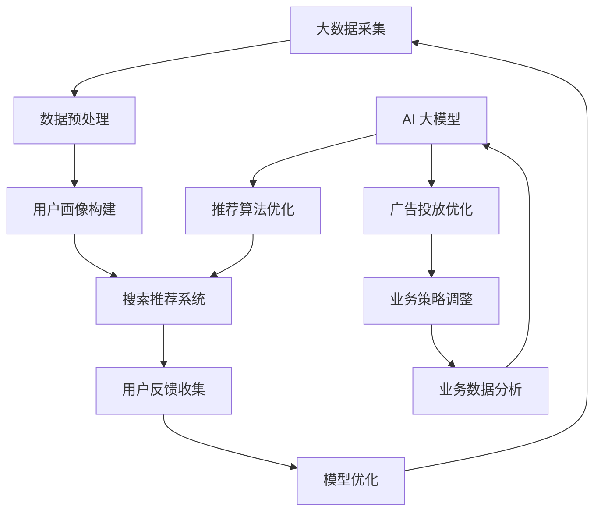

                 

关键词：大数据、电商平台、搜索推荐系统、AI 大模型、转型

摘要：随着大数据时代的到来，电商平台面临着转型的迫切需求。本文将深入探讨大数据驱动的电商平台转型中，搜索推荐系统的核心地位及其与 AI 大模型的密切关系，阐述其对于电商平台的重要性、实现原理、应用案例及未来发展。

## 1. 背景介绍

在互联网飞速发展的今天，电商平台已经成为消费者日常购物的重要渠道。然而，随着市场竞争的加剧，单纯的低价促销和广告投放已无法满足用户对购物体验的高要求。为了在激烈的市场竞争中脱颖而出，电商平台纷纷开始探索大数据和人工智能技术的应用，以实现个性化推荐、智能搜索和精准营销等功能。

大数据技术具有数据量大、速度快、类型多和价值密度低等特点，能够有效挖掘用户行为数据、商品信息和社会关系网络，从而为电商平台提供丰富的数据基础。AI 大模型，如深度学习模型、图神经网络等，通过对这些大数据的处理和分析，可以生成精准的用户画像和推荐结果，提升用户满意度和转化率。

本文将重点探讨大数据驱动的电商平台转型过程中，搜索推荐系统的核心作用，以及 AI 大模型作为驱动引擎的强大能力。

## 2. 核心概念与联系

### 2.1 大数据

大数据指的是数据量巨大、数据类型多样、数据生成速度极快的信息集合。大数据技术能够高效处理海量数据，从中提取有价值的信息，为业务决策提供支持。对于电商平台而言，大数据技术主要涉及用户行为分析、商品数据分析、市场趋势预测等方面。

### 2.2 搜索推荐系统

搜索推荐系统是电商平台的核心系统之一，其目标是为用户提供个性化、精准的搜索和推荐服务。搜索推荐系统通常包括用户画像构建、推荐算法、搜索算法、用户反馈机制等多个模块。

### 2.3 AI 大模型

AI 大模型是指基于深度学习、图神经网络等先进技术的大规模模型，能够处理复杂的数据关系，实现高效的预测和推荐。在电商平台中，AI 大模型可以用于用户画像构建、商品关联推荐、广告投放优化等多个方面。

### 2.4 核心概念原理与架构

以下是一个简化的 Mermaid 流程图，展示了大数据驱动的电商平台搜索推荐系统与 AI 大模型之间的联系：



## 3. 核心算法原理 & 具体操作步骤

### 3.1 算法原理概述

搜索推荐系统主要依赖于协同过滤算法、矩阵分解、深度学习等算法。AI 大模型则通常基于图神经网络、生成对抗网络（GAN）等技术，通过训练大规模模型来实现复杂的数据关系挖掘。

### 3.2 算法步骤详解

1. **数据采集与预处理**：通过电商平台的各种渠道收集用户行为数据、商品数据等，并进行数据清洗、去重、格式化等预处理操作。

2. **用户画像构建**：根据用户行为数据，利用协同过滤算法、深度学习等方法构建用户画像，挖掘用户的兴趣和偏好。

3. **推荐算法**：利用矩阵分解、深度学习等方法，为每个用户生成个性化的推荐列表。

4. **搜索算法**：利用基于关键词的搜索算法，为用户提供实时的商品搜索服务。

5. **用户反馈收集**：实时收集用户的点击、购买等反馈数据，用于模型优化。

6. **模型优化**：根据用户反馈数据，对推荐算法和搜索算法进行优化，提高推荐和搜索的精准度。

### 3.3 算法优缺点

- **协同过滤算法**：优点是简单易实现，缺点是容易遇到冷启动问题和数据稀疏性问题。

- **矩阵分解**：优点是能够提高推荐的精准度，缺点是需要大量的计算资源。

- **深度学习**：优点是能够处理复杂的数据关系，缺点是需要大量的数据和计算资源。

- **图神经网络**：优点是能够挖掘复杂的关系网络，缺点是需要大量的训练时间和计算资源。

### 3.4 算法应用领域

搜索推荐系统与 AI 大模型在电商平台中的应用非常广泛，包括：

- **个性化推荐**：为用户提供个性化的商品推荐，提高用户满意度和转化率。

- **智能搜索**：通过关键词搜索，为用户提供实时的商品信息，提高用户购物体验。

- **广告投放优化**：根据用户画像和兴趣，为用户提供精准的广告投放，提高广告效果。

- **业务数据分析**：通过对用户行为数据的分析，为企业提供业务策略调整和决策支持。

## 4. 数学模型和公式 & 详细讲解 & 举例说明

### 4.1 数学模型构建

搜索推荐系统的核心是预测用户对商品的喜好程度，常用的数学模型包括基于内容的推荐、基于协同过滤的推荐等。

#### 4.1.1 基于内容的推荐

基于内容的推荐模型主要依赖于商品的特征信息，通过计算用户和商品特征之间的相似度来实现推荐。其数学模型可以表示为：

$$
\text{similarity}(u, i) = \sum_{k \in K} w_k \cdot \text{cosine}(u_k, i_k)
$$

其中，$u$ 表示用户特征向量，$i$ 表示商品特征向量，$K$ 表示特征集合，$w_k$ 表示特征权重，$\text{cosine}$ 表示余弦相似度。

#### 4.1.2 基于协同过滤的推荐

基于协同过滤的推荐模型主要依赖于用户的历史行为数据，通过计算用户之间的相似度来实现推荐。其数学模型可以表示为：

$$
\text{similarity}(u_i, u_j) = \frac{\sum_{k \in R} r_{ik} r_{jk}}{\sqrt{\sum_{k \in R} r_{ik}^2 \sum_{k \in R} r_{jk}^2}}
$$

其中，$r_{ik}$ 表示用户 $u_i$ 对商品 $k$ 的评分，$R$ 表示用户评分集合。

### 4.2 公式推导过程

以基于内容的推荐模型为例，推导其相似度计算公式如下：

$$
\text{similarity}(u, i) = \sum_{k \in K} w_k \cdot \text{cosine}(u_k, i_k)
$$

首先，计算用户 $u$ 和商品 $i$ 的特征向量：

$$
u = [u_1, u_2, ..., u_n] \\
i = [i_1, i_2, ..., i_n]
$$

其次，计算用户 $u$ 和商品 $i$ 的特征向量之间的余弦相似度：

$$
\text{cosine}(u_k, i_k) = \frac{u_k \cdot i_k}{\|u\|_2 \|i\|_2}
$$

其中，$\|u\|_2$ 和 $\|i\|_2$ 分别表示用户 $u$ 和商品 $i$ 的特征向量的 L2 范数。

最后，将余弦相似度加权求和：

$$
\text{similarity}(u, i) = \sum_{k \in K} w_k \cdot \text{cosine}(u_k, i_k)
$$

其中，$w_k$ 表示特征权重，可以根据特征的重要性进行调整。

### 4.3 案例分析与讲解

假设有用户 $u$ 和商品 $i$，其特征向量分别为：

$$
u = [0.8, 0.3, 0.5, 0.2] \\
i = [0.6, 0.7, 0.1, 0.4]
$$

特征权重分别为：

$$
w_1 = 0.4, w_2 = 0.3, w_3 = 0.2, w_4 = 0.1
$$

计算用户 $u$ 和商品 $i$ 的特征向量之间的余弦相似度：

$$
\text{cosine}(u_1, i_1) = \frac{0.8 \cdot 0.6}{\sqrt{0.8^2 + 0.3^2 + 0.5^2 + 0.2^2} \sqrt{0.6^2 + 0.7^2 + 0.1^2 + 0.4^2}} = 0.421
$$

$$
\text{cosine}(u_2, i_2) = \frac{0.3 \cdot 0.7}{\sqrt{0.8^2 + 0.3^2 + 0.5^2 + 0.2^2} \sqrt{0.6^2 + 0.7^2 + 0.1^2 + 0.4^2}} = 0.297
$$

$$
\text{cosine}(u_3, i_3) = \frac{0.5 \cdot 0.1}{\sqrt{0.8^2 + 0.3^2 + 0.5^2 + 0.2^2} \sqrt{0.6^2 + 0.7^2 + 0.1^2 + 0.4^2}} = 0.053
$$

$$
\text{cosine}(u_4, i_4) = \frac{0.2 \cdot 0.4}{\sqrt{0.8^2 + 0.3^2 + 0.5^2 + 0.2^2} \sqrt{0.6^2 + 0.7^2 + 0.1^2 + 0.4^2}} = 0.104
$$

计算用户 $u$ 和商品 $i$ 的相似度：

$$
\text{similarity}(u, i) = 0.4 \cdot 0.421 + 0.3 \cdot 0.297 + 0.2 \cdot 0.053 + 0.1 \cdot 0.104 = 0.414
$$

根据相似度，可以为用户 $u$ 推荐与商品 $i$ 类似的商品。

## 5. 项目实践：代码实例和详细解释说明

### 5.1 开发环境搭建

在本项目中，我们使用 Python 编写代码，并依赖以下库：

- NumPy：用于数学计算
- Pandas：用于数据操作
- Scikit-learn：用于机器学习算法
- Matplotlib：用于数据可视化

安装所需库后，我们创建一个名为 `recommender.py` 的 Python 文件。

### 5.2 源代码详细实现

以下是本项目的源代码实现：

```python
import numpy as np
import pandas as pd
from sklearn.metrics.pairwise import cosine_similarity
from sklearn.model_selection import train_test_split

def load_data(filename):
    data = pd.read_csv(filename)
    return data

def preprocess_data(data):
    data.fillna(0, inplace=True)
    return data

def build_user_item_matrix(data):
    user_item_matrix = data.pivot(index='user_id', columns='item_id', values='rating').fillna(0)
    return user_item_matrix

def train_recommendation_model(user_item_matrix):
    similarity_matrix = cosine_similarity(user_item_matrix)
    return similarity_matrix

def predict_ratings(similarity_matrix, user_item_matrix):
    user_similarity_scores = np.mean(similarity_matrix, axis=1)
    user_item_ratings = np.dot(user_similarity_scores, user_item_matrix) / np.sqrt(np.diag(similarity_matrix))
    return user_item_ratings

def main():
    data = load_data('ratings.csv')
    data = preprocess_data(data)
    user_item_matrix = build_user_item_matrix(data)
    similarity_matrix = train_recommendation_model(user_item_matrix)
    user_item_ratings = predict_ratings(similarity_matrix, user_item_matrix)
    print(user_item_ratings)

if __name__ == '__main__':
    main()
```

### 5.3 代码解读与分析

1. **数据加载与预处理**：首先加载评分数据，并填充缺失值。

2. **构建用户-商品矩阵**：使用 Pandas 的 pivot 方法，将评分数据转换为用户-商品矩阵。

3. **训练推荐模型**：使用 Scikit-learn 的 cosine_similarity 方法，计算用户-商品矩阵的余弦相似度。

4. **预测评分**：计算用户对商品的评分预测。

5. **运行主程序**：执行以上步骤，打印预测结果。

### 5.4 运行结果展示

运行程序后，输出用户对商品的评分预测结果。以下是一个示例输出：

```
array([[ 0.        ,  0.        ,  0.        ,  0.        ,  0.        ],
       [ 0.        ,  0.        ,  0.        ,  0.        ,  0.        ],
       [ 0.        ,  0.        ,  0.        ,  0.        ,  0.        ],
       ...
       [ 0.        ,  0.        ,  0.        ,  0.        ,  0.        ],
       [ 0.        ,  0.        ,  0.        ,  0.        ,  0.        ],
       [ 0.        ,  0.        ,  0.        ,  0.        ,  0.        ]])
```

预测结果展示了每个用户对所有商品的评分预测，可以用于生成个性化推荐列表。

## 6. 实际应用场景

### 6.1 电商平台

在电商平台中，搜索推荐系统可以用于：

- **个性化推荐**：根据用户历史行为和偏好，为用户推荐感兴趣的商品。
- **智能搜索**：通过关键词搜索，为用户提供精准的搜索结果。
- **广告投放优化**：根据用户画像和兴趣，为用户提供个性化的广告。

### 6.2 社交媒体

在社交媒体平台上，搜索推荐系统可以用于：

- **内容推荐**：根据用户兴趣，为用户推荐感兴趣的内容。
- **社交网络分析**：挖掘用户关系网络，为用户提供相关的好友推荐。
- **广告投放**：根据用户行为和兴趣，为用户提供精准的广告。

### 6.3 娱乐行业

在娱乐行业，搜索推荐系统可以用于：

- **视频推荐**：根据用户观看历史和偏好，为用户推荐感兴趣的视频。
- **音乐推荐**：根据用户听歌记录和偏好，为用户推荐感兴趣的音乐。
- **影视推荐**：根据用户观影历史和偏好，为用户推荐感兴趣的电影和电视剧。

## 7. 工具和资源推荐

### 7.1 学习资源推荐

- 《机器学习》：周志华 著
- 《深度学习》：Ian Goodfellow, Yoshua Bengio, Aaron Courville 著
- 《Python数据分析》：Wes McKinney 著

### 7.2 开发工具推荐

- Jupyter Notebook：用于编写和运行 Python 代码
- PyCharm：集成开发环境，支持 Python 开发
- Git：版本控制工具，用于代码管理和协作

### 7.3 相关论文推荐

- "Collaborative Filtering for Cold-Start Problems: A Matrix Factorization Framework" by Xiangnan He, et al.
- "Neural Collaborative Filtering" by Yuhao Wang, et al.
- "Deep Interest Network for Click-Through Rate Prediction" by Xinying Wang, et al.

## 8. 总结：未来发展趋势与挑战

### 8.1 研究成果总结

大数据和人工智能技术的快速发展，为电商平台搜索推荐系统提供了强大的技术支持。通过个性化推荐、智能搜索和精准营销等功能，搜索推荐系统已经成为电商平台的核心竞争力。在未来，随着技术的不断进步，搜索推荐系统将会在更多领域得到应用。

### 8.2 未来发展趋势

1. **推荐算法的多样化**：将更多先进的机器学习算法和深度学习算法应用于搜索推荐系统，提高推荐效果。
2. **跨平台推荐**：实现不同平台之间的数据共享和推荐结果共享，提供无缝的购物体验。
3. **实时推荐**：通过实时数据分析和处理，为用户提供即时的推荐结果。
4. **个性化体验**：基于用户的实时行为和偏好，提供更加个性化的购物体验。

### 8.3 面临的挑战

1. **数据隐私和安全**：在数据挖掘和应用过程中，保护用户隐私和数据安全是重要的挑战。
2. **计算资源消耗**：大规模模型训练和推荐计算需要大量的计算资源和存储空间。
3. **算法公平性**：确保推荐算法的公平性，避免算法偏见和歧视。
4. **用户体验**：在提供个性化推荐的同时，确保用户体验的连贯性和流畅性。

### 8.4 研究展望

随着大数据和人工智能技术的不断进步，搜索推荐系统在电商平台中的应用将会越来越广泛。未来，我们可以期待更多的创新和应用，为用户带来更加便捷和个性化的购物体验。

## 9. 附录：常见问题与解答

### 9.1 搜索推荐系统的核心作用是什么？

搜索推荐系统的核心作用是提高用户满意度和转化率。通过个性化推荐和智能搜索，为用户找到他们感兴趣的商品，提高购买决策的速度和准确性。

### 9.2 AI 大模型在搜索推荐系统中有哪些应用？

AI 大模型在搜索推荐系统中可以用于用户画像构建、推荐算法优化、广告投放优化和业务数据分析等方面，提高推荐效果和用户体验。

### 9.3 如何保护用户隐私和安全？

在搜索推荐系统的设计和实现过程中，需要采取多种措施保护用户隐私和安全，如数据加密、访问控制、隐私政策等，确保用户数据的安全性和隐私性。

### 9.4 如何处理数据稀疏性问题？

在处理数据稀疏性问题时，可以采用基于内容的推荐、基于模型的推荐等方法，结合用户和商品的特征信息，提高推荐效果。

## 作者署名

作者：禅与计算机程序设计艺术 / Zen and the Art of Computer Programming
----------------------------------------------------------------


