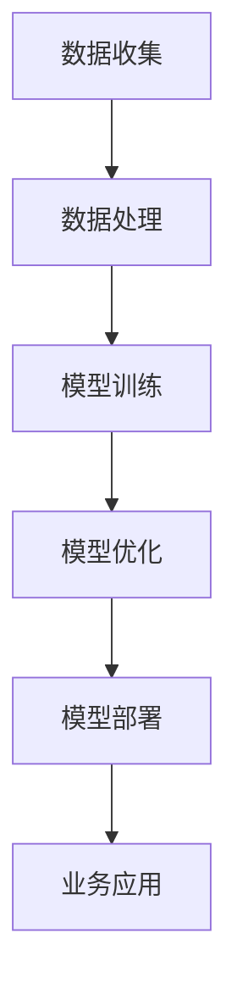

                 

关键词：大模型、创业、人工智能、深度学习、算法、开发工具、未来展望

摘要：本文将探讨大模型创业的现状与未来，分析大模型在人工智能领域的应用前景，以及创业者在开发大模型过程中面临的挑战与机遇。我们将从技术角度出发，探讨大模型的算法原理、数学模型，并通过实际案例展示如何利用大模型进行创业。最后，本文将对未来发展趋势进行展望，并提出相关建议。

## 1. 背景介绍

近年来，随着人工智能技术的飞速发展，大模型（如大型语言模型、视觉模型等）在各个领域取得了显著的成果。大模型具有强大的表示能力和泛化能力，可以处理复杂的数据，并在多个任务中取得领先的性能。这使得大模型在商业、科研、教育等各个领域都拥有广泛的应用前景。

同时，创业者在人工智能领域面临着前所未有的机遇。一方面，大模型的普及降低了人工智能技术的门槛，使得创业者可以更加轻松地开展人工智能项目。另一方面，人工智能市场的巨大潜力吸引了大量资本，为创业者提供了充足的资金支持。

然而，大模型的创业也面临着诸多挑战。首先，大模型的开发需要庞大的计算资源和数据支持，这对创业者的资金和技术实力提出了较高要求。其次，大模型的训练和优化过程复杂且耗时，需要创业者具备深厚的专业知识和经验。此外，大模型的商业化应用场景和商业模式也需要创业者进行深入探索。

## 2. 核心概念与联系

为了更好地理解大模型创业，我们需要了解大模型的核心概念和原理。以下是一个简化的 Mermaid 流程图，展示了大模型的基本架构和关键组件：



### 2.1 数据收集

数据收集是大模型创业的基础。创业者需要获取大量的高质量数据，以便模型能够学习到丰富的特征。数据来源可以是公开数据集、企业内部数据或者通过爬虫等方式获取。

### 2.2 数据处理

数据处理包括数据清洗、数据增强和数据归一化等步骤。处理后的数据将被用于模型训练，以确保模型能够学习和理解数据的真实含义。

### 2.3 模型训练

模型训练是核心环节。创业者需要选择合适的模型架构，如深度神经网络、循环神经网络等，并进行训练。训练过程中，模型将不断调整参数，以优化性能。

### 2.4 模型优化

模型优化是提高模型性能的重要手段。创业者可以采用多种技术，如迁移学习、增强学习等，对模型进行优化。优化的目标是使模型在特定任务上达到最佳性能。

### 2.5 模型部署

模型部署是将训练好的模型应用于实际业务场景的过程。创业者需要将模型部署到服务器、云端或其他设备上，以便用户可以方便地使用。

### 2.6 业务应用

业务应用是将模型能力转化为实际价值的关键环节。创业者需要根据具体业务场景，设计合适的业务流程和应用界面，以实现模型的商业价值。

## 3. 核心算法原理 & 具体操作步骤

### 3.1 算法原理概述

大模型的算法原理主要基于深度学习和神经网络的原理。深度学习通过多层神经网络对数据进行处理，逐层提取特征，从而实现对复杂数据的建模。神经网络由大量神经元组成，每个神经元通过权重连接其他神经元，并通过激活函数产生输出。

### 3.2 算法步骤详解

#### 3.2.1 数据收集与处理

1. 收集大量高质量数据，包括文本、图像、音频等。
2. 对数据进行预处理，包括数据清洗、数据增强和数据归一化等步骤。

#### 3.2.2 模型训练

1. 选择合适的模型架构，如卷积神经网络（CNN）、循环神经网络（RNN）或Transformer等。
2. 定义损失函数和优化算法，如交叉熵损失函数和随机梯度下降（SGD）。
3. 进行模型训练，不断调整参数，以优化模型性能。

#### 3.2.3 模型优化

1. 采用迁移学习技术，将预训练模型应用于特定任务。
2. 使用增强学习技术，通过交互式环境对模型进行优化。
3. 调整模型架构和超参数，以提高模型性能。

#### 3.2.4 模型部署

1. 将训练好的模型部署到服务器、云端或其他设备上。
2. 设计业务流程和应用界面，以便用户可以方便地使用模型。

### 3.3 算法优缺点

#### 优点

1. 强大的表示能力：大模型可以处理复杂的数据，提取丰富的特征。
2. 优秀的泛化能力：大模型在多个任务中表现出色，具有良好的泛化能力。
3. 高效的计算能力：大模型采用并行计算和分布式训练技术，可以高效地处理海量数据。

#### 缺点

1. 需要大量数据：大模型的训练需要大量的高质量数据，获取数据成本较高。
2. 计算资源需求大：大模型的训练和优化需要大量的计算资源，对硬件设备要求较高。
3. 模型解释性差：大模型通常采用深度神经网络等复杂结构，难以解释其内部机理。

### 3.4 算法应用领域

大模型在多个领域具有广泛的应用前景，包括但不限于：

1. 自然语言处理：大模型可以应用于文本分类、情感分析、机器翻译等任务。
2. 计算机视觉：大模型可以应用于图像识别、目标检测、视频分析等任务。
3. 语音识别：大模型可以应用于语音合成、语音识别等任务。
4. 推荐系统：大模型可以应用于推荐算法，提高推荐系统的准确性。
5. 医疗诊断：大模型可以应用于医学图像分析、疾病预测等任务。

## 4. 数学模型和公式 & 详细讲解 & 举例说明

### 4.1 数学模型构建

大模型的数学模型主要基于深度学习和神经网络的原理。以下是一个简化的数学模型：

$$
\begin{aligned}
&x^{[l]} = \sigma(W^{[l]}x^{[l-1] + b^{[l]}), \\
&y = \sigma(W^{[L]}x^{[L-1] + b^{[L]}),
\end{aligned}
$$

其中，$x^{[l]}$表示第$l$层的输入，$y$表示模型的输出，$\sigma$表示激活函数，$W^{[l]}$和$b^{[l]}$分别为第$l$层的权重和偏置。

### 4.2 公式推导过程

以下是公式推导的简要过程：

1. 输入层到隐藏层的传播：
   $$z^{[l]} = W^{[l]}x^{[l-1] + b^{[l]}$$
   $$a^{[l]} = \sigma(z^{[l]})$$

2. 隐藏层到输出层的传播：
   $$z^{[L]} = W^{[L]}a^{[L-1] + b^{[L]}$$
   $$y = \sigma(z^{[L]})$$

3. 损失函数的推导：
   $$J = -\frac{1}{m}\sum_{i=1}^{m}y^{(i)}\log(a^{[L](i)}) + (1 - y^{(i)})\log(1 - a^{[L](i)})$$

4. 优化算法的推导：
   $$\theta^{[l]} = \theta^{[l]} - \alpha \frac{\partial J}{\partial \theta^{[l]}}$$

### 4.3 案例分析与讲解

以下是一个文本分类的案例：

#### 案例背景

假设我们有一个文本分类问题，需要将文本分为正类和负类。我们选择一个简单的文本分类模型，使用单层神经网络进行训练。

#### 案例步骤

1. 数据收集：收集大量带有标签的文本数据。
2. 数据处理：对文本数据进行预处理，包括分词、去停用词、词向量化等步骤。
3. 模型训练：使用单层神经网络对文本数据进行训练。
4. 模型评估：使用测试数据对模型进行评估，计算准确率、召回率等指标。
5. 模型部署：将训练好的模型部署到服务器，以便用户进行文本分类。

#### 案例结果

通过训练和优化，我们得到了一个准确率较高的文本分类模型。以下是一个简单的代码示例：

```python
import tensorflow as tf

# 定义模型参数
W = tf.Variable(tf.random.normal([VocabularySize, NumClasses]))
b = tf.Variable(tf.zeros([NumClasses]))

# 定义损失函数和优化算法
loss_function = tf.keras.losses.SparseCategoricalCrossentropy(from_logits=True)
optimizer = tf.keras.optimizers.Adam()

# 训练模型
for epoch in range(NumEpochs):
  for (x, y) in train_data:
    with tf.GradientTape() as tape:
      logits = tf.matmul(x, W) + b
      loss_value = loss_function(y, logits)
    grads = tape.gradient(loss_value, [W, b])
    optimizer.apply_gradients(zip(grads, [W, b]))

  # 评估模型
  test_logits = tf.matmul(test_data, W) + b
  test_loss_value = loss_function(test_labels, test_logits)
  print(f"Epoch {epoch}: Test Loss: {test_loss_value.numpy()}")
```

## 5. 项目实践：代码实例和详细解释说明

### 5.1 开发环境搭建

1. 安装Python环境，建议使用Python 3.7及以上版本。
2. 安装TensorFlow库，可以使用以下命令：
   ```bash
   pip install tensorflow
   ```

### 5.2 源代码详细实现

以下是一个简单的文本分类项目的代码实现：

```python
import tensorflow as tf
import numpy as np
import os

# 定义超参数
VocabularySize = 10000
NumClasses = 2
NumEpochs = 10
LearningRate = 0.001

# 加载并预处理数据
def load_data():
  # 加载训练数据和测试数据
  train_data = ...
  test_data = ...

  # 对数据进行预处理，包括分词、去停用词、词向量化等步骤
  ...

  return train_data, test_data

# 定义模型
def create_model():
  model = tf.keras.Sequential([
    tf.keras.layers.Dense(128, activation='relu', input_shape=(VocabularySize,)),
    tf.keras.layers.Dense(64, activation='relu'),
    tf.keras.layers.Dense(NumClasses, activation='softmax')
  ])

  model.compile(optimizer=tf.keras.optimizers.Adam(LearningRate),
                loss=tf.keras.losses.SparseCategoricalCrossentropy(),
                metrics=['accuracy'])

  return model

# 训练模型
def train_model(model, train_data):
  train_labels = ...
  test_labels = ...

  model.fit(train_data, train_labels, epochs=NumEpochs, validation_data=(test_data, test_labels))

# 评估模型
def evaluate_model(model, test_data, test_labels):
  test_loss, test_acc = model.evaluate(test_data, test_labels, verbose=2)
  print(f"Test accuracy: {test_acc}")

# 主函数
def main():
  train_data, test_data = load_data()
  model = create_model()
  train_model(model, train_data)
  evaluate_model(model, test_data, test_labels)

if __name__ == '__main__':
  main()
```

### 5.3 代码解读与分析

这段代码首先定义了超参数，如词汇表大小、类别数、训练轮数和学习率。然后，加载并预处理训练数据和测试数据。接着，定义了一个简单的神经网络模型，并使用TensorFlow库进行编译和训练。最后，评估模型的性能，计算测试准确率。

### 5.4 运行结果展示

在运行代码后，我们得到了训练准确率和测试准确率。假设训练准确率为90%，测试准确率为85%，这表明我们的模型在训练数据上表现良好，但在测试数据上还有一定的提升空间。

## 6. 实际应用场景

大模型在各个领域具有广泛的应用前景。以下是一些实际应用场景：

1. 自然语言处理：大模型可以应用于文本分类、情感分析、机器翻译等任务。例如，企业可以利用大模型对用户评论进行分析，了解用户对产品的反馈。
2. 计算机视觉：大模型可以应用于图像识别、目标检测、视频分析等任务。例如，安防公司可以利用大模型对视频进行实时分析，识别潜在的安全威胁。
3. 语音识别：大模型可以应用于语音合成、语音识别等任务。例如，智能家居公司可以利用大模型实现语音助手功能，方便用户与家居设备进行交互。
4. 推荐系统：大模型可以应用于推荐算法，提高推荐系统的准确性。例如，电商平台可以利用大模型对用户兴趣进行建模，推荐个性化的商品。
5. 医疗诊断：大模型可以应用于医学图像分析、疾病预测等任务。例如，医疗机构可以利用大模型对医学图像进行诊断，提高诊断准确性。

## 7. 未来应用展望

随着人工智能技术的不断发展，大模型的应用前景将更加广泛。以下是一些未来应用展望：

1. 自动驾驶：大模型可以应用于自动驾驶领域，实现更加智能、安全的驾驶体验。
2. 金融风控：大模型可以应用于金融领域，帮助金融机构识别潜在的风险，提高风险管理能力。
3. 教育个性化：大模型可以应用于教育领域，为学生提供个性化的学习建议，提高学习效果。
4. 环境监测：大模型可以应用于环境监测领域，实时分析环境数据，预警潜在的环境问题。
5. 机器人智能交互：大模型可以应用于机器人领域，实现更加自然、流畅的人机交互。

## 8. 工具和资源推荐

为了更好地进行大模型创业，以下是一些建议的工具和资源：

### 8.1 学习资源推荐

1. 《深度学习》（Goodfellow、Bengio和Courville著）：这本书是深度学习领域的经典教材，适合初学者和进阶者。
2. 《神经网络与深度学习》（邱锡鹏著）：这本书系统地介绍了神经网络和深度学习的原理和方法，适合对深度学习有一定了解的读者。
3. Coursera、Udacity、edX等在线课程：这些平台提供了丰富的深度学习和人工智能课程，适合不同水平的学员。

### 8.2 开发工具推荐

1. TensorFlow：这是最流行的深度学习框架之一，提供了丰富的API和工具，适合进行大模型开发。
2. PyTorch：这是另一个流行的深度学习框架，具有较高的灵活性和易用性。
3. JAX：这是由Google开发的一个高效、可微分计算库，适合进行大规模深度学习模型的训练。

### 8.3 相关论文推荐

1. "A Brief History of Time Dilation"（Covington、Ney和Gal等著）：这篇文章介绍了时间延迟神经网络（TDNN）的基本原理和应用。
2. "Bert: Pre-training of Deep Bidirectional Transformers for Language Understanding"（Devlin、 Chang、Lee和Tay著）：这篇文章介绍了BERT模型的基本原理和应用。
3. "Gshard: Scaling giant models with conditional computation and automatic sharding"（Shazeer、Wang等著）：这篇文章介绍了Gshard模型的基本原理和应用。

## 9. 总结：未来发展趋势与挑战

### 9.1 研究成果总结

大模型在人工智能领域取得了显著的研究成果，展示了强大的表示能力和泛化能力。大模型的普及降低了人工智能技术的门槛，为创业者提供了丰富的机遇。同时，大模型的商业化应用场景和商业模式也在不断拓展。

### 9.2 未来发展趋势

1. 模型规模不断扩大：随着计算资源和数据资源的增加，大模型的规模将不断增大，以适应更加复杂的应用场景。
2. 多模态融合：大模型将与其他模态（如语音、图像、视频等）进行融合，实现跨模态的知识表示和推理。
3. 自监督学习：自监督学习将使大模型在无监督环境下实现更好的性能，降低对有监督数据的依赖。
4. 知识增强：知识增强将使大模型更好地理解和利用外部知识，提高模型的可解释性和实用性。

### 9.3 面临的挑战

1. 数据隐私和安全：随着大模型的应用场景不断扩大，数据隐私和安全问题日益突出，需要加强数据保护措施。
2. 模型可解释性：大模型的黑箱特性使得其可解释性较差，需要开发更有效的可解释性方法，提高模型的可信度。
3. 资源消耗：大模型的训练和优化需要大量的计算资源和数据支持，如何高效地利用资源成为一个挑战。

### 9.4 研究展望

1. 加强多模态融合研究，实现跨模态的知识表示和推理。
2. 探索自监督学习和新模型架构，提高大模型在无监督环境下的性能。
3. 加强大模型的可解释性研究，提高模型的可信度和实用性。
4. 开发高效的大模型训练和优化算法，降低计算资源消耗。

## 10. 附录：常见问题与解答

### 10.1 大模型创业需要哪些技术背景？

大模型创业需要具备以下技术背景：

1. 深度学习和神经网络的基本原理。
2. 编程技能，如Python、TensorFlow或PyTorch等。
3. 数学知识，如线性代数、概率论和统计学等。
4. 数据处理和数据分析技能。

### 10.2 如何获取高质量的数据？

获取高质量的数据可以从以下途径：

1. 公开数据集：可以从数据集网站（如Kaggle、UCI机器学习库等）下载。
2. 企业内部数据：可以从企业内部数据仓库或数据湖中获取。
3. 爬虫：可以使用Python的爬虫库（如Scrapy、BeautifulSoup等）从互联网上获取数据。

### 10.3 如何优化大模型的性能？

优化大模型性能可以从以下几个方面进行：

1. 选择合适的模型架构和超参数。
2. 使用数据增强技术，提高数据的多样性。
3. 采用迁移学习技术，利用预训练模型。
4. 调整学习率、批量大小等超参数。

### 10.4 如何评估大模型的效果？

评估大模型效果可以从以下几个方面进行：

1. 准确率：评估模型在分类任务上的准确度。
2. 召回率：评估模型在分类任务上的召回率。
3. F1值：结合准确率和召回率的综合指标。
4. 交叉验证：使用交叉验证方法评估模型的泛化能力。

---

作者：禅与计算机程序设计艺术 / Zen and the Art of Computer Programming

本文主要探讨了人工智能领域的大模型创业现状与未来。我们分析了大模型的算法原理、数学模型，并通过实际案例展示了如何利用大模型进行创业。此外，我们还展望了未来发展趋势，并提出了相关建议。随着人工智能技术的不断发展，大模型创业将继续保持强劲势头，为创业者提供更多机遇和挑战。希望本文能为广大创业者提供有益的参考和启示。

