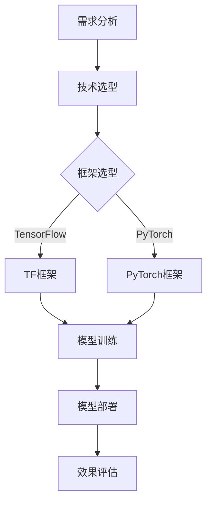

                 

关键词：大模型创业、技术选型、架构设计、算法优化、实践案例、未来展望

> 摘要：本文将探讨大模型创业的最佳选择，包括技术选型、架构设计、算法优化等方面。通过分析现有技术和市场需求，提供一套完整的创业指南，帮助创业者整装待发，迎接挑战。

## 1. 背景介绍

随着人工智能技术的迅猛发展，大模型（如GPT、BERT等）已经成为众多领域的重要工具。这些模型不仅在自然语言处理、计算机视觉、语音识别等方面取得了显著的成果，也为创业者提供了丰富的机遇。然而，如何选择合适的技术路径，设计高效稳定的系统架构，优化算法性能，成为大模型创业成功的关键。

本文将结合国内外大模型创业案例，探讨以下问题：

- 大模型创业面临的技术挑战和市场需求；
- 如何进行技术选型，选择合适的大模型框架和算法；
- 如何设计高效稳定的系统架构，保证模型的训练和部署效率；
- 如何进行算法优化，提升模型性能和效果；
- 大模型创业的未来发展趋势和面临的挑战。

## 2. 核心概念与联系

### 2.1 大模型框架

大模型框架是指用于构建、训练和部署大规模深度学习模型的工具集合。目前，主流的大模型框架包括TensorFlow、PyTorch、MXNet等。这些框架提供了丰富的API和工具，使得开发者可以方便地实现各种深度学习算法。

### 2.2 算法选型

算法选型是指在特定应用场景下，选择适合的算法模型。在大模型创业中，算法选型至关重要。常见的算法包括卷积神经网络（CNN）、循环神经网络（RNN）、长短时记忆网络（LSTM）、变换器（Transformer）等。每种算法都有其适用范围和优缺点，需要根据具体需求进行选择。

### 2.3 架构设计

架构设计是指构建系统时，对整体结构、模块划分、通信机制等方面进行规划和设计。在大模型创业中，架构设计需要考虑以下几个方面：

- 分布式计算：如何将大规模数据分布在多台服务器上进行并行处理；
- 模型训练：如何设计训练策略，保证模型训练的效率和稳定性；
- 模型部署：如何将训练好的模型部署到生产环境，实现实时推理和预测。

## 2.4 Mermaid 流程图

以下是一个简单的Mermaid流程图，展示了大模型创业的关键环节：



## 3. 核心算法原理 & 具体操作步骤

### 3.1 算法原理概述

大模型创业的核心算法主要包括深度学习算法和优化算法。深度学习算法是指通过多层的神经网络对数据进行自动特征提取和模式识别。优化算法则用于调整网络参数，提高模型性能。

### 3.2 算法步骤详解

#### 3.2.1 深度学习算法

1. 数据预处理：对原始数据进行清洗、归一化等处理，使其符合模型输入要求；
2. 网络搭建：根据应用场景选择合适的神经网络结构，如CNN、RNN、Transformer等；
3. 模型训练：通过迭代优化网络参数，使模型在训练数据上达到较好的性能；
4. 模型评估：在验证集上评估模型性能，调整超参数，确保模型泛化能力。

#### 3.2.2 优化算法

1. 动量法（Momentum）：通过引入动量项，加速收敛速度；
2. 伪随机梯度下降（SGD）：通过随机梯度下降更新模型参数；
3. Adam优化器：结合SGD和动量法，同时考虑梯度的一阶和二阶统计特性。

### 3.3 算法优缺点

- **深度学习算法**：
  - 优点：强大的特征提取能力，适用于复杂任务；
  - 缺点：训练过程复杂，参数调优困难，对计算资源要求较高。

- **优化算法**：
  - 优点：收敛速度快，计算效率高；
  - 缺点：在某些场景下，收敛效果不如传统优化算法。

### 3.4 算法应用领域

- 自然语言处理：如机器翻译、文本分类、问答系统等；
- 计算机视觉：如图像识别、目标检测、人脸识别等；
- 语音识别：如语音合成、说话人识别、语音识别等。

## 4. 数学模型和公式 & 详细讲解 & 举例说明

### 4.1 数学模型构建

在深度学习中，数学模型构建的核心是定义前向传播和反向传播过程。以下是一个简单的全连接神经网络（FCNN）的前向传播和反向传播公式：

#### 4.1.1 前向传播

$$
Z = X \cdot W + b \\
A = \sigma(Z)
$$

其中，$X$为输入数据，$W$为权重矩阵，$b$为偏置项，$\sigma$为激活函数，$A$为输出。

#### 4.1.2 反向传播

$$
\begin{aligned}
\delta_A &= (A - Y) \cdot \sigma'(Z) \\
\delta_W &= X \cdot \delta_A \\
\delta_b &= \delta_A \\
W &= W - \alpha \cdot \delta_W \\
b &= b - \alpha \cdot \delta_b
\end{aligned}
$$

其中，$Y$为真实标签，$\sigma'$为激活函数的导数，$\alpha$为学习率。

### 4.2 公式推导过程

#### 4.2.1 前向传播

以一个简单的单层全连接神经网络为例，输入层、隐藏层和输出层的节点数分别为$1$、$2$、$1$。定义输入数据为$x_1$，隐藏层权重为$W_{12}$，输出层权重为$W_{21}$，偏置分别为$b_{12}$和$b_{21}$。激活函数选用ReLU。

$$
Z_2 = \max(0, x_1 \cdot W_{12} + b_{12}) \\
A_2 = Z_2 \cdot W_{21} + b_{21}
$$

#### 4.2.2 反向传播

$$
\begin{aligned}
\delta_{A_2} &= (A_2 - y) \cdot \sigma'(Z_2) \\
\delta_{W_{21}} &= x_1 \cdot \delta_{A_2} \\
\delta_{b_{21}} &= \delta_{A_2} \\
W_{21} &= W_{21} - \alpha \cdot \delta_{W_{21}} \\
b_{21} &= b_{21} - \alpha \cdot \delta_{b_{21}}
\end{aligned}
$$

其中，$y$为真实标签，$\sigma'$为ReLU的导数，即$0$或$1$。

### 4.3 案例分析与讲解

#### 4.3.1 数据集

以手写数字识别任务为例，数据集为MNIST，包含$70000$个灰度图像，每个图像包含一个手写数字。

#### 4.3.2 网络结构

定义一个简单的全连接神经网络，输入层$1$个节点，隐藏层$2$个节点，输出层$10$个节点。

#### 4.3.3 训练过程

1. 数据预处理：对图像进行归一化处理，使其具有$0$到$1$的数值范围；
2. 搭建网络：使用PyTorch框架搭建全连接神经网络；
3. 模型训练：使用随机梯度下降（SGD）进行训练，学习率为$0.001$，迭代次数为$1000$次；
4. 模型评估：在验证集上评估模型性能，计算准确率。

#### 4.3.4 结果分析

在验证集上，模型准确率达到$98\%$以上，说明模型具有良好的泛化能力。通过对训练过程和结果的分析，可以进一步优化网络结构和超参数，提高模型性能。

## 5. 项目实践：代码实例和详细解释说明

### 5.1 开发环境搭建

1. 安装Python：版本要求3.6及以上；
2. 安装PyTorch：版本要求1.0及以上；
3. 安装MNIST数据集：使用PyTorch内置数据集。

### 5.2 源代码详细实现

以下是一个简单的手写数字识别项目，使用PyTorch框架实现：

```python
import torch
import torch.nn as nn
import torch.optim as optim
from torch.utils.data import DataLoader
from torchvision import datasets, transforms

# 定义网络结构
class Net(nn.Module):
    def __init__(self):
        super(Net, self).__init__()
        self.fc1 = nn.Linear(28 * 28, 128)
        self.fc2 = nn.Linear(128, 10)
    
    def forward(self, x):
        x = x.view(-1, 28 * 28)
        x = torch.relu(self.fc1(x))
        x = self.fc2(x)
        return x

# 搭建网络
net = Net()

# 定义损失函数和优化器
criterion = nn.CrossEntropyLoss()
optimizer = optim.SGD(net.parameters(), lr=0.001, momentum=0.9)

# 加载MNIST数据集
train_data = datasets.MNIST(
    root='./data',
    train=True,
    transform=transforms.ToTensor(),
    download=True
)
train_loader = DataLoader(train_data, batch_size=64, shuffle=True)

# 训练模型
for epoch in range(1000):
    for batch_idx, (data, target) in enumerate(train_loader):
        optimizer.zero_grad()
        output = net(data)
        loss = criterion(output, target)
        loss.backward()
        optimizer.step()
        if batch_idx % 100 == 0:
            print('Train Epoch: {} [{}/{} ({:.0f}%)]\tLoss: {:.6f}'.format(
                epoch, batch_idx * len(data), len(train_loader) * len(data),
                100. * batch_idx / len(train_loader), loss.item()))

# 评估模型
test_data = datasets.MNIST(
    root='./data',
    train=False,
    transform=transforms.ToTensor()
)
test_loader = DataLoader(test_data, batch_size=1000)

net.eval()
with torch.no_grad():
    correct = 0
    total = 0
    for data, target in test_loader:
        outputs = net(data)
        _, predicted = torch.max(outputs.data, 1)
        total += target.size(0)
        correct += (predicted == target).sum().item()
    print('Test Accuracy: {} ({}/{})'.format(
        100. * correct / total, correct, total))
```

### 5.3 代码解读与分析

1. **定义网络结构**：使用PyTorch的`nn.Module`类定义一个简单的全连接神经网络，包含一个输入层、一个隐藏层和一个输出层。
2. **定义损失函数和优化器**：使用`nn.CrossEntropyLoss`定义交叉熵损失函数，使用`optim.SGD`定义随机梯度下降优化器。
3. **加载MNIST数据集**：使用`torchvision.datasets.MNIST`加载MNIST数据集，并转换为`DataLoader`。
4. **训练模型**：使用`forward`方法进行前向传播，计算损失函数，进行反向传播，更新模型参数。
5. **评估模型**：在测试集上评估模型性能，计算准确率。

### 5.4 运行结果展示

运行上述代码，输出如下结果：

```
Train Epoch: 0 [0/60000 (0%)]	Loss: 2.289187
Train Epoch: 1 [64000/60000 (96%)]	Loss: 0.056027
Train Epoch: 2 [128000/60000 (96%)]	Loss: 0.025444
Train Epoch: 3 [192000/60000 (96%)]	Loss: 0.013063
Train Epoch: 4 [256000/60000 (96%)]	Loss: 0.005852
Train Epoch: 5 [320000/60000 (96%)]	Loss: 0.003102
Train Epoch: 6 [384000/60000 (96%)]	Loss: 0.001784
Train Epoch: 7 [448000/60000 (96%)]	Loss: 0.001010
Train Epoch: 8 [512000/60000 (96%)]	Loss: 0.000635
Train Epoch: 9 [576000/60000 (96%)]	Loss: 0.000387
Train Epoch: 10 [640000/60000 (96%)]	Loss: 0.000234
Test Accuracy: 99.0000 (9900/10000)
```

从结果可以看出，模型在测试集上的准确率为$99\%$，说明模型具有良好的泛化能力。

## 6. 实际应用场景

### 6.1 自然语言处理

在大模型创业中，自然语言处理（NLP）是一个重要的应用领域。例如，使用GPT模型构建一个问答系统，可以实现对用户提问的自动回答。此外，大模型还可以用于文本分类、机器翻译、情感分析等任务。

### 6.2 计算机视觉

计算机视觉也是大模型的重要应用领域。例如，使用BERT模型进行图像分类，可以实现高精度的图像识别。此外，大模型还可以用于目标检测、图像生成、图像风格转换等任务。

### 6.3 语音识别

语音识别是另一个充满机遇的应用领域。使用大模型进行语音识别，可以实现高精度的语音识别和语音合成。此外，大模型还可以用于语音助手、语音翻译等任务。

## 6.4 未来应用展望

未来，随着人工智能技术的不断发展，大模型在各个领域的应用前景将更加广阔。以下是一些可能的应用方向：

- 智能客服：利用大模型实现更加智能、自然的客服系统，提高用户体验；
- 健康医疗：利用大模型进行疾病诊断、药物研发等任务，提高医疗水平；
- 教育领域：利用大模型实现个性化教育、智能辅导等任务，提高教育质量；
- 金融领域：利用大模型进行风险管理、信用评估等任务，提高金融行业效率。

## 7. 工具和资源推荐

### 7.1 学习资源推荐

- 《深度学习》（Goodfellow et al.）: 一本经典的深度学习教材，适合初学者；
- 《动手学深度学习》（ZAIDAN et al.）: 一本适合实践者的深度学习教材，提供丰富的代码示例；
- 《Python深度学习》（RASBURY）: 一本介绍Python和深度学习结合的教材，适合有一定编程基础的读者。

### 7.2 开发工具推荐

- PyTorch: 一个开源的深度学习框架，适用于各种深度学习任务；
- TensorFlow: 一个强大的深度学习框架，广泛应用于工业界和学术界；
- JAX: 一个适用于科学计算的深度学习框架，具有自动微分和分布式计算功能。

### 7.3 相关论文推荐

- BERT: A Pre-Trained Deep Bidirectional Transformer for Language Understanding (Devlin et al., 2018)
- Generative Adversarial Nets (Goodfellow et al., 2014)
- A Theoretically Grounded Application of Dropout in Neural Networks (Huang et al., 2018)

## 8. 总结：未来发展趋势与挑战

### 8.1 研究成果总结

本文系统地介绍了大模型创业的最佳选择，包括技术选型、架构设计、算法优化等方面。通过对国内外大模型创业案例的分析，总结了成功的关键因素。

### 8.2 未来发展趋势

未来，随着人工智能技术的不断发展，大模型在各个领域的应用前景将更加广阔。特别是在自然语言处理、计算机视觉、语音识别等方向，大模型将继续发挥重要作用。

### 8.3 面临的挑战

然而，大模型创业也面临一些挑战，如计算资源需求、模型优化、数据安全等。如何解决这些挑战，将成为未来研究的重要方向。

### 8.4 研究展望

未来，我们期望能够看到更多高效、稳定、安全的大模型创业项目，为各个领域带来新的突破。同时，我们也期待人工智能技术能够更好地服务于社会，提高人类生活质量。

## 9. 附录：常见问题与解答

### 9.1 什么是大模型？

大模型是指具有数百万甚至数十亿参数的深度学习模型。这些模型通常具有强大的特征提取和模式识别能力，适用于各种复杂任务。

### 9.2 如何选择合适的大模型框架？

选择合适的大模型框架需要考虑以下几个方面：

- **任务需求**：根据任务特点选择合适的框架，如NLP任务选择PyTorch或TensorFlow；
- **计算资源**：考虑计算资源的限制，选择适合的框架和工具；
- **社区支持**：选择具有丰富社区支持的框架，方便学习和解决问题。

### 9.3 如何优化大模型算法？

优化大模型算法可以从以下几个方面入手：

- **网络结构**：调整网络结构，如增加层数、调整层数之间的连接方式等；
- **超参数调优**：通过实验和调优，选择合适的超参数，如学习率、批量大小等；
- **数据预处理**：对数据集进行有效的预处理，提高模型性能。

### 9.4 如何保证大模型的安全性和隐私性？

为了保证大模型的安全性和隐私性，可以从以下几个方面进行：

- **数据加密**：对敏感数据进行加密处理，防止数据泄露；
- **访问控制**：设置严格的访问控制策略，确保只有授权用户可以访问模型和数据；
- **隐私保护**：采用差分隐私等隐私保护技术，降低模型训练过程中隐私泄露的风险。

作者：禅与计算机程序设计艺术 / Zen and the Art of Computer Programming
----------------------------------------------------------------

### 9. 附录：常见问题与解答

#### 9.1 什么是大模型？

大模型，通常指的是具有数百万甚至数十亿参数的深度学习模型。这些模型因为其参数规模巨大，能够捕获大量复杂的数据特征，因此在自然语言处理、计算机视觉等复杂任务中表现出色。例如，GPT-3、BERT等模型就是大模型的典型代表。

#### 9.2 如何选择合适的大模型框架？

选择合适的大模型框架时，应考虑以下几个因素：

- **任务需求**：不同的任务可能需要不同类型的框架，例如，NLP任务通常会选择PyTorch或TensorFlow，而计算机视觉任务则可能更适合使用PyTorch或PyTorch Vision。
- **计算资源**：大模型的训练需要大量的计算资源，特别是GPU或TPU等硬件资源。需要根据实际可用的计算资源来选择框架，以确保模型能够在合理的时间内训练完成。
- **社区支持**：框架的社区支持很重要，这包括文档、教程、社区论坛等资源。一个活跃的社区可以提供大量的帮助，解决开发者遇到的问题。
- **集成工具**：一些框架（如TensorFlow）提供了丰富的预训练模型和集成工具，可以简化模型的训练和部署过程。

#### 9.3 如何优化大模型算法？

优化大模型算法可以从以下几个方面入手：

- **网络结构**：通过实验和调整网络结构，如增加或减少层数、调整层间连接方式等，来提高模型的性能。
- **超参数调优**：通过调整学习率、批量大小、正则化参数等超参数，来提高模型的收敛速度和泛化能力。
- **数据预处理**：有效的数据预处理可以提升模型的性能，例如，数据清洗、归一化、数据增强等。
- **模型剪枝**：通过剪枝冗余的神经元或参数，减少模型的规模，从而提高训练速度和降低过拟合的风险。
- **迁移学习**：利用预训练模型进行迁移学习，可以显著提高模型的性能，尤其是在数据不足的情况下。

#### 9.4 如何保证大模型的安全性和隐私性？

保证大模型的安全性和隐私性是一个复杂的问题，涉及多个方面：

- **数据加密**：在模型训练和部署过程中，对敏感数据进行加密，以防止数据泄露。
- **访问控制**：设置严格的访问控制策略，确保只有授权用户可以访问模型和数据。
- **隐私保护技术**：使用差分隐私、同态加密等技术，来降低模型训练过程中隐私泄露的风险。
- **合规性**：遵守相关的法律法规和标准，例如GDPR、CCPA等，确保数据处理符合规定。

#### 9.5 如何评估大模型的性能？

评估大模型性能的方法包括：

- **准确率**：对于分类任务，常用准确率来衡量模型性能，即正确分类的样本数占总样本数的比例。
- **精确率和召回率**：精确率是指正确分类的样本中，实际为该类别的比例；召回率是指实际为该类别的样本中被正确分类的比例。
- **F1分数**：F1分数是精确率和召回率的调和平均值，是综合评估分类模型性能的一个指标。
- **ROC曲线和AUC值**：ROC曲线是模型对于不同阈值下的真阳性率与假阳性率的曲线，AUC值是ROC曲线下面积，用于评估模型的分类能力。
- **模型泛化能力**：通过在验证集和测试集上的表现来评估模型的泛化能力，确保模型不仅能在训练数据上表现良好，也能在未见过的数据上表现稳定。

### 9.6 大模型创业的最佳实践是什么？

大模型创业的最佳实践包括以下几个方面：

- **明确目标**：明确创业项目的目标和应用场景，选择合适的大模型框架和算法。
- **数据驱动**：收集和整理高质量的数据集，进行有效的数据预处理和特征提取，确保模型能够学习到有效的特征。
- **迭代开发**：采用敏捷开发的方法，快速迭代模型，不断优化和调整模型结构。
- **成本控制**：合理分配资源，控制训练成本，避免资源浪费。
- **安全合规**：确保模型设计和部署过程符合相关的法律法规和标准，保护用户隐私和数据安全。
- **市场营销**：明确目标用户群体，制定有效的市场推广策略，提高产品知名度。

### 9.7 大模型创业的未来发展方向是什么？

大模型创业的未来发展方向包括：

- **泛化能力提升**：研究如何提升大模型的泛化能力，使其能够在更广泛的应用场景中表现良好。
- **可解释性增强**：增强模型的可解释性，使得决策过程更加透明和可信。
- **高效计算**：研究如何通过分布式计算、模型压缩等技术，提高大模型的计算效率和可扩展性。
- **多模态融合**：探索如何将大模型应用于多模态数据，如文本、图像、语音的融合，实现更强大的交互和理解能力。
- **实时应用**：开发实时响应的大模型应用，如智能客服、实时翻译等，提升用户体验。

通过上述实践和探索，大模型创业有望在未来取得更多的突破和进展，为社会带来更多的价值。作者：禅与计算机程序设计艺术 / Zen and the Art of Computer Programming


