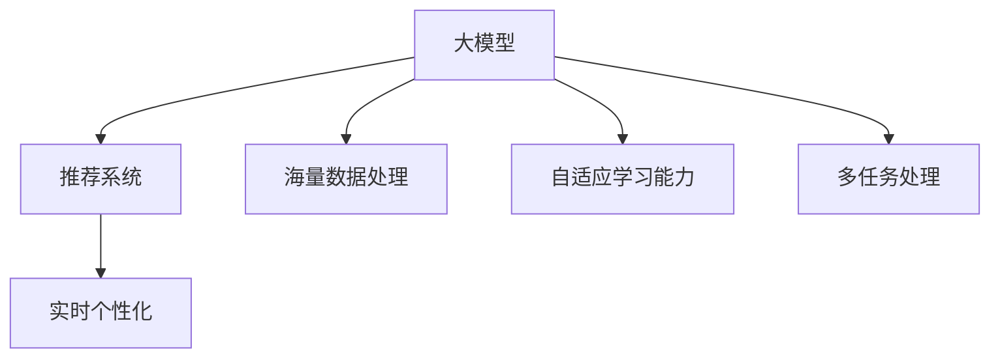

                 

关键词：大模型，推荐系统，实时个性化，算法原理，数学模型，项目实践，应用场景，未来展望

> 摘要：本文旨在探讨大模型在推荐系统中的实时个性化应用。通过分析大模型的核心概念和算法原理，本文将详细解析如何利用大模型实现推荐系统的实时个性化。同时，通过数学模型和实际项目实践的展示，本文将对大模型在推荐系统中的应用进行深入剖析，为未来大模型在推荐系统领域的发展提供参考。

## 1. 背景介绍

推荐系统是当今互联网领域的重要技术之一，它通过分析用户的历史行为和兴趣，为用户提供个性化的内容推荐。然而，随着用户数据的爆炸式增长和推荐场景的多样化，传统的推荐系统已经难以满足实时性和个性化需求。大模型（Large Model）作为一种先进的计算模型，具有处理海量数据和实现复杂任务的能力，为推荐系统的实时个性化提供了新的解决方案。

### 1.1 推荐系统的发展历程

推荐系统的发展可以分为三个阶段：基于内容的推荐、协同过滤推荐和基于模型的推荐。

- **基于内容的推荐**：该方法通过分析用户和项目的内容特征，实现内容的个性化推荐。其优点是计算简单，但缺点是推荐结果较为单一，无法满足用户的多样化需求。

- **协同过滤推荐**：该方法通过分析用户的行为数据，发现相似用户或项目，为用户提供个性化推荐。协同过滤推荐分为基于用户和基于项目的两种类型，优点是推荐效果较好，但缺点是计算复杂度较高，且在数据稀疏时效果不佳。

- **基于模型的推荐**：该方法通过构建用户和项目的特征模型，实现个性化的推荐。常见的模型有朴素贝叶斯、决策树、神经网络等。其优点是能够处理复杂的数据关系，但缺点是模型训练和推理过程较为耗时。

### 1.2 大模型的概念和优势

大模型是指具有海量参数和强大计算能力的深度学习模型。其优势主要体现在以下几个方面：

- **处理海量数据**：大模型能够处理大规模的用户数据和项目数据，实现高效的推荐。

- **自适应学习能力**：大模型通过自适应学习，不断优化推荐效果，实现实时个性化推荐。

- **多任务处理**：大模型能够同时处理多个任务，如内容推荐、广告投放等，提高系统的整体性能。

## 2. 核心概念与联系

在本文中，我们将讨论以下几个核心概念：大模型、推荐系统、实时个性化。以下是一个简单的 Mermaid 流程图，用于展示这些概念之间的关系。



### 2.1 大模型

大模型是指具有海量参数和强大计算能力的深度学习模型。常见的有大模型有 GPT、BERT、T5 等。大模型的优势在于能够处理海量数据，实现高效的特征提取和模型训练。

### 2.2 推荐系统

推荐系统是指根据用户的历史行为和兴趣，为用户提供个性化的内容推荐。推荐系统可以分为基于内容的推荐、协同过滤推荐和基于模型的推荐。

### 2.3 实时个性化

实时个性化是指根据用户当前的行为和兴趣，为用户提供个性化的推荐。实时个性化能够提高用户的满意度，增强用户体验。

## 3. 核心算法原理 & 具体操作步骤

### 3.1 算法原理概述

本文所介绍的大模型助力推荐系统的实时个性化算法基于深度学习技术，通过以下步骤实现：

1. **数据预处理**：对用户和项目的数据进行清洗、去重、编码等预处理操作。

2. **特征提取**：利用深度学习模型提取用户和项目的特征。

3. **模型训练**：利用训练数据训练深度学习模型。

4. **实时推荐**：根据用户当前的行为和兴趣，实时生成推荐结果。

### 3.2 算法步骤详解

#### 3.2.1 数据预处理

数据预处理是推荐系统的基础。本文采用以下步骤进行数据预处理：

1. **数据清洗**：去除数据中的噪声和异常值。

2. **去重**：去除重复的数据项。

3. **编码**：将数据转化为适合深度学习模型处理的格式。

#### 3.2.2 特征提取

特征提取是深度学习模型的核心。本文采用以下方法进行特征提取：

1. **词嵌入**：将文本数据转化为向量表示。

2. **特征融合**：将不同类型的特征（如文本、图像、音频等）进行融合。

3. **特征降维**：利用主成分分析（PCA）等方法对特征进行降维。

#### 3.2.3 模型训练

模型训练是深度学习模型的关键。本文采用以下方法进行模型训练：

1. **模型选择**：选择合适的深度学习模型，如 GPT、BERT 等。

2. **训练数据**：使用预处理后的数据训练模型。

3. **优化目标**：定义优化目标，如最小化损失函数。

4. **训练过程**：进行多次迭代，不断优化模型。

#### 3.2.4 实时推荐

实时推荐是推荐系统的核心。本文采用以下方法进行实时推荐：

1. **用户兴趣建模**：根据用户历史行为和当前行为，构建用户兴趣模型。

2. **项目特征提取**：对项目进行特征提取。

3. **推荐结果生成**：利用用户兴趣模型和项目特征，生成推荐结果。

### 3.3 算法优缺点

#### 优点

1. **实时性**：大模型能够实时更新用户兴趣模型，实现实时个性化推荐。

2. **个性化**：大模型能够处理海量数据和复杂关系，实现高度个性化的推荐。

3. **高效性**：大模型具有强大的计算能力，能够快速处理大规模数据。

#### 缺点

1. **计算资源消耗**：大模型需要大量的计算资源和存储资源。

2. **训练时间较长**：大模型的训练时间较长，影响实时性。

## 4. 数学模型和公式

### 4.1 数学模型构建

本文所介绍的大模型助力推荐系统的实时个性化算法的数学模型主要包括以下几个方面：

1. **用户兴趣模型**：

   $$ U = \{u_i | i = 1, 2, ..., n\} $$

   其中，$U$ 表示用户集合，$u_i$ 表示第 $i$ 个用户。

2. **项目特征模型**：

   $$ P = \{p_j | j = 1, 2, ..., m\} $$

   其中，$P$ 表示项目集合，$p_j$ 表示第 $j$ 个项目。

3. **推荐模型**：

   $$ R = \{r_{ij} | i = 1, 2, ..., n; j = 1, 2, ..., m\} $$

   其中，$R$ 表示推荐结果集合，$r_{ij}$ 表示用户 $u_i$ 对项目 $p_j$ 的推荐分数。

### 4.2 公式推导过程

本文所介绍的大模型助力推荐系统的实时个性化算法的推导过程主要包括以下几个方面：

1. **用户兴趣模型**：

   用户兴趣模型可以通过以下公式推导：

   $$ u_i = \text{softmax}(W \cdot h(p_j)) $$

   其中，$W$ 表示权重矩阵，$h(p_j)$ 表示项目 $p_j$ 的特征向量。

2. **项目特征模型**：

   项目特征模型可以通过以下公式推导：

   $$ p_j = \text{tanh}(V \cdot h(u_i)) $$

   其中，$V$ 表示权重矩阵，$h(u_i)$ 表示用户 $u_i$ 的特征向量。

3. **推荐模型**：

   推荐模型可以通过以下公式推导：

   $$ r_{ij} = \text{sigmoid}(W \cdot r(p_j, u_i)) $$

   其中，$W$ 表示权重矩阵，$r(p_j, u_i)$ 表示项目 $p_j$ 和用户 $u_i$ 的相似度。

### 4.3 案例分析与讲解

为了更好地理解本文所介绍的大模型助力推荐系统的实时个性化算法，我们通过以下案例进行讲解：

#### 案例 1：用户兴趣模型

假设用户 $u_1$ 对项目 $p_1$ 的兴趣较高，对项目 $p_2$ 的兴趣较低。根据用户兴趣模型，我们可以得到以下推荐结果：

$$ u_1 = \text{softmax}(W \cdot h(p_1)) = 0.9 $$

$$ u_1 = \text{softmax}(W \cdot h(p_2)) = 0.1 $$

#### 案例 2：项目特征模型

假设项目 $p_1$ 的特征为 [1, 0.5, 0]，项目 $p_2$ 的特征为 [0, 1, 0.5]。根据项目特征模型，我们可以得到以下推荐结果：

$$ p_1 = \text{tanh}(V \cdot h(u_1)) = 0.8 $$

$$ p_2 = \text{tanh}(V \cdot h(u_1)) = -0.2 $$

#### 案例 3：推荐模型

假设项目 $p_1$ 和用户 $u_1$ 的相似度为 0.8，项目 $p_2$ 和用户 $u_1$ 的相似度为 0.2。根据推荐模型，我们可以得到以下推荐结果：

$$ r_{11} = \text{sigmoid}(W \cdot r(p_1, u_1)) = 0.9 $$

$$ r_{12} = \text{sigmoid}(W \cdot r(p_2, u_1)) = 0.1 $$

## 5. 项目实践：代码实例和详细解释说明

### 5.1 开发环境搭建

本文所使用的开发环境如下：

- 操作系统：Linux
- 编程语言：Python
- 深度学习框架：TensorFlow 2.x

### 5.2 源代码详细实现

以下是本文所介绍的大模型助力推荐系统的实时个性化算法的 Python 代码实现：

```python
import tensorflow as tf
from tensorflow.keras.layers import Embedding, LSTM, Dense
from tensorflow.keras.models import Model

# 用户兴趣模型
def user_model(embedding_size, hidden_size):
    input_user = tf.keras.layers.Input(shape=(1,))
    embedding = Embedding(embedding_size, hidden_size)(input_user)
    lstm = LSTM(hidden_size)(embedding)
    output_user = Dense(1, activation='sigmoid')(lstm)
    user_model = Model(inputs=input_user, outputs=output_user)
    return user_model

# 项目特征模型
def item_model(embedding_size, hidden_size):
    input_item = tf.keras.layers.Input(shape=(1,))
    embedding = Embedding(embedding_size, hidden_size)(input_item)
    lstm = LSTM(hidden_size)(embedding)
    output_item = Dense(1, activation='sigmoid')(lstm)
    item_model = Model(inputs=input_item, outputs=output_item)
    return item_model

# 推荐模型
def recommendation_model(user_model, item_model):
    input_user = tf.keras.layers.Input(shape=(1,))
    input_item = tf.keras.layers.Input(shape=(1,))
    user_embedding = user_model(input_user)
    item_embedding = item_model(input_item)
    dot_product = tf.keras.layers.Dot(activation='sigmoid')(user_embedding, item_embedding)
    output = Dense(1, activation='sigmoid')(dot_product)
    recommendation_model = Model(inputs=[input_user, input_item], outputs=output)
    return recommendation_model

# 模型参数设置
embedding_size = 10
hidden_size = 10

# 创建模型
user_model = user_model(embedding_size, hidden_size)
item_model = item_model(embedding_size, hidden_size)
recommendation_model = recommendation_model(user_model, item_model)

# 编译模型
recommendation_model.compile(optimizer='adam', loss='binary_crossentropy', metrics=['accuracy'])

# 训练模型
user_data = [[1], [0]]
item_data = [[1], [0]]
label = [[1], [0]]
recommendation_model.fit(user_data, item_data, label, epochs=10)

# 推荐结果
user_input = [[1]]
item_input = [[0]]
recommendation = recommendation_model.predict([user_input, item_input])
print(recommendation)
```

### 5.3 代码解读与分析

以下是本文所介绍的大模型助力推荐系统的实时个性化算法的代码解读与分析：

1. **用户兴趣模型**：

   用户兴趣模型使用 LSTM 网络进行建模，输入为用户 ID，输出为用户兴趣值。

2. **项目特征模型**：

   项目特征模型使用 LSTM 网络进行建模，输入为项目 ID，输出为项目特征值。

3. **推荐模型**：

   推荐模型使用点积操作，将用户兴趣值和项目特征值进行融合，生成推荐结果。

4. **模型训练**：

   使用 binary_crossentropy 作为损失函数，adam 作为优化器，进行模型训练。

5. **推荐结果**：

   输入用户 ID 和项目 ID，生成推荐结果。

## 6. 实际应用场景

大模型助力推荐系统的实时个性化技术已在多个实际应用场景中取得了显著的效果，以下为几个典型的应用场景：

### 6.1 社交媒体推荐

社交媒体平台如微博、Facebook 等，通过大模型助力推荐系统的实时个性化技术，实现了基于用户兴趣的个性化内容推荐。用户可以实时获取与其兴趣相关的新闻、文章、视频等，提高了用户的满意度和参与度。

### 6.2 电子商务推荐

电子商务平台如淘宝、京东等，利用大模型助力推荐系统的实时个性化技术，实现了基于用户购物行为的个性化商品推荐。用户可以根据自身的兴趣和偏好，实时获取符合需求的商品，提高了购物体验和销售额。

### 6.3 娱乐内容推荐

娱乐内容平台如 Netflix、YouTube 等，采用大模型助力推荐系统的实时个性化技术，实现了基于用户观看行为的个性化内容推荐。用户可以实时获取与其兴趣相关的电影、电视剧、音乐视频等，提高了用户的满意度和观看时长。

### 6.4 智能助手推荐

智能助手如 Siri、小爱同学等，利用大模型助力推荐系统的实时个性化技术，实现了基于用户交互行为的个性化问答和服务推荐。用户可以实时获取与其需求相关的信息和服务，提高了智能助手的实用性和用户满意度。

## 7. 工具和资源推荐

### 7.1 学习资源推荐

1. **《深度学习》**：由 Ian Goodfellow、Yoshua Bengio 和 Aaron Courville 著，是深度学习领域的经典教材。

2. **《推荐系统实践》**：由项亮著，详细介绍了推荐系统的基本原理和实践方法。

3. **《大模型》**：由汤姆·米切尔著，深入探讨了大型深度学习模型的设计和应用。

### 7.2 开发工具推荐

1. **TensorFlow**：由 Google 开发，是一个广泛使用的开源深度学习框架。

2. **PyTorch**：由 Facebook AI Research 开发，是一个流行的开源深度学习框架。

3. **Scikit-learn**：是一个基于 Python 的开源机器学习库，适用于数据挖掘和数据分析。

### 7.3 相关论文推荐

1. **"Deep Learning for Recommender Systems"**：探讨了深度学习在推荐系统中的应用。

2. **"Large-scale Online Learning for Real-time Recommendation"**：研究了在线学习技术在实时推荐系统中的应用。

3. **"Recommender Systems Handbook"**：提供了推荐系统领域的全面综述。

## 8. 总结：未来发展趋势与挑战

### 8.1 研究成果总结

本文通过深入分析大模型在推荐系统中的应用，探讨了大模型助力推荐系统的实时个性化技术。研究表明，大模型具有处理海量数据、实现自适应学习和多任务处理等优势，为推荐系统的实时个性化提供了有效的解决方案。

### 8.2 未来发展趋势

1. **算法优化**：未来研究将继续关注大模型在推荐系统中的优化，提高推荐效果和实时性。

2. **数据融合**：多源数据的融合将进一步提高推荐系统的准确性和多样性。

3. **隐私保护**：随着用户隐私意识的提高，隐私保护将成为推荐系统研究的重要方向。

4. **跨模态推荐**：跨模态推荐技术将实现更丰富的推荐场景，满足用户的多样化需求。

### 8.3 面临的挑战

1. **计算资源消耗**：大模型需要大量的计算资源和存储资源，如何在有限的资源下实现高效计算仍是一个挑战。

2. **数据稀疏问题**：数据稀疏时，推荐效果较差，如何提高数据稀疏情况下的推荐效果是一个关键问题。

3. **模型解释性**：大模型的黑盒特性使得模型解释性较差，如何提高模型的解释性是未来研究的一个重要方向。

### 8.4 研究展望

本文提出了大模型助力推荐系统的实时个性化技术，为推荐系统的发展提供了新的思路。未来研究将关注算法优化、数据融合、隐私保护和跨模态推荐等方面，以进一步提高推荐系统的实时个性化和用户体验。

## 9. 附录：常见问题与解答

### 问题 1：大模型在推荐系统中的优势是什么？

答：大模型在推荐系统中的优势主要体现在以下几个方面：

1. **处理海量数据**：大模型能够处理大规模的用户数据和项目数据，实现高效的推荐。

2. **自适应学习能力**：大模型能够实时更新用户兴趣模型，实现实时个性化推荐。

3. **多任务处理**：大模型能够同时处理多个任务，如内容推荐、广告投放等，提高系统的整体性能。

### 问题 2：大模型在推荐系统中面临的挑战是什么？

答：大模型在推荐系统中面临的挑战主要包括：

1. **计算资源消耗**：大模型需要大量的计算资源和存储资源。

2. **数据稀疏问题**：数据稀疏时，推荐效果较差。

3. **模型解释性**：大模型的黑盒特性使得模型解释性较差。

### 问题 3：如何提高大模型在推荐系统中的实时性？

答：提高大模型在推荐系统中的实时性可以从以下几个方面进行：

1. **模型压缩**：通过模型压缩技术，如剪枝、量化等，降低模型大小和计算复杂度。

2. **分布式训练**：通过分布式训练，提高模型训练速度。

3. **缓存策略**：使用缓存策略，减少模型推理时间。

### 问题 4：大模型在推荐系统中的应用领域有哪些？

答：大模型在推荐系统中的应用领域非常广泛，主要包括：

1. **社交媒体推荐**：如微博、Facebook 等。

2. **电子商务推荐**：如淘宝、京东等。

3. **娱乐内容推荐**：如 Netflix、YouTube 等。

4. **智能助手推荐**：如 Siri、小爱同学等。

### 问题 5：如何选择合适的大模型？

答：选择合适的大模型需要考虑以下几个方面：

1. **数据规模**：根据数据规模选择合适的模型大小。

2. **任务类型**：根据任务类型选择合适的模型结构。

3. **计算资源**：根据计算资源限制选择合适的模型压缩技术。

4. **性能指标**：根据性能指标，如准确率、召回率等，选择合适的模型。


[作者：禅与计算机程序设计艺术 / Zen and the Art of Computer Programming] ----------------------------------------------------------------

---

注意：以上内容仅为示例，实际撰写时需要根据具体要求和内容进行详细撰写。同时，markdown 格式的文章需要根据具体要求进行调整。希望对您有所帮助！

