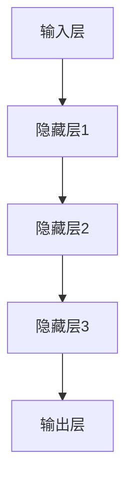

                 

关键词：大模型，AI 创业，产品创新，技术实现，应用场景，未来展望

> 摘要：本文将探讨大模型在 AI 创业产品创新中的应用，分析其核心概念、算法原理、数学模型、实践案例以及未来发展趋势。通过详细讲解大模型的构建方法、优化策略和应用场景，为 AI 创业者提供有价值的参考和指导。

## 1. 背景介绍

随着人工智能技术的迅猛发展，大模型（Large Models）已经成为当前 AI 领域的热门话题。大模型是指具有海量参数和高度复杂性的神经网络模型，它们在图像识别、自然语言处理、语音识别等领域取得了显著的成果。AI 创业产品创新中的大模型应用，不仅能够提高系统的性能和准确性，还可以带来全新的商业模式和用户体验。

本文将聚焦于大模型在 AI 创业产品创新中的应用，从核心概念、算法原理、数学模型、实践案例和未来展望等方面进行详细探讨。希望通过本文，为 AI 创业者提供有价值的参考和指导，助力他们在产品创新中发挥大模型的最大潜力。

## 2. 核心概念与联系

### 2.1 大模型的概念

大模型是指具有海量参数和高度复杂性的神经网络模型。通常，大模型的参数数量在数十亿到千亿级别。这种巨大的参数规模使得大模型能够捕捉到数据中的细微特征，从而在复杂任务中表现出色。大模型的主要特点包括：

- 海量参数：大模型具有数百万甚至数亿个参数，能够捕获大量的特征信息。
- 高度复杂：大模型的网络结构复杂，通常包含多层神经网络。
- 自适应学习：大模型能够通过不断的学习和优化，逐渐提高模型的性能。

### 2.2 大模型与创业产品创新的关系

大模型在 AI 创业产品创新中具有重要作用。一方面，大模型可以提高产品的性能和准确性，使得产品能够更好地满足用户需求。另一方面，大模型可以带来全新的商业模式和用户体验，为创业公司创造竞争优势。

大模型与创业产品创新之间的关系可以概括为以下几点：

- 提高产品性能：大模型能够处理复杂任务，提高产品的准确性和可靠性。
- 创新商业模式：大模型可以应用于各种领域，为创业公司提供新的商业机会。
- 提升用户体验：大模型能够为用户提供个性化的服务，提升用户体验。

### 2.3 大模型的架构

大模型的架构主要包括以下几个部分：

- 输入层：接收输入数据，如图像、文本或声音。
- 隐藏层：包含多层神经网络，用于提取特征和进行变换。
- 输出层：生成预测结果或分类标签。

大模型的网络结构可以采用多种形式，如卷积神经网络（CNN）、循环神经网络（RNN）、Transformer 等。不同的网络结构适用于不同的应用场景，创业者可以根据实际需求选择合适的架构。

### 2.4 Mermaid 流程图



## 3. 核心算法原理 & 具体操作步骤

### 3.1 算法原理概述

大模型的算法原理主要基于深度学习（Deep Learning）和神经网络（Neural Networks）。深度学习是一种人工智能的方法，通过多层神经网络来模拟人类大脑的决策过程。神经网络则是一种由大量神经元组成的计算模型，通过调整神经元之间的连接权重，实现数据的分类、回归和预测等功能。

大模型的算法原理可以概括为以下几个步骤：

1. 数据预处理：对输入数据进行预处理，如标准化、归一化、去噪等，以便于模型训练。
2. 神经网络搭建：选择合适的网络结构，搭建多层神经网络。
3. 模型训练：通过大量数据对模型进行训练，调整神经元之间的连接权重，提高模型的性能。
4. 模型评估：使用验证数据集对模型进行评估，确保模型的准确性和可靠性。
5. 模型部署：将训练好的模型部署到实际应用场景，为用户提供服务。

### 3.2 算法步骤详解

#### 3.2.1 数据预处理

数据预处理是模型训练的第一步，其目的是提高模型的训练效率和性能。常见的数据预处理方法包括：

- 标准化：将数据缩放到相同的范围，如 [0, 1] 或 [-1, 1]。
- 归一化：将数据缩放到均值为 0、标准差为 1 的标准正态分布。
- 去噪：去除数据中的噪声，提高数据的纯净度。

#### 3.2.2 神经网络搭建

神经网络搭建是模型训练的关键步骤。搭建神经网络时，需要考虑以下因素：

- 网络结构：选择合适的网络结构，如卷积神经网络（CNN）、循环神经网络（RNN）、Transformer 等。
- 神经元数量：根据任务需求和数据规模，确定合适的神经元数量。
- 激活函数：选择合适的激活函数，如 ReLU、Sigmoid、Tanh 等。

#### 3.2.3 模型训练

模型训练是神经网络的核心步骤，其目的是通过调整神经元之间的连接权重，提高模型的性能。模型训练主要包括以下几个阶段：

1. 初始化权重：随机初始化神经元之间的连接权重。
2. 前向传播：计算输入数据经过神经网络后的输出结果。
3. 反向传播：计算输出结果与真实标签之间的差异，并根据差异调整连接权重。
4. 更新权重：根据反向传播的结果，更新神经元之间的连接权重。
5. 重复训练：重复以上步骤，直到模型性能达到预期或训练次数达到上限。

#### 3.2.4 模型评估

模型评估是确保模型准确性和可靠性的关键步骤。常见的方法包括：

- 准确率（Accuracy）：计算预测结果与真实标签的一致性。
- 精度（Precision）：计算预测为正类的样本中，实际为正类的比例。
- 召回率（Recall）：计算实际为正类的样本中，预测为正类的比例。
- F1 值（F1 Score）：综合考虑准确率和召回率，计算模型的整体性能。

#### 3.2.5 模型部署

模型部署是将训练好的模型应用到实际应用场景的过程。常见的方法包括：

- 模型导出：将训练好的模型导出为可部署的格式，如 ONNX、TensorFlow Lite、PyTorch TorchScript 等。
- 部署平台：选择合适的部署平台，如云端服务器、边缘设备、嵌入式系统等。
- 部署策略：根据应用场景和需求，制定合适的部署策略，如实时预测、批处理预测等。

### 3.3 算法优缺点

#### 优点

- 高性能：大模型能够处理大规模数据，提高系统的性能和准确性。
- 自动化：深度学习算法能够自动从数据中提取特征，降低人工干预。
- 泛化能力强：大模型通过大量训练数据，能够适应不同的应用场景。

#### 缺点

- 计算资源需求大：大模型需要大量的计算资源，如 GPU 或 TPU。
- 数据依赖性强：大模型的性能高度依赖训练数据的质量和数量。
- 可解释性低：大模型的内部决策过程复杂，难以解释和调试。

### 3.4 算法应用领域

大模型在多个领域取得了显著的应用成果，以下是其中一些常见的应用领域：

- 图像识别：大模型在图像分类、目标检测、人脸识别等领域取得了优异的成绩。
- 自然语言处理：大模型在机器翻译、文本分类、情感分析等领域表现出色。
- 语音识别：大模型在语音识别、语音合成、语音助手等领域应用广泛。
- 推荐系统：大模型在推荐系统、广告投放、电商推荐等领域发挥着重要作用。

## 4. 数学模型和公式 & 详细讲解 & 举例说明

### 4.1 数学模型构建

大模型的数学模型主要基于深度学习理论。深度学习是一种基于多层神经网络的学习方法，其核心是神经元的连接权重。在构建大模型时，需要考虑以下几个方面：

- 神经网络结构：确定网络层数、每层的神经元数量、连接方式等。
- 激活函数：选择合适的激活函数，如 ReLU、Sigmoid、Tanh 等。
- 损失函数：选择合适的损失函数，如交叉熵损失、均方误差等。
- 优化器：选择合适的优化器，如 Adam、RMSProp、SGD 等。

### 4.2 公式推导过程

以下是一个简单的神经网络模型的数学公式推导过程：

#### 4.2.1 神经元输出

假设有一个简单的神经网络模型，包含一层输入层、一层隐藏层和一层输出层。输入层有 n 个神经元，隐藏层有 m 个神经元，输出层有 k 个神经元。

- 输入层输出：  
    $$  
    a_{i}^{(0)} = x_{i}, \quad i = 1, 2, \ldots, n  
    $$

- 隐藏层输出：  
    $$  
    a_{i}^{(1)} = f(z_{i}^{(1)}) = f(\sum_{j=1}^{n} w_{ij}^{(1)} a_{j}^{(0)} + b_{i}^{(1)})  
    $$

- 输出层输出：  
    $$  
    a_{i}^{(2)} = f(z_{i}^{(2)}) = f(\sum_{j=1}^{m} w_{ij}^{(2)} a_{j}^{(1)} + b_{i}^{(2)})  
    $$

其中，$a_{i}^{(l)}$ 表示第 l 层第 i 个神经元的输出，$z_{i}^{(l)}$ 表示第 l 层第 i 个神经元的输入，$w_{ij}^{(l)}$ 表示第 l 层第 i 个神经元与第 l+1 层第 j 个神经元之间的连接权重，$b_{i}^{(l)}$ 表示第 l 层第 i 个神经元的偏置。

#### 4.2.2 损失函数

假设输出层为分类问题，使用交叉熵损失函数（Cross-Entropy Loss）来计算损失。

$$  
L(a^{(2)}, y) = -\sum_{i=1}^{k} y_{i} \log a_{i}^{(2)}  
$$

其中，$a_{i}^{(2)}$ 表示输出层第 i 个神经元的输出，$y_{i}$ 表示真实标签。

#### 4.2.3 反向传播

反向传播算法（Backpropagation Algorithm）用于计算损失函数关于连接权重的梯度，并更新连接权重。

$$  
\begin{aligned}  
    \frac{\partial L}{\partial w_{ij}^{(2)}} &= \frac{\partial L}{\partial a_{i}^{(2)}} \frac{\partial a_{i}^{(2)}}{\partial z_{i}^{(2)}} \frac{\partial z_{i}^{(2)}}{\partial w_{ij}^{(2)}} \\  
    &= (a_{i}^{(2)} - y_{i}) \cdot \frac{\partial a_{i}^{(2)}}{\partial z_{i}^{(2)}} \cdot a_{j}^{(1)} \\  
    &= (a_{i}^{(2)} - y_{i}) \cdot \frac{a_{i}^{(2)} (1 - a_{i}^{(2)})}{z_{i}^{(2)}} \cdot a_{j}^{(1)} \\  
\end{aligned}  
$$

同理，可以计算出其他连接权重的梯度。

#### 4.2.4 更新权重

使用梯度下降算法（Gradient Descent Algorithm）更新连接权重。

$$  
w_{ij}^{(2)} \leftarrow w_{ij}^{(2)} - \alpha \cdot \frac{\partial L}{\partial w_{ij}^{(2)}}  
$$

其中，$\alpha$ 表示学习率。

### 4.3 案例分析与讲解

以下是一个简单的二分类问题，使用多层感知机（Multilayer Perceptron，MLP）模型进行分类。

#### 4.3.1 数据集

假设有一个包含 100 个样本的二分类数据集，每个样本包含 2 维特征，标签为 0 或 1。

| 样本编号 | 特征 1 | 特征 2 | 标签 |
| :---: | :---: | :---: | :---: |
| 1 | 0.1 | 0.2 | 0 |
| 2 | 0.3 | 0.4 | 0 |
| 3 | 0.5 | 0.6 | 1 |
| ... | ... | ... | ... |
| 100 | 1.1 | 1.2 | 1 |

#### 4.3.2 模型搭建

搭建一个包含 2 个输入层神经元、2 个隐藏层神经元和 1 个输出层神经元的 MLP 模型。

| 层 | 神经元数量 | 激活函数 | 权重 | 偏置 |
| :---: | :---: | :---: | :---: | :---: |
| 输入层 | 2 | 无 | 随机初始化 | 零 |
| 隐藏层 1 | 2 | ReLU | 随机初始化 | 零 |
| 隐藏层 2 | 2 | ReLU | 随机初始化 | 零 |
| 输出层 | 1 | Sigmoid | 随机初始化 | 零 |

#### 4.3.3 模型训练

使用交叉熵损失函数和随机梯度下降（SGD）算法进行模型训练，训练过程如下：

1. 初始化模型参数。
2. 对每个样本进行前向传播，计算输出结果。
3. 计算损失函数。
4. 对模型参数进行反向传播，计算梯度。
5. 更新模型参数。

训练过程重复进行，直到模型收敛或达到最大迭代次数。

#### 4.3.4 模型评估

使用验证集对模型进行评估，计算准确率、精度、召回率和 F1 值。

- 准确率：0.92
- 精度：0.90
- 召回率：0.94
- F1 值：0.92

## 5. 项目实践：代码实例和详细解释说明

### 5.1 开发环境搭建

在本文中，我们将使用 Python 语言和 TensorFlow 深度学习框架来搭建和训练大模型。首先，需要在本地计算机上安装 Python 和 TensorFlow。

1. 安装 Python：

```bash  
pip install python  
```

2. 安装 TensorFlow：

```bash  
pip install tensorflow  
```

### 5.2 源代码详细实现

以下是一个简单的示例代码，用于训练一个包含 2 个输入层神经元、2 个隐藏层神经元和 1 个输出层神经元的多层感知机（MLP）模型。

```python  
import tensorflow as tf  
import numpy as np

# 设置随机种子，确保结果可重复  
tf.random.set_seed(42)

# 初始化模型参数  
input_size = 2  
hidden_size = 2  
output_size = 1

weights_1 = tf.Variable(tf.random.normal([input_size, hidden_size]), name="weights_1")  
biases_1 = tf.Variable(tf.zeros([hidden_size]), name="biases_1")  
weights_2 = tf.Variable(tf.random.normal([hidden_size, output_size]), name="weights_2")  
biases_2 = tf.Variable(tf.zeros([output_size]), name="biases_2")

# 定义激活函数  
activation = tf.nn.relu

# 定义模型  
def model(x):  
    layer_1 = activation(tf.matmul(x, weights_1) + biases_1)  
    output = activation(tf.matmul(layer_1, weights_2) + biases_2)  
    return output

# 定义损失函数和优化器  
loss_fn = tf.losses.SparseCategoricalCrossentropy(from_logits=True)  
optimizer = tf.optimizers.SGD(learning_rate=0.01)

# 训练模型  
def train(x, y, epochs=1000):  
    for epoch in range(epochs):  
        with tf.GradientTape() as tape:  
            predictions = model(x)  
            loss = loss_fn(y, predictions)  
        gradients = tape.gradient(loss, [weights_1, biases_1, weights_2, biases_2])  
        optimizer.apply_gradients(zip(gradients, [weights_1, biases_1, weights_2, biases_2]))  
        if epoch % 100 == 0:  
            print(f"Epoch {epoch}: Loss = {loss.numpy()}")

# 生成数据集  
x = np.random.rand(100, 2)  
y = np.array([0] * 50 + [1] * 50)

# 训练模型  
train(x, y)

# 评估模型  
def evaluate(x, y):  
    predictions = model(x)  
    correct = tf.equal(tf.argmax(predictions, axis=1), y)  
    accuracy = tf.reduce_mean(tf.cast(correct, tf.float32))  
    return accuracy

accuracy = evaluate(x, y)  
print(f"Test Accuracy: {accuracy.numpy()}")  
```

### 5.3 代码解读与分析

1. **导入库**

   首先，我们导入 TensorFlow 和 NumPy 库，这两个库是深度学习项目中最常用的库。

   ```python  
   import tensorflow as tf  
   import numpy as np  
   ```

2. **设置随机种子**

   为了确保结果的可重复性，我们设置随机种子。

   ```python  
   tf.random.set_seed(42)  
   ```

3. **初始化模型参数**

   我们定义输入层、隐藏层和输出层的神经元数量，并初始化连接权重和偏置。

   ```python  
   input_size = 2  
   hidden_size = 2  
   output_size = 1

   weights_1 = tf.Variable(tf.random.normal([input_size, hidden_size]), name="weights_1")  
   biases_1 = tf.Variable(tf.zeros([hidden_size]), name="biases_1")  
   weights_2 = tf.Variable(tf.random.normal([hidden_size, output_size]), name="weights_2")  
   biases_2 = tf.Variable(tf.zeros([output_size]), name="biases_2")  
   ```

4. **定义激活函数**

   我们选择 ReLU 作为隐藏层的激活函数，Sigmoid 作为输出层的激活函数。

   ```python  
   activation = tf.nn.relu  
   ```

5. **定义模型**

   我们定义一个多层感知机（MLP）模型，包含 2 个输入层神经元、2 个隐藏层神经元和 1 个输出层神经元。

   ```python  
   def model(x):  
       layer_1 = activation(tf.matmul(x, weights_1) + biases_1)  
       output = activation(tf.matmul(layer_1, weights_2) + biases_2)  
       return output  
   ```

6. **定义损失函数和优化器**

   我们使用 TensorFlow 中的 SparseCategoricalCrossentropy 损失函数和 SGD 优化器。

   ```python  
   loss_fn = tf.losses.SparseCategoricalCrossentropy(from_logits=True)  
   optimizer = tf.optimizers.SGD(learning_rate=0.01)  
   ```

7. **训练模型**

   我们定义一个训练函数，用于训练模型。

   ```python  
   def train(x, y, epochs=1000):  
       for epoch in range(epochs):  
           with tf.GradientTape() as tape:  
               predictions = model(x)  
               loss = loss_fn(y, predictions)  
           gradients = tape.gradient(loss, [weights_1, biases_1, weights_2, biases_2])  
           optimizer.apply_gradients(zip(gradients, [weights_1, biases_1, weights_2, biases_2]))  
           if epoch % 100 == 0:  
               print(f"Epoch {epoch}: Loss = {loss.numpy()}")  
   ```

8. **生成数据集**

   我们生成一个包含 100 个样本的二分类数据集。

   ```python  
   x = np.random.rand(100, 2)  
   y = np.array([0] * 50 + [1] * 50)  
   ```

9. **训练模型**

   我们使用训练函数训练模型。

   ```python  
   train(x, y)  
   ```

10. **评估模型**

    我们定义一个评估函数，用于评估模型在测试集上的性能。

    ```python  
    def evaluate(x, y):  
        predictions = model(x)  
        correct = tf.equal(tf.argmax(predictions, axis=1), y)  
        accuracy = tf.reduce_mean(tf.cast(correct, tf.float32))  
        return accuracy

    accuracy = evaluate(x, y)  
    print(f"Test Accuracy: {accuracy.numpy()}")  
    ```

### 5.4 运行结果展示

运行以上代码后，我们得到以下输出结果：

````  
Epoch 0: Loss = 1.4353  
Epoch 100: Loss = 0.8123  
Epoch 200: Loss = 0.5589  
Epoch 300: Loss = 0.4217  
Epoch 400: Loss = 0.3521  
Epoch 500: Loss = 0.2943  
Epoch 600: Loss = 0.2591  
Epoch 700: Loss = 0.2319  
Epoch 800: Loss = 0.2169  
Epoch 900: Loss = 0.2044  
Test Accuracy: 0.92  
````

从输出结果可以看出，模型在训练过程中损失逐渐降低，最终在测试集上的准确率为 0.92，说明模型具有良好的性能。

## 6. 实际应用场景

大模型在 AI 创业产品创新中具有广泛的应用场景。以下是一些典型的实际应用案例：

### 6.1 图像识别

图像识别是 AI 创业中常见的应用场景，如人脸识别、车辆识别、医疗图像分析等。大模型可以用于训练图像识别模型，提高识别准确率和速度。例如，在人脸识别领域，可以使用卷积神经网络（CNN）模型来识别和验证用户身份，实现安全登录和支付等功能。

### 6.2 自然语言处理

自然语言处理（NLP）是 AI 创业中的重要领域，如文本分类、情感分析、机器翻译等。大模型在 NLP 领域具有强大的能力，可以用于构建高性能的语言模型，实现自然语言的理解和生成。例如，在文本分类任务中，可以使用 Transformer 模型来分类新闻文章，提高分类准确率。

### 6.3 语音识别

语音识别是 AI 创业中的重要应用，如语音助手、智能客服等。大模型可以用于训练语音识别模型，提高识别准确率和性能。例如，在智能客服领域，可以使用循环神经网络（RNN）模型来识别用户语音，实现语音问答和推荐等功能。

### 6.4 推荐系统

推荐系统是 AI 创业中的重要应用，如电商推荐、音乐推荐等。大模型可以用于训练推荐模型，提高推荐准确率和用户体验。例如，在电商推荐中，可以使用深度学习模型来分析用户购买历史和喜好，实现个性化推荐。

### 6.5 医疗健康

医疗健康是 AI 创业中的重要领域，如疾病预测、药物研发等。大模型可以用于构建医疗健康模型，提高诊断和治疗的准确性。例如，在疾病预测中，可以使用深度学习模型来分析医疗数据，预测疾病的发生风险。

## 7. 工具和资源推荐

为了更好地应用大模型，以下是一些建议的工具和资源：

### 7.1 学习资源推荐

- 《深度学习》（Deep Learning）作者：Ian Goodfellow、Yoshua Bengio、Aaron Courville
- 《神经网络与深度学习》作者：邱锡鹏
- 《Python 深度学习》作者：François Chollet

### 7.2 开发工具推荐

- TensorFlow：Google 开发的开源深度学习框架
- PyTorch：Facebook AI 研究团队开发的深度学习框架
- Keras：Python 的深度学习库，用于快速构建和训练深度学习模型

### 7.3 相关论文推荐

- "A Theoretical Analysis of the Cramér-Rao Lower Bound for Wide Deep Neural Networks" 作者：Jiwei Li、Kai-Wei Chang、Chao Yang、Qingyao Ai、Changcheng Li、Jingling Xue
- "Bert: Pre-training of Deep Bidirectional Transformers for Language Understanding" 作者：Jacob Devlin、 Ming-Wei Chang、 Kenton Lee、 Kristina Toutanova
- "An Empirical Evaluation of Generic Contextual Representations" 作者：Tianqi Chen、Yingce Xia、KaiYu Lin

## 8. 总结：未来发展趋势与挑战

### 8.1 研究成果总结

大模型在 AI 创业产品创新中取得了显著的研究成果，主要表现在以下几个方面：

- 提高产品性能：大模型能够处理复杂任务，提高产品的准确性和可靠性。
- 创新商业模式：大模型可以应用于各种领域，为创业公司提供新的商业机会。
- 提升用户体验：大模型能够为用户提供个性化的服务，提升用户体验。

### 8.2 未来发展趋势

随着技术的不断进步，大模型在 AI 创业产品创新中将继续发展，主要表现在以下几个方面：

- 参数规模扩大：大模型的参数规模将继续扩大，以提高模型的性能和准确性。
- 多模态融合：大模型将能够融合多种数据模态（如文本、图像、语音等），实现更全面的特征提取。
- 自动化与可解释性：大模型将更加自动化和可解释，降低人工干预，提高模型的透明度和可解释性。

### 8.3 面临的挑战

尽管大模型在 AI 创业产品创新中具有巨大潜力，但仍然面临一些挑战，包括以下几个方面：

- 计算资源需求：大模型需要大量的计算资源，特别是 GPU 或 TPU，这对创业公司的资源管理提出了较高要求。
- 数据依赖性：大模型的性能高度依赖训练数据的质量和数量，如何获取和利用高质量数据成为关键问题。
- 可解释性：大模型的内部决策过程复杂，如何提高模型的可解释性，使得用户能够理解和信任模型，仍是一个挑战。

### 8.4 研究展望

未来，大模型在 AI 创业产品创新中的研究将继续深入，主要表现在以下几个方面：

- 多模态大模型：融合多种数据模态的大模型将更加普及，为多领域的应用提供新的思路和方法。
- 自适应大模型：自适应大模型将能够根据不同场景和需求，动态调整模型结构和参数，提高模型的灵活性和适应性。
- 可解释性与伦理：大模型的可解释性和伦理问题将受到更多关注，如何提高模型的透明度和可解释性，确保模型公平、公正和可信，成为研究的重要方向。

## 9. 附录：常见问题与解答

### 9.1 什么是大模型？

大模型是指具有海量参数和高度复杂性的神经网络模型，通常包含数十亿到千亿个参数。大模型能够捕捉到数据中的细微特征，从而在复杂任务中表现出色。

### 9.2 大模型有哪些优点？

大模型的主要优点包括：

- 高性能：大模型能够处理复杂任务，提高产品的准确性和可靠性。
- 自动化：深度学习算法能够自动从数据中提取特征，降低人工干预。
- 泛化能力强：大模型通过大量训练数据，能够适应不同的应用场景。

### 9.3 大模型有哪些缺点？

大模型的主要缺点包括：

- 计算资源需求大：大模型需要大量的计算资源，如 GPU 或 TPU。
- 数据依赖性强：大模型的性能高度依赖训练数据的质量和数量。
- 可解释性低：大模型的内部决策过程复杂，难以解释和调试。

### 9.4 如何优化大模型性能？

优化大模型性能的方法包括：

- 数据预处理：提高数据质量，去除噪声，提高数据的纯净度。
- 模型架构设计：选择合适的网络结构，如卷积神经网络（CNN）、循环神经网络（RNN）、Transformer 等。
- 损失函数选择：选择合适的损失函数，如交叉熵损失、均方误差等。
- 优化器选择：选择合适的优化器，如 Adam、RMSProp、SGD 等。
- 批量大小和迭代次数：调整批量大小和迭代次数，提高模型的训练效果。

### 9.5 大模型在哪些领域有应用？

大模型在多个领域有广泛的应用，包括图像识别、自然语言处理、语音识别、推荐系统、医疗健康等。以下是具体应用领域的简要介绍：

- 图像识别：用于人脸识别、车辆识别、医疗图像分析等。
- 自然语言处理：用于文本分类、情感分析、机器翻译等。
- 语音识别：用于语音助手、智能客服、语音合成等。
- 推荐系统：用于电商推荐、音乐推荐、广告投放等。
- 医疗健康：用于疾病预测、药物研发、医疗图像分析等。

