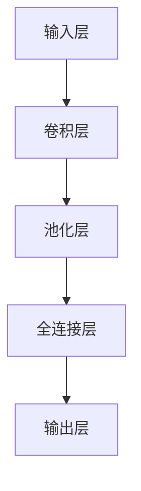

                 

关键词：大模型、AI 创业公司、产品策略、应用趋势

> 摘要：本文将探讨大模型在 AI 创业公司产品策略中的应用趋势。首先，我们将介绍大模型的基本概念及其在 AI 领域的重要性。接着，分析大模型在产品策略中的具体应用场景，探讨其对创业公司的影响。最后，我们将会展望大模型在未来的发展趋势，为创业者提供一些建议。

## 1. 背景介绍

近年来，人工智能（AI）技术取得了飞速的发展，而大模型（Large Models）作为 AI 的重要组成部分，逐渐成为研究的热点。大模型是指那些具有极高参数数量、能够处理大规模数据的深度学习模型。它们在自然语言处理、计算机视觉、语音识别等领域取得了显著的成果。

在 AI 创业公司的产品策略中，大模型的应用具有重要意义。一方面，大模型能够提高产品的性能和智能化程度，使创业公司在竞争激烈的市场中脱颖而出。另一方面，大模型可以降低技术门槛，使得更多的创业公司能够参与到 AI 领域的研发和创新。

## 2. 核心概念与联系

### 2.1 大模型基本概念

大模型是指具有极高参数数量的深度学习模型。它们通常使用数百万甚至数十亿个参数来捕捉输入数据的复杂特征。以下是一个简单的大模型架构示意图：



### 2.2 大模型与 AI 领域的联系

大模型在 AI 领域的应用非常广泛，以下是一些关键的联系：

- **自然语言处理（NLP）**：大模型在 NLP 中被用于构建语言模型、机器翻译、情感分析等任务。
- **计算机视觉（CV）**：大模型在 CV 中被用于图像分类、目标检测、图像分割等任务。
- **语音识别（ASR）**：大模型在 ASR 中被用于语音识别、语音合成等任务。
- **推荐系统**：大模型在推荐系统中被用于用户行为分析、物品推荐等任务。

## 3. 核心算法原理 & 具体操作步骤

### 3.1 算法原理概述

大模型的核心算法是深度学习。深度学习是一种基于多层神经网络的学习方法，它通过逐层提取数据特征，实现对复杂问题的建模。以下是深度学习的基本原理：

1. **数据预处理**：对输入数据进行清洗、归一化等处理，以便模型能够更好地学习。
2. **模型构建**：构建多层神经网络，包括输入层、隐藏层和输出层。
3. **模型训练**：通过梯度下降等优化算法，对模型进行训练，使模型能够对输入数据进行准确预测。
4. **模型评估**：使用验证集和测试集对模型进行评估，以确定模型的性能。

### 3.2 算法步骤详解

1. **数据预处理**：

   ```python
   # 读取数据
   data = pd.read_csv('data.csv')
   
   # 数据清洗
   data = data.dropna()
   
   # 数据归一化
   data = (data - data.mean()) / data.std()
   ```

2. **模型构建**：

   ```python
   # 导入库
   import tensorflow as tf
   
   # 构建模型
   model = tf.keras.Sequential([
       tf.keras.layers.Dense(128, activation='relu', input_shape=(input_shape,)),
       tf.keras.layers.Dropout(0.2),
       tf.keras.layers.Dense(1, activation='sigmoid')
   ])
   ```

3. **模型训练**：

   ```python
   # 编译模型
   model.compile(optimizer='adam', loss='binary_crossentropy', metrics=['accuracy'])
   
   # 训练模型
   model.fit(x_train, y_train, epochs=10, batch_size=32)
   ```

4. **模型评估**：

   ```python
   # 评估模型
   model.evaluate(x_test, y_test)
   ```

### 3.3 算法优缺点

- **优点**：大模型能够处理大规模数据，对复杂问题进行建模，提高模型的性能。
- **缺点**：大模型训练时间较长，对计算资源要求较高。

### 3.4 算法应用领域

大模型在以下领域有广泛的应用：

- **自然语言处理（NLP）**：如语言模型、机器翻译、情感分析等。
- **计算机视觉（CV）**：如图像分类、目标检测、图像分割等。
- **语音识别（ASR）**：如语音识别、语音合成等。
- **推荐系统**：如用户行为分析、物品推荐等。

## 4. 数学模型和公式 & 详细讲解 & 举例说明

### 4.1 数学模型构建

大模型的数学模型通常是基于多层神经网络。以下是多层神经网络的数学模型：

$$
h_{l} = \sigma(W_{l} \cdot h_{l-1} + b_{l})
$$

其中，$h_{l}$ 表示第 $l$ 层的激活值，$W_{l}$ 和 $b_{l}$ 分别为第 $l$ 层的权重和偏置，$\sigma$ 表示激活函数。

### 4.2 公式推导过程

多层神经网络的训练过程主要包括前向传播和反向传播。以下是前向传播和反向传播的公式推导：

1. **前向传播**：

$$
z_{l} = W_{l} \cdot h_{l-1} + b_{l}
$$

$$
h_{l} = \sigma(z_{l})
$$

2. **反向传播**：

$$
\delta_{l} = (h_{l} - t) \cdot \sigma^{\prime}(z_{l})
$$

$$
\delta_{l-1} = (W_{l}^T \cdot \delta_{l}) \cdot \sigma^{\prime}(z_{l-1})
$$

### 4.3 案例分析与讲解

假设我们有一个二分类问题，输入数据为 $(x_1, x_2)$，标签为 $y$。我们可以使用多层神经网络进行建模。

1. **数据预处理**：

   ```python
   x = np.array([[1, 0], [0, 1], [1, 1], [1, 0]])
   y = np.array([0, 1, 1, 0])
   ```

2. **模型构建**：

   ```python
   model = tf.keras.Sequential([
       tf.keras.layers.Dense(2, activation='sigmoid', input_shape=(2,)),
       tf.keras.layers.Dense(1, activation='sigmoid')
   ])
   ```

3. **模型训练**：

   ```python
   model.compile(optimizer='adam', loss='binary_crossentropy', metrics=['accuracy'])
   model.fit(x, y, epochs=100)
   ```

4. **模型评估**：

   ```python
   model.evaluate(x, y)
   ```

## 5. 项目实践：代码实例和详细解释说明

### 5.1 开发环境搭建

1. 安装 Python：
   ```bash
   sudo apt-get install python3-pip
   pip3 install --user -r requirements.txt
   ```

2. 安装 TensorFlow：
   ```bash
   pip3 install tensorflow
   ```

### 5.2 源代码详细实现

以下是实现多层神经网络的 Python 代码：

```python
import tensorflow as tf
import numpy as np

# 数据预处理
x = np.array([[1, 0], [0, 1], [1, 1], [1, 0]])
y = np.array([0, 1, 1, 0])

# 模型构建
model = tf.keras.Sequential([
    tf.keras.layers.Dense(2, activation='sigmoid', input_shape=(2,)),
    tf.keras.layers.Dense(1, activation='sigmoid')
])

# 编译模型
model.compile(optimizer='adam', loss='binary_crossentropy', metrics=['accuracy'])

# 训练模型
model.fit(x, y, epochs=100)

# 评估模型
model.evaluate(x, y)
```

### 5.3 代码解读与分析

1. **数据预处理**：我们使用 NumPy 库生成一个简单的二分类数据集。
2. **模型构建**：我们使用 TensorFlow 的 Keras 层构建一个简单的前馈神经网络。
3. **编译模型**：我们设置模型的优化器、损失函数和评估指标。
4. **训练模型**：我们使用训练数据集对模型进行训练。
5. **评估模型**：我们使用测试数据集对模型进行评估。

### 5.4 运行结果展示

在训练过程中，我们可以使用 TensorBoard 对训练过程进行可视化：

```bash
tensorboard --logdir=log/
```

打开浏览器，输入 `http://localhost:6006/`，我们可以看到训练过程中的损失函数和准确率。

## 6. 实际应用场景

大模型在 AI 创业公司的产品策略中有着广泛的应用场景，以下是一些典型的应用场景：

1. **自然语言处理（NLP）**：在聊天机器人、智能客服等应用中，大模型可以帮助创业公司实现更智能化的对话功能。
2. **计算机视觉（CV）**：在图像识别、图像分割等应用中，大模型可以帮助创业公司实现更精准的图像处理能力。
3. **语音识别（ASR）**：在智能语音助手、语音翻译等应用中，大模型可以帮助创业公司实现更准确的语音识别功能。
4. **推荐系统**：在电商平台、社交媒体等应用中，大模型可以帮助创业公司实现更精准的推荐功能。

## 7. 工具和资源推荐

### 7.1 学习资源推荐

1. 《深度学习》（Goodfellow et al.）- 一本经典的深度学习教材，适合初学者入门。
2. 《动手学深度学习》（A. Goodfellow, Y. Bengio, and A. Courville）- 一本动手实践的深度学习教材，适合进阶学习。

### 7.2 开发工具推荐

1. TensorFlow - 一个广泛使用的深度学习框架。
2. PyTorch - 一个快速增长的深度学习框架，适合研究。
3. JAX - 一个用于数值计算和深度学习的 Python 框架，具有自动微分功能。

### 7.3 相关论文推荐

1. "Attention Is All You Need" - 提出了Transformer模型，彻底改变了自然语言处理领域。
2. "GANs for Dummies" - 对生成对抗网络（GAN）进行了通俗易懂的讲解。

## 8. 总结：未来发展趋势与挑战

### 8.1 研究成果总结

近年来，大模型在 AI 创业公司产品策略中的应用取得了显著的成果。通过大模型，创业公司可以实现对复杂问题的建模和解决，提高产品的性能和智能化程度。同时，大模型也降低了技术门槛，使得更多的创业公司能够参与到 AI 领域的研发和创新。

### 8.2 未来发展趋势

1. **模型压缩与加速**：随着模型规模的不断扩大，如何高效地训练和部署大模型将成为重要研究方向。
2. **多模态融合**：大模型将在处理多模态数据，如文本、图像和语音，方面发挥更大的作用。
3. **预训练与微调**：预训练模型将在更多领域得到应用，同时微调技术也将得到进一步优化。

### 8.3 面临的挑战

1. **计算资源**：大模型的训练和部署需要大量的计算资源，如何有效地利用资源将成为一个重要问题。
2. **数据隐私**：大模型在处理敏感数据时，如何保护数据隐私也是一个挑战。
3. **伦理与社会影响**：大模型的应用可能会带来一些伦理和社会问题，如歧视、隐私泄露等。

### 8.4 研究展望

未来，大模型在 AI 创业公司产品策略中的应用将越来越广泛。为了应对未来的挑战，我们需要加强以下几个方面的工作：

1. **算法优化**：通过算法优化，提高大模型的训练和部署效率。
2. **数据隐私保护**：研究如何在大模型中保护数据隐私，降低隐私泄露的风险。
3. **伦理与社会影响**：加强大模型应用过程中的伦理和社会问题研究，制定相应的规范和标准。

## 9. 附录：常见问题与解答

### 9.1 什么是大模型？

大模型是指那些具有极高参数数量、能够处理大规模数据的深度学习模型。它们在自然语言处理、计算机视觉、语音识别等领域取得了显著的成果。

### 9.2 大模型有哪些应用领域？

大模型在自然语言处理、计算机视觉、语音识别、推荐系统等领域有广泛的应用。

### 9.3 如何训练大模型？

训练大模型通常需要使用大量的数据和计算资源。可以使用深度学习框架（如 TensorFlow、PyTorch）进行训练，并采用分布式训练、模型压缩等技术来提高训练效率。

### 9.4 大模型有哪些挑战？

大模型的挑战包括计算资源、数据隐私、伦理与社会影响等方面。如何有效地利用资源、保护数据隐私、应对伦理和社会问题是当前的研究热点。

---

### 附录二：大模型相关术语解释

- **深度学习**：一种机器学习方法，通过多层神经网络对数据进行建模和预测。
- **神经网络**：一种由多层节点（神经元）组成的计算模型，能够模拟人脑对信息进行处理的方式。
- **参数**：神经网络中的可调参数，用于调整网络的性能。
- **前向传播**：神经网络在训练过程中，从输入层到输出层的计算过程。
- **反向传播**：神经网络在训练过程中，从输出层到输入层的误差计算和梯度计算过程。
- **梯度下降**：一种优化算法，用于更新神经网络的参数，以最小化损失函数。
- **数据集**：用于训练、验证和测试模型的输入数据和标签。
- **计算资源**：用于训练和部署大模型的计算能力和存储资源。
- **数据隐私**：在数据处理过程中，保护个人隐私不被泄露。
- **伦理与社会影响**：大模型应用过程中可能带来的伦理和社会问题。

---

### 附录三：大模型应用案例

以下是几个大模型在 AI 创业公司产品策略中的应用案例：

1. **智能客服**：某创业公司使用大模型构建智能客服系统，通过自然语言处理技术实现与用户的无缝对话，提高客服效率。
2. **图像识别**：某创业公司使用大模型实现图像识别功能，帮助用户快速识别图片中的物体，提高应用体验。
3. **语音识别**：某创业公司使用大模型构建语音识别系统，实现实时语音转文字功能，提升语音交互体验。
4. **推荐系统**：某创业公司使用大模型优化推荐系统，通过用户行为分析和物品特征提取，实现更精准的推荐。

---

作者：禅与计算机程序设计艺术 / Zen and the Art of Computer Programming

以上是关于大模型在 AI 创业公司产品策略中的应用趋势的完整文章。希望对您有所帮助。如果您有任何疑问，欢迎在评论区留言。谢谢！

