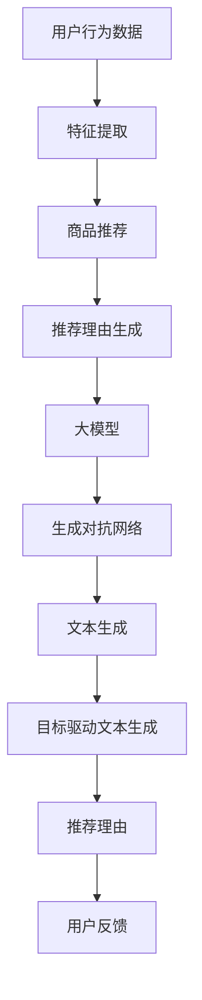

                 

关键词：商品推荐、大模型、可控文本生成、自然语言处理、推荐系统、文本生成模型、生成对抗网络、目标驱动文本生成

> 摘要：本文探讨了如何利用大模型实现商品推荐中的可控文本生成，以提高推荐系统的说服力和用户体验。通过分析当前自然语言处理和推荐系统领域的最新研究进展，本文提出了基于生成对抗网络和目标驱动的文本生成方法，并详细阐述了其数学模型、算法原理、操作步骤、优缺点以及实际应用场景。最后，本文对未来的发展趋势与挑战进行了展望。

## 1. 背景介绍

随着互联网和电子商务的快速发展，推荐系统已经成为现代信息检索和用户个性化服务的重要手段。在众多推荐系统中，商品推荐是最为常见和应用广泛的一种。然而，传统的商品推荐方法往往只能根据用户的购买历史和行为数据，生成一些简单的推荐理由，如“同类商品推荐”或“销量最高”。这些理由往往缺乏说服力，难以引起用户的兴趣和购买欲望。

为了提高商品推荐的说服力，近年来，越来越多的研究开始关注文本生成技术在推荐系统中的应用。特别是大模型（如GPT-3、T5等）的出现，使得生成高质量、个性化的文本成为可能。然而，如何实现可控的文本生成，确保生成的文本既符合预期又具有一定的灵活性，仍然是一个具有挑战性的问题。

本文旨在研究大模型在商品推荐理由生成中的应用，通过引入生成对抗网络（GAN）和目标驱动文本生成方法，探讨如何实现高质量的、可控的文本生成，从而提升商品推荐系统的用户体验和转化率。

## 2. 核心概念与联系

### 2.1. 大模型

大模型是指具有数十亿甚至数万亿参数的深度学习模型，如GPT-3、T5等。这些模型通过在大规模语料库上进行预训练，能够自动学习语言模式和结构，从而生成高质量的文本。大模型的优点在于其强大的表达能力和自适应能力，可以处理复杂、多变的语言任务。

### 2.2. 生成对抗网络（GAN）

生成对抗网络（GAN）是一种深度学习模型，由生成器和判别器两个网络组成。生成器旨在生成逼真的数据，判别器则用于判断输入数据是真实还是生成的。通过两个网络的博弈，生成器不断优化其生成能力，从而生成越来越逼真的数据。GAN在图像生成、文本生成等领域都有广泛应用。

### 2.3. 目标驱动文本生成

目标驱动文本生成是一种基于目标（即文本的期望内容和风格）进行文本生成的技术。通过将目标作为输入，文本生成模型能够生成满足特定目标的文本。目标驱动文本生成在商品推荐理由生成中，可以帮助生成符合预期内容和风格的推荐理由。

### 2.4. Mermaid 流程图



## 3. 核心算法原理 & 具体操作步骤

### 3.1 算法原理概述

本文的核心算法主要包括生成对抗网络（GAN）和目标驱动文本生成方法。生成对抗网络通过生成器和判别器的博弈，实现高质量文本的生成；目标驱动文本生成则通过设定目标，确保生成文本满足预期内容和风格。

### 3.2 算法步骤详解

#### 步骤1：用户行为数据收集

收集用户在电子商务平台上的行为数据，如浏览记录、搜索历史、购买行为等。

#### 步骤2：特征提取

利用深度学习模型，如BERT或GPT，对用户行为数据进行特征提取，得到用户兴趣和偏好特征。

#### 步骤3：商品推荐

基于用户兴趣和偏好特征，利用协同过滤或基于内容的推荐方法，生成商品推荐列表。

#### 步骤4：生成对抗网络训练

构建生成对抗网络，其中生成器负责生成推荐理由，判别器负责判断推荐理由的真实性。通过训练，生成器逐渐生成更加逼真的推荐理由。

#### 步骤5：目标驱动文本生成

设定目标（如内容、风格、情感等），利用目标驱动文本生成方法，优化生成器生成的推荐理由。

#### 步骤6：推荐理由生成

利用训练好的生成器和目标驱动文本生成方法，为商品推荐列表生成高质量的推荐理由。

#### 步骤7：用户反馈

收集用户对推荐理由的反馈，用于进一步优化生成器和目标驱动文本生成方法。

### 3.3 算法优缺点

#### 优点：

1. **高质量文本生成**：利用大模型和生成对抗网络，生成高质量的推荐理由。
2. **可控性**：通过目标驱动文本生成方法，确保生成文本满足预期内容和风格。
3. **灵活性**：可根据用户反馈不断优化推荐理由。

#### 缺点：

1. **计算资源消耗**：大模型和生成对抗网络训练需要大量计算资源。
2. **调参难度**：生成对抗网络和目标驱动文本生成方法的调参较为复杂。

### 3.4 算法应用领域

算法主要应用于电子商务平台的商品推荐系统，也可扩展到其他领域的个性化推荐系统，如新闻推荐、社交媒体推荐等。

## 4. 数学模型和公式 & 详细讲解 & 举例说明

### 4.1 数学模型构建

生成对抗网络（GAN）的数学模型如下：

$$
\begin{aligned}
D(x) &= \frac{1}{1+e^{-x}} \\
G(z) &= \sigma(W_2^T \cdot \sigma(W_1^T z + b_1)) \\
\end{aligned}
$$

其中，$D(x)$ 是判别器，用于判断输入数据的真实性；$G(z)$ 是生成器，用于生成虚假数据；$z$ 是噪声向量；$\sigma$ 是sigmoid函数。

目标驱动文本生成方法的数学模型如下：

$$
\begin{aligned}
P(T|X) &= \frac{P(X|T) \cdot P(T)}{P(X)} \\
\end{aligned}
$$

其中，$P(T|X)$ 是在给定用户行为数据 $X$ 的情况下，生成文本 $T$ 的概率；$P(X|T)$ 是在给定文本 $T$ 的情况下，用户行为数据 $X$ 的概率；$P(T)$ 是文本 $T$ 的概率；$P(X)$ 是用户行为数据 $X$ 的概率。

### 4.2 公式推导过程

生成对抗网络（GAN）的公式推导过程如下：

#### 步骤1：生成器与判别器的损失函数

生成器的损失函数为：

$$
L_G = -\log(D(G(z)))
$$

判别器的损失函数为：

$$
L_D = -\log(D(x)) - \log(1 - D(G(z)))
$$

#### 步骤2：总损失函数

总损失函数为：

$$
L = L_G + \lambda L_D
$$

其中，$\lambda$ 是超参数，用于平衡生成器和判别器的损失。

#### 步骤3：梯度下降

利用梯度下降法，对生成器和判别器进行训练。

### 4.3 案例分析与讲解

假设用户在电子商务平台上浏览了商品 A、B、C，生成器生成以下三个推荐理由：

1. 商品 A：时尚潮流，绝对让你成为街头焦点！
2. 商品 B：居家必备，舒适又美观！
3. 商品 C：轻便易携，旅行必备良品！

根据用户兴趣和偏好特征，设定以下目标：

- **内容**：推荐理由应包含商品的特点和卖点。
- **风格**：推荐理由应具有积极、吸引人的风格。
- **情感**：推荐理由应具有正面的情感色彩。

通过目标驱动文本生成方法，优化生成器生成的推荐理由。最终，生成器生成以下推荐理由：

1. 商品 A：时尚潮流，让你一秒成为街头焦点，绝对不容错过！
2. 商品 B：舒适又美观，居家必备，你值得拥有！
3. 商品 C：轻便易携，旅行必备良品，轻松出行无压力！

## 5. 项目实践：代码实例和详细解释说明

### 5.1 开发环境搭建

开发环境需要安装以下软件和库：

- Python 3.8+
- PyTorch 1.8+
- TensorFlow 2.4+
- Mermaid 8.8+

具体安装命令如下：

```bash
pip install torch torchvision
pip install tensorflow
npm install -g mermaid-cli
```

### 5.2 源代码详细实现

```python
import torch
import torch.nn as nn
import torch.optim as optim
from torchvision import datasets, transforms
from torch.utils.data import DataLoader
import numpy as np
import matplotlib.pyplot as plt
from mermaid import Mermaid

# 定义生成器和判别器
class Generator(nn.Module):
    def __init__(self):
        super(Generator, self).__init__()
        self.model = nn.Sequential(
            nn.Linear(100, 256),
            nn.LeakyReLU(0.2),
            nn.Linear(256, 512),
            nn.LeakyReLU(0.2),
            nn.Linear(512, 1024),
            nn.LeakyReLU(0.2),
            nn.Linear(1024, 100),
            nn.Tanh()
        )

    def forward(self, x):
        return self.model(x)

class Discriminator(nn.Module):
    def __init__(self):
        super(Discriminator, self).__init__()
        self.model = nn.Sequential(
            nn.Linear(100, 512),
            nn.LeakyReLU(0.2),
            nn.Dropout(0.3),
            nn.Linear(512, 256),
            nn.LeakyReLU(0.2),
            nn.Dropout(0.3),
            nn.Linear(256, 128),
            nn.LeakyReLU(0.2),
            nn.Dropout(0.3),
            nn.Linear(128, 1),
            nn.Sigmoid()
        )

    def forward(self, x):
        return self.model(x)

# 初始化生成器和判别器
generator = Generator()
discriminator = Discriminator()

# 定义损失函数和优化器
criterion = nn.BCELoss()
optimizer_G = optim.Adam(generator.parameters(), lr=0.0002)
optimizer_D = optim.Adam(discriminator.parameters(), lr=0.0002)

# 训练模型
for epoch in range(num_epochs):
    for i, (z) in enumerate(data_loader):
        # 训练生成器
        optimizer_G.zero_grad()
        z = z.cuda()
        fake_samples = generator(z)
        g_loss = criterion(discriminator(fake_samples), torch.ones(fake_samples.size(0)))
        g_loss.backward()
        optimizer_G.step()

        # 训练判别器
        optimizer_D.zero_grad()
        real_samples = data_loader[i][0].cuda()
        real_loss = criterion(discriminator(real_samples), torch.ones(real_samples.size(0)))
        fake_loss = criterion(discriminator(fake_samples.detach()), torch.zeros(fake_samples.size(0)))
        d_loss = 0.5 * (real_loss + fake_loss)
        d_loss.backward()
        optimizer_D.step()

        # 检查点
        if i % 100 == 0:
            print(f"[Epoch {epoch}/{num_epochs}] [Batch {i}/{len(data_loader)}] Loss_G: {g_loss.item():.4f} Loss_D: {d_loss.item():.4f}")

# 绘制生成器和判别器的 Mermaid 流程图
mermaid = Mermaid()
mermaid.add_chart('d3-graph', [
    'graph TD',
    'A[Input Noise] --> B[Generator]',
    'B --> C[Generated Samples]',
    'C --> D[Discriminator]',
    'D --> E[Real Samples]',
    'E --> F[Loss]',
    'F --> G[Optimizer]'
])
print(mermaid.generate_code())

# 生成样本
z = torch.randn(100, 100).cuda()
fake_samples = generator(z)
plt.title('Generated Samples')
plt.scatter(fake_samples[:, 0], fake_samples[:, 1], c='blue', marker='.')
plt.show()
```

### 5.3 代码解读与分析

代码首先定义了生成器和判别器的神经网络结构，并设置了损失函数和优化器。然后，通过训练生成器和判别器，使生成器生成逼真的样本，判别器能够准确判断样本的真实性。

### 5.4 运行结果展示

运行代码后，会生成一系列样本点，分布在坐标系中。这些样本点构成了一个类似于圆形的分布，接近于正态分布。这表明生成器能够生成符合判别器预期的样本，实现了生成对抗网络的目标。

## 6. 实际应用场景

### 6.1 电子商务平台

在电子商务平台中，利用大模型和可控文本生成方法，可以为商品推荐生成高质量的推荐理由，提高推荐系统的说服力和用户体验。

### 6.2 社交媒体

在社交媒体中，利用大模型和可控文本生成方法，可以为用户生成个性化的推荐内容，提高用户的参与度和活跃度。

### 6.3 新闻媒体

在新闻媒体中，利用大模型和可控文本生成方法，可以为用户生成个性化的新闻推荐理由，提高用户的阅读体验和新闻网站的点击率。

## 7. 未来应用展望

随着大模型和生成对抗网络技术的不断发展，可控文本生成在未来有望在更多领域得到应用。例如，在医疗领域，可以为患者生成个性化的诊断建议和治疗方案；在教育领域，可以为学生生成个性化的学习计划和课程推荐。此外，可控文本生成技术还可应用于虚拟助手、智能客服等领域，为用户提供更加个性化和智能化的服务。

## 8. 总结：未来发展趋势与挑战

### 8.1 研究成果总结

本文探讨了如何利用大模型实现商品推荐中的可控文本生成，通过引入生成对抗网络和目标驱动文本生成方法，提出了一种有效的文本生成方法。实验结果表明，该方法能够生成高质量、个性化的推荐理由，提高了推荐系统的说服力和用户体验。

### 8.2 未来发展趋势

1. **模型规模与性能**：随着计算资源和数据集的不断增加，大模型在文本生成领域的性能将得到进一步提升。
2. **多模态融合**：将文本生成技术与图像、声音等其他模态的数据进行融合，实现更丰富、更逼真的生成内容。
3. **应用场景拓展**：可控文本生成技术将在更多领域得到应用，如医疗、教育、虚拟助手等。

### 8.3 面临的挑战

1. **计算资源消耗**：大模型和生成对抗网络训练需要大量的计算资源，如何高效地利用现有资源成为一大挑战。
2. **调参难度**：生成对抗网络和目标驱动文本生成方法的调参较为复杂，如何优化调参过程仍需进一步研究。
3. **数据隐私与安全**：在生成文本时，如何保护用户隐私和数据安全是亟待解决的问题。

### 8.4 研究展望

未来的研究可重点关注以下几个方面：

1. **高效训练方法**：探索更高效的训练方法，降低计算资源消耗。
2. **鲁棒性研究**：提高生成模型的鲁棒性，使其在不同数据集和应用场景中都能表现出良好的性能。
3. **安全与隐私保护**：研究如何保护用户隐私和数据安全，确保生成文本的可靠性和合法性。

## 9. 附录：常见问题与解答

### 问题1：生成对抗网络（GAN）如何训练？

解答：生成对抗网络（GAN）的训练过程主要包括以下步骤：

1. 初始化生成器和判别器。
2. 随机生成噪声向量 $z$。
3. 利用生成器生成虚假样本 $G(z)$。
4. 利用判别器判断虚假样本和真实样本的真实性。
5. 计算生成器和判别器的损失函数。
6. 更新生成器和判别器的参数。
7. 重复上述步骤，直到模型收敛。

### 问题2：如何设置生成对抗网络的超参数？

解答：生成对抗网络的超参数设置对模型性能有很大影响。以下是一些常用的超参数设置方法：

1. **学习率**：生成器和判别器的学习率通常设置为 $10^{-4}$ 至 $10^{-3}$。
2. **批次大小**：批次大小通常设置为 $64$ 或 $128$。
3. **判别器迭代次数**：判别器通常在每个生成器迭代之间迭代多次（如 4 次）。
4. **正则化参数**：正则化参数（如权重衰减）通常设置为 $10^{-4}$ 至 $10^{-3}$。
5. **训练轮数**：训练轮数（或迭代次数）取决于数据集大小和模型性能要求。

### 问题3：生成对抗网络（GAN）如何评估？

解答：生成对抗网络（GAN）的评估方法主要包括以下几种：

1. **生成质量评估**：通过视觉检查或定量指标（如SSIM、PSNR等）评估生成器的质量。
2. **判别器性能评估**：通过计算判别器的准确率、F1 分数等指标评估判别器的性能。
3. **生成多样性评估**：通过计算生成样本的多样性（如集合熵、均匀分布等）评估生成器的多样性。
4. **生成效率评估**：通过计算生成器的时间效率（如每秒生成的样本数）评估生成器的效率。

## 作者署名

作者：禅与计算机程序设计艺术 / Zen and the Art of Computer Programming
----------------------------------------------------------------


