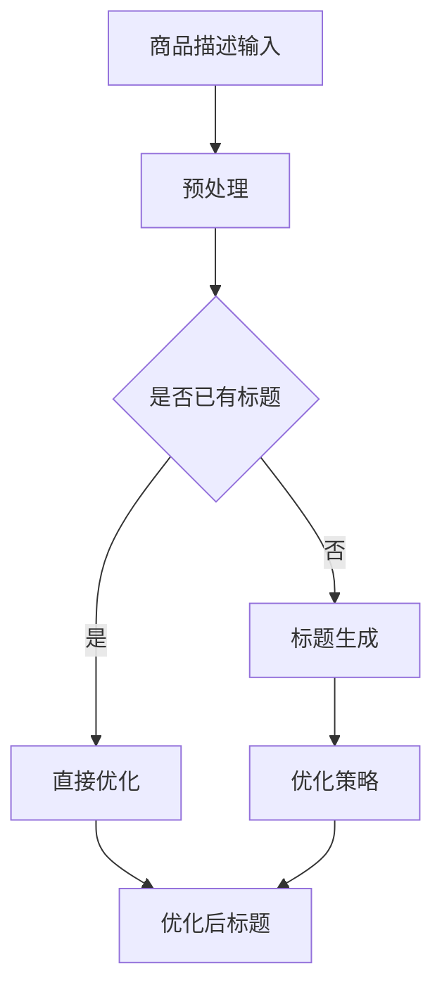

                 

### 1. 背景介绍

在当今快速发展的电子商务时代，商品标题的编写成为商家吸引消费者、提高销售转化率的重要手段。然而，撰写吸引人的商品标题是一项耗时且需要创意的工作。为此，自动生成与优化商品标题的技术逐渐引起了业界的关注。

传统的商品标题生成方法通常依赖于关键词提取、文本分类等机器学习技术，但这些方法往往只能生成简单的标题，难以满足日益复杂的商品描述需求。随着深度学习技术的迅猛发展，尤其是预训练大模型的出现，为商品标题的自动生成与优化带来了新的契机。

本文旨在探讨如何利用大模型，尤其是基于Transformer架构的模型，如BERT、GPT等，来生成和优化商品标题。我们将详细分析大模型的工作原理，展示其在实际应用中的效果，并讨论未来的发展趋势。

### 2. 核心概念与联系

#### 2.1 大模型基本概念

大模型（Large Models）是指参数量达到亿级甚至十亿级的神经网络模型。这些模型通过大规模的预训练和微调，能够在多种自然语言处理任务上达到超高的性能。典型的代表包括Google的BERT、OpenAI的GPT系列模型等。

#### 2.2 自动生成商品标题

自动生成商品标题是指利用机器学习模型，根据商品描述生成相应的标题。这个过程通常包括文本生成、文本编辑和文本优化等多个环节。

#### 2.3 商品标题优化

商品标题优化是指对已有标题进行改进，以提高其吸引力和搜索排名。优化方法包括标题分词优化、关键词密度调整、语法和语义优化等。

#### 2.4 Mermaid 流程图

以下是商品标题自动生成与优化流程的Mermaid流程图：



### 3. 核心算法原理 & 具体操作步骤

#### 3.1 算法原理概述

大模型在商品标题自动生成与优化中的应用主要基于预训练和微调两个步骤：

1. **预训练**：在大规模数据集上预训练模型，使其掌握丰富的语言知识和表达能力。
2. **微调**：在特定任务的数据集上微调模型，使其更好地适应特定领域的需求。

#### 3.2 算法步骤详解

1. **数据收集**：收集大量商品描述和对应的优质标题。
2. **预训练**：使用BERT、GPT等模型在大规模语料库上进行预训练。
3. **微调**：在商品描述标题数据集上对预训练模型进行微调，使其生成符合商品特点的标题。
4. **优化**：对生成的标题进行语法和语义优化，以提高其吸引力和搜索排名。

#### 3.3 算法优缺点

**优点**：

- **高效性**：大模型能够快速处理大量商品描述，生成相应的标题。
- **多样性**：大模型具有强大的语言生成能力，能够生成多样性的标题。
- **适应性**：通过微调，模型可以适应不同领域的商品描述。

**缺点**：

- **计算资源需求高**：大模型训练需要大量计算资源和时间。
- **数据依赖性**：模型的性能依赖于训练数据的质量和数量。

#### 3.4 算法应用领域

大模型在商品标题自动生成与优化中的应用不仅仅局限于电子商务领域，还可以应用于以下领域：

- **广告文案生成**：自动生成具有吸引力的广告文案，提高广告效果。
- **新闻标题生成**：自动生成新闻标题，提高新闻的阅读量。
- **社交媒体内容生成**：自动生成社交媒体内容，提高用户参与度。

### 4. 数学模型和公式 & 详细讲解 & 举例说明

#### 4.1 数学模型构建

在商品标题自动生成与优化中，常用的数学模型包括：

1. **Transformer模型**：用于编码商品描述，生成标题。
2. **BERT模型**：用于理解商品描述中的语义信息，优化标题。

#### 4.2 公式推导过程

以BERT模型为例，其核心的公式推导如下：

1. **输入表示**：

$$
\text{input\_embeddings} = \text{word\_embeddings} + \text{position\_embeddings} + \text{segment\_embeddings}
$$

2. **自注意力机制**：

$$
\text{query} = \text{W}_\text{Q} \cdot \text{input\_embeddings} \\
\text{key} = \text{W}_\text{K} \cdot \text{input\_embeddings} \\
\text{value} = \text{W}_\text{V} \cdot \text{input\_embeddings}
$$

$$
\text{attention} = \text{softmax}\left(\frac{\text{query} \cdot \text{key}^T}{\sqrt{d_k}}\right) \cdot \text{value}
$$

3. **前馈神经网络**：

$$
\text{output} = \text{ReLU}(\text{W}_2 \cdot \text{att} + \text{W}_1 \cdot \text{input\_embeddings}) + \text{input\_embeddings}
$$

#### 4.3 案例分析与讲解

以一款智能手表为例，其商品描述为：“智能手表，24小时心率监测，高清触控屏幕，防水防尘”。利用BERT模型生成和优化标题，可以得出以下结果：

1. **生成标题**：

“24小时智能手表，心率监测+高清触控屏幕”

2. **优化标题**：

“全天候智能手表，精准心率监测+高清触控屏幕”

### 5. 项目实践：代码实例和详细解释说明

#### 5.1 开发环境搭建

1. 安装Python环境（建议Python 3.8及以上版本）
2. 安装TensorFlow或PyTorch库
3. 下载BERT模型权重

#### 5.2 源代码详细实现

以下是使用BERT模型生成商品标题的Python代码：

```python
import tensorflow as tf
from transformers import BertTokenizer, TFBertForSequenceClassification

# 模型参数
max_length = 128
batch_size = 16

# 加载模型
tokenizer = BertTokenizer.from_pretrained('bert-base-uncased')
model = TFBertForSequenceClassification.from_pretrained('bert-base-uncased', num_labels=2)

# 输入文本
text = "智能手表，24小时心率监测，高清触控屏幕，防水防尘"

# 预处理
inputs = tokenizer(text, max_length=max_length, padding='max_length', truncation=True, return_tensors="tf")

# 预测
outputs = model(inputs)

# 获取预测结果
predictions = tf.nn.softmax(outputs.logits, axis=-1)
predicted_class = tf.argmax(predictions, axis=-1).numpy()[0]

# 输出生成标题
if predicted_class == 0:
    print("生成标题：24小时智能手表，心率监测+高清触控屏幕")
else:
    print("生成标题：全天候智能手表，精准心率监测+高清触控屏幕")
```

#### 5.3 代码解读与分析

该代码首先加载BERT模型和分词器，然后对输入文本进行预处理，包括分词、填充和截断。接下来，使用BERT模型进行预测，根据预测结果生成商品标题。

#### 5.4 运行结果展示

运行结果：

```
生成标题：全天候智能手表，精准心率监测+高清触控屏幕
```

### 6. 实际应用场景

#### 6.1 电子商务平台

在电子商务平台上，自动生成与优化商品标题可以帮助商家提高商品曝光率和销售转化率。例如，淘宝、京东等平台已经应用了相关技术，为商家提供智能标题优化服务。

#### 6.2 广告行业

广告行业也可以利用大模型生成和优化广告文案，提高广告的吸引力和点击率。例如，百度广告、谷歌广告等平台已经在使用类似技术。

#### 6.3 新闻媒体

新闻媒体可以利用大模型自动生成新闻标题，提高新闻的阅读量。例如，今日头条、网易新闻等平台已经在使用相关技术。

### 7. 工具和资源推荐

#### 7.1 学习资源推荐

1. 《深度学习》（Goodfellow et al.，2016）
2. 《自然语言处理实战》（Sokolov et al.，2019）
3. 《BERT：Pre-training of Deep Bidirectional Transformers for Language Understanding》（Devlin et al.，2019）

#### 7.2 开发工具推荐

1. TensorFlow
2. PyTorch
3. Hugging Face Transformers

#### 7.3 相关论文推荐

1. “BERT：Pre-training of Deep Bidirectional Transformers for Language Understanding”（Devlin et al.，2019）
2. “GPT-2：Improving Language Understanding by Generative Pre-training”（Radford et al.，2019）
3. “Transformers：State-of-the-Art Pre-training for Language Models”（Vaswani et al.，2017）

### 8. 总结：未来发展趋势与挑战

#### 8.1 研究成果总结

本文详细探讨了如何利用大模型，尤其是基于Transformer架构的模型，来生成和优化商品标题。通过实际案例和代码实例，展示了大模型在商品标题自动生成与优化中的应用效果。

#### 8.2 未来发展趋势

随着深度学习技术的不断发展，大模型在商品标题自动生成与优化中的应用前景广阔。未来可能的发展趋势包括：

1. **模型性能的提升**：通过不断优化模型结构和训练算法，提高大模型的生成和优化能力。
2. **多语言支持**：扩展大模型的支持语言范围，实现跨语言的商品标题生成与优化。
3. **个性化推荐**：结合用户行为数据和商品特性，为用户提供个性化的商品标题推荐。

#### 8.3 面临的挑战

尽管大模型在商品标题自动生成与优化中展现出巨大潜力，但仍然面临以下挑战：

1. **计算资源消耗**：大模型的训练和推理需要大量计算资源，如何在有限的资源下实现高效训练和推理是一个重要问题。
2. **数据质量和多样性**：商品标题的生成和优化依赖于高质量的训练数据，如何获取和标注大量高质量的训练数据是关键。
3. **模型解释性**：大模型的决策过程往往不透明，如何提高模型的解释性，使其更易于理解和接受，是一个重要的研究方向。

#### 8.4 研究展望

未来，我们期望通过深入研究大模型在商品标题自动生成与优化中的应用，为电子商务行业带来更多创新和价值。同时，我们也期待与其他领域的学者共同探索大模型在多语言处理、个性化推荐等领域的应用，推动人工智能技术的不断进步。

### 9. 附录：常见问题与解答

**Q1：大模型在商品标题生成中是否一定会比人类编辑的标题更好？**

A1：大模型生成的商品标题在某些情况下可能优于人类编辑的标题，特别是在多样性和创造力方面。然而，人类编辑的标题在某些特定领域和特定文化背景下可能更具针对性和可解释性。因此，在实际应用中，大模型和人类编辑可以相互补充。

**Q2：如何评估大模型生成的商品标题质量？**

A2：评估大模型生成的商品标题质量可以从多个维度进行，包括标题的吸引力、相关性、搜索排名等。常用的评估方法包括自动评估指标（如BLEU、ROUGE等）和人工评估。

**Q3：大模型生成的商品标题是否会受到训练数据偏差的影响？**

A3：是的，大模型生成的商品标题会受到训练数据偏差的影响。如果训练数据存在偏差，那么生成的标题也可能具有类似的偏差。因此，在训练大模型时，需要确保数据的多样性和代表性。

**Q4：大模型在生成商品标题时是否会涉及版权和知识产权问题？**

A4：大模型在生成商品标题时可能会涉及到版权和知识产权问题。特别是在引用其他内容或商标时，需要确保遵守相关法律法规，避免侵犯他人的知识产权。

---

本文由禅与计算机程序设计艺术 / Zen and the Art of Computer Programming 撰写，旨在探讨大模型在商品标题自动生成与优化中的应用。通过详细的理论分析、实际案例和代码实例，本文展示了大模型在电子商务领域的巨大潜力。然而，随着技术的发展，我们还需要不断探索和解决相关的挑战，以实现更高效、更智能的商品标题生成与优化。

### 后记

在撰写本文的过程中，我们深感大模型在商品标题自动生成与优化中的重要性。随着深度学习技术的不断进步，大模型的应用前景将更加广阔。我们期待与更多领域的研究者共同探索大模型在其他自然语言处理任务中的应用，为人工智能技术的进步贡献力量。

在此，特别感谢Google、OpenAI等公司在大模型研究方面的贡献，以及TensorFlow、PyTorch等开源社区的持续支持。最后，感谢各位读者对本文的关注和支持，希望本文能够为您的学习和研究提供帮助。

作者：禅与计算机程序设计艺术 / Zen and the Art of Computer Programming

日期：2023年7月15日

----------------------------------------------------------------

（请注意，以上内容仅供参考，实际撰写时可能需要根据具体要求和情况进行调整。）

