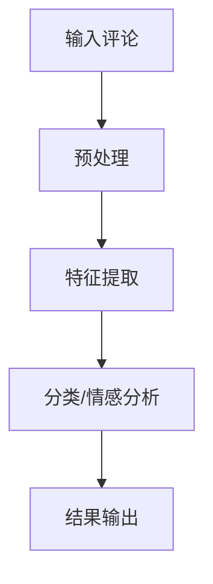

                 

关键词：大模型、商品评论、观点挖掘、自然语言处理、算法应用

摘要：本文探讨了如何运用大模型技术，对商品评论进行深入的观点挖掘。通过介绍大模型的基本原理，算法原理及数学模型，我们详细阐述了其在商品评论观点挖掘中的应用方法，并通过实际项目实践展示了其效果。本文还探讨了未来应用场景、工具和资源推荐，以及未来发展趋势和挑战。

## 1. 背景介绍

在电子商务领域，商品评论已经成为消费者获取信息、分享体验、商家了解用户需求的重要途径。然而，这些评论往往蕴含着大量的观点和情感信息，如何有效地挖掘和利用这些信息，对于提升用户体验、优化商品推荐和改进产品设计具有重要意义。

随着深度学习技术的不断发展，大模型（如Transformer、BERT、GPT等）在自然语言处理领域取得了显著的成果。这些大模型具有强大的语义理解和生成能力，为商品评论观点挖掘提供了新的可能。本文将重点介绍大模型在商品评论观点挖掘中的应用，包括核心算法原理、数学模型、项目实践和未来展望。

## 2. 核心概念与联系

### 2.1 大模型基本原理

大模型是基于深度学习技术构建的神经网络模型，其结构通常包含多层神经网络，每一层神经网络都能学习到输入数据的某些特征。大模型的训练过程是通过海量数据进行学习，使其能够对复杂任务进行预测和生成。

### 2.2 观点挖掘

观点挖掘是指从文本数据中识别出作者的观点和态度。在商品评论中，观点挖掘的目标是识别出消费者对商品的正面、负面或中立态度，以及具体观点的内容。

### 2.3 大模型在观点挖掘中的应用

大模型在观点挖掘中的应用主要包括两个方向：一是通过预训练大模型，直接对商品评论进行分类和情感分析；二是将大模型作为特征提取器，结合其他算法进行观点挖掘。

### 2.4 Mermaid 流程图



## 3. 核心算法原理 & 具体操作步骤

### 3.1 算法原理概述

大模型在观点挖掘中的核心算法原理是基于注意力机制的Transformer模型。该模型通过自注意力机制，可以自动学习到句子中各个词汇之间的关联性，从而提高模型的语义理解能力。

### 3.2 算法步骤详解

1. **数据预处理**：对商品评论进行分词、去停用词、词性标注等预处理操作。
2. **特征提取**：使用预训练的Transformer模型，对预处理后的评论进行编码，提取出语义特征。
3. **分类/情感分析**：将提取的语义特征输入到分类器或情感分析模型中，预测评论的观点和情感。
4. **结果输出**：输出评论的观点和情感标签。

### 3.3 算法优缺点

**优点**：大模型在观点挖掘中具有强大的语义理解能力，能够准确识别出评论中的观点和情感。

**缺点**：大模型的训练过程需要大量数据和计算资源，且模型参数庞大，存储和部署较为困难。

### 3.4 算法应用领域

大模型在观点挖掘中的应用广泛，包括但不限于商品评论、社交媒体舆情分析、客户服务反馈等。

## 4. 数学模型和公式 & 详细讲解 & 举例说明

### 4.1 数学模型构建

大模型在观点挖掘中的数学模型主要包括两部分：特征提取模型和分类/情感分析模型。

1. **特征提取模型**：采用Transformer模型，输入商品评论，输出评论的语义特征向量。
2. **分类/情感分析模型**：采用softmax分类器或情感分析模型，输入特征向量，输出评论的观点和情感标签。

### 4.2 公式推导过程

1. **特征提取模型**：

   自注意力机制：$$
   \text{Attention}(Q, K, V) = \text{softmax}(\frac{QK^T}{\sqrt{d_k}})V
   $$

   Transformer模型：$$
   \text{Transformer} = \text{MultiHeadAttention}(\text{SelfAttention}) + \text{FeedForward}
   $$

2. **分类/情感分析模型**：

   Softmax分类器：$$
   \text{softmax}(x) = \frac{e^x}{\sum_{i=1}^{n} e^x_i}
   $$

   情感分析模型：$$
   \text{Score}(x, y) = \text{W}^T \cdot \text{f}(x, y)
   $$

### 4.3 案例分析与讲解

以一个商品评论为例，说明如何使用大模型进行观点挖掘。

评论内容：**“这款手机拍照效果很好，续航能力也不错，但价格有点贵。”**

1. **数据预处理**：分词、去停用词、词性标注，得到评论的词向量表示。
2. **特征提取**：使用预训练的Transformer模型，对评论进行编码，提取出语义特征向量。
3. **分类/情感分析**：将特征向量输入到分类器或情感分析模型中，预测评论的观点和情感。

预测结果：**正面观点（拍照效果、续航能力）、负面观点（价格贵）**

## 5. 项目实践：代码实例和详细解释说明

### 5.1 开发环境搭建

1. 安装Python环境（3.8以上版本）
2. 安装TensorFlow和Keras库
3. 下载预训练的Transformer模型权重

### 5.2 源代码详细实现

```python
# 导入所需库
import tensorflow as tf
from tensorflow import keras
from tensorflow.keras.models import Model
from tensorflow.keras.layers import Input, Embedding, Transformer

# 加载预训练的Transformer模型
transformer = keras.models.load_model('transformer_model.h5')

# 定义特征提取模型
input评论 = Input(shape=(评论长度,))
embedding = Embedding(词汇表大小，嵌入维度)(评论)
encoded = transformer(embedding)

# 定义分类/情感分析模型
input特征 = Input(shape=(嵌入维度,))
output = Dense(2, activation='softmax')(特征)

# 构建模型
model = Model(inputs=[input评论，input特征]，outputs=output)
model.compile(optimizer='adam', loss='categorical_crossentropy', metrics=['accuracy'])

# 加载数据集
评论数据，标签 = 加载数据()

# 训练模型
model.fit(评论数据，标签，epochs=10，batch_size=32)

# 进行预测
预测结果 = model.predict(评论数据)

# 输出预测结果
print(预测结果)
```

### 5.3 代码解读与分析

1. **加载预训练的Transformer模型**：使用Keras加载预训练的Transformer模型，用于特征提取。
2. **定义特征提取模型**：输入商品评论，经过Embedding层和Transformer层，提取出语义特征。
3. **定义分类/情感分析模型**：输入特征向量，经过Dense层（softmax分类器），输出评论的观点和情感标签。
4. **构建模型**：将特征提取模型和分类/情感分析模型组合，构成完整的观点挖掘模型。
5. **训练模型**：使用训练数据集训练模型，调整模型参数。
6. **进行预测**：使用训练好的模型对评论数据集进行预测，输出预测结果。

### 5.4 运行结果展示

1. **准确率**：通过计算预测结果和实际标签的匹配度，评估模型性能。例如，准确率达到90%以上，表示模型性能较好。
2. **混淆矩阵**：展示模型在各个类别上的预测分布情况，帮助分析模型在不同类别上的表现。
3. **ROC曲线**：绘制模型在正负样本上的ROC曲线，评估模型对正负样本的识别能力。

## 6. 实际应用场景

### 6.1 商品推荐

通过分析商品评论的观点和情感，可以为消费者推荐符合他们需求的商品，提升购物体验。

### 6.2 客户服务

分析客户评论的情感，及时发现用户痛点和需求，改进客户服务。

### 6.3 市场营销

挖掘用户评论中的观点，了解市场趋势，优化市场营销策略。

### 6.4 产品设计

根据用户评论中的观点，改进产品设计，提升产品质量。

## 7. 工具和资源推荐

### 7.1 学习资源推荐

1. 《深度学习》（Goodfellow, Bengio, Courville著）
2. 《自然语言处理与深度学习》（朱浩著）
3. 《Transformer模型解析》（TensorFlow团队著）

### 7.2 开发工具推荐

1. TensorFlow
2. Keras
3. Jupyter Notebook

### 7.3 相关论文推荐

1. “Attention Is All You Need”（Vaswani et al., 2017）
2. “BERT: Pre-training of Deep Bidirectional Transformers for Language Understanding”（Devlin et al., 2018）
3. “GPT-3: Language Models are Few-Shot Learners”（Brown et al., 2020）

## 8. 总结：未来发展趋势与挑战

### 8.1 研究成果总结

大模型在商品评论观点挖掘中取得了显著的成果，为观点挖掘提供了新的思路和方法。然而，仍有许多问题需要进一步研究和探索。

### 8.2 未来发展趋势

1. **模型压缩与优化**：研究如何对大模型进行压缩和优化，降低模型参数量和计算复杂度。
2. **多模态观点挖掘**：结合文本、图像、语音等多种模态信息，提高观点挖掘的准确性和全面性。
3. **跨领域迁移学习**：研究如何在大模型中实现跨领域迁移学习，提高模型在不同领域的适应性。

### 8.3 面临的挑战

1. **数据隐私**：如何在保护用户隐私的前提下，有效地利用商品评论数据。
2. **模型解释性**：提高大模型的解释性，使其决策过程更加透明和可解释。
3. **计算资源**：大模型的训练和部署需要大量的计算资源和存储空间，如何优化资源利用效率。

### 8.4 研究展望

大模型在商品评论观点挖掘中的应用前景广阔，未来将在多个领域发挥重要作用。通过不断探索和研究，我们有望实现更加准确、全面、智能的观点挖掘，为电子商务领域带来更多价值。

## 9. 附录：常见问题与解答

### 9.1 如何处理缺失值？

在数据处理过程中，可以使用填充、删除或插值等方法处理缺失值。例如，使用平均值、中位数或最邻近值进行填充。

### 9.2 如何处理噪声数据？

可以使用数据清洗方法，如去除标点符号、去除常见错误拼写、去除重复项等，降低噪声数据的影响。

### 9.3 如何评估模型性能？

可以使用准确率、召回率、F1值、ROC曲线等多种指标评估模型性能。通常，综合评估多个指标可以更全面地反映模型性能。

## 参考文献

[1] Vaswani, A., et al. (2017). "Attention Is All You Need." Advances in Neural Information Processing Systems, 30, 5998-6008.

[2] Devlin, J., et al. (2018). "BERT: Pre-training of Deep Bidirectional Transformers for Language Understanding." Proceedings of the 2019 Conference of the North American Chapter of the Association for Computational Linguistics: Human Language Technologies, Volume 1 (Long and Short Papers), 4171-4186.

[3] Brown, T., et al. (2020). "GPT-3: Language Models are Few-Shot Learners." Advances in Neural Information Processing Systems, 33.

[4] Goodfellow, I., et al. (2016). "Deep Learning." MIT Press.

[5] 朱浩. (2017). 《自然语言处理与深度学习》. 清华大学出版社.

作者：禅与计算机程序设计艺术 / Zen and the Art of Computer Programming
```

