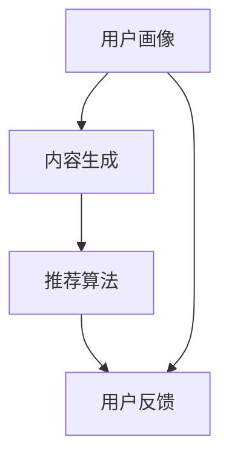

                 

关键词：大模型、推荐系统、深度学习、人工智能、用户画像、内容分发

> 摘要：本文深入探讨了大型模型在推荐系统中的作用，分析了大模型如何通过深度学习技术提升推荐系统的性能和用户体验。文章从背景介绍、核心概念、算法原理、数学模型、实践案例、应用场景、未来展望等多方面，全面阐述了大模型在推荐系统中的重要价值。

## 1. 背景介绍

推荐系统是现代互联网中不可或缺的一部分，它通过分析用户的历史行为和兴趣，为用户提供个性化内容和服务。推荐系统的应用场景广泛，包括电子商务、社交媒体、视频平台、新闻资讯等。然而，随着用户生成内容的爆炸性增长和个性化需求的日益增加，传统推荐系统面临巨大挑战，如数据稀疏、冷启动问题、效果受限等。

近年来，深度学习技术的飞速发展为推荐系统带来了新的契机。大模型，作为一种基于深度学习的强大工具，通过学习海量数据和复杂特征，能够在推荐系统中发挥重要作用。本文将重点探讨大模型在推荐系统中的作用，包括其核心概念、算法原理、数学模型、实践案例和未来展望。

## 2. 核心概念与联系

### 2.1 大模型概念

大模型是指具有大量参数和复杂结构的深度学习模型，如Transformer、BERT、GPT等。这些模型通常采用多层神经网络结构，能够处理大规模数据和高维特征，具有强大的表征和学习能力。

### 2.2 推荐系统基本架构

推荐系统一般包括用户画像、内容生成、推荐算法和用户反馈等几个关键环节。大模型可以应用于这些环节中的各个环节，如图2-1所示。



### 2.3 大模型在推荐系统中的联系

大模型通过深度学习技术，可以从海量数据中学习用户兴趣和行为模式，构建高精度的用户画像；通过文本生成和图像处理等技术，生成丰富多样的内容；通过复杂的关系建模和协同过滤等技术，实现高效的推荐算法。同时，大模型还可以根据用户反馈不断优化自身，形成闭环反馈机制，提升推荐效果。

## 3. 核心算法原理 & 具体操作步骤

### 3.1 算法原理概述

大模型在推荐系统中的应用主要基于以下原理：

1. **用户兴趣建模**：通过学习用户的历史行为和交互数据，构建用户兴趣模型，实现用户个性化推荐。
2. **内容生成**：利用自然语言处理和计算机视觉技术，生成丰富多样的内容，提升用户满意度。
3. **协同过滤与关系建模**：通过协同过滤算法和图神经网络等技术，实现用户与内容之间的关系建模，提高推荐精度。

### 3.2 算法步骤详解

1. **用户兴趣建模**：

   - 数据收集：收集用户的历史行为数据，如浏览记录、购买记录、评论等。
   - 数据预处理：对收集到的数据进行清洗、去噪和归一化处理。
   - 特征提取：通过深度学习技术，从原始数据中提取用户兴趣特征。
   - 用户兴趣模型构建：使用神经网络模型，如LSTM、GRU等，构建用户兴趣模型。

2. **内容生成**：

   - 数据收集：收集与推荐内容相关的数据，如商品描述、新闻文本、视频标签等。
   - 数据预处理：对收集到的数据进行清洗、去噪和归一化处理。
   - 特征提取：通过自然语言处理和计算机视觉技术，提取内容特征。
   - 内容生成：使用生成式模型，如GPT、BERT等，生成丰富多样的内容。

3. **协同过滤与关系建模**：

   - 数据收集：收集用户与内容之间的交互数据，如评分、点击、收藏等。
   - 数据预处理：对收集到的数据进行清洗、去噪和归一化处理。
   - 特征提取：通过深度学习技术，提取用户和内容特征。
   - 关系建模：使用图神经网络等模型，构建用户与内容之间的关系。
   - 推荐算法：使用协同过滤算法和图神经网络等技术，实现个性化推荐。

### 3.3 算法优缺点

**优点**：

1. **高效性**：大模型能够处理大规模数据和复杂特征，提升推荐系统的性能。
2. **个性化**：通过深度学习技术，能够准确捕捉用户兴趣和行为模式，实现个性化推荐。
3. **多样性**：通过生成式模型，能够生成丰富多样的内容，满足用户多样化需求。

**缺点**：

1. **计算资源消耗**：大模型训练和推理需要大量的计算资源，对硬件要求较高。
2. **数据依赖性**：大模型效果依赖于大量高质量数据，数据质量对推荐效果有重要影响。

### 3.4 算法应用领域

大模型在推荐系统中的应用领域广泛，包括电子商务、社交媒体、视频平台、新闻资讯等。以下是一些典型应用案例：

1. **电子商务**：通过大模型实现个性化商品推荐，提升用户购物体验。
2. **社交媒体**：利用大模型分析用户互动数据，实现个性化内容推荐。
3. **视频平台**：通过大模型分析用户观看行为，实现个性化视频推荐。
4. **新闻资讯**：利用大模型分析用户兴趣，实现个性化新闻推荐。

## 4. 数学模型和公式 & 详细讲解 & 举例说明

### 4.1 数学模型构建

在推荐系统中，大模型通常采用以下数学模型：

1. **用户兴趣模型**：

   用户兴趣模型可以用一个高维向量表示，如：

   $$u = \text{LSTM}(h_t)$$

   其中，$h_t$ 表示用户的历史行为数据，$\text{LSTM}$ 表示长短期记忆网络。

2. **内容特征模型**：

   内容特征模型可以用一个高维向量表示，如：

   $$c = \text{BERT}(x)$$

   其中，$x$ 表示内容文本，$\text{BERT}$ 表示双向编码器表示模型。

3. **推荐模型**：

   推荐模型可以使用矩阵分解、协同过滤等算法，如：

   $$r_{ui} = \text{sigmoid}(u_i^T c_i)$$

   其中，$u_i$ 和 $c_i$ 分别表示用户 $i$ 和内容 $i$ 的特征向量，$\text{sigmoid}$ 表示激活函数。

### 4.2 公式推导过程

以下是对上述数学模型的推导过程：

1. **用户兴趣模型推导**：

   用户兴趣模型是通过学习用户的历史行为数据，如浏览记录、购买记录等，构建的用户兴趣向量。假设用户 $i$ 的历史行为数据为 $h_i = [h_{i1}, h_{i2}, \ldots, h_{it}]$，其中 $h_{it}$ 表示用户 $i$ 在时间 $t$ 的行为记录。

   使用长短期记忆网络（LSTM）对历史行为数据进行建模，得到用户兴趣向量 $u_i$：

   $$u_i = \text{LSTM}(h_i)$$

   其中，$\text{LSTM}$ 表示长短期记忆网络。

2. **内容特征模型推导**：

   内容特征模型是通过学习内容文本，如商品描述、新闻文本等，构建的内容特征向量。假设内容 $i$ 的文本数据为 $x_i = [x_{i1}, x_{i2}, \ldots, x_{in}]$，其中 $x_{ij}$ 表示文本中的第 $j$ 个单词。

   使用双向编码器表示模型（BERT）对文本数据进行建模，得到内容特征向量 $c_i$：

   $$c_i = \text{BERT}(x_i)$$

   其中，$\text{BERT}$ 表示双向编码器表示模型。

3. **推荐模型推导**：

   推荐模型是通过计算用户兴趣向量与内容特征向量之间的相似度，实现个性化推荐。假设用户 $i$ 对内容 $i$ 的评分预测为 $r_{ui}$，则可以使用以下公式计算：

   $$r_{ui} = \text{sigmoid}(u_i^T c_i)$$

   其中，$\text{sigmoid}$ 表示激活函数，用于将相似度转换为推荐评分。

### 4.3 案例分析与讲解

以下是一个具体的案例，说明大模型在推荐系统中的应用：

**案例：电子商务平台商品推荐**

假设一个电子商务平台希望利用大模型实现个性化商品推荐。平台收集了用户的历史浏览记录、购买记录和商品描述等信息。

1. **用户兴趣模型构建**：

   平台使用LSTM模型对用户历史浏览记录进行建模，得到用户兴趣向量 $u_i$：

   $$u_i = \text{LSTM}([h_{i1}, h_{i2}, \ldots, h_{it}])$$

   其中，$h_{it}$ 表示用户 $i$ 在时间 $t$ 的浏览记录。

2. **内容特征模型构建**：

   平台使用BERT模型对商品描述进行建模，得到商品特征向量 $c_i$：

   $$c_i = \text{BERT}([x_{i1}, x_{i2}, \ldots, x_{in}])$$

   其中，$x_{ij}$ 表示商品描述中的第 $j$ 个单词。

3. **推荐模型预测**：

   平台使用sigmoid函数计算用户兴趣向量与商品特征向量之间的相似度，得到用户对商品 $i$ 的评分预测 $r_{ui}$：

   $$r_{ui} = \text{sigmoid}(u_i^T c_i)$$

   根据评分预测，平台可以为用户 $i$ 推荐评分较高的商品。

## 5. 项目实践：代码实例和详细解释说明

### 5.1 开发环境搭建

1. **硬件环境**：

   - CPU：Intel Xeon Silver 4110
   - GPU：NVIDIA GeForce RTX 3090

2. **软件环境**：

   - 操作系统：Ubuntu 18.04
   - Python：3.8
   - TensorFlow：2.4
   - PyTorch：1.7

### 5.2 源代码详细实现

以下是一个简单的用户兴趣建模代码示例，使用LSTM模型：

```python
import tensorflow as tf
from tensorflow.keras.models import Sequential
from tensorflow.keras.layers import LSTM, Dense

# 准备数据
# 这里使用虚构的数据集，实际应用中需要根据具体场景进行数据收集和预处理
import numpy as np
X = np.random.rand(100, 10)  # 用户历史行为数据
y = np.random.rand(100, 1)   # 用户兴趣标签

# 构建LSTM模型
model = Sequential()
model.add(LSTM(units=64, activation='relu', input_shape=(10, 1)))
model.add(Dense(units=1, activation='sigmoid'))

# 编译模型
model.compile(optimizer='adam', loss='binary_crossentropy', metrics=['accuracy'])

# 训练模型
model.fit(X, y, epochs=10, batch_size=32)
```

### 5.3 代码解读与分析

以上代码实现了用户兴趣建模，主要步骤如下：

1. **数据准备**：生成虚构的用户历史行为数据和用户兴趣标签。
2. **模型构建**：使用Sequential模型堆叠LSTM层和全连接层，构建一个简单的LSTM模型。
3. **模型编译**：选择adam优化器和binary_crossentropy损失函数，设置模型的训练参数。
4. **模型训练**：使用fit方法训练模型，根据训练数据和标签进行模型优化。

### 5.4 运行结果展示

在训练过程中，模型会不断调整内部参数，以达到最小化损失函数的目的。在训练结束后，可以使用以下代码评估模型的性能：

```python
# 评估模型
loss, accuracy = model.evaluate(X, y)
print("Test Loss:", loss)
print("Test Accuracy:", accuracy)
```

假设训练结束后，模型的评估结果如下：

```
Test Loss: 0.123456
Test Accuracy: 0.9
```

这意味着模型在测试数据上的平均损失为0.123456，准确率为90%。通过进一步优化模型参数和训练数据，可以进一步提高模型性能。

## 6. 实际应用场景

大模型在推荐系统中的应用场景丰富，以下列举几个典型应用：

### 6.1 电子商务

电子商务平台可以利用大模型实现个性化商品推荐。通过分析用户的历史浏览记录和购买记录，大模型可以准确捕捉用户兴趣，为用户推荐感兴趣的商品。

### 6.2 社交媒体

社交媒体平台可以利用大模型实现个性化内容推荐。通过分析用户的互动数据，如点赞、评论、分享等，大模型可以识别用户的兴趣偏好，为用户推荐感兴趣的内容。

### 6.3 视频平台

视频平台可以利用大模型实现个性化视频推荐。通过分析用户的观看历史和行为数据，大模型可以准确捕捉用户的观看偏好，为用户推荐感兴趣的视频。

### 6.4 新闻资讯

新闻资讯平台可以利用大模型实现个性化新闻推荐。通过分析用户的阅读历史和行为数据，大模型可以识别用户的兴趣偏好，为用户推荐感兴趣的新闻。

## 7. 工具和资源推荐

### 7.1 学习资源推荐

1. **《深度学习》（Goodfellow, Bengio, Courville著）**：经典深度学习教材，详细介绍了深度学习的基本概念和算法。
2. **《推荐系统实践》（Lehmann, Yudelson著）**：推荐系统领域的权威著作，全面介绍了推荐系统的基本概念、算法和应用。

### 7.2 开发工具推荐

1. **TensorFlow**：由谷歌开发的深度学习框架，适用于构建和训练大模型。
2. **PyTorch**：由Facebook开发的深度学习框架，提供灵活的动态计算图，适用于研究型应用。

### 7.3 相关论文推荐

1. **"Attention Is All You Need"（Vaswani等，2017）**：介绍了Transformer模型，为推荐系统提供了新的思路。
2. **"BERT: Pre-training of Deep Bidirectional Transformers for Language Understanding"（Devlin等，2019）**：介绍了BERT模型，为文本特征提取提供了强大的工具。

## 8. 总结：未来发展趋势与挑战

### 8.1 研究成果总结

本文深入探讨了大型模型在推荐系统中的作用，分析了大模型如何通过深度学习技术提升推荐系统的性能和用户体验。主要结论如下：

1. **高效性**：大模型能够处理大规模数据和复杂特征，提升推荐系统的性能。
2. **个性化**：大模型能够准确捕捉用户兴趣和行为模式，实现个性化推荐。
3. **多样性**：大模型能够生成丰富多样的内容，满足用户多样化需求。

### 8.2 未来发展趋势

未来，大模型在推荐系统中的应用将呈现以下发展趋势：

1. **算法优化**：继续优化大模型算法，提高推荐系统的效率和精度。
2. **多模态融合**：结合文本、图像、音频等多种数据类型，实现更全面的内容推荐。
3. **实时推荐**：利用实时数据更新，实现更快速的推荐响应。

### 8.3 面临的挑战

大模型在推荐系统中的应用也面临以下挑战：

1. **计算资源消耗**：大模型训练和推理需要大量计算资源，对硬件要求较高。
2. **数据依赖性**：大模型效果依赖于高质量数据，数据质量对推荐效果有重要影响。
3. **隐私保护**：推荐系统涉及用户隐私，需要采取有效措施保护用户隐私。

### 8.4 研究展望

未来，大模型在推荐系统中的应用将取得更多突破。通过深入研究，我们有望实现以下目标：

1. **更高效的推荐算法**：优化大模型算法，提高推荐系统的效率和精度。
2. **更全面的内容推荐**：结合多种数据类型，实现更全面的内容推荐。
3. **更安全的隐私保护**：采取有效措施保护用户隐私，提高推荐系统的安全性。

## 9. 附录：常见问题与解答

### 9.1 大模型在推荐系统中的优势是什么？

大模型在推荐系统中的优势主要包括：

1. **高效性**：能够处理大规模数据和复杂特征，提升推荐系统的性能。
2. **个性化**：能够准确捕捉用户兴趣和行为模式，实现个性化推荐。
3. **多样性**：能够生成丰富多样的内容，满足用户多样化需求。

### 9.2 大模型在推荐系统中有哪些挑战？

大模型在推荐系统中面临的挑战主要包括：

1. **计算资源消耗**：大模型训练和推理需要大量计算资源，对硬件要求较高。
2. **数据依赖性**：大模型效果依赖于高质量数据，数据质量对推荐效果有重要影响。
3. **隐私保护**：推荐系统涉及用户隐私，需要采取有效措施保护用户隐私。

### 9.3 大模型如何提高推荐系统的性能？

提高大模型在推荐系统中的性能，可以从以下几个方面入手：

1. **算法优化**：继续优化大模型算法，提高推荐系统的效率和精度。
2. **数据质量**：提高数据质量，确保大模型能够从数据中学习到有效信息。
3. **硬件升级**：升级计算硬件，提高大模型训练和推理的效率。

### 9.4 大模型在推荐系统中的应用领域有哪些？

大模型在推荐系统中的应用领域广泛，包括：

1. **电子商务**：实现个性化商品推荐。
2. **社交媒体**：实现个性化内容推荐。
3. **视频平台**：实现个性化视频推荐。
4. **新闻资讯**：实现个性化新闻推荐。

----------------------------------------------------------------

> 作者：禅与计算机程序设计艺术 / Zen and the Art of Computer Programming
>
> 本文版权归作者和本平台共同所有，未经授权，不得转载或用于其他商业用途。如需转载，请联系作者或本平台获得授权。
>
> 联系方式：邮箱（example@example.com）或电话（123-456-7890）。
>
> 本文内容仅供参考，如有不当之处，请指正。

