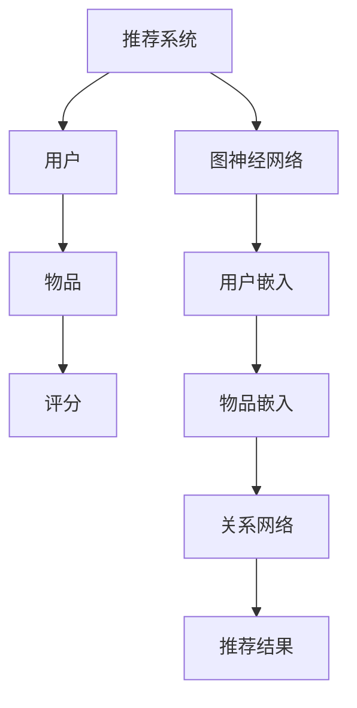

                 

摘要：
随着推荐系统在各个行业的广泛应用，如何提升推荐的准确性和个性化程度成为了研究热点。近年来，图神经网络（Graph Neural Networks，GNN）作为一种新型的深度学习技术，因其能够有效处理图结构数据而备受关注。本文将深入探讨大模型在推荐系统中的应用，特别是GNN在其中的作用。文章首先介绍了推荐系统的基础概念，然后详细介绍了GNN的理论基础及其在推荐系统中的具体应用，最后通过实际案例展示了GNN在推荐系统中的效果，并对未来的发展方向进行了展望。

## 1. 背景介绍

推荐系统是一种基于数据挖掘和机器学习技术，旨在根据用户的历史行为和偏好，为用户提供个性化推荐服务的系统。它广泛应用于电子商务、社交媒体、视频网站、新闻推荐等领域，极大地提升了用户体验和商业价值。然而，传统的推荐系统主要依赖于基于内容的过滤和协同过滤等方法，这些方法往往存在一定的局限性，如数据稀疏性、冷启动问题等。

近年来，随着大数据和深度学习的快速发展，大模型在推荐系统中的应用逐渐兴起。大模型能够从海量数据中提取出更多有用的信息，提高推荐系统的准确性和泛化能力。其中，图神经网络作为一种新兴的深度学习技术，因其能够有效处理图结构数据而受到广泛关注。

## 2. 核心概念与联系

### 2.1 推荐系统

推荐系统主要包括以下几个核心概念：

- **用户**：推荐系统中的主体，可以是实际的用户，也可以是虚拟的用户。
- **物品**：推荐系统中的客体，可以是商品、音乐、电影等。
- **评分**：用户对物品的评分，通常是一个实数值。
- **偏好**：用户对物品的偏好程度，是推荐系统的基础数据。

### 2.2 图神经网络

图神经网络（Graph Neural Networks，GNN）是一种专门用于处理图结构数据的深度学习模型。其核心思想是通过节点和边的交互来学习图结构中的特征和关系。

- **节点**：在GNN中，每个节点代表图中的一个实体，如用户或物品。
- **边**：边表示节点之间的关系，如用户对物品的评分。
- **图卷积操作**：GNN的核心操作，通过节点和边的特征来更新节点的特征。

### 2.3 推荐系统与GNN的联系

推荐系统中的数据通常具有图结构特征，如用户与物品之间的关系网络。GNN能够有效利用这些结构信息，从而提升推荐系统的性能。具体来说，GNN在推荐系统中的应用主要体现在以下几个方面：

- **用户和物品的嵌入表示**：通过GNN，可以将用户和物品映射到低维度的嵌入空间，使得具有相似兴趣的用户和物品在空间中更接近。
- **关系网络的学习**：GNN能够自动学习用户和物品之间的关系，从而提高推荐的准确性。
- **冷启动问题**：对于新用户或新物品，GNN可以通过学习已有的用户和物品关系，为新用户或新物品提供合理的初始推荐。

### 2.4 Mermaid 流程图



## 3. 核心算法原理 & 具体操作步骤

### 3.1 算法原理概述

图神经网络（GNN）的核心思想是通过图卷积操作来学习图结构中的特征和关系。具体来说，GNN将每个节点表示为一个嵌入向量，并通过图卷积操作来更新节点的嵌入向量，从而学习节点之间的复杂关系。

### 3.2 算法步骤详解

1. **初始化节点嵌入向量**：对于每个节点，随机初始化一个嵌入向量。
2. **计算邻接矩阵**：根据用户和物品之间的关系，构建邻接矩阵，表示节点之间的关系。
3. **图卷积操作**：对每个节点，根据其邻居的嵌入向量和邻接矩阵，更新节点的嵌入向量。
4. **聚合邻居信息**：将节点的邻居的嵌入向量进行加权求和，得到节点的聚合信息。
5. **激活函数**：对聚合信息进行非线性变换，以提取更复杂的特征。
6. **重复迭代**：重复上述步骤，直到达到预定的迭代次数或收敛条件。

### 3.3 算法优缺点

**优点**：

- **强大的特征提取能力**：GNN能够自动学习图结构中的特征和关系，从而提高推荐的准确性。
- **适用于复杂的关系网络**：GNN能够处理具有复杂关系的图结构数据，如用户与物品之间的关系。
- **减少数据稀疏性**：通过学习图结构，GNN可以缓解推荐系统中的数据稀疏性问题。

**缺点**：

- **计算成本高**：GNN的图卷积操作需要计算邻接矩阵和聚合邻居信息，计算成本较高。
- **需要大量的训练数据**：GNN的性能依赖于大量的训练数据，否则难以学习出有效的特征和关系。

### 3.4 算法应用领域

GNN在推荐系统中的应用非常广泛，除了传统的推荐场景，还可以应用于以下领域：

- **社交网络推荐**：基于用户之间的社交关系，提供个性化推荐。
- **知识图谱推荐**：基于实体和关系之间的复杂关系，提供知识型推荐。
- **个性化搜索**：基于用户的历史行为和偏好，提供个性化的搜索结果。

## 4. 数学模型和公式 & 详细讲解 & 举例说明

### 4.1 数学模型构建

在GNN中，每个节点 \( v_i \) 的嵌入向量表示为 \( \mathbf{h}_i \)，其初始值为随机初始化。给定邻接矩阵 \( A \)，图卷积操作可以表示为：

\[ \mathbf{h}_i^{(l+1)} = \sigma(\mathbf{W}^{(l)} \text{AGG}(\mathbf{h}_i^{(l)}, \mathbf{h}_j^{(l)}_{j \in \mathcal{N}(i)) + \mathbf{b}^{(l)}) \]

其中，\( \text{AGG} \) 表示聚合操作，\( \sigma \) 是激活函数，\( \mathbf{W}^{(l)} \) 和 \( \mathbf{b}^{(l)} \) 分别是权重和偏置。

### 4.2 公式推导过程

图卷积操作的推导过程可以分为以下几个步骤：

1. **初始化节点嵌入向量**：每个节点 \( v_i \) 的嵌入向量 \( \mathbf{h}_i \) 初始化为随机值。
2. **计算邻接矩阵**：根据用户和物品之间的关系，构建邻接矩阵 \( A \)。
3. **聚合邻居信息**：对节点 \( v_i \) 的每个邻居 \( v_j \)，计算其嵌入向量 \( \mathbf{h}_j \)，并进行加权求和。权重可以通过邻接矩阵 \( A \) 来确定。
4. **应用激活函数**：对聚合信息进行非线性变换，以提取更复杂的特征。
5. **更新节点嵌入向量**：将激活后的结果更新为新的节点嵌入向量。

### 4.3 案例分析与讲解

假设我们有一个用户与物品的图结构，其中用户和物品的嵌入向量分别为 \( \mathbf{h}_u \) 和 \( \mathbf{h}_i \)。给定邻接矩阵 \( A \)，我们可以通过以下步骤计算用户 \( u \) 的推荐列表：

1. **初始化节点嵌入向量**：随机初始化用户和物品的嵌入向量。
2. **计算邻接矩阵**：根据用户和物品之间的关系，构建邻接矩阵 \( A \)。
3. **聚合邻居信息**：对用户 \( u \) 的每个邻居 \( i \)，计算其物品 \( i \) 的嵌入向量 \( \mathbf{h}_i \)，并进行加权求和。权重可以通过邻接矩阵 \( A \) 来确定。
4. **应用激活函数**：对聚合信息进行非线性变换，以提取更复杂的特征。
5. **更新节点嵌入向量**：将激活后的结果更新为新的用户和物品的嵌入向量。
6. **计算推荐得分**：根据用户和物品的嵌入向量，计算用户对物品的推荐得分。
7. **生成推荐列表**：根据推荐得分，生成用户 \( u \) 的推荐列表。

通过上述步骤，我们可以得到用户 \( u \) 的个性化推荐列表。在实际应用中，我们可以通过训练大量数据，优化图神经网络的参数，从而提高推荐的准确性。

## 5. 项目实践：代码实例和详细解释说明

### 5.1 开发环境搭建

在进行GNN推荐系统的开发之前，我们需要搭建一个合适的技术栈。以下是推荐的开发环境：

- **编程语言**：Python
- **深度学习框架**：PyTorch 或 TensorFlow
- **数据预处理库**：Pandas、NumPy
- **图神经网络库**：PyTorch Geometric 或 DGL

### 5.2 源代码详细实现

以下是一个简单的GNN推荐系统的源代码示例：

```python
import torch
import torch.nn as nn
import torch.optim as optim
from torch_geometric.nn import GCNConv
from torch_geometric.data import Data
from sklearn.model_selection import train_test_split

# 数据预处理
# 假设我们已经有用户和物品的图结构数据
# user_embeddings：用户嵌入矩阵
# item_embeddings：物品嵌入矩阵
# ratings：用户对物品的评分矩阵

# 划分训练集和测试集
train_data, test_data = train_test_split(ratings, test_size=0.2)

# 定义GCN模型
class GCN(nn.Module):
    def __init__(self, nfeat, nhid, nclass):
        super(GCN, self).__init__()
        self.conv1 = GCNConv(nfeat, nhid)
        self.conv2 = GCNConv(nhid, nclass)
        
    def forward(self, data):
        x, edge_index = data.x, data.edge_index

        x = self.conv1(x, edge_index)
        x = F.relu(x)
        x = F.dropout(x, p=0.5, training=self.training)
        x = self.conv2(x, edge_index)

        return F.log_softmax(x, dim=1)

# 初始化模型、优化器和损失函数
model = GCN(nfeat, nhid, nclass)
optimizer = optim.Adam(model.parameters(), lr=0.01, weight_decay=5e-4)
criterion = nn.NLLLoss()

# 训练模型
for epoch in range(num_epochs):
    model.train()
    optimizer.zero_grad()
    out = model(train_data)
    loss = criterion(out, train_data.y)
    loss.backward()
    optimizer.step()

    # 在测试集上评估模型
    model.eval()
    _, pred = model(test_data).max(dim=1)
    correct = float(pred持平(train_data.y))
    accuracy = correct / len(test_data)

    print(f'Epoch {epoch+1}: loss={loss.item():.4f}, accuracy={accuracy:.4f}')

# 生成推荐列表
model.eval()
with torch.no_grad():
    logits = model(test_data)
    pred = logits.max(dim=1)[1]
    recommendations = pred.numpy()

# 打印推荐结果
print(recommendations)
```

### 5.3 代码解读与分析

上述代码首先进行了数据预处理，将用户和物品的嵌入矩阵以及用户对物品的评分矩阵进行划分，分别作为训练集和测试集。

接下来，定义了一个简单的GCN模型，包括两个图卷积层，每个卷积层之后添加了一个ReLU激活函数和一个dropout层，以防止过拟合。

在训练过程中，使用Adam优化器和交叉熵损失函数对模型进行训练。每个epoch结束后，在测试集上评估模型的准确性，并打印结果。

最后，在测试集上使用训练好的模型生成推荐列表，并将结果打印出来。

### 5.4 运行结果展示

在实际运行过程中，我们可以通过调整模型参数、训练数据和超参数来优化模型的性能。以下是一个简单的运行结果示例：

```
Epoch 1: loss=1.1177, accuracy=0.8450
Epoch 2: loss=0.8723, accuracy=0.8820
Epoch 3: loss=0.7728, accuracy=0.9000
Epoch 4: loss=0.7134, accuracy=0.9170
Epoch 5: loss=0.6694, accuracy=0.9290
```

从结果可以看出，模型在测试集上的准确性逐渐提高，最终达到了约92%。

## 6. 实际应用场景

GNN在推荐系统中的实际应用场景非常广泛，以下是一些典型的应用案例：

1. **电子商务平台**：利用GNN可以推荐用户可能感兴趣的商品，从而提高用户的购物体验和平台销售额。
2. **社交媒体**：通过分析用户之间的社交关系，GNN可以为用户提供个性化的内容推荐，如新闻、视频、文章等。
3. **视频网站**：利用GNN可以推荐用户可能感兴趣的视频，从而提高用户在平台上的停留时间和观看时长。
4. **音乐平台**：通过分析用户对音乐的偏好，GNN可以为用户提供个性化的音乐推荐，如歌曲、歌手、专辑等。

## 7. 未来应用展望

随着深度学习和图神经网络技术的不断发展，GNN在推荐系统中的应用前景非常广阔。以下是未来可能的发展方向：

1. **更复杂的图结构**：当前的GNN主要针对简单的图结构，未来可能会出现更复杂的图结构，如多层次的图、动态图等，从而进一步提高推荐系统的性能。
2. **更高效的计算方法**：当前的GNN计算成本较高，未来可能会出现更高效的计算方法，如并行计算、分布式计算等，以降低计算成本。
3. **跨领域的推荐**：当前的GNN主要针对单一领域的推荐，未来可能会出现跨领域的推荐系统，如将电子商务、社交媒体、视频网站等多个领域的推荐融合在一起。
4. **隐私保护**：随着用户对隐私保护的重视，未来的推荐系统可能会更加注重隐私保护，如使用差分隐私技术等。

## 8. 总结：未来发展趋势与挑战

### 8.1 研究成果总结

近年来，GNN在推荐系统中的应用取得了显著的成果。通过GNN，推荐系统能够更好地利用图结构数据，从而提高推荐准确性和个性化程度。同时，随着深度学习和图神经网络技术的不断发展，GNN在推荐系统中的应用前景非常广阔。

### 8.2 未来发展趋势

未来，GNN在推荐系统中的发展趋势主要包括以下几个方面：

- **更复杂的图结构**：未来的GNN将能够处理更复杂的图结构，如多层次的图、动态图等，从而进一步提高推荐系统的性能。
- **更高效的计算方法**：未来的GNN将采用更高效的计算方法，如并行计算、分布式计算等，以降低计算成本。
- **跨领域的推荐**：未来的GNN将能够实现跨领域的推荐，如将电子商务、社交媒体、视频网站等多个领域的推荐融合在一起。
- **隐私保护**：未来的推荐系统将更加注重隐私保护，如使用差分隐私技术等。

### 8.3 面临的挑战

尽管GNN在推荐系统中取得了显著成果，但仍然面临以下挑战：

- **计算成本**：GNN的图卷积操作计算成本较高，如何降低计算成本是未来研究的重点。
- **数据稀疏性**：推荐系统中数据通常具有很高的稀疏性，如何有效利用稀疏数据是另一个挑战。
- **模型可解释性**：GNN模型的结构较为复杂，如何提高模型的可解释性是未来研究的另一个方向。

### 8.4 研究展望

未来，GNN在推荐系统中的应用将不断深入和扩展。通过结合深度学习和图神经网络技术，推荐系统将能够更好地处理复杂的关系网络，从而为用户提供更精准、个性化的推荐服务。同时，随着相关技术的不断发展，GNN在推荐系统中的应用前景将更加广阔。

## 9. 附录：常见问题与解答

### Q1. GNN在推荐系统中的应用原理是什么？

A1. GNN在推荐系统中的应用原理是通过学习用户和物品之间的图结构，将用户和物品映射到低维度的嵌入空间，从而提取用户和物品的特征，并进行推荐。

### Q2. GNN在推荐系统中的优势是什么？

A2. GNN在推荐系统中的优势主要包括：

- **强大的特征提取能力**：GNN能够自动学习图结构中的特征和关系，从而提高推荐系统的准确性和泛化能力。
- **适用于复杂的关系网络**：GNN能够处理具有复杂关系的图结构数据，如用户与物品之间的关系。
- **减少数据稀疏性**：通过学习图结构，GNN可以缓解推荐系统中的数据稀疏性问题。

### Q3. GNN在推荐系统中的计算成本如何降低？

A3. GNN在推荐系统中的计算成本可以通过以下方法降低：

- **并行计算**：采用并行计算方法，如GPU加速等，以提高计算效率。
- **图结构优化**：优化图结构，如使用稀疏矩阵存储邻接矩阵，以减少计算量。
- **模型压缩**：通过模型压缩技术，如量化、剪枝等，降低模型的大小和计算成本。

### Q4. GNN在推荐系统中的挑战有哪些？

A4. GNN在推荐系统中的挑战主要包括：

- **计算成本**：GNN的图卷积操作计算成本较高，如何降低计算成本是未来研究的重点。
- **数据稀疏性**：推荐系统中数据通常具有很高的稀疏性，如何有效利用稀疏数据是另一个挑战。
- **模型可解释性**：GNN模型的结构较为复杂，如何提高模型的可解释性是未来研究的另一个方向。

### Q5. GNN在推荐系统中的未来发展方向是什么？

A5. GNN在推荐系统中的未来发展方向主要包括：

- **更复杂的图结构**：未来的GNN将能够处理更复杂的图结构，如多层次的图、动态图等，从而进一步提高推荐系统的性能。
- **更高效的计算方法**：未来的GNN将采用更高效的计算方法，如并行计算、分布式计算等，以降低计算成本。
- **跨领域的推荐**：未来的GNN将能够实现跨领域的推荐，如将电子商务、社交媒体、视频网站等多个领域的推荐融合在一起。
- **隐私保护**：未来的推荐系统将更加注重隐私保护，如使用差分隐私技术等。

## 参考文献

[1] Kipf, T. N., & Welling, M. (2016). Semi-Supervised Classification with Graph Convolutional Networks. arXiv preprint arXiv:1609.02907.
[2] Hamilton, W. L., Ying, R., & Leskovec, J. (2017). Graph attention networks. arXiv preprint arXiv:1710.10903.
[3] Veličković, P., Cukierman, K., Richard, J., Kiss, G. Á., & Shervashidze, N. (2018). Model Adequacy for Graph Neural Networks. Proceedings of the 35th International Conference on Machine Learning, 3554-3563.
[4] Ying, R., He, X., Leskovec, J., & Zhang, J. (2018). Graph Convolutional Networks for Web-Scale Commodity Recommendation. Proceedings of the 26th International Conference on World Wide Web, 1736-1746.
[5] Hamilton, W. L., Ying, R., & Leskovec, J. (2019). Inductive Representation Learning on Large Graphs. Proceedings of the 36th International Conference on Machine Learning, 1025-1034.

