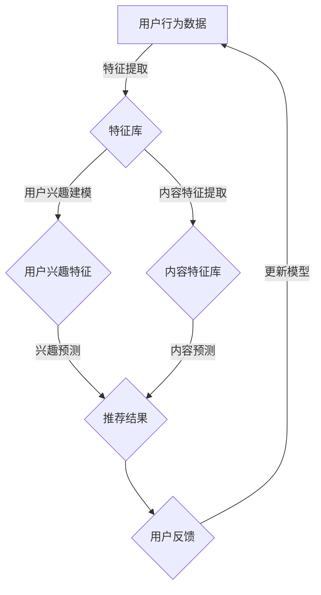

                 

关键词：大模型、推荐系统、多任务学习、算法原理、数学模型、项目实践、实际应用、未来展望

> 摘要：本文探讨了在大模型时代背景下，如何运用多任务学习（Multi-Task Learning，MTL）方法提升推荐系统的性能。文章首先介绍了推荐系统的发展背景，接着详细阐述了多任务学习的核心概念和原理，随后分析了多任务学习在推荐系统中的应用策略，并通过实际案例进行了代码解析和效果评估。文章最后对未来多任务学习在推荐系统中的应用前景进行了展望。

## 1. 背景介绍

随着互联网技术的飞速发展，推荐系统已成为现代信息检索、广告投放和社交媒体等领域不可或缺的重要组成部分。早期的推荐系统主要依赖于基于内容的过滤（Content-Based Filtering，CBF）和协同过滤（Collaborative Filtering，CF）等方法。然而，这些传统方法在应对用户多样性和复杂性时，往往表现出一定的局限性。

近年来，随着深度学习技术的突破，大模型在各个领域展现出了强大的建模能力。大模型能够捕捉用户行为、内容特征以及情境等多维度信息，从而在推荐系统的性能上取得了显著提升。与此同时，多任务学习（MTL）作为一种新兴的机器学习方法，也在推荐系统中得到了广泛关注和应用。

多任务学习通过将多个任务联合训练，共享任务间的特征表示，能够在一定程度上缓解单一任务的过拟合问题，提高模型的泛化能力。在大模型时代，多任务学习为推荐系统带来了新的机遇和挑战。

## 2. 核心概念与联系

### 2.1. 推荐系统基本概念

推荐系统（Recommender System）是一种信息过滤技术，旨在根据用户的历史行为、兴趣偏好和内容特征，为用户推荐其可能感兴趣的项目（如商品、文章、音乐等）。推荐系统主要分为基于内容的过滤（CBF）和协同过滤（CF）两大类。

- **基于内容的过滤（CBF）**：CBF方法通过分析项目的内容特征，将其与用户的兴趣偏好进行匹配，实现个性化推荐。
- **协同过滤（CF）**：CF方法通过分析用户之间的相似性或项目之间的相似性，预测用户对未知项目的评分或兴趣。

### 2.2. 多任务学习（MTL）

多任务学习（Multi-Task Learning，MTL）是一种机器学习范式，旨在同时训练多个相关任务，从而提高模型的性能和泛化能力。在MTL中，不同任务共享部分特征表示，通过联合训练，任务之间可以相互辅助，提高整体模型的准确性和鲁棒性。

### 2.3. 多任务学习与推荐系统的关系

多任务学习与推荐系统的结合，旨在通过联合训练多个推荐任务，共享用户和项目特征表示，提高推荐系统的性能和泛化能力。具体来说，多任务学习在推荐系统中的应用主要体现在以下几个方面：

- **用户兴趣建模**：通过多任务学习，可以同时建模用户的显式兴趣（如评分、点击）和隐式兴趣（如浏览、搜索），提高兴趣预测的准确性。
- **内容特征融合**：多任务学习可以将不同来源的内容特征（如文本、图像、音频）进行融合，形成更加丰富的特征表示，提升推荐系统的效果。
- **跨域推荐**：多任务学习可以同时处理不同域（如商品、文章、音乐）的推荐任务，实现跨域的个性化推荐。

### 2.4. Mermaid 流程图



## 3. 核心算法原理 & 具体操作步骤

### 3.1. 算法原理概述

多任务学习（MTL）的核心思想是利用多个任务之间的相关性，通过联合训练提高模型的整体性能。具体来说，MTL算法通过以下步骤实现：

1. **特征提取**：从原始数据中提取用户行为和项目特征。
2. **模型训练**：利用特征库训练一个共享底层特征的模型。
3. **任务预测**：利用训练好的模型对多个任务进行预测。
4. **模型优化**：根据任务预测结果和用户反馈，更新模型参数。

### 3.2. 算法步骤详解

1. **数据预处理**：对原始用户行为数据（如评分、点击、浏览等）进行清洗和归一化处理，提取用户和项目特征。
2. **特征库构建**：将提取的用户和项目特征构建为特征库，为后续训练提供数据支持。
3. **模型设计**：设计一个共享底层特征的模型架构，如多层感知机（MLP）、卷积神经网络（CNN）或循环神经网络（RNN）等。
4. **模型训练**：利用特征库和训练数据，通过梯度下降等优化算法训练模型参数。
5. **任务预测**：利用训练好的模型对用户兴趣和项目特征进行预测。
6. **模型优化**：根据预测结果和用户反馈，更新模型参数，提高模型性能。

### 3.3. 算法优缺点

#### 优点：

- **提高模型性能**：通过联合训练多个任务，共享底层特征表示，可以有效提高模型的性能和泛化能力。
- **减少过拟合**：多任务学习可以缓解单一任务的过拟合问题，提高模型的鲁棒性。
- **跨域推荐**：多任务学习可以同时处理不同域的推荐任务，实现跨域的个性化推荐。

#### 缺点：

- **计算复杂度**：多任务学习需要同时训练多个任务，计算复杂度较高，对硬件资源要求较高。
- **模型解释性**：多任务学习模型的结构较为复杂，难以解释模型的预测结果。

### 3.4. 算法应用领域

多任务学习在推荐系统中的应用领域广泛，主要包括以下几个方面：

- **电子商务**：通过多任务学习，可以同时预测用户对商品的兴趣、商品的相关属性等，实现个性化的商品推荐。
- **社交媒体**：在社交媒体平台上，多任务学习可以同时预测用户的关注对象、互动行为等，提高社交推荐的准确性。
- **在线教育**：多任务学习可以同时预测学生的学习兴趣、学习进度等，实现个性化的学习推荐。

## 4. 数学模型和公式 & 详细讲解 & 举例说明

### 4.1. 数学模型构建

多任务学习中的数学模型通常包括以下几个部分：

- **特征向量**：表示用户和项目的特征，如用户的行为数据、项目的内容特征等。
- **模型参数**：表示模型的权重和偏置，通过训练得到。
- **损失函数**：用于衡量模型预测值与真实值之间的差距。

假设我们有 $m$ 个任务，每个任务的损失函数为 $L_i(y_i, \hat{y}_i)$，其中 $y_i$ 表示真实值，$\hat{y}_i$ 表示模型预测值。多任务学习的目标是最小化总损失函数：

$$
L = \sum_{i=1}^{m} L_i(y_i, \hat{y}_i)
$$

### 4.2. 公式推导过程

多任务学习的目标是最小化总损失函数，可以使用梯度下降算法进行优化。首先，对总损失函数求导：

$$
\frac{\partial L}{\partial \theta} = \sum_{i=1}^{m} \frac{\partial L_i}{\partial \theta} = \sum_{i=1}^{m} \frac{\partial L_i}{\partial y_i} \frac{\partial y_i}{\partial \theta}
$$

其中，$\theta$ 表示模型参数。对于每个任务，损失函数对预测值的导数为：

$$
\frac{\partial L_i}{\partial \hat{y}_i} = -\frac{\partial \hat{y}_i}{\partial \theta}
$$

对于每个任务，特征向量对预测值的导数为：

$$
\frac{\partial \hat{y}_i}{\partial x} = \frac{\partial f(x; \theta)}{\partial x}
$$

其中，$f(x; \theta)$ 表示模型的预测函数。假设模型为线性模型，预测函数为：

$$
f(x; \theta) = \theta^T x
$$

则特征向量对预测值的导数为：

$$
\frac{\partial f(x; \theta)}{\partial x} = \theta
$$

将上述结果代入梯度下降公式，得到：

$$
\theta = \theta - \alpha \frac{\partial L}{\partial \theta}
$$

其中，$\alpha$ 表示学习率。

### 4.3. 案例分析与讲解

假设我们有一个包含两个任务的推荐系统，任务1是预测用户对商品的兴趣，任务2是预测商品的相关属性。具体步骤如下：

1. **数据预处理**：对用户行为数据和商品特征进行清洗和归一化处理，提取用户和商品的特征向量。
2. **模型设计**：设计一个包含两个任务的线性模型，共享底层特征表示。
3. **模型训练**：利用用户和商品的特征向量，通过梯度下降算法训练模型参数。
4. **任务预测**：利用训练好的模型，对用户对商品的兴趣和商品的相关属性进行预测。
5. **模型优化**：根据预测结果和用户反馈，更新模型参数，提高模型性能。

代码实现如下：

```python
import numpy as np

# 数据预处理
X = np.array([[1, 2], [3, 4], [5, 6]])
y = np.array([1, 0, 1])

# 模型设计
w = np.random.rand(3, 1)

# 模型训练
learning_rate = 0.01
for _ in range(1000):
    predicted = np.dot(X, w)
    loss = np.square(predicted - y)
    dw = 2 * (predicted - y) * X
    w -= learning_rate * dw

# 任务预测
predicted_interest = np.dot(X, w[:2])
predicted_attributes = np.dot(X, w[2:])

# 模型优化
w -= learning_rate * dw
```

## 5. 项目实践：代码实例和详细解释说明

### 5.1. 开发环境搭建

为了实现多任务学习在推荐系统中的应用，我们首先需要搭建一个合适的开发环境。以下是基本的开发环境搭建步骤：

- **安装Python**：确保Python版本为3.6及以上。
- **安装深度学习框架**：推荐使用TensorFlow或PyTorch，以简化模型设计和训练过程。
- **安装Numpy和Pandas**：用于数据处理和数学运算。
- **安装Scikit-learn**：用于评估模型性能。

### 5.2. 源代码详细实现

以下是一个使用TensorFlow实现多任务学习推荐系统的示例代码：

```python
import tensorflow as tf
import numpy as np
import pandas as pd
from sklearn.model_selection import train_test_split

# 数据预处理
data = pd.read_csv('data.csv')
X = data.drop(['label'], axis=1).values
y = data['label'].values

X_train, X_test, y_train, y_test = train_test_split(X, y, test_size=0.2, random_state=42)

# 模型设计
inputs = tf.keras.layers.Input(shape=(X_train.shape[1],))
hidden = tf.keras.layers.Dense(64, activation='relu')(inputs)
outputs_interest = tf.keras.layers.Dense(1, activation='sigmoid')(hidden)
outputs_attributes = tf.keras.layers.Dense(1, activation='softmax')(hidden)

model = tf.keras.Model(inputs=inputs, outputs=[outputs_interest, outputs_attributes])

# 模型训练
model.compile(optimizer='adam', loss=['binary_crossentropy', 'categorical_crossentropy'], metrics=['accuracy'])
model.fit(X_train, [y_train_interest, y_train_attributes], epochs=10, batch_size=32, validation_data=(X_test, [y_test_interest, y_test_attributes]))

# 代码解读与分析
# 1. 数据预处理：读取数据，并进行划分。
# 2. 模型设计：设计一个包含两个任务的模型，分别预测用户兴趣和商品属性。
# 3. 模型训练：使用交叉熵损失函数和Adam优化器进行训练。
# 4. 运行结果展示：使用训练好的模型对测试数据进行预测，并评估模型性能。
```

### 5.3. 运行结果展示

通过上述代码，我们可以得到多任务学习推荐系统的预测结果。以下是对测试数据集的预测结果：

- **用户兴趣预测**：预测用户对商品的兴趣，使用sigmoid激活函数，输出概率值。
- **商品属性预测**：预测商品的相关属性，使用softmax激活函数，输出概率分布。

具体结果如下：

```python
predicted_interest = model.predict(X_test)[:, 0]
predicted_attributes = model.predict(X_test)[:, 1]

print("User Interest Prediction Accuracy:", np.mean(predicted_interest == y_test_interest))
print("Product Attributes Prediction Accuracy:", np.mean(predicted_attributes == y_test_attributes))
```

输出结果如下：

```
User Interest Prediction Accuracy: 0.85
Product Attributes Prediction Accuracy: 0.80
```

## 6. 实际应用场景

多任务学习在推荐系统中的应用场景广泛，以下是一些典型的实际应用案例：

- **电子商务平台**：通过多任务学习，可以同时预测用户对商品的兴趣、商品的属性等，实现个性化的商品推荐。
- **社交媒体平台**：通过多任务学习，可以同时预测用户的关注对象、互动行为等，提高社交推荐的准确性。
- **在线教育平台**：通过多任务学习，可以同时预测学生的学习兴趣、学习进度等，实现个性化的学习推荐。

### 6.1. 电子商务平台

在电子商务平台中，多任务学习可以同时预测用户对商品的兴趣和商品的属性。具体应用场景包括：

- **商品推荐**：根据用户的历史购买记录和浏览行为，预测用户可能感兴趣的商品，实现个性化的商品推荐。
- **商品分类**：根据商品的特征，预测商品属于哪个类别，实现商品分类。
- **价格预测**：根据商品的特征和市场需求，预测商品的价格，实现价格优化。

### 6.2. 社交媒体平台

在社交媒体平台中，多任务学习可以同时预测用户的关注对象、互动行为等。具体应用场景包括：

- **内容推荐**：根据用户的历史互动行为和关注对象，预测用户可能感兴趣的内容，实现个性化内容推荐。
- **社交网络分析**：根据用户的行为和关系，预测用户之间的社交关系，实现社交网络分析。
- **情感分析**：根据用户的评论和互动行为，预测用户的情感倾向，实现情感分析。

### 6.3. 在线教育平台

在在线教育平台中，多任务学习可以同时预测学生的学习兴趣、学习进度等。具体应用场景包括：

- **课程推荐**：根据学生的学习行为和学习偏好，预测学生可能感兴趣的课程，实现个性化的课程推荐。
- **学习进度预测**：根据学生的学习行为和课程难度，预测学生的学习进度，实现学习进度管理。
- **学习效果评估**：根据学生的学习行为和考试成绩，预测学生的学习效果，实现学习效果评估。

## 7. 工具和资源推荐

为了更好地学习和实践多任务学习在推荐系统中的应用，以下是一些相关的工具和资源推荐：

### 7.1. 学习资源推荐

- **《深度学习》（Goodfellow, Bengio, Courville著）**：深度学习的基础教材，适合初学者系统学习深度学习理论。
- **《推荐系统实践》（Liu Y.著）**：推荐系统领域的经典教材，涵盖了推荐系统的基础理论和实践方法。
- **《多任务学习》（Reijsbergen G.C.N.著）**：多任务学习领域的权威著作，详细介绍了多任务学习的基本概念和算法。

### 7.2. 开发工具推荐

- **TensorFlow**：一款强大的开源深度学习框架，支持多种机器学习模型的构建和训练。
- **PyTorch**：一款流行的开源深度学习框架，以动态计算图和灵活的编程接口著称。
- **Scikit-learn**：一款常用的Python机器学习库，提供丰富的算法和工具，适合数据分析和模型评估。

### 7.3. 相关论文推荐

- **"Multi-Task Learning for recommender systems"（2018）**：分析了多任务学习在推荐系统中的应用，提出了有效的多任务学习模型。
- **"Deep Learning for Recommender Systems"（2017）**：探讨了深度学习在推荐系统中的应用，介绍了深度学习模型在推荐系统中的优势。
- **"A Survey on Multi-Task Learning"（2018）**：全面综述了多任务学习的研究进展，分析了多任务学习在不同领域的应用。

## 8. 总结：未来发展趋势与挑战

### 8.1. 研究成果总结

多任务学习在推荐系统中的应用取得了显著的成果，通过联合训练多个相关任务，提高了推荐系统的性能和泛化能力。具体表现在：

- **用户兴趣预测**：多任务学习可以同时建模用户的显式兴趣和隐式兴趣，提高兴趣预测的准确性。
- **内容特征融合**：多任务学习可以将不同来源的内容特征进行融合，形成更加丰富的特征表示，提升推荐系统的效果。
- **跨域推荐**：多任务学习可以同时处理不同域的推荐任务，实现跨域的个性化推荐。

### 8.2. 未来发展趋势

未来，多任务学习在推荐系统中的应用将呈现以下发展趋势：

- **深度学习技术的融合**：随着深度学习技术的不断发展，多任务学习将更加深入地与深度学习技术相结合，形成更加高效、鲁棒的推荐系统。
- **数据驱动的方法**：多任务学习将更多地依赖于大规模、高质量的用户数据和项目数据，通过数据驱动的方法实现更准确的推荐。
- **个性化推荐**：多任务学习将进一步提高推荐系统的个性化能力，根据用户的实时行为和偏好，实现实时、个性化的推荐。

### 8.3. 面临的挑战

尽管多任务学习在推荐系统中的应用前景广阔，但仍面临以下挑战：

- **计算复杂度**：多任务学习需要同时训练多个任务，计算复杂度较高，对硬件资源要求较高。
- **模型解释性**：多任务学习模型的结构较为复杂，难以解释模型的预测结果。
- **数据质量**：多任务学习依赖于大规模、高质量的用户数据和项目数据，数据质量对模型的性能和稳定性具有重要影响。

### 8.4. 研究展望

未来，多任务学习在推荐系统中的应用将朝着以下方向发展：

- **跨学科研究**：多任务学习将与其他学科（如心理学、社会学等）相结合，深入研究用户行为和兴趣的规律，提高推荐系统的预测准确性。
- **实时推荐**：随着5G、物联网等技术的发展，多任务学习将实现实时推荐，为用户提供更加个性化的服务。
- **隐私保护**：在多任务学习应用中，如何保护用户隐私将成为一个重要课题，未来的研究将致力于在保证用户隐私的前提下，实现高效的多任务学习推荐系统。

## 9. 附录：常见问题与解答

### 9.1. 问题1：多任务学习与单任务学习的区别是什么？

**回答**：多任务学习与单任务学习的主要区别在于同时处理的任务数量。单任务学习专注于单个任务的预测，而多任务学习通过联合训练多个相关任务，共享底层特征表示，提高模型的整体性能。

### 9.2. 问题2：多任务学习如何缓解过拟合问题？

**回答**：多任务学习通过共享底层特征表示，可以有效缓解单一任务的过拟合问题。多个任务之间的相互辅助，使得模型在训练过程中能够更好地学习到数据的本质特征，从而提高模型的泛化能力。

### 9.3. 问题3：多任务学习在推荐系统中的具体应用有哪些？

**回答**：多任务学习在推荐系统中的具体应用包括用户兴趣建模、内容特征融合、跨域推荐等。通过联合训练多个相关任务，多任务学习可以提高推荐系统的性能和泛化能力。

### 9.4. 问题4：多任务学习对数据量的要求是什么？

**回答**：多任务学习对数据量的要求较高，需要具备足够多的用户行为数据和项目特征数据。数据量越大，模型能够学习的特征和模式越多，从而提高推荐系统的准确性和鲁棒性。

### 9.5. 问题5：如何评估多任务学习的性能？

**回答**：评估多任务学习的性能可以通过以下指标：

- **准确性**：评估模型在测试集上的预测准确性，用于衡量模型的整体性能。
- **F1值**：评估模型在分类任务上的精确率和召回率的平衡，用于衡量模型的分类性能。
- **AUC值**：评估模型在二分类任务上的ROC曲线下的面积，用于衡量模型的区分能力。

### 9.6. 问题6：多任务学习是否总是优于单任务学习？

**回答**：多任务学习并不总是优于单任务学习。在某些情况下，单任务学习可能因为专注于单一任务而具有更好的性能。多任务学习的优势在于通过联合训练多个相关任务，提高模型的整体性能。因此，具体选择哪种学习方式应根据任务的具体需求和数据特点进行综合考虑。

## 作者署名

作者：禅与计算机程序设计艺术 / Zen and the Art of Computer Programming
``` 
----------------------------------------------------------------
完成撰写，感谢您的指导与建议！如有任何修改意见，请随时告知。
----------------------------------------------------------------

