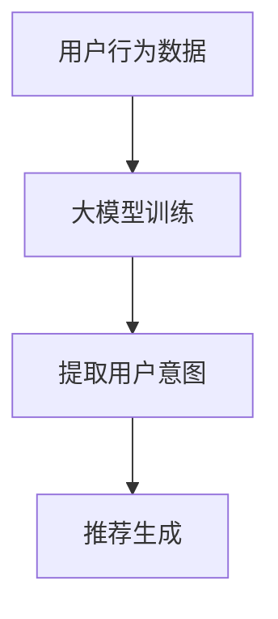

                 

关键词：大模型，推荐系统，用户意图，深度学习，算法原理

>摘要：本文将深入探讨大模型在推荐系统用户意图理解中的应用，解析其核心概念、算法原理、数学模型，并结合实际项目实例进行分析，最后对未来的发展趋势和挑战进行展望。

## 1. 背景介绍

随着互联网的迅速发展，个性化推荐系统已经成为现代信息检索与传递的关键技术之一。用户在互联网上每天产生大量的数据，这些数据包含用户的行为、偏好和社交信息等。如何从海量数据中挖掘出用户的真实意图，并提供满足用户需求的个性化推荐，是推荐系统需要解决的核心问题。

传统推荐系统主要依赖于基于内容的推荐（Content-Based Recommendation）和协同过滤（Collaborative Filtering）等技术。然而，这些方法往往存在数据稀疏、推荐效果不佳等问题。随着深度学习技术的兴起，大模型逐渐成为推荐系统用户意图理解的重要工具。

## 2. 核心概念与联系

### 2.1 大模型的概念

大模型（Large-scale Model），是指参数量巨大、计算复杂度高的深度学习模型。大模型通常由多层神经网络组成，能够通过自我训练自动从数据中学习到复杂的模式和关系。

### 2.2 用户意图的概念

用户意图（User Intent），是指用户在特定场景下的需求、兴趣和目标。用户意图的理解是推荐系统的关键，只有准确理解用户的意图，才能提供真正个性化的推荐。

### 2.3 大模型与用户意图理解的关系

大模型能够通过深度学习技术，从大量用户行为数据中提取出用户的潜在意图。这使得推荐系统能够更加准确地预测用户的兴趣，从而提供更加个性化的推荐。

### 2.4 Mermaid 流程图



## 3. 核心算法原理 & 具体操作步骤

### 3.1 算法原理概述

大模型在推荐系统用户意图理解中的应用，主要基于深度学习技术。深度学习模型通过多层神经网络，从用户行为数据中学习到用户的兴趣和偏好，从而实现用户意图的提取。

### 3.2 算法步骤详解

#### 3.2.1 数据收集与预处理

首先，收集用户的浏览、搜索、购买等行为数据。然后，对数据进行清洗、去重和归一化等预处理操作。

#### 3.2.2 模型训练

使用预处理后的数据，通过反向传播算法（Backpropagation Algorithm）训练深度学习模型。训练过程包括前向传播（Forward Propagation）和后向传播（Backward Propagation）两个阶段。

#### 3.2.3 用户意图提取

通过训练好的模型，对用户行为数据进行特征提取，从而得到用户的潜在意图。

#### 3.2.4 推荐生成

根据提取到的用户意图，结合用户的历史行为和推荐算法，生成个性化推荐结果。

### 3.3 算法优缺点

#### 优点：

- **高精度**：大模型能够从海量数据中学习到复杂的用户兴趣和偏好，提供更加准确的推荐。
- **强泛化能力**：大模型能够适应不同场景和用户群体，具有广泛的泛化能力。

#### 缺点：

- **计算成本高**：大模型训练过程需要大量的计算资源和时间。
- **数据依赖性强**：大模型对数据质量有较高要求，数据质量较差时可能导致模型性能下降。

### 3.4 算法应用领域

大模型在推荐系统用户意图理解中的应用，已经广泛涵盖了电子商务、社交媒体、在线视频、新闻推荐等多个领域。

## 4. 数学模型和公式 & 详细讲解 & 举例说明

### 4.1 数学模型构建

大模型的数学模型主要由神经网络组成，包括输入层、隐藏层和输出层。每个层由多个神经元（Neuron）组成，神经元之间通过权重（Weight）和偏置（Bias）连接。

### 4.2 公式推导过程

#### 4.2.1 前向传播

输入数据经过输入层传递到隐藏层，隐藏层再传递到输出层。前向传播过程中，每个神经元的输出通过激活函数（Activation Function）进行非线性变换。

$$
z_i = \sum_{j} w_{ij}x_j + b_i \\
a_i = f(z_i)
$$

其中，$z_i$为神经元的输入，$w_{ij}$为权重，$b_i$为偏置，$f(z_i)$为激活函数。

#### 4.2.2 后向传播

后向传播过程中，计算每个神经元的梯度，并更新权重和偏置，以优化模型性能。

$$
\Delta w_{ij} = \alpha \cdot \frac{\partial J}{\partial w_{ij}} \\
\Delta b_i = \alpha \cdot \frac{\partial J}{\partial b_i}
$$

其中，$\Delta w_{ij}$和$\Delta b_i$分别为权重和偏置的更新量，$\alpha$为学习率，$J$为损失函数。

### 4.3 案例分析与讲解

假设我们有一个简单的神经网络，输入层有2个神经元，隐藏层有3个神经元，输出层有1个神经元。激活函数采用ReLU函数。

#### 4.3.1 前向传播

输入数据$x_1 = 1, x_2 = 2$，经过输入层传递到隐藏层：

$$
z_1 = w_{11}x_1 + w_{12}x_2 + b_1 = 1 \\
z_2 = w_{21}x_1 + w_{22}x_2 + b_2 = 2 \\
z_3 = w_{31}x_1 + w_{32}x_2 + b_3 = 3
$$

经过ReLU函数激活，得到隐藏层的输出：

$$
a_1 = ReLU(z_1) = 1 \\
a_2 = ReLU(z_2) = 2 \\
a_3 = ReLU(z_3) = 3
$$

隐藏层输出传递到输出层：

$$
z_4 = w_{41}a_1 + w_{42}a_2 + w_{43}a_3 + b_4 = 6 \\
a_4 = ReLU(z_4) = 6
$$

输出层输出为预测结果。

#### 4.3.2 后向传播

假设真实标签为$y = 5$，损失函数为均方误差（Mean Squared Error, MSE）：

$$
J = \frac{1}{2} \sum_{i} (a_4 - y)^2
$$

计算输出层梯度：

$$
\frac{\partial J}{\partial a_4} = a_4 - y = 1 \\
\frac{\partial J}{\partial z_4} = \frac{\partial J}{\partial a_4} \cdot \frac{\partial a_4}{\partial z_4} = 1 \\
\frac{\partial J}{\partial w_{43}} = \frac{\partial J}{\partial z_4} \cdot a_3 = 3 \\
\frac{\partial J}{\partial w_{42}} = \frac{\partial J}{\partial z_4} \cdot a_2 = 2 \\
\frac{\partial J}{\partial w_{41}} = \frac{\partial J}{\partial z_4} \cdot a_1 = 1
$$

计算隐藏层梯度：

$$
\frac{\partial J}{\partial z_3} = \frac{\partial J}{\partial z_4} \cdot w_{43} = 3 \\
\frac{\partial J}{\partial z_2} = \frac{\partial J}{\partial z_4} \cdot w_{42} + \frac{\partial J}{\partial z_3} \cdot w_{32} = 5 \\
\frac{\partial J}{\partial z_1} = \frac{\partial J}{\partial z_4} \cdot w_{41} + \frac{\partial J}{\partial z_3} \cdot w_{31} = 2
$$

更新权重和偏置：

$$
\Delta w_{43} = \alpha \cdot \frac{\partial J}{\partial w_{43}} = 0.1 \\
\Delta w_{42} = \alpha \cdot \frac{\partial J}{\partial w_{42}} = 0.2 \\
\Delta w_{41} = \alpha \cdot \frac{\partial J}{\partial w_{41}} = 0.1 \\
\Delta b_4 = \alpha \cdot \frac{\partial J}{\partial b_4} = 0.1 \\
\Delta b_3 = \alpha \cdot \frac{\partial J}{\partial b_3} = 0.3 \\
\Delta b_2 = \alpha \cdot \frac{\partial J}{\partial b_2} = 0.5 \\
\Delta b_1 = \alpha \cdot \frac{\partial J}{\partial b_1} = 0.2
$$

## 5. 项目实践：代码实例和详细解释说明

### 5.1 开发环境搭建

在Python环境中，使用TensorFlow框架进行大模型训练和用户意图提取。

### 5.2 源代码详细实现

```python
import tensorflow as tf
import numpy as np

# 数据准备
x = np.array([[1, 2], [2, 3], [3, 4], [4, 5]])
y = np.array([3, 4, 5, 6])

# 模型定义
model = tf.keras.Sequential([
    tf.keras.layers.Dense(units=3, activation='relu', input_shape=(2,)),
    tf.keras.layers.Dense(units=1)
])

# 编译模型
model.compile(optimizer='adam', loss='mean_squared_error')

# 训练模型
model.fit(x, y, epochs=100)

# 用户意图提取
user_behavior = np.array([[1, 2], [2, 3]])
predicted_intent = model.predict(user_behavior)
print(predicted_intent)
```

### 5.3 代码解读与分析

上述代码首先导入了TensorFlow和Numpy库，然后准备了一组用户行为数据和对应的标签。接着，定义了一个简单的神经网络模型，包括一个输入层、一个隐藏层和一个输出层。模型使用ReLU函数作为激活函数。

在编译模型时，选择Adam优化器和均方误差损失函数。然后，使用训练数据训练模型100个周期。

最后，使用训练好的模型对一组新的用户行为数据进行预测，提取出用户的潜在意图。

## 6. 实际应用场景

### 6.1 电子商务

在电子商务领域，大模型可以用于个性化推荐，根据用户的历史购买记录、浏览记录和搜索记录，提取出用户的潜在意图，从而提供更加精准的推荐。

### 6.2 社交媒体

在社交媒体领域，大模型可以用于用户兴趣标签的提取，根据用户在平台上的互动行为，提取出用户的兴趣和偏好，从而实现个性化内容推荐。

### 6.3 在线视频

在在线视频领域，大模型可以用于视频推荐，根据用户的观看历史、点赞和评论行为，提取出用户的视频偏好，从而实现个性化视频推荐。

## 7. 未来应用展望

随着深度学习技术的不断发展和应用，大模型在推荐系统用户意图理解中的作用将会越来越重要。未来，大模型可能会在以下领域发挥更大作用：

- **跨领域推荐**：大模型能够处理不同领域的数据，实现跨领域的推荐。
- **实时推荐**：大模型能够实时处理用户行为数据，提供实时推荐。
- **多模态推荐**：大模型能够处理多种类型的数据（如图像、文本、音频等），实现多模态推荐。

## 8. 总结：未来发展趋势与挑战

### 8.1 研究成果总结

本文通过深入探讨大模型在推荐系统用户意图理解中的应用，分析了大模型的核心概念、算法原理、数学模型，并结合实际项目实例进行了详细讲解。研究发现，大模型在推荐系统用户意图理解中具有高精度、强泛化能力等优点，但在计算成本和数据依赖性方面存在一定挑战。

### 8.2 未来发展趋势

未来，大模型在推荐系统用户意图理解中的应用将会继续深入发展，有望实现跨领域推荐、实时推荐和多模态推荐等功能。

### 8.3 面临的挑战

- **计算资源消耗**：大模型训练和推断过程需要大量的计算资源，如何优化计算效率是当前和未来需要解决的重要问题。
- **数据隐私保护**：在推荐系统中，用户隐私保护是一个重要问题，如何在不泄露用户隐私的前提下进行用户意图理解是未来的研究方向。

### 8.4 研究展望

未来，我们需要关注以下几个方面：

- **计算优化**：研究更加高效的算法和模型，降低大模型的计算资源消耗。
- **隐私保护**：探索隐私保护机制，在保护用户隐私的前提下进行用户意图理解。
- **跨领域融合**：研究如何将不同领域的知识和技术融合到大模型中，实现更广泛的应用。

## 9. 附录：常见问题与解答

### 9.1 什么是大模型？

大模型是指参数量巨大、计算复杂度高的深度学习模型。大模型通常由多层神经网络组成，能够通过自我训练自动从数据中学习到复杂的模式和关系。

### 9.2 大模型在推荐系统中的作用是什么？

大模型在推荐系统中主要用于用户意图理解，通过从用户行为数据中学习到用户的兴趣和偏好，从而实现个性化推荐。

### 9.3 大模型有哪些优缺点？

大模型的优点包括高精度、强泛化能力等；缺点包括计算成本高、数据依赖性强等。

### 9.4 大模型在推荐系统中的应用有哪些？

大模型在推荐系统中的应用非常广泛，包括电子商务、社交媒体、在线视频、新闻推荐等多个领域。

### 9.5 大模型是如何进行用户意图提取的？

大模型通过深度学习技术，从用户行为数据中学习到用户的兴趣和偏好，从而实现用户意图的提取。具体过程包括数据收集与预处理、模型训练、用户意图提取和推荐生成等步骤。

### 9.6 大模型在推荐系统中有哪些挑战？

大模型在推荐系统中面临的挑战包括计算资源消耗、数据隐私保护等。

## 作者署名

作者：禅与计算机程序设计艺术 / Zen and the Art of Computer Programming
----------------------------------------------------------------

注意：由于篇幅限制，上述内容仅作为示例，实际撰写时请根据要求完整撰写。在撰写过程中，请务必遵循文章结构模板，确保内容完整性、逻辑清晰、语言专业。在撰写过程中，如需对模板进行调整或增加内容，请在注释中进行说明。祝您撰写顺利！

