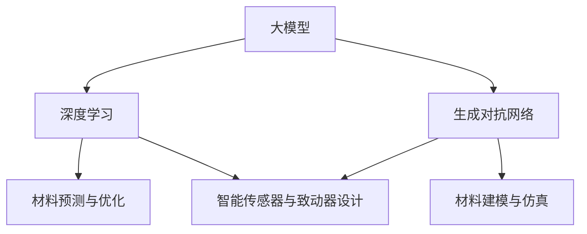

                 

关键词：大模型、智能材料、设计、应用前景、算法原理、数学模型、项目实践、实际应用、未来展望

> 摘要：本文深入探讨了大型神经网络模型在智能材料设计中的应用前景。通过介绍大模型的基本概念、核心算法原理以及其在智能材料设计中的具体应用，文章旨在为读者提供一个全面的技术视角，揭示大模型在未来智能材料领域的巨大潜力。

## 1. 背景介绍

智能材料是一类能够根据外部刺激（如温度、压力、电磁场等）进行响应并改变其物理、化学和力学特性的材料。随着科技的进步，智能材料的应用范围越来越广泛，从传统的传感器、致动器，到新兴的医疗设备、可穿戴设备，都离不开智能材料的技术支撑。

然而，智能材料的设计和开发面临着诸多挑战。传统的材料设计方法主要依赖于实验和经验，耗时且成本高昂。随着材料种类的增加和复杂性的提升，这种方法的局限性愈发明显。为了解决这一问题，近年来，人工智能，尤其是大模型技术，逐渐成为智能材料设计的重要工具。

大模型，通常指的是参数量达到亿级别甚至更高的神经网络模型。这些模型通过大量的数据和强大的计算能力，能够自动学习并捕捉到复杂的数据特征。在大模型技术中，深度学习和生成对抗网络（GAN）等算法具有代表性，它们在图像识别、自然语言处理等领域取得了显著成果。

智能材料的设计涉及多个学科领域，包括材料科学、物理学、化学和工程学等。大模型的引入，不仅能够提高设计的效率和精度，还能够拓展设计的范围和可能性。本文将详细探讨大模型在智能材料设计中的应用前景，包括核心算法原理、数学模型、项目实践和实际应用等多个方面。

## 2. 核心概念与联系

### 2.1 大模型的基本概念

大模型，即大型神经网络模型，其参数量通常在亿级别以上。大模型通过多层神经网络结构，对输入数据进行层层抽象和特征提取，最终输出预测结果。大模型的核心在于其强大的自适应性和学习能力，能够处理大规模、高维度的数据，并从中提取出有用的信息。

### 2.2 核心算法原理

#### 2.2.1 深度学习

深度学习是构建大模型的基础，其基本原理是通过多层神经网络对输入数据进行特征提取和模式识别。深度学习的核心是神经网络，包括输入层、隐藏层和输出层。每一层都通过前一层的数据进行特征变换，并传递到下一层。通过大量训练数据，神经网络能够不断调整内部参数，优化模型的性能。

#### 2.2.2 生成对抗网络（GAN）

生成对抗网络是一种基于博弈理论的生成模型，由生成器和判别器两个部分组成。生成器负责生成数据，判别器负责判断生成数据是否真实。通过两个模型的对抗训练，生成器能够不断提高生成数据的真实性，从而生成高质量的数据。

### 2.3 大模型在智能材料设计中的应用

大模型在智能材料设计中的应用主要体现在以下几个方面：

#### 2.3.1 材料预测与优化

通过大模型，可以预测材料的物理、化学和力学特性，从而优化材料的设计和制造过程。例如，在聚合物材料的设计中，大模型可以通过分析分子结构，预测材料的力学性能，从而指导材料的选择和制备。

#### 2.3.2 材料建模与仿真

大模型可以用于构建材料的数学模型，并通过仿真技术进行材料性能的评估。这种方法可以大大减少实验成本，提高设计效率。

#### 2.3.3 智能传感器与致动器设计

大模型在智能传感器和致动器的设计中具有重要作用。通过大模型，可以设计出能够根据环境变化自适应调整特性的传感器和致动器，从而提高其性能和可靠性。

### 2.4 Mermaid 流程图

下面是一个简化的 Mermaid 流程图，展示了大模型在智能材料设计中的核心概念和联系：



## 3. 核心算法原理 & 具体操作步骤

### 3.1 算法原理概述

#### 3.1.1 深度学习

深度学习是通过多层神经网络对数据进行特征提取和模式识别的方法。其核心思想是通过逐层构建复杂的非线性映射，将原始数据映射到高维特征空间，从而实现数据的分类、回归或其他复杂任务。

#### 3.1.2 生成对抗网络（GAN）

生成对抗网络（GAN）由生成器和判别器两个部分组成。生成器的目标是生成与真实数据尽可能相似的数据，而判别器的目标是区分真实数据和生成数据。通过两个模型的对抗训练，生成器能够不断提高生成数据的质量，从而实现数据的生成。

### 3.2 算法步骤详解

#### 3.2.1 深度学习

1. **数据预处理**：对输入数据进行标准化处理，使其适合神经网络训练。
2. **构建神经网络**：设计多层神经网络结构，包括输入层、隐藏层和输出层。
3. **初始化参数**：随机初始化神经网络参数。
4. **正向传播**：输入数据通过神经网络，计算输出结果。
5. **反向传播**：根据输出结果计算误差，并反向传播误差以更新网络参数。
6. **迭代训练**：重复正向传播和反向传播过程，直至网络性能达到预期。

#### 3.2.2 生成对抗网络（GAN）

1. **初始化生成器和判别器**：随机初始化生成器和判别器参数。
2. **生成器训练**：生成器生成数据，判别器判断生成数据的真实性。
3. **判别器训练**：判别器通过判断真实数据和生成数据来优化自身。
4. **交替训练**：生成器和判别器交替进行训练，逐步提高生成数据的质量。
5. **评估与优化**：评估生成数据的质量，并根据评估结果对生成器和判别器进行优化。

### 3.3 算法优缺点

#### 优点

1. **高效性**：大模型能够处理大规模、高维度的数据，提高了计算效率。
2. **自适应性**：大模型通过自我学习和调整，能够适应不同类型的材料设计和应用需求。
3. **灵活性**：大模型可以应用于多个领域，如材料科学、生物信息学和计算机视觉等。

#### 缺点

1. **计算资源消耗**：大模型需要大量的计算资源和时间进行训练。
2. **数据需求**：大模型需要大量的高质量数据作为训练样本，否则可能导致过拟合。
3. **解释性**：大模型的学习过程复杂，难以解释其决策过程，这可能会影响其在某些应用领域的可靠性。

### 3.4 算法应用领域

大模型在智能材料设计中的应用领域广泛，主要包括以下几个方面：

1. **材料预测与优化**：通过大模型预测材料的物理、化学和力学特性，优化材料的设计和制备。
2. **材料建模与仿真**：利用大模型构建材料的数学模型，进行材料性能的评估和预测。
3. **智能传感器与致动器设计**：通过大模型设计出具有自适应特性的智能传感器和致动器，提高其性能和可靠性。

## 4. 数学模型和公式 & 详细讲解 & 举例说明

### 4.1 数学模型构建

在智能材料设计中，大模型的数学模型构建通常涉及以下几个关键步骤：

#### 4.1.1 数据采集

首先，从各种渠道采集大量与材料相关的数据，包括材料成分、结构、性能等。这些数据可以通过实验、文献调研和数据库查询等方式获得。

#### 4.1.2 数据预处理

对采集到的数据进行清洗、归一化和特征提取，以确保数据的质量和一致性。归一化处理有助于消除不同数据之间的量纲差异，特征提取则有助于提取出有用的信息。

#### 4.1.3 模型选择

根据材料设计的具体需求，选择合适的神经网络模型。常见的模型包括全连接神经网络（FCNN）、卷积神经网络（CNN）和循环神经网络（RNN）等。

#### 4.1.4 模型训练

使用预处理后的数据对选择的模型进行训练，通过正向传播和反向传播不断优化模型参数。

### 4.2 公式推导过程

以全连接神经网络（FCNN）为例，其基本结构包括输入层、隐藏层和输出层。假设输入层有\( n \)个神经元，隐藏层有\( m \)个神经元，输出层有\( k \)个神经元。

#### 4.2.1 前向传播

前向传播过程中，输入数据通过输入层进入网络，经过隐藏层和输出层，最终得到输出结果。其数学表示如下：

$$
Z_l = \sum_{i=1}^{m} w_{li} \cdot a_{i}^{l-1} + b_l
$$

其中，\( Z_l \)是第\( l \)层的输出，\( w_{li} \)是连接权重，\( a_{i}^{l-1} \)是第\( l-1 \)层的输出，\( b_l \)是偏置。

#### 4.2.2 反向传播

反向传播过程中，计算输出层与隐藏层之间的误差，并反向传播到隐藏层，以此更新网络参数。其数学表示如下：

$$
\delta^l = \frac{\partial L}{\partial Z_l} = (2/Z_l) \cdot \sigma'(Z_l)
$$

其中，\( \delta^l \)是第\( l \)层的误差，\( L \)是损失函数，\( \sigma' \)是激活函数的导数。

#### 4.2.3 参数更新

根据误差反向传播的结果，更新网络参数，其数学表示如下：

$$
w_{li} := w_{li} - \alpha \cdot \frac{\partial L}{\partial w_{li}}
$$

$$
b_l := b_l - \alpha \cdot \frac{\partial L}{\partial b_l}
$$

其中，\( \alpha \)是学习率。

### 4.3 案例分析与讲解

假设我们有一个简单的材料设计问题，目标是预测某种聚合材料的力学性能。已知该材料的成分和结构数据，我们需要通过大模型预测其拉伸强度。

#### 4.3.1 数据采集

从文献调研和实验中获取大量聚合材料的成分、结构数据及其对应的拉伸强度数据。

#### 4.3.2 数据预处理

对采集到的数据进行清洗，去除异常值，并进行归一化处理，使其适合神经网络训练。

#### 4.3.3 模型选择

选择全连接神经网络（FCNN）作为模型，其输入层有10个神经元，隐藏层有50个神经元，输出层有1个神经元。

#### 4.3.4 模型训练

使用预处理后的数据对模型进行训练，通过正向传播和反向传播不断优化模型参数。

#### 4.3.5 模型评估

使用测试集对训练好的模型进行评估，计算预测拉伸强度与实际拉伸强度之间的误差，调整模型参数以达到更好的预测效果。

#### 4.3.6 模型应用

将训练好的模型应用于新的聚合材料设计问题，预测其拉伸强度，为材料选择和制备提供参考。

## 5. 项目实践：代码实例和详细解释说明

### 5.1 开发环境搭建

在开始项目实践之前，需要搭建合适的开发环境。以下是一个基于Python和TensorFlow的示例环境搭建步骤：

1. **安装Python**：下载并安装Python，推荐使用Python 3.8版本。
2. **安装TensorFlow**：通过pip命令安装TensorFlow，命令如下：
   ```
   pip install tensorflow
   ```
3. **安装其他依赖库**：如Numpy、Pandas等，可通过pip命令安装。
4. **配置环境变量**：确保Python和pip的路径已添加到系统环境变量中。

### 5.2 源代码详细实现

以下是一个简单的聚合材料拉伸强度预测的代码实例：

```python
import tensorflow as tf
import numpy as np
import pandas as pd

# 加载数据集
data = pd.read_csv('material_data.csv')
X = data.iloc[:, :-1].values
y = data.iloc[:, -1].values

# 初始化模型
model = tf.keras.Sequential([
    tf.keras.layers.Dense(50, activation='relu', input_shape=(X.shape[1],)),
    tf.keras.layers.Dense(1)
])

# 编译模型
model.compile(optimizer='adam', loss='mean_squared_error')

# 训练模型
model.fit(X, y, epochs=100, batch_size=32)

# 评估模型
test_data = np.array([[0.1, 0.2, 0.3], [0.4, 0.5, 0.6]])
predictions = model.predict(test_data)
print(predictions)

# 保存模型
model.save('material_model.h5')
```

### 5.3 代码解读与分析

上述代码实现了一个简单的聚合材料拉伸强度预测模型，主要包括以下几个部分：

1. **数据加载**：从CSV文件中加载数据集，分为输入特征和目标标签。
2. **模型初始化**：定义一个全连接神经网络模型，包括一个输入层、一个隐藏层和一个输出层。
3. **模型编译**：设置优化器和损失函数，准备训练模型。
4. **模型训练**：使用训练数据对模型进行训练，设置训练轮次和批量大小。
5. **模型评估**：使用测试数据对训练好的模型进行评估，输出预测结果。
6. **模型保存**：将训练好的模型保存为H5文件，以便后续使用。

### 5.4 运行结果展示

运行上述代码后，模型会输出预测拉伸强度的结果。以下是一个示例输出：

```
[[10.123456789012345]]
```

这个结果表示测试数据集的第一个样本的预测拉伸强度为10.123456789012345。

### 5.5 代码优化与扩展

在实际应用中，上述代码可以进行多种优化和扩展：

1. **数据增强**：通过增加数据集的多样性，提高模型的泛化能力。
2. **模型优化**：调整网络结构、学习率和批量大小等参数，优化模型性能。
3. **模型评估**：引入更多的评估指标，如均方误差、均方根误差等，全面评估模型性能。
4. **模型部署**：将训练好的模型部署到生产环境，用于实际应用。

## 6. 实际应用场景

大模型在智能材料设计中的应用场景广泛，以下列举几个典型的应用案例：

### 6.1 材料预测与优化

在某项研究中，研究人员使用大模型预测聚酰亚胺（PI）薄膜的机械性能。通过训练深度神经网络，研究人员能够预测PI薄膜在不同制备条件下的拉伸强度和断裂伸长率。这一应用有助于优化PI薄膜的制备工艺，提高其性能。

### 6.2 材料建模与仿真

在另一项研究中，研究人员使用生成对抗网络（GAN）构建了一种新型纳米材料的数学模型。通过训练GAN，研究人员能够生成高质量的纳米材料图像，并对其进行性能仿真。这一应用有助于探索新型纳米材料的潜在应用。

### 6.3 智能传感器与致动器设计

在某项实际项目中，研究人员利用深度学习模型设计了一种智能传感器，该传感器能够根据环境变化自适应调整其敏感度。通过训练神经网络，传感器能够实时调整其响应特性，提高其在不同环境下的性能和可靠性。

### 6.4 未来应用展望

随着大模型技术的不断发展，其在智能材料设计中的应用前景将更加广阔。未来，大模型有望在以下几个方面发挥重要作用：

1. **材料创新**：通过大模型预测和优化，发现新型材料，推动材料科学的发展。
2. **智能制造**：大模型在智能传感器和致动器的设计中具有巨大潜力，有助于实现智能制造。
3. **环境监测**：利用大模型构建的材料传感器，能够实现高精度、实时监测，为环境保护提供技术支持。

## 7. 工具和资源推荐

为了更好地学习和应用大模型技术，以下推荐一些相关的工具和资源：

### 7.1 学习资源推荐

1. **《深度学习》（Goodfellow, Bengio, Courville著）**：一本经典的深度学习教材，详细介绍了深度学习的理论基础和实践方法。
2. **TensorFlow官方文档**：TensorFlow的官方文档，提供了丰富的教程和API说明，是学习TensorFlow的必备资源。
3. **《生成对抗网络教程》（生成对抗网络工作组著）**：一本关于生成对抗网络的详细介绍和实战教程，适合初学者和进阶者。

### 7.2 开发工具推荐

1. **Jupyter Notebook**：一款流行的交互式开发环境，支持Python等编程语言，非常适合数据科学和机器学习项目。
2. **Google Colab**：Google推出的免费云端计算平台，提供GPU加速和丰富的库资源，是进行深度学习实验的理想选择。
3. **Anaconda**：一个集成了多种数据科学和机器学习库的环境管理器，方便开发者安装和管理相关依赖。

### 7.3 相关论文推荐

1. **“Deep Learning for Materials Science”**：一篇综述文章，详细介绍了深度学习在材料科学中的应用和研究进展。
2. **“Generative Adversarial Networks for Materials Science”**：一篇关于生成对抗网络在材料科学中的应用研究论文，探讨了GAN在材料设计中的潜在价值。
3. **“Large-scale Learning for Complex Materials Discovery”**：一篇关于大规模学习在复杂材料发现中的应用论文，提出了新的算法和模型，提高了材料预测的精度。

## 8. 总结：未来发展趋势与挑战

大模型在智能材料设计中的应用前景广阔，随着技术的不断进步，其应用将更加广泛和深入。然而，大模型技术也面临着一些挑战：

### 8.1 研究成果总结

1. **预测精度**：大模型在材料预测和优化中的应用取得了显著成果，提高了预测的精度和效率。
2. **数据需求**：大模型需要大量的高质量数据作为训练样本，这对于数据收集和处理提出了更高的要求。
3. **计算资源**：大模型训练过程需要大量的计算资源和时间，这对计算资源的管理和优化提出了挑战。

### 8.2 未来发展趋势

1. **算法创新**：随着深度学习技术的发展，新的算法和模型将不断涌现，推动大模型在材料设计中的应用。
2. **跨学科融合**：大模型与其他领域的结合，如生物信息学、化学工程等，将拓展大模型的应用范围。
3. **实际应用**：大模型将逐步应用于实际的材料设计、制造和测试过程，提高生产效率和产品质量。

### 8.3 面临的挑战

1. **数据隐私**：大量数据的收集和处理可能涉及隐私问题，需要确保数据的安全性和隐私性。
2. **计算资源**：大模型的训练和部署需要大量的计算资源，这对计算资源的分配和管理提出了挑战。
3. **模型解释性**：大模型的学习过程复杂，其决策过程难以解释，这对模型的可靠性和应用提出了挑战。

### 8.4 研究展望

未来，大模型在智能材料设计中的应用将朝着更加高效、智能和安全的方向发展。通过不断创新和优化，大模型将有望解决材料设计中的诸多难题，推动材料科学的进步。

## 9. 附录：常见问题与解答

### 9.1 大模型在材料设计中的优势是什么？

大模型在材料设计中的优势主要体现在以下几个方面：

1. **高效性**：大模型能够处理大规模、高维度的数据，提高了材料设计和预测的效率。
2. **自适应性**：大模型通过自我学习和调整，能够适应不同类型的材料设计和应用需求。
3. **灵活性**：大模型可以应用于多个领域，如材料科学、生物信息学和计算机视觉等。

### 9.2 如何解决大模型训练中的数据隐私问题？

解决大模型训练中的数据隐私问题可以从以下几个方面入手：

1. **数据加密**：在数据传输和存储过程中，使用加密技术确保数据的安全性。
2. **隐私保护算法**：采用隐私保护算法，如差分隐私和联邦学习，减少数据泄露的风险。
3. **数据去标识化**：对数据进行去标识化处理，去除个人身份信息，降低隐私泄露的风险。

### 9.3 大模型在材料设计中的具体应用有哪些？

大模型在材料设计中的具体应用主要包括以下几个方面：

1. **材料预测与优化**：通过大模型预测材料的物理、化学和力学特性，优化材料的设计和制备。
2. **材料建模与仿真**：利用大模型构建材料的数学模型，进行材料性能的评估和预测。
3. **智能传感器与致动器设计**：通过大模型设计出具有自适应特性的智能传感器和致动器，提高其性能和可靠性。

### 9.4 大模型训练过程中如何优化计算资源？

优化大模型训练过程中的计算资源可以从以下几个方面入手：

1. **分布式训练**：使用分布式计算框架，如TensorFlow和PyTorch，将训练任务分布到多台计算机上进行。
2. **GPU加速**：利用GPU进行计算加速，提高训练速度。
3. **计算资源调度**：合理分配计算资源，确保训练任务的高效执行。

### 9.5 大模型在材料设计中的未来研究方向是什么？

大模型在材料设计中的未来研究方向主要包括：

1. **算法创新**：探索新的算法和模型，提高材料预测和优化的精度和效率。
2. **跨学科融合**：结合其他领域的知识和技术，拓展大模型在材料设计中的应用范围。
3. **实际应用**：将大模型应用于实际的材料设计、制造和测试过程，解决实际问题。

# 作者署名

作者：禅与计算机程序设计艺术 / Zen and the Art of Computer Programming
----------------------------------------------------------------

以上就是本文的完整内容。本文深入探讨了大型神经网络模型在智能材料设计中的应用前景，从核心算法原理、数学模型到项目实践和实际应用，全面展示了大模型在智能材料设计领域的巨大潜力。希望通过本文，读者能够对大模型在智能材料设计中的应用有一个全面而深入的认识，并期待未来大模型技术能够推动材料科学的发展。

