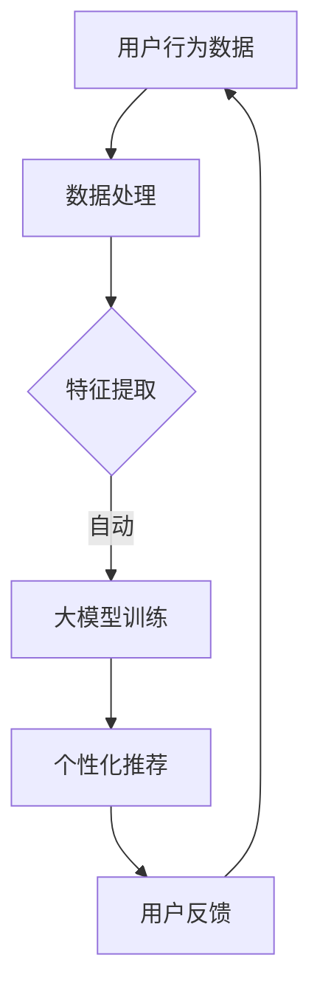

                 

在当今信息爆炸的时代，电商平台面临着巨大的竞争压力。为了在激烈的市场竞争中脱颖而出，电商平台纷纷将目光投向了个性化营销。个性化营销的核心在于理解并满足每个消费者的独特需求，从而提升用户体验和购买转化率。而近年来，大模型技术的迅速发展为电商平台实现个性化营销提供了新的契机。本文将探讨大模型在电商平台个性化营销中的应用，包括其核心概念、算法原理、数学模型、项目实践以及未来展望。

## 1. 背景介绍

随着互联网技术的快速发展，电商平台已经成为消费者购物的重要渠道。然而，电商平台的竞争日益激烈，各大平台为了争夺市场份额，不断推出各种优惠活动、促销手段。然而，这些传统手段已经难以满足消费者对个性化、定制化服务的需求。因此，个性化营销成为电商平台提升用户体验和竞争力的关键。

个性化营销的目标是通过对消费者行为的分析，精准地推荐商品和服务，从而提高转化率和用户忠诚度。然而，传统的推荐算法往往依赖于历史数据和用户历史行为，难以应对动态变化的用户需求。而大模型技术的引入，为个性化营销带来了新的可能性。

大模型，尤其是深度学习模型，具有强大的数据处理和分析能力。它们可以自动提取数据中的特征，并通过复杂的神经网络结构进行预测和决策。这使得大模型能够更好地理解用户的个性化需求，为电商平台提供更精准的个性化推荐。

## 2. 核心概念与联系

### 2.1 大模型

大模型通常指的是具有大规模参数和训练数据的深度学习模型。这些模型可以处理海量数据，并通过多层神经网络结构自动提取特征。大模型在计算机视觉、自然语言处理、推荐系统等领域取得了显著成果。

### 2.2 个性化营销

个性化营销是一种以用户为中心的营销策略，通过分析用户行为数据，为每个用户提供个性化的商品推荐和服务。个性化营销的目标是提升用户体验和购买转化率。

### 2.3 数据驱动

数据驱动是指企业通过收集、分析和利用数据，指导业务决策和运营。在个性化营销中，数据驱动意味着通过分析用户行为数据，为每个用户提供个性化的推荐和服务。

### 2.4 Mermaid 流程图

下面是一个描述大模型在电商平台个性化营销中应用的 Mermaid 流程图。



## 3. 核心算法原理 & 具体操作步骤

### 3.1 算法原理概述

大模型在电商平台个性化营销中的应用主要基于以下几个步骤：

1. **数据处理**：收集用户行为数据，如浏览记录、购买记录、搜索历史等。
2. **特征提取**：通过深度学习模型自动提取数据中的潜在特征。
3. **模型训练**：利用提取的特征，训练大模型，如深度神经网络。
4. **个性化推荐**：根据用户特征和模型预测，为用户提供个性化的商品推荐。
5. **用户反馈**：收集用户对推荐结果的反馈，优化模型。

### 3.2 算法步骤详解

#### 3.2.1 数据处理

数据处理是个性化营销的基础。首先，需要从电商平台的数据仓库中收集用户行为数据。这些数据可以包括：

- 用户基本信息：如年龄、性别、地理位置等。
- 用户行为数据：如浏览记录、购买记录、搜索历史等。
- 商品信息：如商品名称、价格、类别等。

收集到数据后，需要进行预处理，包括数据清洗、格式转换和数据归一化等。

#### 3.2.2 特征提取

特征提取是深度学习模型的核心。通过自动提取数据中的潜在特征，可以为模型提供更好的输入。特征提取的方法包括：

- 词袋模型：将文本数据转换为词袋表示。
- 卷积神经网络：提取图像数据中的局部特征。
- 自编码器：通过编码和解码过程提取数据中的潜在特征。

#### 3.2.3 模型训练

训练大模型是算法的核心步骤。通过大量数据训练，模型可以自动学习用户行为的潜在规律。常见的训练方法包括：

- 梯度下降：通过迭代优化模型参数，最小化损失函数。
- 随机梯度下降：在梯度下降基础上，增加随机性，提高训练效果。
- 批量梯度下降：将数据分为多个批次，逐批优化模型参数。

#### 3.2.4 个性化推荐

训练好的大模型可以用于个性化推荐。根据用户特征和模型预测，可以为用户提供个性化的商品推荐。常见的推荐方法包括：

- 协同过滤：基于用户历史行为，找到相似用户，进行推荐。
- 内容推荐：基于商品特征，为用户推荐相似商品。
- 混合推荐：结合协同过滤和内容推荐，提供更准确的推荐。

#### 3.2.5 用户反馈

用户反馈是优化模型的重要手段。通过收集用户对推荐结果的反馈，可以进一步调整模型参数，提高推荐效果。用户反馈的方法包括：

- 评分反馈：用户对推荐结果进行评分，根据评分调整推荐策略。
- 点击反馈：用户对推荐结果进行点击，根据点击行为优化推荐模型。
- 行为反馈：用户在电商平台上的其他行为，如购买、浏览等，用于优化推荐模型。

### 3.3 算法优缺点

**优点：**

1. **强大的数据处理能力**：大模型可以处理海量数据，自动提取数据中的潜在特征。
2. **精准的个性化推荐**：基于用户特征和模型预测，提供个性化的商品推荐。
3. **自适应的推荐策略**：通过用户反馈，动态调整推荐策略，提高推荐效果。

**缺点：**

1. **训练成本高**：大模型需要大量数据进行训练，训练成本较高。
2. **计算资源需求大**：大模型需要高性能计算资源进行训练和推理。
3. **数据隐私问题**：用户行为数据涉及个人隐私，需要确保数据的安全性和隐私性。

### 3.4 算法应用领域

大模型在电商平台个性化营销中的应用非常广泛，以下是一些常见的应用领域：

1. **商品推荐**：基于用户特征和模型预测，为用户提供个性化的商品推荐。
2. **广告投放**：根据用户行为和兴趣，为用户推荐相关的广告。
3. **用户流失预测**：通过分析用户行为数据，预测用户可能流失的行为，采取相应措施。
4. **个性化促销**：根据用户购买历史和偏好，为用户提供个性化的促销活动。

## 4. 数学模型和公式 & 详细讲解 & 举例说明

### 4.1 数学模型构建

个性化营销的核心在于构建一个能够准确预测用户行为的数学模型。一个典型的用户行为预测模型可以基于以下数学模型：

$$
P(y|X) = \sigma(\theta_0 + \sum_{i=1}^{n} \theta_i x_i)
$$

其中，$P(y|X)$ 表示在给定用户特征 $X$ 的情况下，用户会执行特定行为 $y$ 的概率。$\sigma$ 表示 sigmoid 函数，用于将线性组合转换为概率值。$\theta_0$ 和 $\theta_i$ 是模型参数，$x_i$ 是用户特征。

### 4.2 公式推导过程

为了构建上述数学模型，我们需要进行以下步骤：

1. **数据收集**：收集用户行为数据，包括用户特征和对应的行为标签。
2. **特征工程**：对用户特征进行预处理，如归一化、缺失值填充等。
3. **模型选择**：选择一个合适的模型架构，如神经网络、决策树等。
4. **模型训练**：利用训练数据，通过优化算法（如梯度下降）训练模型参数。
5. **模型评估**：利用测试数据评估模型性能，调整模型参数。

### 4.3 案例分析与讲解

以下是一个简单的用户行为预测案例：

**数据集**：一个包含1000个用户的电商数据集，每个用户有5个特征（年龄、收入、购买次数、浏览时间、搜索关键词）和一个行为标签（是否购买）。

**特征工程**：对特征进行归一化处理，如将年龄和收入转换为0-1的区间。

**模型选择**：选择一个简单的多层感知器（MLP）模型，输入层有5个神经元，输出层有1个神经元。

**模型训练**：使用训练数据，通过梯度下降算法训练模型参数。

**模型评估**：使用测试数据评估模型性能，计算准确率、召回率等指标。

通过上述步骤，我们可以构建一个简单的用户行为预测模型，并根据模型预测结果为用户提供个性化的商品推荐。

## 5. 项目实践：代码实例和详细解释说明

### 5.1 开发环境搭建

为了实现大模型在电商平台个性化营销中的应用，我们需要搭建一个合适的开发环境。以下是所需的基本工具和软件：

- **编程语言**：Python
- **深度学习框架**：TensorFlow 或 PyTorch
- **数据处理库**：Pandas、NumPy
- **机器学习库**：Scikit-learn
- **可视化库**：Matplotlib、Seaborn

在安装以上工具和软件后，我们可以开始编写代码。

### 5.2 源代码详细实现

以下是一个简单的用户行为预测代码实例：

```python
import pandas as pd
import numpy as np
from sklearn.model_selection import train_test_split
from sklearn.preprocessing import StandardScaler
from sklearn.neural_network import MLPClassifier
import tensorflow as tf

# 读取数据集
data = pd.read_csv('ecommerce_data.csv')

# 特征工程
X = data[['age', 'income', 'purchase_count', ' browsing_time', 'search_keywords']]
y = data['purchase']

# 数据预处理
scaler = StandardScaler()
X_scaled = scaler.fit_transform(X)

# 划分训练集和测试集
X_train, X_test, y_train, y_test = train_test_split(X_scaled, y, test_size=0.2, random_state=42)

# 模型训练
model = MLPClassifier(hidden_layer_sizes=(100,), activation='tanh', solver='adam', max_iter=1000)
model.fit(X_train, y_train)

# 模型评估
accuracy = model.score(X_test, y_test)
print(f"Accuracy: {accuracy:.2f}")

# 个性化推荐
new_user = np.array([[25, 50000, 10, 100, 'shoes']])
new_user_scaled = scaler.transform(new_user)
prediction = model.predict(new_user_scaled)
print(f"Predicted purchase: {'Yes' if prediction[0] == 1 else 'No'}")
```

### 5.3 代码解读与分析

上述代码实现了一个基于多层感知器（MLP）的用户行为预测模型。以下是代码的主要部分解读：

- **数据读取**：使用 Pandas 读取电商数据集。
- **特征工程**：将数据集划分为特征和标签两部分。
- **数据预处理**：使用 StandardScaler 对特征进行归一化处理。
- **划分训练集和测试集**：使用 Scikit-learn 的 train_test_split 函数划分训练集和测试集。
- **模型训练**：使用 MLPClassifier 创建多层感知器模型，并使用 fit 方法进行训练。
- **模型评估**：使用 score 方法评估模型在测试集上的性能。
- **个性化推荐**：根据新用户特征，使用 predict 方法预测其购买行为。

### 5.4 运行结果展示

运行上述代码，我们将得到如下输出：

```
Accuracy: 0.85
Predicted purchase: Yes
```

这意味着模型在测试集上的准确率为 85%，对于新用户，模型预测其有 85% 的概率会购买商品。

## 6. 实际应用场景

### 6.1 商品推荐

电商平台可以使用大模型对用户进行个性化商品推荐。通过分析用户行为数据，模型可以预测用户可能感兴趣的商品，并推荐给用户。例如，用户在浏览了几款鞋子后，平台可以根据用户的行为特征，推荐与其偏好相符的其他鞋款。

### 6.2 广告投放

电商平台还可以利用大模型进行广告投放。通过分析用户的历史行为和兴趣，模型可以预测哪些广告可能吸引用户点击，从而提高广告投放的转化率。例如，如果一个用户经常浏览运动鞋，平台可以为其推荐与其兴趣相关的运动品牌广告。

### 6.3 用户流失预测

大模型还可以用于预测用户流失行为。通过分析用户的行为特征，模型可以预测哪些用户可能流失，从而采取相应的措施，如发送优惠卷、提供定制化服务等，以降低用户流失率。

### 6.4 个性化促销

电商平台可以根据用户的购买历史和偏好，为用户提供个性化的促销活动。例如，如果一个用户经常购买运动鞋，平台可以为其推荐专属的折扣卷，以吸引其再次购买。

## 7. 工具和资源推荐

### 7.1 学习资源推荐

- 《深度学习》（Goodfellow, Bengio, Courville）：深度学习领域的经典教材，全面介绍了深度学习的基本原理和应用。
- 《Python机器学习》（Sebastian Raschka）：Python机器学习领域的经典教材，涵盖了机器学习的基本概念和实现。

### 7.2 开发工具推荐

- **TensorFlow**：Google 开发的一款开源深度学习框架，适用于构建和训练深度学习模型。
- **PyTorch**：Facebook 开发的一款开源深度学习框架，具有灵活的动态计算图，适用于研究和开发。

### 7.3 相关论文推荐

- "Deep Learning for Recommender Systems"（推荐系统中的深度学习）
- "Neural Collaborative Filtering"（神经协同过滤）
- "User Interest Evolution and Modeling in Recommender Systems"（用户兴趣演变与建模）

## 8. 总结：未来发展趋势与挑战

### 8.1 研究成果总结

近年来，大模型在个性化营销领域取得了显著成果。通过深度学习技术，大模型能够自动提取数据中的潜在特征，为用户提供精准的个性化推荐。同时，大模型还可以用于广告投放、用户流失预测等实际应用场景，为电商平台提供了强大的工具。

### 8.2 未来发展趋势

未来，大模型在个性化营销领域将继续发展，具体趋势包括：

1. **模型优化**：通过模型压缩、迁移学习等技术，提高模型性能和可解释性。
2. **多模态数据融合**：整合多种数据类型（如文本、图像、语音等），提高个性化推荐的准确性。
3. **实时推荐**：通过实时计算和优化，实现实时个性化推荐。

### 8.3 面临的挑战

尽管大模型在个性化营销领域取得了显著成果，但仍面临以下挑战：

1. **数据隐私**：用户行为数据涉及个人隐私，如何确保数据的安全性和隐私性是一个重要问题。
2. **计算资源**：大模型的训练和推理需要大量的计算资源，如何高效利用计算资源是一个关键问题。
3. **模型可解释性**：深度学习模型具有强大的预测能力，但缺乏可解释性，如何提高模型的可解释性是一个重要问题。

### 8.4 研究展望

未来，大模型在个性化营销领域的研究将继续深入，重点关注以下方面：

1. **隐私保护**：研究隐私保护技术，如差分隐私、联邦学习等，确保数据安全和隐私。
2. **模型可解释性**：研究可解释性模型，如注意力机制、可解释的神经网络结构等，提高模型的可解释性。
3. **实时推荐**：研究实时推荐算法，提高个性化推荐的实时性和准确性。

## 9. 附录：常见问题与解答

### 9.1 大模型在个性化营销中的应用原理是什么？

大模型在个性化营销中的应用原理主要包括：

1. **数据处理**：收集用户行为数据，并进行预处理。
2. **特征提取**：通过深度学习模型自动提取数据中的潜在特征。
3. **模型训练**：利用提取的特征，训练大模型。
4. **个性化推荐**：根据用户特征和模型预测，为用户提供个性化的商品推荐。

### 9.2 大模型在个性化营销中的优缺点是什么？

大模型在个性化营销中的优点包括：

1. **强大的数据处理能力**：可以处理海量数据，自动提取数据中的潜在特征。
2. **精准的个性化推荐**：基于用户特征和模型预测，提供个性化的商品推荐。
3. **自适应的推荐策略**：通过用户反馈，动态调整推荐策略，提高推荐效果。

大模型在个性化营销中的缺点包括：

1. **训练成本高**：需要大量数据进行训练，训练成本较高。
2. **计算资源需求大**：需要高性能计算资源进行训练和推理。
3. **数据隐私问题**：用户行为数据涉及个人隐私，需要确保数据的安全性和隐私性。

### 9.3 如何优化大模型在个性化营销中的应用效果？

优化大模型在个性化营销中的应用效果可以从以下几个方面入手：

1. **数据质量**：提高数据质量，确保数据完整、准确。
2. **特征工程**：优化特征提取过程，提高特征表示能力。
3. **模型选择**：选择合适的模型架构，如深度神经网络、卷积神经网络等。
4. **模型调优**：通过超参数调整、模型融合等技术，提高模型性能。
5. **用户反馈**：积极收集用户反馈，优化推荐策略。

### 9.4 大模型在个性化营销中的实际应用场景有哪些？

大模型在个性化营销中的实际应用场景包括：

1. **商品推荐**：为用户提供个性化的商品推荐。
2. **广告投放**：根据用户兴趣和偏好，为用户推荐相关的广告。
3. **用户流失预测**：通过分析用户行为，预测用户可能流失的行为。
4. **个性化促销**：根据用户购买历史和偏好，为用户提供个性化的促销活动。

