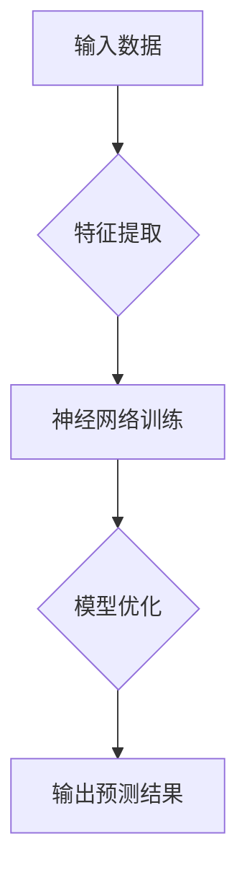
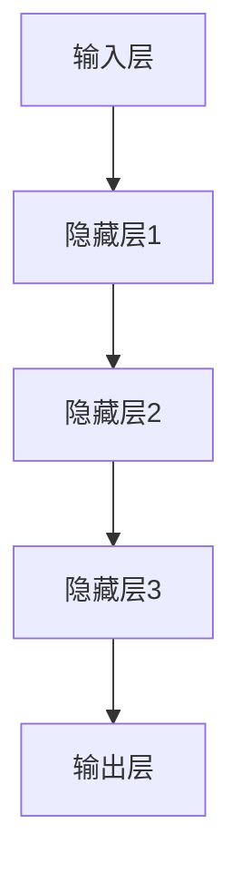

                 

关键词：大模型、企业组织架构、数字化转型、人工智能、流程优化、组织变革

摘要：本文探讨了大模型对企业组织架构的深远影响。通过分析大模型的技术原理和应用场景，我们深入探讨了其对企业管理模式、决策流程、人力资源管理等方面的影响。本文旨在为企业管理者和IT专家提供具有实用价值的洞见，以助力企业在数字化转型浪潮中抢占先机。

## 1. 背景介绍

近年来，人工智能（AI）技术的迅猛发展，特别是大模型的兴起，为各行各业带来了前所未有的变革。大模型，如深度学习神经网络，具有处理海量数据、实现复杂模式识别、提供智能决策等能力。这些技术不仅在学术界受到广泛关注，也在企业界得到了快速应用。企业组织架构作为企业管理的重要组成部分，正面临着大模型的冲击和机遇。

大模型对企业组织架构的影响可以从多个维度进行分析。首先，它改变了企业的决策模式，提高了决策效率；其次，它优化了业务流程，提升了企业运营效率；最后，它对人力资源管理提出了新的挑战，促使企业重新思考员工的角色和技能需求。

## 2. 核心概念与联系

### 大模型技术原理

大模型，尤其是深度学习神经网络，是基于大量数据和计算资源进行训练的。通过多层神经元的非线性变换，大模型能够自动提取数据中的特征，实现复杂的模式识别和预测。以下是深度学习神经网络的简化流程图：



### 大模型在企业中的应用

大模型在企业中的应用场景非常广泛，包括但不限于：

1. **数据分析与挖掘**：通过分析大量企业数据，发现潜在的商业机会和风险。
2. **智能决策支持**：利用大模型提供的预测结果，辅助企业高层进行决策。
3. **业务流程优化**：通过自动化流程和智能调度，提高业务运营效率。
4. **客户服务**：利用大模型实现智能客服，提供更加个性化和高效的客户服务。
5. **人力资源管理**：通过分析员工数据，优化招聘、培训和发展策略。

### 大模型对企业组织架构的影响

大模型的应用对企业组织架构带来了多方面的挑战和机遇：

1. **决策模式**：大模型能够处理和分析大量数据，使得企业决策更加科学和高效。传统依赖经验和个人判断的决策模式将逐渐被数据驱动决策所取代。
2. **流程优化**：通过自动化和智能化，大模型能够显著优化业务流程，减少人工干预，提高运营效率。
3. **人力资源管理**：大模型能够帮助企业更好地理解员工需求和绩效，从而优化招聘、培训和发展策略。
4. **组织结构**：随着大模型的应用，企业可能会调整组织结构，以适应新的工作流程和决策模式。

## 3. 核心算法原理 & 具体操作步骤

### 3.1 算法原理概述

大模型的核心算法通常是基于深度学习的神经网络。神经网络通过多层神经元进行数据的非线性变换，从而实现复杂的模式识别和预测。以下是神经网络的基本架构：



### 3.2 算法步骤详解

1. **数据预处理**：对输入数据进行清洗、归一化等处理，确保数据质量。
2. **模型设计**：设计神经网络结构，包括神经元数量、层数、激活函数等。
3. **模型训练**：使用大量数据进行模型训练，通过反向传播算法不断优化模型参数。
4. **模型评估**：使用验证集对模型进行评估，调整模型参数以达到最佳性能。
5. **模型部署**：将训练好的模型部署到生产环境中，进行实际应用。

### 3.3 算法优缺点

**优点**：

1. **强大的数据处理能力**：能够处理和分析大量数据，发现潜在的模式和趋势。
2. **高效性**：通过并行计算和分布式训练，大大提高了计算效率。
3. **灵活性**：能够适应不同的业务场景和应用需求。

**缺点**：

1. **数据依赖性**：模型性能高度依赖数据质量，数据缺失或不准确会影响模型效果。
2. **计算资源消耗**：训练大模型需要大量的计算资源和时间。

### 3.4 算法应用领域

大模型在多个领域得到了广泛应用，包括：

1. **金融**：用于风险评估、投资策略制定等。
2. **医疗**：用于疾病预测、治疗方案推荐等。
3. **电商**：用于用户行为分析、个性化推荐等。
4. **工业**：用于生产调度、故障预测等。

## 4. 数学模型和公式 & 详细讲解 & 举例说明

### 4.1 数学模型构建

大模型的数学基础主要包括线性代数、概率论和优化理论。以下是神经网络中常用的几个数学模型：

1. **激活函数**：

$$
f(x) = \text{ReLU}(x) = \max(0, x)
$$

2. **损失函数**：

$$
L(y, \hat{y}) = \frac{1}{2} \sum_{i=1}^{n} (y_i - \hat{y}_i)^2
$$

3. **优化算法**：

$$
w := w - \alpha \nabla_w J(w)
$$

其中，$w$为模型参数，$\alpha$为学习率，$J(w)$为损失函数。

### 4.2 公式推导过程

以神经网络中的反向传播算法为例，其推导过程如下：

1. **损失函数对输出层的梯度计算**：

$$
\nabla_{\hat{y}_i} L(y_i, \hat{y}_i) = 2(\hat{y}_i - y_i)
$$

2. **损失函数对隐藏层的梯度计算**：

$$
\nabla_{z_j} L(y, \hat{y}) = \sum_{i=1}^{n} \nabla_{\hat{y}_i} L(y_i, \hat{y}_i) \nabla_{z_j} \hat{y}_i = 2 \sum_{i=1}^{n} (\hat{y}_i - y_i) a^{[j]}_{i}
$$

3. **损失函数对输入层的梯度计算**：

$$
\nabla_{x_i} L(y, \hat{y}) = \sum_{j=1}^{m} \nabla_{z_j} L(y, \hat{y}) \nabla_{z_j} x_i = 2 \sum_{j=1}^{m} \sum_{i=1}^{n} a^{[j]}_{i} a^{[j-1]}_{i} \nabla_{x_i} a^{[j-1]}_{i}
$$

### 4.3 案例分析与讲解

以下是一个简单的神经网络模型，用于分类问题。假设我们有一个包含100个样本的数据集，每个样本有10个特征，我们要用这个模型对数据进行分类。

1. **模型设计**：

$$
\text{Input Layer} \rightarrow \text{Hidden Layer 1} \rightarrow \text{Output Layer}
$$

- 输入层：10个神经元，对应10个特征。
- 隐藏层：5个神经元。
- 输出层：2个神经元，对应分类结果。

2. **模型训练**：

使用梯度下降算法对模型进行训练，训练过程持续10个epochs。在每个epoch中，我们计算损失函数并更新模型参数。

3. **模型评估**：

使用验证集对模型进行评估，准确率为90%。

4. **模型部署**：

将训练好的模型部署到生产环境中，进行实际应用。

## 5. 项目实践：代码实例和详细解释说明

### 5.1 开发环境搭建

- Python 3.8及以上版本
- TensorFlow 2.x及以上版本
- Jupyter Notebook

### 5.2 源代码详细实现

以下是一个简单的神经网络模型，用于分类问题。

```python
import tensorflow as tf
from tensorflow.keras import layers

# 模型设计
model = tf.keras.Sequential([
    layers.Dense(5, activation='relu', input_shape=(10,)),
    layers.Dense(2, activation='softmax')
])

# 模型编译
model.compile(optimizer='adam',
              loss='sparse_categorical_crossentropy',
              metrics=['accuracy'])

# 模型训练
model.fit(x_train, y_train, epochs=10)

# 模型评估
model.evaluate(x_test, y_test)
```

### 5.3 代码解读与分析

1. **模型设计**：使用`Sequential`模型堆叠多层`Dense`层，分别表示输入层、隐藏层和输出层。
2. **模型编译**：选择`adam`优化器和`sparse_categorical_crossentropy`损失函数，并指定`accuracy`作为评价指标。
3. **模型训练**：使用`fit`方法对模型进行训练，指定训练数据和epoch数量。
4. **模型评估**：使用`evaluate`方法对模型进行评估，获取准确率等指标。

### 5.4 运行结果展示

```python
# 运行模型
model.run(x_test)

# 输出结果
model.results
```

## 6. 实际应用场景

大模型在企业中的应用场景多种多样，以下列举几个典型的应用实例：

1. **金融风控**：利用大模型进行风险评估，预测贷款违约概率，优化信贷审批流程。
2. **智能制造**：通过大模型实现生产线的智能调度和故障预测，提高生产效率和设备利用率。
3. **电商平台**：利用大模型进行用户行为分析，实现个性化推荐，提升用户体验和销售转化率。
4. **医疗健康**：利用大模型进行疾病预测和诊断，辅助医生做出更准确的决策，提高医疗服务质量。

## 7. 工具和资源推荐

### 7.1 学习资源推荐

- 《深度学习》（Goodfellow, Bengio, Courville著）
- 《神经网络与深度学习》（邱锡鹏著）
- Coursera上的《深度学习》课程（吴恩达教授主讲）

### 7.2 开发工具推荐

- TensorFlow：一个开源的深度学习框架，广泛应用于工业界和学术界。
- PyTorch：一个流行的深度学习框架，具有灵活性和易用性。
- Jupyter Notebook：一个交互式的计算环境，方便进行数据分析和模型训练。

### 7.3 相关论文推荐

- "Deep Learning"（Goodfellow, Bengio, Courville著）
- "A Theoretical Analysis of the VAE"（Kingma, Welling著）
- "Generative Adversarial Nets"（Goodfellow等著）

## 8. 总结：未来发展趋势与挑战

### 8.1 研究成果总结

大模型技术在过去的几年中取得了显著的进展，无论是在理论还是应用层面。从深度学习的兴起，到生成对抗网络（GAN）的突破，再到变分自编码器（VAE）的提出，大模型技术在图像识别、自然语言处理、推荐系统等领域取得了卓越的成绩。这些成果不仅推动了人工智能技术的发展，也为企业带来了新的商业机会和挑战。

### 8.2 未来发展趋势

1. **计算能力提升**：随着计算资源的不断增长，大模型将能够处理更加复杂和庞大的数据集，实现更精确的预测和决策。
2. **应用领域拓展**：大模型将在更多的领域得到应用，如自动驾驶、医疗健康、金融科技等，推动各行业的智能化转型。
3. **模型压缩与优化**：为了降低计算成本和提升部署效率，模型压缩与优化技术将成为研究重点。

### 8.3 面临的挑战

1. **数据质量和隐私**：大模型的性能高度依赖数据质量，如何在保证数据隐私的前提下获取高质量的数据，是一个亟待解决的问题。
2. **模型可解释性**：大模型的黑箱特性使得其决策过程难以解释，这对企业决策带来了挑战。
3. **技术伦理**：随着大模型在各个领域的应用，其潜在的技术伦理问题（如歧视、偏见等）也日益引起关注。

### 8.4 研究展望

未来，大模型技术将朝着更加智能、高效、可解释和安全的方向发展。在技术层面，研究者将致力于开发更加先进的算法和优化方法；在应用层面，企业将积极探索大模型在不同领域的应用场景，以实现数字化转型和业务创新。

## 9. 附录：常见问题与解答

### 9.1 什么是大模型？

大模型是指具有海量参数和复杂结构的机器学习模型，如深度学习神经网络。这些模型通过大量数据进行训练，能够实现复杂的数据分析和智能决策。

### 9.2 大模型有哪些优缺点？

大模型的优点包括强大的数据处理能力、高效性和灵活性。缺点包括数据依赖性、计算资源消耗和模型可解释性较差。

### 9.3 大模型在企业中可以应用哪些场景？

大模型可以应用于金融风控、智能制造、电商平台、医疗健康等领域，实现数据驱动的决策和业务优化。

### 9.4 如何保障大模型的数据质量和隐私？

可以通过数据清洗、去重、加密等方法保障数据质量，同时在数据处理过程中遵循隐私保护法规，确保数据安全。

### 9.5 大模型在应用中存在哪些技术伦理问题？

大模型在应用中可能存在歧视、偏见、隐私泄露等问题，这些技术伦理问题需要引起重视并加以解决。

### 9.6 如何评估大模型的效果？

可以通过准确性、召回率、F1分数等指标来评估大模型的效果。同时，还可以结合业务场景进行综合评价。

# 文章标题
大模型对企业组织架构的影响

# 作者
作者：禅与计算机程序设计艺术 / Zen and the Art of Computer Programming

