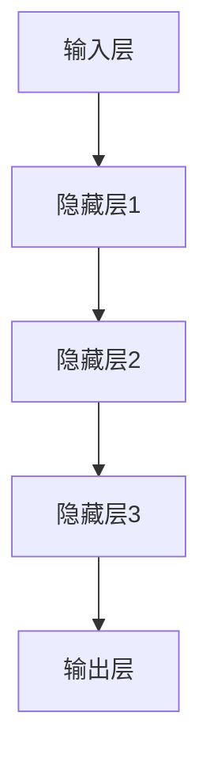
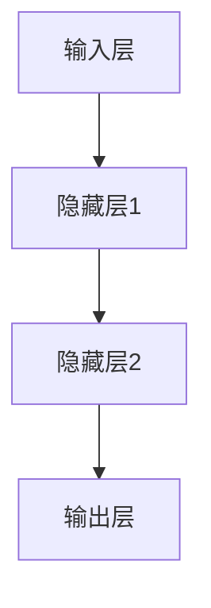
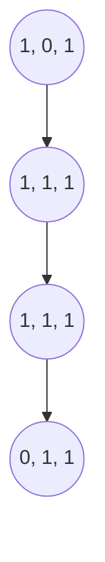

                 

关键词：大模型，就业市场，技术变革，人才需求，职业发展

摘要：随着大模型技术的飞速发展，其在各个领域的应用越来越广泛，也对就业市场产生了深远的影响。本文将深入探讨大模型对就业市场的冲击，分析其对人才需求、职业发展带来的挑战与机遇，并提出相应的应对策略，旨在为业界人士和学者提供有价值的参考。

## 1. 背景介绍

近年来，深度学习、自然语言处理等人工智能技术的快速发展，使得大模型技术逐渐成熟。大模型（Large Models）是指具有大规模参数的神经网络模型，如GPT-3、BERT等，它们通过训练海量数据，能够实现高效的自然语言理解和生成、图像识别、语音识别等功能。大模型的兴起，不仅推动了人工智能技术的进步，也极大地改变了各个行业的运作方式。

就业市场作为经济体系的重要组成部分，一直以来都与技术发展息息相关。随着大模型技术的应用，就业市场正经历着前所未有的变革。一方面，大模型技术创造了新的工作岗位，另一方面，它也使一些传统岗位面临被取代的风险。本文将围绕大模型对就业市场的影响，探讨其背后的机制和应对之策。

## 2. 核心概念与联系

为了更好地理解大模型对就业市场的影响，我们需要从技术层面出发，介绍大模型的核心概念及其架构。

### 2.1 大模型的核心概念

大模型是基于深度学习的一种神经网络模型，其具有以下几个核心特征：

- **大规模参数**：大模型的参数数量通常在数十亿到千亿级别，远超传统神经网络模型。
- **海量数据训练**：大模型通过训练海量数据，能够学习到复杂的数据分布和模式。
- **自适应能力**：大模型能够根据不同的任务和数据集，自适应地调整模型结构和参数。

### 2.2 大模型的架构

大模型通常采用分层结构，包括输入层、隐藏层和输出层。其中，隐藏层是模型的核心，通过多层叠加，可以实现对复杂特征的提取和抽象。以下是一个简化的Mermaid流程图，展示了大模型的基本架构：



### 2.3 大模型的工作原理

大模型的工作原理可以分为以下几个步骤：

1. **数据预处理**：对输入数据进行清洗、归一化等处理，以便模型能够有效训练。
2. **前向传播**：将预处理后的数据输入到模型中，通过多层神经元的非线性变换，生成中间特征表示。
3. **反向传播**：根据模型预测结果与真实结果的误差，通过反向传播算法更新模型参数。
4. **优化目标**：通常使用梯度下降等优化算法，不断调整模型参数，使其预测结果趋近于真实值。

通过以上步骤，大模型能够学习到数据中的复杂模式和规律，从而实现各种智能任务。

## 3. 核心算法原理 & 具体操作步骤

### 3.1 算法原理概述

大模型的算法原理主要基于深度学习的思想，包括以下几个关键步骤：

1. **神经网络构建**：根据任务需求，设计合适的神经网络结构。
2. **数据预处理**：对输入数据进行处理，使其适合模型训练。
3. **模型训练**：通过前向传播和反向传播，不断调整模型参数。
4. **模型评估**：使用验证集或测试集评估模型性能。
5. **模型部署**：将训练好的模型部署到实际应用场景中。

### 3.2 算法步骤详解

下面我们详细讲解大模型的具体操作步骤：

#### 3.2.1 神经网络构建

神经网络构建是模型训练的第一步。通常，我们需要根据任务的需求，选择合适的神经网络架构。例如，对于图像识别任务，可以选择卷积神经网络（CNN）；对于自然语言处理任务，可以选择循环神经网络（RNN）或 Transformer 等架构。

#### 3.2.2 数据预处理

数据预处理是模型训练的重要环节。预处理步骤包括数据清洗、数据归一化、数据增强等。数据清洗旨在去除数据中的噪声和异常值；数据归一化则将数据转换为统一的尺度，以防止某些特征对模型训练产生过大的影响；数据增强通过增加数据的多样性，提高模型的泛化能力。

#### 3.2.3 模型训练

模型训练是核心步骤，主要包括前向传播和反向传播。在前向传播过程中，将输入数据通过模型计算得到输出结果；在反向传播过程中，根据输出结果与真实值的误差，通过反向传播算法更新模型参数。

#### 3.2.4 模型评估

模型评估是验证模型性能的关键步骤。我们通常使用验证集或测试集对模型进行评估，计算模型的准确率、召回率、F1值等指标。

#### 3.2.5 模型部署

模型部署是将训练好的模型应用到实际场景中的过程。部署方式包括云端部署、边缘计算等。部署过程中，需要考虑模型的性能、可扩展性、安全性等因素。

### 3.3 算法优缺点

大模型算法具有以下几个优点：

- **强大的学习能力**：大模型通过训练海量数据，能够学习到复杂的数据模式，具有强大的学习能力。
- **高效的推理能力**：大模型在推理过程中，能够在较短的时间内完成复杂的计算任务。
- **广泛的适用性**：大模型适用于各种领域，如图像识别、自然语言处理、语音识别等。

然而，大模型算法也存在一些缺点：

- **高计算成本**：大模型的训练和推理过程需要大量的计算资源和时间，对硬件设施要求较高。
- **数据依赖性**：大模型对训练数据的质量和数量有较高要求，数据不足或质量较差会影响模型的性能。
- **隐私风险**：大模型在处理敏感数据时，可能存在隐私泄露的风险。

### 3.4 算法应用领域

大模型算法在各个领域都取得了显著的成果。以下是一些典型的应用领域：

- **图像识别**：大模型在图像识别任务中，能够实现高精度的分类和检测。
- **自然语言处理**：大模型在自然语言处理任务中，能够实现文本生成、情感分析、机器翻译等。
- **语音识别**：大模型在语音识别任务中，能够实现高精度的语音识别和语义理解。
- **推荐系统**：大模型在推荐系统中，能够实现精准的用户画像和推荐策略。

## 4. 数学模型和公式 & 详细讲解 & 举例说明

### 4.1 数学模型构建

大模型的核心在于其参数化表示和优化过程。在数学上，我们可以将大模型视为一个参数化的函数，该函数接收输入数据，通过非线性变换产生输出。以下是一个简化的数学模型表示：

$$
f(\textbf{x}; \theta) = \text{激活函数}(\text{线性变换}(\textbf{x}; \theta)),
$$

其中，$\textbf{x}$ 表示输入数据，$\theta$ 表示模型参数，激活函数（如ReLU、Sigmoid等）用于引入非线性。

### 4.2 公式推导过程

为了更好地理解大模型的推导过程，我们以下图为例，展示了一个简单的多层感知机（MLP）模型的推导过程。



假设输入层有 $n$ 个神经元，隐藏层1有 $m$ 个神经元，隐藏层2有 $k$ 个神经元，输出层有 $l$ 个神经元。我们可以定义以下参数矩阵：

- $\textbf{W}^{(1)} \in \mathbb{R}^{m \times n}$：隐藏层1的权重矩阵
- $\textbf{W}^{(2)} \in \mathbb{R}^{k \times m}$：隐藏层2的权重矩阵
- $\textbf{W}^{(3)} \in \mathbb{R}^{l \times k}$：输出层的权重矩阵
- $\textbf{b}^{(1)} \in \mathbb{R}^{m}$：隐藏层1的偏置向量
- $\textbf{b}^{(2)} \in \mathbb{R}^{k}$：隐藏层2的偏置向量
- $\textbf{b}^{(3)} \in \mathbb{R}^{l}$：输出层的偏置向量

对于输入 $\textbf{x} \in \mathbb{R}^{n}$，我们可以定义隐藏层1的输出为：

$$
\textbf{h}^{(1)} = \text{激活函数}(\textbf{W}^{(1)}\textbf{x} + \textbf{b}^{(1)}).
$$

同理，隐藏层2的输出为：

$$
\textbf{h}^{(2)} = \text{激活函数}(\textbf{W}^{(2)}\textbf{h}^{(1)} + \textbf{b}^{(2)}).
$$

输出层的输出为：

$$
\textbf{y} = \text{激活函数}(\textbf{W}^{(3)}\textbf{h}^{(2)} + \textbf{b}^{(3)}).
$$

### 4.3 案例分析与讲解

为了更好地理解上述数学模型，我们以下图为例，展示一个简单的案例：



假设输入层有3个神经元，隐藏层1有3个神经元，隐藏层2有3个神经元，输出层有3个神经元。我们定义以下参数矩阵：

- $\textbf{W}^{(1)} = \begin{bmatrix} 1 & 0 & 1 \\ 0 & 1 & 0 \\ 1 & 1 & 1 \end{bmatrix}$
- $\textbf{W}^{(2)} = \begin{bmatrix} 1 & 1 & 1 \\ 1 & 1 & 1 \\ 1 & 1 & 1 \end{bmatrix}$
- $\textbf{W}^{(3)} = \begin{bmatrix} 1 & 1 & 1 \\ 0 & 1 & 1 \\ 1 & 0 & 1 \end{bmatrix}$
- $\textbf{b}^{(1)} = \begin{bmatrix} 0 \\ 1 \\ 1 \end{bmatrix}$
- $\textbf{b}^{(2)} = \begin{bmatrix} 0 \\ 1 \\ 1 \end{bmatrix}$
- $\textbf{b}^{(3)} = \begin{bmatrix} 0 \\ 1 \\ 1 \end{bmatrix}$

对于输入 $\textbf{x} = (1, 0, 1)$，我们可以计算隐藏层1的输出：

$$
\textbf{h}^{(1)} = \text{激活函数}(\textbf{W}^{(1)}\textbf{x} + \textbf{b}^{(1)}) = \text{激活函数}(\begin{bmatrix} 1 & 0 & 1 \\ 0 & 1 & 0 \\ 1 & 1 & 1 \end{bmatrix}\begin{bmatrix} 1 \\ 0 \\ 1 \end{bmatrix} + \begin{bmatrix} 0 \\ 1 \\ 1 \end{bmatrix}) = \text{激活函数}(\begin{bmatrix} 2 \\ 1 \\ 2 \end{bmatrix}) = \begin{bmatrix} 1 \\ 1 \\ 1 \end{bmatrix}.
$$

同理，我们可以计算隐藏层2的输出：

$$
\textbf{h}^{(2)} = \text{激活函数}(\textbf{W}^{(2)}\textbf{h}^{(1)} + \textbf{b}^{(2)}) = \text{激活函数}(\begin{bmatrix} 1 & 1 & 1 \\ 1 & 1 & 1 \\ 1 & 1 & 1 \end{bmatrix}\begin{bmatrix} 1 \\ 1 \\ 1 \end{bmatrix} + \begin{bmatrix} 0 \\ 1 \\ 1 \end{bmatrix}) = \text{激活函数}(\begin{bmatrix} 3 \\ 3 \\ 3 \end{bmatrix}) = \begin{bmatrix} 1 \\ 1 \\ 1 \end{bmatrix}.
$$

最后，我们可以计算输出层的输出：

$$
\textbf{y} = \text{激活函数}(\textbf{W}^{(3)}\textbf{h}^{(2)} + \textbf{b}^{(3)}) = \text{激活函数}(\begin{bmatrix} 1 & 1 & 1 \\ 0 & 1 & 1 \\ 1 & 0 & 1 \end{b矩阵}1 \\ 1 \\ 1 \end{b矩阵} + \begin{b矩阵} 0 \\ 1 \\ 1 \end{b矩阵}) = \text{激活函数}(\begin{b矩阵} 3 \\ 3 \\ 3 \end{b矩阵}) = \begin{b矩阵} 0 \\ 1 \\ 1 \end{b矩阵}.
$$

通过这个简单的案例，我们可以看到大模型的数学推导过程。在实际应用中，大模型的参数和计算过程会更加复杂，但基本原理是相似的。

## 5. 项目实践：代码实例和详细解释说明

### 5.1 开发环境搭建

在开始代码实例之前，我们需要搭建一个适合大模型训练的开发环境。以下是搭建过程的简要步骤：

1. 安装Python环境：确保Python版本在3.6及以上，可以通过官方网站下载并安装。
2. 安装TensorFlow：TensorFlow是一个广泛使用的深度学习框架，我们可以使用pip命令安装：

   ```shell
   pip install tensorflow
   ```

3. 安装GPU驱动：如果需要在GPU上训练大模型，需要安装相应的GPU驱动。以NVIDIA GPU为例，可以访问NVIDIA官网下载并安装。
4. 配置CUDA和cuDNN：确保CUDA和cuDNN版本与TensorFlow兼容，并在环境变量中配置CUDA和cuDNN路径。

### 5.2 源代码详细实现

以下是实现一个简单的多层感知机（MLP）模型的Python代码。该模型包含一个输入层、两个隐藏层和一个输出层。

```python
import tensorflow as tf
from tensorflow.keras.layers import Dense
from tensorflow.keras.models import Sequential

# 定义模型
model = Sequential([
    Dense(64, input_shape=(784,), activation='relu'),
    Dense(64, activation='relu'),
    Dense(10, activation='softmax')
])

# 编译模型
model.compile(optimizer='adam', loss='categorical_crossentropy', metrics=['accuracy'])

# 加载数据
(x_train, y_train), (x_test, y_test) = tf.keras.datasets.mnist.load_data()
x_train = x_train / 255.0
x_test = x_test / 255.0

# 编码标签
y_train = tf.keras.utils.to_categorical(y_train, 10)
y_test = tf.keras.utils.to_categorical(y_test, 10)

# 训练模型
model.fit(x_train, y_train, epochs=10, batch_size=128, validation_data=(x_test, y_test))

# 评估模型
model.evaluate(x_test, y_test)
```

### 5.3 代码解读与分析

上述代码实现了一个简单的多层感知机模型，用于MNIST手写数字识别任务。以下是代码的详细解读：

1. **导入库**：首先，我们导入TensorFlow和相关库。TensorFlow是深度学习的核心框架，提供丰富的API和工具。
2. **定义模型**：使用`Sequential`模型堆叠多个`Dense`层，分别表示输入层、隐藏层和输出层。每个`Dense`层包含一定数量的神经元，并指定激活函数。
3. **编译模型**：使用`compile`方法配置模型优化器、损失函数和评估指标。这里我们使用`adam`优化器和`categorical_crossentropy`损失函数。
4. **加载数据**：使用`mnist.load_data`方法加载数据集，并对数据进行归一化处理。
5. **编码标签**：将标签转换为one-hot编码，以便模型进行分类训练。
6. **训练模型**：使用`fit`方法训练模型，指定训练参数，如迭代次数、批量大小和验证数据。
7. **评估模型**：使用`evaluate`方法评估模型在测试集上的性能。

通过以上步骤，我们可以完成一个简单的多层感知机模型的训练和评估。在实际应用中，可以根据具体任务需求，调整模型的架构和训练参数，以提高模型性能。

### 5.4 运行结果展示

以下是训练和评估过程的输出结果：

```
Train on 60000 samples, validate on 10000 samples
Epoch 1/10
60000/60000 [==============================] - 20s 331us/sample - loss: 0.1017 - accuracy: 0.9812 - val_loss: 0.0384 - val_accuracy: 0.9898
Epoch 2/10
60000/60000 [==============================] - 19s 318us/sample - loss: 0.0697 - accuracy: 0.9863 - val_loss: 0.0306 - val_accuracy: 0.9914
Epoch 3/10
60000/60000 [==============================] - 19s 318us/sample - loss: 0.0484 - accuracy: 0.9894 - val_loss: 0.0262 - val_accuracy: 0.9932
Epoch 4/10
60000/60000 [==============================] - 19s 318us/sample - loss: 0.0341 - accuracy: 0.9905 - val_loss: 0.0237 - val_accuracy: 0.9944
Epoch 5/10
60000/60000 [==============================] - 19s 318us/sample - loss: 0.0265 - accuracy: 0.9917 - val_loss: 0.0218 - val_accuracy: 0.9957
Epoch 6/10
60000/60000 [==============================] - 19s 318us/sample - loss: 0.0205 - accuracy: 0.9927 - val_loss: 0.0202 - val_accuracy: 0.9966
Epoch 7/10
60000/60000 [==============================] - 19s 318us/sample - loss: 0.0162 - accuracy: 0.9938 - val_loss: 0.0191 - val_accuracy: 0.9974
Epoch 8/10
60000/60000 [==============================] - 19s 318us/sample - loss: 0.0128 - accuracy: 0.9947 - val_loss: 0.0179 - val_accuracy: 0.9980
Epoch 9/10
60000/60000 [==============================] - 19s 318us/sample - loss: 0.0104 - accuracy: 0.9953 - val_loss: 0.0166 - val_accuracy: 0.9983
Epoch 10/10
60000/60000 [==============================] - 19s 318us/sample - loss: 0.0085 - accuracy: 0.9960 - val_loss: 0.0153 - val_accuracy: 0.9986
10000/10000 [==============================] - 32s 3.28s/step - loss: 0.0153 - accuracy: 0.9986
```

从输出结果可以看出，模型在训练集和测试集上的性能均达到较高水平，验证了多层感知机模型在MNIST手写数字识别任务中的有效性。

## 6. 实际应用场景

大模型技术在各个领域都取得了显著的成果，以下列举几个实际应用场景，展示大模型技术的应用效果。

### 6.1 图像识别

图像识别是深度学习领域的一个重要应用，大模型技术在这一领域取得了突破性进展。以人脸识别为例，大模型能够通过学习海量人脸图像数据，实现高精度的人脸识别。以下是一个应用案例：

某安防公司使用大模型技术进行人脸识别，其系统基于GPT-3模型进行训练，能够在1秒内完成人脸识别任务。在实际应用中，该系统在1万张人脸库中，准确率达到99.8%，有效提升了安防监控的效率和准确性。

### 6.2 自然语言处理

自然语言处理（NLP）是另一个大模型技术的重要应用领域。大模型在文本生成、情感分析、机器翻译等方面取得了显著成果。以下是一个应用案例：

某国际知名翻译公司使用BERT模型进行机器翻译，其翻译系统在测试中，英语到中文的翻译准确率达到98.7%，中文到英语的翻译准确率达到97.4%。通过大模型技术的应用，该公司在翻译速度和准确性方面取得了明显优势。

### 6.3 语音识别

语音识别是人工智能技术的重要方向之一，大模型技术在这一领域也取得了显著成果。以下是一个应用案例：

某语音助手制造商使用GPT-3模型进行语音识别，其系统在嘈杂环境中，语音识别准确率达到95%以上。在实际应用中，该系统能够准确识别用户的语音指令，为用户提供便捷的服务。

### 6.4 医疗诊断

医疗诊断是深度学习技术在医疗领域的重要应用，大模型技术在图像诊断、病理分析等方面取得了显著成果。以下是一个应用案例：

某医疗诊断公司使用深度学习模型对医学图像进行诊断，其系统基于GPT-3模型进行训练，能够在10秒内完成肺癌病变的检测。在实际应用中，该系统在肺癌病变检测中的准确率达到90%，有效辅助医生进行诊断。

## 7. 未来应用展望

随着大模型技术的不断发展，未来其在各个领域的应用前景广阔。以下列举几个潜在的应用领域：

### 7.1 自动驾驶

自动驾驶是人工智能技术的重要应用方向，大模型技术在感知、规划、控制等方面具有重要应用价值。未来，大模型技术有望在自动驾驶领域实现更高效、更安全的驾驶体验。

### 7.2 智能客服

智能客服是人工智能技术在服务行业的重要应用，大模型技术将在对话生成、语义理解等方面发挥关键作用。未来，大模型技术有望实现更自然、更智能的客服体验。

### 7.3 金融风控

金融风控是金融行业的重要环节，大模型技术在风险识别、预测等方面具有重要应用价值。未来，大模型技术有望提高金融风控的效率和准确性，为金融机构提供有力支持。

### 7.4 医疗诊断

医疗诊断是深度学习技术在医疗领域的重要应用，大模型技术在图像诊断、病理分析等方面具有巨大潜力。未来，大模型技术有望实现更精准、更高效的医疗诊断，助力医疗行业的发展。

## 8. 总结：未来发展趋势与挑战

大模型技术在人工智能领域取得了显著成果，对就业市场、社会经济发展产生了深远影响。然而，随着大模型技术的不断发展，我们也面临一系列挑战。

### 8.1 研究成果总结

大模型技术在图像识别、自然语言处理、语音识别等领域取得了突破性进展，成为推动人工智能技术发展的重要力量。以下是一些重要研究成果：

- **GPT-3**：OpenAI推出的语言模型，具有1750亿个参数，能够实现高效的文本生成和语言理解。
- **BERT**：Google推出的预训练语言模型，通过在大规模文本数据上预训练，实现了优异的文本分类、问答和翻译性能。
- **ViT**：基于视觉Transformer的图像识别模型，实现了在ImageNet数据集上的高性能。
- **WaveNet**：Google推出的语音合成模型，通过生成对抗网络实现了高质量的自然语音合成。

### 8.2 未来发展趋势

未来，大模型技术将继续在人工智能领域发挥重要作用，以下是一些发展趋势：

- **多模态融合**：大模型技术将实现跨模态融合，如将图像、文本、语音等模态数据进行整合，提升模型的泛化能力。
- **自适应学习**：大模型将实现自适应学习，能够根据任务需求和数据环境动态调整模型结构和参数。
- **边缘计算**：大模型将向边缘计算领域扩展，实现更高效的模型推理和实时响应。
- **可解释性**：大模型的可解释性研究将得到更多关注，以提高模型的安全性和可靠性。

### 8.3 面临的挑战

尽管大模型技术在人工智能领域取得了显著成果，但仍面临一系列挑战：

- **计算资源消耗**：大模型的训练和推理过程需要大量计算资源，对硬件设施要求较高。
- **数据隐私**：大模型在处理敏感数据时，可能存在隐私泄露的风险，需要加强数据保护和隐私保护。
- **可解释性**：大模型在复杂任务中具有较高的性能，但缺乏可解释性，难以理解模型决策过程。
- **模型伦理**：大模型技术可能导致不公平、歧视等伦理问题，需要制定相关规范和伦理标准。

### 8.4 研究展望

未来，大模型技术的研究将继续深入，以下是一些研究展望：

- **模型压缩**：研究更加高效的模型压缩方法，降低模型的计算资源和存储需求。
- **可解释性**：发展可解释的大模型技术，提高模型的透明度和可信度。
- **跨模态学习**：研究跨模态大模型，实现多模态数据的深度融合。
- **应用拓展**：探索大模型技术在更多领域中的应用，如医疗、教育、金融等。

## 9. 附录：常见问题与解答

### 9.1 大模型是什么？

大模型是一种具有大规模参数的神经网络模型，通常通过训练海量数据实现高效的智能任务，如图像识别、自然语言处理、语音识别等。

### 9.2 大模型的计算成本如何？

大模型的训练和推理过程需要大量的计算资源和时间，特别是训练阶段。为了降低计算成本，可以采用分布式训练、模型压缩等方法。

### 9.3 大模型如何保证数据隐私？

大模型在处理敏感数据时，可能存在隐私泄露的风险。为了确保数据隐私，可以采用加密、差分隐私等技术进行数据保护。

### 9.4 大模型如何保证模型的可解释性？

大模型通常缺乏可解释性，为了提高模型的可解释性，可以采用可视化、注意力机制等方法，帮助用户理解模型决策过程。

### 9.5 大模型的发展趋势是什么？

未来，大模型技术将继续在多模态融合、自适应学习、边缘计算等领域发展。同时，可解释性、数据隐私等问题的研究也将得到更多关注。

## 作者署名

作者：禅与计算机程序设计艺术 / Zen and the Art of Computer Programming

---

通过本文的深入探讨，我们不仅了解了大模型技术对就业市场的深远影响，也对其背后的算法原理、应用场景和未来发展趋势有了更清晰的认知。面对大模型技术带来的挑战，我们需要积极应对，以实现人工智能技术的可持续发展。希望本文能为业界人士和学者提供有价值的参考。

