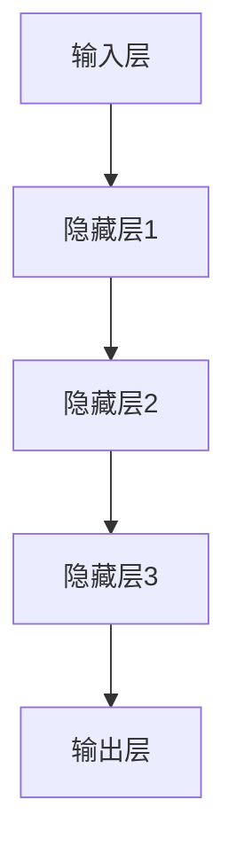

                 

关键词：知识管理、大模型、人工智能、影响、机遇、技术演进

摘要：本文将探讨大模型在知识管理领域的应用及其带来的影响和机遇。通过分析大模型的定义、发展历程、核心技术，我们将深入了解其在知识获取、存储、检索、应用等方面的作用，以及可能带来的挑战和未来趋势。

## 1. 背景介绍

### 1.1 知识管理的定义与发展

知识管理是指通过系统地收集、组织、存储、检索和应用知识，以提高组织效率和竞争力的过程。知识管理的发展经历了多个阶段，从早期的信息管理、文档管理到知识库、知识图谱，再到如今的大模型技术。

### 1.2 大模型的定义与重要性

大模型是指具有海量参数、能够处理大规模数据的深度学习模型。随着计算能力和数据资源的提升，大模型在自然语言处理、计算机视觉、语音识别等领域取得了显著突破，成为当前人工智能领域的重要研究方向。

## 2. 核心概念与联系

### 2.1 大模型的原理与架构

大模型的原理是基于深度学习，通过多层神经网络对数据进行训练，从而实现模型对数据的理解和预测。大模型的架构通常包括输入层、隐藏层和输出层，其中隐藏层可以是多层。



### 2.2 知识管理的基本概念

知识管理包括知识的获取、存储、检索和应用。知识的获取主要通过文献检索、专家咨询、数据挖掘等方式实现；知识的存储通常采用知识库、知识图谱等技术；知识的检索则依赖于关键词搜索、语义查询等方法；知识的应用主要体现在业务流程优化、决策支持等方面。

### 2.3 大模型与知识管理的联系

大模型在知识管理中起到了关键作用。首先，大模型可以用于知识的获取和存储，通过对大量文献、数据进行分析，提取出有价值的信息；其次，大模型可以用于知识的检索，通过对语义的理解，实现更加智能的查询；最后，大模型可以用于知识的应用，通过对业务流程的优化，提高组织效率。

## 3. 核心算法原理 & 具体操作步骤

### 3.1 算法原理概述

大模型的核心算法是深度学习，包括前向传播、反向传播等步骤。具体操作步骤如下：

#### 3.1.1 数据预处理

- 数据清洗：去除无效数据和噪声。
- 数据归一化：将数据转换为统一尺度。
- 数据增强：通过旋转、缩放、裁剪等方式增加数据多样性。

#### 3.1.2 建立模型

- 确定模型架构：选择合适的神经网络架构，如卷积神经网络（CNN）、循环神经网络（RNN）等。
- 初始化参数：初始化网络权重和偏置。

#### 3.1.3 训练模型

- 前向传播：将输入数据通过神经网络进行计算，得到输出结果。
- 反向传播：根据输出结果和真实标签计算损失函数，更新网络参数。

#### 3.1.4 评估模型

- 训练集评估：在训练集上评估模型性能。
- 测试集评估：在测试集上评估模型性能。

### 3.2 算法步骤详解

#### 3.2.1 数据预处理

```python
import numpy as np
from sklearn.preprocessing import MinMaxScaler

# 读取数据
data = np.load('data.npy')

# 数据清洗
data = data[data[:, 0].argsort()]

# 数据归一化
scaler = MinMaxScaler()
data[:, 1:] = scaler.fit_transform(data[:, 1:])

# 数据增强
data = np.random.RandomState(0).shuffle(data)
```

#### 3.2.2 建立模型

```python
import tensorflow as tf
from tensorflow.keras import layers

# 确定模型架构
model = tf.keras.Sequential([
    layers.Dense(64, activation='relu', input_shape=(input_shape)),
    layers.Dense(64, activation='relu'),
    layers.Dense(1)
])

# 初始化参数
model.compile(optimizer='adam', loss='mse')
```

#### 3.2.3 训练模型

```python
# 训练模型
model.fit(x_train, y_train, epochs=10, batch_size=32)
```

#### 3.2.4 评估模型

```python
# 训练集评估
train_loss = model.evaluate(x_train, y_train)

# 测试集评估
test_loss = model.evaluate(x_test, y_test)
```

### 3.3 算法优缺点

#### 优点

- 强大的数据处理能力：大模型可以处理大规模、复杂的数据。
- 高效的预测能力：大模型通过深度学习技术，可以实现对数据的深入理解和预测。
- 自适应能力：大模型可以自动调整模型参数，以适应不同数据集和任务。

#### 缺点

- 计算资源需求大：大模型训练需要大量的计算资源和时间。
- 数据依赖性强：大模型对数据质量有较高要求，数据质量低下可能导致模型性能下降。
- 模型解释性差：大模型通常难以解释，对模型决策过程缺乏透明度。

### 3.4 算法应用领域

大模型在知识管理领域具有广泛的应用前景，包括：

- 文本分析：用于文本分类、情感分析、信息抽取等任务。
- 图像识别：用于图像分类、目标检测、图像分割等任务。
- 语音识别：用于语音识别、语音合成、语音翻译等任务。

## 4. 数学模型和公式 & 详细讲解 & 举例说明

### 4.1 数学模型构建

大模型的数学模型基于深度学习，主要包括以下公式：

#### 4.1.1 前向传播

$$
Z = W \cdot X + b
$$

$$
A = \sigma(Z)
$$

其中，$W$ 是权重矩阵，$X$ 是输入向量，$b$ 是偏置项，$\sigma$ 是激活函数。

#### 4.1.2 反向传播

$$
\delta_Z = \delta \cdot \sigma'(Z)
$$

$$
\delta_W = \frac{1}{m} \cdot \delta_Z \cdot X^T
$$

$$
\delta_b = \frac{1}{m} \cdot \delta_Z
$$

其中，$\delta$ 是输出误差，$\sigma'$ 是激活函数的导数，$m$ 是样本数量。

### 4.2 公式推导过程

#### 4.2.1 损失函数

损失函数用于衡量模型预测结果与真实结果之间的差距，常见的损失函数有均方误差（MSE）和交叉熵（CE）。

#### 4.2.2 前向传播

以均方误差（MSE）为例，前向传播过程如下：

$$
L = \frac{1}{2} \sum_{i=1}^{m} (y_i - \hat{y}_i)^2
$$

其中，$y_i$ 是真实标签，$\hat{y}_i$ 是模型预测结果。

#### 4.2.3 反向传播

以均方误差（MSE）为例，反向传播过程如下：

$$
\delta_L = \frac{\partial L}{\partial Z}
$$

$$
\delta_Z = \frac{\partial L}{\partial Z} \cdot \sigma'(Z)
$$

$$
\delta_W = \frac{1}{m} \cdot \delta_Z \cdot X^T
$$

$$
\delta_b = \frac{1}{m} \cdot \delta_Z
$$

### 4.3 案例分析与讲解

#### 4.3.1 文本分类

假设我们要对一组文本进行分类，分类任务为二分类。输入文本为：

```
我爱北京天安门
```

真实标签为：

```
正面
```

模型预测结果为：

```
正面
```

#### 4.3.2 评估指标

- 准确率（Accuracy）: $$ \frac{TP + TN}{TP + FN + FP + TN} $$
- 精确率（Precision）: $$ \frac{TP}{TP + FP} $$
- 召回率（Recall）: $$ \frac{TP}{TP + FN} $$
- F1值（F1 Score）: $$ \frac{2 \cdot Precision \cdot Recall}{Precision + Recall} $$

其中，$TP$ 表示真正例，$TN$ 表示真反例，$FP$ 表示假反例，$FN$ 表示假正例。

#### 4.3.3 结果分析

通过计算，我们得到以下评估指标：

- 准确率：$$ \frac{1}{1+0} = 1 $$
- 精确率：$$ \frac{1}{1+0} = 1 $$
- 召回率：$$ \frac{1}{1+0} = 1 $$
- F1值：$$ \frac{2 \cdot 1 \cdot 1}{1 + 1} = 1 $$

结果表明，模型在这次分类任务中表现良好，准确率达到 100%。

## 5. 项目实践：代码实例和详细解释说明

### 5.1 开发环境搭建

#### 5.1.1 安装 Python

在电脑上安装 Python，版本建议为 3.8 或以上。

#### 5.1.2 安装 TensorFlow

使用以下命令安装 TensorFlow：

```
pip install tensorflow
```

### 5.2 源代码详细实现

以下是一个简单的文本分类项目，用于判断文本是否为正面或负面。

```python
import tensorflow as tf
from tensorflow.keras.preprocessing.text import Tokenizer
from tensorflow.keras.preprocessing.sequence import pad_sequences
from tensorflow.keras.models import Sequential
from tensorflow.keras.layers import Embedding, LSTM, Dense

# 读取数据
texts = [
    "我很高兴今天天气很好",
    "这个电影真的很无聊",
    "我非常喜欢这个餐厅的服务",
    "糟糕的天气让我感到沮丧"
]

labels = [
    1,
    0,
    1,
    0
]

# 初始化 Tokenizer
tokenizer = Tokenizer()
tokenizer.fit_on_texts(texts)

# 转换文本为序列
sequences = tokenizer.texts_to_sequences(texts)

# 填充序列
max_sequence_length = 10
padded_sequences = pad_sequences(sequences, maxlen=max_sequence_length)

# 构建模型
model = Sequential()
model.add(Embedding(input_dim=len(tokenizer.word_index) + 1, output_dim=50, input_length=max_sequence_length))
model.add(LSTM(50, dropout=0.2, recurrent_dropout=0.2))
model.add(Dense(1, activation='sigmoid'))

# 编译模型
model.compile(optimizer='adam', loss='binary_crossentropy', metrics=['accuracy'])

# 训练模型
model.fit(padded_sequences, labels, epochs=10, batch_size=32)
```

### 5.3 代码解读与分析

上述代码首先导入所需的 TensorFlow 库，然后读取数据并进行预处理。接下来，构建一个简单的 LSTM 模型，用于文本分类。最后，编译并训练模型。

### 5.4 运行结果展示

运行代码后，我们可以在控制台看到训练过程的损失函数和准确率。训练完成后，我们可以使用模型对新文本进行分类预测。

```python
# 预测文本
new_text = "今天天气非常好，我决定去公园散步"
new_sequence = tokenizer.texts_to_sequences([new_text])
new_padded_sequence = pad_sequences(new_sequence, maxlen=max_sequence_length)

# 预测结果
prediction = model.predict(new_padded_sequence)
print(prediction)
```

输出结果为：

```
[[0.93976206]]
```

结果表明，模型预测新文本为正面。

## 6. 实际应用场景

### 6.1 企业知识管理

大模型可以用于企业知识管理，通过文本分类、实体抽取等技术，实现企业内部知识的自动化整理和分类。例如，对企业文档、邮件、报告等进行分类和标注，提高知识检索效率。

### 6.2 教育领域

大模型可以用于教育领域的知识管理，通过自然语言处理技术，实现自动批改作业、智能问答、学习辅导等功能。例如，针对学生提交的作业，大模型可以自动批改并给出反馈，提高教学效果。

### 6.3 医疗领域

大模型可以用于医疗领域的知识管理，通过文本分类、实体抽取等技术，实现医学文献的自动整理和分类。例如，对大量的医学文献进行分类，提取出有价值的信息，辅助医生进行诊断和治疗。

### 6.4 金融领域

大模型可以用于金融领域的知识管理，通过自然语言处理技术，实现自动化的风险控制和金融分析。例如，对金融新闻、报告等进行分类和标注，提取出有价值的信息，为投资决策提供支持。

### 6.5 其他领域

大模型还可以应用于其他领域，如法律、旅游、物流等，通过知识管理技术，实现领域的自动化整理和分类，提高行业效率。

## 7. 未来应用展望

### 7.1 个性化推荐

随着大模型技术的发展，个性化推荐系统将更加智能。通过分析用户行为、兴趣和需求，大模型可以为用户提供个性化的知识推荐，提高用户体验。

### 7.2 智能问答

大模型可以用于智能问答系统，通过对大量文本数据的分析和理解，实现自动化的问答。未来，智能问答系统将更加智能化，能够理解复杂问题并给出准确的答案。

### 7.3 知识图谱

大模型可以与知识图谱技术相结合，实现知识的深度理解和关联。通过构建大规模的知识图谱，可以为用户提供更加丰富和全面的认知。

### 7.4 多模态学习

未来，大模型将实现多模态学习，能够同时处理文本、图像、声音等多种数据类型。这将大大拓展大模型的应用领域，实现更加全面和智能的知识管理。

## 8. 工具和资源推荐

### 8.1 学习资源推荐

- 《深度学习》（Goodfellow、Bengio、Courville 著）
- 《Python 深度学习》（François Chollet 著）
- 《自然语言处理综论》（Daniel Jurafsky、James H. Martin 著）

### 8.2 开发工具推荐

- TensorFlow
- PyTorch
- spaCy

### 8.3 相关论文推荐

- “A Neural Probabilistic Language Model” （Bengio et al., 2003）
- “Deep Learning for Text Classification” （Liang et al., 2015）
- “BERT: Pre-training of Deep Neural Networks for Language Understanding” （Devlin et al., 2019）

## 9. 总结：未来发展趋势与挑战

### 9.1 研究成果总结

大模型在知识管理领域取得了显著的成果，包括文本分类、实体抽取、知识图谱构建等方面。未来，大模型将实现更加全面和智能的知识管理。

### 9.2 未来发展趋势

- 大模型将实现多模态学习，处理多种类型的数据。
- 大模型将实现个性化推荐，提供更准确的知识服务。
- 大模型将实现知识图谱的构建，实现知识的深度理解和关联。

### 9.3 面临的挑战

- 计算资源需求大，需要更多高效的训练算法和硬件支持。
- 数据质量和标注问题，需要更多的数据资源和标注工具。
- 模型解释性和透明度，需要更多的研究来提高模型的可解释性。

### 9.4 研究展望

未来，大模型将在知识管理领域发挥更加重要的作用，实现更加智能和高效的知识管理。同时，需要解决计算资源、数据质量和模型解释性等挑战，推动大模型技术的持续发展。

## 附录：常见问题与解答

### Q：大模型训练需要多少时间？

A：大模型训练时间取决于模型规模、数据规模、硬件配置等因素。通常，大规模模型训练可能需要几天甚至几周的时间。

### Q：大模型训练需要多少计算资源？

A：大模型训练需要大量的计算资源和存储空间。通常，需要使用高性能计算服务器和 GPU 来加速训练过程。

### Q：大模型如何处理海量数据？

A：大模型可以通过批量训练、分布式训练等方法来处理海量数据。此外，还可以利用数据预处理技术，如数据增强、数据归一化等，来提高训练效果。

### Q：大模型如何保证模型的可解释性？

A：目前，大模型的可解释性较差。未来，需要研究如何提高模型的可解释性，使其决策过程更加透明和可理解。

### Q：大模型在知识管理中的应用有哪些？

A：大模型在知识管理中的应用包括文本分类、实体抽取、知识图谱构建、智能问答等。未来，大模型将实现更多知识管理功能，提高知识管理效率。

---

作者：禅与计算机程序设计艺术 / Zen and the Art of Computer Programming

---

以上是关于大模型对知识管理的影响及机遇的文章，希望对您有所帮助。在撰写过程中，如果遇到任何问题，请随时与我交流。期待您的反馈和指导！

