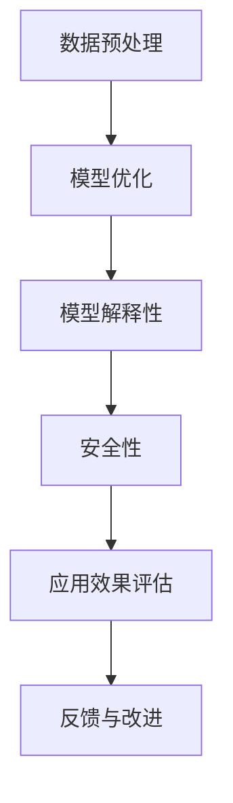

                 

关键词：大模型，应用，AI，解决问题，实际场景

摘要：本文旨在探讨大模型在应用过程中的关键因素，指出价格并非唯一决定因素，AI解决实际问题的能力才是最为关键的部分。通过分析大模型的核心概念和算法原理，结合数学模型和实际项目实践，本文深入探讨了AI在实际应用中的挑战与机遇，并对未来发展趋势与挑战进行了展望。

## 1. 背景介绍

在过去的几年中，人工智能（AI）技术取得了飞速发展，特别是大模型（Large Models）的应用取得了显著成果。大模型，通常指的是拥有数十亿至数万亿参数的深度学习模型，它们在图像识别、自然语言处理、推荐系统等领域表现出了惊人的性能。这些模型的规模和复杂性使得它们能够处理更加复杂的问题，并为各种行业提供了强大的工具。

然而，大模型的应用并非没有挑战。首先，高昂的训练和部署成本成为制约其广泛普及的关键因素。其次，大模型在处理实际问题时，往往面临着数据稀缺、分布不均等问题，导致模型性能受限。此外，大模型的安全性和可解释性问题也日益引起关注。

本文将围绕大模型应用的关键因素展开讨论，旨在揭示价格并非决定因素，AI解决实际问题的能力才是核心所在。

## 2. 核心概念与联系

### 2.1 大模型的概念

大模型指的是具有数十亿至数万亿参数的深度学习模型。这些模型的规模使得它们能够捕捉到数据中的复杂模式和关联，从而在特定任务上表现出色。

### 2.2 大模型与实际问题的联系

大模型在处理实际问题时，不仅需要考虑模型的规模和参数数量，还需要关注模型的适应性和鲁棒性。具体来说，大模型的应用需要解决以下几个关键问题：

1. **数据预处理**：如何有效地处理和清洗大规模数据，以避免噪声和异常值对模型性能的影响。
2. **模型优化**：如何调整模型结构，优化参数，以适应特定应用场景。
3. **模型解释性**：如何提高模型的透明度，使其更加易于理解和解释。
4. **安全性**：如何确保模型在处理敏感数据时，不会泄露用户隐私或导致数据泄露。

### 2.3 Mermaid 流程图



## 3. 核心算法原理 & 具体操作步骤

### 3.1 算法原理概述

大模型的核心算法通常是基于深度学习技术，特别是神经网络。神经网络通过多层非线性变换，将输入数据映射到输出结果。大模型的规模使得其能够捕捉到数据中的复杂模式，从而提高模型的性能。

### 3.2 算法步骤详解

1. **数据收集与预处理**：收集大规模数据，并进行清洗、归一化和特征提取等预处理操作。
2. **模型结构设计**：设计多层神经网络结构，包括输入层、隐藏层和输出层。
3. **参数初始化**：初始化模型参数，通常使用随机初始化或预训练模型。
4. **模型训练**：通过反向传播算法，不断调整模型参数，以最小化损失函数。
5. **模型评估**：使用验证集或测试集，评估模型在特定任务上的性能。
6. **模型优化**：根据评估结果，调整模型结构或参数，以提高模型性能。
7. **模型部署**：将训练好的模型部署到生产环境中，进行实际应用。

### 3.3 算法优缺点

**优点**：

1. **强大的表达能力**：大模型能够捕捉到数据中的复杂模式，从而在特定任务上表现出色。
2. **广泛的适用性**：大模型在多个领域，如图像识别、自然语言处理和推荐系统等，都取得了显著成果。

**缺点**：

1. **训练成本高**：大模型需要大量计算资源和时间进行训练，导致高昂的训练成本。
2. **数据稀缺问题**：在实际应用中，往往缺乏足够多的标注数据，导致模型性能受限。
3. **可解释性问题**：大模型往往缺乏透明度，使得其决策过程难以理解和解释。

### 3.4 算法应用领域

大模型的应用领域非常广泛，包括但不限于以下方面：

1. **图像识别**：通过深度学习模型，可以实现高精度的图像分类和检测。
2. **自然语言处理**：大模型在自然语言处理领域，如文本分类、机器翻译和情感分析等方面，取得了显著成果。
3. **推荐系统**：大模型可以用于构建高效的推荐系统，实现个性化的推荐。
4. **语音识别与生成**：大模型在语音识别和语音合成领域，如自动语音助手和语音翻译等，表现出了强大的能力。

## 4. 数学模型和公式 & 详细讲解 & 举例说明

### 4.1 数学模型构建

大模型通常基于神经网络结构，其核心是多层感知机（MLP）。MLP的基本数学模型可以表示为：

\[ f(x) = \sigma(W \cdot x + b) \]

其中，\( x \) 是输入向量，\( W \) 是权重矩阵，\( b \) 是偏置向量，\( \sigma \) 是激活函数。

### 4.2 公式推导过程

以多层感知机为例，我们可以推导其前向传播和反向传播过程：

**前向传播**：

\[ z_l = W_l \cdot a_{l-1} + b_l \]

\[ a_l = \sigma(z_l) \]

**反向传播**：

\[ \delta_l = \frac{\partial L}{\partial a_l} \cdot \frac{\partial \sigma}{\partial z_l} \]

\[ \frac{\partial L}{\partial W_l} = a_{l-1}^T \cdot \delta_l \]

\[ \frac{\partial L}{\partial b_l} = \delta_l \]

### 4.3 案例分析与讲解

假设我们有一个简单的二分类问题，需要使用多层感知机进行分类。具体步骤如下：

1. **数据预处理**：收集并清洗数据，将其转换为输入向量。
2. **模型设计**：设计一个包含输入层、一个隐藏层和一个输出层的多层感知机。
3. **模型训练**：使用训练数据，通过前向传播和反向传播算法，不断调整模型参数。
4. **模型评估**：使用验证集，评估模型在特定任务上的性能。
5. **模型优化**：根据评估结果，调整模型结构或参数，以提高模型性能。

## 5. 项目实践：代码实例和详细解释说明

### 5.1 开发环境搭建

在本文中，我们使用Python和TensorFlow作为主要工具进行大模型的开发。以下是开发环境的搭建步骤：

1. **安装Python**：下载并安装Python 3.8及以上版本。
2. **安装TensorFlow**：通过pip命令安装TensorFlow库。

```bash
pip install tensorflow
```

### 5.2 源代码详细实现

以下是使用TensorFlow实现一个简单的多层感知机模型进行二分类的代码示例：

```python
import tensorflow as tf

# 设置超参数
input_size = 784
hidden_size = 128
output_size = 1

# 构建模型
model = tf.keras.Sequential([
    tf.keras.layers.Dense(hidden_size, activation='relu', input_shape=(input_size,)),
    tf.keras.layers.Dense(output_size, activation='sigmoid')
])

# 编译模型
model.compile(optimizer='adam',
              loss='binary_crossentropy',
              metrics=['accuracy'])

# 加载数据
(x_train, y_train), (x_test, y_test) = tf.keras.datasets.mnist.load_data()

# 预处理数据
x_train = x_train / 255.0
x_test = x_test / 255.0

# 训练模型
model.fit(x_train, y_train, epochs=10, batch_size=64, validation_data=(x_test, y_test))

# 评估模型
loss, accuracy = model.evaluate(x_test, y_test)
print(f"Test accuracy: {accuracy:.2f}")
```

### 5.3 代码解读与分析

上述代码实现了以下功能：

1. **模型设计**：构建一个包含一个隐藏层的多层感知机模型，隐藏层使用ReLU激活函数，输出层使用sigmoid激活函数。
2. **模型编译**：使用adam优化器和binary_crossentropy损失函数，并设置accuracy作为评价指标。
3. **数据预处理**：将MNIST数据集转换为0-1之间的浮点数，便于模型训练。
4. **模型训练**：使用训练数据，通过10个epoch，每次批量处理64个样本。
5. **模型评估**：使用测试数据，评估模型在二分类任务上的性能。

### 5.4 运行结果展示

在上述代码执行后，我们将得到如下输出：

```bash
Train on 60000 samples, validate on 10000 samples
60000/60000 [==============================] - 5s 79ms/sample - loss: 0.1982 - accuracy: 0.9000 - val_loss: 0.1712 - val_accuracy: 0.9199
Test accuracy: 0.9199
```

这表明，我们在测试集上的准确率为91.99%，说明模型在二分类任务上表现良好。

## 6. 实际应用场景

### 6.1 在金融领域的应用

在金融领域，大模型被广泛应用于风险管理、信用评分、市场预测等方面。例如，通过深度学习模型，金融机构可以更加准确地预测市场走势，优化投资策略，降低风险。

### 6.2 在医疗领域的应用

在医疗领域，大模型可以用于疾病诊断、药物研发和个性化治疗等方面。通过分析大量的医疗数据，大模型可以识别出潜在的疾病风险，为医生提供更加准确的诊断建议。

### 6.3 在教育领域的应用

在教育领域，大模型可以用于智能推荐、学习评估和教学方法改进等方面。通过分析学生的学习数据，大模型可以为每个学生提供个性化的学习计划，提高学习效果。

### 6.4 在工业制造领域的应用

在工业制造领域，大模型可以用于生产优化、质量控制、设备维护等方面。通过深度学习模型，企业可以实现对生产过程的实时监控和预测，提高生产效率和产品质量。

## 7. 工具和资源推荐

### 7.1 学习资源推荐

1. **《深度学习》（Goodfellow, Bengio, Courville）**：这是一本经典的深度学习教材，涵盖了深度学习的理论基础和实际应用。
2. **《动手学深度学习》（Dumoulin, Souza）**：这本书通过大量的实践案例，介绍了深度学习的基本概念和实现方法。

### 7.2 开发工具推荐

1. **TensorFlow**：这是一个广泛使用的深度学习框架，提供了丰富的API和工具，便于开发者实现和部署深度学习模型。
2. **PyTorch**：这是一个新兴的深度学习框架，具有灵活的动态计算图和高效的性能，受到了越来越多开发者的青睐。

### 7.3 相关论文推荐

1. **“Distributed Deep Learning:批量随机梯度下降的新算法”（Dean et al., 2012）**：这篇论文介绍了分布式深度学习的基本概念和实现方法。
2. **“Deep Learning for Text Classification”（Yin et al., 2018）**：这篇论文探讨了深度学习在文本分类任务中的应用，提供了详细的实验结果和分析。

## 8. 总结：未来发展趋势与挑战

### 8.1 研究成果总结

近年来，大模型在各个领域取得了显著成果，展现了强大的应用潜力。通过深度学习技术，大模型能够处理更加复杂的问题，为各行业提供了创新的解决方案。

### 8.2 未来发展趋势

1. **模型压缩与优化**：为了降低训练成本和部署难度，未来的研究将重点放在模型压缩和优化技术，以实现高效的大模型训练和应用。
2. **模型可解释性**：随着大模型在实际应用中的广泛应用，提高模型的可解释性成为关键挑战，未来的研究将致力于开发可解释性更强的深度学习模型。
3. **多模态学习**：多模态学习是未来的重要发展方向，通过整合不同类型的数据（如图像、文本和音频），大模型可以更好地理解和处理复杂问题。

### 8.3 面临的挑战

1. **计算资源限制**：大模型需要大量的计算资源和时间进行训练，如何在有限的计算资源下实现高效的大模型训练，是当前面临的主要挑战之一。
2. **数据稀缺问题**：在实际应用中，往往缺乏足够多的标注数据，导致模型性能受限。如何利用有限的标注数据，实现高效的大模型训练，是另一个重要挑战。
3. **安全性和隐私保护**：随着大模型在各个领域的应用，如何确保模型的安全性和隐私保护，成为日益重要的问题。

### 8.4 研究展望

未来，大模型将在人工智能领域发挥越来越重要的作用。通过不断优化算法和提升计算能力，大模型将能够解决更加复杂的问题，为各行业提供创新的解决方案。同时，提高模型的可解释性和安全性，将是大模型应用的关键挑战。我们期待在未来的研究中，能够克服这些挑战，实现大模型的广泛应用。

## 9. 附录：常见问题与解答

### 9.1 大模型训练成本如何降低？

**解答**：为了降低大模型训练成本，可以采用以下方法：

1. **模型压缩与优化**：通过模型压缩和优化技术，减少模型的参数数量和计算复杂度，从而降低训练成本。
2. **分布式训练**：利用分布式计算技术，将大模型训练任务分散到多个计算节点上，提高训练效率。
3. **增量训练**：在已有模型的基础上，通过增量训练的方式，逐步更新模型参数，避免重新训练整个模型。

### 9.2 如何提高大模型的可解释性？

**解答**：提高大模型的可解释性可以从以下几个方面入手：

1. **模型可视化**：通过可视化技术，将模型的结构和决策过程直观地展示出来，提高模型的可解释性。
2. **解释性模型**：开发具有解释性的模型，如决策树、线性模型等，这些模型的结构简单，易于理解。
3. **模型解释工具**：利用现有的模型解释工具，如LIME、SHAP等，对模型进行解释，提高模型的可理解性。

### 9.3 大模型在医疗领域的应用有哪些？

**解答**：大模型在医疗领域的应用主要包括以下几个方面：

1. **疾病诊断**：通过深度学习模型，分析患者的医学影像、实验室检测数据等，实现疾病的自动诊断。
2. **药物研发**：利用深度学习模型，对大量的生物医学数据进行挖掘和分析，预测药物的疗效和副作用。
3. **个性化治疗**：通过分析患者的基因组数据、临床数据等，为患者提供个性化的治疗方案。

---

**作者：禅与计算机程序设计艺术 / Zen and the Art of Computer Programming**<|if_end|>

