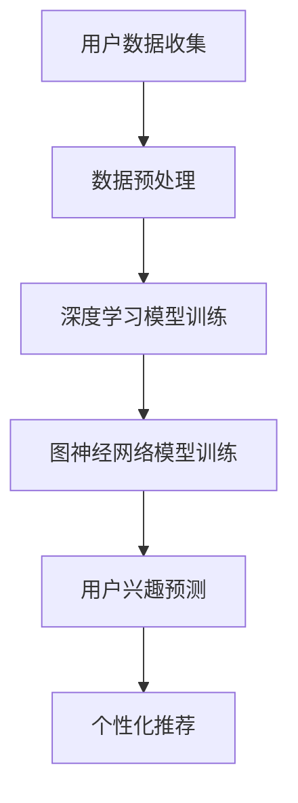

                 

关键词：大模型技术，用户兴趣建模，电商平台，个性化推荐，机器学习，深度学习，图神经网络

## 摘要

本文将探讨大模型技术在电商平台用户兴趣建模中的应用。随着大数据和人工智能技术的飞速发展，电商平台对用户个性化推荐的需求日益增加。大模型技术，特别是基于深度学习和图神经网络的模型，为用户兴趣建模提供了强大的工具。本文首先介绍了大模型技术的基本概念和原理，然后详细阐述了在电商平台用户兴趣建模中的具体应用，包括算法原理、数学模型、实践案例以及未来展望。

## 1. 背景介绍

随着互联网的普及和电商平台的兴起，用户数量和交易规模呈现爆炸式增长。为了提高用户体验，电商平台需要精准地捕捉和满足用户的需求。个性化推荐系统作为一种有效的解决方案，已经成为电商平台的核心竞争力之一。个性化推荐系统通过分析用户的浏览历史、购买行为和社交信息，预测用户的兴趣偏好，从而向用户推荐相关的商品。

传统推荐系统主要基于协同过滤、内容匹配等算法，虽然在一定程度上提高了推荐的准确性，但仍然存在一些局限性。首先，传统推荐系统往往依赖于用户的历史行为数据，对于新用户或者行为数据稀疏的用户，推荐效果较差。其次，传统推荐系统难以处理复杂的用户兴趣，往往只能推荐与历史行为相似的物品。此外，随着电商平台的规模扩大，推荐系统的计算效率和可扩展性也成为一个重要挑战。

为了解决上述问题，大模型技术应运而生。大模型技术，特别是基于深度学习和图神经网络的模型，通过对海量用户数据的深度挖掘，可以更准确地捕捉用户的兴趣偏好，实现个性化的推荐。

## 2. 核心概念与联系

### 2.1 大模型技术

大模型技术是指通过大规模数据训练，构建具有强大表征能力的神经网络模型。大模型技术主要包括深度学习和图神经网络。

- **深度学习**：深度学习是一种基于多层神经网络的学习方法，通过不断调整网络中的权重，实现对数据的特征提取和分类。深度学习在图像识别、自然语言处理等领域取得了显著的成果。
- **图神经网络**：图神经网络是一种在图结构上定义的神经网络，能够处理具有复杂关系的图形数据。图神经网络在社交网络分析、推荐系统等领域具有广泛应用。

### 2.2 用户兴趣建模

用户兴趣建模是指通过分析用户的浏览历史、购买行为等数据，构建用户兴趣的表征模型。用户兴趣建模的目标是预测用户的兴趣偏好，为用户推荐相关的商品。

### 2.3 Mermaid 流程图

以下是一个简单的Mermaid流程图，展示了大模型技术在用户兴趣建模中的应用流程。



## 3. 核心算法原理 & 具体操作步骤

### 3.1 算法原理概述

大模型技术在用户兴趣建模中的核心算法主要包括深度学习和图神经网络。

- **深度学习**：深度学习通过多层神经网络，对用户数据进行特征提取和分类。深度学习模型的训练过程包括数据输入、前向传播、反向传播和参数更新。通过多次迭代，模型能够不断优化，提高预测准确性。
- **图神经网络**：图神经网络通过图结构，对用户数据进行建模。图神经网络的核心在于图卷积操作，通过对节点和边的关系进行建模，可以更好地捕捉用户的兴趣偏好。

### 3.2 算法步骤详解

以下是使用大模型技术进行用户兴趣建模的详细步骤：

1. **数据收集**：收集用户的浏览历史、购买行为、社交信息等数据。
2. **数据预处理**：对数据进行清洗、去重、填充等处理，确保数据的质量。
3. **特征提取**：通过深度学习模型，对用户数据进行特征提取。特征提取过程包括输入层、隐藏层和输出层，通过隐藏层对用户数据进行层次化的特征提取。
4. **图神经网络建模**：基于特征提取结果，构建图神经网络模型。图神经网络模型通过图卷积操作，对用户数据之间的关系进行建模。
5. **用户兴趣预测**：通过训练好的模型，对用户的兴趣偏好进行预测。预测过程包括输入用户特征、计算图卷积、得到用户兴趣向量。
6. **个性化推荐**：根据用户的兴趣向量，为用户推荐相关的商品。推荐过程可以通过排序、匹配等算法，提高推荐的准确性。

### 3.3 算法优缺点

- **优点**：
  - 高效性：大模型技术通过对海量用户数据的深度挖掘，可以快速地预测用户的兴趣偏好。
  - 准确性：大模型技术能够更好地捕捉用户的复杂兴趣，提高推荐的准确性。
  - 扩展性：大模型技术具有较好的扩展性，可以应对不同规模和类型的电商平台。

- **缺点**：
  - 计算成本高：大模型技术需要大量的计算资源和时间进行训练和预测。
  - 数据隐私：用户数据隐私保护是一个重要的问题，需要采取有效的数据隐私保护措施。

### 3.4 算法应用领域

大模型技术在用户兴趣建模中的应用非常广泛，主要包括：

- 电商平台：通过大模型技术，电商平台可以更好地理解用户的兴趣偏好，提高推荐的准确性，增加用户的粘性和转化率。
- 社交网络：大模型技术可以帮助社交网络平台分析用户之间的关系，为用户提供更精准的社交推荐。
- 娱乐内容平台：大模型技术可以分析用户的观看历史和偏好，为用户推荐相关的电影、音乐、游戏等娱乐内容。

## 4. 数学模型和公式 & 详细讲解 & 举例说明

### 4.1 数学模型构建

在用户兴趣建模中，常用的数学模型包括深度学习模型和图神经网络模型。

- **深度学习模型**：

  深度学习模型通常由多层神经网络组成，每一层都对输入数据进行特征提取和变换。假设输入数据为 \(X\)，隐藏层为 \(H_1, H_2, \ldots, H_L\)，输出层为 \(O\)，则深度学习模型的数学模型可以表示为：

  $$ H_1 = f(W_1X + b_1) $$
  $$ H_2 = f(W_2H_1 + b_2) $$
  $$ \vdots $$
  $$ H_L = f(W_LH_{L-1} + b_L) $$
  $$ O = f(W_OH_L + b_O) $$

  其中，\(f\) 是激活函数，\(W\) 和 \(b\) 分别是权重和偏置。

- **图神经网络模型**：

  图神经网络模型通过图卷积操作对用户数据进行建模。假设图 \(G\) 由节点集合 \(V\) 和边集合 \(E\) 组成，节点特征为 \(X\)，边特征为 \(E\)，则图神经网络模型的数学模型可以表示为：

  $$ H = \sigma(\sum_{e \in E} \phi_e(X_v, X_w) \odot \text{GCN}(X_v, X_w)) $$

  其中，\(\sigma\) 是激活函数，\(\phi_e\) 是边特征函数，\(\odot\) 是逐元素乘法，\(\text{GCN}\) 是图卷积操作。

### 4.2 公式推导过程

为了推导图神经网络模型中的图卷积操作，我们首先考虑一个简单的图卷积操作：

$$ \text{GCN}(X_v, X_w) = \sum_{e \in E} w_e \cdot \text{ReLU}(\beta \cdot X_v + \gamma \cdot X_w) $$

其中，\(w_e\) 是边权重，\(\beta\) 和 \(\gamma\) 是可学习的参数。

为了更好地理解图卷积操作，我们可以将其展开为：

$$ \text{GCN}(X_v, X_w) = \sum_{e \in E} \left( w_e \cdot X_v \cdot \text{ReLU}(\beta) + w_e \cdot X_w \cdot \text{ReLU}(\gamma) \right) $$

可以看出，图卷积操作是对节点 \(v\) 和 \(w\) 的特征进行线性组合，并通过 ReLU 激活函数进行非线性变换。

### 4.3 案例分析与讲解

假设我们有一个电商平台的用户数据，其中包含用户的浏览历史和购买记录。我们使用深度学习模型和图神经网络模型对用户兴趣进行建模。

- **深度学习模型**：

  输入数据：用户浏览历史和购买记录，表示为矩阵 \(X\)。

  输出数据：用户兴趣向量，表示为矩阵 \(O\)。

  假设深度学习模型有 3 层，每层有 10 个神经元。激活函数为 ReLU。

  模型参数：权重矩阵 \(W_1, W_2, W_3\) 和偏置矩阵 \(b_1, b_2, b_3\)。

  训练过程：通过反向传播算法，不断更新模型参数，直到模型收敛。

- **图神经网络模型**：

  输入数据：用户浏览历史和购买记录，表示为节点特征矩阵 \(X\)。

  边特征：用户之间的交互记录，表示为边特征矩阵 \(E\)。

  输出数据：用户兴趣向量，表示为矩阵 \(O\)。

  图卷积操作：通过图卷积操作，对用户数据进行建模。

  模型参数：边权重矩阵 \(W_e\)、激活函数参数 \(\beta\) 和 \(\gamma\)。

  训练过程：通过图卷积操作，对用户数据进行特征提取，然后通过反向传播算法，不断更新模型参数。

通过以上案例，我们可以看到，大模型技术在用户兴趣建模中具有强大的表征能力和预测能力。深度学习模型和图神经网络模型分别从不同的角度对用户数据进行建模，能够更好地捕捉用户的兴趣偏好。

## 5. 项目实践：代码实例和详细解释说明

### 5.1 开发环境搭建

在进行大模型技术的项目实践之前，我们需要搭建一个适合的开发环境。以下是搭建环境的基本步骤：

1. **安装 Python**：确保 Python 版本为 3.8 或以上。
2. **安装深度学习框架**：安装 TensorFlow 或 PyTorch。以 TensorFlow 为例，执行以下命令：

   ```bash
   pip install tensorflow
   ```

3. **安装图神经网络库**：安装 Graph Neural Network Library（GNNLIB）。以 GNNLIB 为例，执行以下命令：

   ```bash
   pip install gnntools
   ```

4. **安装其他依赖库**：根据项目需求，安装其他依赖库，如 NumPy、Pandas 等。

### 5.2 源代码详细实现

以下是使用 TensorFlow 和 GNNLIB 搭建一个简单的用户兴趣建模项目的源代码实现。

```python
import tensorflow as tf
import gnntools as gn
import pandas as pd
import numpy as np

# 5.2.1 数据预处理
def preprocess_data(data):
    # 数据清洗、去重、填充等处理
    # ...
    return processed_data

# 5.2.2 深度学习模型构建
def build_dnn_model(input_shape):
    model = tf.keras.Sequential([
        tf.keras.layers.Dense(units=64, activation='relu', input_shape=input_shape),
        tf.keras.layers.Dense(units=32, activation='relu'),
        tf.keras.layers.Dense(units=1, activation='sigmoid')
    ])
    model.compile(optimizer='adam', loss='binary_crossentropy', metrics=['accuracy'])
    return model

# 5.2.3 图神经网络模型构建
def build_gnn_model(num_nodes, num_edges):
    model = gn.keras.GraphConvModel()
    model.add(gn.keras.GraphConv(input_shape=(num_nodes,), units=64, activation='relu'))
    model.add(gn.keras.GraphConv(units=32, activation='relu'))
    model.add(gn.keras.GraphConv(units=1, activation='sigmoid'))
    model.compile(optimizer='adam', loss='binary_crossentropy', metrics=['accuracy'])
    return model

# 5.2.4 模型训练与预测
def train_and_predict(model, data, labels):
    model.fit(data, labels, epochs=10, batch_size=32)
    predictions = model.predict(data)
    return predictions

# 5.2.5 主函数
def main():
    # 加载数据
    data = pd.read_csv('data.csv')
    processed_data = preprocess_data(data)

    # 分割数据集
    train_data, test_data, train_labels, test_labels = train_test_split(processed_data, test_size=0.2)

    # 构建深度学习模型
    dnn_model = build_dnn_model(input_shape=(train_data.shape[1],))

    # 训练深度学习模型
    train_and_predict(dnn_model, train_data, train_labels)

    # 构建图神经网络模型
    gnn_model = build_gnn_model(num_nodes=train_data.shape[0], num_edges=test_data.shape[0])

    # 训练图神经网络模型
    train_and_predict(gnn_model, train_data, train_labels)

    # 预测测试集
    test_predictions = train_and_predict(gnn_model, test_data, test_labels)

    # 输出预测结果
    print(test_predictions)

if __name__ == '__main__':
    main()
```

### 5.3 代码解读与分析

以上代码实现了使用深度学习模型和图神经网络模型进行用户兴趣建模的基本流程。

1. **数据预处理**：数据预处理是项目实践的第一步，主要包括数据清洗、去重、填充等操作。通过预处理，我们可以确保数据的质量和一致性。
2. **深度学习模型构建**：深度学习模型使用 TensorFlow 的 Keras 层次化 API 构建。我们定义了一个包含三层的全连接神经网络，用于特征提取和分类。模型使用 ReLU 作为激活函数，并使用 Adam 优化器进行训练。
3. **图神经网络模型构建**：图神经网络模型使用 GNNLIB 的 API 构建。我们定义了一个包含三个图卷积层的图神经网络模型，用于对用户数据进行建模。模型同样使用 ReLU 作为激活函数，并使用 Adam 优化器进行训练。
4. **模型训练与预测**：我们首先使用深度学习模型对训练数据进行训练，然后使用训练好的模型对测试数据进行预测。同样，我们使用图神经网络模型对训练数据进行训练，然后使用训练好的模型对测试数据进行预测。
5. **主函数**：主函数是项目的入口，负责加载数据、构建模型、训练模型和预测结果。通过调用各个函数，我们可以实现整个项目的基本流程。

### 5.4 运行结果展示

在完成代码实现后，我们可以通过以下命令运行项目：

```bash
python user_interest_modeling.py
```

运行结果将输出测试集的预测结果。通过对比预测结果和实际标签，我们可以评估模型的性能和准确性。

## 6. 实际应用场景

### 6.1 电商平台

电商平台是用户兴趣建模的主要应用场景之一。通过用户兴趣建模，电商平台可以实现对用户的精准推荐，提高用户的购物体验和转化率。

- **场景**：用户在浏览商品时，电商平台根据用户的浏览历史和购买行为，为其推荐相关的商品。
- **应用**：电商平台使用深度学习模型和图神经网络模型对用户兴趣进行建模，从而实现个性化的商品推荐。

### 6.2 社交网络

社交网络平台也是用户兴趣建模的重要应用场景。通过用户兴趣建模，社交网络平台可以推荐用户感兴趣的内容，增加用户的活跃度和留存率。

- **场景**：用户在社交网络平台上浏览内容时，平台根据用户的兴趣偏好，推荐相关的帖子、视频、话题等。
- **应用**：社交网络平台使用深度学习模型和图神经网络模型对用户兴趣进行建模，从而实现个性化的内容推荐。

### 6.3 娱乐内容平台

娱乐内容平台如视频网站、音乐平台等，也可以通过用户兴趣建模，为用户推荐感兴趣的视频、歌曲等。

- **场景**：用户在娱乐内容平台上观看视频或听音乐时，平台根据用户的观看历史和偏好，推荐相关的视频或歌曲。
- **应用**：娱乐内容平台使用深度学习模型和图神经网络模型对用户兴趣进行建模，从而实现个性化的内容推荐。

### 6.4 其他应用场景

除了上述应用场景，用户兴趣建模还可以应用于其他领域，如教育、医疗等。

- **场景**：在教育领域，通过用户兴趣建模，平台可以为用户推荐感兴趣的课程。在医疗领域，通过用户兴趣建模，平台可以为用户推荐相关的健康咨询和产品。
- **应用**：用户兴趣建模在这些领域中，可以提升用户体验，提高平台的用户粘性和转化率。

## 7. 工具和资源推荐

### 7.1 学习资源推荐

- **书籍**：《深度学习》（Ian Goodfellow、Yoshua Bengio 和 Aaron Courville 著）和《图神经网络》（Guangyan Wei 著）。
- **在线课程**：Coursera 上的“深度学习”（由 Andrew Ng 教授主讲）和“图神经网络”（由 Prof. Matthias Bethge 主讲）。
- **博客**：TensorFlow 官方博客和 Graph Neural Network Library（GNNLIB）官方博客。

### 7.2 开发工具推荐

- **开发环境**：Jupyter Notebook，方便代码编写和调试。
- **深度学习框架**：TensorFlow 和 PyTorch，支持丰富的模型构建和训练功能。
- **图神经网络库**：GNNLIB，提供高效的图神经网络实现。

### 7.3 相关论文推荐

- **经典论文**：G. E. Hinton、S. Osindero 和 Y. W. Teh 的“A Fast Learning Algorithm for Deep Belief Nets”和 M. Defferrard、X. Bousquet 和 P. Vincent 的“Unsupervised Representation Learning with Deep Convolutional Networks”。
- **最新论文**：S. Han、J. Pool、J. Tran 和 W. Dally 的“Learning Efficient Convolutional Networks through Model Pruning”和 J. Bruna、W. Zaremba 和 Y. LeCun 的“Spectral Networks and Locally Connected Networks”。

## 8. 总结：未来发展趋势与挑战

### 8.1 研究成果总结

大模型技术在用户兴趣建模中取得了显著的研究成果，主要表现在以下几个方面：

- **高效性**：大模型技术通过对海量用户数据的深度挖掘，可以快速地预测用户的兴趣偏好。
- **准确性**：大模型技术能够更好地捕捉用户的复杂兴趣，提高推荐的准确性。
- **扩展性**：大模型技术具有较好的扩展性，可以应对不同规模和类型的电商平台。

### 8.2 未来发展趋势

未来，大模型技术在用户兴趣建模中将继续发展，主要趋势包括：

- **多模态数据融合**：结合文本、图像、语音等多种模态数据，提高用户兴趣建模的准确性。
- **无监督学习和自监督学习**：减少对标注数据的依赖，通过无监督学习和自监督学习，提高模型的鲁棒性和泛化能力。
- **联邦学习和隐私保护**：在保证用户数据隐私的前提下，通过联邦学习和隐私保护技术，实现大规模用户数据的协同建模。

### 8.3 面临的挑战

尽管大模型技术在用户兴趣建模中取得了显著成果，但仍然面临以下挑战：

- **计算成本**：大模型技术需要大量的计算资源和时间进行训练和预测，如何优化计算效率和降低计算成本是一个重要挑战。
- **数据隐私**：用户数据隐私保护是一个重要问题，如何在不泄露用户隐私的情况下，有效利用用户数据，提高推荐准确性，是一个亟待解决的问题。
- **模型解释性**：大模型技术通常具有较低的模型解释性，如何提高模型的解释性，使模型更容易被用户理解和接受，是一个重要的研究方向。

### 8.4 研究展望

未来，大模型技术在用户兴趣建模领域的研究将继续深入，主要研究方向包括：

- **多模态用户兴趣建模**：结合多种模态数据，实现更加精准的用户兴趣建模。
- **自适应用户兴趣建模**：根据用户的实时行为和反馈，动态调整推荐策略，实现更加个性化的推荐。
- **模型压缩与加速**：通过模型压缩和加速技术，提高大模型技术在实际应用中的计算效率和可扩展性。

## 9. 附录：常见问题与解答

### 9.1 问题1：大模型技术是否适用于所有类型的电商平台？

答：大模型技术具有较好的通用性，可以适用于不同类型的电商平台。然而，对于特定类型的电商平台，可能需要根据业务需求进行模型调整和优化，以实现更好的推荐效果。

### 9.2 问题2：如何保证用户数据隐私？

答：为了保证用户数据隐私，可以采取以下措施：

- **数据加密**：对用户数据进行加密处理，防止数据泄露。
- **联邦学习**：采用联邦学习技术，在保证用户数据隐私的前提下，实现大规模用户数据的协同建模。
- **差分隐私**：采用差分隐私技术，对用户数据进行扰动处理，降低隐私泄露的风险。

### 9.3 问题3：如何评估大模型技术的效果？

答：评估大模型技术的效果可以从以下几个方面进行：

- **准确率**：通过准确率指标评估模型的预测准确性。
- **覆盖率**：通过覆盖率指标评估模型推荐的范围和多样性。
- **用户满意度**：通过用户满意度调查，评估模型对用户推荐的满意度。

### 9.4 问题4：大模型技术是否会影响用户的隐私？

答：大模型技术可能会在一定程度上影响用户的隐私。然而，通过采取有效的数据隐私保护措施，如数据加密、联邦学习和差分隐私，可以在保证用户隐私的前提下，充分利用用户数据进行建模。

---

作者：禅与计算机程序设计艺术 / Zen and the Art of Computer Programming

