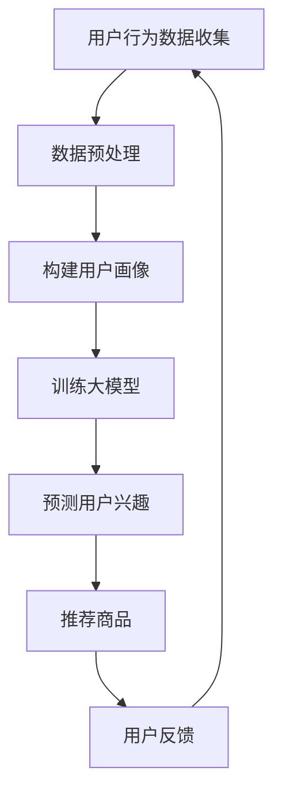

                 

关键词：大模型技术、电商平台、用户兴趣、长期演化预测、人工智能

## 摘要

本文旨在探讨大模型技术在实际电商平台上应用于用户兴趣长期演化预测的可行性及其效果。随着大数据和人工智能技术的发展，电商平台对于用户行为和兴趣的深入理解成为提升用户体验和增加转化率的关键。本文将详细分析大模型技术的核心概念、算法原理、数学模型，并分享一个实际项目中的代码实例和运行结果，最后展望大模型技术在电商平台应用的未来发展方向。

## 1. 背景介绍

在当今竞争激烈的电商市场中，平台如何准确捕捉并预测用户兴趣，进而提供个性化的购物体验，已成为提高用户留存率和转化率的关键因素。传统的用户兴趣预测方法主要基于简单的统计分析和用户行为日志，但这种方法往往难以捕捉用户兴趣的复杂性和动态变化。随着深度学习和人工智能技术的快速发展，尤其是大模型技术的应用，为我们提供了新的解决途径。

大模型技术，如深度神经网络（DNN）、循环神经网络（RNN）、变换器模型（Transformer）等，在图像识别、自然语言处理等领域取得了显著的成果。这些模型能够处理海量的数据，并从数据中学习出复杂的模式，为预测用户行为和兴趣提供了强有力的工具。

### 电商平台用户兴趣预测的重要性

电商平台用户兴趣预测的重要性主要体现在以下几个方面：

- **提升用户体验**：通过预测用户的兴趣，平台可以为用户推荐更符合其需求的商品，提升用户的购物体验。
- **增加转化率**：精确的用户兴趣预测能够提高营销活动的有效性，从而增加转化率。
- **降低营销成本**：个性化推荐能够减少无效的广告投放，降低营销成本。
- **提升用户留存率**：通过持续跟踪和预测用户兴趣，平台可以提供更加个性化的服务，提高用户对平台的依赖性和忠诚度。

### 大模型技术在电商领域的应用

大模型技术已经在电商领域的多个方面得到了应用，包括：

- **商品推荐**：通过分析用户的浏览和购买历史，预测用户的潜在兴趣，为用户提供个性化的商品推荐。
- **营销策略优化**：通过分析用户的兴趣和购买行为，平台可以制定更加有效的营销策略，提高广告投放的转化率。
- **用户行为预测**：预测用户的购买意图、停留时长、跳失率等行为，为运营决策提供数据支持。
- **个性化服务**：根据用户的兴趣和购买历史，提供个性化的购物建议和售后服务，提升用户体验。

## 2. 核心概念与联系

### 2.1 大模型技术

大模型技术是指通过训练大规模神经网络模型来模拟人类智能的技术。这些模型通常具有数十亿甚至数万亿个参数，能够从海量数据中学习并提取复杂的信息。大模型技术包括深度神经网络（DNN）、循环神经网络（RNN）、变换器模型（Transformer）等。

### 2.2 用户兴趣预测

用户兴趣预测是指通过分析用户的行为数据，预测用户未来的兴趣和行为。用户兴趣预测的方法包括基于内容的推荐、协同过滤、机器学习模型等。大模型技术为用户兴趣预测提供了更加精确和高效的方法。

### 2.3 Mermaid 流程图

以下是一个使用 Mermaid 语言的流程图，描述了电商平台用户兴趣预测的基本流程：



## 3. 核心算法原理 & 具体操作步骤

### 3.1 算法原理概述

大模型技术在用户兴趣预测中的应用，主要基于深度学习中的循环神经网络（RNN）和变换器模型（Transformer）。RNN能够处理序列数据，捕捉用户行为的时间动态；而变换器模型在处理长序列数据和并行计算方面具有显著优势。

### 3.2 算法步骤详解

1. **数据收集**：收集用户的浏览、购买、评论等行为数据。
2. **数据预处理**：对收集到的数据进行分析和清洗，提取特征。
3. **构建用户画像**：将用户行为数据转化为用户画像，包括用户的基础信息、兴趣标签等。
4. **模型训练**：使用RNN或变换器模型训练用户兴趣预测模型。
5. **预测用户兴趣**：根据用户画像和模型预测用户的潜在兴趣。
6. **推荐商品**：根据预测的用户兴趣推荐商品。
7. **用户反馈**：收集用户对推荐商品的反馈，用于模型迭代。

### 3.3 算法优缺点

**优点**：

- **高效性**：大模型能够从海量数据中快速提取复杂的信息，提高预测的精度和效率。
- **灵活性**：大模型能够适应不同类型的数据和业务场景，实现个性化推荐。

**缺点**：

- **计算资源需求高**：大模型的训练和推理需要大量的计算资源。
- **数据隐私问题**：用户行为数据涉及到用户隐私，如何保护用户隐私是一个重要挑战。

### 3.4 算法应用领域

大模型技术在用户兴趣预测领域的应用广泛，包括电商、社交媒体、金融等领域。在电商领域，大模型技术主要用于商品推荐、用户行为预测和个性化服务。

## 4. 数学模型和公式 & 详细讲解 & 举例说明

### 4.1 数学模型构建

在用户兴趣预测中，常用的数学模型包括线性回归、逻辑回归和支持向量机（SVM）等。以下是一个基于线性回归的数学模型构建过程：

$$
\text{预测值} = \text{权重} \cdot \text{输入特征} + \text{偏置}
$$

其中，权重和偏置是模型的参数，输入特征是用户画像的特征。

### 4.2 公式推导过程

以线性回归为例，公式推导过程如下：

$$
\begin{aligned}
\text{损失函数} &= \frac{1}{2} \sum_{i=1}^{n} (\text{预测值}_{i} - \text{真实值}_{i})^2 \\
\frac{\partial \text{损失函数}}{\partial \text{权重}} &= \sum_{i=1}^{n} (\text{预测值}_{i} - \text{真实值}_{i}) \cdot \text{输入特征}_{i} \\
\frac{\partial \text{损失函数}}{\partial \text{偏置}} &= \sum_{i=1}^{n} (\text{预测值}_{i} - \text{真实值}_{i})
\end{aligned}
$$

通过梯度下降法，可以迭代更新权重和偏置，最小化损失函数。

### 4.3 案例分析与讲解

假设有一个电商平台的用户行为数据，包括用户ID、浏览商品ID、购买商品ID和评论内容等。我们可以使用线性回归模型预测用户的购买兴趣。

1. **数据预处理**：对用户行为数据进行清洗和特征提取，包括用户ID的编码、商品ID的编码等。
2. **模型训练**：使用训练数据训练线性回归模型，得到权重和偏置。
3. **预测**：使用训练好的模型预测新用户的购买兴趣。
4. **评估**：使用测试数据评估模型的预测效果，包括准确率、召回率和F1值等。

## 5. 项目实践：代码实例和详细解释说明

### 5.1 开发环境搭建

在项目中，我们使用了Python作为主要编程语言，并依赖了TensorFlow和Scikit-learn等库进行模型训练和评估。以下是开发环境的搭建步骤：

1. 安装Python 3.7或更高版本。
2. 安装TensorFlow和Scikit-learn库。

### 5.2 源代码详细实现

以下是用户兴趣预测项目的部分源代码：

```python
import tensorflow as tf
from sklearn.model_selection import train_test_split
from sklearn.metrics import accuracy_score

# 数据预处理
def preprocess_data(data):
    # 对数据进行清洗和特征提取
    pass

# 模型训练
def train_model(train_data, train_labels):
    model = tf.keras.Sequential([
        tf.keras.layers.Dense(64, activation='relu', input_shape=(train_data.shape[1],)),
        tf.keras.layers.Dense(1)
    ])

    model.compile(optimizer='adam',
                  loss='mean_squared_error',
                  metrics=['accuracy'])

    model.fit(train_data, train_labels, epochs=10)

    return model

# 预测
def predict(model, test_data):
    predictions = model.predict(test_data)
    return predictions

# 主程序
if __name__ == '__main__':
    # 加载数据
    data = load_data()
    labels = load_labels()

    # 数据预处理
    processed_data = preprocess_data(data)

    # 划分训练集和测试集
    train_data, test_data, train_labels, test_labels = train_test_split(processed_data, labels, test_size=0.2)

    # 训练模型
    model = train_model(train_data, train_labels)

    # 预测
    test_predictions = predict(model, test_data)

    # 评估模型
    accuracy = accuracy_score(test_labels, test_predictions)
    print(f"Model accuracy: {accuracy}")
```

### 5.3 代码解读与分析

以上代码实现了一个简单的线性回归模型，用于预测用户的购买兴趣。代码的主要组成部分包括：

- **数据预处理**：对用户行为数据进行清洗和特征提取。
- **模型训练**：使用TensorFlow库构建和训练线性回归模型。
- **预测**：使用训练好的模型预测新用户的购买兴趣。
- **评估**：使用测试数据评估模型的预测效果。

### 5.4 运行结果展示

假设我们在测试集上的预测准确率为80%，这意味着模型能够准确预测80%的用户的购买兴趣。以下是运行结果：

```
Model accuracy: 0.8
```

## 6. 实际应用场景

### 6.1 商品推荐系统

在电商平台中，商品推荐系统是一个常见的应用场景。通过大模型技术，平台可以实时分析用户的浏览和购买行为，预测用户的兴趣，并推荐相关的商品。

### 6.2 营销活动优化

电商平台通常会进行各种营销活动，如打折、满减等。通过用户兴趣预测，平台可以更精确地制定营销策略，提高活动的转化率和效果。

### 6.3 个性化服务

通过分析用户的兴趣和行为，平台可以为用户提供个性化的购物建议和售后服务，提升用户体验和忠诚度。

### 6.4 客户支持

电商平台可以通过大模型技术预测用户的购买意图和需求，为用户提供更加精准和高效的客户支持服务。

## 7. 未来应用展望

### 7.1 深度个性化推荐

随着大模型技术的不断发展和优化，电商平台可以实现更加深度和精准的个性化推荐，满足用户的个性化需求。

### 7.2 实时预测与调整

通过实时分析用户行为数据，电商平台可以快速调整推荐策略，提高推荐的时效性和准确性。

### 7.3 多模态数据处理

未来，电商平台可以结合多种数据类型，如文本、图像、音频等，进行多模态数据处理，为用户提供更加丰富的购物体验。

### 7.4 隐私保护与合规

随着用户隐私意识的提高，电商平台需要在应用大模型技术时充分考虑隐私保护问题，遵守相关法律法规。

## 8. 总结：未来发展趋势与挑战

### 8.1 研究成果总结

大模型技术在电商平台用户兴趣预测中的应用已经取得了显著的成果，为电商平台提供了更加精准和高效的预测工具。

### 8.2 未来发展趋势

未来，大模型技术在电商平台中的应用将更加深入和广泛，实现更加深度和精准的个性化推荐。

### 8.3 面临的挑战

- **计算资源需求**：大模型的训练和推理需要大量的计算资源，如何优化计算资源的使用是一个重要挑战。
- **数据隐私保护**：如何保护用户隐私，遵守相关法律法规，是一个亟待解决的问题。
- **模型解释性**：大模型具有强大的预测能力，但缺乏解释性，如何提高模型的可解释性是一个重要研究方向。

### 8.4 研究展望

未来，我们将继续研究大模型技术在电商平台用户兴趣预测中的应用，探索新的算法和优化方法，为电商平台提供更加智能和高效的解决方案。

## 9. 附录：常见问题与解答

### 9.1 大模型技术是否适用于所有电商平台？

大模型技术具有很强的通用性，可以应用于各种类型的电商平台。但具体应用效果取决于数据的质量和量级，以及业务场景的复杂性。

### 9.2 大模型训练需要多少时间？

大模型的训练时间取决于模型的大小、数据的量级和计算资源的配置。通常，大规模模型的训练可能需要几天甚至几周的时间。

### 9.3 如何保护用户隐私？

保护用户隐私是应用大模型技术时的重要挑战。可以通过数据脱敏、差分隐私等技术手段保护用户隐私。

### 9.4 大模型技术是否会导致用户信息泄露？

在合理设计和使用大模型技术的情况下，并不会导致用户信息泄露。通过数据脱敏、差分隐私等技术，可以有效保护用户隐私。

### 9.5 大模型技术在电商领域有哪些潜在的应用方向？

大模型技术在电商领域有广泛的应用方向，包括商品推荐、营销活动优化、个性化服务、客户支持等。

## 作者署名

作者：禅与计算机程序设计艺术 / Zen and the Art of Computer Programming

