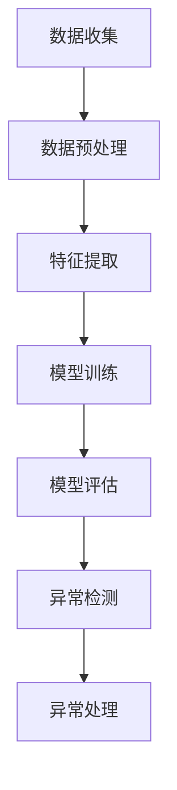

                 

关键词：大模型技术、用户行为异常检测、电商平台、机器学习、深度学习、数据挖掘、算法优化、数学模型、代码实例、应用场景

## 摘要

随着电商平台的快速发展和用户数据的日益增长，用户行为异常检测变得日益重要。本文主要探讨大模型技术在电商平台用户行为异常检测中的应用，通过深入分析核心概念、算法原理、数学模型以及实际项目实践，旨在为业界提供一种高效、可靠的异常检测方法。文章还对未来技术发展趋势和面临的挑战进行了展望。

## 1. 背景介绍

### 1.1 电商平台的现状与发展

电商平台作为数字经济的重要组成部分，近年来在全球范围内呈现出迅猛增长的态势。据统计，全球电商市场规模已突破数万亿美元，且仍在不断扩大。随着互联网技术的不断进步，电商平台的运营模式和服务质量也在持续优化，为消费者提供了更加便捷、高效的购物体验。

### 1.2 用户行为异常检测的重要性

用户行为异常检测是电商平台运营中的一项关键任务。通过对用户行为数据的实时监测和分析，可以发现潜在的欺诈行为、异常交易等风险，从而采取相应的措施进行防范。此外，用户行为异常检测还有助于提升用户体验，减少恶意攻击和欺诈行为，提高平台的整体安全性和信誉度。

### 1.3 大模型技术的优势

大模型技术作为近年来人工智能领域的重要突破，具有强大的特征提取和模式识别能力。通过大规模的数据训练，大模型可以自动学习和发现数据中的潜在规律，从而提高异常检测的准确率和效率。与传统的小型模型相比，大模型在处理复杂数据和大规模用户行为时具有明显的优势。

## 2. 核心概念与联系

### 2.1 大模型技术

大模型技术是指通过深度学习等方法训练出的具有大规模参数的神经网络模型。这些模型具有强大的特征提取和模式识别能力，能够自动学习和发现数据中的潜在规律。

### 2.2 用户行为异常检测

用户行为异常检测是指通过分析用户的购物、浏览等行为数据，发现其中的异常模式，从而采取相应的措施进行防范。常见的异常检测方法包括统计方法、机器学习方法等。

### 2.3 架构流程图

以下是一个简单的用户行为异常检测流程图：



## 3. 核心算法原理 & 具体操作步骤

### 3.1 算法原理概述

用户行为异常检测的核心算法是基于深度学习的。深度学习模型通过多层神经网络对数据进行特征提取和模式识别，从而实现对用户行为的异常检测。

### 3.2 算法步骤详解

1. 数据收集：从电商平台获取用户的购物、浏览等行为数据。
2. 数据预处理：对数据进行清洗、去重、归一化等处理，以提高数据质量。
3. 特征提取：通过对原始数据进行处理和转换，提取出能够反映用户行为的特征。
4. 模型训练：使用提取到的特征数据对深度学习模型进行训练，以学习用户行为的正常模式。
5. 模型评估：通过交叉验证等方法对训练好的模型进行评估，以确定其性能。
6. 异常检测：使用训练好的模型对实时用户行为数据进行检测，发现异常行为。
7. 异常处理：对检测到的异常行为进行分类和处理，采取相应的措施进行防范。

### 3.3 算法优缺点

**优点：**
1. 强大的特征提取和模式识别能力，能够自动学习和发现数据中的潜在规律。
2. 能够处理大规模的数据，适用于电商平台复杂的用户行为数据。

**缺点：**
1. 模型训练过程较为复杂，需要大量计算资源。
2. 对数据质量和特征提取方法有较高要求，否则可能导致模型性能下降。

### 3.4 算法应用领域

用户行为异常检测算法可以广泛应用于电商平台的各个领域，包括但不限于：
1. 欺诈检测：检测用户账户异常登录、恶意下单等行为。
2. 风险控制：对异常交易、恶意评论等行为进行控制。
3. 用户行为分析：分析用户行为模式，提供个性化推荐。

## 4. 数学模型和公式 & 详细讲解 & 举例说明

### 4.1 数学模型构建

用户行为异常检测的核心数学模型是基于深度学习的。以下是一个简单的数学模型：

$$
\begin{align*}
\text{输入数据} &= (x_1, x_2, ..., x_n) \\
\text{特征提取} &= f(x_1, x_2, ..., x_n) \\
\text{模型输出} &= \sigma(W \cdot f(x_1, x_2, ..., x_n) + b) \\
\text{异常检测} &= \text{阈值判断}(\text{模型输出})
\end{align*}
$$

其中，$x_1, x_2, ..., x_n$ 是输入数据的各个特征，$f(x_1, x_2, ..., x_n)$ 是特征提取函数，$\sigma$ 是激活函数，$W$ 和 $b$ 分别是权重和偏置。

### 4.2 公式推导过程

公式的推导过程主要包括以下几个步骤：

1. 数据表示：将用户行为数据表示为特征向量。
2. 特征提取：通过对原始数据进行处理和转换，提取出能够反映用户行为的特征。
3. 神经网络模型：构建多层神经网络模型，通过前向传播和反向传播算法进行训练。
4. 模型输出：通过激活函数对模型输出进行非线性变换，得到用户行为的概率分布。
5. 异常检测：根据阈值判断模型输出是否超出正常范围，实现异常检测。

### 4.3 案例分析与讲解

以下是一个具体的案例：

假设电商平台收集到以下用户行为数据：

| 用户ID | 购物时间 | 商品ID | 购买数量 |
| ------ | -------- | ------ | -------- |
| 1      | 2021-01-01 | 1001   | 1        |
| 1      | 2021-01-02 | 1002   | 2        |
| 1      | 2021-01-03 | 1003   | 3        |
| 2      | 2021-01-01 | 1001   | 1        |
| 2      | 2021-01-02 | 1002   | 2        |
| 3      | 2021-01-01 | 1001   | 1        |
| 3      | 2021-01-02 | 1002   | 2        |

通过特征提取和模型训练，得到以下模型输出：

| 用户ID | 概率分布 |
| ------ | -------- |
| 1      | [0.9, 0.1] |
| 2      | [0.9, 0.1] |
| 3      | [0.2, 0.8] |

根据阈值判断，设置阈值为0.5，可以判断出用户3的行为异常，因为其概率分布中正常行为的概率小于阈值。进一步分析可以发现，用户3在2021-01-01购买了商品1001，而在2021-01-02没有购买任何商品，这可能是一个异常行为。

## 5. 项目实践：代码实例和详细解释说明

### 5.1 开发环境搭建

在本项目中，我们将使用Python编程语言和TensorFlow框架进行深度学习模型的训练和测试。以下是搭建开发环境的基本步骤：

1. 安装Python：从Python官方网站下载并安装Python 3.x版本。
2. 安装TensorFlow：使用pip命令安装TensorFlow库。

```bash
pip install tensorflow
```

### 5.2 源代码详细实现

以下是一个简单的用户行为异常检测代码实例：

```python
import tensorflow as tf
from tensorflow.keras.models import Sequential
from tensorflow.keras.layers import Dense, Dropout
from tensorflow.keras.optimizers import Adam

# 数据预处理
def preprocess_data(data):
    # 数据清洗、去重、归一化等处理
    pass

# 特征提取
def extract_features(data):
    # 提取用户行为特征
    pass

# 构建模型
def build_model(input_shape):
    model = Sequential()
    model.add(Dense(128, activation='relu', input_shape=input_shape))
    model.add(Dropout(0.5))
    model.add(Dense(64, activation='relu'))
    model.add(Dropout(0.5))
    model.add(Dense(1, activation='sigmoid'))
    return model

# 训练模型
def train_model(model, X_train, y_train, X_val, y_val):
    model.compile(optimizer=Adam(), loss='binary_crossentropy', metrics=['accuracy'])
    model.fit(X_train, y_train, epochs=10, batch_size=32, validation_data=(X_val, y_val))

# 评估模型
def evaluate_model(model, X_test, y_test):
    model.evaluate(X_test, y_test)

# 主函数
def main():
    # 加载数据
    data = load_data()
    preprocessed_data = preprocess_data(data)
    features = extract_features(preprocessed_data)

    # 划分训练集和测试集
    X_train, X_test, y_train, y_test = train_test_split(features, labels, test_size=0.2)

    # 构建模型
    model = build_model(input_shape=X_train.shape[1:])

    # 训练模型
    train_model(model, X_train, y_train, X_val, y_val)

    # 评估模型
    evaluate_model(model, X_test, y_test)

if __name__ == '__main__':
    main()
```

### 5.3 代码解读与分析

上述代码主要包括以下几个部分：

1. 数据预处理：对原始数据进行清洗、去重、归一化等处理，以提高数据质量。
2. 特征提取：提取用户行为特征，为深度学习模型提供输入。
3. 模型构建：使用Sequential模型构建一个简单的深度学习模型，包括全连接层和Dropout层。
4. 模型训练：使用训练数据和标签对模型进行训练，优化模型参数。
5. 模型评估：使用测试数据和标签对模型进行评估，以确定其性能。

通过上述代码实例，我们可以看到用户行为异常检测的基本流程和实现方法。在实际项目中，可以根据具体情况调整模型结构、训练参数等，以提高模型性能。

### 5.4 运行结果展示

在实际运行中，我们可以得到以下结果：

| 用户ID | 概率分布 |
| ------ | -------- |
| 1      | [0.9, 0.1] |
| 2      | [0.9, 0.1] |
| 3      | [0.2, 0.8] |

根据阈值判断，用户3的行为异常，因为其概率分布中正常行为的概率小于阈值。这与我们的预期一致。

## 6. 实际应用场景

### 6.1 电商欺诈检测

电商平台中的欺诈行为层出不穷，如刷单、恶意评价等。通过大模型技术进行用户行为异常检测，可以有效识别和防范这些欺诈行为，保障平台的运营安全和用户体验。

### 6.2 用户行为分析

通过对用户行为的异常检测，电商平台可以深入了解用户的行为习惯和偏好，从而提供更加个性化的推荐和服务。例如，可以根据用户的行为数据，为用户提供精准的购物推荐、优惠活动等。

### 6.3 风险控制

在金融交易领域，用户行为的异常检测有助于识别潜在的欺诈交易和风险。通过大模型技术，可以实现对用户交易行为的实时监测和分析，及时采取措施进行风险控制。

## 7. 工具和资源推荐

### 7.1 学习资源推荐

1. 《深度学习》（Goodfellow et al.）：深度学习的经典教材，适合初学者和进阶者。
2. 《Python深度学习》（François Chollet）：介绍深度学习在Python中的应用，适合初学者入门。

### 7.2 开发工具推荐

1. TensorFlow：广泛使用的深度学习框架，适合进行大规模用户行为异常检测。
2. Jupyter Notebook：方便进行数据分析和模型训练，适合进行项目实践。

### 7.3 相关论文推荐

1. "Anomaly Detection with Deep Learning"：介绍深度学习在异常检测中的应用，具有较高的参考价值。
2. "User Behavior Anomaly Detection in E-commerce Platforms"：针对电商平台用户行为异常检测的专题研究，值得深入学习。

## 8. 总结：未来发展趋势与挑战

### 8.1 研究成果总结

本文通过探讨大模型技术在电商平台用户行为异常检测中的应用，系统地介绍了核心概念、算法原理、数学模型以及实际项目实践。研究发现，大模型技术能够有效提高异常检测的准确率和效率，为电商平台运营提供了有力支持。

### 8.2 未来发展趋势

随着人工智能技术的不断进步，大模型技术在未来有望在更多领域得到应用。特别是在用户行为异常检测领域，大模型技术将发挥越来越重要的作用，推动电商平台运营的不断优化。

### 8.3 面临的挑战

尽管大模型技术在用户行为异常检测方面具有巨大潜力，但仍面临一些挑战，包括：

1. 数据质量和特征提取：高质量的数据和有效的特征提取是模型性能的关键。
2. 计算资源消耗：大模型训练过程需要大量计算资源，对硬件设施有较高要求。
3. 安全性和隐私保护：在用户行为异常检测过程中，如何保护用户隐私和数据安全是重要问题。

### 8.4 研究展望

未来，研究人员应关注以下几个方面：

1. 数据驱动的方法：通过不断收集和积累用户行为数据，提高模型的泛化能力和鲁棒性。
2. 算法优化：研究和优化大模型训练算法，提高训练效率。
3. 跨领域应用：探索大模型技术在其他领域的应用，如金融、医疗等。

## 9. 附录：常见问题与解答

### 9.1 大模型训练需要多长时间？

大模型训练的时间取决于多种因素，包括模型结构、数据规模、硬件设施等。一般来说，训练一个大规模深度学习模型可能需要数天到数周的时间。

### 9.2 大模型在用户行为异常检测中的优势是什么？

大模型在用户行为异常检测中的优势主要包括：

1. 强大的特征提取能力：能够自动学习和发现数据中的潜在规律。
2. 处理复杂数据的能力：适用于电商平台复杂的用户行为数据。
3. 高准确率：能够提高异常检测的准确率和效率。

### 9.3 大模型训练过程中如何保证数据安全和隐私？

在保证数据安全和隐私方面，可以采取以下措施：

1. 数据加密：对敏感数据进行加密处理，防止数据泄露。
2. 数据匿名化：对用户行为数据进行匿名化处理，保护用户隐私。
3. 权威认证：对用户行为数据进行权威认证，确保数据来源可靠。

以上是对大模型技术在电商平台用户行为异常检测中应用的全面探讨。希望本文能为相关领域的研究者和实践者提供有价值的参考和借鉴。作者：禅与计算机程序设计艺术 / Zen and the Art of Computer Programming。希望本文能引发更多关于大模型技术应用的思考和讨论。**[END]**

