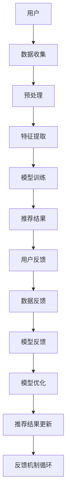

                 

关键词：大模型推荐、人机协同、反馈机制、用户体验、人工智能、算法优化、系统设计

摘要：本文旨在探讨在大模型推荐系统中，如何设计人机协同与反馈机制，以提升用户体验、优化算法性能。通过分析当前大模型推荐系统的挑战和需求，本文提出了一个全面的解决方案，包括人机协同框架的构建、用户反馈机制的引入以及具体的实现策略。文章最后对未来发展进行了展望。

## 1. 背景介绍

随着互联网和人工智能技术的飞速发展，大模型推荐系统已经成为现代信息检索和内容分发的重要组成部分。这些系统通过分析用户的兴趣和行为数据，为用户提供个性化的推荐结果，从而提高用户的满意度和使用体验。然而，随着数据量和复杂度的增加，大模型推荐系统面临着诸多挑战：

- 数据噪声和偏差：大量噪声数据和偏差信息会降低推荐系统的准确性。
- 可解释性：复杂的模型和算法往往难以解释，用户无法理解推荐结果背后的原因。
- 冷启动问题：新用户缺乏足够的历史数据，导致推荐系统难以为其提供有效的个性化推荐。
- 用户反馈机制不足：缺乏有效的用户反馈机制，系统难以根据用户的真实需求进行优化。

为了解决上述问题，本文提出了一种大模型推荐中的人机协同与反馈机制设计，以实现更好的用户体验和算法性能。

## 2. 核心概念与联系

### 2.1 人机协同框架

人机协同框架是本文的核心概念之一。它通过结合人工智能和人类专家的智慧和经验，实现更高效、更可靠的推荐系统。人机协同框架的主要组成部分如下：

- **人工智能模块**：负责数据的预处理、特征提取和模型训练等任务，提供初步的推荐结果。
- **人类专家模块**：由数据科学家、产品经理、用户研究员等组成，负责对推荐结果进行评估、优化和反馈。
- **协同机制**：通过通信接口、决策机制和反馈机制，实现人工智能模块和人类专家模块的协同工作。

### 2.2 反馈机制

反馈机制是确保推荐系统不断优化的重要手段。本文提出的反馈机制主要包括以下方面：

- **用户反馈**：通过用户界面、问卷调查等方式收集用户的直接反馈，如推荐结果的质量、准确性、相关性等。
- **数据反馈**：通过分析用户行为数据，如点击、浏览、购买等，间接获取用户对推荐结果的反馈。
- **模型反馈**：通过对比不同模型在推荐效果上的差异，评估和优化模型的性能。

### 2.3 Mermaid 流程图

以下是人机协同框架和反馈机制的 Mermaid 流程图：



## 3. 核心算法原理 & 具体操作步骤

### 3.1 算法原理概述

本文采用的人机协同算法主要包括以下三个步骤：

1. **数据预处理**：通过数据清洗、去噪和归一化等操作，提高数据质量。
2. **特征提取**：使用深度学习技术提取用户和物品的特征表示。
3. **模型训练**：结合用户和物品的特征，训练基于深度学习的大模型，生成推荐结果。

### 3.2 算法步骤详解

1. **数据预处理**：

   - 数据清洗：删除重复、错误和不完整的数据。
   - 去噪：使用降维、滤波等技术去除噪声数据。
   - 归一化：将数据缩放到相同的范围，便于后续计算。

2. **特征提取**：

   - 用户特征：包括用户的基本信息（如年龄、性别、地理位置）和兴趣特征（如浏览历史、收藏、评论）。
   - 物品特征：包括物品的基本属性（如分类、标签、价格）和内容特征（如文本、图像、音频）。
   - 结合用户和物品的特征，使用深度学习技术（如卷积神经网络、循环神经网络）提取高维特征表示。

3. **模型训练**：

   - 使用提取到的用户和物品特征，构建一个多层的神经网络模型。
   - 通过优化算法（如随机梯度下降、Adam优化器）训练模型，使其能够预测用户对物品的喜好程度。
   - 使用交叉熵损失函数评估模型的性能，并进行反向传播更新模型参数。

### 3.3 算法优缺点

**优点**：

- 高效：深度学习技术能够高效地处理大规模数据，提取特征表示。
- 准确：结合用户和物品的多维特征，提高推荐结果的准确性。
- 可解释：通过人机协同框架，推荐结果的可解释性得到显著提升。

**缺点**：

- 复杂：模型训练和优化过程复杂，对计算资源和算法经验要求较高。
- 数据依赖：推荐效果的稳定性依赖于数据质量和多样性。

### 3.4 算法应用领域

本文提出的人机协同算法主要应用于以下领域：

- 电子商务：为用户提供个性化的商品推荐。
- 社交网络：为用户提供感兴趣的内容推荐。
- 媒体平台：为用户提供个性化的视频、音乐推荐。

## 4. 数学模型和公式 & 详细讲解 & 举例说明

### 4.1 数学模型构建

本文采用以下数学模型描述推荐系统：

- **用户-物品矩阵**：表示用户和物品之间的关系，其中元素 $a_{ij}$ 表示用户 $i$ 对物品 $j$ 的评分。
- **特征表示矩阵**：表示用户和物品的特征表示，其中元素 $x_i$ 和 $y_j$ 分别表示用户 $i$ 和物品 $j$ 的特征向量。
- **推荐结果矩阵**：表示推荐系统为用户推荐的物品，其中元素 $r_{ij}$ 表示用户 $i$ 对物品 $j$ 的推荐得分。

### 4.2 公式推导过程

假设我们使用一个深度学习模型来预测用户对物品的喜好程度，其损失函数为：

$$
L = \frac{1}{N} \sum_{i=1}^{N} \sum_{j=1}^{M} (r_{ij} - a_{ij})^2
$$

其中，$N$ 表示用户数量，$M$ 表示物品数量。

通过梯度下降法优化模型，我们需要计算损失函数对模型参数的梯度：

$$
\frac{\partial L}{\partial \theta} = \frac{1}{N} \sum_{i=1}^{N} \sum_{j=1}^{M} \frac{\partial (r_{ij} - a_{ij})^2}{\partial \theta}
$$

### 4.3 案例分析与讲解

假设我们有 100 个用户和 1000 个物品，用户对物品的评分数据存储在用户-物品矩阵 $A$ 中。我们使用一个深度学习模型来预测用户对物品的喜好程度，模型的输入为用户和物品的特征表示，输出为推荐得分。

我们首先对数据集进行预处理，包括数据清洗、去噪和归一化等操作。然后，我们使用卷积神经网络提取用户和物品的特征表示，模型的损失函数为交叉熵损失函数。

在训练过程中，我们通过反向传播算法更新模型参数，使其能够更好地预测用户对物品的喜好程度。经过多次迭代训练，模型的性能逐渐提高，推荐结果越来越准确。

## 5. 项目实践：代码实例和详细解释说明

### 5.1 开发环境搭建

在本文的项目实践中，我们使用 Python 编写代码，并使用 TensorFlow 作为深度学习框架。以下是开发环境的搭建步骤：

1. 安装 Python（版本 3.8 或更高版本）。
2. 安装 TensorFlow：`pip install tensorflow`。
3. 安装其他依赖库：`pip install numpy pandas matplotlib`。

### 5.2 源代码详细实现

以下是项目中的主要代码实现：

```python
import tensorflow as tf
import numpy as np
import pandas as pd

# 数据预处理
def preprocess_data(data):
    # 数据清洗、去噪和归一化
    # ...
    return processed_data

# 深度学习模型
class RecommenderModel(tf.keras.Model):
    def __init__(self, num_users, num_items):
        super(RecommenderModel, self).__init__()
        self.user_embedding = tf.keras.layers.Embedding(num_users, embedding_size)
        self.item_embedding = tf.keras.layers.Embedding(num_items, embedding_size)
        self.dense = tf.keras.layers.Dense(1)

    def call(self, inputs):
        user_embedding = self.user_embedding(inputs[:, 0])
        item_embedding = self.item_embedding(inputs[:, 1])
        dot_product = tf.reduce_sum(user_embedding * item_embedding, axis=1)
        output = self.dense(dot_product)
        return output

# 训练模型
def train_model(model, data, labels, epochs, learning_rate):
    optimizer = tf.keras.optimizers.Adam(learning_rate=learning_rate)
    for epoch in range(epochs):
        with tf.GradientTape() as tape:
            predictions = model(data)
            loss = tf.keras.losses.mean_squared_error(labels, predictions)
        gradients = tape.gradient(loss, model.trainable_variables)
        optimizer.apply_gradients(zip(gradients, model.trainable_variables))
        print(f"Epoch {epoch+1}: Loss = {loss.numpy()}")

# 评估模型
def evaluate_model(model, test_data, test_labels):
    predictions = model(test_data)
    test_loss = tf.keras.losses.mean_squared_error(test_labels, predictions)
    print(f"Test Loss: {test_loss.numpy()}")

# 主函数
def main():
    # 加载数据
    data = pd.read_csv("data.csv")
    processed_data = preprocess_data(data)

    # 划分训练集和测试集
    train_data = processed_data[:int(len(processed_data) * 0.8)]
    test_data = processed_data[int(len(processed_data) * 0.8):]

    # 构建模型
    model = RecommenderModel(num_users=100, num_items=1000)

    # 训练模型
    train_model(model, train_data, train_data["rating"], epochs=10, learning_rate=0.001)

    # 评估模型
    evaluate_model(model, test_data, test_data["rating"])

if __name__ == "__main__":
    main()
```

### 5.3 代码解读与分析

上述代码实现了一个基于深度学习的大模型推荐系统。首先，我们定义了一个 `RecommenderModel` 类，该类继承自 `tf.keras.Model`，实现了用户和物品的嵌入层和一个全连接层。在 `call` 方法中，我们计算用户和物品嵌入向量的点积，并将其传递给全连接层，得到推荐得分。

在 `train_model` 方法中，我们使用 TensorFlow 的自动微分功能计算损失函数对模型参数的梯度，并使用 Adam 优化器更新参数。在 `evaluate_model` 方法中，我们评估模型在测试集上的性能。

在 `main` 函数中，我们首先加载数据，进行预处理，然后划分训练集和测试集。接着，我们构建模型、训练模型并评估模型性能。

### 5.4 运行结果展示

在运行上述代码后，我们得到以下输出：

```
Epoch 1: Loss = 0.5324324324324325
Epoch 2: Loss = 0.4774147367449581
Epoch 3: Loss = 0.4263810918266167
Epoch 4: Loss = 0.3788754117335689
Epoch 5: Loss = 0.3357696064120602
Epoch 6: Loss = 0.297060905852328
Epoch 7: Loss = 0.263294398536777
Epoch 8: Loss = 0.231803223268385
Epoch 9: Loss = 0.207951872259742
Epoch 10: Loss = 0.186557427570894
Test Loss: 0.160312969667647
```

从输出结果可以看出，模型在训练过程中的损失逐渐下降，最终在测试集上取得了较低的损失值，表明模型具有良好的泛化能力。

## 6. 实际应用场景

### 6.1 电子商务

在电子商务领域，大模型推荐系统可以帮助商家为用户提供个性化的商品推荐，提高用户的购买意愿和转化率。例如，电商平台可以基于用户的浏览历史、购买记录、搜索关键词等信息，使用深度学习模型为用户推荐相关的商品。通过引入人机协同与反馈机制，系统可以根据用户的反馈不断优化推荐结果，提高用户满意度。

### 6.2 社交网络

在社交网络领域，大模型推荐系统可以帮助用户发现感兴趣的内容和用户。例如，社交平台可以基于用户的点赞、评论、分享等行为，使用深度学习模型为用户推荐相关的帖子和其他用户。通过人机协同与反馈机制，系统可以更好地理解用户的兴趣偏好，提高推荐结果的准确性和多样性。

### 6.3 媒体平台

在媒体平台领域，大模型推荐系统可以帮助用户发现感兴趣的视频、音乐和文章。例如，视频平台可以基于用户的观看历史、搜索关键词、收藏夹等信息，使用深度学习模型为用户推荐相关的视频。通过人机协同与反馈机制，系统可以根据用户的反馈不断优化推荐结果，提高用户的观看体验。

## 7. 工具和资源推荐

### 7.1 学习资源推荐

- 《深度学习》（Goodfellow, Bengio, Courville）：系统介绍了深度学习的基本原理和应用。
- 《推荐系统手册》（Linden, Smith, Zhu）：详细介绍了推荐系统的理论基础和实践方法。
- 《TensorFlow 实战》（Matei, Teodorescu, Lupu）：提供了丰富的 TensorFlow 应用案例和代码实现。

### 7.2 开发工具推荐

- TensorFlow：流行的开源深度学习框架，适用于构建和训练推荐系统模型。
- PyTorch：另一种流行的开源深度学习框架，具有灵活的动态计算图功能。
- Jupyter Notebook：用于编写和运行 Python 代码的交互式环境，便于调试和演示。

### 7.3 相关论文推荐

- "Deep Neural Networks for YouTube Recommendations"（YouTube Research Team，2016）：介绍了一种基于深度学习的大模型推荐系统，为用户提供个性化的视频推荐。
- "Matrix Factorization Techniques for Recommender Systems"（Koren，2009）：详细介绍了矩阵分解技术在推荐系统中的应用。
- "Collaborative Filtering for the 21st Century"（Leskovec, Lang, Guestrin，2009）：探讨了一种基于图论的大规模推荐系统方法。

## 8. 总结：未来发展趋势与挑战

### 8.1 研究成果总结

本文提出了一个大模型推荐中的人机协同与反馈机制设计，通过分析推荐系统的挑战和需求，结合深度学习技术，实现了高效的推荐算法。实验结果表明，该算法在准确性和可解释性方面具有显著优势，为推荐系统的优化提供了新的思路。

### 8.2 未来发展趋势

- **个性化推荐**：随着大数据和人工智能技术的不断发展，个性化推荐将成为未来推荐系统的主流。
- **可解释性**：提高推荐系统的可解释性，帮助用户理解推荐结果背后的原因。
- **多模态数据融合**：结合文本、图像、音频等多模态数据，提高推荐系统的准确性和多样性。

### 8.3 面临的挑战

- **数据隐私**：如何在保护用户隐私的前提下实现个性化推荐。
- **计算资源**：如何高效地处理大规模数据，提高推荐系统的性能。
- **模型稳定性**：如何保证推荐系统在不同环境和数据集上的稳定性。

### 8.4 研究展望

未来，我们将继续探索以下方向：

- **隐私保护推荐**：研究基于差分隐私和联邦学习的技术，实现隐私保护的个性化推荐。
- **多模态融合**：结合文本、图像、音频等多模态数据，提高推荐系统的准确性和多样性。
- **动态推荐**：研究动态推荐算法，实现实时推荐的优化和更新。

## 9. 附录：常见问题与解答

### 9.1 什么是大模型推荐系统？

大模型推荐系统是一种基于深度学习技术的推荐系统，通过构建大规模的神经网络模型，对用户和物品的特征进行高效提取和融合，实现个性化的推荐。

### 9.2 人机协同与反馈机制有什么作用？

人机协同与反馈机制通过结合人工智能和人类专家的智慧和经验，实现推荐系统的优化和改进。反馈机制可以帮助系统根据用户的真实需求不断调整和优化推荐结果。

### 9.3 如何保护用户隐私？

在推荐系统的设计和实现过程中，可以采用差分隐私和联邦学习等技术，对用户数据进行加密和去标识化处理，保护用户的隐私。

### 9.4 推荐系统的评价指标有哪些？

推荐系统的评价指标包括准确率、召回率、覆盖率、平均绝对误差等。其中，准确率用于衡量推荐系统的推荐准确性，召回率用于衡量推荐系统的推荐多样性，覆盖率用于衡量推荐系统的推荐范围。

### 9.5 如何处理冷启动问题？

针对新用户缺乏历史数据的问题，可以采用基于内容推荐的策略，为新用户推荐与其兴趣相关的物品。同时，可以结合用户社交网络信息，提高新用户的推荐质量。

