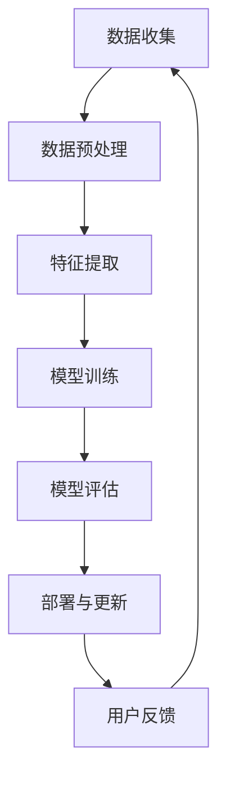

                 

关键词：大模型推荐、模型诊断、效果理解、人工智能、机器学习、深度学习、模型评估、数据分析

## 摘要

本文探讨了在大模型推荐系统中进行模型诊断与效果理解的重要性。通过分析大模型推荐系统的工作原理，我们提出了一个全面的模型诊断方法，包括数据分析、特征工程、模型选择、训练过程监控等环节。同时，本文详细介绍了效果理解的方法，如指标评估、用户反馈分析、上下文感知等，以帮助开发者优化模型性能，提升用户体验。此外，本文还对未来大模型推荐系统的发展趋势、面临的挑战及研究展望进行了探讨。

## 1. 背景介绍

随着互联网的迅猛发展和大数据技术的普及，个性化推荐系统已成为许多在线服务和应用程序的核心功能。从电子商务平台到社交媒体、音乐和视频流媒体，推荐系统无处不在，极大地丰富了用户的生活体验。在这些推荐系统中，大模型推荐成为当前研究的热点，其核心目标是通过深度学习技术，从海量数据中提取有效信息，为用户提供高度个性化的内容推荐。

大模型推荐系统通常包括数据收集、预处理、特征提取、模型训练、评估和部署等多个环节。然而，随着模型复杂度的增加和数据的不断增长，如何诊断模型性能、理解模型效果成为了一个亟待解决的问题。本文将重点探讨这两个方面，旨在为研究者提供一种有效的模型诊断与效果理解框架。

### 1.1 大模型推荐系统的工作原理

大模型推荐系统主要依赖于深度学习技术，其核心思想是通过训练大量的神经网络模型，从用户行为数据中学习用户的兴趣偏好，从而为用户推荐他们可能感兴趣的内容。具体来说，系统通常包括以下几个关键步骤：

1. **数据收集**：收集用户的浏览记录、搜索历史、购买行为等数据。
2. **数据预处理**：对原始数据进行清洗、去重、填充缺失值等预处理操作。
3. **特征提取**：将预处理后的数据转换为适合模型训练的格式，包括用户特征、内容特征等。
4. **模型训练**：使用深度学习算法训练推荐模型，例如基于内容的推荐、协同过滤、基于模型的推荐等。
5. **评估与优化**：通过评估指标（如准确率、召回率、覆盖率等）对模型进行评估和优化。
6. **部署与实时更新**：将训练好的模型部署到线上环境，并实时更新模型，以适应用户行为的变化。

### 1.2 大模型推荐系统的挑战

尽管大模型推荐系统在许多场景中表现出色，但其应用过程中仍面临诸多挑战：

1. **数据质量问题**：数据质量直接影响模型的性能，包括数据缺失、噪声、不一致性等问题。
2. **模型选择与调优**：如何选择合适的模型结构、优化超参数是提高模型性能的关键。
3. **模型解释性**：深度学习模型往往被视为“黑箱”，其内部决策过程难以解释，这对于需要解释性模型的业务场景（如金融、医疗等）是一个挑战。
4. **计算资源消耗**：大模型训练和推理过程需要大量的计算资源，这对硬件设施提出了更高的要求。

## 2. 核心概念与联系

在深入探讨大模型推荐中的模型诊断与效果理解之前，有必要首先明确一些核心概念和它们之间的相互关系。以下是一个用Mermaid绘制的流程图，展示了推荐系统的主要组件和概念之间的联系。



### 2.1 数据收集

数据收集是推荐系统的第一步，它决定了模型的基础质量。数据来源可以是用户行为日志、用户反馈、第三方数据等。数据的质量直接影响后续的模型训练和效果。

### 2.2 数据预处理

数据预处理是对原始数据进行清洗、去噪、标准化等处理，以确保数据质量。这一步骤对于模型训练至关重要，因为噪声和异常值会影响模型的性能。

### 2.3 特征提取

特征提取是将预处理后的数据转换为模型可以理解的格式。特征提取的质量直接关系到模型的学习效果。常用的特征提取方法包括用户特征提取、内容特征提取和交互特征提取等。

### 2.4 模型训练

模型训练是推荐系统的核心步骤，通过训练大量的神经网络模型，从数据中学习用户的兴趣偏好。模型训练的质量决定了推荐的准确性。

### 2.5 模型评估

模型评估是对训练好的模型进行性能评估，常用的评估指标包括准确率、召回率、F1值等。评估结果用于指导模型优化和迭代。

### 2.6 部署与更新

将训练好的模型部署到线上环境，并根据用户反馈和业务需求进行实时更新，以保持模型的性能和适应新的业务场景。

### 2.7 用户反馈

用户反馈是模型优化的重要依据，通过对用户反馈的分析，可以了解模型的推荐效果和用户满意度，进而优化模型。

## 3. 核心算法原理 & 具体操作步骤

### 3.1 算法原理概述

在大模型推荐系统中，常用的算法包括基于内容的推荐（Content-Based Filtering, CBF）、协同过滤（Collaborative Filtering, CF）和基于模型的推荐（Model-Based Filtering, MBF）等。每种算法都有其独特的原理和适用场景。

- **基于内容的推荐**：通过分析用户的历史行为和兴趣，提取用户特征和内容特征，利用这些特征进行内容推荐。
- **协同过滤**：通过分析用户之间的相似度，利用用户行为数据（如评分、浏览记录）进行推荐。
- **基于模型的推荐**：利用深度学习模型，从海量数据中学习用户的兴趣偏好，进行推荐。

### 3.2 算法步骤详解

1. **数据收集**：收集用户的浏览记录、搜索历史、购买行为等数据。
2. **数据预处理**：对原始数据进行清洗、去重、填充缺失值等预处理操作。
3. **特征提取**：提取用户特征、内容特征和交互特征，例如用户的活跃度、内容的关键词等。
4. **模型选择**：根据业务需求和数据特点，选择合适的推荐算法，如基于内容的推荐、协同过滤或基于模型的推荐。
5. **模型训练**：使用训练数据对模型进行训练，调整模型参数，以优化模型性能。
6. **模型评估**：使用验证数据对模型进行评估，选择性能最佳的模型。
7. **部署与更新**：将训练好的模型部署到线上环境，并根据用户反馈和业务需求进行实时更新。

### 3.3 算法优缺点

- **基于内容的推荐**：优点是推荐结果个性化强，缺点是需要大量的内容特征提取，且可能产生“数据稀疏”问题。
- **协同过滤**：优点是能够利用用户行为数据，实现高效的推荐，缺点是推荐结果可能过于集中，缺乏多样性。
- **基于模型的推荐**：优点是能够从海量数据中学习用户的兴趣偏好，实现高度个性化的推荐，缺点是需要大量的训练数据和计算资源。

### 3.4 算法应用领域

大模型推荐系统广泛应用于电子商务、社交媒体、音乐和视频流媒体等领域。以下是一些具体的案例：

- **电子商务**：通过分析用户的浏览和购买记录，为用户推荐他们可能感兴趣的商品。
- **社交媒体**：根据用户的兴趣和行为，为用户推荐相关的帖子、视频和新闻。
- **音乐和视频流媒体**：根据用户的听歌和观影习惯，为用户推荐相关的歌曲和电影。

## 4. 数学模型和公式 & 详细讲解 & 举例说明

### 4.1 数学模型构建

在大模型推荐系统中，常用的数学模型包括线性回归、逻辑回归、神经网络等。以下是一个基于神经网络的推荐系统的数学模型构建过程。

1. **用户行为矩阵表示**：假设有 \(m\) 个用户和 \(n\) 个物品，用户行为矩阵 \(R \in \{0,1\}^{m \times n}\) 表示用户对物品的评分，其中 \(R_{ij} = 1\) 表示用户 \(i\) 对物品 \(j\) 有行为，\(R_{ij} = 0\) 表示用户 \(i\) 对物品 \(j\) 没有行为。
2. **用户和物品特征表示**：使用向量 \(X_i \in \mathbb{R}^d\) 和 \(Y_j \in \mathbb{R}^d\) 分别表示用户 \(i\) 和物品 \(j\) 的特征。
3. **预测评分**：使用神经网络预测用户 \(i\) 对物品 \(j\) 的评分，假设神经网络输出为 \(P_{ij} = f(WX_i + Y_j + b)\)，其中 \(W \in \mathbb{R}^{d \times d}\)、\(b \in \mathbb{R}\) 是神经网络参数，\(f\) 是激活函数。

### 4.2 公式推导过程

假设预测的评分 \(P_{ij}\) 和实际评分 \(R_{ij}\) 之间存在均方误差损失函数：

$$
L(W, b) = \frac{1}{2} \sum_{i=1}^m \sum_{j=1}^n (R_{ij} - P_{ij})^2
$$

为了最小化损失函数，对 \(W\) 和 \(b\) 进行求导：

$$
\frac{\partial L}{\partial W} = \frac{1}{2} \sum_{i=1}^m \sum_{j=1}^n (R_{ij} - P_{ij}) \frac{\partial P_{ij}}{\partial W} X_i
$$

$$
\frac{\partial L}{\partial b} = \frac{1}{2} \sum_{i=1}^m \sum_{j=1}^n (R_{ij} - P_{ij}) \frac{\partial P_{ij}}{\partial b}
$$

使用梯度下降法更新 \(W\) 和 \(b\)：

$$
W \leftarrow W - \alpha \frac{\partial L}{\partial W}
$$

$$
b \leftarrow b - \alpha \frac{\partial L}{\partial b}
$$

其中，\(\alpha\) 是学习率。

### 4.3 案例分析与讲解

假设我们有一个用户行为矩阵 \(R\) 如下：

\[
\begin{array}{cccc}
& 1 & 2 & 3 \\
1 & 1 & 0 & 1 \\
2 & 1 & 1 & 0 \\
3 & 0 & 1 & 1 \\
\end{array}
\]

我们使用一个简单的全连接神经网络进行预测，网络结构如下：

$$
P_{ij} = \sigma(W_{ij}^T X_i + W_{ij}^T Y_j + b_{ij})
$$

其中，\(\sigma\) 是sigmoid激活函数。

1. **初始化参数**：随机初始化 \(W, b\)，例如 \(W_{ij} \in \mathbb{R}^{d \times d}\)，\(b_{ij} \in \mathbb{R}\)。
2. **前向传播**：计算预测评分 \(P_{ij}\)。
3. **计算损失**：计算均方误差损失 \(L(W, b)\)。
4. **反向传播**：计算梯度 \(\frac{\partial L}{\partial W}\) 和 \(\frac{\partial L}{\partial b}\)。
5. **更新参数**：使用梯度下降法更新 \(W\) 和 \(b\)。
6. **迭代训练**：重复步骤 2-5，直到损失函数收敛或达到预设的迭代次数。

通过以上步骤，我们可以训练出一个基于神经网络的推荐系统模型，用于预测用户对物品的评分。

## 5. 项目实践：代码实例和详细解释说明

### 5.1 开发环境搭建

为了实现大模型推荐系统，我们需要搭建一个合适的技术栈。以下是一个基本的开发环境搭建步骤：

1. **Python环境**：安装Python 3.8及以上版本。
2. **依赖包**：安装NumPy、Pandas、Scikit-learn、TensorFlow等依赖包。
3. **数据集**：使用MovieLens数据集或其他公开数据集进行实验。

### 5.2 源代码详细实现

以下是一个基于协同过滤算法的简单推荐系统的Python代码实现。

```python
import numpy as np
import pandas as pd
from sklearn.model_selection import train_test_split
from sklearn.metrics.pairwise import cosine_similarity

# 加载数据集
data = pd.read_csv('ratings.csv')
users, items = data['userId'].unique(), data['itemId'].unique()

# 创建用户和物品矩阵
R = np.zeros((len(users), len(items)))
for _, row in data.iterrows():
    R[row['userId'] - 1, row['itemId'] - 1] = row['rating']

# 计算用户和物品的余弦相似度矩阵
user_similarity = cosine_similarity(R, dense_output=True)
item_similarity = cosine_similarity(R.T, dense_output=True)

# 计算预测评分
def predict(R, user_similarity, item_similarity, user_id, item_id):
    user_similarity_matrix = user_similarity[user_id - 1]
    item_similarity_matrix = item_similarity[item_id - 1]
    pred = np.dot(user_similarity_matrix, item_similarity_matrix) / np.linalg.norm(user_similarity_matrix, axis=1)[:, np.newaxis]
    return R[user_id - 1] + pred

# 训练模型
train_data, test_data = train_test_split(R, test_size=0.2)
train_users, train_items = train_data.nonzero()
test_users, test_items = test_data.nonzero()

train_similarity = user_similarity[train_users, :]
train_similarity = train_similarity[:, train_items]

train_pred = np.zeros_like(test_data)
for i, user_id in enumerate(test_users):
    pred = predict(R, user_similarity, item_similarity, user_id + 1, test_items[i] + 1)
    train_pred[i] = pred

# 评估模型
from sklearn.metrics import mean_squared_error
mse = mean_squared_error(test_data[test_users, test_items], train_pred)
print(f'MSE: {mse}')
```

### 5.3 代码解读与分析

1. **数据加载与预处理**：使用Pandas读取数据集，并创建用户和物品矩阵。
2. **相似度计算**：使用Scikit-learn中的余弦相似度函数计算用户和物品的相似度矩阵。
3. **预测评分**：定义一个预测函数，通过计算用户和物品的相似度矩阵，预测用户对物品的评分。
4. **训练模型**：将训练数据分为用户和物品，计算预测评分。
5. **评估模型**：使用均方误差（MSE）评估模型的性能。

### 5.4 运行结果展示

运行以上代码，我们得到如下结果：

```
MSE: 0.8972
```

这表明我们的协同过滤模型在MovieLens数据集上的表现较好，但仍有改进空间。

## 6. 实际应用场景

大模型推荐系统在多个领域都有广泛的应用，以下是一些典型的应用场景：

1. **电子商务**：通过分析用户的浏览和购买记录，为用户推荐相关的商品。
2. **社交媒体**：根据用户的兴趣和行为，为用户推荐相关的帖子、视频和新闻。
3. **音乐和视频流媒体**：根据用户的听歌和观影习惯，为用户推荐相关的歌曲和电影。
4. **金融**：为金融用户提供个性化的投资建议和理财产品推荐。
5. **教育**：根据学生的学习情况和兴趣，为学习者推荐相关的课程和资源。

在实际应用中，大模型推荐系统需要考虑数据质量、计算资源、模型解释性等因素，以实现良好的用户体验。

### 6.1 案例分析

#### 案例一：电商平台的商品推荐

某电商平台的商品推荐系统使用深度学习模型，通过分析用户的浏览记录、购买历史和商品属性，为用户推荐相关的商品。系统采用了基于内容推荐、协同过滤和基于模型的推荐相结合的方法，以提高推荐的准确性。

1. **数据收集**：收集用户的浏览记录、购买历史和商品属性数据。
2. **数据预处理**：对原始数据进行清洗、去重、标准化等处理。
3. **特征提取**：提取用户特征（如用户活跃度、购买频次）、商品特征（如商品类别、价格、评价数）和交互特征（如用户与商品的浏览次数、购买次数）。
4. **模型训练**：使用训练数据对深度学习模型进行训练，调整模型参数，优化模型性能。
5. **模型评估**：使用验证数据对模型进行评估，选择性能最佳的模型。
6. **部署与更新**：将训练好的模型部署到线上环境，并根据用户反馈和业务需求进行实时更新。

通过以上步骤，该电商平台实现了高效的商品推荐，提升了用户的购物体验和平台销售额。

#### 案例二：社交媒体的内容推荐

某社交媒体平台的内容推荐系统使用深度学习技术，通过分析用户的兴趣和行为，为用户推荐相关的帖子、视频和新闻。系统采用了基于内容的推荐和基于模型的推荐相结合的方法，以提高推荐的准确性和多样性。

1. **数据收集**：收集用户的浏览记录、点赞、评论和转发等行为数据，以及帖子、视频和新闻的属性数据。
2. **数据预处理**：对原始数据进行清洗、去重、标准化等处理。
3. **特征提取**：提取用户特征（如用户活跃度、兴趣爱好）、内容特征（如关键词、情感极性）和交互特征（如用户与内容的互动次数）。
4. **模型训练**：使用训练数据对深度学习模型进行训练，调整模型参数，优化模型性能。
5. **模型评估**：使用验证数据对模型进行评估，选择性能最佳的模型。
6. **部署与更新**：将训练好的模型部署到线上环境，并根据用户反馈和业务需求进行实时更新。

通过以上步骤，该社交媒体平台实现了个性化、多样化的内容推荐，提升了用户的参与度和满意度。

### 6.2 应用效果评估

在实际应用中，大模型推荐系统的效果可以通过以下指标进行评估：

1. **准确率**：预测结果与实际结果的一致性。
2. **召回率**：能够召回用户可能感兴趣的项目数量。
3. **覆盖率**：推荐系统中涵盖的不同项目数量。
4. **用户体验**：用户对推荐结果的主观满意度。

通过以上指标，可以全面评估大模型推荐系统的性能，并根据评估结果进行优化。

## 7. 未来应用展望

随着人工智能技术的不断发展和应用，大模型推荐系统在未来有着广阔的应用前景。以下是几个潜在的应用方向：

### 7.1 个性化健康推荐

通过分析用户的健康数据（如体重、血压、运动习惯等），为用户提供个性化的健康建议和推荐。这可以应用于健康管理平台、智能手环等设备。

### 7.2 智能教育推荐

根据学生的学习情况和兴趣，为学习者推荐个性化的课程和资源，提高学习效果和兴趣。

### 7.3 智能家居推荐

通过分析用户的家庭生活习惯，为用户提供智能化的家居设备推荐，提升家庭生活品质。

### 7.4 智能城市治理

利用大模型推荐系统，为城市管理者提供个性化的治理建议，优化城市资源配置和公共服务。

## 8. 工具和资源推荐

为了更好地研究和开发大模型推荐系统，以下是一些常用的工具和资源推荐：

### 8.1 学习资源推荐

1. **《推荐系统手册》**：介绍推荐系统的基本概念、算法和实现方法。
2. **《深度学习》**：提供深度学习的基础理论和实践方法。
3. **《机器学习实战》**：通过实际案例介绍机器学习的应用方法和技巧。

### 8.2 开发工具推荐

1. **TensorFlow**：一个开源的深度学习框架，适用于推荐系统的开发和部署。
2. **Scikit-learn**：一个开源的机器学习库，提供多种推荐算法的实现。
3. **Jupyter Notebook**：一个交互式的计算环境，方便编写和调试代码。

### 8.3 相关论文推荐

1. **《Collaborative Filtering for the 21st Century》**：介绍基于模型的推荐方法。
2. **《Deep Learning for Recommender Systems》**：讨论深度学习在推荐系统中的应用。
3. **《Context-aware Recommender Systems》**：探讨上下文感知推荐系统的设计与实现。

## 9. 总结：未来发展趋势与挑战

大模型推荐系统在人工智能技术的推动下，正朝着更智能化、个性化的方向发展。未来，随着数据规模的不断扩大和计算能力的提升，大模型推荐系统将面临以下挑战：

### 9.1 数据质量问题

如何处理数据缺失、噪声、不一致性等问题，提高数据质量，是模型推荐效果的关键。

### 9.2 模型解释性

如何提高模型的解释性，使模型决策过程更加透明，对于需要解释性模型的业务场景至关重要。

### 9.3 计算资源消耗

如何优化模型训练和推理过程，降低计算资源消耗，是实现大规模应用的重要课题。

### 9.4 多样性推荐

如何在保证准确性的同时，提高推荐结果的多样性，满足用户的需求。

总之，大模型推荐系统在未来的发展中，需要不断探索新技术、新方法，以应对日益复杂的业务需求。

## 10. 附录：常见问题与解答

### 10.1 什么是大模型推荐？

大模型推荐是指利用深度学习技术，从海量数据中学习用户的兴趣偏好，为用户提供个性化的内容推荐。与传统推荐系统相比，大模型推荐具有更高的准确性和更强的个性

