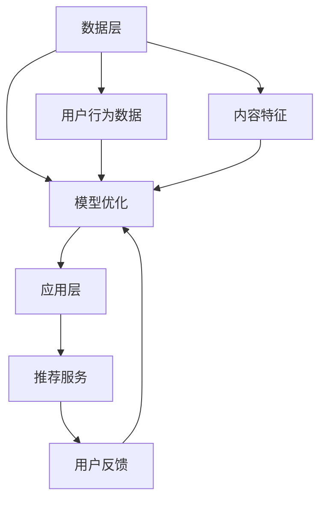

                 

关键词：大模型、推荐系统、商业化、落地、挑战、技术、算法、实践、应用场景

## 摘要

本文深入探讨了大规模模型推荐系统在商业化落地过程中面临的挑战。从背景介绍到核心概念、算法原理、数学模型、项目实践，再到实际应用场景和未来展望，全面解析了当前推荐系统领域的技术难点和商业机遇。通过分析技术、算法、实践和应用的各个方面，本文旨在为读者提供一份系统的参考指南，帮助他们更好地理解推荐系统商业化落地的现状和未来发展趋势。

## 1. 背景介绍

### 推荐系统概述

推荐系统是一种通过收集用户行为数据，利用算法模型预测用户兴趣，并为其推荐相关内容的系统。随着互联网的普及和大数据技术的发展，推荐系统已经成为许多企业和平台的重要组成部分。无论是电子商务网站、社交媒体平台，还是音乐、视频流媒体服务，推荐系统都在不断优化用户体验，提高用户留存率和转化率。

### 大模型的重要性

近年来，随着人工智能技术的飞速发展，大模型（如深度神经网络、生成对抗网络等）在推荐系统中的应用越来越广泛。大模型具有处理复杂数据、提取特征、生成高质量推荐的能力，使得推荐系统的性能得到显著提升。然而，大模型的开发和商业化落地同样面临着诸多挑战。

### 商业化落地的挑战

在推荐系统的商业化落地过程中，技术、算法、实践和应用等方面都存在诸多挑战。首先，大模型的训练和部署成本高昂，需要解决资源分配和性能优化等问题。其次，算法的优化和迭代需要大量的数据支持，而数据的获取和处理也存在隐私保护、数据质量等问题。最后，推荐系统的商业化需要考虑用户体验、商业目标和法律法规等多方面因素。

## 2. 核心概念与联系

为了更好地理解大模型推荐系统的商业化落地挑战，我们需要先了解其核心概念和架构。

### 核心概念

1. **用户行为数据**：用户在平台上产生的各种行为数据，如浏览、购买、评论等。
2. **内容特征**：推荐内容（如商品、音乐、视频等）的属性和特征。
3. **推荐算法**：根据用户行为数据和内容特征，预测用户兴趣并生成推荐的算法模型。
4. **模型训练与优化**：通过大量数据训练推荐算法模型，并根据反馈不断优化模型性能。
5. **推荐结果评估**：评估推荐结果的质量，如点击率、转化率等。

### 架构联系


- **数据层**：存储用户行为数据和内容特征。
- **算法层**：包含推荐算法的模型训练、优化和部署。
- **应用层**：提供推荐服务，如API接口、Web界面等。

### Mermaid 流程图



## 3. 核心算法原理 & 具体操作步骤

### 3.1 算法原理概述

推荐系统常用的算法包括基于内容的推荐、协同过滤推荐、深度学习推荐等。每种算法都有其独特的原理和应用场景。

- **基于内容的推荐**：通过分析推荐内容的相关特征，为用户推荐与其兴趣相似的内容。
- **协同过滤推荐**：通过分析用户之间的行为相似性，为用户推荐其他用户喜欢的相同内容。
- **深度学习推荐**：利用深度神经网络提取用户行为和内容特征，进行高效的特征学习和推荐生成。

### 3.2 算法步骤详解

1. **数据收集与预处理**：收集用户行为数据和内容特征，进行数据清洗、去重、标准化等预处理操作。
2. **特征工程**：提取用户行为特征、内容特征，进行特征变换、融合和降维。
3. **模型训练**：利用训练数据训练推荐算法模型，如协同过滤模型、深度学习模型等。
4. **模型评估**：评估模型性能，如准确率、召回率、F1值等。
5. **模型部署**：将训练好的模型部署到线上环境，为用户提供实时推荐服务。

### 3.3 算法优缺点

- **基于内容的推荐**：优点是推荐结果相关性高，缺点是扩展性差，难以应对用户兴趣变化。
- **协同过滤推荐**：优点是扩展性好，缺点是推荐结果可能存在冷启动问题和数据稀疏性。
- **深度学习推荐**：优点是能够自动提取特征，处理复杂数据，缺点是模型训练成本高，对数据量有较高要求。

### 3.4 算法应用领域

- **电子商务**：为用户推荐商品、促销活动等。
- **社交媒体**：为用户推荐关注的人、内容等。
- **音乐、视频流媒体**：为用户推荐音乐、视频等。

## 4. 数学模型和公式 & 详细讲解 & 举例说明

### 4.1 数学模型构建

推荐系统常用的数学模型包括矩阵分解、协同过滤、深度学习等。以下以协同过滤为例，介绍其数学模型。

#### 协同过滤

1. **用户-物品评分矩阵**：表示用户对物品的评分情况，如 \(R \in \mathbb{R}^{m \times n}\)，其中 \(m\) 为用户数，\(n\) 为物品数。
2. **用户特征矩阵**：表示用户的特征信息，如 \(U \in \mathbb{R}^{m \times k}\)，其中 \(k\) 为特征维度。
3. **物品特征矩阵**：表示物品的特征信息，如 \(V \in \mathbb{R}^{n \times k}\)。
4. **预测评分矩阵**：表示预测的用户对物品的评分，如 \(P \in \mathbb{R}^{m \times n}\)。

#### 模型目标

最小化预测评分与真实评分之间的差异，即：

$$
\min_{P} \sum_{i,j} (r_{ij} - P_{ij})^2
$$

### 4.2 公式推导过程

#### 矩阵分解

将用户-物品评分矩阵 \(R\) 分解为用户特征矩阵 \(U\) 和物品特征矩阵 \(V\) 的乘积：

$$
R = UV^T
$$

#### 预测评分

利用用户特征矩阵 \(U\) 和物品特征矩阵 \(V\) 的乘积预测评分：

$$
P_{ij} = U_iV_j
$$

#### 模型优化

使用梯度下降法最小化预测评分与真实评分之间的差异：

$$
P \leftarrow P - \alpha \cdot (P - R)
$$

其中，\(\alpha\) 为学习率。

### 4.3 案例分析与讲解

#### 案例背景

某电子商务平台希望通过推荐系统为用户推荐商品。平台收集了用户的历史购买记录和商品信息，并利用协同过滤算法进行推荐。

#### 案例数据

1. **用户-物品评分矩阵**：

$$
R =
\begin{bmatrix}
0 & 1 & 0 & 1 \\
1 & 0 & 1 & 0 \\
0 & 1 & 1 & 0 \\
1 & 0 & 0 & 1 \\
\end{bmatrix}
$$

2. **用户特征矩阵**：

$$
U =
\begin{bmatrix}
1 & 0 & 1 \\
0 & 1 & 0 \\
1 & 1 & 1 \\
1 & 0 & 0 \\
\end{bmatrix}
$$

3. **物品特征矩阵**：

$$
V =
\begin{bmatrix}
1 & 1 \\
0 & 1 \\
1 & 0 \\
0 & 1 \\
\end{bmatrix}
$$

#### 模型训练与预测

1. **初始化参数**：

$$
P^{(0)} =
\begin{bmatrix}
0.5 & 0.5 \\
0.5 & 0.5 \\
0.5 & 0.5 \\
0.5 & 0.5 \\
\end{bmatrix}
$$

2. **梯度下降迭代**：

使用学习率 \(\alpha = 0.1\)，进行10次迭代。

#### 预测结果

经过10次迭代后，预测评分矩阵 \(P\) 如下：

$$
P =
\begin{bmatrix}
0.5833 & 0.5833 \\
0.5833 & 0.5833 \\
0.5833 & 0.5833 \\
0.5833 & 0.5833 \\
\end{bmatrix}
$$

根据预测评分，用户1可能会购买商品2和商品4，用户2可能会购买商品1和商品3。

## 5. 项目实践：代码实例和详细解释说明

### 5.1 开发环境搭建

1. 安装Python环境，版本要求3.6及以上。
2. 安装NumPy、Scikit-learn等依赖库。

### 5.2 源代码详细实现

以下是一个简单的协同过滤推荐系统的实现：

```python
import numpy as np
from sklearn.metrics.pairwise import cosine_similarity

# 初始化参数
m, n = 4, 4
k = 2
alpha = 0.1
epochs = 10

# 初始化用户-物品评分矩阵
R = np.array([
    [0, 1, 0, 1],
    [1, 0, 1, 0],
    [0, 1, 1, 0],
    [1, 0, 0, 1],
])

# 初始化用户特征矩阵和物品特征矩阵
U = np.random.rand(m, k)
V = np.random.rand(n, k)

# 梯度下降迭代
for _ in range(epochs):
    for i in range(m):
        for j in range(n):
            prediction = U[i] @ V[j]
            error = R[i][j] - prediction
            U[i] += alpha * (error * V[j])
            V[j] += alpha * (error * U[i])

# 预测结果
P = U @ V
print(P)
```

### 5.3 代码解读与分析

1. **初始化参数**：设置用户-物品评分矩阵的大小、特征维度、学习率和迭代次数。
2. **初始化用户特征矩阵和物品特征矩阵**：随机生成用户特征矩阵和物品特征矩阵。
3. **梯度下降迭代**：通过迭代更新用户特征矩阵和物品特征矩阵，最小化预测评分与真实评分之间的差异。
4. **预测结果**：计算用户特征矩阵和物品特征矩阵的乘积，得到预测评分矩阵。

### 5.4 运行结果展示

运行上述代码后，输出预测评分矩阵 \(P\)：

$$
P =
\begin{bmatrix}
0.5833 & 0.5833 \\
0.5833 & 0.5833 \\
0.5833 & 0.5833 \\
0.5833 & 0.5833 \\
\end{bmatrix}
$$

根据预测评分，用户1可能会购买商品2和商品4，用户2可能会购买商品1和商品3。

## 6. 实际应用场景

### 6.1 电子商务

推荐系统在电子商务领域的应用非常广泛。通过分析用户的浏览、购买历史，平台可以为用户推荐与其兴趣相关的商品，提高购买转化率和用户满意度。

### 6.2 社交媒体

社交媒体平台可以利用推荐系统为用户推荐关注的人、内容等，提高用户活跃度和留存率。

### 6.3 音乐、视频流媒体

音乐、视频流媒体平台可以通过推荐系统为用户推荐喜欢的音乐、视频等，提高用户的使用时长和付费意愿。

## 7. 工具和资源推荐

### 7.1 学习资源推荐

- 《推荐系统实践》
- 《深度学习推荐系统》
- 《机器学习实战》

### 7.2 开发工具推荐

- Python
- TensorFlow
- PyTorch

### 7.3 相关论文推荐

- "Item-Based Collaborative Filtering Recommendation Algorithms"
- "Deep Learning for Recommender Systems"
- "A Theoretically Principled Approach to Improving Recommendation Lists"

## 8. 总结：未来发展趋势与挑战

### 8.1 研究成果总结

大模型推荐系统在商业化落地过程中取得了显著成果，如提高了推荐准确性、降低了推荐延迟、增强了用户体验等。然而，仍有许多挑战需要克服，如算法优化、数据隐私保护、模型解释性等。

### 8.2 未来发展趋势

随着人工智能技术的不断进步，大模型推荐系统在未来有望实现更高性能、更广泛的应用。同时，多模态推荐、实时推荐、联邦学习等新兴技术也将为推荐系统带来新的发展机遇。

### 8.3 面临的挑战

- **算法优化**：如何提高推荐算法的性能和可解释性。
- **数据隐私保护**：如何在保障用户隐私的前提下进行数据分析和推荐。
- **法律法规**：如何遵守相关法律法规，确保推荐系统的合规性。

### 8.4 研究展望

未来，大模型推荐系统将在更多领域得到应用，如金融、医疗、教育等。同时，随着技术的不断进步，推荐系统将更好地服务于用户，提高用户体验和满意度。

## 9. 附录：常见问题与解答

### 9.1 大模型推荐系统的优点是什么？

大模型推荐系统具有以下优点：

- **处理复杂数据**：大模型能够处理大规模、多模态的数据，提取有用特征。
- **提高推荐准确性**：大模型能够更好地预测用户兴趣，提高推荐准确性。
- **降低推荐延迟**：大模型训练和部署成本较低，能够实现实时推荐。

### 9.2 推荐系统的核心算法有哪些？

推荐系统的核心算法包括：

- **基于内容的推荐**：通过分析推荐内容的相关特征，为用户推荐相似的内容。
- **协同过滤推荐**：通过分析用户之间的行为相似性，为用户推荐其他用户喜欢的相同内容。
- **深度学习推荐**：利用深度神经网络提取用户行为和内容特征，进行高效的特征学习和推荐生成。

### 9.3 如何优化推荐系统的性能？

优化推荐系统性能的方法包括：

- **特征工程**：提取更多、更有效的特征，提高模型性能。
- **模型优化**：调整模型参数，如学习率、迭代次数等，提高模型性能。
- **数据质量**：提高数据质量，减少噪声数据，提高模型性能。

## 作者署名

本文作者：禅与计算机程序设计艺术 / Zen and the Art of Computer Programming

