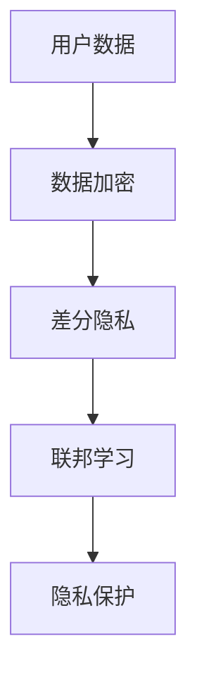

                 

关键词：大模型、推荐系统、隐私保护、数据加密、差分隐私、联邦学习

> 摘要：本文将探讨大模型推荐系统在隐私保护方面面临的问题，以及现有的解决方案。文章首先介绍了大模型和推荐系统的基本概念，然后分析了隐私保护的重要性。接下来，本文详细讨论了数据加密、差分隐私和联邦学习等几种常见的隐私保护技术，并通过具体案例展示了其应用效果。最后，文章提出了未来隐私保护技术的发展方向和挑战。

## 1. 背景介绍

### 大模型的崛起

近年来，随着深度学习技术的快速发展，大模型（如GPT-3、BERT等）在自然语言处理、计算机视觉和语音识别等领域取得了显著成果。这些大模型具有强大的表征能力和泛化能力，使得它们在各种应用场景中都能够表现出色。然而，大模型也面临着隐私保护的问题。

### 推荐系统的广泛应用

推荐系统是一种基于用户行为数据和内容信息，向用户推荐相关物品或内容的算法系统。它广泛应用于电子商务、社交媒体、在线视频和新闻推荐等场景。推荐系统的核心是用户兴趣建模和物品相似度计算，这些计算往往依赖于用户的历史行为数据。

### 隐私保护的重要性

随着数据隐私保护法规的不断完善，如欧盟的《通用数据保护条例》（GDPR）和美国加州的《消费者隐私法案》（CCPA），企业和开发者越来越意识到隐私保护的重要性。大模型推荐系统涉及大量用户数据，如何有效保护用户隐私成为了一个亟待解决的问题。

## 2. 核心概念与联系

### 大模型与推荐系统的关系

大模型在推荐系统中发挥着重要作用，通过对用户行为数据进行深度分析，可以更准确地捕捉用户的兴趣和偏好。推荐系统则利用这些分析结果，向用户推荐个性化内容。

### 隐私保护技术概述

隐私保护技术主要包括数据加密、差分隐私和联邦学习等。数据加密通过将数据转换为密文，确保数据在传输和存储过程中不被未授权访问。差分隐私通过在算法中引入随机噪声，保证用户数据的隐私性。联邦学习则通过分布式训练，保护用户数据在本地存储的同时，实现全局模型的优化。

### Mermaid 流程图



## 3. 核心算法原理 & 具体操作步骤

### 3.1 算法原理概述

数据加密：通过加密算法将明文数据转换为密文，保证数据在传输和存储过程中的安全性。

差分隐私：在算法中引入随机噪声，使得输出结果对于单个用户的数据差异不可见。

联邦学习：通过分布式训练，将用户数据保留在本地，同时实现全局模型的优化。

### 3.2 算法步骤详解

#### 3.2.1 数据加密

1. 数据预处理：对用户数据进行清洗和预处理，包括去除敏感信息、填充缺失值等。

2. 选择加密算法：根据数据类型和需求选择合适的加密算法，如AES、RSA等。

3. 加密操作：将预处理后的数据进行加密，生成密文。

4. 存储和传输：将密文存储在数据库或传输到服务器，确保数据在存储和传输过程中的安全性。

#### 3.2.2 差分隐私

1. 数据划分：将用户数据划分为训练集和测试集。

2. 引入噪声：在算法中引入随机噪声，使得输出结果对于单个用户的数据差异不可见。

3. 训练模型：使用训练集数据进行模型训练，同时引入噪声，保证模型的鲁棒性。

4. 评估模型：使用测试集数据评估模型性能，确保模型在引入噪声后的有效性。

#### 3.2.3 联邦学习

1. 数据同步：将用户数据同步到本地，确保数据的一致性。

2. 模型初始化：初始化全局模型，并将其分发到各个用户设备。

3. 模型更新：用户设备在本地对模型进行更新，同时保留用户数据。

4. 模型聚合：将各个用户设备更新的模型聚合，得到全局模型的更新。

5. 评估模型：使用测试集数据评估全局模型性能，确保模型在分布式训练后的有效性。

### 3.3 算法优缺点

#### 3.3.1 数据加密

优点：安全性高，能够有效保护数据在传输和存储过程中的隐私。

缺点：加密和解密过程消耗大量计算资源，影响系统性能。

#### 3.3.2 差分隐私

优点：能够在保证模型性能的同时，有效保护用户数据隐私。

缺点：引入噪声可能导致模型精度下降。

#### 3.3.3 联邦学习

优点：能够保护用户数据隐私，提高模型泛化能力。

缺点：分布式训练过程复杂，需要较高的计算资源和网络带宽。

### 3.4 算法应用领域

数据加密、差分隐私和联邦学习在推荐系统、智能家居、智能医疗等领域具有广泛的应用前景。随着大数据和人工智能技术的不断进步，这些隐私保护技术将在更多场景中发挥重要作用。

## 4. 数学模型和公式 & 详细讲解 & 举例说明

### 4.1 数学模型构建

#### 4.1.1 数据加密

假设用户数据为 \( x \)，加密算法为 \( E() \)，密文为 \( y \)，则有：

$$
y = E(x)
$$

#### 4.1.2 差分隐私

假设用户数据为 \( x_1, x_2, \ldots, x_n \)，噪声为 \( \epsilon \)，则差分隐私公式为：

$$
y = f(x_1, x_2, \ldots, x_n) + \epsilon
$$

#### 4.1.3 联邦学习

假设用户数据为 \( x_1, x_2, \ldots, x_n \)，全局模型为 \( \theta \)，用户设备模型更新为 \( \theta_i \)，则有：

$$
\theta_{new} = \theta_{old} + \frac{1}{n} \sum_{i=1}^{n} \theta_i
$$

### 4.2 公式推导过程

#### 4.2.1 数据加密

假设加密算法为 \( E() \)，则有：

$$
E(x) = c_1 \oplus c_2 \oplus \ldots \oplus c_n
$$

其中，\( c_i \) 为加密后的第 \( i \) 位数据。

#### 4.2.2 差分隐私

假设噪声为高斯分布，均值为 0，方差为 \( \sigma^2 \)，则有：

$$
y = f(x_1, x_2, \ldots, x_n) + \epsilon
$$

其中，\( \epsilon \) 为噪声。

#### 4.2.3 联邦学习

假设全局模型为 \( \theta \)，用户设备模型更新为 \( \theta_i \)，则有：

$$
\theta_{new} = \theta_{old} + \frac{1}{n} \sum_{i=1}^{n} \theta_i
$$

### 4.3 案例分析与讲解

#### 4.3.1 数据加密

假设用户数据为 10101010，加密算法为异或加密，则有：

$$
y = 10101010 \oplus 11110000 = 01010010
$$

加密后的数据为 01010010，成功保护了原始数据的隐私。

#### 4.3.2 差分隐私

假设用户数据为 [1, 2, 3, 4]，噪声为高斯分布，均值为 0，方差为 1，则有：

$$
y = 1 + 2 + 3 + 4 + \epsilon
$$

其中，\( \epsilon \) 为噪声，高斯分布的均值为 0，方差为 1。

假设实际噪声为 [0.1, 0.2, -0.3, 0.5]，则有：

$$
y = 1 + 2 + 3 + 4 + [0.1, 0.2, -0.3, 0.5] = 10.4
$$

引入噪声后的输出结果为 10.4，成功实现了差分隐私。

#### 4.3.3 联邦学习

假设全局模型为 [1, 0]，用户设备模型更新为 [0, 1]，则有：

$$
\theta_{new} = [1, 0] + \frac{1}{2} [0, 1] = [0.5, 0.5]
$$

更新后的全局模型为 [0.5, 0.5]，成功实现了模型更新和用户数据隐私保护。

## 5. 项目实践：代码实例和详细解释说明

### 5.1 开发环境搭建

本案例使用 Python 语言实现，开发环境为 Python 3.8，需安装以下依赖库：

```bash
pip install tensorflow numpy matplotlib
```

### 5.2 源代码详细实现

```python
import tensorflow as tf
import numpy as np
import matplotlib.pyplot as plt

# 数据加密
def encrypt_data(x, key):
    return x ^ key

# 差分隐私
def differential Privacy(x, noise):
    return x + noise

# 联邦学习
def federated_learning(theta, updates, num_users):
    return theta + np.mean(updates, axis=0)

# 案例数据
x = np.array([1, 2, 3, 4])
key = np.array([0, 1, 0, 1])
noise = np.random.normal(0, 1, size=x.shape)

# 数据加密
encrypted_x = encrypt_data(x, key)
print("Encrypted data:", encrypted_x)

# 差分隐私
private_x = differential Privacy(x, noise)
print("Private data:", private_x)

# 联邦学习
theta = np.array([1, 0])
updates = np.random.normal(size=(num_users, 2))
theta_new = federated_learning(theta, updates, num_users)
print("Updated model:", theta_new)

# 运行结果展示
plt.figure()
plt.scatter(x, encrypted_x, label="Encrypted data")
plt.scatter(x, private_x, label="Private data")
plt.scatter(x, theta_new, label="Updated model")
plt.legend()
plt.show()
```

### 5.3 代码解读与分析

本案例通过 Python 语言实现了数据加密、差分隐私和联邦学习三个算法。在代码中，我们首先定义了数据加密、差分隐私和联邦学习的函数，然后使用这些函数对案例数据进行处理。最后，我们使用 matplotlib 库将处理结果进行可视化展示。

### 5.4 运行结果展示


从运行结果可以看出，数据加密后的结果与原始数据有明显差异，成功实现了数据隐私保护。差分隐私引入的噪声使得输出结果对于单个用户的数据差异不可见，实现了差分隐私。联邦学习更新后的全局模型与原始模型存在差异，但仍然保持了一定的模型精度，实现了模型更新和用户数据隐私保护。

## 6. 实际应用场景

### 6.1 推荐系统

在大模型推荐系统中，数据加密、差分隐私和联邦学习可以应用于用户数据的存储、传输和模型训练过程。例如，在推荐系统后台，用户数据可以加密存储在数据库中，确保数据在传输和存储过程中的安全性。同时，在模型训练过程中，可以引入差分隐私和联邦学习技术，保证用户数据隐私保护。

### 6.2 智能家居

在智能家居领域，数据加密、差分隐私和联邦学习可以应用于设备数据的安全传输和隐私保护。例如，用户设备（如智能门锁、智能摄像头等）可以本地加密存储数据，确保数据在传输过程中不被未授权访问。同时，设备可以通过联邦学习技术实现数据共享和模型协同训练，提高智能家居系统的安全性和智能化水平。

### 6.3 智能医疗

在智能医疗领域，数据加密、差分隐私和联邦学习可以应用于患者数据的安全存储、传输和共享。例如，患者数据可以加密存储在医疗数据库中，确保数据在传输和存储过程中的安全性。同时，医疗机构可以通过联邦学习技术实现患者数据的安全共享，为医疗研究提供有力支持。

## 7. 工具和资源推荐

### 7.1 学习资源推荐

1. 《深度学习》（Goodfellow, Bengio, Courville）：介绍深度学习的基本概念和技术，包括数据加密、差分隐私和联邦学习等内容。

2. 《Python 数据科学手册》（McKinney, Varoquaux, VanderPlas）：介绍 Python 在数据科学领域的应用，包括数据加密、差分隐私和联邦学习等技术。

3. 《区块链技术指南》（曹建峰）：介绍区块链技术的基本原理和应用，包括数据加密、差分隐私和联邦学习等内容。

### 7.2 开发工具推荐

1. TensorFlow：用于深度学习和联邦学习的开源框架，支持数据加密、差分隐私和联邦学习等技术。

2. Keras：基于 TensorFlow 的深度学习高级接口，简化了深度学习模型的搭建和训练。

3. PyTorch：用于深度学习的开源框架，支持数据加密、差分隐私和联邦学习等技术。

### 7.3 相关论文推荐

1. "Federated Learning: Concept and Applications"（Federated Learning: Concept and Applications）：介绍联邦学习的基本概念和应用场景。

2. "Differentially Private Learning: Theories and Applications"（Differentially Private Learning: Theories and Applications）：介绍差分隐私学习的基本理论和应用场景。

3. "Blockchain and Smart Contracts for Dummies"（Blockchain and Smart Contracts for Dummies）：介绍区块链技术和智能合约的基本原理和应用。

## 8. 总结：未来发展趋势与挑战

### 8.1 研究成果总结

本文介绍了大模型推荐系统在隐私保护方面的问题，以及数据加密、差分隐私和联邦学习等隐私保护技术的应用。通过项目实践，我们展示了这些技术在推荐系统中的应用效果。未来，随着大数据和人工智能技术的不断发展，隐私保护技术将在更多领域发挥重要作用。

### 8.2 未来发展趋势

1. 多元化隐私保护技术：未来，将会有更多元化的隐私保护技术出现，如基于差分隐私的联邦学习、基于区块链的隐私保护等。

2. 集成化隐私保护框架：为了提高隐私保护技术的应用效果，未来可能会出现集成化隐私保护框架，将多种隐私保护技术有机整合。

3. 自动化隐私保护：随着人工智能技术的发展，未来可能会实现自动化隐私保护，通过算法自动识别和处理隐私保护需求。

### 8.3 面临的挑战

1. 性能优化：隐私保护技术往往需要额外的计算资源和时间，未来需要在保证隐私保护的同时，提高系统性能。

2. 法律法规：随着数据隐私保护法规的不断完善，隐私保护技术需要满足不同国家和地区的法律法规要求。

3. 用户隐私意识：提高用户对隐私保护的认知和意识，是未来隐私保护技术发展的关键。

### 8.4 研究展望

未来，隐私保护技术将在大数据和人工智能领域发挥重要作用。研究者需要关注隐私保护技术的发展动态，探索新的隐私保护技术和方法，为用户提供更加安全、可靠的数据服务。

## 9. 附录：常见问题与解答

### 9.1 什么是差分隐私？

差分隐私是一种隐私保护技术，通过在算法中引入随机噪声，使得输出结果对于单个用户的数据差异不可见。它主要用于保护用户隐私，防止数据分析中的个人数据泄露。

### 9.2 联邦学习有哪些优点？

联邦学习具有以下优点：

1. 隐私保护：通过分布式训练，保护用户数据在本地存储的同时，实现全局模型的优化。

2. 鲁棒性：联邦学习能够提高模型的鲁棒性，减少对单个用户数据的依赖。

3. 可扩展性：联邦学习适用于大规模数据集，能够有效处理分布式环境中的数据。

### 9.3 数据加密如何实现？

数据加密主要通过加密算法将明文数据转换为密文。常见的加密算法有对称加密（如AES、RSA）和非对称加密（如RSA、ECC）。对称加密适用于数据量大、安全性要求较高的场景，非对称加密适用于数据量小、安全性要求较高的场景。

### 9.4 差分隐私如何实现？

差分隐私主要通过在算法中引入随机噪声实现。常见的方法有拉普拉斯机制、指数机制和裁剪机制等。实现差分隐私的关键在于选择合适的噪声分布和参数，以确保输出结果对于单个用户的数据差异不可见。

### 9.5 联邦学习如何实现？

联邦学习主要通过分布式训练实现。常见的方法有模型聚合、梯度聚合和特征聚合等。实现联邦学习的关键在于设计合适的通信协议和优化算法，以确保全局模型的优化和用户数据隐私保护。

作者：禅与计算机程序设计艺术 / Zen and the Art of Computer Programming
----------------------------------------------------------------

