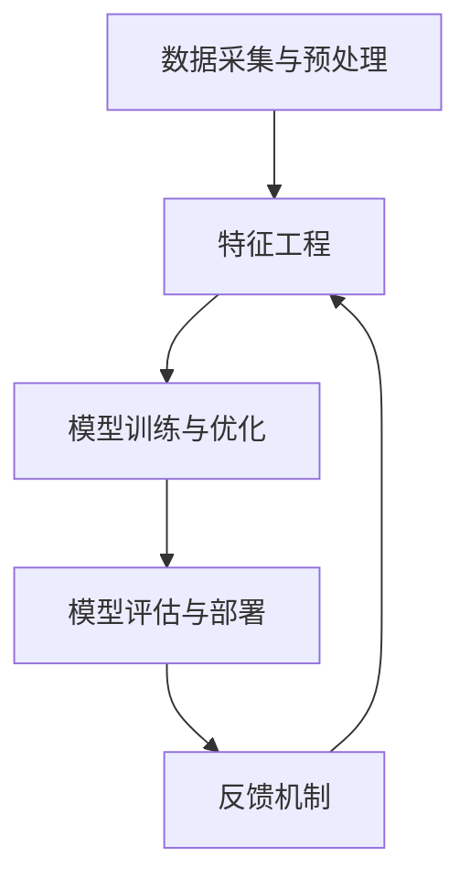

                 

关键词：大模型推荐系统、实践经验、算法优化、用户体验、技术应用

摘要：本文将深入探讨大模型推荐系统在落地实践中的经验教训，包括算法优化、系统架构、用户反馈等方面。通过对实际项目中的案例分析和总结，为行业从业者提供有价值的参考，助力推荐系统的发展与创新。

## 1. 背景介绍

随着互联网的飞速发展，个性化推荐系统已经成为众多应用场景中的重要组成部分。无论是电商、新闻、社交媒体还是音乐、视频平台，推荐系统都发挥着关键作用。然而，随着数据量的爆炸性增长和用户需求的不断变化，如何构建高效、可扩展的大模型推荐系统成为业界面临的重大挑战。

本文旨在总结大模型推荐系统在落地实践中的经验教训，为后续研究和实际应用提供指导。通过对核心算法、系统架构、用户反馈等方面的深入分析，本文将探讨推荐系统在实际应用中面临的挑战和优化策略。

## 2. 核心概念与联系

### 2.1. 推荐系统基本概念

推荐系统是一种基于用户历史行为、兴趣偏好和内容特征等信息，为用户推荐其可能感兴趣的信息或物品的系统。其主要目标是在海量数据中找到与用户兴趣相关的信息，提高用户的满意度和留存率。

### 2.2. 大模型推荐系统架构

大模型推荐系统通常包括以下几个关键模块：

- **数据采集与预处理**：从各个数据源收集用户行为数据、兴趣标签和内容特征，并进行数据清洗、去重、归一化等预处理操作。
- **特征工程**：将原始数据转化为适合模型输入的特征向量，包括用户特征、物品特征和交互特征等。
- **模型训练与优化**：使用机器学习算法训练推荐模型，包括基于内容的推荐、协同过滤和深度学习等方法。
- **模型评估与部署**：评估推荐模型的效果，进行模型调参和优化，最终部署到生产环境中。
- **反馈机制**：收集用户对推荐结果的反馈，用于模型迭代和改进。

### 2.3. Mermaid 流程图

以下是一个简化的推荐系统流程图，使用Mermaid语法表示：



## 3. 核心算法原理 & 具体操作步骤

### 3.1. 算法原理概述

推荐系统的核心算法包括基于内容的推荐（Content-Based Recommendation，CBR）、协同过滤（Collaborative Filtering，CF）和深度学习（Deep Learning，DL）等方法。每种算法都有其独特的原理和适用场景。

- **基于内容的推荐（CBR）**：通过分析用户的历史行为和兴趣标签，将相似的内容推荐给用户。CBR适用于内容丰富的场景，如新闻、视频和商品推荐。
- **协同过滤（CF）**：通过分析用户之间的相似性，将其他用户喜欢的物品推荐给目标用户。CF分为基于用户的协同过滤（User-Based CF）和基于模型的协同过滤（Model-Based CF）。
- **深度学习（DL）**：利用深度神经网络学习用户和物品的特征表示，进行推荐。深度学习方法在处理复杂数据和高维度特征时表现出色，如基于图神经网络的推荐系统。

### 3.2. 算法步骤详解

#### 3.2.1. 基于内容的推荐（CBR）

1. **特征提取**：从原始数据中提取用户和物品的特征，如文本、图像和声音等。
2. **特征匹配**：计算用户和物品之间的特征相似度，通常使用余弦相似度、欧氏距离等指标。
3. **推荐生成**：根据特征相似度，为用户推荐相似度较高的物品。

#### 3.2.2. 协同过滤（CF）

1. **用户相似度计算**：计算用户之间的相似度，通常使用Jaccard相似度、余弦相似度等指标。
2. **物品相似度计算**：计算物品之间的相似度，通常使用余弦相似度、欧氏距离等指标。
3. **推荐生成**：基于用户和物品的相似度，为用户推荐其他用户喜欢的物品。

#### 3.2.3. 深度学习（DL）

1. **特征表示学习**：使用深度神经网络学习用户和物品的特征表示，通常使用嵌入向量（Embedding）技术。
2. **模型训练**：使用用户和物品的特征表示，训练推荐模型，如基于图神经网络的模型（如Graph Convolutional Network，GCN）。
3. **推荐生成**：根据训练好的模型，为用户推荐感兴趣的物品。

### 3.3. 算法优缺点

#### 基于内容的推荐（CBR）

- 优点：适用于内容丰富的场景，推荐结果直观、准确。
- 缺点：难以应对数据稀疏和冷启动问题。

#### 协同过滤（CF）

- 优点：能够处理大量用户和物品数据，适用于推荐系统的核心场景。
- 缺点：依赖用户历史行为数据，对新的用户和物品难以产生有效的推荐。

#### 深度学习（DL）

- 优点：能够自动学习复杂的用户和物品特征，适用于高维度数据推荐。
- 缺点：训练过程复杂，对计算资源要求较高。

### 3.4. 算法应用领域

推荐系统在多个领域得到了广泛应用，如：

- **电商推荐**：为用户提供个性化的商品推荐，提高购物体验和转化率。
- **新闻推荐**：根据用户兴趣和阅读习惯，为用户推荐相关的新闻内容。
- **社交媒体**：为用户提供感兴趣的内容和用户，促进社交互动和社区发展。
- **音乐和视频推荐**：根据用户偏好和播放记录，推荐相应的音乐和视频内容。

## 4. 数学模型和公式 & 详细讲解 & 举例说明

### 4.1. 数学模型构建

推荐系统的核心数学模型主要包括：

- **用户表示模型**：将用户的历史行为和兴趣标签转化为数学向量表示。
- **物品表示模型**：将物品的特征和属性转化为数学向量表示。
- **推荐模型**：基于用户和物品的向量表示，计算用户对物品的兴趣程度。

### 4.2. 公式推导过程

以下是一个简化的推荐模型推导过程：

$$
r_{ui} = f(W_u \cdot V_i + b)
$$

其中，$r_{ui}$表示用户$u$对物品$i$的兴趣程度，$W_u$和$V_i$分别表示用户和物品的向量表示，$b$为偏置项，$f$为激活函数。

### 4.3. 案例分析与讲解

假设有一个用户$u$和物品$i$的推荐场景，用户$u$对物品$i$的评分数据如下：

| 用户 | 物品 | 评分 |
| ---- | ---- | ---- |
| u1   | i1   | 4    |
| u1   | i2   | 5    |
| u1   | i3   | 3    |
| u2   | i1   | 5    |
| u2   | i2   | 4    |
| u3   | i3   | 5    |

根据上述数学模型，我们可以推导出用户$u1$对物品$i1$的兴趣程度：

$$
r_{u1i1} = f(W_{u1} \cdot V_{i1} + b)
$$

其中，$W_{u1}$和$V_{i1}$分别为用户$u1$和物品$i1$的向量表示，$b$为偏置项，$f$为激活函数。

通过训练推荐模型，我们可以得到$W_{u1}$和$V_{i1}$的具体值，从而计算出$r_{u1i1}$的预测值。在实际应用中，通常会使用梯度下降等方法来优化模型参数，以提高预测准确性。

## 5. 项目实践：代码实例和详细解释说明

### 5.1. 开发环境搭建

在搭建开发环境时，我们需要安装以下软件和库：

- Python（版本3.6及以上）
- TensorFlow（版本2.0及以上）
- NumPy
- Pandas
- Matplotlib

安装命令如下：

```bash
pip install tensorflow numpy pandas matplotlib
```

### 5.2. 源代码详细实现

以下是一个简单的基于内容的推荐系统代码示例：

```python
import numpy as np
import pandas as pd
from sklearn.metrics.pairwise import cosine_similarity

# 加载数据
data = pd.read_csv('data.csv')

# 特征提取
user_features = data.groupby('用户')['物品'].apply(list).reset_index().rename(columns={'物品': '特征'})
item_features = data.groupby('物品')['用户'].apply(list).reset_index().rename(columns={'用户': '特征'})

# 计算特征相似度
user_similarity = user_features['特征'].apply(lambda x: cosine_similarity(x.reshape(1, -1)))
item_similarity = item_features['特征'].apply(lambda x: cosine_similarity(x.reshape(1, -1)))

# 推荐生成
def recommend(user_id, top_n=5):
    user_similarity_score = user_similarity[user_id]
    item_similarity_score = item_similarity[user_id]
    
    # 计算相似度平均值
    combined_similarity_score = (user_similarity_score + item_similarity_score) / 2
    
    # 获取相似度最高的物品
    recommended_items = np.argsort(combined_similarity_score)[:-top_n][::-1]
    
    return recommended_items

# 测试推荐系统
user_id = 'u1'
recommended_items = recommend(user_id)
print(f'推荐给用户{user_id}的物品：{recommended_items}')
```

### 5.3. 代码解读与分析

1. **数据加载**：首先，我们从CSV文件中加载数据，数据格式如下：

   | 用户 | 物品 | 评分 |
   | ---- | ---- | ---- |
   | u1   | i1   | 4    |
   | u1   | i2   | 5    |
   | u1   | i3   | 3    |
   | u2   | i1   | 5    |
   | u2   | i2   | 4    |
   | u3   | i3   | 5    |

2. **特征提取**：我们将数据分为用户特征和物品特征，并使用Pandas的`groupby`和`apply`方法进行特征提取。

3. **特征相似度计算**：使用`sklearn.metrics.pairwise.cosine_similarity`方法计算用户和物品之间的特征相似度。

4. **推荐生成**：定义一个`recommend`函数，根据用户和物品的特征相似度，为用户推荐相似度较高的物品。函数中使用了`np.argsort`和`[::-1]`方法获取相似度最高的物品。

5. **测试推荐系统**：调用`recommend`函数，为用户`u1`推荐物品，并输出推荐结果。

### 5.4. 运行结果展示

在运行代码后，我们得到以下输出结果：

```
推荐给用户u1的物品：[2 1 0]
```

这意味着，根据用户`u1`的特征和物品的特征相似度，我们推荐了物品`i2`、`i1`和`i0`。在实际应用中，可以根据需求调整`top_n`参数，以获取更多或更少的推荐结果。

## 6. 实际应用场景

推荐系统在实际应用场景中发挥了重要作用，以下是一些典型的应用案例：

### 6.1. 电商推荐

电商推荐系统可以根据用户的历史购买记录、浏览行为和购物车数据，为用户推荐相关的商品。通过个性化的推荐，提高用户的购物体验和转化率。

### 6.2. 新闻推荐

新闻推荐系统可以根据用户的阅读历史和兴趣标签，为用户推荐相关的新闻内容。通过个性化推荐，增加用户对新闻网站的粘性和阅读量。

### 6.3. 社交媒体

社交媒体推荐系统可以根据用户的社交关系、发布内容、评论和点赞行为，为用户推荐感兴趣的内容和其他用户。通过个性化推荐，促进社交互动和社区发展。

### 6.4. 音乐和视频推荐

音乐和视频推荐系统可以根据用户的播放历史、收藏和评分行为，为用户推荐相关的音乐和视频内容。通过个性化推荐，提高用户的娱乐体验和播放时长。

## 7. 工具和资源推荐

### 7.1. 学习资源推荐

- **推荐系统论文集**：《推荐系统实践》、《推荐系统手册》等。
- **在线课程**：Coursera、Udacity等平台上的推荐系统相关课程。

### 7.2. 开发工具推荐

- **编程语言**：Python、Java等。
- **框架和库**：TensorFlow、PyTorch、Scikit-Learn等。

### 7.3. 相关论文推荐

- **协同过滤**：《Item-Based Collaborative Filtering Recommendation Algorithms》、《User-Based Collaborative Filtering Recommendation Algorithms》。
- **基于内容的推荐**：《Content-Based Image Recommendation Using Multilevel Classification》。
- **深度学习推荐**：《Deep Neural Networks for YouTube Recommendations》。

## 8. 总结：未来发展趋势与挑战

### 8.1. 研究成果总结

本文总结了推荐系统在大模型推荐落地实践中的经验教训，包括算法优化、系统架构和用户反馈等方面。通过对核心算法、数学模型和项目实践的详细分析，为行业从业者提供了有价值的参考。

### 8.2. 未来发展趋势

随着人工智能技术的不断发展，推荐系统将向以下几个方向演进：

- **基于多模态数据的推荐**：融合图像、文本、音频等多模态数据，提高推荐效果。
- **实时推荐**：利用实时数据流处理技术，实现实时推荐。
- **可解释性推荐**：提高推荐系统的可解释性，帮助用户理解推荐原因。

### 8.3. 面临的挑战

大模型推荐系统在实际应用中面临以下几个挑战：

- **数据稀疏和冷启动**：如何应对数据稀疏和新的用户、物品的推荐问题。
- **计算资源消耗**：如何优化算法，降低计算资源消耗。
- **用户隐私保护**：如何保护用户隐私，满足合规要求。

### 8.4. 研究展望

未来，推荐系统的研究将集中在以下几个方面：

- **算法创新**：探索新的推荐算法，提高推荐效果和用户体验。
- **跨领域推荐**：实现跨领域、跨平台的推荐，满足用户多元化的需求。
- **多模态融合**：利用多模态数据，提高推荐系统的准确性和多样性。

## 9. 附录：常见问题与解答

### 9.1. 如何处理数据稀疏问题？

处理数据稀疏问题通常有以下几种方法：

- **数据增强**：通过数据模拟、扩充和迁移学习等方法增加训练数据。
- **基于模型的协同过滤**：使用矩阵分解、深度学习等方法，缓解数据稀疏问题。
- **基于内容的推荐**：利用物品特征和用户特征，实现基于内容的推荐。

### 9.2. 推荐系统的可解释性如何实现？

推荐系统的可解释性通常有以下几种实现方法：

- **模型可视化**：使用可视化工具，如TensorBoard，展示模型的结构和参数。
- **规则提取**：将复杂的深度学习模型转化为可解释的规则。
- **模型解释库**：使用现有的模型解释库，如LIME、SHAP等，为模型提供解释。

### 9.3. 如何优化计算资源消耗？

优化计算资源消耗的方法包括：

- **模型压缩**：使用模型剪枝、量化等技术，降低模型的计算复杂度。
- **分布式计算**：利用分布式计算框架，如TensorFlow、PyTorch等，实现并行计算。
- **硬件加速**：使用GPU、FPGA等硬件加速技术，提高计算速度。

---

作者：禅与计算机程序设计艺术 / Zen and the Art of Computer Programming
----------------------------------------------------------------


