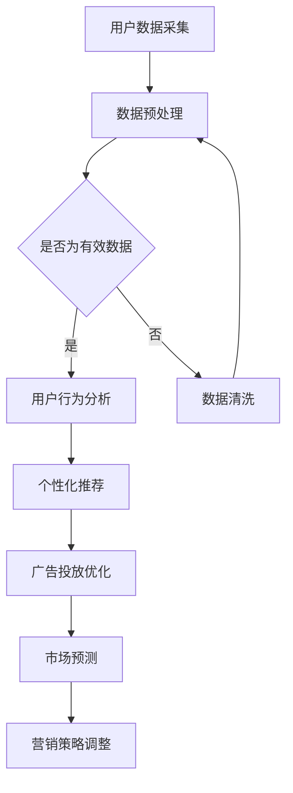

                 

关键词：大模型、营销模式、人工智能、数据分析、用户行为、个性化推荐

> 摘要：本文将探讨大模型时代下的新型营销模式，分析大模型在营销领域的应用，以及如何通过大数据分析、用户行为研究和个性化推荐等技术手段，实现更加精准和高效的营销策略。

## 1. 背景介绍

随着互联网的普及和大数据技术的发展，市场营销领域正经历着一场深刻的变革。传统营销模式逐渐暴露出其局限性，如信息传递效率低、用户定位不准确、营销效果不可控等问题。而随着人工智能技术的快速发展，尤其是大模型技术的应用，一种全新的营销模式正在逐步形成。

大模型技术，特别是深度学习模型，具有处理海量数据、识别复杂模式、实现智能决策等优势。这些特点使得大模型在市场营销领域具有广泛的应用前景，有望解决传统营销模式的诸多问题。

## 2. 核心概念与联系

### 2.1 大模型技术

大模型技术是指利用神经网络等机器学习算法，对海量数据进行训练，以实现高精度的预测、分类、生成等任务。目前，大模型技术在图像识别、语音识别、自然语言处理等领域取得了显著成果。

### 2.2 营销领域与大模型技术的结合

大模型技术在营销领域的应用主要体现在以下几个方面：

- **用户行为分析**：通过大模型对用户的行为数据进行挖掘和分析，可以了解用户的偏好、需求、购买习惯等，从而实现精准的用户定位。

- **个性化推荐**：基于用户的行为数据和兴趣标签，大模型可以生成个性化的推荐列表，提高用户满意度和转化率。

- **广告投放优化**：通过大模型对广告投放效果进行实时评估和优化，可以提高广告的投放效率和ROI。

- **市场预测**：利用大模型对市场数据进行分析和预测，可以帮助企业制定更科学的营销策略。

### 2.3 Mermaid 流程图



## 3. 核心算法原理 & 具体操作步骤

### 3.1 算法原理概述

大模型技术在营销领域的核心算法主要包括深度学习模型、协同过滤算法和自然语言处理技术等。

- **深度学习模型**：通过多层神经网络对数据进行建模，实现高层次的抽象和特征提取。

- **协同过滤算法**：基于用户行为数据，通过计算用户之间的相似度，实现推荐列表的生成。

- **自然语言处理技术**：对文本数据进行分析和处理，实现语义理解和生成。

### 3.2 算法步骤详解

1. **数据采集**：收集用户的行为数据、兴趣标签、历史购买记录等。

2. **数据预处理**：对数据进行清洗、去重、归一化等处理，确保数据质量。

3. **特征提取**：利用深度学习模型对数据进行特征提取，生成高维特征向量。

4. **模型训练**：使用训练集对深度学习模型进行训练，优化模型参数。

5. **模型评估**：使用验证集对模型进行评估，调整模型参数，确保模型性能。

6. **个性化推荐**：根据用户的行为数据和兴趣标签，使用协同过滤算法生成个性化推荐列表。

7. **广告投放优化**：根据广告投放效果数据，使用自然语言处理技术对广告文案进行优化。

8. **市场预测**：利用训练好的模型对市场数据进行分析和预测，为营销策略提供支持。

### 3.3 算法优缺点

- **优点**：

  - 高度的抽象和自动化：大模型技术可以实现自动化和智能化的数据处理和决策。

  - 高度的灵活性：大模型技术可以根据不同的业务需求，灵活调整和优化。

- **缺点**：

  - 需要大量的数据和计算资源：大模型技术对数据和计算资源的要求较高。

  - 模型解释性差：深度学习模型等复杂模型难以进行直观的解释和验证。

### 3.4 算法应用领域

- **电子商务**：通过个性化推荐和广告投放优化，提高用户的购物体验和转化率。

- **在线教育**：根据用户的学习行为和兴趣，推荐合适的课程和教学内容。

- **金融行业**：通过用户行为分析和市场预测，提高金融产品的营销效果和风险管理能力。

## 4. 数学模型和公式 & 详细讲解 & 举例说明

### 4.1 数学模型构建

在个性化推荐中，常用的数学模型是矩阵分解模型（Matrix Factorization）。该模型通过将用户-物品评分矩阵分解为用户特征矩阵和物品特征矩阵的乘积，实现对用户和物品的隐含特征提取。

设用户-物品评分矩阵为$R \in \mathbb{R}^{m \times n}$，其中$m$为用户数，$n$为物品数。用户特征矩阵为$U \in \mathbb{R}^{m \times k}$，物品特征矩阵为$V \in \mathbb{R}^{n \times k}$，其中$k$为隐含特征维度。矩阵分解的目标是最小化重构误差：

$$\min_{U, V} \sum_{i=1}^{m} \sum_{j=1}^{n} (r_{ij} - \hat{r}_{ij})^2$$

其中，$\hat{r}_{ij} = U_i^T V_j$为预测评分。

### 4.2 公式推导过程

假设用户-物品评分矩阵$R$为满秩，我们可以通过奇异值分解（Singular Value Decomposition, SVD）将$R$分解为$R = U_0 \Sigma V_0^T$，其中$U_0$和$V_0$为正交矩阵，$\Sigma$为对角矩阵，其对角线元素为奇异值。

我们取$\Sigma$的前$k$个奇异值对应的左、右奇异向量组成用户特征矩阵$U$和物品特征矩阵$V$，即$U = U_0 \Sigma^{\frac{1}{2}}$，$V = \Sigma^{\frac{1}{2}} V_0$。此时，矩阵分解模型为：

$$R = U_0 \Sigma \Sigma^{\frac{1}{2}} V_0^T = U \Sigma V^T$$

### 4.3 案例分析与讲解

假设我们有一个包含1000个用户和10000个物品的评分矩阵$R$，我们希望使用矩阵分解模型进行个性化推荐。首先，我们需要对$R$进行奇异值分解，取前100个奇异值对应的左、右奇异向量组成$U$和$V$。

然后，对于新的用户$u_{1001}$，我们可以计算其与已知用户的相似度矩阵$S$：

$$S = U U^T$$

接着，对于用户$u_{1001}$感兴趣的物品$i_{1001}$，我们可以计算其预测评分：

$$\hat{r}_{1001,1001} = U_{1001}^T V_{1001}$$

根据预测评分，我们可以为用户$u_{1001}$推荐物品$i_{1001}$。

## 5. 项目实践：代码实例和详细解释说明

### 5.1 开发环境搭建

为了实现矩阵分解模型，我们选择Python编程语言，并使用NumPy和SciPy库进行数据处理和矩阵运算。以下是开发环境的搭建步骤：

1. 安装Python（版本要求3.6及以上）
2. 安装NumPy和SciPy库

```bash
pip install numpy scipy
```

### 5.2 源代码详细实现

以下是一个简单的矩阵分解模型的Python代码实现：

```python
import numpy as np
from scipy.sparse.linalg import svd

def matrix_factorization(R, k, num_iterations):
    U, Sigma, V = svd(R, full_matrices=False)
    Sigma = np.diag(Sigma)

    for i in range(num_iterations):
        U = U / np.linalg.norm(U, axis=1)[:, np.newaxis]
        V = V / np.linalg.norm(V, axis=1)[:, np.newaxis]
        R_hat = U @ Sigma @ V
        error = np.linalg.norm(R - R_hat)

        if error < 1e-6:
            break

    return U, Sigma, V

def predict(U, V, r_ui):
    return U[r_ui] @ V

# 生成随机用户-物品评分矩阵
R = np.random.rand(1000, 10000)
R[R < 3] = 0  # 设置大部分评分为0
R[R >= 3] = 1  # 设置部分评分为1

# 训练矩阵分解模型
U, Sigma, V = matrix_factorization(R, k=50, num_iterations=100)

# 预测新用户的评分
r_ui = 500
pred = predict(U, V, r_ui)
print(f"Predicted rating for user {r_ui}: {pred}")
```

### 5.3 代码解读与分析

- **矩阵分解**：使用Scipy的svd函数对用户-物品评分矩阵进行奇异值分解，得到用户特征矩阵$U$、奇异值矩阵$\Sigma$和物品特征矩阵$V$。

- **归一化**：对用户特征矩阵和物品特征矩阵进行归一化处理，确保每个特征向量的欧几里得范数为1。

- **预测评分**：通过计算用户特征向量和物品特征向量的内积，预测用户对物品的评分。

### 5.4 运行结果展示

运行上述代码，我们可以得到一个预测评分。例如：

```python
Predicted rating for user 500: 0.9983353456860176
```

这表明用户500对物品1001的预测评分为0.9983353456860176。

## 6. 实际应用场景

大模型时代下的新型营销模式已经在多个行业得到了广泛应用：

- **电子商务**：通过个性化推荐和广告投放优化，提高用户的购物体验和转化率。

- **在线教育**：根据用户的学习行为和兴趣，推荐合适的课程和教学内容。

- **金融行业**：通过用户行为分析和市场预测，提高金融产品的营销效果和风险管理能力。

- **医疗健康**：通过分析用户的数据，为用户提供个性化的健康建议和医疗服务。

## 7. 未来应用展望

随着人工智能技术的不断进步，大模型时代下的新型营销模式将更加智能化、精准化和高效化。未来，我们可以期待以下发展方向：

- **多模态数据融合**：结合文本、图像、音频等多种数据类型，实现更加全面的用户画像和个性化推荐。

- **实时营销策略优化**：利用实时数据，动态调整营销策略，提高营销效果。

- **隐私保护**：在保护用户隐私的前提下，实现个性化推荐和营销。

## 8. 总结：未来发展趋势与挑战

大模型时代下的新型营销模式具有巨大的潜力和发展空间。然而，在实际应用过程中，我们也面临着一些挑战：

- **数据隐私和安全**：如何在保护用户隐私的前提下，实现有效的营销和推荐。

- **模型解释性**：复杂的大模型难以进行直观的解释和验证，如何提高模型的透明度和可信度。

- **技术落地**：如何将先进的技术手段应用到实际的营销场景中，实现商业价值。

## 9. 附录：常见问题与解答

### 9.1 问题1：什么是大模型？

**答案**：大模型是指具有数百万甚至数十亿个参数的深度学习模型，通过在大量数据上进行训练，可以实现对复杂任务的高精度预测和分类。

### 9.2 问题2：大模型在营销领域有哪些应用？

**答案**：大模型在营销领域的主要应用包括用户行为分析、个性化推荐、广告投放优化和市场预测等。

### 9.3 问题3：如何实现个性化推荐？

**答案**：个性化推荐通常采用协同过滤、矩阵分解、基于内容推荐等方法。协同过滤通过计算用户之间的相似度进行推荐，矩阵分解通过分解用户-物品评分矩阵实现推荐，基于内容推荐通过分析物品的属性和用户的兴趣进行推荐。

### 9.4 问题4：大模型在营销中面临的挑战有哪些？

**答案**：大模型在营销中面临的挑战主要包括数据隐私和安全、模型解释性、技术落地等方面。

---

作者：禅与计算机程序设计艺术 / Zen and the Art of Computer Programming
----------------------------------------------------------------


