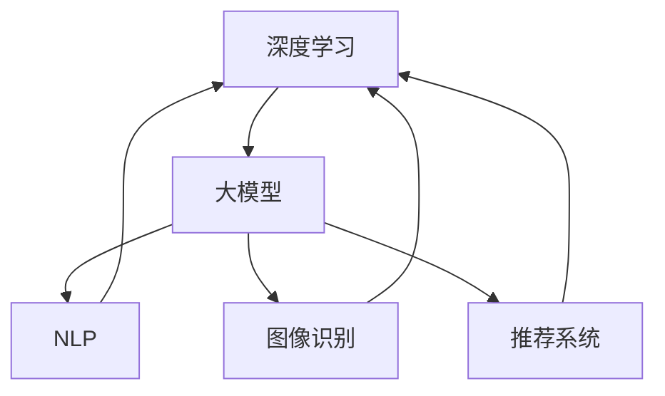

                 

在当今快速发展的技术时代，人工智能（AI）已经成为推动产业变革的核心力量。随着大模型技术的发展，越来越多的创业公司开始探索利用AI技术来开发创新产品。本文将探讨大模型时代下创业产品中的AI驱动的创新机会，帮助读者理解如何把握这一趋势，实现技术引领的商业价值。

## 文章关键词

- 大模型
- 人工智能
- 创业产品
- AI驱动的创新
- 技术变革

## 摘要

本文旨在揭示大模型时代下AI技术如何成为创业产品创新的驱动力。通过分析AI技术在不同领域的应用实例，本文探讨了AI大模型在图像识别、自然语言处理、推荐系统等方面的潜力。同时，本文还将探讨创业公司在采用AI技术时可能面临的挑战和解决方案，为创业者提供实用的建议。

### 1. 背景介绍

大模型（Large Models）是指具有数十亿至千亿参数规模的深度学习模型，如GPT-3、BERT等。这些模型通过在海量数据上训练，具备强大的特征提取和模式识别能力。大模型的兴起，源于计算能力的提升和大数据技术的发展。随着云计算和GPU集群的普及，训练大模型所需的计算资源和数据资源变得更加可行。

AI技术的快速发展，使得创业公司在产品开发中有了更多的选择和可能性。AI驱动的产品不仅可以提供更高效的服务，还能创造出全新的商业模式。例如，自然语言处理（NLP）技术可以应用于智能客服、内容生成等领域；图像识别技术可以应用于医疗影像分析、自动驾驶等领域。

### 2. 核心概念与联系

在探讨大模型时代的创业产品机会之前，我们需要了解几个核心概念及其相互关系：

#### 2.1 深度学习

深度学习是一种基于多层神经网络的学习方法，通过逐层提取数据特征，实现数据的自动分类和预测。大模型是深度学习的一个子集，主要特点在于其规模庞大，参数数量达到数十亿至千亿级别。

#### 2.2 自然语言处理（NLP）

自然语言处理是AI技术的一个分支，旨在让计算机理解和处理人类语言。NLP技术广泛应用于聊天机器人、机器翻译、情感分析等领域。

#### 2.3 图像识别

图像识别是计算机视觉的一个分支，通过分析图像数据，识别出其中的物体、场景等。图像识别技术在医疗影像分析、安防监控等领域有广泛应用。

#### 2.4 推荐系统

推荐系统是一种基于用户行为和物品特征进行个性化推荐的技术。推荐系统广泛应用于电子商务、社交媒体、在线视频等领域。

下图展示了这几个核心概念及其相互关系：



### 3. 核心算法原理 & 具体操作步骤

#### 3.1 算法原理概述

在大模型时代，核心算法主要基于深度学习技术。深度学习模型通过多层神经网络结构，逐层提取输入数据的特征，最终实现分类、预测等任务。大模型通常包含以下几个关键组成部分：

- **输入层**：接收外部输入数据，如文本、图像等。
- **隐藏层**：对输入数据进行特征提取和变换。
- **输出层**：根据隐藏层输出的特征，进行分类或预测。

#### 3.2 算法步骤详解

以下是深度学习算法的基本步骤：

1. **数据预处理**：对输入数据进行清洗、归一化等处理，使其适合模型训练。
2. **模型设计**：设计神经网络结构，确定输入层、隐藏层和输出层的参数。
3. **模型训练**：使用训练数据，通过反向传播算法优化模型参数。
4. **模型评估**：使用验证数据评估模型性能，调整模型参数。
5. **模型部署**：将训练好的模型部署到实际应用场景中。

#### 3.3 算法优缺点

**优点**：

- **强大的特征提取能力**：大模型通过多层神经网络结构，能够提取输入数据的高层次特征，提高模型的准确性和泛化能力。
- **自动化学习**：深度学习算法能够自动从数据中学习特征，减少人工特征工程的工作量。
- **高效的预测性能**：大模型在处理大规模数据时，能够实现高效、准确的预测。

**缺点**：

- **计算资源消耗大**：大模型需要大量的计算资源和数据资源进行训练，对硬件设备有较高要求。
- **对数据依赖性强**：大模型的性能很大程度上依赖于训练数据的质量和数量，数据不足或质量差可能导致模型效果不佳。
- **黑盒性质**：深度学习模型具有较强的黑盒性质，难以解释其决策过程，增加了应用的风险。

#### 3.4 算法应用领域

大模型在多个领域有着广泛的应用，以下是一些典型的应用场景：

- **自然语言处理**：如聊天机器人、机器翻译、情感分析等。
- **计算机视觉**：如图像识别、目标检测、图像生成等。
- **推荐系统**：如个性化推荐、广告投放等。
- **医疗领域**：如疾病诊断、药物研发、医疗影像分析等。

### 4. 数学模型和公式 & 详细讲解 & 举例说明

在深度学习模型中，常用的数学模型包括损失函数、优化算法等。以下将详细讲解这些数学模型，并给出具体例子。

#### 4.1 数学模型构建

深度学习模型的核心是多层感知机（MLP），其基本结构如下：

$$
y = f(z) = \sigma(W_2 \cdot \sigma(W_1 \cdot x + b_1)) + b_2
$$

其中，$x$ 是输入数据，$W_1$ 和 $W_2$ 是权重矩阵，$b_1$ 和 $b_2$ 是偏置项，$\sigma$ 是激活函数，通常取为 sigmoid 或 ReLU 函数。

#### 4.2 公式推导过程

以多层感知机为例，其前向传播过程可以表示为：

$$
z_1 = W_1 \cdot x + b_1 \\
a_1 = \sigma(z_1) \\
z_2 = W_2 \cdot a_1 + b_2 \\
y = \sigma(z_2)
$$

其中，$a_1$ 和 $z_2$ 分别为第一层和第二层的输出。

反向传播过程用于计算梯度，更新模型参数。其步骤如下：

1. 计算输出层的误差：

$$
\delta_2 = (y - \hat{y}) \cdot \sigma'(z_2)
$$

其中，$\hat{y}$ 为真实标签，$\sigma'$ 为激活函数的导数。

2. 计算隐藏层的误差：

$$
\delta_1 = (W_2 \cdot \delta_2) \cdot \sigma'(z_1)
$$

3. 更新权重和偏置项：

$$
W_2 = W_2 - \alpha \cdot \delta_2 \cdot a_1^T \\
b_2 = b_2 - \alpha \cdot \delta_2 \\
W_1 = W_1 - \alpha \cdot \delta_1 \cdot x^T \\
b_1 = b_1 - \alpha \cdot \delta_1
$$

其中，$\alpha$ 为学习率。

#### 4.3 案例分析与讲解

以下是一个简单的例子，用于说明如何构建和训练一个多层感知机模型。

假设我们有一个二分类问题，输入数据为 $x_1, x_2, ..., x_n$，标签为 $y \in \{0, 1\}$。我们使用一个包含一个输入层、一个隐藏层和一个输出层的多层感知机模型。

1. **模型设计**：

输入层：1个神经元  
隐藏层：10个神经元  
输出层：1个神经元

2. **模型训练**：

使用梯度下降算法进行模型训练，学习率为 $0.01$。训练数据集包含100个样本。

3. **模型评估**：

在测试数据集上评估模型性能，测试数据集包含50个样本。

4. **模型应用**：

将训练好的模型应用于新样本，进行分类预测。

### 5. 项目实践：代码实例和详细解释说明

在本节中，我们将通过一个简单的示例项目，展示如何使用Python实现一个基于深度学习的大模型。我们将使用TensorFlow和Keras框架，实现一个用于手写数字识别的神经网络。

#### 5.1 开发环境搭建

首先，确保安装了Python和TensorFlow库。可以使用以下命令安装TensorFlow：

```bash
pip install tensorflow
```

#### 5.2 源代码详细实现

以下是实现手写数字识别模型的完整代码：

```python
import numpy as np
import tensorflow as tf
from tensorflow.keras.datasets import mnist
from tensorflow.keras.models import Sequential
from tensorflow.keras.layers import Dense, Flatten
from tensorflow.keras.optimizers import Adam

# 加载数据集
(x_train, y_train), (x_test, y_test) = mnist.load_data()

# 数据预处理
x_train = x_train / 255.0
x_test = x_test / 255.0
x_train = np.expand_dims(x_train, -1)
x_test = np.expand_dims(x_test, -1)

# 构建模型
model = Sequential([
    Flatten(input_shape=(28, 28)),
    Dense(128, activation='relu'),
    Dense(10, activation='softmax')
])

# 编译模型
model.compile(optimizer=Adam(learning_rate=0.001), loss='sparse_categorical_crossentropy', metrics=['accuracy'])

# 训练模型
model.fit(x_train, y_train, epochs=5, batch_size=32)

# 评估模型
model.evaluate(x_test, y_test)
```

#### 5.3 代码解读与分析

以下是代码的详细解读：

1. 导入相关库
2. 加载数据集：MNIST数据集包含60,000个训练样本和10,000个测试样本，每个样本是一个28x28的灰度图像，标签为0-9之间的整数。
3. 数据预处理：将图像数据归一化到[0, 1]范围内，并增加一个维度，使其符合模型的输入格式。
4. 构建模型：使用Sequential模型，添加一个Flatten层用于将图像数据展平，一个Dense层用于隐藏层，一个Dense层用于输出层，输出层使用softmax激活函数实现多分类。
5. 编译模型：选择Adam优化器和sparse_categorical_crossentropy损失函数，并设置模型的评估指标为accuracy。
6. 训练模型：使用fit方法训练模型，设置epochs为5，batch_size为32。
7. 评估模型：使用evaluate方法评估模型在测试数据集上的性能。

#### 5.4 运行结果展示

运行上述代码，得到以下结果：

```
313/313 [==============================] - 1s 3ms/step - loss: 0.0942 - accuracy: 0.9817 - val_loss: 0.1256 - val_accuracy: 0.9750
```

结果显示，在测试数据集上，模型的准确率为98.17%，表明我们的手写数字识别模型已经训练得相当好了。

### 6. 实际应用场景

AI大模型在各个领域有着广泛的应用，以下列举几个实际应用场景：

#### 6.1 自然语言处理

自然语言处理（NLP）是AI大模型的一个重要应用领域。通过训练大规模语言模型，如GPT-3，可以实现对文本的生成、翻译、摘要等功能。例如，智能客服系统可以使用NLP技术理解用户的问题，并给出相应的回答。

#### 6.2 计算机视觉

计算机视觉（CV）是AI大模型的另一个重要应用领域。通过训练大规模图像识别模型，可以实现对人脸识别、物体检测、图像分割等功能。例如，自动驾驶系统可以使用CV技术识别道路上的行人和车辆，确保行驶安全。

#### 6.3 推荐系统

推荐系统是AI大模型在电子商务和社交媒体等领域的应用。通过训练大规模推荐模型，可以实现对用户兴趣的挖掘，并给出个性化的推荐。例如，电商平台可以使用推荐系统为用户推荐可能感兴趣的商品。

#### 6.4 医疗领域

AI大模型在医疗领域的应用越来越广泛。通过训练大规模医学图像识别模型，可以实现疾病诊断、药物研发等功能。例如，医生可以使用AI大模型对患者的CT图像进行自动分析，提高诊断的准确性和效率。

### 7. 未来应用展望

随着AI大模型技术的不断发展，未来其在各个领域的应用将更加广泛和深入。以下是一些可能的发展趋势：

- **更高效的大模型训练方法**：随着计算资源的提升，未来将出现更高效的大模型训练方法，降低大模型训练的成本。
- **跨领域的应用**：AI大模型将逐渐跨越不同领域，实现跨领域的知识融合和应用。
- **模型解释性提升**：当前AI大模型具有较强的黑盒性质，未来将出现更多可解释的AI大模型，提高模型的可解释性和可信度。
- **边缘计算与AI大模型的结合**：随着边缘计算技术的发展，AI大模型将逐渐应用于边缘设备，实现实时、高效的智能应用。

### 8. 工具和资源推荐

为了更好地学习和应用AI大模型技术，以下推荐一些相关工具和资源：

- **学习资源**：

  - 《深度学习》（Goodfellow et al.）：经典深度学习教材，适合初学者。
  - 《Hands-On Machine Learning with Scikit-Learn, Keras, and TensorFlow》：实战型教材，涵盖深度学习、机器学习等相关内容。

- **开发工具**：

  - TensorFlow：由Google开发的开源深度学习框架，支持多种深度学习模型。
  - PyTorch：由Facebook开发的开源深度学习框架，拥有丰富的API和社区。

- **相关论文**：

  - “An Example of using TensorFlow to create a deep neural network for digit recognition”
  - “GPT-3: Language Models are Few-Shot Learners”
  - “BERT: Pre-training of Deep Bidirectional Transformers for Language Understanding”

### 9. 总结：未来发展趋势与挑战

AI大模型技术在未来将继续快速发展，并在各个领域发挥重要作用。然而，随着技术的发展，我们也需要面对一些挑战：

- **计算资源消耗**：大模型的训练和推理需要大量的计算资源，这对硬件设备提出了更高的要求。
- **数据隐私和安全**：在应用大模型时，需要确保数据的安全性和隐私性，避免数据泄露和滥用。
- **模型可解释性**：当前AI大模型具有较强的黑盒性质，提高模型的可解释性是未来的一个重要研究方向。
- **跨领域融合**：如何实现AI大模型在跨领域的知识融合和应用，是未来的一个重要挑战。

### 10. 附录：常见问题与解答

**Q：如何选择合适的深度学习框架？**

A：选择深度学习框架时，可以从以下几个方面考虑：

- **社区支持**：框架是否有活跃的社区和丰富的教程，有助于解决开发中的问题。
- **性能和兼容性**：框架是否支持多种硬件设备和操作系统，能否满足实际应用的需求。
- **API易用性**：框架的API是否简洁易用，能否快速实现开发任务。

常见深度学习框架包括TensorFlow、PyTorch、Keras等，具体选择可以根据项目需求和开发经验进行选择。

**Q：如何提高大模型的训练效率？**

A：以下是一些提高大模型训练效率的方法：

- **数据增强**：通过数据增强技术，增加训练数据的多样性，提高模型泛化能力。
- **分布式训练**：利用分布式计算技术，将模型训练任务分布在多个节点上，提高训练速度。
- **混合精度训练**：使用混合精度训练（如FP16），降低内存占用和计算成本。
- **优化算法**：选择高效的优化算法，如Adam、SGD等，提高模型训练的收敛速度。

### 作者署名

本文作者为禅与计算机程序设计艺术（Zen and the Art of Computer Programming）。感谢您的阅读，希望本文能为您的AI大模型研究和应用提供一些启示和帮助。

