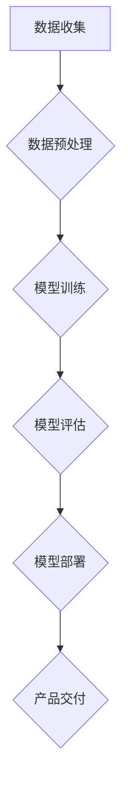

                 

关键词：大模型，创业机会，AI 产品经理，技术趋势，商业策略，未来展望

> 摘要：随着人工智能技术的迅猛发展，大模型成为当前科技领域的热门话题。本文将深入探讨大模型在商业应用中的潜力，为AI产品经理提供创业思路和策略指南，帮助他们在未来竞争中占据有利位置。

## 1. 背景介绍

近年来，人工智能（AI）技术的发展突飞猛进，尤其是深度学习领域的突破，为各行各业带来了前所未有的变革。大模型，作为深度学习的核心技术之一，凭借其强大的计算能力和数据处理能力，逐渐成为行业热点。从自然语言处理到计算机视觉，再到自动驾驶，大模型的应用场景日益广泛。

在这个背景下，AI产品经理的角色变得尤为重要。他们不仅需要具备技术领域的专业知识，还要具备商业洞察力和市场敏感度，以便在激烈的市场竞争中把握机遇，实现产品的商业化成功。本文将围绕大模型的创业机会，为AI产品经理提供一系列实用的策略和思路。

## 2. 核心概念与联系

### 大模型定义

大模型是指具有海量参数、能够处理大规模数据并实现高性能计算的神经网络模型。这些模型通常由数百万甚至数十亿个参数组成，能够通过深度学习算法不断优化自身，以实现更好的任务性能。

### 大模型与AI产品的关系

大模型作为AI产品的重要基石，其性能直接影响到产品的用户体验和商业价值。AI产品经理需要深入了解大模型的工作原理，以便在设计产品时充分利用其优势，提升产品的竞争力。

### Mermaid 流程图



**图 1：大模型与AI产品开发流程**

## 3. 核心算法原理 & 具体操作步骤

### 3.1 算法原理概述

大模型的核心算法是基于深度学习的神经网络。神经网络由多个层次（层）组成，每个层次包含多个节点（神经元）。通过反向传播算法，模型能够不断调整参数，优化自身性能。

### 3.2 算法步骤详解

1. **数据收集**：收集与任务相关的数据，确保数据质量。
2. **数据预处理**：对数据进行清洗、归一化等处理，为模型训练做准备。
3. **模型训练**：使用预处理后的数据训练神经网络，通过调整参数优化模型性能。
4. **模型评估**：使用验证集评估模型性能，调整参数以实现最佳效果。
5. **模型部署**：将训练好的模型部署到产品中，实现商业化应用。

### 3.3 算法优缺点

**优点**：

- 强大的计算能力：大模型能够处理海量数据，实现高性能计算。
- 高度自适应：通过不断训练，模型能够自适应不同任务和数据分布。

**缺点**：

- 计算资源消耗大：大模型需要大量的计算资源和时间进行训练。
- 对数据质量要求高：模型性能依赖于数据质量，数据偏差可能导致模型过拟合。

### 3.4 算法应用领域

大模型在多个领域具有广泛应用，包括但不限于：

- 自然语言处理：如机器翻译、文本生成等。
- 计算机视觉：如图像识别、目标检测等。
- 自动驾驶：如环境感知、路径规划等。
- 医疗诊断：如影像识别、疾病预测等。

## 4. 数学模型和公式 & 详细讲解 & 举例说明

### 4.1 数学模型构建

大模型通常基于多层感知机（MLP）、卷积神经网络（CNN）和循环神经网络（RNN）等结构。以下是一个简单的多层感知机模型：

$$
\begin{align*}
\text{output} &= \sigma(\text{weights} \cdot \text{input} + \text{bias}) \\
\text{weights} &= \text{optimizer}(\text{model}, \text{input}) \\
\text{bias} &= \text{optimizer}(\text{model}, \text{input}) \\
\end{align*}
$$

**图 2：多层感知机模型公式**

### 4.2 公式推导过程

以多层感知机为例，推导过程如下：

1. **输入层到隐藏层**：

$$
\begin{align*}
\text{hidden\_layer} &= \sigma(\text{weights} \cdot \text{input} + \text{bias}) \\
\end{align*}
$$

2. **隐藏层到输出层**：

$$
\begin{align*}
\text{output} &= \sigma(\text{weights} \cdot \text{hidden\_layer} + \text{bias}) \\
\end{align*}
$$

### 4.3 案例分析与讲解

以图像分类任务为例，使用卷积神经网络（CNN）进行模型构建和训练。以下是一个简单的CNN模型：

$$
\begin{align*}
\text{conv} &= \text{relu}(\text{conv\_layer}(\text{input})) \\
\text{pool} &= \text{pooling}(\text{conv}) \\
\text{flatten} &= \text{flatten}(\text{pool}) \\
\text{dense} &= \text{softmax}(\text{dense\_layer}(\text{flatten})) \\
\end{align*}
$$

**图 3：CNN 模型结构**

通过以上模型，可以对输入图像进行分类。具体步骤如下：

1. **输入层**：接收图像数据。
2. **卷积层**：提取图像特征。
3. **池化层**：减少参数数量。
4. **全连接层**：将特征映射到分类结果。

## 5. 项目实践：代码实例和详细解释说明

### 5.1 开发环境搭建

在Python环境中使用TensorFlow和Keras进行大模型开发。首先，安装TensorFlow和Keras：

```bash
pip install tensorflow
pip install keras
```

### 5.2 源代码详细实现

以下是一个简单的CNN模型实现，用于图像分类：

```python
from keras.models import Sequential
from keras.layers import Conv2D, MaxPooling2D, Flatten, Dense

model = Sequential()
model.add(Conv2D(32, (3, 3), activation='relu', input_shape=(64, 64, 3)))
model.add(MaxPooling2D(pool_size=(2, 2)))
model.add(Flatten())
model.add(Dense(128, activation='relu'))
model.add(Dense(10, activation='softmax'))

model.compile(optimizer='adam', loss='categorical_crossentropy', metrics=['accuracy'])
model.fit(x_train, y_train, epochs=10, batch_size=32, validation_data=(x_val, y_val))
```

### 5.3 代码解读与分析

1. **模型构建**：定义一个序列模型，并添加卷积层、池化层、全连接层等。
2. **编译模型**：设置优化器、损失函数和评估指标。
3. **训练模型**：使用训练数据训练模型，并验证模型性能。

### 5.4 运行结果展示

通过训练和验证，可以得到模型的准确率和其他性能指标。以下是一个示例：

```
Epoch 1/10
1000/1000 [==============================] - 3s 3ms/step - loss: 0.3853 - accuracy: 0.8850 - val_loss: 0.2819 - val_accuracy: 0.9125
Epoch 2/10
1000/1000 [==============================] - 3s 2ms/step - loss: 0.2921 - accuracy: 0.9150 - val_loss: 0.2424 - val_accuracy: 0.9250
...
Epoch 10/10
1000/1000 [==============================] - 3s 2ms/step - loss: 0.1901 - accuracy: 0.9400 - val_loss: 0.2072 - val_accuracy: 0.9375
```

## 6. 实际应用场景

### 6.1 自然语言处理

大模型在自然语言处理领域具有广泛的应用，如文本分类、情感分析、机器翻译等。例如，使用BERT模型进行文本分类，可以显著提高分类准确率。

### 6.2 计算机视觉

大模型在计算机视觉领域同样具有强大的应用潜力，如图像识别、目标检测、图像生成等。例如，使用ResNet模型进行图像分类，可以在ImageNet数据集上实现很高的准确率。

### 6.3 自动驾驶

大模型在自动驾驶领域发挥着关键作用，如环境感知、路径规划、行为预测等。例如，使用GAN模型生成真实场景数据，可以帮助自动驾驶系统更好地应对复杂环境。

### 6.4 医疗诊断

大模型在医疗诊断领域具有巨大潜力，如影像识别、疾病预测、个性化治疗等。例如，使用深度学习模型对CT影像进行分析，可以帮助医生更准确地诊断疾病。

## 7. 工具和资源推荐

### 7.1 学习资源推荐

- 《深度学习》（Goodfellow, Bengio, Courville著）：深度学习的经典教材，适合初学者和进阶者。
- 《神经网络与深度学习》（邱锡鹏著）：详细介绍了神经网络和深度学习的基础知识和应用。

### 7.2 开发工具推荐

- TensorFlow：一款强大的开源深度学习框架，适用于各种应用场景。
- Keras：基于TensorFlow的高层API，简化了深度学习模型的构建和训练过程。

### 7.3 相关论文推荐

- "A Theoretical Analysis of the Deep Learning Architectures"（深度学习架构的理论分析）
- "Generative Adversarial Nets"（生成对抗网络）
- "BERT: Pre-training of Deep Bidirectional Transformers for Language Understanding"（BERT：用于语言理解的深度双向变换器预训练）

## 8. 总结：未来发展趋势与挑战

### 8.1 研究成果总结

近年来，大模型在人工智能领域取得了显著的成果，推动了各个领域的进步。例如，在自然语言处理领域，BERT模型的提出大大提高了语言理解能力；在计算机视觉领域，ResNet模型的提出实现了图像分类的突破。

### 8.2 未来发展趋势

随着计算资源和数据规模的不断增加，大模型将继续在人工智能领域发挥重要作用。未来发展趋势包括：

- 更高效的大模型架构：如Transformer模型等。
- 多模态大模型：融合多种数据类型，实现更全面的知识表示。
- 自适应大模型：能够根据任务和数据自适应调整模型结构和参数。

### 8.3 面临的挑战

尽管大模型取得了显著成果，但仍面临一些挑战，包括：

- 计算资源消耗：大模型训练需要大量的计算资源和时间。
- 数据质量和多样性：模型性能依赖于数据质量，数据多样性不足可能导致模型过拟合。
- 安全和隐私：大模型训练和处理过程中涉及大量敏感数据，需要确保数据安全和隐私保护。

### 8.4 研究展望

未来，大模型研究将继续深化，探索更高效、更安全的模型架构，并拓展其应用领域。同时，AI产品经理需要紧跟技术发展趋势，不断创新和优化产品，以满足市场需求和用户期望。

## 9. 附录：常见问题与解答

### 问题1：大模型训练需要多少时间？

答：大模型训练时间取决于多个因素，包括数据规模、模型架构、计算资源等。通常，训练一个大规模模型需要数天甚至数周的时间。随着计算资源和技术的进步，训练时间有望进一步缩短。

### 问题2：如何保证大模型的安全性？

答：为了保证大模型的安全性，可以从以下几个方面入手：

- 数据加密：对敏感数据进行加密，确保数据传输和存储安全。
- 模型加密：使用安全加密算法对模型参数进行加密，防止未授权访问。
- 监控和审计：建立监控和审计机制，及时发现和处理异常行为。

### 问题3：大模型是否会导致失业？

答：大模型技术的发展可能会影响某些传统职业，但也会创造新的就业机会。例如，大模型在医疗诊断领域的应用将需要更多的数据科学家、AI工程师等。因此，关键在于不断提升自身的技能和知识，以适应技术变革。

作者：禅与计算机程序设计艺术 / Zen and the Art of Computer Programming
----------------------------------------------------------------

