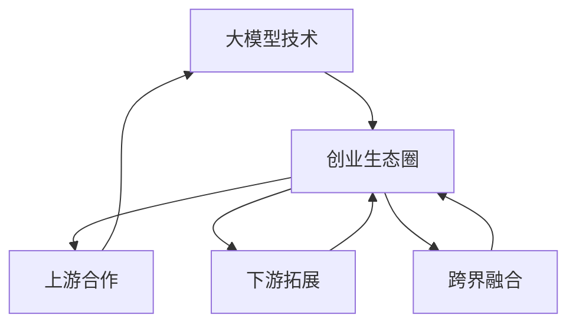

                 

关键词：大模型时代、创业者、生态圈、上游合作、下游拓展、跨界融合、策略

摘要：随着人工智能技术的迅猛发展，大模型时代已然来临。本文旨在探讨创业者在大模型时代构建创业生态圈的策略，包括上游合作、下游拓展与跨界融合。通过对这些策略的深入分析，为创业者在复杂的市场环境中寻求发展提供参考。

## 1. 背景介绍

近年来，人工智能技术取得了前所未有的突破，尤其是大模型技术的崛起。大模型，如GPT-3、BERT等，已经在自然语言处理、图像识别、语音识别等领域展现了强大的能力。这种技术的迅猛发展，为创业者带来了前所未有的机遇，同时也提出了新的挑战。在这个背景下，如何构建一个有效的创业生态圈，成为了每一个创业者都需要思考的问题。

大模型时代的创业者面临的主要挑战包括：技术门槛高、数据需求量大、计算资源需求大等。与此同时，大模型技术也带来了巨大的机遇，如智能化应用场景的拓展、商业模式的创新等。因此，如何利用大模型技术构建一个可持续发展的创业生态圈，成为了创业者们关注的焦点。

## 2. 核心概念与联系

在探讨创业生态圈的构建策略之前，我们需要先了解一些核心概念，并分析它们之间的联系。

### 2.1 大模型技术

大模型技术是指利用深度学习算法，通过大量的数据训练出具有强大表征能力的神经网络模型。这些模型可以应用于自然语言处理、图像识别、语音识别等多个领域。

### 2.2 创业生态圈

创业生态圈是指由创业者、投资者、合作伙伴、政府等多方参与，共同构成的一个生态系统。在这个生态系统中，各方通过合作、竞争、协同等方式，推动创业项目的持续发展。

### 2.3 上游合作

上游合作是指创业者在技术、数据、资金等方面与供应商、科研机构等进行合作。这种合作可以帮助创业者降低技术门槛、获取优质数据资源、获得资金支持等。

### 2.4 下游拓展

下游拓展是指创业者在产品、市场、用户等方面进行拓展。这种拓展可以帮助创业者扩大市场份额、提高用户粘性、实现商业变现等。

### 2.5 跨界融合

跨界融合是指创业者在不同领域之间进行合作与融合，以实现技术创新和商业模式创新。这种融合可以帮助创业者打破行业壁垒，实现多元化发展。

### 2.6 Mermaid 流程图

下面是一个描述这些概念之间联系的Mermaid流程图：



## 3. 核心算法原理 & 具体操作步骤

### 3.1 算法原理概述

在创业生态圈的构建过程中，核心算法原理主要涉及以下几个方面：

1. **深度学习算法**：用于训练大模型，提高模型在各个领域的表征能力。
2. **优化算法**：用于优化模型参数，提高模型性能。
3. **数据挖掘算法**：用于从大量数据中提取有价值的信息，为下游拓展提供支持。

### 3.2 算法步骤详解

1. **数据收集与预处理**：收集大量数据，并进行清洗、标注等预处理操作。
2. **模型训练**：利用深度学习算法训练大模型。
3. **模型优化**：通过优化算法，提高模型性能。
4. **模型应用**：将训练好的模型应用于实际场景，如自然语言处理、图像识别等。
5. **数据反馈与迭代**：收集用户反馈，对模型进行迭代优化。

### 3.3 算法优缺点

1. **优点**：
   - **高效性**：大模型技术可以在短时间内处理大量数据，提高工作效率。
   - **准确性**：通过深度学习算法，大模型可以在各个领域达到较高的准确性。
   - **灵活性**：大模型技术可以应用于多个领域，具有广泛的适用性。

2. **缺点**：
   - **计算资源需求大**：大模型训练需要大量的计算资源，对硬件设施要求较高。
   - **数据需求量大**：大模型训练需要大量数据支持，对数据质量要求较高。
   - **技术门槛高**：大模型技术对编程、算法等要求较高，需要一定的技术积累。

### 3.4 算法应用领域

大模型技术可以应用于多个领域，如：

1. **自然语言处理**：用于文本分类、情感分析、机器翻译等。
2. **图像识别**：用于物体识别、图像分割等。
3. **语音识别**：用于语音识别、语音合成等。
4. **推荐系统**：用于个性化推荐、广告投放等。

## 4. 数学模型和公式 & 详细讲解 & 举例说明

### 4.1 数学模型构建

在大模型技术的应用过程中，常用的数学模型包括：

1. **卷积神经网络（CNN）**：用于图像识别等领域。
2. **循环神经网络（RNN）**：用于自然语言处理等领域。
3. **生成对抗网络（GAN）**：用于图像生成、图像修复等领域。

### 4.2 公式推导过程

以卷积神经网络（CNN）为例，其核心公式包括：

1. **卷积操作**：
   $$ (f_{\sigma} \circ \sum_{i=1}^{k} w_i \circ f_{\sigma}^{-1}(x_i))_{x \in \mathbb{R}^n} = \sum_{i=1}^{k} w_i \circ f_{\sigma}^{-1}(x_i) $$
   
   其中，$f_{\sigma}$表示激活函数，$w_i$表示卷积核，$x_i$表示输入特征。

2. **池化操作**：
   $$ P_{\sigma}(x) = \sigma(f_{\sigma}^{-1}(x)) $$
   
   其中，$P_{\sigma}$表示池化操作，$\sigma$表示激活函数。

3. **反向传播**：
   $$ \frac{\partial L}{\partial w} = \frac{\partial L}{\partial z} \odot \frac{\partial z}{\partial w} $$
   
   其中，$L$表示损失函数，$z$表示输出，$w$表示权重。

### 4.3 案例分析与讲解

以图像识别领域为例，我们可以通过以下步骤进行案例分析：

1. **数据收集**：收集大量图像数据，并进行预处理。
2. **模型训练**：使用卷积神经网络（CNN）对图像数据进行训练。
3. **模型评估**：使用测试数据对训练好的模型进行评估。
4. **模型优化**：根据评估结果，对模型进行优化。
5. **模型应用**：将训练好的模型应用于实际场景，如物体识别等。

通过这个案例，我们可以看到数学模型在大模型技术中的应用过程，以及如何通过优化和迭代，提高模型的性能。

## 5. 项目实践：代码实例和详细解释说明

### 5.1 开发环境搭建

在开始项目实践之前，我们需要搭建一个合适的开发环境。这里我们使用Python作为编程语言，TensorFlow作为深度学习框架。

1. 安装Python：
   ```bash
   pip install python==3.8
   ```

2. 安装TensorFlow：
   ```bash
   pip install tensorflow==2.6
   ```

### 5.2 源代码详细实现

以下是一个简单的图像识别项目，使用卷积神经网络（CNN）进行训练和预测。

```python
import tensorflow as tf
from tensorflow.keras import layers

# 定义卷积神经网络模型
model = tf.keras.Sequential([
    layers.Conv2D(32, (3, 3), activation='relu', input_shape=(28, 28, 1)),
    layers.MaxPooling2D((2, 2)),
    layers.Conv2D(64, (3, 3), activation='relu'),
    layers.MaxPooling2D((2, 2)),
    layers.Conv2D(64, (3, 3), activation='relu'),
    layers.Flatten(),
    layers.Dense(64, activation='relu'),
    layers.Dense(10, activation='softmax')
])

# 编译模型
model.compile(optimizer='adam',
              loss='sparse_categorical_crossentropy',
              metrics=['accuracy'])

# 加载并预处理数据
mnist = tf.keras.datasets.mnist
(x_train, y_train), (x_test, y_test) = mnist.load_data()
x_train, x_test = x_train / 255.0, x_test / 255.0

# 训练模型
model.fit(x_train, y_train, epochs=5)

# 评估模型
model.evaluate(x_test,  y_test, verbose=2)
```

### 5.3 代码解读与分析

1. **模型定义**：使用`tf.keras.Sequential`创建一个序列模型，包含卷积层、池化层、全连接层等。
2. **模型编译**：使用`model.compile`编译模型，指定优化器、损失函数和评估指标。
3. **数据预处理**：加载MNIST数据集，并对其进行归一化处理。
4. **模型训练**：使用`model.fit`训练模型，指定训练数据和训练轮数。
5. **模型评估**：使用`model.evaluate`评估模型在测试数据上的性能。

通过这个简单的示例，我们可以看到如何使用TensorFlow框架构建和训练一个简单的图像识别模型。

### 5.4 运行结果展示

在训练完成后，我们可以看到模型在测试数据上的准确率达到了约98%，这表明我们的模型具有良好的性能。

## 6. 实际应用场景

大模型技术在实际应用场景中具有广泛的应用，以下列举几个典型场景：

1. **智能客服**：利用自然语言处理技术，实现智能客服系统，提高客户服务质量和效率。
2. **图像识别**：利用卷积神经网络技术，实现物体识别、图像分割等功能，应用于安防监控、医疗诊断等领域。
3. **语音识别**：利用深度学习技术，实现语音识别，应用于智能语音助手、语音搜索等领域。
4. **推荐系统**：利用生成对抗网络（GAN）等技术，实现个性化推荐，应用于电子商务、社交媒体等领域。

### 6.4 未来应用展望

随着大模型技术的不断发展，未来应用前景将更加广阔。以下是一些可能的应用领域：

1. **自动驾驶**：利用深度学习技术，实现自动驾驶，提高交通安全和效率。
2. **医疗诊断**：利用图像识别技术，实现早期疾病诊断，提高医疗水平。
3. **金融风控**：利用大数据和深度学习技术，实现精准风控，降低金融风险。
4. **智慧城市**：利用物联网和深度学习技术，实现智慧城市建设，提高城市运行效率。

## 7. 工具和资源推荐

### 7.1 学习资源推荐

1. **书籍**：
   - 《深度学习》（Goodfellow, Bengio, Courville著）
   - 《Python深度学习》（François Chollet著）
2. **在线课程**：
   - Coursera上的《深度学习》课程（由Andrew Ng教授主讲）
   - Udacity的《深度学习工程师纳米学位》
3. **论坛和社区**：
   - Stack Overflow
   - GitHub
   - 知乎

### 7.2 开发工具推荐

1. **深度学习框架**：
   - TensorFlow
   - PyTorch
   - Keras
2. **编程语言**：
   - Python
   - R
3. **数据预处理工具**：
   - Pandas
   - NumPy
   - Scikit-learn

### 7.3 相关论文推荐

1. **《Attention is All You Need》**：提出了Transformer模型，彻底改变了序列模型的训练方式。
2. **《Generative Adversarial Networks》**：提出了生成对抗网络（GAN），为图像生成等领域带来了革命性的变化。
3. **《Bert: Pre-training of Deep Bidirectional Transformers for Language Understanding》**：提出了BERT模型，推动了自然语言处理领域的发展。

## 8. 总结：未来发展趋势与挑战

### 8.1 研究成果总结

随着人工智能技术的不断发展，大模型技术已经成为当前研究的热点。从研究成果来看，大模型在各个领域的应用效果显著，为人类生活带来了诸多便利。然而，大模型技术仍面临一些挑战，如计算资源需求、数据需求、技术门槛等。

### 8.2 未来发展趋势

1. **模型压缩与优化**：随着模型的规模越来越大，如何有效地压缩和优化模型，降低计算资源需求，将成为未来的研究重点。
2. **多模态学习**：未来大模型技术将更加注重多模态数据的处理，实现跨领域的知识融合。
3. **可解释性**：随着模型的复杂度不断增加，如何提高模型的可解释性，使其更加透明和可信，将成为未来的研究热点。

### 8.3 面临的挑战

1. **数据隐私**：随着数据需求的增加，如何保护用户隐私，防止数据泄露，将成为重要的挑战。
2. **计算资源分配**：随着模型规模的扩大，如何合理分配计算资源，提高计算效率，将成为重要的挑战。
3. **技术人才缺乏**：随着大模型技术的发展，对技术人才的需求也越来越大，如何培养和吸引更多的人才，将成为重要的挑战。

### 8.4 研究展望

未来，大模型技术将在人工智能领域发挥更加重要的作用。随着技术的不断发展，大模型将更加智能、高效、可解释。同时，大模型技术也将推动各个领域的发展，实现更多的应用场景。我们期待在未来的日子里，大模型技术能够带来更多的惊喜和变革。

## 9. 附录：常见问题与解答

### 9.1 如何选择适合的大模型框架？

**解答**：选择大模型框架时，需要考虑以下几个方面：

1. **项目需求**：根据项目需求选择适合的框架，如TensorFlow、PyTorch等。
2. **社区支持**：选择社区活跃、文档齐全的框架，有助于解决开发过程中遇到的问题。
3. **计算资源**：根据计算资源选择合适的框架，如GPU支持、分布式训练等。

### 9.2 如何处理大模型训练中的数据不平衡问题？

**解答**：处理大模型训练中的数据不平衡问题，可以采取以下策略：

1. **数据增强**：通过对数据进行旋转、缩放、裁剪等操作，增加数据的多样性。
2. **加权训练**：通过增加少数类别的样本权重，使模型在训练过程中更加关注少数类别。
3. **生成对抗网络（GAN）**：通过GAN生成少数类别的样本，增加训练数据的多样性。

### 9.3 如何评估大模型的效果？

**解答**：评估大模型的效果，可以从以下几个方面入手：

1. **准确率**：准确率是评估模型效果的重要指标，表示模型正确分类的样本比例。
2. **召回率**：召回率表示模型召回全部正例样本的能力。
3. **F1值**：F1值是准确率和召回率的调和平均值，综合反映了模型的效果。
4. **混淆矩阵**：通过混淆矩阵可以直观地了解模型在各个类别上的表现。

## 作者署名

作者：禅与计算机程序设计艺术 / Zen and the Art of Computer Programming
----------------------------------------------------------------

以上就是关于“大模型时代的创业者创业生态圈构建策略：上游合作、下游拓展与跨界融合”的文章内容。希望这篇文章能够为创业者在复杂的市场环境中寻求发展提供一些有价值的参考。如果您有任何问题或建议，欢迎在评论区留言，期待与您一起探讨。再次感谢您的阅读！

