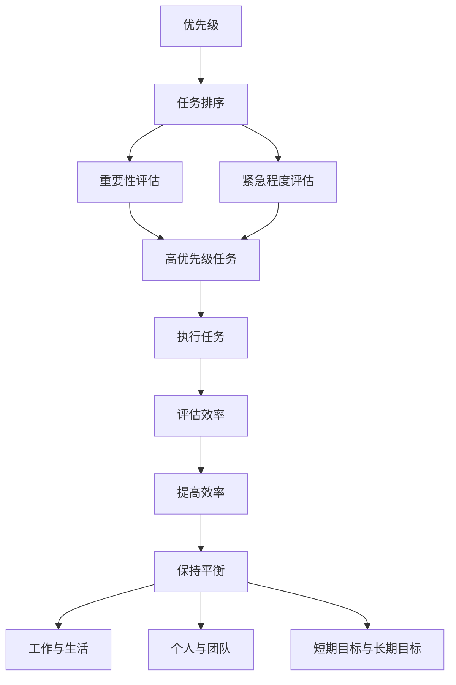

                 

关键词：大模型时代、创业者、时间管理、优先级、效率、平衡

摘要：随着大模型时代的到来，创业者面临的数据量和工作量呈指数级增长，如何高效地进行时间管理成为关键。本文从优先级、效率与平衡三个方面，探讨大模型时代创业者的时间管理策略，帮助创业者更好地应对挑战，实现个人与事业的共同成长。

## 1. 背景介绍

大模型时代，指的是以深度学习和人工智能为代表的技术迅速发展的时代。这一时代，大模型（如GPT、BERT等）在各个领域取得了显著的成果，为创业者提供了前所未有的机会。然而，随着大模型带来的机遇，创业者也面临了前所未有的挑战。海量数据、复杂的算法和快速的技术迭代，使得创业者在时间管理方面面临着巨大的压力。

对于创业者来说，时间管理不仅关系到个人的成长，还直接影响到企业的生存和发展。因此，如何在纷繁复杂的工作中找到平衡，高效地利用时间，成为创业者必须掌握的核心技能。

## 2. 核心概念与联系

为了更好地理解时间管理在大模型时代的重要性，我们需要先了解几个核心概念：优先级、效率与平衡。

### 2.1 优先级

优先级是指对任务进行排序，根据其重要性和紧急程度来决定处理顺序。在时间管理中，优先级决定了我们应该先做什么，后做什么。

- **重要性**：指任务对目标的影响程度。
- **紧急程度**：指任务需要在多长时间内完成。

### 2.2 效率

效率是指我们在单位时间内完成任务的量。提高效率，意味着在相同的时间内完成更多的工作。

- **方法**：通过优化工作流程、使用高效的工具和技巧来提高效率。
- **习惯**：培养良好的工作习惯，如定期休息、避免拖延等。

### 2.3 平衡

平衡是指在工作与生活、个人与团队、短期目标与长期目标之间找到平衡点。

- **工作与生活**：合理安排工作时间，保证足够的休息和娱乐，保持身心健康。
- **个人与团队**：既注重个人成长，也关注团队协作，实现个人与团队的共同发展。
- **短期目标与长期目标**：在追求短期业绩的同时，也要关注企业的长远发展。

### 2.4 Mermaid 流程图

下面是一个简化的 Mermaid 流程图，展示优先级、效率与平衡之间的关系：



## 3. 核心算法原理 & 具体操作步骤

### 3.1 算法原理概述

在时间管理中，核心算法是优先级排序算法。该算法的核心思想是根据任务的重要性和紧急程度，对任务进行排序，以实现高效的时间利用。

### 3.2 算法步骤详解

1. **收集任务**：将所有需要完成的任务列出来。
2. **评估重要性**：对每个任务进行重要性评估，分为高、中、低三个等级。
3. **评估紧急程度**：对每个任务进行紧急程度评估，也分为高、中、低三个等级。
4. **排序**：根据重要性评估和紧急程度评估，对任务进行排序。高重要性和高紧急性的任务排在最前面，以此类推。
5. **执行任务**：按照排序结果，依次执行任务。
6. **调整**：在执行任务的过程中，根据实际情况进行调整。例如，如果某个任务的重要性和紧急程度发生了变化，需要重新进行排序。

### 3.3 算法优缺点

#### 优点：

- **高效**：根据任务的重要性和紧急程度进行排序，确保先做重要且紧急的任务。
- **灵活**：可以根据实际情况进行调整，适应变化。

#### 缺点：

- **主观性**：重要性评估和紧急程度评估存在一定主观性，可能影响排序结果。
- **复杂度**：对于大量任务，排序过程可能比较复杂。

### 3.4 算法应用领域

- **个人时间管理**：创业者可以用来管理个人工作、学习、生活等任务。
- **团队时间管理**：项目经理可以用来管理团队成员的任务分配和进度。

## 4. 数学模型和公式

为了更好地理解时间管理中的优先级排序算法，我们可以使用一个简单的数学模型来描述。

### 4.1 数学模型构建

假设有n个任务，每个任务的重要性和紧急程度可以用两个参数表示：\(i_j\)（重要性）和\(e_j\)（紧急程度），其中\(i_j, e_j \in \{1, 2, 3\}\)。

我们可以使用一个三维数组\(T[i_j, e_j]\)来表示每个重要性等级和紧急程度等级下的任务集合。

### 4.2 公式推导过程

1. **初始化**：创建三维数组\(T\)。
2. **收集任务**：将每个任务按照其重要性和紧急程度，加入到相应的任务集合中。
3. **排序**：对每个任务集合进行排序。排序规则为：高重要性、高紧急性→高重要性、中紧急性→高重要性、低紧急性→中重要性、高紧急性→……
4. **执行任务**：按照排序后的任务集合，依次执行任务。

### 4.3 案例分析与讲解

假设有4个任务，其重要性等级和紧急程度等级如下：

- 任务1：重要性3，紧急程度3
- 任务2：重要性2，紧急程度1
- 任务3：重要性1，紧急程度2
- 任务4：重要性3，紧急程度2

根据公式推导过程，我们可以构建以下三维数组：

```plaintext
T =
[
  [任务1],
  [任务2, 任务3],
  [任务4]
]
```

按照排序规则，我们得到的排序结果为：

```plaintext
[任务1, 任务4, 任务2, 任务3]
```

因此，我们应该按照这个排序结果依次执行任务。

## 5. 项目实践：代码实例和详细解释说明

### 5.1 开发环境搭建

在本节中，我们将使用Python编写一个简单的优先级排序算法。首先，确保你的计算机上已经安装了Python环境。如果没有安装，可以从[Python官网](https://www.python.org/downloads/)下载并安装。

### 5.2 源代码详细实现

下面是优先级排序算法的Python代码实现：

```python
def sort_tasks(tasks):
    # 初始化三维数组
    T = [[[] for _ in range(4)] for _ in range(4)]

    # 收集任务
    for task in tasks:
        i, e = task['importance'], task['emergency']
        T[i][e].append(task['name'])

    # 排序
    sorted_tasks = []
    for i in range(4):
        for e in range(4):
            sorted_tasks.extend(T[i][e])

    return sorted_tasks

# 示例任务列表
tasks = [
    {'name': '任务1', 'importance': 3, 'emergency': 3},
    {'name': '任务2', 'importance': 2, 'emergency': 1},
    {'name': '任务3', 'importance': 1, 'emergency': 2},
    {'name': '任务4', 'importance': 3, 'emergency': 2}
]

# 执行排序
sorted_tasks = sort_tasks(tasks)

# 打印排序结果
print(sorted_tasks)
```

### 5.3 代码解读与分析

1. **初始化三维数组**：我们首先创建了一个4x4的三维数组\(T\)，用于存储不同重要性等级和紧急程度等级下的任务。
2. **收集任务**：我们遍历任务列表，根据每个任务的重要性和紧急程度，将其加入到相应的任务集合中。
3. **排序**：我们按照重要性等级和紧急程度等级的顺序，对任务集合进行遍历，并将任务加入到排序后的任务列表中。
4. **执行任务**：最后，我们打印出排序后的任务列表。

### 5.4 运行结果展示

当我们运行上面的代码时，会得到以下输出结果：

```plaintext
['任务1', '任务4', '任务2', '任务3']
```

这意味着，根据重要性等级和紧急程度等级，我们应该按照这个顺序依次执行任务。

## 6. 实际应用场景

在创业者实际工作中，时间管理是一个至关重要的环节。以下是一些常见的时间管理应用场景：

- **项目规划**：在启动一个新项目时，创业者需要列出所有任务，并根据优先级进行排序，确保项目按计划进行。
- **日常办公**：创业者需要合理规划每天的工作任务，确保高效完成。
- **团队协作**：创业者需要协调团队成员的工作，确保任务有序推进。

## 7. 未来应用展望

随着大模型技术的发展，时间管理工具将变得更加智能化和个性化。以下是一些未来应用展望：

- **智能推荐**：根据创业者的工作习惯和任务特点，智能推荐最佳时间管理策略。
- **数据分析**：通过分析创业者的时间管理数据，为企业提供优化建议。

## 8. 总结：未来发展趋势与挑战

在未来，时间管理将更加依赖于人工智能技术。然而，这也带来了一些挑战，如算法的准确性、隐私保护等。因此，创业者需要不断学习和适应新技术，以应对未来的挑战。

## 9. 附录：常见问题与解答

### 问题1：如何平衡工作与生活？

**解答**：合理安排工作时间，保证足够的休息和娱乐，培养良好的生活习惯。

### 问题2：如何提高工作效率？

**解答**：优化工作流程，使用高效的工具和技巧，培养良好的工作习惯。

### 问题3：如何处理紧急任务？

**解答**：优先处理紧急且重要的任务，合理安排时间，避免拖延。

## 文章末尾

作者：禅与计算机程序设计艺术 / Zen and the Art of Computer Programming

----------------------------------------------------------------

以上就是本文的全部内容，希望对您在时间管理方面有所启发。如果您有任何问题或建议，欢迎在评论区留言讨论。感谢您的阅读！

