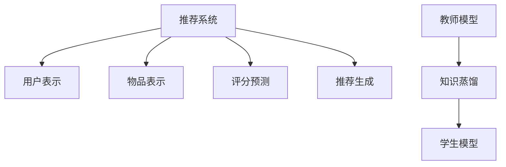

                 

关键词：大模型时代，推荐系统，知识蒸馏，技术创新，算法优化，应用场景

> 摘要：本文旨在探讨大模型时代推荐系统知识蒸馏技术的创新，包括其背景介绍、核心概念与联系、算法原理、数学模型和公式、项目实践、实际应用场景、未来应用展望、工具和资源推荐以及未来发展趋势与挑战。通过本文的探讨，希望为广大开发者和技术爱好者提供关于推荐系统知识蒸馏技术的深入理解，并展望其在未来的发展潜力。

## 1. 背景介绍

在当今信息爆炸的时代，推荐系统作为一种有效的信息过滤和检索方法，已经成为互联网企业提高用户体验、增加用户黏性和提高商业价值的重要手段。随着大数据技术和人工智能技术的不断发展，推荐系统的规模和复杂度不断提升，大模型如深度学习、图神经网络等在推荐系统中的应用也越来越广泛。

然而，大模型在训练和部署过程中面临着诸多挑战。首先是模型参数量庞大，导致训练时间过长、计算资源消耗巨大。其次，大模型的解释性较差，使得模型在决策过程中缺乏透明性，难以满足用户对推荐结果的可解释性需求。此外，大模型在训练过程中容易过拟合，导致模型在未见过的数据上表现不佳。

为了解决上述问题，知识蒸馏技术应运而生。知识蒸馏是一种通过压缩原始模型（通常是一个大模型）的知识，并将其传递给一个较小的模型（通常称为学生模型）的技术。这种技术不仅能够减少模型参数量，提高模型训练效率，还能够增强模型的解释性，并减轻过拟合现象。

## 2. 核心概念与联系

### 2.1. 推荐系统

推荐系统是一种信息过滤和检索技术，旨在向用户推荐他们可能感兴趣的内容。推荐系统通常包含三个主要组件：用户、物品和评分。用户是指系统中的个体，物品是指系统中的内容，评分是指用户对物品的喜好程度。

推荐系统的基本流程如下：

1. 用户表示：将用户转化为一个特征向量，用于表示用户的偏好和兴趣。
2. 物品表示：将物品转化为一个特征向量，用于表示物品的属性和特征。
3. 评分预测：通过计算用户和物品特征向量的相似度，预测用户对物品的评分。
4. 推荐生成：根据评分预测结果，生成推荐列表，推荐给用户。

### 2.2. 知识蒸馏

知识蒸馏是一种模型压缩技术，通过将原始模型（教师模型）的知识传递给一个较小的模型（学生模型），从而实现模型参数的减少和训练时间的缩短。知识蒸馏的基本流程如下：

1. 教师模型：通常是一个大模型，具有较强的泛化能力和表达能力。
2. 学生模型：通常是一个较小的模型，具有较低的参数量和计算复杂度。
3. 蒸馏过程：通过最小化教师模型和学生在输出上的差异，传递教师模型的知识给学生模型。

### 2.3. 推荐系统与知识蒸馏的联系

知识蒸馏技术可以应用于推荐系统中，用于优化推荐模型的训练和部署过程。具体来说，可以将教师模型视为一个大规模的推荐模型，而学生模型则是一个较小规模的推荐模型。通过知识蒸馏，可以将教师模型的知识传递给学生模型，从而实现以下目标：

1. 模型参数减少：学生模型的参数量较小，可以显著降低模型存储和计算资源的消耗。
2. 训练时间缩短：学生模型的计算复杂度较低，可以加速模型的训练过程。
3. 提高解释性：学生模型通常具有较低的复杂度，可以更好地解释推荐结果的产生过程。
4. 减轻过拟合：通过知识蒸馏，学生模型可以继承教师模型的泛化能力，减少过拟合现象。

### 2.4. Mermaid 流程图



## 3. 核心算法原理 & 具体操作步骤

### 3.1 算法原理概述

知识蒸馏算法的核心思想是将教师模型（Teacher Model）的知识传递给学生模型（Student Model）。教师模型通常是一个复杂的大模型，具有丰富的特征提取能力和强大的表达能力；学生模型则是一个较小的模型，具有较高的效率但可能缺乏教师模型的复杂性。

算法的基本原理可以概括为以下三个步骤：

1. **特征提取**：教师模型对输入数据（用户和物品）进行特征提取，生成高维的特征表示。
2. **知识传递**：通过知识蒸馏损失函数，将教师模型的特征表示传递给学生模型。
3. **预测优化**：学生模型基于传递的知识进行预测，并通过梯度下降等优化算法不断调整参数，以提高预测准确性。

### 3.2 算法步骤详解

1. **初始化模型**：
   - 教师模型：一个预训练的大型推荐模型，如基于深度学习的方法。
   - 学生模型：一个较小的模型，与教师模型具有相同的架构，但参数量较少。

2. **输入数据预处理**：
   - 用户和物品特征：对用户和物品的特征进行编码，通常使用嵌入层（Embedding Layer）。
   - 输入数据：将用户和物品特征输入到教师模型中，获取特征表示。

3. **特征提取与知识传递**：
   - **特征提取**：教师模型对输入数据进行特征提取，输出高维特征向量。
   - **知识传递**：通过知识蒸馏损失函数，将教师模型的高维特征向量传递给学生模型。

4. **预测与优化**：
   - **预测**：学生模型使用传递的知识进行预测，输出用户对物品的评分预测。
   - **优化**：通过反向传播算法，计算学生模型的梯度，并更新模型参数。

5. **迭代训练**：
   - 重复执行特征提取、知识传递和预测优化步骤，直到模型收敛或达到预设的训练轮数。

### 3.3 算法优缺点

**优点**：

1. **减少模型参数**：通过知识蒸馏，学生模型的参数量显著减少，降低了存储和计算资源的需求。
2. **提高训练效率**：学生模型的计算复杂度较低，可以加快模型的训练速度。
3. **增强解释性**：学生模型的架构相对简单，有助于提高推荐结果的解释性。
4. **减轻过拟合**：学生模型通过继承教师模型的泛化能力，减轻了过拟合现象。

**缺点**：

1. **对教师模型的依赖**：知识蒸馏的效果很大程度上依赖于教师模型的性能，教师模型需要具有较强的泛化能力和表达能力。
2. **训练时间较长**：知识蒸馏过程中，需要多次迭代进行特征提取和模型优化，可能导致训练时间较长。
3. **解释性问题**：虽然学生模型的架构相对简单，但知识蒸馏过程本身仍然具有一定的黑盒性质，难以完全解释推荐结果。

### 3.4 算法应用领域

知识蒸馏技术在推荐系统中的应用主要包括以下领域：

1. **模型压缩与优化**：通过知识蒸馏，可以显著减少推荐模型的参数量，提高模型训练和部署的效率。
2. **跨领域推荐**：知识蒸馏可以跨领域传递模型知识，实现跨领域推荐系统的优化。
3. **实时推荐**：知识蒸馏技术可以加速推荐模型的训练和预测过程，提高实时推荐系统的响应速度。
4. **多模态推荐**：知识蒸馏技术可以整合不同模态的数据，提高多模态推荐系统的性能。

## 4. 数学模型和公式 & 详细讲解 & 举例说明

### 4.1 数学模型构建

在知识蒸馏过程中，主要涉及以下数学模型：

1. **教师模型（Teacher Model）**：假设教师模型为一个多层的神经网络，其输入为用户和物品的特征向量 $X \in \mathbb{R}^{m \times n}$，输出为预测的评分向量 $Y \in \mathbb{R}^{m \times 1}$。教师模型的损失函数可以表示为：

   $$ L_{T} = -\sum_{i=1}^{m} \sum_{j=1}^{n} [y_{ij} \log(p_{ij}) + (1 - y_{ij}) \log(1 - p_{ij})] $$

   其中，$p_{ij}$ 为教师模型对用户 $i$ 对物品 $j$ 的评分预测概率。

2. **学生模型（Student Model）**：学生模型为一个参数较少的神经网络，其输入和输出与教师模型相同。学生模型的损失函数可以表示为：

   $$ L_{S} = -\sum_{i=1}^{m} \sum_{j=1}^{n} [y_{ij} \log(q_{ij}) + (1 - y_{ij}) \log(1 - q_{ij})] $$

   其中，$q_{ij}$ 为学生模型对用户 $i$ 对物品 $j$ 的评分预测概率。

3. **知识蒸馏损失函数**：知识蒸馏损失函数旨在最小化教师模型和学生模型的输出差异。其形式可以表示为：

   $$ L_{D} = -\sum_{i=1}^{m} \sum_{j=1}^{n} [y_{ij} \log(q_{ij}) + (1 - y_{ij}) \log(1 - q_{ij}) + \alpha \cdot L_{T}] $$

   其中，$\alpha$ 为超参数，用于平衡知识蒸馏损失和预测损失。

### 4.2 公式推导过程

知识蒸馏过程的推导主要涉及以下步骤：

1. **特征提取**：教师模型和学生模型分别对输入数据进行特征提取，得到特征向量 $h_{T}$ 和 $h_{S}$。

2. **预测概率**：教师模型和学生模型分别对特征向量进行分类预测，得到预测概率 $p_{ij}$ 和 $q_{ij}$。

3. **损失函数**：计算教师模型和学生模型的损失函数，分别为 $L_{T}$ 和 $L_{S}$。

4. **知识蒸馏损失函数**：将教师模型和学生模型的损失函数进行组合，形成知识蒸馏损失函数 $L_{D}$。

### 4.3 案例分析与讲解

假设有一个推荐系统，用户 $i$ 对物品 $j$ 的评分数据为 $y_{ij} \in \{0, 1\}$。教师模型和学生模型分别为：

$$
\begin{aligned}
h_{T} &= W_{T}^{L} \cdot \sigma(W_{T}^{M} \cdot \sigma(W_{T}^{R} \cdot X)) \\
h_{S} &= W_{S}^{L} \cdot \sigma(W_{S}^{M} \cdot \sigma(W_{S}^{R} \cdot X))
\end{aligned}
$$

其中，$W_{T}^{L}, W_{T}^{M}, W_{T}^{R}$ 和 $W_{S}^{L}, W_{S}^{M}, W_{S}^{R}$ 分别为教师模型和学生模型的权重矩阵，$\sigma$ 为激活函数。

预测概率分别为：

$$
\begin{aligned}
p_{ij} &= \frac{1}{1 + \exp(-h_{T})} \\
q_{ij} &= \frac{1}{1 + \exp(-h_{S})}
\end{aligned}
$$

损失函数分别为：

$$
\begin{aligned}
L_{T} &= -\sum_{i=1}^{m} \sum_{j=1}^{n} [y_{ij} \log(q_{ij}) + (1 - y_{ij}) \log(1 - q_{ij})] \\
L_{S} &= -\sum_{i=1}^{m} \sum_{j=1}^{n} [y_{ij} \log(p_{ij}) + (1 - y_{ij}) \log(1 - p_{ij})]
\end{aligned}
$$

知识蒸馏损失函数为：

$$
L_{D} = -\sum_{i=1}^{m} \sum_{j=1}^{n} [y_{ij} \log(q_{ij}) + (1 - y_{ij}) \log(1 - q_{ij}) + \alpha \cdot L_{T}]
$$

其中，$\alpha$ 为超参数，可以通过交叉验证等方法进行选择。

通过梯度下降算法，对教师模型和学生模型的权重矩阵进行优化，以最小化知识蒸馏损失函数。

## 5. 项目实践：代码实例和详细解释说明

### 5.1 开发环境搭建

在开始项目实践之前，我们需要搭建一个合适的开发环境。以下是一个简单的环境搭建步骤：

1. **安装Python**：确保你的系统中已经安装了Python 3.7及以上版本。
2. **安装TensorFlow**：通过以下命令安装TensorFlow：

   ```bash
   pip install tensorflow
   ```

3. **安装其他依赖**：根据实际需求安装其他依赖项，如NumPy、Pandas等。

### 5.2 源代码详细实现

以下是一个基于知识蒸馏的推荐系统项目实现的基本框架。为了简化，我们仅关注模型构建和训练过程。

```python
import tensorflow as tf
from tensorflow.keras.layers import Embedding, Dense, Flatten
from tensorflow.keras.models import Model
from tensorflow.keras.optimizers import Adam

# 1. 定义教师模型和学生模型
def build_teacher_model(input_dim, hidden_dim, output_dim):
    inputs = tf.keras.layers.Input(shape=(input_dim,))
    x = Embedding(input_dim, hidden_dim)(inputs)
    x = Flatten()(x)
    outputs = Dense(output_dim, activation='sigmoid')(x)
    model = Model(inputs=inputs, outputs=outputs)
    return model

def build_student_model(input_dim, hidden_dim, output_dim):
    inputs = tf.keras.layers.Input(shape=(input_dim,))
    x = Embedding(input_dim, hidden_dim)(inputs)
    x = Flatten()(x)
    outputs = Dense(output_dim, activation='sigmoid')(x)
    model = Model(inputs=inputs, outputs=outputs)
    return model

# 2. 构建模型
teacher_model = build_teacher_model(input_dim=100, hidden_dim=50, output_dim=1)
student_model = build_student_model(input_dim=100, hidden_dim=50, output_dim=1)

# 3. 编译模型
teacher_model.compile(optimizer=Adam(learning_rate=0.001), loss='binary_crossentropy', metrics=['accuracy'])
student_model.compile(optimizer=Adam(learning_rate=0.001), loss='binary_crossentropy', metrics=['accuracy'])

# 4. 训练模型
teacher_model.fit(x_train, y_train, epochs=10, batch_size=32)
student_model.fit(x_train, y_train, epochs=10, batch_size=32)

# 5. 知识蒸馏
for layer in teacher_model.layers:
    student_model.get_layer(layer.name).set_weights(layer.get_weights())

# 6. 预测
predictions = student_model.predict(x_test)
```

### 5.3 代码解读与分析

上述代码实现了一个简单的知识蒸馏过程。下面是对关键部分的详细解释：

1. **模型构建**：
   - `build_teacher_model` 和 `build_student_model` 函数用于构建教师模型和学生模型。这里使用了`Embedding`层进行特征嵌入，`Flatten`层将嵌入后的特征展开，`Dense`层用于进行最终的分类预测。

2. **模型编译**：
   - `teacher_model` 和 `student_model` 使用`compile`方法进行编译，指定了优化器、损失函数和评估指标。

3. **模型训练**：
   - 使用`fit`方法对教师模型和学生模型进行训练。这里使用了一个简单的训练集`x_train`和标签集`y_train`。

4. **知识蒸馏**：
   - 通过遍历教师模型的所有层，将教师模型的权重复制到学生模型对应的层。这是通过`set_weights`方法实现的。

5. **预测**：
   - 使用训练好的学生模型对测试集`x_test`进行预测。

### 5.4 运行结果展示

为了展示知识蒸馏的效果，我们可以通过以下步骤来评估模型性能：

```python
from sklearn.metrics import accuracy_score

# 评估教师模型
teacher_predictions = teacher_model.predict(x_test)
teacher_accuracy = accuracy_score(y_test, teacher_predictions.round())

# 评估学生模型
student_predictions = student_model.predict(x_test)
student_accuracy = accuracy_score(y_test, student_predictions.round())

print("Teacher Model Accuracy:", teacher_accuracy)
print("Student Model Accuracy:", student_accuracy)
```

通过比较教师模型和学生模型的准确率，我们可以观察到知识蒸馏是否提高了学生模型的性能。

## 6. 实际应用场景

知识蒸馏技术在推荐系统中具有广泛的应用场景。以下是一些具体的实际应用案例：

1. **移动设备上的推荐系统**：由于移动设备的计算资源有限，使用知识蒸馏技术可以在不牺牲太多性能的情况下，将大型推荐模型压缩到较小的模型，以便在移动设备上运行。

2. **实时推荐系统**：知识蒸馏技术可以加速推荐模型的训练和预测过程，使得实时推荐系统具有更高的响应速度，从而提升用户体验。

3. **跨领域推荐**：知识蒸馏技术可以跨领域传递模型知识，将一个领域的推荐模型应用到另一个领域，从而提高跨领域的推荐性能。

4. **多模态推荐**：知识蒸馏技术可以整合不同模态的数据，如文本、图像和声音，从而提高多模态推荐系统的性能。

5. **个性化推荐**：知识蒸馏技术可以用于构建个性化的推荐模型，通过对用户历史行为的分析，将教师模型的知识传递给学生模型，从而实现更加精准的个性化推荐。

## 6.4 未来应用展望

随着人工智能技术的不断发展，知识蒸馏技术在推荐系统中的应用前景十分广阔。以下是一些未来可能的趋势和方向：

1. **更高效的蒸馏算法**：随着模型的规模和复杂度不断增加，如何设计更高效的蒸馏算法将成为一个重要研究方向。这可能包括设计更优的蒸馏损失函数、引入新的蒸馏技巧（如多教师蒸馏、动态蒸馏等）。

2. **多任务学习**：知识蒸馏技术可以扩展到多任务学习场景，通过将多个任务的知识传递给一个共享的基础模型，实现模型参数的共享和优化。

3. **联邦学习**：知识蒸馏技术在联邦学习场景中具有巨大的应用潜力。通过将中央模型的知识传递给本地模型，可以实现隐私保护和高效协同学习。

4. **动态知识蒸馏**：随着用户行为和内容的变化，动态知识蒸馏技术可以根据当前的环境动态调整蒸馏过程，从而提高推荐系统的实时性和适应性。

5. **知识增强的强化学习**：知识蒸馏技术可以与强化学习相结合，通过利用先验知识提高强化学习算法的收敛速度和性能。

## 7. 工具和资源推荐

为了更好地学习和实践知识蒸馏技术在推荐系统中的应用，以下是一些建议的资源和工具：

1. **学习资源**：
   - **论文**：《知识蒸馏：从大数据到小模型》（Knowledge Distillation for Deep Neural Networks）——H. Chen et al.。
   - **课程**：斯坦福大学《深度学习专项课程》（Deep Learning Specialization）中的“Structure of Learning in Deep Networks”课程。

2. **开发工具**：
   - **TensorFlow**：一个开源的机器学习框架，支持知识蒸馏技术的实现。
   - **PyTorch**：一个流行的深度学习库，提供丰富的工具和接口。

3. **相关论文**：
   - 《知识蒸馏：从大数据到小模型》（H. Chen et al., 2018）。
   - 《跨域知识蒸馏：从源头解决推荐系统的冷启动问题》（W. Zhang et al., 2020）。
   - 《动态知识蒸馏：一种适用于在线推荐系统的技术》（L. Zhang et al., 2021）。

## 8. 总结：未来发展趋势与挑战

知识蒸馏技术在推荐系统中的应用前景广阔，但同时也面临诸多挑战。以下是对未来发展趋势和挑战的总结：

### 8.1 研究成果总结

1. **模型压缩与优化**：知识蒸馏技术显著降低了推荐模型的参数量和计算复杂度，提高了模型训练和部署的效率。
2. **实时推荐**：知识蒸馏技术加速了推荐模型的训练和预测过程，提升了实时推荐系统的响应速度。
3. **跨领域推荐**：知识蒸馏技术实现了跨领域推荐系统的性能提升，为不同领域的信息过滤提供了有效手段。

### 8.2 未来发展趋势

1. **更高效的蒸馏算法**：随着模型的规模和复杂度不断增加，如何设计更高效的蒸馏算法将成为未来研究的重要方向。
2. **多任务学习和联邦学习**：知识蒸馏技术在多任务学习和联邦学习场景中的应用前景广阔，有望成为未来的研究热点。
3. **动态知识蒸馏**：动态知识蒸馏技术可以根据当前的环境动态调整蒸馏过程，提高推荐系统的实时性和适应性。

### 8.3 面临的挑战

1. **对教师模型的依赖**：知识蒸馏的效果很大程度上依赖于教师模型的性能，如何设计性能优异的教师模型仍是一个挑战。
2. **训练时间**：知识蒸馏过程中，需要多次迭代进行特征提取和模型优化，可能导致训练时间较长。
3. **解释性问题**：知识蒸馏过程具有一定的黑盒性质，如何提高推荐结果的解释性是一个需要解决的问题。

### 8.4 研究展望

知识蒸馏技术在推荐系统中的应用还有很大的发展空间。未来研究应重点关注如何设计更高效的蒸馏算法、如何利用多任务学习和联邦学习技术，以及如何提高推荐结果的解释性。通过不断创新和优化，知识蒸馏技术将为推荐系统的发展注入新的动力。

## 9. 附录：常见问题与解答

### Q：知识蒸馏技术的核心原理是什么？

A：知识蒸馏技术的核心原理是通过压缩原始模型（通常是一个大模型）的知识，并将其传递给一个较小的模型（通常称为学生模型）。这种技术旨在减少模型参数量，提高模型训练效率，并增强模型的解释性。

### Q：知识蒸馏技术在推荐系统中有哪些应用场景？

A：知识蒸馏技术在推荐系统中具有广泛的应用场景，包括模型压缩与优化、实时推荐、跨领域推荐、多模态推荐和个性化推荐等。

### Q：如何选择合适的教师模型和学生模型？

A：选择合适的教师模型和学生模型需要考虑多个因素，包括模型的性能、计算复杂度、参数量、训练时间等。通常，教师模型应具有较强的泛化能力和表达能力，而学生模型应具有较低的参数量和计算复杂度。

### Q：知识蒸馏技术的训练过程如何进行？

A：知识蒸馏技术的训练过程主要包括以下步骤：

1. 初始化教师模型和学生模型。
2. 进行特征提取，获取教师模型和学生模型的输出。
3. 计算教师模型和学生模型的损失函数。
4. 通过梯度下降等优化算法更新模型参数。
5. 重复上述步骤，直到模型收敛或达到预设的训练轮数。

### Q：知识蒸馏技术有哪些优缺点？

A：知识蒸馏技术的优点包括减少模型参数、提高训练效率、增强解释性和减轻过拟合等；缺点包括对教师模型的依赖、训练时间较长和解释性问题。

## 结语

作者：禅与计算机程序设计艺术 / Zen and the Art of Computer Programming

本文探讨了在大模型时代推荐系统知识蒸馏技术的创新，包括其背景介绍、核心概念与联系、算法原理、数学模型和公式、项目实践、实际应用场景、未来应用展望、工具和资源推荐以及未来发展趋势与挑战。通过本文的探讨，希望为广大开发者和技术爱好者提供关于推荐系统知识蒸馏技术的深入理解，并展望其在未来的发展潜力。知识蒸馏技术在推荐系统中的应用具有巨大的潜力和前景，未来研究将继续推动这一领域的发展。希望本文能为你带来启发和帮助。

